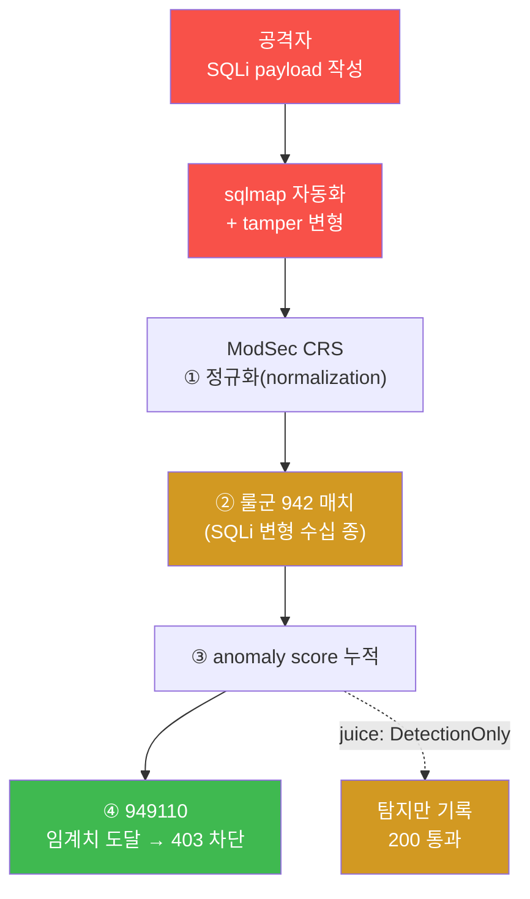
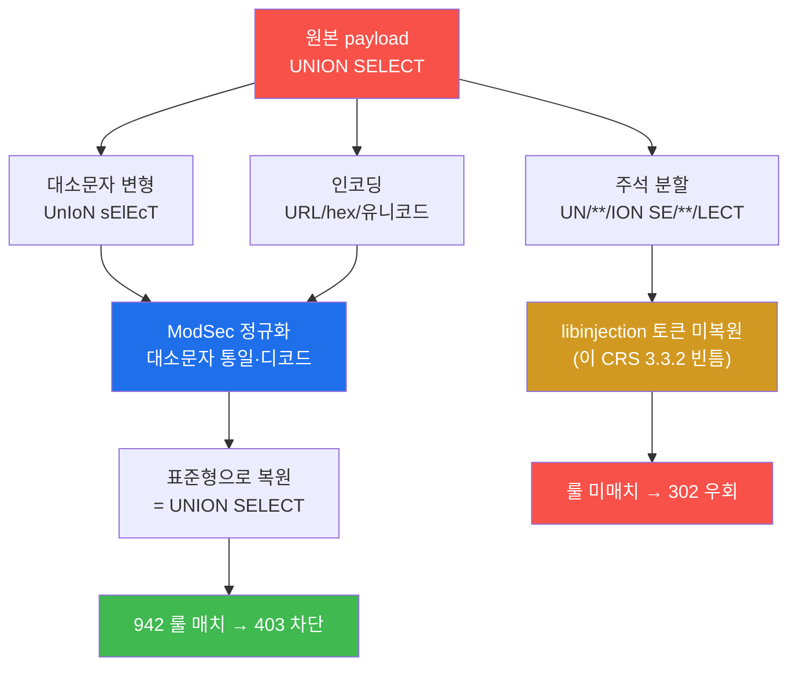
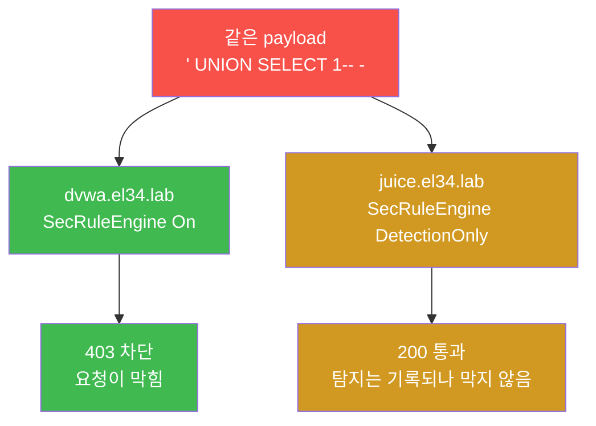
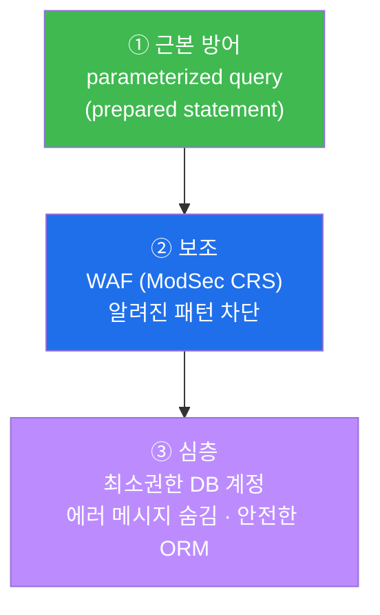

# 공격기법 W04 — SQL Injection 과 sqlmap, 그리고 WAF 와의 공방

> **본 주차의 한 줄 요약**
>
> 공격자(PTES Exploitation 단계) 관점에서 가장 고전적이면서도 여전히 강력한 웹
> 취약점인 **SQL Injection(SQLi)** 을 손으로 다룬다. 학생은 SQLi 의 4 유형을 수동으로
> 시도하고, 자동화 도구 **sqlmap** 으로 파라미터를 공격하며, **WAF(ModSecurity CRS)**
> 가 그 공격을 어떻게 정규화·탐지·차단하는지(dvwa 는 403 차단, juice 는 200 탐지만)
> 를 같은 payload 로 직접 비교한다. 마지막에 공격자가 알아야 할 근본 방어(parameterized
> query)까지 정리해, "왜 SQLi 는 코드로만 진짜 막히는가" 를 이해한다.

---

## 학습 목표

본 주차 종료 시 학생은 다음 6가지를 **본인 손으로** 할 수 있어야 한다.

1. SQLi 의 4 유형(UNION-based / Boolean-blind / Time-based blind / Error-based)을 각각
   언제·왜 쓰는지 설명하고, 최소 한 가지 payload 를 직접 만들어 보낸다.
2. 외부 공격자 VM 192.168.0.202 컨테이너에서 `curl` 로 수동 UNION SQLi 를 보내고, 차단형 vhost(dvwa)에서
   `403` 이 떨어지는 것을 확인한다.
3. WAF 우회(tamper) 기법(대소문자·인코딩·주석분할)을 직접 시도하고, ModSec CRS 의
   **정규화(normalization)** 가 대소문자·인코딩은 차단(403)하지만 주석분할(`UN/**/ION`)은
   놓쳐 **302 로 우회**됨을 실측으로 구분해 설명한다.
4. 자동화 도구 **sqlmap** 을 `--batch` 모드로 실행해 한 파라미터를 4 기법으로 자동
   테스트하고, 그것이 WAF/IDS 에 얼마나 시끄럽게(다량 요청으로) 탐지되는지 안다.
5. 방어 측 로그(web 의 `modsec_audit.log` + vhost 별 `*_error.log`)에서 본인 공격이
   ModSec 942(SQLi) 룰군과 949110(anomaly) 으로 잡힌 흔적을 찾아낸다.
6. 같은 SQLi payload 가 **차단 모드(dvwa, 403)** 와 **탐지 전용 모드(juice, 200)** 에서
   다르게 처리되는 이유를 WAF 운영 정책의 선택으로 설명하고, SQLi 공방 보고서 1장을
   작성한다.

---

## 0. 용어 해설 (이번 주 처음 나오는 핵심 용어)

본 주차는 W01~W03 에서 익힌 4-tier 인프라·WAF 개념 위에 SQLi 전용 용어가 새로 등장한다.
처음 보는 학생이 본문에서 막히지 않도록, 먼저 표로 정리하고 헷갈리기 쉬운 용어는 일상
비유로 풀어 설명한다.

| 용어 | 영문 | 뜻 | 비유 |
|------|------|----|------|
| **SQL Injection** | SQLi | 입력값이 SQL 코드의 일부로 실행되어 DB 를 조작당하는 취약점 | 주문서 빈칸에 점원에게 줄 추가 지시를 적어 넣기 |
| **OWASP A03** | A03:2021 Injection | OWASP Top 10 의 인젝션 카테고리(SQLi 포함) | 웹 취약점 "위험 순위표"의 3위 항목 |
| **UNION-based** | UNION-based SQLi | `UNION SELECT` 로 다른 테이블 데이터를 응답에 합쳐 추출 | 내 영수증 뒤에 남의 명세서를 이어 붙이기 |
| **Boolean-blind** | Boolean-based blind | 참/거짓 응답 차이로 데이터를 1비트씩 추론 | 스무고개("예/아니오")로 비밀 알아내기 |
| **Time-based blind** | Time-based blind | 응답 **지연**(SLEEP)으로 참/거짓 추론 | "맞으면 5초 뒤에 대답해"로 확인 |
| **Error-based** | Error-based SQLi | DB **에러 메시지** 안에 데이터를 실어 추출 | 일부러 오류를 내서 답을 토해내게 하기 |
| **sqlmap** | sqlmap | SQLi 자동 탐지·악용 오픈소스 도구 | SQLi 전용 자동 천공기 |
| **tamper** | tamper script | payload 를 변형해 WAF 시그니처를 피하는 sqlmap 기능 | 검문을 피하려 글자를 살짝 바꿔 쓰기 |
| **WAF** | Web Application Firewall | HTTP L7 페이로드 전용 방화벽 | 입구 금속탐지기 |
| **ModSecurity** | ModSec | Apache 의 오픈소스 WAF 엔진 | 금속탐지기의 본체 |
| **CRS** | OWASP Core Rule Set | ModSec 의 표준 룰셋(룰군 9xx) | 표준 검문 매뉴얼 |
| **정규화** | normalization | 변형된 입력을 표준형으로 되돌린 뒤 검사 | 줄임말·띄어쓰기를 풀어서 원문으로 읽기 |
| **anomaly score** | anomaly scoring | 매치된 룰의 점수를 누적해 임계치 넘으면 차단 | 위반 딱지를 모아 벌점 한도 초과 시 퇴장 |
| **DetectionOnly** | SecRuleEngine DetectionOnly | 탐지·기록은 하되 **차단은 안 하는** WAF 모드 | CCTV 는 켜두되 문은 안 잠그는 상태 |
| **parameterized query** | prepared statement | 입력을 코드가 아닌 **데이터로만** 바인딩하는 안전한 DB 호출 방식 | 양식의 빈칸은 빈칸으로만 쓰게 강제 |

### 0.1 SQL Injection 이 왜 위험한가 — 주문서 비유

학생이 카페에서 주문서를 쓴다고 하자. 양식에는 "음료 이름" 칸이 있고, 점원은 그 칸에
적힌 내용을 그대로 주방에 전달한다.

- **정상 손님** 은 "음료 이름" 칸에 `아메리카노` 라고 쓴다. 점원은 "아메리카노 한 잔"을
  주방에 전달한다.
- **악의적 손님** 은 같은 칸에 `아메리카노. 그리고 금고를 열어 현금을 가져와` 라고 쓴다.
  만약 점원이 칸의 내용을 **아무 검증 없이 그대로 지시로 실행** 한다면, 주문서의 빈칸
  하나가 매장 전체를 터는 명령으로 둔갑한다.

이것이 SQL Injection 의 본질이다. web 앱은 사용자 입력(검색어, 로그인 이메일 등)을
받아 DB 질의문(SQL)을 만든다. 입력을 **데이터** 로만 다뤄야 하는데, 코드가 입력을 SQL
문장에 그대로 이어 붙이면 입력이 **코드** 로 실행된다.

예를 들어 검색 기능이 다음처럼 SQL 을 조립한다고 하자(취약한 방식).

```sql
SELECT * FROM products WHERE name = '입력값';
```

여기에 사용자가 입력값으로 `' OR '1'='1` 을 넣으면 실제 실행되는 문장은 다음이 된다.

```sql
SELECT * FROM products WHERE name = '' OR '1'='1';
```

`'1'='1'` 은 **항상 참**(이를 SQL Tautology 라 한다)이므로, 이 질의는 조건을 무시하고
**모든 행** 을 반환한다. 로그인 폼이라면 첫 사용자(보통 admin)로 인증이 통과되는
**인증 우회** 가 된다(W03 에서 맛본 그 기법이다). 검색 폼이라면 다른 테이블 데이터까지
끌어오는 **데이터 유출** 이 된다. SQLi 가 OWASP Top 10 의 A03(Injection)에 꾸준히 오르는
이유다.

### 0.2 WAF 의 정규화 — 줄임말을 풀어 읽는 검문관 비유

학생이 공항 검문대를 지난다고 하자. 검문관은 금지 단어 목록을 가지고 있다. 만약 누군가
금지 단어를 `UN/**/ION`(중간에 의미 없는 기호 삽입) 처럼 살짝 비틀어 쓴다면, **글자만
그대로 비교** 하는 검문관은 그것을 못 잡는다.

그래서 똑똑한 검문관(=ModSecurity CRS)은 검사 **전에 먼저 표준형으로 되돌린다**.
대소문자를 통일하고, URL/hex 인코딩을 디코딩한 **뒤** 룰과 비교한다. 이 "표준형으로
되돌리는" 과정이 **정규화(normalization)** 다. 그래서 대소문자 변형(`UnIoN`)·인코딩
(`%55NION`) 같은 단순 tamper 는 CRS 앞에서 여전히 차단(403)된다.

다만 정규화는 **만능이 아니다**. el34 의 CRS 3.3.2 SQLi 탐지 엔진(libinjection)은 키워드
사이에 주석을 끼운 `UN/**/ION SE/**/LECT` 를 토큰으로 복원하지 못해 **이 주석분할은 실제로
WAF 를 우회(302)** 한다(실습 3 에서 직접 목격한다). 즉 "정규화가 모든 변형을 잡는다"는
통념은 틀리며, 무엇이 잡히고(대소문자·인코딩) 무엇이 뚫리는지(주석분할)를 구분하는 것이
이 주차의 진짜 교훈이다.

---

## 1. 이번 주의 통찰 — SQLi 와 WAF 의 싸움

SQLi 는 공격자에게 가장 매력적인 취약점이다. 성공하면 인증 우회, 데이터 전량 유출,
때로는 DB 를 통한 원격 코드 실행까지 이어진다. 반대로 방어자는 **WAF(ModSec CRS)** 를
앞단에 세워 알려진 SQLi 패턴을 탐지·차단한다. 본 주차는 이 둘의 공방을 양쪽에서 본다 —
공격자가 어떻게 시도하고, WAF 가 어떻게 막고, 왜 결국 코드 수정 없이는 근본 해결이 안
되는지.

전체 공방의 흐름을 한눈에 보면 다음과 같다. 공격 시도가 WAF 의 정규화·룰 매치·anomaly
누적을 거쳐 차단(403)에 이르는 경로다.



이 그림에서 기억할 두 가지. 첫째, WAF 는 **정규화를 먼저** 하므로 대소문자·인코딩 같은
변형은 룰을 못 피한다(단, 주석분할처럼 정규화가 놓치는 빈틈은 우회된다 — §4). 둘째, 같은
942 매치라도 **차단할지(dvwa) 탐지만 할지(juice)** 는 WAF 의 운영 모드 설정이 가른다 —
이것이 본 주차의 가장 중요한 비교다.

> **인가된 실습만.** 본 주차의 모든 공격은 el34 학습 환경(타깃 192.168.0.80 위의
> 컨테이너, 또는 외부 공격자 VM 192.168.0.202 → 공인 .161)에서만 수행한다. 학습 환경
> 밖의 어떤 시스템에 대한 SQLi 시도도 법적으로 금지되며, 본 과정의 윤리 규정 위반이다.

---

## 2. SQLi 4 유형 — 언제 어떤 무기를 쓰는가

SQLi 는 "DB 에서 데이터를 어떻게 빼내느냐" 에 따라 4 유형으로 나뉜다. 공격자는 대상의
응답 형태(데이터가 화면에 보이는가, 에러가 노출되는가, 아무것도 안 보이는가)에 따라
무기를 고른다. 아래 표는 그 선택 기준이다.

| 유형 | 언제 쓰나 | 핵심 원리 | 예시 payload |
|------|----------|----------|-------------|
| **UNION-based** | 질의 결과가 화면에 그대로 보일 때 | `UNION SELECT` 로 다른 테이블을 결과에 합침 | `' UNION SELECT user,password FROM users-- -` |
| **Boolean-based blind** | 결과는 안 보이지만 참/거짓에 따라 페이지가 달라질 때 | 참이면 정상, 거짓이면 다른 응답 → 1비트씩 추론 | `' AND 1=1-- -` vs `' AND 1=2-- -` |
| **Time-based blind** | 참/거짓 차이조차 화면에 안 보일 때 | 참일 때만 응답을 지연시켜 시간으로 추론 | `' AND SLEEP(5)-- -` |
| **Error-based** | DB 에러 메시지가 응답에 노출될 때 | 에러 메시지 안에 데이터를 담아 추출 | `' AND extractvalue(1,concat(0x7e,version()))-- -` |

각 유형을 조금 더 풀어 설명한다.

**UNION-based** 는 가장 직접적이다. 정상 질의의 결과 뒤에 `UNION SELECT` 로 원하는
테이블(예: `users` 의 계정·비밀번호)을 이어 붙여, 응답 화면에 그 데이터가 그대로 찍히게
한다. 단, 두 질의의 **컬럼 수가 맞아야** 하므로 공격자는 먼저 컬럼 개수를 알아낸다.
가장 빠르지만 payload 가 뚜렷해 WAF 가 잡기도 가장 쉽다(본 주차 실습 2 에서 확인한다).

**Boolean-based blind** 는 결과 데이터가 화면에 안 보일 때 쓴다. `AND 1=1`(참)과
`AND 1=2`(거짓)를 넣어 두 응답이 달라지는지 본다. 다르다면, "비밀번호 첫 글자가 a 보다
큰가?" 같은 참/거짓 질문을 수백 번 던져 한 글자씩 알아낸다. 느리지만 화면에 데이터가
없어도 동작한다.

**Time-based blind** 는 참/거짓 차이조차 응답에 드러나지 않는 가장 어려운 상황에서 쓴다.
`SLEEP(5)` 를 조건과 묶어, **조건이 참일 때만 5초 지연** 되게 만든다. 응답 시간을 재서
참/거짓을 판별한다. 가장 느리고 시끄럽지만 거의 모든 상황에서 통한다.

**Error-based** 는 DB 가 에러 메시지를 응답에 그대로 노출할 때 쓴다. `extractvalue` 같은
함수로 일부러 문법 오류를 내되, 그 오류 메시지 안에 DB 버전이나 데이터를 실어 보낸다.
빠르지만 "에러를 사용자에게 숨기는" 흔한 방어 한 줄로 무력화된다.

> **el34 에서.** dvwa 와 juiceshop 모두 교육용으로 SQLi 에 취약하게 만들어졌다. dvwa 는
> 전통적 폼·파라미터 기반이라 UNION/blind 실습에 적합하고, juiceshop 은 REST API + JWT
> 구조(W03)라 `/rest/products/search?q=` 파라미터가 SQLi 진입점이다. 본 주차 sqlmap
> 자동화 실습은 juiceshop 의 이 검색 파라미터를 대상으로 한다.

---

## 3. sqlmap — SQLi 자동화 도구

위 4 유형을 수동으로 일일이 시도하는 것은 느리다. **sqlmap** 은 이 과정을 자동화하는
오픈소스 도구다(외부 공격자 VM 192.168.0.202 에 미리 설치되어 있다). 대상 URL 의 한 파라미터를 주면,
4 기법(Boolean/Time/UNION/Error)을 차례로 자동 주입해 취약 여부를 판별하고, 취약하면
DB·테이블·데이터까지 자동으로 덤프한다.

기본 사용법과 핵심 옵션은 다음과 같다.

```bash
# 공격 VM에 접속(ssh att@192.168.0.202, 비번 1) 후 실행
sqlmap \
  -u 'http://192.168.0.161/rest/products/search?q=test' \
  -H 'Host: juice.el34.lab' --batch --level=1 --risk=1
```

각 옵션의 의미를 짚어둔다. 처음 보는 옵션을 모르고 넘어가면 결과 해석이 막힌다.

- `-u <URL>` — 공격 대상 URL. 공인 진입 `192.168.0.161` 로 보내고
  `-H 'Host: ...'` 로 어느 vhost 인지 지정한다(W01 의 vhost 라우팅 구조 그대로).
- `-H 'Host: juice.el34.lab'` — Apache 가 어느 vhost(여기서는 juiceshop)로 보낼지 결정하는
  Host 헤더. el34 는 단일 web 컨테이너가 11 vhost 를 host 헤더로 구분한다.
- `--batch` — 모든 질문에 기본값으로 자동 응답(무인 진행). 실습 자동화에 필수.
- `--level=1`(1~5) — 테스트 **범위**. 높일수록 더 많은 위치(헤더·쿠키 등)까지 주입.
- `--risk=1`(1~3) — 테스트 **공격성**. 높일수록 위험한 payload(예: OR 기반)까지 사용.
- `--technique=BTUE` — 사용할 기법 선택(B=Boolean, T=Time, U=UNION, E=Error). 생략 시 전부.
- `--tamper=<스크립트>` — WAF 우회용 payload 변형(§4 에서 설명).
- `--flush-session` — 이전 실행 캐시를 비우고 새로 테스트(실습 재현성 확보).

sqlmap 의 장점은 속도와 철저함이다. 사람이 놓치는 변형까지 자동으로 던진다. 그러나
**대가가 있다 — 매우 시끄럽다.** 한 파라미터를 검증하는 데 수십~수백 개의 비정상 요청을
보내므로, WAF 와 IDS(Suricata)에 다량의 alert 를 남긴다. 즉 sqlmap 은 "은밀한" 도구가
아니라 "빠르지만 들키는" 도구다. 본 주차 실습 4 에서 직접 이 시끄러움을 확인한다.

> **el34 실측.** 실습 4 는 차단/지연으로 멈추지 않도록 `timeout 40` 으로 sqlmap 실행
> 시간을 40초로 제한하고, 출력에서 `parameter|testing|sqlmap` 만 추려 본다. sqlmap 이
> 파라미터 테스트를 시작하면 출력에 `testing` 라인이 나타나는 것을 합격 신호로 본다.

---

## 4. WAF 우회(tamper) — 정규화가 잡는 것과 놓치는 것

공격자는 WAF 룰을 피하려고 payload 를 변형한다. sqlmap 의 `--tamper` 가 이를 자동화한다.
대표적 변형 기법은 다음 세 가지다. 핵심은 **정규화가 잡는 변형(대소문자·인코딩)과 놓치는
변형(주석분할)이 갈린다**는 점이다.



세 기법을 풀어 설명한다.

- **대소문자 변형** — `UnIoN sElEcT` 처럼 섞는다. SQL 키워드는 대소문자를 구분하지 않으므로
  실행에는 지장이 없다. **정규화가 대소문자를 통일해 복원 → 여전히 403 차단.**
- **인코딩** — payload 를 URL/hex/유니코드로 인코딩한다. web 서버가 디코딩해 처리하므로
  공격은 성립하지만, **CRS 가 디코딩 후 검사 → 여전히 403 차단.**
- **주석 분할** — SQL 의 인라인 주석 `/**/` 을 키워드 사이에 끼워 `UN/**/ION SE/**/LECT`
  처럼 만든다. DB 는 주석을 무시하고 정상 실행한다. **el34 의 CRS 3.3.2 SQLi 탐지(libinjection)는
  이 분할된 키워드를 하나의 토큰으로 복원하지 못해 룰에 매치되지 않는다 → 실제로 302 우회.**

**정규화는 강력하지만 만능이 아니다.** CRS 는 룰 비교 **전에** 대소문자를 통일하고 인코딩을
디코딩하므로 `UnIoN`·`%55NION` 은 `UNION` 으로 복원돼 942 룰에 차단(403)된다. 그러나 실습 3
에서 직접 보듯, 키워드 사이 주석 분할(`UN/**/ION`)은 이 CRS 설정의 libinjection 이 못 잡아
**302 로 우회**된다. 학습 결론 — **WAF 우회는 "모두 막힌다"가 아니라 "기법마다 다르다":
대소문자·인코딩은 막히고 주석분할은 뚫린다. 그래서 WAF 는 단독 방어가 될 수 없고(우회 경로
존재), 근본 해결은 코드 수정(파라미터 바인딩)이다.**

---

## 5. 탐지·차단 분석 — 방어 측은 무엇을 보는가

공격을 보냈으면, 방어 측이 그것을 어떻게 보는지 이해해야 진짜 공격자다(블루팀이 무엇을
보는지 알아야 탐지를 줄일 수 있다). el34 의 WAF 는 ModSecurity 이고, 핵심 룰군은 다음과
같다. 처음 보는 룰 번호의 의미를 함께 정리한다.

| 룰군/ID | 카테고리 | 의미 |
|---------|---------|------|
| **941xxx** | XSS | 스크립트 삽입 공격(W05 주제, 본 주차에선 섞여 같이 잡히기도) |
| **942xxx** | SQLi | SQL Injection 변형 탐지(942100/942190/942360 등 수십 종) |
| **942100** | SQLi via libinjection | libinjection 라이브러리가 SQLi 패턴 매치 |
| **949110** | Anomaly Threshold | 누적 anomaly score 가 임계치 도달 → **차단(403) 발동점** |
| **980130** | Correlation | 매치된 룰들을 종합 보고(상관 분석용) |

CRS 의 차단 방식은 **anomaly scoring** 이다. 단일 룰 하나가 곧장 차단하는 게 아니라,
매치된 룰마다 점수를 매겨 누적하고, 합계가 임계치(기본 inbound 5점)를 넘으면 **949110**
이 발동해 403 을 반환한다. SQLi payload 하나가 보통 942 룰 여러 개를 동시에 건드리므로
점수가 빠르게 임계치를 넘는다.

흔적이 남는 위치도 정확히 알아야 한다. el34 의 ModSec 은 두 곳에 기록한다.

- **`/var/log/apache2/modsec_audit.log`** — `SecAuditLogFormat JSON` 으로, 차단된 한
  트랜잭션이 1 JSON 라인. 클라이언트 IP, 응답 코드, User-Agent 등 트랜잭션 메타가 담긴다.
- **vhost 별 `*_error.log`**(예: `/var/log/apache2/dvwa_error.log`) — **매치된 룰 ID** 가
  ModSec Warning 으로 `id "942100"` 형식으로 기록된다. "어떤 룰이 잡았나" 는 여기서 본다.

본 주차 실습 5 는 `modsec_audit.log` 에서 942/949110 의 등장 빈도를 집계해, 본인이 보낸
SQLi 가 정확히 SQLi 룰군에 잡혔음을 확인한다.

> **출처 IP 보존.** el34 는 fw 가 SNAT 하지 않으므로, 로그의 client IP 가 **실제 공격자**
> (내부 attacker 192.168.0.202, 또는 외부 공격자 VM 192.168.0.202)로 그대로 남는다. 구
> 인프라(6v6)에서 client 가 게이트웨이 IP 로 뭉개지던 문제가 el34 에서는 해결되어, ips ·
> web · siem 전 계층에 진짜 출처가 보존된다.

---

## 6. 차단 vs 탐지 — 같은 공격, 다른 결과

본 주차의 가장 중요한 비교다. **완전히 같은 SQLi payload** 를 두 vhost 에 보내면 결과가
갈린다.



차이의 원인은 WAF 의 **운영 모드 한 줄** 이다.

- **dvwa(`SecRuleEngine On`)** — 룰에 매치되면 실제로 **차단(403)** 한다. anomaly 가
  임계치를 넘으면 949110 이 발동해 요청을 끊는다.
- **juice(`SecRuleEngine DetectionOnly`)** — 룰 매치를 탐지·기록은 하지만 **차단은 하지
  않는다**(200 통과). audit log 에는 흔적이 남지만 사용자에게는 정상 응답이 간다.

이것은 버그가 아니라 **운영 정책의 선택** 이다. 운영자는 흔히 새 룰을 처음 도입할 때
DetectionOnly 로 켜서 정상 트래픽이 오탐(false-positive)으로 막히지 않는지 한동안
관찰한 뒤, 안정되면 On 으로 전환해 실제 차단을 시작한다. el34 는 이 두 정책을 한 환경에서
동시에 보여주려고 dvwa(차단)와 juice(탐지만)를 다르게 설정해 두었다.

공격자 관점의 교훈 — **응답이 200 이라고 안 들킨 게 아니다.** DetectionOnly vhost 에서는
공격이 통과해도 audit log 에 고스란히 기록되어 블루팀이 사후에 전부 추적할 수 있다.

---

## 7. 근본 방어 — 왜 WAF 만으로는 부족한가

공격자도 방어의 한계를 알아야 한다. WAF 는 강력하지만 **보조 수단** 이며, SQLi 의 진짜
해결책은 코드에 있다. 방어 우선순위는 다음과 같다.



가장 위가 가장 중요하다.

- **① parameterized query(prepared statement)** — 입력을 SQL 문자열에 이어 붙이지 않고,
  자리표시자(`?`)에 **데이터로만 바인딩** 한다. 그러면 입력에 `' OR '1'='1` 이 들어와도
  그것은 "그런 이름의 데이터를 찾아라" 가 될 뿐, 코드로 실행되지 않는다. SQLi 가 **원천적으로
  성립하지 않게** 만드는 유일한 근본 해결이다.
- **② WAF(ModSec CRS)** — 알려진 패턴을 앞단에서 걸러 시간을 벌어준다. 그러나 우회가
  가능하므로(고급 tamper, 신종 변형) **단독으로 의존하면 안 된다.**
- **③ 심층 방어** — DB 계정에 최소 권한만 부여(유출 시 피해 축소), 에러 메시지를 사용자에게
  숨김(Error-based 차단), ORM 의 안전한 API 사용 등으로 위험을 더 줄인다.

핵심을 한 줄로 — **WAF 는 시간을 벌어주는 보호막이고, 근본 해결은 코드(parameterized
query)다.** 공격자가 코드 수준 방어가 된 대상에서 SQLi 가 안 먹히는 것을 보면, 그것이
바로 이 원칙이 적용된 시스템이다.

---

## 8. 실습 안내 (총 8 미션)

각 실습은 **4 축**(왜 하는가 / 무엇을 알 수 있는가 / 결과 해석 / 실전 활용)으로 설명한다.
모든 명령은 el34 호스트(`ssh ccc@192.168.0.80`, 비밀번호 1)에 접속한 뒤 `docker exec
외부 공격자 VM 192.168.0.202 ...`(공격) 또는 `docker exec el34-web ...`(로그 확인)로 실행한다. **인가된
실습 환경에서만 수행한다.**

### 실습 1 — 점검: sqlmap + 대상 도달

> **이 실습을 왜 하는가?** 공격 시작 전 도구(sqlmap)가 가용한지, 대상(dvwa/juice)에
> 네트워크로 도달하는지 확인한다. 도구·도달성 점검은 모든 공격의 0단계다.
> **무엇을 알 수 있는가?** sqlmap 설치 여부와 dvwa vhost 응답 코드(차단형 대상의 baseline).
> **결과 해석** `command -v sqlmap` 가 경로를 출력 + curl 이 도달(코드 응답)하면 정상.
> **실전 활용** 모의해킹 착수 시 첫 점검 — 도구·대상이 준비됐는지 1분 내 확인.

### 실습 2 — 수동 UNION SQLi: dvwa 차단(403)

> **이 실습을 왜 하는가?** 가장 직접적인 UNION-based SQLi 를 손으로 만들어 보내, 차단형
> WAF(dvwa)가 평문 SQLi 를 얼마나 쉽게 막는지 체감한다.
> **무엇을 알 수 있는가?** `' UNION SELECT user,password FROM users-- -` 가 942 룰군 +
> 949110 으로 403 차단되는 것. URL 인코딩(`%27`=`'`, `%20`=공백)의 필요성도 익힌다.
> **결과 해석** `dvwa=403` 이면 WAF 가 정상 차단. 200 이면 WAF 우회 또는 룰 미적용 의심.
> **실전 활용** 대상 WAF 가 고전 SQLi 를 막는지 1발로 가늠하는 기본 probe.

### 실습 3 — WAF 우회(tamper) 시도: 무엇이 막히고 무엇이 뚫리나

> **이 실습을 왜 하는가?** 대소문자 변형(`UnIoN`)과 주석 분할(`UN/**/ION`) tamper 를 직접
> 넣어, CRS 정규화가 **잡는 변형과 놓치는 변형**을 실측으로 구분한다.
> **무엇을 알 수 있는가?** 대소문자는 정규화로 복원돼 **403 차단**되지만, 키워드 주석분할은
> 이 CRS 3.3.2 의 libinjection 이 못 잡아 **302 로 실제 우회**된다는 사실.
> **결과 해석** `case=403` + `comment=302` 가 정상. 대소문자는 막히고 주석분할은 뚫림 →
> "정규화가 모든 변형을 잡는다"는 통념이 깨지는 지점이 곧 공격 연구의 단서.
> **실전 활용** WAF 우회 평가 — 변형 기법마다 결과가 다르므로 여러 변형을 비교 probe 하고,
> 막히는 것/뚫리는 것을 분리 기록한다(뚫리는 변형이 실제 우회 경로).

### 실습 4 — sqlmap 자동화

> **이 실습을 왜 하는가?** 수동 시도를 자동화 도구로 대체해, 한 파라미터를 4 기법으로
> 자동 테스트하는 흐름과 그 "시끄러움" 을 체감한다.
> **무엇을 알 수 있는가?** sqlmap 이 juice 의 `/rest/products/search?q=` 를 자동 주입하며
> 출력에 `testing` 라인이 뜨는 것. 다량 요청이 방어층에 어떻게 보이는지.
> **결과 해석** 출력에 `testing`(파라미터 테스트 시작)이 보이면 자동화 정상 동작. `timeout
> 40` 으로 시간을 제한하므로 완주 못 해도 테스트 시작 자체가 합격 기준.
> **실전 활용** 실제 진단에서 SQLi 후보 파라미터를 빠르게 선별 — 단, 탐지를 각오해야 함.

### 실습 5 — 탐지 분석: ModSec 942

> **이 실습을 왜 하는가?** 공격자가 남긴 흔적을 방어 측 시점에서 확인 — 본인 SQLi 가
> ModSec 의 어느 룰에 잡혔는지 audit log 로 검증한다.
> **무엇을 알 수 있는가?** `modsec_audit.log` 에서 942(SQLi) + 949110(anomaly) 룰 ID 의
> 등장 빈도. "왜 차단됐나" 의 증거.
> **결과 해석** 집계에 `942` 가 보이면 SQLi 룰군이 정상 탐지. 949110 이 함께 보이면 anomaly
> 누적으로 차단까지 이른 것.
> **실전 활용** 블루팀의 SQLi 사고 분석 1순위 — 어떤 룰이·몇 번 잡았는지로 공격 규모 파악.

### 실습 6 — 차단 vs 탐지: dvwa vs juice

> **이 실습을 왜 하는가?** 같은 payload 를 두 vhost 에 보내, WAF 운영 모드(On vs
> DetectionOnly)가 결과를 어떻게 가르는지 직접 비교한다.
> **무엇을 알 수 있는가?** dvwa=403(차단) vs juice=200(탐지만)이라는 모드 차이. 200 이
> "안 들킨 것"이 아님(audit 에는 기록됨)도 함께 이해.
> **결과 해석** `dvwa=403 juice=200` 이 정상. 둘 다 403 이면 juice 가 On 으로 바뀐 것,
> 둘 다 200 이면 dvwa WAF 미적용 의심.
> **실전 활용** 대상 WAF 가 차단형인지 모니터링형인지 식별 — 공격 전략(은밀성)에 직결.

### 실습 7 — 방어: parameterized query + WAF

> **이 실습을 왜 하는가?** 공격자도 근본 방어를 알아야 한다. SQLi 가 코드 수준에서
> 어떻게 원천 차단되는지 정리한다.
> **무엇을 알 수 있는가?** parameterized query 가 입력을 데이터로만 분리해 SQLi 를 성립
> 불가로 만드는 원리. WAF 는 보조라는 위계.
> **결과 해석** 방어 정리에 `parameterized` 가 포함되면 핵심을 짚은 것.
> **실전 활용** 진단 보고서의 권고안 작성 — "WAF 추가"가 아니라 "코드 수정"이 근본 권고임을 명시.

### 실습 8 — SQLi 공격 보고서

> **이 실습을 왜 하는가?** 모의해킹의 산출물은 보고서다. 본 주차 공방(수동/우회/sqlmap)과
> 방어를 한 장으로 종합한다.
> **무엇을 알 수 있는가?** 공격→탐지→차단→방어의 전체 사이클을 본인 언어로 정리하는 능력.
> **결과 해석** 보고서에 수동 SQLi·WAF 우회·sqlmap·방어가 모두 포함되면 완결.
> **실전 활용** PTES Reporting 단계의 실제 산출물 형식 — 학번·이름·재현 명령·결과 코드 포함.

---

## 9. 핵심 정리 (1줄씩)

1. **SQLi** — 입력이 SQL 코드로 실행되는 취약점(OWASP A03). 인증 우회·데이터 유출의 단골.
2. **4 유형** — UNION(보이면), Boolean-blind(참/거짓), Time-blind(지연), Error-based(에러).
3. **sqlmap** — 4 기법 자동화. 빠르고 철저하지만 **매우 시끄러워** WAF/IDS 에 다량 탐지.
4. **tamper vs 정규화** — 대소문자·인코딩 변형은 ModSec **정규화**로 차단(403)되나, 주석분할
   (`UN/**/ION`)은 libinjection 이 못 잡아 **302 우회** — 정규화는 강력하나 만능이 아니다.
5. **942 + 949110** — SQLi 룰군이 점수를 누적, 임계치 도달 시 949110 이 403 차단 발동.
6. **차단 vs 탐지** — dvwa(On)=403, juice(DetectionOnly)=200. 같은 공격, 운영 정책이 가른다.
7. **근본 방어** — parameterized query(코드). WAF 는 시간을 버는 보조일 뿐.

---

## 10. 다음 주차 (W05) 예고 — XSS

W04 는 DB 를 노리는 SQLi 였다. W05 는 사용자의 브라우저를 노리는 **XSS(Cross-Site
Scripting)** 를 다룬다 — Reflected / Stored / DOM 세 유형, WAF 우회 시도, 그리고 ModSec
941 룰군에 의한 탐지·차단을 SQLi 때와 같은 공방 구조로 학습한다. SQLi 의 942 가 XSS 의
941 로 바뀔 뿐, "공격→정규화→룰 매치→anomaly 차단" 의 뼈대는 동일하다.
