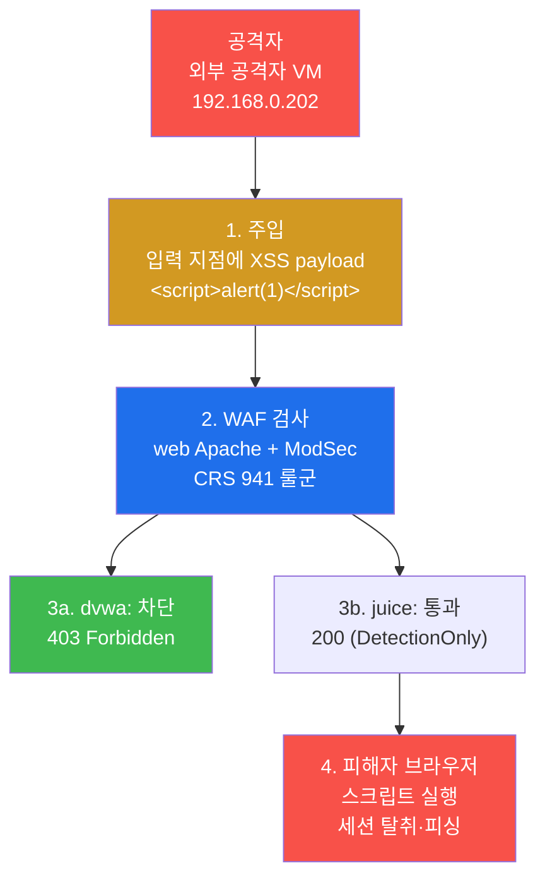
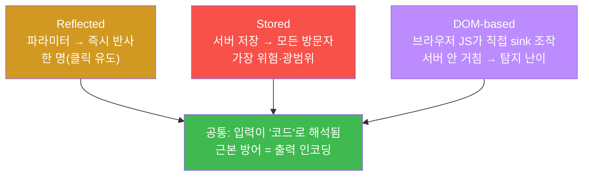
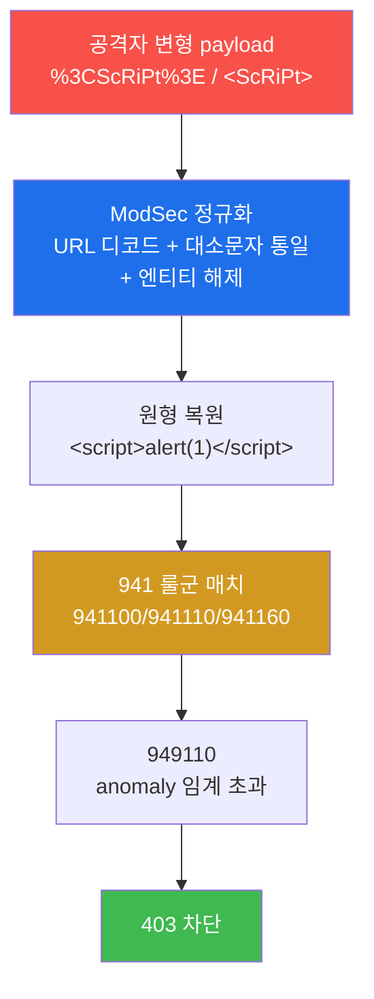
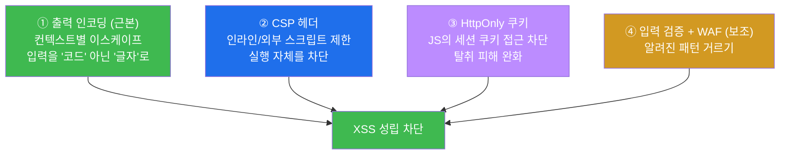

# 공격기법 W05 — XSS(Reflected·Stored·DOM·WAF 우회) vs XSS 탐지·차단

> **본 주차의 한 줄 요약**
>
> XSS(Cross-Site Scripting, 크로스사이트 스크립팅)는 공격자가 심은 JavaScript를 **다른
> 사용자의 브라우저에서** 실행시키는 공격이다. 공격자(`외부 공격자 VM 192.168.0.202`)는 dvwa·juice 두
> 웹앱에 XSS payload(공격용 입력값)를 던지고, 그것이 WAF(ModSecurity CRS 941 룰군)에
> 어떻게 탐지·차단되는지, 그리고 단순 우회가 왜 무력한지를 본인 손으로 확인한다. 마지막엔
> "차단(dvwa 403)" 과 "탐지만(juice 200)" 의 차이, 그리고 공격을 근본적으로 막는 방어
> (출력 인코딩·CSP)까지 정리한다. **모든 실습은 인가된 el34 실습 환경 안에서만 수행한다.**

---

## 학습 목표

본 주차 종료 시 학생은 다음 5가지를 **본인 손으로** 할 수 있어야 한다.

1. XSS 3유형(Reflected / Stored / DOM-based)의 공격 경로와 위험도 차이를, 코드가 어디서
   실행되는지를 기준으로 1분 안에 구분해 설명한다.
2. `외부 공격자 VM 192.168.0.202` 컨테이너에서 `<script>` / `` / `<svg onload>` 등 XSS payload
   변형을 dvwa(`dvwa.el34.lab`)에 전송하고, ModSec이 `403`으로 차단하는 것을 확인한다.
3. URL 인코딩(`%3C`)·대소문자(`<ScRiPt>`) 같은 단순 WAF 우회가 왜 ModSec의 정규화
   (normalization)에 무력한지를 실측으로 입증한다.
4. web 컨테이너의 `modsec_audit.log`에서 본인 공격이 남긴 **941 룰군(XSS)** 의 매치를 찾아
   "탐지 → 누적 → 949110 차단" 의 2단계를 읽어낸다.
5. 같은 XSS가 dvwa(차단, 403)와 juice(탐지만, 200)에서 다르게 처리되는 이유(WAF 운영 모드
   차이)를 설명하고, XSS의 근본 방어(출력 인코딩·CSP·HttpOnly)를 정리한다.

---

## 0. 용어 해설 (이번 주 처음 나오는 용어)

이번 주에 처음 등장하거나, 정확히 짚고 넘어가야 하는 용어를 먼저 정리한다. 본문에서 다시
등장할 때 막히면 이 표로 돌아오면 흐름이 끊기지 않는다.

| 용어 | 영문 | 뜻 | 비유 |
|------|------|----|------|
| **XSS** | Cross-Site Scripting | 공격자의 스크립트를 **다른 사용자 브라우저**에서 실행시키는 공격 | 남의 집 우편함에 가짜 안내문을 넣어 그 집 사람이 따르게 함 |
| **payload** | payload | 공격의 핵심이 되는 입력값(여기선 실행시킬 스크립트 조각) | 편지 봉투 안의 실제 내용물 |
| **sink** | sink | 입력값이 최종적으로 코드로 해석되는 지점(예: `innerHTML`) | 물이 모여 빠지는 배수구 |
| **Reflected XSS** | Reflected XSS | 요청 파라미터가 **즉시 그 응답 페이지에 반사**되어 실행 | 외친 말이 메아리로 즉시 되돌아옴 |
| **Stored XSS** | Stored / Persistent XSS | 서버에 **저장**된 payload가 그 페이지를 보는 모든 사람에게 실행 | 게시판에 붙여둔 독이 든 쪽지 |
| **DOM-based XSS** | DOM-based XSS | 서버를 거치지 않고 **브라우저 JS가 직접** DOM을 조작하다 실행 | 집 안에서 스스로 만든 사고 |
| **WAF** | Web Application Firewall | HTTP L7 페이로드를 검사하는 응용계층 방화벽 | 건물 입구 금속탐지기 |
| **ModSecurity** | ModSecurity (ModSec) | el34 web의 Apache에 붙은 오픈소스 WAF 엔진 | 금속탐지기의 본체 |
| **CRS** | OWASP Core Rule Set | ModSec의 표준 룰셋(룰 ID 9xxxxx 대역) | 표준 검문 매뉴얼 |
| **941 룰군** | REQUEST-941 | CRS 중 **XSS 전용** 룰 파일·ID 묶음 | 매뉴얼의 "위조 흉기" 항목 |
| **anomaly score** | anomaly score | CRS가 룰 위반마다 누적하는 위험 점수(기본 임계 5) | 검문 감점 누적 |
| **949110** | rule 949110 | anomaly 누적이 임계 초과 시 **최종 차단**하는 룰 | 감점 한도 초과 → 퇴장 명령 |
| **URL 인코딩** | percent-encoding | URL에서 특수문자를 `%`+16진수로 표기(공백=`%20`, `<`=`%3C`) | 봉투에 못 쓰는 글자를 코드로 바꿔 적기 |
| **정규화** | normalization | WAF가 인코딩·대소문자를 **원형으로 되돌린 뒤** 검사하는 과정 | 암호로 적힌 글을 풀어서 읽기 |
| **출력 인코딩** | output encoding | 데이터를 화면에 낼 때 코드가 아닌 글자로 보이게 이스케이프 | 위험한 글자를 "그림"으로만 표시 |
| **CSP** | Content-Security-Policy | 브라우저에 "어떤 스크립트만 실행 허용" 을 지시하는 헤더 | 출입 가능한 사람 명단 |

> **헷갈리기 쉬운 한 가지 — XSS는 "서버 해킹" 이 아니다.**
> SQL Injection(W04)이 서버의 DB를 직접 노린다면, XSS는 **피해자의 브라우저**를 노린다.
> 공격자의 코드가 실행되는 무대는 서버가 아니라 그 웹사이트를 열어본 다른 사용자의 화면
> 이다. 그래서 XSS의 진짜 피해(세션 탈취·키로깅·피싱)는 공격자가 아닌 **제3의 피해자**에게
> 발생한다. 이 "남의 브라우저에서 실행" 이라는 점이 XSS를 이해하는 출발점이다.

---

## 1. 이번 주의 통찰 — 남의 브라우저에서 내 코드를 실행한다

### 1.1 한 줄 정의

XSS는 공격자가 웹 애플리케이션의 입력 지점에 JavaScript를 주입하고, 그 스크립트가 **다른
사용자의 브라우저에서 실행**되게 만드는 공격이다. OWASP Top 10 의 A03(Injection) 계열에
속한다. "Injection(주입)" 이라는 점은 SQLi와 같지만, **주입된 코드가 실행되는 장소가
DB(서버)가 아니라 브라우저(클라이언트)** 라는 점이 결정적으로 다르다.

### 1.2 왜 중요한가 — 피해는 제3자에게 간다

웹 애플리케이션은 흔히 사용자가 넣은 값(검색어, 댓글, 프로필)을 그대로 화면에 다시
출력한다. 만약 그 값을 **글자가 아니라 코드로** 해석해 버리면, 공격자가 넣은 스크립트가
그 페이지를 여는 모든 사람의 브라우저에서 실행된다. 그 결과 공격자는 피해자의 권한으로
다음을 할 수 있다.

- **세션 탈취** — 피해자의 세션 쿠키를 읽어 공격자 서버로 전송 → 로그인 가로채기.
- **키로깅 / 폼 탈취** — 피해자가 입력하는 아이디·비밀번호를 가로채기.
- **피싱 / 화면 변조** — 가짜 로그인 창을 그 사이트 안에 띄워 자격증명 입력 유도.
- **워터링홀** — 많은 사람이 보는 페이지(공지·인기 게시글)에 심어 다수를 한 번에 감염.

핵심은 공격자가 서버를 "뚫지" 않고도, 그 사이트를 신뢰하는 사용자들을 노린다는 점이다.

### 1.3 el34 에서 어떻게 — 공격하며 방어를 함께 본다

el34는 공격자의 출처 IP를 `fw → ips → web` 전 계층에 그대로 보존한다(SNAT 하지 않음).
그래서 공격기법 트랙이지만, 본인이 던진 XSS가 **방어 스택(ModSec)에 어떻게 보이는지**를
같은 실습 안에서 확인할 수 있다. 좋은 공격자는 자기 행동이 어떻게 탐지되는지 안다 — 이것이
탐지 회피(고급 우회)의 출발점이다.



위 그림에서 공격이 성공하려면 payload가 WAF를 통과(3b)하고 **피해자 브라우저에서 실행(4)**
되어야 한다. dvwa(차단)에서는 3a에서 끊기고, juice(탐지만)에서는 통과하지만 탐지 기록은
남는다.

### 1.4 한계 / 주의

XSS는 "남이 보는 페이지" 가 있어야 효과가 크다(특히 Stored). 그리고 본 실습의 핵심 검증은
**payload가 실제로 브라우저에서 실행되는지** 가 아니라, payload가 **WAF에 탐지·차단되는지**
(HTTP 응답 코드와 ModSec 로그)다. el34 실습은 `curl`로 payload를 전송해 응답 코드(403/200)와
ModSec 941 매치로 공방을 확인한다 — 실제 브라우저 팝업(`alert(1)`)을 띄우는 것이 목표가
아니다. **그리고 이 모든 시도는 인가된 el34 실습 환경 안에서만 한다.** 외부 사이트를 대상으로
한 XSS 시도는 불법이다.

---

## 2. XSS 3유형 — 코드가 어디서 실행되는가

XSS를 가르는 기준은 "payload가 **어디를 거쳐** 피해자 브라우저에 도달하는가" 다. 이 경로에
따라 위험도와 탐지 난이도가 달라진다.

| 유형 | 경로 | 특징 | 위험도 |
|------|------|------|--------|
| **Reflected** | 요청 파라미터 → **즉시** 그 응답에 반사 | 악성 링크 클릭을 유도(피싱) | 중 |
| **Stored** | 서버에 **저장**(댓글·프로필) → 보는 모든 사람 | 지속·광범위, **가장 위험** | 상 |
| **DOM-based** | 클라이언트 JS가 **직접** DOM 조작 | 서버를 안 거침 → 서버측 탐지 어려움 | 중~상 |

### 2.1 Reflected XSS — 메아리처럼 즉시 되돌아온다

**한 줄 정의**: URL 파라미터 등 요청에 담긴 값이 **그 즉시** 응답 페이지에 그대로 출력되어
실행되는 XSS다.

**왜 중요한가**: 저장되지 않으므로 공격자는 피해자가 **악성 링크를 클릭**하게 만들어야
한다(이메일·메신저로 유도). 한 번의 클릭이 한 명에게 작동하는 표적형이다.

**el34 에서 어떻게**: `dvwa.el34.lab`의 검색 파라미터(`?q=`)에 `<script>`를 실어 보내면,
정상 동작이라면 그 값이 결과 페이지에 반사된다. 하지만 dvwa는 ModSec 차단 모드라 941 룰군이
이를 잡아 `403`을 돌려준다.

```bash
# Reflected XSS 전송 (dvwa = 차단 모드 → 403 예상)
curl -s -o /dev/null -w 'xss=%{http_code}\n' -H 'Host: dvwa.el34.lab' 'http://192.168.0.161/?q=<script>alert(1)</script>'
```

위 명령에서 `-o /dev/null`은 본문을 버리고, `-w 'xss=%{http_code}\n'`은 응답 코드만 출력
하라는 뜻이다. `-H 'Host: dvwa.el34.lab'`은 web Apache의 vhost 라우팅을 위해 어느
가상호스트로 보낼지 지정한다. 출력이 `xss=403`이면 ModSec이 차단한 것이다.

### 2.2 Stored XSS — 한 번 심으면 모두에게

**한 줄 정의**: 공격자의 payload가 서버 DB·파일에 **저장**되어, 그 콘텐츠를 보는 **모든
방문자**의 브라우저에서 실행되는 XSS다. Persistent XSS 라고도 한다.

**왜 중요한가**: Reflected와 달리 클릭 유도가 필요 없다. 인기 게시글·공지·프로필처럼 많은
사람이 보는 곳에 한 번 심으면 광범위하게 퍼진다. 그래서 **3유형 중 가장 위험**하다.

**el34 에서 어떻게**: 게시판·프로필 입력에 payload를 저장하는 시나리오가 해당한다. 본 lab의
검증은 단순화를 위해 파라미터 전송(Reflected 형태)으로 941 탐지를 확인하지만, 개념적으로
저장형이 가장 위험하다는 점을 반드시 이해해야 한다.

### 2.3 DOM-based XSS — 서버를 거치지 않는다

**한 줄 정의**: 서버 응답은 정상인데, **브라우저의 JavaScript가** URL 조각(`location.hash`
등)을 읽어 `innerHTML` 같은 **sink**에 직접 넣다가 스크립트가 실행되는 XSS다.

**왜 중요한가**: payload가 서버로 전송되지 않고 브라우저 안에서만 처리될 수 있어, **서버측
WAF(ModSec)나 서버 로그로는 탐지가 어렵다**. 방어는 클라이언트 JS 코드 자체를 고쳐야 한다
(`innerHTML` 대신 `textContent` 사용 등).



세 유형 모두 뿌리는 같다 — **사용자 입력이 글자가 아니라 코드로 해석**된다는 것. 그래서
근본 방어도 공통(출력 인코딩)이며, 이는 §5에서 다룬다.

---

## 3. XSS payload 변형 — `<script>` 가 막히면

방어자가 `<script>` 만 막으면 공격자는 다른 방식으로 스크립트를 실행시킨다. XSS payload는
"태그 + 이벤트 핸들러 + 스킴" 의 조합으로 무수히 변형된다. 처음 보는 학생을 위해 각 변형이
**왜 스크립트를 실행시키는지** 풀이한다.

| payload | 분류 | 실행 원리 |
|---------|------|----------|
| `<script>alert(1)</script>` | 기본 스크립트 태그 | `<script>` 안의 코드를 브라우저가 직접 실행 |
| `` | 이벤트 핸들러 | 존재하지 않는 이미지(`src=x`) 로딩 실패 → `onerror` 이벤트로 코드 실행 |
| `<svg onload=alert(1)>` | 이벤트 핸들러 | SVG 요소가 로드되는 순간 `onload` 이벤트로 코드 실행 |
| `<body onload=alert(1)>` | 태그 이벤트 | 페이지 본문 로드 시 `onload`로 실행 |
| `javascript:alert(1)` | 스킴(scheme) | 링크의 `href`가 `javascript:` 스킴이면 클릭 시 코드 실행 |

핵심은 `<script>` 태그가 없어도 **이벤트 핸들러**(`onerror`, `onload`, `onmouseover` …)나
**스킴**(`javascript:`)만으로 스크립트가 실행된다는 점이다. 그래서 "스크립트 태그만 거르기"
식 방어는 우회된다.

```bash
# 이벤트 핸들러 변형 — 공백을 %20 으로 인코딩해 전송 (el34 사실)
curl -s -o /dev/null -w 'img=%{http_code}\n' -H 'Host: dvwa.el34.lab' 'http://192.168.0.161/?q='
curl -s -o /dev/null -w 'svg=%{http_code}\n' -H 'Host: dvwa.el34.lab' 'http://192.168.0.161/?q=<svg%20onload=alert(1)>'
```

> **el34 실측 주의 — payload 안의 공백은 반드시 `%20`으로 인코딩한다.**
> `` 처럼 payload에 **공백**이 들어가면, 그 공백이 URL과
> `curl` 명령에서 인자 구분자로 잘못 해석되어 요청이 깨진다. 그래서 el34 실습에서는 공백을
> URL 인코딩 값 **`%20`** 으로 바꿔 `` 형태로 보낸다.
> 이렇게 보내도 web Apache는 디코딩해 원형으로 받고, ModSec의 **941 룰군은 `onerror=`·
> `onload=` 같은 이벤트 핸들러 패턴까지 탐지**해 `403`으로 차단한다. 즉 `%20` 인코딩은
> "전송을 위한 표기" 일 뿐 우회 수단이 아니다 — WAF는 정규화 후 검사하기 때문이다(§4).

---

## 4. WAF 우회 시도 — 그리고 단순 우회의 한계

### 4.1 공격자가 시도하는 단순 우회들

공격자는 WAF의 패턴 매칭을 피하려 payload를 변형한다. 대표적인 단순 우회는 다음과 같다.

- **대소문자 섞기** — `<ScRiPt>alert(1)</ScRiPt>` (대문자/소문자 패턴이 다르길 기대).
- **인코딩** — URL 인코딩(`%3Cscript%3E`), HTML 엔티티(`&lt;script&gt;`), 유니코드 인코딩.
- **분할 / 주석** — 문자열을 쪼개거나 주석을 끼워 패턴을 깨뜨리기.

### 4.2 ModSec CRS는 정규화 후 검사한다 — 그래서 무력하다

ModSecurity CRS의 핵심 방어 메커니즘은 **정규화(normalization)** 다. CRS는 패턴을 비교하기
**전에** 다음을 먼저 수행한다.

- URL 인코딩을 **디코드**한다(`%3C` → `<`).
- 대소문자를 **통일**한다(`ScRiPt` → `script`).
- HTML 엔티티·중복 인코딩을 풀어 **원형**으로 되돌린다.

그 다음 원형 payload를 941 룰군과 비교하므로, 위 단순 우회는 **대부분 그대로 잡힌다**.



```bash
# 대소문자 우회 + URL 인코딩 우회 — 둘 다 정규화로 무력 (dvwa 403 예상)
curl -s -o /dev/null -w 'case=%{http_code}\n' -H 'Host: dvwa.el34.lab' 'http://192.168.0.161/?q=<ScRiPt>alert(1)</ScRiPt>'
curl -s -o /dev/null -w 'enc=%{http_code}\n' -H 'Host: dvwa.el34.lab' 'http://192.168.0.161/?q=%3Cscript%3Ealert(1)%3C/script%3E'
```

위에서 `%3C`는 `<`, `%3E`는 `>`의 URL 인코딩이다. 공격자는 이렇게 인코딩하면 WAF가 못
알아볼 것을 기대하지만, ModSec은 디코드 후 검사하므로 두 요청 모두 `403`이 떨어진다.

### 4.3 한계 — 단순 우회는 막히지만 고급 우회는 별개

여기서 학생이 오해하면 안 되는 점: **단순 우회가 무력하다고 해서 WAF가 만능은 아니다.**
특정 출력 컨텍스트(예: 이미 `<script>` 블록 안, 특정 속성값 안)에 맞춘 고급 컨텍스트 우회나,
서버를 거치지 않는 DOM-based XSS는 WAF로 잡기 어렵다. 그래서 WAF는 **보조 방어선**일 뿐,
근본 방어는 애플리케이션의 출력 인코딩이다(§5).

---

## 5. 탐지·차단 분석 + 근본 방어

### 5.1 탐지 — ModSec 941 룰군과 949110 차단의 2단계

XSS는 CRS의 **941 룰군(REQUEST-941-APPLICATION-ATTACK-XSS)** 이 탐지한다. el34 환경에서
실제로 매치되는 주요 룰 ID는 다음과 같다.

| 룰 ID | 분류 | 의미 |
|-------|------|------|
| **941100** | XSS via libinjection | `<script>` 등 스크립트 패턴을 libinjection 엔진이 탐지 |
| **941110** | XSS Filter — Script Tag | 스크립트 태그 패턴 매치 |
| **941160** | NoScript XSS — 이벤트 핸들러 | `onerror=` · `onload=` 등 이벤트 핸들러 패턴 매치 |
| **949110** | Inbound Anomaly Threshold | 누적 anomaly score가 임계(기본 5) 초과 → **최종 차단** |

여기서 결정적으로 이해할 것은 **차단이 2단계로 일어난다**는 점이다.

1. 941 룰들이 XSS 패턴을 잡을 때마다 **anomaly score(위험 점수)** 를 누적한다.
2. 그 누적 점수가 임계(기본 5)를 넘으면 **949110** 룰이 발동해 `403`으로 차단한다.

즉 "941이 직접 막았다" 가 아니라 "941이 점수를 올리고 949110이 누적으로 막았다" 가 정확한
독법이다. 검문소에서 의심 정황마다 감점을 매기고, 일정 점수를 넘으면 비로소 퇴장시키는 것과
같다.

```bash
# web 컨테이너의 ModSec audit log 에서 941 매치 집계
docker exec el34-web sh -c 'sudo tail -150 /var/log/apache2/modsec_audit.log | grep -oE "94[0-9]1[0-9]{2}" | sort | uniq -c'
```

이 명령은 최근 audit 로그에서 `941xx`·`949xx` 형식의 룰 ID를 뽑아 개수를 센다. 출력에
`941100`·`941160`·`949110`이 함께 보이면, XSS가 탐지되어(941) 점수가 누적되고 차단(949110)
까지 이른 전 과정이 확인된 것이다.

> **el34 로그 위치 참고.** ModSec audit log는 `SecAuditLogFormat JSON`으로
> `/var/log/apache2/modsec_audit.log`에 한 transaction = 1 JSON 라인으로 쌓인다. 매치된
> 개별 룰 ID는 vhost별 `*_error.log`(예: `dvwa_error.log`)에도 `id "941160"` 형식의 ModSec
> Warning으로 기록된다. 분석 시 두 로그를 함께 보면 "어떤 요청이(audit) 어느 룰에(error)"
> 걸렸는지가 명확해진다.

### 5.2 차단 vs 탐지만 — dvwa(403) vs juice(200)

같은 XSS payload라도 **어느 vhost로 보내느냐**에 따라 결과가 다르다. 이것은 WAF의 **운영
모드** 차이 때문이다.

- **dvwa(`SecRuleEngine On`, 차단 모드)** — 941 탐지 + 949110 누적 → `403`으로 **차단**.
- **juice(DetectionOnly, 탐지만)** — 같은 payload를 941이 **탐지해 로그는 남기되 차단하지
  않고** `200`으로 통과시킨다.

```bash
# 같은 XSS, 다른 WAF 모드 — dvwa=403(차단) vs juice=200(탐지만)
curl -s -o /dev/null -w 'dvwa=%{http_code} ' -H 'Host: dvwa.el34.lab' 'http://192.168.0.161/?q=<script>alert(1)</script>'
curl -s -o /dev/null -w 'juice=%{http_code}\n' -H 'Host: juice.el34.lab' 'http://192.168.0.161/?q=<script>alert(1)</script>'
```

**결과 해석**: `dvwa=403 juice=200`이 정상이다. 이는 버그가 아니라 **의도된 운영 정책**
이다 — DetectionOnly는 신규 룰을 운영에 배포하기 전, 차단 없이 탐지만 하며 오탐(정상 트래픽이
막히는 false-positive)을 먼저 관찰하는 단계다. 운영자는 이 단계에서 안정성을 확인한 뒤
차단 모드로 전환한다. 공격자 관점에서는 juice처럼 탐지만 하는 대상에서는 payload가 통과해
**실제 피해자 브라우저에서 실행될 수 있다**는 점이 위험하다.

### 5.3 방어 — WAF는 보조, 근본은 출력 인코딩

WAF는 단순 우회를 잘 막지만 고급 우회·DOM-based에는 한계가 있다(§4.3). XSS를 **근본적으로**
막는 것은 애플리케이션 코드 차원의 방어다.



- **① 출력 인코딩(context-aware output encoding) — 근본 방어.** 사용자 입력을 화면에 낼 때,
  출력되는 위치(HTML 본문 / 속성값 / JavaScript / URL)에 맞춰 특수문자를 이스케이프한다
  (`<` → `&lt;` 등). 그러면 브라우저가 그 값을 **코드가 아닌 글자**로 표시하므로 스크립트가
  실행되지 않는다. XSS 3유형 모두의 공통 뿌리(입력이 코드로 해석됨)를 끊는다.
- **② CSP(Content-Security-Policy).** HTTP 응답 헤더로 브라우저에 "어떤 출처의 스크립트만
  실행 허용" 을 지시한다. 인라인 스크립트와 외부 출처를 제한하면, 설령 payload가 페이지에
  들어가도 브라우저가 실행을 거부한다. 출력 인코딩이 뚫렸을 때의 **2차 방어선**이다.
- **③ HttpOnly 쿠키.** 세션 쿠키에 `HttpOnly` 속성을 주면 JavaScript가 `document.cookie`로
  쿠키를 읽지 못한다. XSS를 완전히 막지는 못해도 가장 흔한 피해인 **세션 탈취를 완화**한다.
- **④ 입력 검증 + WAF — 보조.** 알려진 악성 패턴을 거르는 보조 수단. 우회 가능하므로 단독
  방어로 의존해서는 안 된다.

> **정리.** 근본은 **출력 인코딩**, 2차선은 **CSP**, 피해 완화는 **HttpOnly**, 보조는
> **입력 검증·WAF**. WAF(ModSec 941)는 공격을 줄여주지만 애플리케이션이 안전하게 출력하지
> 않으면 XSS는 결국 성립한다.

---

## 6. 실습 안내 (총 8 미션)

본 주차 실습은 lab의 8개 step(`lab_week05.yaml`)에 대응한다. 모든 명령은 el34 호스트
(`ssh ccc@192.168.0.80`, 비밀번호 1)에 접속한 뒤 `ssh att@192.168.0.202`(공격) ·
`docker exec el34-web`(로그 분석)로 실행한다. **인가된 el34 실습 환경 안에서만** 수행한다.

각 실습은 **4축**으로 설명한다 — 왜 하는가 / 무엇을 알 수 있는가 / 결과 해석 / 실전 활용.

### 실습 1 — 대상 점검 (survey)

- **왜 하는가?** 공격 전, 대상(dvwa·juice) 두 웹앱에 도달 가능한지 먼저 확인한다. 도달성이
  확보되지 않으면 이후 모든 공격 검증이 무의미하다.
- **무엇을 알 수 있는가?** 두 vhost가 응답하는지, 그리고 이후 비교할 두 모드(dvwa=차단,
  juice=탐지만)의 대상이 살아 있는지.
- **결과 해석.** 정상: `dvwa`·`juice` 응답 코드가 출력됨(`200`/`302` 등 도달 신호). 비정상:
  무응답·`503`이면 backend 또는 라우팅 점검.
- **실전 활용.** 침투 첫 단계의 도달성 확인 — 표적이 실제로 응답하는지부터 본다.

### 실습 2 — Reflected XSS (manipulation)

- **왜 하는가?** XSS의 가장 기본형인 Reflected를 직접 던져, 차단 모드 WAF가 어떻게 반응하는지
  본다.
- **무엇을 알 수 있는가?** `<script>alert(1)</script>`가 dvwa에서 941 룰군에 걸려 `403`으로
  차단됨.
- **결과 해석.** 정상(공방 확인): `xss=403`. 만약 `200`이면 해당 vhost가 차단 모드가 아닌지
  확인.
- **실전 활용.** 표적 WAF가 기본 XSS를 막는지 보는 첫 probe. 막힌다면 변형·우회로 넘어간다.

### 실습 3 — XSS payload 변형 (manipulation)

- **왜 하는가?** `<script>`가 막힐 때 공격자가 쓰는 이벤트 핸들러 변형(``,
  `<svg onload>`)을 시도한다. **공백은 `%20`으로 인코딩**해 전송하는 el34 규칙을 익힌다.
- **무엇을 알 수 있는가?** CRS 941이 스크립트 태그뿐 아니라 **이벤트 핸들러 패턴**(941160)도
  탐지·차단함.
- **결과 해석.** 정상: `img`·`svg` 모두 `403`. 변형해도 막힌다는 것은 WAF가 단일 패턴이 아닌
  광범위 XSS 룰군을 갖췄다는 뜻.
- **실전 활용.** "스크립트 태그만 막는" 허술한 WAF인지, 941 룰군 전체를 갖춘 WAF인지 판별.

### 실습 4 — WAF 우회 시도 (manipulation)

- **왜 하는가?** 대소문자(`<ScRiPt>`)·URL 인코딩(`%3Cscript%3E`) 같은 단순 우회를 시도하고,
  그것이 왜 무력한지 실측한다.
- **무엇을 알 수 있는가?** ModSec이 **정규화(디코드·대소문자 통일) 후 검사**하므로 단순
  우회는 그대로 잡힌다.
- **결과 해석.** 정상: `case`·`enc` 모두 여전히 `403`. 단순 우회가 통하지 않음을 확인하는
  것이 이 실습의 산출물.
- **실전 활용.** 우회 가능성 평가 — 단순 우회가 막히면 고급 컨텍스트 우회나 DOM 기반으로
  전략을 바꿔야 함을 안다.

### 실습 5 — 탐지 분석: ModSec 941 (analysis)

- **왜 하는가?** 공격자 관점에서 "내 XSS가 방어 스택에 어떻게 기록되는지" 를 직접 본다.
- **무엇을 알 수 있는가?** `modsec_audit.log`에서 941 룰군의 매치 분포 — 어떤 룰이 몇 번
  잡았고 949110으로 차단됐는지.
- **결과 해석.** 정상: `941`xxx가 보임(941100/941160 등) + `949110`. "941 탐지 → 누적 →
  949110 차단" 의 2단계가 보이면 완벽.
- **실전 활용.** Blue 팀의 WAF 로그 분석 기본기 — 공격자는 이를 보고 "얼마나 시끄러웠는지"
  를 가늠한다.

### 실습 6 — 차단 vs 탐지: dvwa vs juice (analysis)

- **왜 하는가?** 동일 payload가 운영 모드에 따라 다르게 처리됨을 한 화면에서 비교한다.
- **무엇을 알 수 있는가?** dvwa(`SecRuleEngine On`)는 `403` 차단, juice(DetectionOnly)는
  `200` 통과(탐지만).
- **결과 해석.** 정상: `dvwa=403 juice=200`. 이것은 버그가 아니라 의도된 운영 정책(배포 전
  오탐 관찰 단계)이다.
- **실전 활용.** 표적의 WAF가 차단형인지 탐지형인지 파악 — 탐지형이면 payload가 통과해 실제
  피해로 이어질 수 있다.

### 실습 7 — 방어: 출력 인코딩 + CSP (report)

- **왜 하는가?** 공격을 이해한 뒤, 그것을 근본적으로 막는 방어를 정리한다(공격자도 방어를
  알아야 한다).
- **무엇을 알 수 있는가?** 근본 방어 = 출력 인코딩, 2차선 = CSP, 완화 = HttpOnly, 보조 =
  입력 검증·WAF의 우선순위.
- **결과 해석.** 4가지 방어와 그 우선순위를 본인 말로 정리할 수 있으면 합격.
- **실전 활용.** 모의해킹 보고서의 "권고사항(remediation)" 작성 — 단순 "WAF 도입" 이 아니라
  근본 대책을 제시할 수 있어야 한다.

### 실습 8 — XSS 공격 보고서 (report)

- **왜 하는가?** PTES의 마지막 단계(보고)에 해당. 유형·변형·우회·탐지·방어를 한 문서로
  종합한다.
- **무엇을 알 수 있는가?** 한 번의 공방을 재현 가능한 보고서로 구조화하는 능력.
- **결과 해석.** 보고서에 유형(Reflected/Stored/DOM) + payload + WAF 우회 시도와 한계 +
  탐지(dvwa vs juice) + 근본 방어가 모두 포함되면 합격.
- **실전 활용.** 실무 침투 테스트의 최종 산출물 형식 — 발견·증거·영향·권고를 한 문서로.

---

## 7. 핵심 정리 (1줄씩)

1. **XSS** — 공격자의 스크립트를 **다른 사용자 브라우저**에서 실행. 서버가 아니라 피해자가
   당한다.
2. **3유형** — Reflected(즉시 반사) / Stored(저장, 최위험) / DOM-based(브라우저 직접, 탐지
   난이). 뿌리는 같다 — 입력이 코드로 해석됨.
3. **변형** — `<script>`가 막히면 이벤트 핸들러(`onerror`/`onload`)·스킴(`javascript:`)으로.
   el34에서는 payload 공백을 **`%20`** 으로 인코딩해 전송한다.
4. **WAF 우회의 한계** — ModSec은 **정규화 후 검사**하므로 대소문자·URL 인코딩 단순 우회는
   무력(여전히 `403`).
5. **탐지 2단계** — 941 룰군이 탐지해 점수 누적 → **949110**이 임계 초과 시 차단(`403`).
6. **차단 vs 탐지만** — dvwa(`On`, 403) vs juice(DetectionOnly, 200). 같은 공격, 다른 운영
   정책.
7. **근본 방어** — **출력 인코딩**(근본) + CSP(2차선) + HttpOnly(완화) + 입력검증·WAF(보조).

---

## 8. 다음 주차 (W06) 예고 — 권한 경계 넘기(IDOR·무차별 대입·강제 브라우징)

W05는 XSS — 남의 브라우저에서 코드를 실행시키는 공격이었다. W06은 **접근 제어 우회**로
넘어간다. IDOR(Insecure Direct Object Reference, 직접 객체 참조 취약점), 강제 브라우징
(forced browsing), 무차별 대입(brute force)으로 **권한 경계를 넘는** 공격을 다룬다(OWASP
A01 Broken Access Control · A07 Identification and Authentication Failures). XSS가 "코드
실행" 이었다면, W06은 "원래 접근하면 안 되는 자원에 접근" 하는 공격이다.
