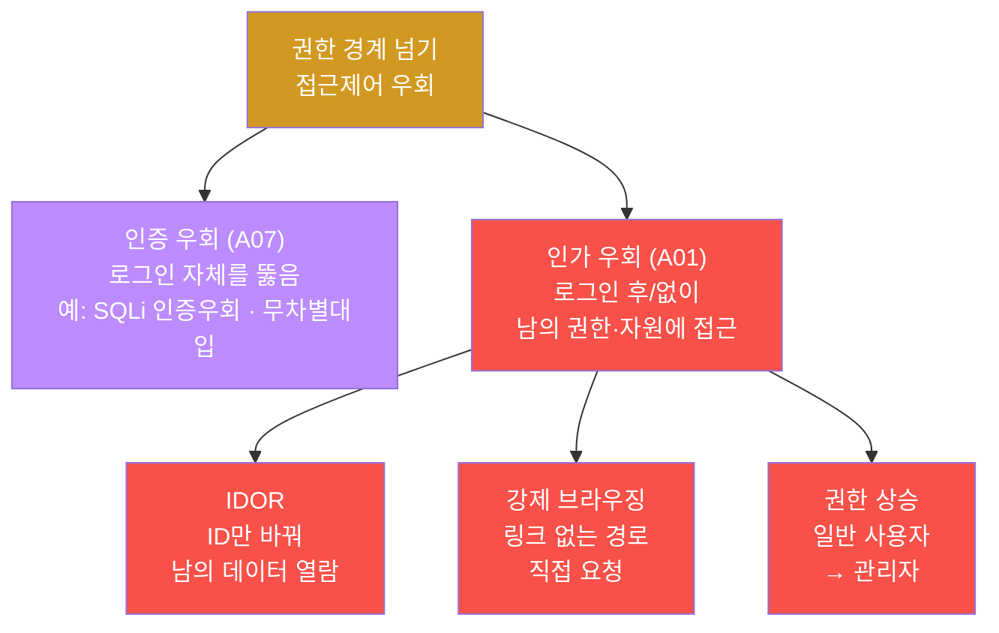
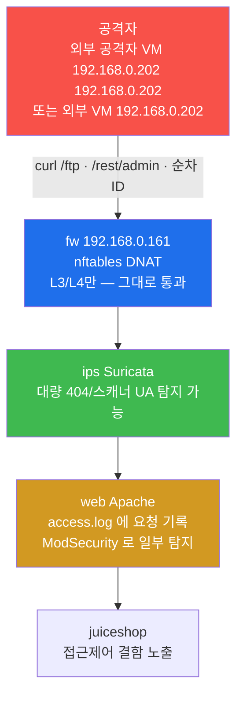
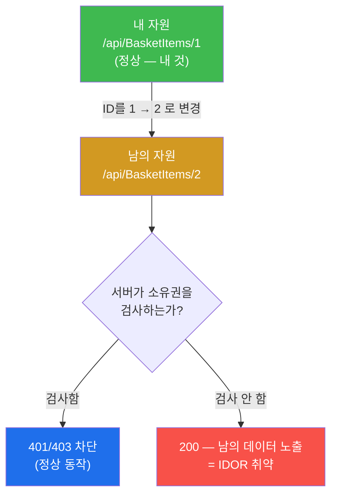

# 공격기법 W06 — 잠기지 않은 문: 접근제어 우회·IDOR·강제 브라우징으로 권한 경계 넘기 (A01·A07)

> **본 주차의 한 줄 요약**
>
> 화려한 익스플로잇 코드 없이도 시스템에 들어갈 수 있다. 가장 흔하고 가장 치명적인
> 웹 취약점은 "**문이 잠겨 있지 않은 것**" — 즉 권한 검사가 빠진 **접근제어(authorization)**
> 결함이다. 본 주차에 학생은 공격자(PTES 익스플로잇 단계) 관점에서 el34 의 juiceshop 을
> 대상으로 **강제 브라우징(forced browsing)**, **접근제어 결함(Broken Access Control,
> OWASP A01)**, **IDOR(객체 ID 조작)** 로 권한 경계를 넘는 방법을 본인 손으로 실습하고,
> 그 공격이 방어 스택(Apache access.log·ModSecurity·IDS)에 어떻게 보이는지, 근본 방어는
> 무엇인지까지 추적한다. **모든 실습은 인가된 el34 환경에서만** 수행한다.

---

## 학습 목표

본 주차 종료 시 학생은 다음 5가지를 **본인 손으로** 할 수 있어야 한다.

1. 인증(authentication)과 인가(authorization)의 차이를 비유 없이 1분 안에 설명하고, 왜
   OWASP **A01(Broken Access Control)** 이 가장 빈번한 1위 취약점인지 근거를 댄다.
2. el34 juiceshop 을 대상으로 **강제 브라우징** 을 수행해, UI 에 링크가 없는 경로
   (`/ftp`) 가 직접 요청만으로 열리는 것을 `curl` 로 입증한다.
3. **무인증 관리 엔드포인트**(`/rest/admin/application-configuration`) 를 토큰 없이
   호출해 A01 결함을 입증하고, 같은 앱 안에서 보호된 엔드포인트(`/api/Users`, 401)와
   비교해 **인가의 비일관성** 이라는 공격 표면을 식별한다.
4. **IDOR** 의 원리(소유권 검사 누락 + 직접 객체 참조)를 이해하고, 순차 ID 를 바꿔가며
   자원에 접근하는 시도를 수행한 뒤, 공개 자원과 보호 자원의 위험도 차이를 판별한다.
5. 접근제어 공격이 Apache access.log 에 남기는 흔적을 찾아 탐지 관점을 익히고, **근본
   방어(서버측 인가 검사 + 기본 deny)** 가 왜 UI 숨김·순차 ID 회피 같은 표면 대책보다
   우월한지 설명한다.

---

## 0. 용어 해설 (접근제어 공격 입문)

본 주차에서 처음 등장하는 핵심 용어를 먼저 정리한다. 본문에서 다시 막히면 이 표로 돌아오면 된다.

| 용어 | 영문 | 뜻 | 비유 |
|------|------|----|------|
| **인증** | Authentication | "너는 **누구**냐"를 확인 (로그인) | 신분증 제시 |
| **인가** | Authorization | "너는 **무엇을 할 수 있냐**"를 확인 (권한) | 출입 가능 구역 확인 |
| **접근제어 결함** | Broken Access Control (A01) | 인가 검사가 누락/허술 | 안내데스크는 통과했는데 모든 방문이 다 열림 |
| **IDOR** | Insecure Direct Object Reference | 자원을 ID 로 직접 참조하는데 소유권 검사 없음 | 1호실 열쇠로 2호실까지 열리는 것 |
| **강제 브라우징** | Forced Browsing | UI 에 링크 없는 경로를 직접 요청 | 안내판에 없는 복도 문을 직접 밀어보기 |
| **권한 상승** | Privilege Escalation | 일반 권한 → 관리자 권한 획득 | 일반 직원증으로 임원실 진입 |
| **무차별대입** | Brute Force | 가능한 값을 대량 시도 (비밀번호·ID 등) | 자물쇠 번호를 0000부터 다 돌려보기 |
| **엔드포인트** | Endpoint | 서버가 응답하는 URL 경로 | 건물 안의 각 방 |
| **순차 ID** | Sequential ID | 1, 2, 3… 처럼 예측 가능한 식별자 | 1호실, 2호실, 3호실 번호 |
| **OWASP Top 10** | — | 가장 위험한 웹 취약점 10선 (업계 표준) | 가장 흔한 침입 수법 명단 |
| **PTES** | Penetration Testing Execution Standard | 침투 테스트 표준 절차 6단계 | 침투 작전 매뉴얼 |
| **기본 deny** | Default Deny | 명시적으로 허용한 것 외에는 전부 차단 | "허가증 없으면 무조건 출입 금지" |

### 0.1 인증과 인가 — 호텔 비유로 한 번에

이 둘은 이름이 비슷해서 신입생이 가장 많이 헷갈린다. 호텔 비유로 확실히 구분하자.

학생이 호텔에 투숙한다고 하자.

- **인증(Authentication)** 은 **체크인 데스크에서 신분증을 보여주고 "당신이 김OO 본인이
  맞다"를 확인받는 절차** 다. "너는 누구냐"에 답하는 단계다. 웹에서는 로그인(아이디 +
  비밀번호, 또는 토큰)이 여기에 해당한다.
- **인가(Authorization)** 는 **체크인을 마친 뒤, 객실 카드키가 "1205호만 열 수 있고
  스위트룸·직원 전용 구역은 못 연다"를 통제하는 절차** 다. "너는 무엇을 할 수 있냐"에
  답하는 단계다. 웹에서는 "이 사용자가 이 자원/기능에 접근할 권한이 있는가"를 검사하는
  단계다.

**핵심.** 인증은 "신원 확인" 한 번이면 끝이지만, 인가는 **사용자가 손대는 모든 자원·기능
마다 매번** 검사해야 한다. 그런데 개발자는 로그인(인증)에는 신경을 많이 쓰면서, "로그인한
사용자가 남의 데이터에 손대지 못하게 막는" 인가 검사는 빠뜨리기 쉽다. **바로 이 빈틈이
A01(Broken Access Control)** 이고, 본 주차의 공격 대상이다.

### 0.2 왜 "잠기지 않은 문"이 가장 위험한가

W03 의 SQL Injection, W05 의 XSS 같은 공격은 정교한 페이로드를 만들어야 한다. 반면 접근제어
공격은 **그냥 다른 URL 을 요청하거나 숫자 하나만 바꾸면** 되는 경우가 많다. 익스플로잇
코드도, WAF 우회 기교도 필요 없다. 그래서 진입 장벽이 낮고, 동시에 피해는 직접적이다 —
바로 데이터·관리 기능에 닿기 때문이다. 이것이 OWASP 가 2021년 Top 10 에서 A01 을 **6위에서
1위로 끌어올린** 이유다. 조사 대상 애플리케이션의 94%에서 어떤 형태로든 접근제어 결함이
발견되었다.

---

## 1. 이번 주의 통찰 — 인증보다 인가가 약하다

### 1.1 한 줄 답: 인가는 "모든 요청마다" 검사해야 하는데 자주 빠진다

앞서 본 대로 인증은 입구에서 한 번 확인하면 끝나지만, 인가는 사용자가 건드리는 자원·기능
하나하나마다 매번 검사해야 한다. 검사 지점이 수십·수백 곳으로 흩어지다 보니 **어딘가는
반드시 빠진다.** 공격자는 바로 그 빠진 지점을 찾는다. 접근제어 공격은 결국 "개발자가 깜빡한
검사 지점" 을 사냥하는 일이다.

접근제어 공격은 크게 세 갈래로 나뉜다. 셋 다 "권한 경계를 넘는다"는 본질은 같고, 넘는
방법만 다르다.



여기서 처음 나온 표준 표기를 풀어두자. **A07(Identification and Authentication
Failures)** 은 OWASP Top 10 의 7번 항목으로, **로그인·세션 관리의 결함** 을 가리킨다 —
약한 비밀번호 정책, 무차별대입을 막지 못하는 것 등. W03 의 SQLi 인증 우회가 여기에
해당한다. **A01(Broken Access Control)** 은 1번 항목으로, **로그인 이후(또는 없이) 권한을
넘는 결함** 이다. 본 주차의 §2~§4 가 모두 A01 에 속한다.

### 1.2 공격자는 자기 공격이 어떻게 보이는지 안다

이 트랙은 공격 과목이지만, el34 는 공격자의 출처 IP 를 `fw → ips → web` 전 계층에 보존한다.
그래서 학생은 공격을 수행하면서 동시에 **그 공격이 방어 스택에 어떻게 기록되는지** 도
관찰한다. 좋은 공격자는 "내가 얼마나 시끄러운가"를 안다 — 이것이 §5 탐지 회피의 출발점이다.



여기서 중요한 사실 하나 — **방화벽(fw)은 접근제어 공격을 막지 못한다.** fw 는 L3/L4
(IP·포트)만 보는 nftables 이므로, `/ftp` 든 `/rest/admin` 이든 똑같은 정상 HTTP 요청으로
보여 그대로 통과시킨다. 접근제어는 **애플리케이션 자신만이** 판단할 수 있는 L7 비즈니스
로직이기 때문이다. 이것이 "방화벽만으로는 안 된다"(W01 Defense in Depth)는 원칙의 구체적
사례다.

---

## 2. 강제 브라우징(Forced Browsing) — 링크 없는 문

### 2.1 한 줄 정의

**강제 브라우징(forced browsing)** 은 애플리케이션 UI 에 링크가 전혀 없는 경로라도, 그
URL 을 **직접 요청하면 응답이 돌아오는** 접근제어 결함을 노리는 기법이다. "강제(forced)"
라는 이름은, 정상적으로 제공되지 않는 경로를 공격자가 **강제로 끌어내** 접근한다는 뜻이다.

### 2.2 왜 중요한가

많은 개발자가 "메뉴에 안 보이게 했으니 사용자가 못 갈 것" 이라고 착각한다. 이것을 **"보안을
숨김으로 달성하기(security through obscurity)"** 라고 하며, 진짜 방어가 아니다. URL 은
숨겨도 추측·노출·열거(W02 의 디렉토리 brute)로 드러나며, 일단 드러나면 서버가 그대로
응답한다. 링크를 지우는 것은 보안 통제가 아니라 그저 안내판을 떼어낸 것에 불과하다.

### 2.3 el34 에서 어떻게 — juiceshop `/ftp`

el34 의 juiceshop 은 `/ftp` 경로에 **디렉토리 리스팅** 이 열려 있다. 메인 화면 어디에도
이 링크는 없지만, 직접 요청하면 **HTTP 200** 으로 디렉토리 목록과 그 안의 파일(예:
`legal.md`)이 그대로 노출된다.

```bash
curl -s -o /dev/null -w 'ftp=%{http_code}\n' http://juice.el34.lab/ftp
```

명령을 한 부분씩 해석하면 다음과 같다.

- `ssh att@192.168.0.202 sh -c "..."` — el34 호스트에서 공격자 컨테이너 안의 셸로
  명령을 실행한다. 모든 실습 명령은 `ssh ccc@192.168.0.80` 로 호스트에 접속한 뒤 이
  형태로 수행한다.
- `curl -s` — `curl` 은 명령줄 HTTP 클라이언트다. `-s`(silent)는 진행률 표시를 숨긴다.
- `-o /dev/null` — 응답 본문은 버린다(우리는 본문이 아니라 상태 코드만 본다).
- `-w 'ftp=%{http_code}\n'` — `-w`(write-out)는 요청이 끝난 뒤 지정한 형식을 출력한다.
  `%{http_code}` 는 HTTP 응답 상태 코드를 넣는 자리표시자다. 결과로 `ftp=200` 같은 한
  줄이 찍힌다.
- 자연 URL `http://juice.el34.lab/...` — 호스트명이 곧 `Host:` 헤더가 되어 juiceshop vhost 로
  지정된다. el34 web 의 Apache 는 이 헤더를 보고 어느 사이트로 보낼지 결정하므로(W01 의 vhost
  라우팅), 호스트명이 juiceshop 도달을 결정한다(공격 VM `/etc/hosts` 등록).
- `http://juice.el34.lab/ftp` — 자연 URL(`/etc/hosts` 로 fw 공인 진입 192.168.0.161 에 매핑). 외부
  공격자 VM 은 이 게이트웨이를 거쳐 web 에 닿는다.

**결과 해석.** `ftp=200` 이 나오면 강제 브라우징 성공이다 — 링크가 없는데도 디렉토리가
열렸다는 뜻이다. 이어서 그 안의 특정 파일을 직접 집어 올 수도 있다.

```bash
curl -s -o /dev/null -w 'legal=%{http_code}\n' http://juice.el34.lab/ftp/legal.md
```

`legal=200` 이면 디렉토리뿐 아니라 그 안의 파일까지 직접 접근된다는 것이 확인된다. 실제
침투에서는 이런 노출 디렉토리에서 백업 파일·설정 파일·소스 코드가 발견되어 더 큰 침해로
이어진다.

### 2.4 한계와 다음 단계

강제 브라우징은 **경로를 알아야** 성공한다. 그래서 W02 에서 배운 디렉토리 무차별대입
(`ffuf` 등)이 짝을 이룬다 — 단어 사전으로 수백·수천 경로를 두드려 숨은 문을 먼저 찾고,
찾은 문을 강제 브라우징으로 연다. 단, 대량 요청은 access.log 와 IDS 에 뚜렷한 패턴(대량
404/403)을 남기므로 시끄럽다(§5).

---

## 3. 접근제어 결함 (Broken Access Control, A01) — 무인증 관리 기능

### 3.1 한 줄 정의

**접근제어 결함(Broken Access Control)** 은 "관리자 전용" 또는 "로그인 사용자 전용" 이어야
할 기능·자원이, **권한 검사 없이** 열려 있는 상태를 말한다. 강제 브라우징이 "숨겨진 경로"를
노린다면, 여기서는 한 발 더 나아가 **민감한 관리 기능 자체가 무인증으로 노출** 된 경우를
다룬다.

### 3.2 왜 중요한가

관리 엔드포인트는 설정 변경·사용자 관리·로그 열람 등 **가장 강력한 기능** 을 제공한다.
여기에 인가 검사가 빠지면 공격자는 로그인조차 하지 않고 시스템의 핵심을 들여다보거나
조작할 수 있다. 데이터 유출·권한 상승의 직접 통로가 된다.

### 3.3 el34 에서 어떻게 — juiceshop `/rest/admin/application-configuration`

el34 juiceshop 의 `/rest/admin/application-configuration` 은 이름 그대로 **관리(admin)
영역의 애플리케이션 설정** 엔드포인트다. 본래라면 관리자 토큰을 가진 사용자만 접근해야
하지만, el34 에서는 **토큰 없이 호출해도 HTTP 200** 으로 설정 정보가 응답된다.

```bash
curl -s -o /dev/null -w 'admincfg=%{http_code}\n' http://juice.el34.lab/rest/admin/application-configuration
```

**결과 해석.**

- `admincfg=200` → **무인증 노출** 이다. 인증 헤더(토큰)를 전혀 보내지 않았는데도 관리
  설정이 돌아왔다 = 인가 검사가 누락된 전형적 A01 결함이다.
- 만약 `admincfg=401`(Unauthorized) 또는 `403`(Forbidden)이 나왔다면 접근제어가 정상
  동작하는 것이다. 401 은 "인증이 필요하다(누구인지 모름)", 403 은 "인증은 됐지만 권한이
  없다"를 뜻한다. el34 juiceshop 에서는 이 엔드포인트가 200 으로 열려 있다.

이 결과가 의미하는 바는 무겁다 — 공격자는 로그인 절차(인증)를 전혀 거치지 않고도 관리
기능에 닿았다. 인증이라는 가장 바깥 방어선이 이 엔드포인트에는 아예 적용되지 않은 것이다.

---

## 4. 접근제어의 비일관성 + IDOR

### 4.1 같은 앱 안에서도 인가가 들쭉날쭉하다

A01 결함의 본질적 위험은 "일관성 없음" 에 있다. 한 애플리케이션 안에서 어떤 엔드포인트는
제대로 보호되고, 어떤 엔드포인트는 뻥 뚫려 있다. 개발자가 일부 지점에서만 인가 검사를
넣었기 때문이다. 공격자는 **보호된 곳과 뚫린 곳을 비교** 해서 빈틈을 정확히 찾는다.

el34 juiceshop 에서 이를 직접 대조해 보자.

```bash
curl -s -o /dev/null -w 'users=%{http_code} ' http://juice.el34.lab/api/Users
curl -s -o /dev/null -w 'admincfg=%{http_code}\n' http://juice.el34.lab/rest/admin/application-configuration
```

**결과 해석.**

- `/api/Users` → **401** : 사용자 목록 엔드포인트는 인증을 요구한다 = **보호됨**.
- `/rest/admin/application-configuration` → **200** : 관리 설정 엔드포인트는 무인증
  노출 = **뚫림**.

같은 juiceshop 안에서 한쪽은 막혀 있고(`users=401`) 다른 쪽은 열려 있다(`admincfg=200`).
이 비일관성 자체가 공격 기회다. 보안 검토 시에는 "전체 엔드포인트를 같은 인가 기준으로
일관되게 보호하고 있는가" 를 점검해야 한다는 교훈이 여기서 나온다.

### 4.2 IDOR — 한 줄 정의

**IDOR(Insecure Direct Object Reference, 안전하지 않은 직접 객체 참조)** 는, 자원을
ID(번호·키)로 **직접 참조** 하는데 서버가 **그 자원이 요청자의 것인지(소유권)를 검사하지
않는** 결함이다. 그 결과 공격자는 URL 의 ID 값만 바꿔서 **남의 자원** 에 접근한다.

### 4.3 왜 중요한가 — 1호실 열쇠로 2호실 열기

호텔로 다시 비유하면, IDOR 는 **"1205호 카드키로 1206호 문이 열리는"** 상황이다. 내
주문 내역 URL 이 `/api/BasketItems/1` 인데, 끝의 숫자를 `2` 로 바꿨더니 다른 사람의 장바구니
(`/api/BasketItems/2`)가 보인다면, 서버가 "이 장바구니가 정말 너의 것이냐" 를 검사하지
않았다는 뜻이다. ID 가 1, 2, 3… 처럼 **순차(예측 가능)** 일수록 공격은 쉬워진다 — 그냥
숫자를 1씩 올리며 전수 조사하면 모든 사용자의 데이터를 긁어올 수 있다.



### 4.4 el34 에서 어떻게 — 순차 자원 시도

IDOR 의 **메커니즘(순차 ID 를 바꿔가며 요청)** 을 안전하게 체험하기 위해, el34 juiceshop
의 제품 엔드포인트(`/rest/products/{id}`)에 순차 ID 로 접근해 본다.

```bash
for i in 1 2 3; do ssh att@192.168.0.202 "curl -s -o /dev/null -w 'product$i=%{http_code} ' http://juice.el34.lab/rest/products/$i"; done; echo
```

명령에서 새로 나온 부분만 풀이한다.

- `for i in 1 2 3; do ... done` — 셸 반복문. `i` 에 1, 2, 3 을 차례로 넣어 명령을 세 번
  실행한다. 끝의 `; echo` 는 마지막에 줄바꿈 한 번을 찍어 출력을 깔끔히 정리한다.
- `/rest/products/$i` — `$i` 자리에 1, 2, 3 이 들어가 `.../products/1`, `.../products/2`,
  `.../products/3` 을 차례로 요청한다. 이것이 바로 "ID 만 바꿔가며 접근" 하는 IDOR 의
  핵심 동작이다.

**결과 해석.** `product1=200 product2=200 product3=200` 처럼 순차 접근이 동작하는 것을
확인한다. 단, 여기서 **반드시 구분해야 할 점** 이 있다.

- 제품 목록(`/rest/products/...`)은 본래 **누구나 볼 수 있는 공개 자원** 이다. 따라서
  여기서 200 이 나오는 것 자체는 취약점이 아니다. 우리는 이 엔드포인트로 **IDOR 의
  방법론(순차 ID 열거)** 을 연습한 것뿐이다.
- 진짜 위험한 IDOR 은 이 동일한 기법을 **보호되어야 할 자원** 에 적용했을 때다. 예를 들어
  장바구니(`/api/BasketItems/{id}`)나 사용자 정보처럼 **타인의 것이어선 안 되는** 자원에
  소유권 검사가 없다면, 같은 순차 열거로 모든 사용자의 데이터가 유출된다. 이것이 OWASP
  에서 별도로 **BOLA(Broken Object Level Authorization)** 라 부르는 가장 치명적인 형태다.

즉 본 실습의 학습 포인트는 "공개 자원에 200 이 떴다"가 아니라, **"순차 ID 를 바꿔 자원에
접근하는 이 동작이, 보호 자원에 소유권 검사가 없을 때 곧 데이터 유출이 된다"** 는 원리를
손으로 체득하는 데 있다.

---

## 5. 탐지와 방어

### 5.1 탐지 — access.log 에 남는 발자국

접근제어 공격은 익스플로잇 페이로드가 없어 WAF 시그니처로는 잡기 어렵지만, **행위 패턴**
으로는 드러난다. 강제 브라우징과 IDOR 열거는 공통적으로 다음 흔적을 남긴다.

- 평소 UI 동선에 없는 경로(`/ftp`, `/rest/admin/...`)에 대한 직접 요청.
- 짧은 시간에 **순차 ID(1, 2, 3…)** 로 같은 엔드포인트를 반복 호출.
- 디렉토리 brute 동반 시 **대량의 404/403** 응답.

el34 web 의 Apache 는 모든 요청을 vhost 별 access.log 에 기록한다. juiceshop 의 로그는
`/var/log/apache2/juice_access.log` 이므로, 여기서 위 패턴을 직접 확인한다.

```bash
ssh ccc@10.20.32.80 'sudo tail -50 /var/log/apache2/*access.log 2>/dev/null | grep -aE "/ftp|/rest/admin" | tail -5'
```

명령 풀이.

- `ssh ccc@10.20.32.80 '...'` — 이번엔 공격자가 아니라 **방어 측 컨테이너(web)**
  안에서 실행한다(탐지는 대상 인프라에서 본다).
- `sudo tail -50 /var/log/apache2/*access.log` — 각 vhost access.log 의 최근 50줄을 읽는다
  (로그 파일은 root 권한이라 `sudo` 가 필요하다).
- `grep -aE "/ftp|/rest/admin"` — 강제 브라우징·관리 접근 흔적만 골라낸다. `-a` 는 로그를
  텍스트로 강제 처리, `-E` 는 확장 정규식(`|` = OR)을 쓰기 위함이다.

**결과 해석.** `/ftp` 와 `/rest/admin` 에 대한 요청 줄이 보이면, 방금 우리가 수행한 접근제어
공격이 그대로 기록되었다는 뜻이다. 운영 관점에서는 이런 비정상 경로 접근·대량 404·순차 ID
패턴을 **IDS 룰(예: Suricata)** 이나 SIEM 상관분석으로 자동 탐지하도록 만든다. (el34 의
attack-w06 공방전에서는 이 패턴을 Suricata `local.rules`(sid 9406001)로 룰화하는 것이
방어 측 과제다.)

### 5.2 방어 — 근본은 "서버측 인가 검사 + 기본 deny"

접근제어 결함의 **유일한 근본 방어** 는, 모든 자원·기능 접근 지점에서 **서버가** 권한을
검사하는 것이다. 표면 대책과 근본 대책을 명확히 구분해야 한다.

| 구분 | 대책 | 평가 |
|------|------|------|
| **근본 (O)** | 모든 자원에 **서버측 인가 검사**(역할 + 소유권) | 우회 불가 — 진짜 방어 |
| **근본 (O)** | **기본 deny** — 명시적 허용 외 전부 차단 | 검사 누락 시에도 안전 |
| **근본 (O)** | IDOR 대비 — 소유권 검증 또는 **간접 참조 맵핑** | 핵심 |
| 표면 (보조) | 순차 ID 대신 UUID(예측 어려운 ID) 사용 | 보조일 뿐 — 노출되면 뚫림 |
| **방어 아님 (X)** | UI 에서 링크 숨기기 | 강제 브라우징으로 무력화 |
| **방어 아님 (X)** | 클라이언트(브라우저) 측 검사만 | 공격자가 우회 가능 |

여기서 처음 나온 개념을 풀어둔다.

- **기본 deny(default deny)** 는 "명시적으로 허용한 요청 외에는 전부 거부" 하는 정책이다.
  반대인 "기본 allow(일단 허용하고 위험한 것만 차단)" 는, 개발자가 검사를 깜빡한 새
  엔드포인트가 그대로 열려 버린다. 기본 deny 면 깜빡해도 닫혀 있으므로 안전 기본값
  (secure by default)이 된다.
- **간접 참조 맵핑(indirect object reference)** 은, 실제 DB 의 객체 ID 를 외부에 그대로
  노출하지 않고, 사용자 세션별로 임의 매핑(예: 내 장바구니는 항상 "1번"으로 보이되 서버가
  실제 소유자 ID 로 변환)을 두는 기법이다. ID 를 바꿔도 남의 자원으로 연결되지 않는다.
- **UUID** 는 `f47ac10b-58cc-...` 같은 사실상 추측 불가능한 식별자다. 순차 ID 열거를
  어렵게 하지만, **그 자체는 인가가 아니다** — UUID 라도 어딘가에서 노출되면 소유권 검사가
  없는 한 그대로 접근된다. 따라서 UUID 는 보조 수단일 뿐이고, 서버측 인가 검사를 대체할 수
  없다.

**한 문장 결론.** UI 숨김·링크 제거·순차 ID 회피는 모두 "안내판을 떼는 일" 일 뿐, 문 자체를
잠그는 일이 아니다. 문을 잠그는 유일한 방법은 **요청이 들어올 때마다 서버가 "너에게 이걸
할 권한이 있느냐"를 검사하는 것** 이다.

---

## 6. 실습 안내 (총 8 미션)

본 주차 lab(`lab_week06.yaml`)은 8개 미션으로 구성된다. 공격은 내 공격 VM
(`ssh att@192.168.0.202`, 비번 1, 자연 URL), 방어 로그 확인은 웹 장비(`ssh ccc@10.20.32.80`)에
직접 접속해 실행하며, **인가된 el34 실습 환경에서만** 수행한다. 각 미션을 4축(왜·무엇을·결과 해석·실전)으로 안내한다.

### 미션 1 — 대상 점검 (juiceshop 도달성)

- **왜 하는가?** 모든 공격의 0단계는 대상에 닿는지 확인하는 것이다. fw → ips → web →
  juiceshop 경로가 살아 있어야 이후 미션이 의미를 가진다.
- **무엇을 알 수 있는가?** juiceshop vhost(`juice.el34.lab`)로의 요청이 응답을 돌려주는지
  (도달성)와, 본 주차의 공격 대상이 juiceshop 임을 확정한다.
- **결과 해석** — `juice=200`(또는 정상 리다이렉트 코드)이면 도달 성공이다. 응답이 없거나
  연결 거부면 경로 문제이므로 이후 미션을 진행하기 전에 먼저 해결한다.
- **실전 활용** — 침투 테스트의 첫 단계인 대상 가용성 확인에 그대로 대응한다.

### 미션 2 — 강제 브라우징 (`/ftp`)

- **왜 하는가?** UI 에 없는 경로가 직접 요청만으로 열리는 것을 직접 입증하기 위해서다
  (§2).
- **무엇을 알 수 있는가?** `/ftp` 디렉토리와 그 안의 파일(`/ftp/legal.md`)이 200 으로
  노출됨 = 접근제어 누락.
- **결과 해석** — `ftp=200` 이면 강제 브라우징 성공이다. 이는 "링크 숨김은 방어가 아니다"
  를 손으로 확인하는 것이다. 404 가 나온다면 경로/Host 헤더를 점검한다.
- **실전 활용** — 노출 디렉토리에서 백업·설정·소스가 발견되어 더 큰 침해로 번지는 실제
  사고의 출발점이다.

### 미션 3 — 무인증 관리 엔드포인트 (A01)

- **왜 하는가?** 관리 전용 기능이 토큰 없이 열려 있는 전형적 A01 결함을 입증하기 위해서다
  (§3).
- **무엇을 알 수 있는가?** `/rest/admin/application-configuration` 이 무인증 200 으로
  응답 = 인가 검사 누락.
- **결과 해석** — `admincfg=200` 이면 무인증 노출(취약), 401/403 이면 정상 보호다. el34
  에서는 200 이 나온다.
- **실전 활용** — 관리 API 노출은 데이터 유출·권한 상승의 직접 통로다. 보안 점검 시 최우선
  확인 항목.

### 미션 4 — 접근제어 비일관성 (보호 vs 노출)

- **왜 하는가?** 같은 앱 안에서 인가가 들쭉날쭉하다는 사실을 대조로 드러내기 위해서다
  (§4.1).
- **무엇을 알 수 있는가?** `/api/Users`(401, 보호)와 `/rest/admin/...`(200, 노출)의 불일치
  = 일관성 없는 인가가 곧 공격 표면.
- **결과 해석** — `users=401` 과 `admincfg=200` 이 동시에 나오면 비일관성이 입증된다. 둘
  다 같은 코드라면 그 정책이 일관 적용된 것이다.
- **실전 활용** — 전체 엔드포인트를 같은 인가 기준으로 점검해야 한다는 운영 원칙의 근거.

### 미션 5 — IDOR 개념·시도 (순차 자원)

- **왜 하는가?** ID 를 바꿔가며 자원에 접근하는 IDOR 의 방법론을 안전하게 체험하기
  위해서다 (§4.4).
- **무엇을 알 수 있는가?** `/rest/products/{1,2,3}` 을 순차 호출하는 동작과, 공개 자원
  (products)과 보호 자원(basket/user)의 위험도 차이.
- **결과 해석** — `product1=200 product2=200 product3=200` 은 순차 접근이 동작함을
  보여준다. 단, products 는 공개 자원이므로 200 자체는 취약점이 아니며, 핵심은 **이 기법이
  보호 자원에 적용될 때 데이터 유출이 된다** 는 원리다.
- **실전 활용** — 실제 IDOR 헌팅에서는 이 순차 열거를 장바구니·주문·사용자 같은 보호 자원
  ID 에 적용한다.

### 미션 6 — 탐지 (access.log 의 강제 브라우징 패턴)

- **왜 하는가?** 공격자 관점에서 "내 공격이 얼마나 시끄러운가" 를, 방어 관점에서 "이 공격을
  어떻게 잡는가" 를 동시에 익히기 위해서다 (§5.1).
- **무엇을 알 수 있는가?** web 의 access.log 에 `/ftp`·`/rest/admin` 요청이 그대로 기록됨
  = 접근제어 공격은 흔적을 남긴다.
- **결과 해석** — 로그에 해당 경로 요청 줄이 보이면 탐지 가능 신호다. 대량 404/순차 ID
  패턴은 강제 브라우징·IDOR 열거의 대표 지표다.
- **실전 활용** — 이 패턴을 IDS/SIEM 룰로 자동 탐지하도록 만드는 것이 방어 운영의 핵심.

### 미션 7 — 방어 정리 (서버측 인가 + 기본 deny)

- **왜 하는가?** 표면 대책과 근본 대책을 구분해, A01/IDOR 의 진짜 해법을 정리하기
  위해서다 (§5.2).
- **무엇을 알 수 있는가?** 서버측 인가 검사(역할+소유권)와 기본 deny 가 근본이고, UI
  숨김·클라 측 검사·순차 ID 회피는 방어가 아니거나 보조일 뿐이라는 결론.
- **결과 해석** — 정리 내용에 "서버측 인가", "기본 deny" 가 핵심 축으로 포함되면 합격
  수준이다.
- **실전 활용** — 보안 검토 보고서의 권고 항목에 그대로 쓰이는 표준 방어책.

### 미션 8 — 접근제어 공격 보고서

- **왜 하는가?** 공격(강제 브라우징·A01·IDOR)과 방어를 하나의 보고서로 종합하는 PTES
  보고 단계를 연습하기 위해서다.
- **무엇을 알 수 있는가?** 발견한 결함·증거(상태 코드)·탐지·근본 방어를 구조화하는 능력.
- **결과 해석** — 보고서에 강제 브라우징·A01·IDOR·방어가 모두 포함되면 합격이다.
- **실전 활용** — 실제 침투 테스트 산출물(취약점 보고서)의 축소판으로, 현업 보고 형식과
  동일하다.

---

## 7. 다음 주차 (W07) 예고 — SSRF·Path Traversal·악성 업로드

W06 은 "권한 경계를 넘는" 접근제어 공격이었다. W07 은 한 걸음 더 나아가 **"닿으면 안 될
곳에 닿는"** 공격을 다룬다 — 서버가 공격자 대신 내부망에 요청하게 만드는 **SSRF(Server-Side
Request Forgery, A10)**, 경로를 탈출해 시스템 파일을 읽는 **Path Traversal**, 그리고 악성
파일을 올려 실행으로 잇는 **파일 업로드 취약점(A05·A03)** 이다. 접근제어 결함이 "잠기지
않은 문" 이었다면, W07 은 "서버를 내 손발처럼 부리는" 공격이다.
