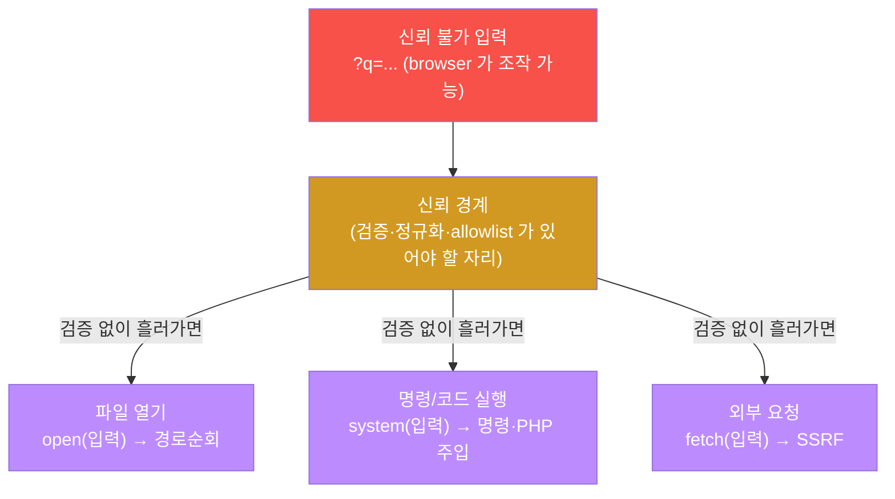
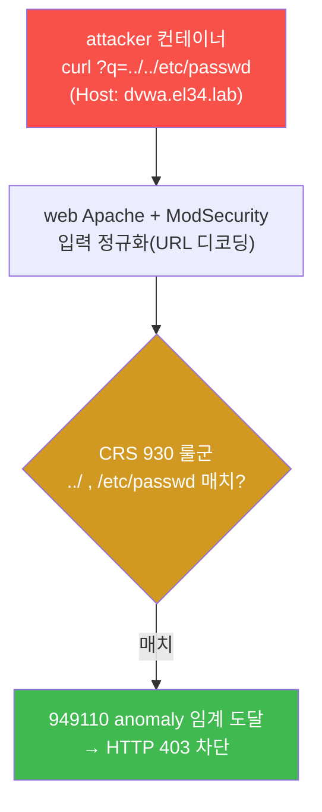
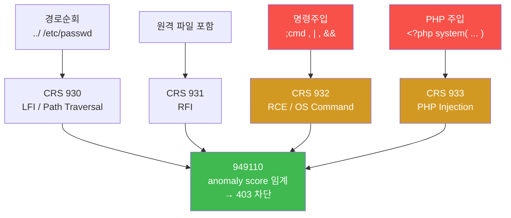
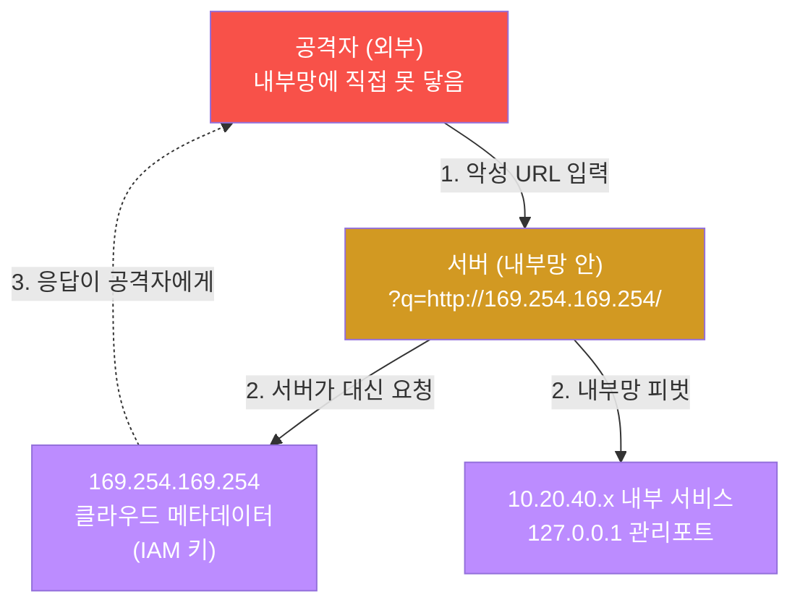
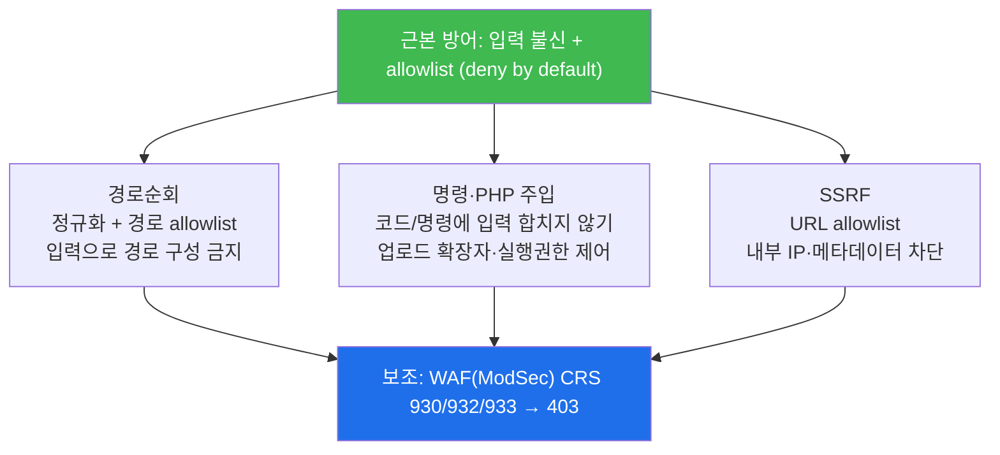

# 공격기법 W07 — 닿으면 안 될 곳에 닿기: 경로순회·명령주입·SSRF (A03·A05·A10)

> **본 주차의 한 줄 요약**
>
> 이번 주의 세 공격은 한 문장으로 묶인다 — **사용자 입력으로 "닿으면 안 될 곳"에 닿는다.**
> 경로순회(Path Traversal)는 입력으로 파일시스템의 경계를 넘어 `/etc/passwd` 같은
> 임의 파일을 읽고, 명령주입(Command Injection)·PHP 주입은 입력이 서버에서 코드로
> 실행되게 만들며, SSRF(Server-Side Request Forgery)는 서버를 시켜 공격자가 직접 닿을
> 수 없는 내부망·클라우드 메타데이터에 요청을 보낸다. 학생은 공격자(PTES) 관점에서
> el34 의 dvwa 를 대상으로 세 공격을 직접 발사하고, 그 시도가 WAF(ModSecurity)의 CRS
> 룰군 930·932·933 에 어떻게 탐지·차단되는지를 확인한다.

---

## 학습 목표

본 주차 종료 시 학생은 다음 5가지를 **본인 손으로** 할 수 있어야 한다.

1. 경로순회·명령주입·SSRF 세 공격이 공통적으로 "입력으로 경계를 넘는다"는 것을 한
   문장으로 설명하고, 각 공격이 넘는 경계(파일시스템 / 코드 실행 / 내부 네트워크)를
   구분한다.
2. el34 의 attacker 컨테이너에서 dvwa 대상으로 `../../etc/passwd` 경로순회를 평문과
   URL 인코딩(`%2e%2e%2f`) 두 형태로 발사하고, 둘 다 ModSec 930 룰군에 `403` 으로
   차단되는 것을 확인한다.
3. `http://169.254.169.254/` 같은 SSRF 페이로드와 `<?php system('id'); ?>` 같은 PHP
   코드 주입을 발사하고, 그 시도가 서버 로그에 어떤 흔적을 남기는지 추적한다.
4. web 컨테이너의 ModSec audit log 에서 930(LFI/경로순회)·931(RFI)·932(RCE/명령주입)·
   933(PHP 주입) 룰군과 949110 anomaly 차단을 직접 읽어내고, 각 룰군이 어느 공격에
   대응하는지 매핑한다.
5. 세 공격의 영향(임의 파일 읽기 → 내부망·클라우드 키 → RCE)과 근본 방어(입력 불신 +
   allowlist + 경로 정규화)를 정리해 공격 보고서로 작성한다.

---

## 0. 용어 해설 (입력 기반 경계 침범 입문)

이번 주 본문에 처음 등장하는 핵심 용어를 먼저 정리한다. 표의 "비유"는 직관을 잡기 위한
것이고, 정확한 의미는 본문에서 다시 풀어 설명한다.

| 용어 | 영문 | 뜻 | 비유 |
|------|------|----|------|
| **경로순회** | Path Traversal | `../` 로 의도된 디렉토리를 벗어나 임의 파일을 읽는 공격 | 호텔에서 내 방 키로 옆방·금고실 문까지 여는 것 |
| **LFI / RFI** | Local / Remote File Inclusion | 서버가 로컬(LFI) 또는 원격(RFI) 파일을 포함·실행하게 만드는 공격 | 직원에게 "이 서류도 같이 읽어줘" 하고 몰래 끼워 넣기 |
| **명령주입** | Command Injection | 입력에 OS 명령(`;cmd`)을 섞어 서버 셸에서 실행시키는 공격 | 주문서 빈칸에 "그리고 금고도 열어" 라고 적어 넣기 |
| **PHP 주입** | PHP Code Injection | `<?php ... ?>` 코드를 입력·파일로 심어 서버에서 실행시키는 공격 | 가짜 양식지를 직원 책상에 올려 진짜처럼 처리시키기 |
| **webshell** | Web Shell | 서버에 심긴 후 web 으로 명령을 받아 실행하는 악성 스크립트 | 건물 안에 몰래 설치한 원격 조종 단말 |
| **RCE** | Remote Code Execution | 공격자가 원격에서 서버 코드를 실행 — 가장 치명적 | 건물 전체 통제권 탈취 |
| **SSRF** | Server-Side Request Forgery | 서버가 공격자가 준 URL로 요청하게 만들어 내부 자원에 닿는 공격 | 직원에게 심부름 보내 출입금지 구역을 대신 다녀오게 시키기 |
| **메타데이터 엔드포인트** | Metadata endpoint | 클라우드 VM 내부에서만 닿는 `169.254.169.254` — IAM 키 등 노출 | 직원만 아는 내부 금고 비밀번호 보관함 |
| **신뢰 경계** | Trust boundary | 신뢰할 수 없는 입력과 신뢰하는 처리 사이의 선 | 외부인과 직원 구역을 나누는 출입통제선 |
| **정규화** | Canonicalization | 경로/입력을 표준 형태로 환원해 우회를 무력화 | 변장한 사람의 본 얼굴을 확인하는 절차 |
| **allowlist** | Allowlist (deny by default) | 허용 목록에 있는 것만 통과, 나머지는 기본 차단 | 사전 등록된 방문객만 입장 허용 |
| **WAF** | Web Application Firewall | HTTP L7 페이로드를 검사하는 응용 계층 방화벽 | 입구 금속탐지기 |
| **ModSecurity** | — | 대표 오픈소스 WAF 엔진 (el34 의 web 컨테이너에 탑재) | 금속탐지기의 실제 기계 |
| **CRS** | OWASP Core Rule Set | ModSecurity 의 표준 룰셋, 룰 ID 대역 9xxxxx | 표준 검문 매뉴얼 |
| **OWASP Top 10** | — | OWASP 가 정리한 web 10대 위험. A03(인젝션)·A05(설정 오류)·A10(SSRF) | 가장 흔한 범죄 유형 순위표 |

> **PTES 관점.** 본 트랙은 공격자(Red) 시점으로 진행한다. PTES(Penetration Testing
> Execution Standard, 모의침투 표준 절차)의 단계로 보면, 이번 주의 세 공격은 정찰
> 이후의 **익스플로잇(Exploitation) — 취약점을 실제로 찔러 영향을 내는** 단계에 해당한다.
> 다만 우리는 인가된 학습 환경(el34) 안에서만 발사하며, dvwa 가 WAF 로 막아주므로
> 실제 파일 탈취나 RCE 가 성립하지는 않는다 — **시도와 탐지를 관찰하는 것이 목표**다.

---

## 0.5 핵심 개념 풀이 — "신뢰 경계"와 "입력으로 경계 넘기"

위 표는 한 줄 정의라 부족하다. 본 절에서는 이번 주를 관통하는 단 하나의 개념,
**신뢰 경계(trust boundary)** 를 일상 비유로 풀어 세 공격이 왜 한 가족인지 설명한다.

### 0.5.1 신뢰 경계 — 출입통제선 비유

회사 건물을 떠올려보자. 건물에는 보이지 않는 선이 하나 있다 — **외부인 구역과 직원
구역을 가르는 출입통제선**이다. 외부인이 가져온 서류(=사용자 입력)는 통제선 바깥의
것이라 그대로 믿으면 안 된다. 반면 통제선 안쪽 직원의 행동(=서버 내부 처리)은 신뢰한다.

web 애플리케이션에서 이 통제선이 바로 **신뢰 경계**다.

- 통제선 **바깥** — browser 가 보낸 URL, 파라미터, 헤더, 업로드 파일. 공격자가 마음대로
  조작할 수 있으므로 **전부 신뢰 불가(untrusted)**.
- 통제선 **안쪽** — 그 입력을 받아 파일을 열고, 명령을 실행하고, 다른 서버에 요청을
  보내는 서버 코드.

사고는 거의 항상 **바깥의 입력이 안쪽의 위험한 동작에 그대로 흘러 들어갈 때** 일어난다.
직원이 외부인의 서류를 검증 없이 그대로 처리하면, 외부인은 직원의 권한을 빌려 출입금지
구역에 닿는다. 이번 주 세 공격은 모두 이 한 패턴의 변종이다.



핵심은 그림 가운데의 **신뢰 경계** 다. 이 자리에 검증(정규화·allowlist)이 비어 있으면
세 갈래 모두로 사고가 난다. 공격 기법 이름은 셋이지만 **고쳐야 할 자리는 하나** —
이것이 이번 주의 통찰이다.

### 0.5.2 왜 WAF 가 보조 방어인가

el34 의 dvwa 는 ModSecurity(WAF)로 이 세 공격을 `403` 으로 막는다. 다만 학생은 처음부터
"WAF 가 있으니 안전하다"고 오해하면 안 된다. WAF 는 **출입통제선 바깥에 세워둔 추가
검문소**일 뿐, 통제선 안쪽 코드가 입력을 신뢰하는 근본 문제를 고치지는 못한다.

- WAF 는 알려진 공격 **패턴**(`../`, `<?php`, `169.254.x.x`)을 보고 막는다 → 새로운
  인코딩·난독화로 우회될 수 있다.
- 근본 방어는 통제선 안쪽 코드가 입력을 **검증·정규화·allowlist** 하는 것이다.

그래서 이번 주 실습은 "WAF 가 막았다(`403`)"를 확인하는 동시에, "그래도 코드 수준
방어가 왜 필요한가"를 §6 에서 정리한다.

---

## 1. 경로순회(Path Traversal) — 파일시스템의 경계 넘기 (A03·A05)

### 1.1 한 줄 정의

**경로순회(Path Traversal)** 는 입력에 `../`(상위 디렉토리로 이동) 를 넣어 애플리케이션이
의도한 디렉토리 밖으로 빠져나가 임의 파일을 읽는 공격이다. OWASP 로는 **A03(인젝션)** 의
일종이자, 잘못된 파일 처리라는 점에서 **A05(보안 설정 오류)** 와도 맞닿는다.

`../` 는 파일시스템에서 "한 단계 위 디렉토리"를 뜻한다. 예를 들어 web 앱이 사용자가
고른 파일을 `/var/www/uploads/<입력>` 으로 연다고 하자. 정상 입력은 `report.pdf` 다.
그런데 공격자가 입력에 `../../../etc/passwd` 를 넣으면 경로는 다음처럼 계산된다.

```
/var/www/uploads/../../../etc/passwd
        └ 한 단계 위로 3번 → /etc/passwd
```

`/etc/passwd` 는 리눅스의 사용자 계정 목록 파일이다. 즉 업로드 폴더만 읽으라고 만든
기능이 시스템 전역의 파일을 읽게 된다.

### 1.2 왜 중요한가

경로순회 한 번이면 공격자는 서버의 **설정 파일·소스 코드·인증서·키** 를 읽어낼 수 있다.
`/etc/passwd` 로 계정 목록을, 앱 설정 파일로 DB 비밀번호를, SSH 키 파일로 다른 서버로의
진입 발판을 얻는다. 즉 단순한 "파일 읽기"가 **자격 증명 탈취 → 측면 이동**의 출발점이 된다.

### 1.3 인코딩 우회 — 변장한 `../`

방어 측이 단순히 문자열 `../` 만 걸러내면, 공격자는 같은 의미를 다른 표기로 "변장"시킨다.
이것을 **인코딩 우회**라 한다. 대표적인 변장은 다음과 같다.

| 표기 | 의미 | 비고 |
|------|------|------|
| `../` | 평문 상위 이동 | 가장 기본 |
| `%2e%2e%2f` | URL 인코딩 (`.`=`%2e`, `/`=`%2f`) | 가장 흔한 우회 |
| `..%2f` , `%2e%2e/` | 부분 인코딩 | 혼합형 |
| `....//` | `../` 한 번 제거 시 다시 `../` 가 되도록 | 단순 치환 방어 무력화 |
| (구식) null byte `%00` | 확장자 검사 절단 | 최신 런타임에서는 대부분 무력 |

방어자는 이 변장을 **정규화(canonicalization)** — 입력을 표준 형태로 되돌려 비교 —
로 무력화해야 한다. ModSecurity 는 검사 전에 URL 디코딩 등 transform 을 적용하므로,
평문이든 `%2e%2e%2f` 든 같은 룰에 잡힌다.

### 1.4 el34 에서 어떻게

el34 의 dvwa(`dvwa.el34.lab`)는 **ModSecurity 차단 모드(`SecRuleEngine On`)** 로 운영된다.
경로순회 페이로드를 보내면 CRS 의 **930 룰군(Local File Inclusion / Path Traversal)** 이
`../` 와 `/etc/passwd` 패턴을 잡아 **HTTP 403** 으로 차단한다. 평문(`../../etc/passwd`)과
URL 인코딩(`%2e%2e%2f%2e%2e%2fetc%2fpasswd`) 모두 정규화 후 같은 룰에 걸려 `403` 이 된다.

> **el34 사실 정리.** dvwa = ModSec **차단(403)**, juice = DetectionOnly(탐지만, 200 통과).
> 그래서 이번 주 "차단 확인" 실습은 dvwa 를 대상으로 한다. 라우팅은 lab 의 검증된 형태인
> attacker → `http://10.20.30.1/?q=<페이로드>` (Host 헤더 `dvwa.el34.lab`) 를 쓴다.



### 1.5 한계 / 주의

WAF 의 930 룰은 **알려진 패턴** 기반이라, 충분히 새로운 인코딩이나 앱 고유의 경로 처리
버그는 우회될 수 있다. 또한 dvwa 는 학습용으로 일부러 취약하게 만들어진 앱이며, 본
실습의 목적은 파일을 실제로 탈취하는 것이 아니라 **시도와 차단을 관찰**하는 것이다.

---

## 2. 명령주입·PHP 주입 — 코드 실행의 경계 넘기 (A03)

### 2.1 명령주입(Command Injection) — 한 줄 정의

**명령주입**은 서버가 사용자 입력을 OS 셸 명령의 일부로 실행할 때, 입력에 `;`, `|`,
`&&` 같은 셸 메타문자와 추가 명령(`;cmd`)을 섞어 **공격자가 원하는 명령을 서버에서
실행**시키는 공격이다.

예를 들어 서버가 사용자가 입력한 호스트로 핑을 보낸다고 하자 — 내부적으로
`ping -c1 <입력>` 을 실행한다. 정상 입력은 `8.8.8.8` 이다. 그런데 공격자가
`8.8.8.8; id` 를 넣으면 셸은 명령 두 개로 해석한다.

```
ping -c1 8.8.8.8 ; id
                  └ 세미콜론 뒤의 두 번째 명령이 서버에서 그대로 실행됨
```

`id` 는 현재 사용자 권한을 출력하는 명령이다. 공격자는 `id` 자리에 무엇이든 넣을 수
있으므로, 이는 곧 **서버에서 임의 명령 실행 = RCE** 로 직행한다.

### 2.2 PHP 주입·webshell — 코드를 심어 실행

dvwa 같은 PHP 앱에서는 공격이 **PHP 코드 주입** 형태로도 나타난다. 공격자는 `<?php ... ?>`
형태의 PHP 코드 조각을 입력하거나 파일로 업로드해, 서버가 그것을 코드로 해석·실행하게
만든다. 대표 페이로드는 다음과 같다.

```php
<?php system('id'); ?>
```

`system('id')` 는 PHP 가 OS 명령 `id` 를 실행하게 하는 함수다. 이런 코드 조각을 서버에
**파일로 심어두고 web 으로 호출해 명령을 받아 실행**하는 악성 스크립트를 **webshell** 이라
한다. webshell 이 한 번 심기면 공격자는 browser 만으로 서버에 명령을 내릴 수 있고, 이는
완전한 **RCE(원격 코드 실행) → 서버 장악**을 뜻한다.

> **악성 업로드와의 연결(A05).** webshell 을 심는 흔한 경로가 **악성 파일 업로드**다.
> 업로드 검사가 허술하면 공격자는 `.php` 확장자 파일을 올려 실행시킨다. 검사가 확장자
> 문자열만 본다면 `.phtml`, `.php5`, 대소문자 변형, MIME 위조, 이미지와 코드를 섞은
> polyglot 으로 우회한다. 그래서 업로드는 **확장자/MIME allowlist + 업로드 디렉토리
> 실행 권한 제거 + 디렉토리 분리** 가 함께 필요하다.

### 2.3 el34 에서 어떻게

dvwa 대상으로 PHP 코드 주입을 보내면 CRS 의 **933 룰군(PHP Injection)** 이 `<?php`,
`system(` 같은 패턴을 잡아 **403** 으로 차단한다. 셸 메타문자를 동반한 명령 실행 시도는
**932 룰군(Remote Code Execution)** 이 잡는다. 즉 이번 주 탐지 분석에서 보는 룰군의
대응 관계는 다음과 같다.



### 2.4 한계 / 주의

ModSec 의 932/933 도 패턴 기반이라, 인코딩·문자열 분할·대체 함수(`passthru`, `exec`,
백틱 등)로 변형하면 우회 가능하다. 또한 본 실습의 `<?php system('id'); ?>` 는 dvwa 에서
`403` 으로 막혀 실제로 실행되지 않는다 — **위험성을 안전하게 시연**하는 것이 목적이다.
명령 실행은 인가된 학습 환경 밖에서는 절대 시도하지 않는다.

---

## 3. SSRF(Server-Side Request Forgery) — 내부 네트워크의 경계 넘기 (A10)

### 3.1 한 줄 정의

**SSRF** 는 서버가 사용자가 준 URL로 요청을 보내는 기능을 악용해, 공격자가 직접 닿을 수
없는 **내부 자원에 서버를 시켜 대신 닿게** 만드는 공격이다. OWASP **A10(SSRF)** 으로
2021 년 Top 10 에 별도 항목으로 신설되었다.

핵심은 **요청의 주체가 서버**라는 점이다. 공격자 PC 는 방화벽 때문에 내부망
(`127.0.0.1`, `10.x.x.x`, 클라우드 메타데이터)에 직접 닿지 못한다. 그러나 서버는 내부망
안에 있다. 공격자가 입력 URL로 `http://169.254.169.254/` 를 주면, 서버가 그 주소로
요청을 보내고 응답을 공격자에게 돌려준다 — 서버를 심부름꾼으로 쓰는 셈이다.

### 3.2 주요 표적

| 표적 | URL 예 | 노리는 것 |
|------|--------|-----------|
| **클라우드 메타데이터** | `http://169.254.169.254/latest/meta-data/` | IAM 임시 키·인스턴스 정보 (클라우드 계정 탈취로 직결) |
| **로컬 관리 서비스** | `http://127.0.0.1:9100/` , `localhost:관리포트` | 인증 없이 열린 내부 관리 API |
| **내부망 스캔** | `http://10.20.40.81/` 등 | 내부 서비스 존재·포트 식별(피벗 준비) |
| **위험 스킴** | `file://`, `gopher://`, `dict://` | 파일 읽기·프로토콜 스머글링 |

특히 **`169.254.169.254`** 는 AWS·GCP·Azure 등 클라우드 VM 내부에서만 닿는 **링크-로컬
메타데이터 주소**다. 여기서 IAM 임시 자격 증명을 얻으면 클라우드 계정 전체로 피해가
번지므로, SSRF 의 가장 위험한 표적으로 꼽힌다.

### 3.3 왜 위험하고, 왜 막기 어려운가

SSRF 는 방화벽을 무력화한다 — 외부 차단이 아무리 견고해도, **이미 내부에 있는 서버**가
대신 요청하기 때문이다. 게다가 정상 기능(이미지 미리보기, URL 미리보기, 웹훅 등)과
구분이 어렵다. 그래서 단순 차단보다 **URL allowlist(허용한 도메인만), 내부 IP 대역 차단,
메타데이터 엔드포인트 차단** 같은 정밀한 방어가 필요하다.



### 3.4 el34 에서 어떻게

el34 의 ModSec/CRS 는 내부 IP·위험 스킴 같은 SSRF 패턴을 일부 탐지한다. 다만 SSRF 는
경로순회·PHP 주입처럼 항상 깔끔하게 `403` 으로 떨어지지 않을 수 있다 — 정상 URL 과
형태가 비슷하기 때문이다. 그래서 이번 주 SSRF 실습의 합격 기준은 "`403` 차단"이 아니라
**"메타데이터/내부 URL 시도가 발사되고 그 흔적이 남는다"** 이다(lab step 3 의 검증 기준이
`ssrf` 문자열 출력인 이유). 학생은 응답 코드를 관찰하며 "WAF 가 SSRF 는 왜 경로순회만큼
확실히 못 막는가"를 토론한다 — 이것이 SSRF 가 별도 Top 10 항목이 된 이유로 이어진다.

> **el34 사실 주의.** el34 는 실제 클라우드가 아니므로 `169.254.169.254` 에서 진짜 IAM
> 키가 나오지는 않는다. 본 실습은 **SSRF 페이로드의 형태와 탐지 흔적**을 익히는 것이
> 목적이며, 실제 메타데이터 탈취를 재현하지는 않는다. 지어내어 "키를 얻었다"고 보고하면
> 안 된다.

---

## 4. 세 공격을 한눈에 — 무엇이 같고 무엇이 다른가

세 공격은 "입력으로 경계를 넘는다"는 한 가족이지만, 넘는 경계와 영향이 다르다.

| 구분 | 경로순회 (A03/A05) | 명령·PHP 주입 (A03) | SSRF (A10) |
|------|--------------------|---------------------|------------|
| 넘는 경계 | 파일시스템 | 코드 실행 | 내부 네트워크 |
| 대표 페이로드 | `../../etc/passwd` | `;id` , `<?php system('id'); ?>` | `http://169.254.169.254/` |
| el34 ModSec 룰군 | 930 (LFI/Traversal) | 932(RCE) / 933(PHP) | 일부 탐지 (확정 403 아님) |
| 직접 영향 | 임의 파일 읽기 | RCE(서버 장악) | 내부망·클라우드 키 |
| 공통 원인 | **신뢰 경계에서 입력 검증 누락** | 동일 | 동일 |
| 공통 방어 | **입력 불신 + allowlist + 정규화** | 동일 | URL allowlist + 내부 IP 차단 |

영향의 사슬로 보면, 경로순회로 **설정·키 파일을 읽고** → SSRF 로 **내부망·클라우드
자격 증명을 얻고** → 업로드/주입으로 **RCE 에 도달**하는 식으로 한 침해 안에서 서로
이어지는 경우가 많다. 다음 주(W08) 중간고사 CTF 가 바로 이 "체인 엮기"를 평가한다.

---

## 5. 탐지 — el34 WAF(ModSecurity) 의 흔적 읽기

### 5.1 CRS 룰군과 anomaly scoring

el34 의 ModSecurity 는 OWASP CRS 를 anomaly scoring 모드로 운영한다. 동작 원리는 다음과
같다 — 각 공격 패턴 룰이 매치되면 점수가 누적되고, 누적 점수가 임계값을 넘으면
**949110(Inbound Anomaly Score Exceeded)** 룰이 최종 `403` 차단을 내린다. 이번 주에 보는
룰군은 다음과 같다.

| 룰군 ID | 카테고리 | 이번 주 대응 공격 |
|---------|----------|-------------------|
| **930xxx** | LFI / Path Traversal | 경로순회 (`../`, `/etc/passwd`) |
| **931xxx** | RFI (Remote File Inclusion) | 원격 파일 포함 |
| **932xxx** | RCE / OS Command Injection | 명령주입 (`;cmd`) |
| **933xxx** | PHP Injection | PHP 주입 / webshell (`<?php`) |
| **949110** | Inbound Anomaly Threshold | 누적 점수 임계 도달 → 최종 차단 |

### 5.2 audit log 에서 읽는 법

ModSec audit log 는 web 컨테이너의 `/var/log/apache2/modsec_audit.log` 에 쌓인다. 매치된
룰 ID 는 6자리 숫자(`930120`, `933160`, `949110` 등) 형태로 기록되므로, 다음처럼 룰군만
추려 보면 어떤 공격 유형이 탐지됐는지 한눈에 파악된다(lab step 5 의 명령).

```bash
docker exec el34-web sh -c 'sudo tail -150 /var/log/apache2/modsec_audit.log \
  | grep -oE "9[0-9]{5}" | sort -u | grep -E "^93[0-9]"'
```

이 명령은 최근 audit log 에서 6자리 룰 ID 를 뽑아(`grep -oE "9[0-9]{5}"`), 중복을 제거하고
(`sort -u`), 93x 대역만 남긴다(`grep -E "^93[0-9]"`). 출력에 `930` 이 보이면 경로순회가,
`933` 이 보이면 PHP 주입이 탐지된 것이다.

> **해석 주의.** 출력에 `930`/`932`/`933` 중 무엇이 보이느냐는 직전에 어떤 페이로드를
> 보냈는지에 달려 있다. 경로순회만 보냈다면 930 만, PHP 주입까지 보냈다면 933 도 함께
> 보인다. lab step 5 의 합격 기준이 `930` 인 이유는, 그 직전 step 2 에서 경로순회를
> 반드시 발사하기 때문이다.

---

## 6. 방어 — 근본은 입력 불신 + allowlist

WAF(ModSec)는 보조 방어다. 근본 방어는 **신뢰 경계 안쪽의 코드**가 입력을 신뢰하지 않는
것이며, 세 공격 모두 공통 원칙으로 막는다.

- **경로순회** — 사용자 입력으로 파일 경로를 직접 만들지 않는다. 불가피하면 입력을
  **정규화(canonicalize)** 한 뒤, 허용된 디렉토리·파일 **allowlist** 안에 있는지 검사한다.
  ID 를 받아 서버가 매핑하는 간접 참조 방식이 더 안전하다.
- **명령·PHP 주입** — 사용자 입력을 셸 명령이나 코드로 절대 합치지 않는다. 외부 명령이
  꼭 필요하면 셸을 거치지 않는 인자 배열 방식(예: `execve` 류)을 쓰고, 인자를 allowlist
  로 제한한다. 업로드는 확장자/MIME allowlist + 업로드 디렉토리 실행 권한 제거 + 디렉토리
  분리를 함께 적용한다.
- **SSRF** — 요청 대상 URL을 **allowlist(허용한 도메인만)** 로 제한하고, 사설/링크-로컬
  IP 대역(`127.0.0.0/8`, `10.0.0.0/8`, `169.254.0.0/16` 등)을 차단하며, 메타데이터
  엔드포인트(`169.254.169.254`)를 명시적으로 막는다. DNS 재바인딩까지 고려해 **해석된
  최종 IP** 를 기준으로 검사한다.

세 방어의 공통 원칙은 단 하나다 — **입력을 신뢰하지 말고, "허용한 것만 통과(deny by
default)"** 한다. WAF 는 이 위에 더해지는 한 겹일 뿐이다.



---

## 7. 실습 안내 (총 8 미션)

각 실습은 **4축 설명**(왜 하는가 / 무엇을 알 수 있는가 / 결과 해석 / 실전 활용) 으로
진행한다. 모든 명령은 el34 호스트(`ssh ccc@192.168.0.80`, 비밀번호 `1`)에서
`docker exec el34-attacker ...` 로 발사하며, **인가된 학습 환경(el34) 안에서만** 시도한다.
실 운영 시스템을 대상으로 한 시도는 절대 금지다.

### 실습 1 — 대상 점검 (dvwa 도달성)

> **왜 하는가?** 공격 전 첫 단계는 표적이 살아 있고 닿는지 확인하는 것이다. dvwa 가
> 응답해야 이후 페이로드가 의미를 가진다.
> **무엇을 알 수 있는가?** attacker → `http://10.20.30.1/`(Host `dvwa.el34.lab`) 경로가
> 정상인지, dvwa 가 차단 모드 대상인지.
> **결과 해석** 응답 코드가 떨어지면(예: 200/302/403 중 무엇이든 HTTP 응답) 도달 정상.
> 아예 응답이 없으면 라우팅·컨테이너 문제.
> **실전 활용** 모의침투 정찰 직후, 익스플로잇 전 "대상 생존 확인"의 표준 절차.

### 실습 2 — 경로순회 발사(평문 + URL 인코딩) → 403

> **왜 하는가?** §1 의 경로순회를 직접 발사해, `../` 가 파일시스템 경계를 넘으려는
> 시도임을 손으로 확인한다.
> **무엇을 알 수 있는가?** 평문(`../../etc/passwd`)과 인코딩(`%2e%2e%2f...`) 둘 다
> ModSec 930 에 `403` 으로 막히는지 — 즉 정규화가 인코딩 우회를 무력화하는지.
> **결과 해석** 둘 다 `403` 이면 WAF 정상 차단. 만약 200 이 나오면 해당 vhost 가 차단
> 모드가 아니거나 룰이 비활성.
> **실전 활용** WAF 가 인코딩 우회까지 막는지 검증하는 표준 테스트.

### 실습 3 — SSRF 시도 (메타데이터 / 내부 URL)

> **왜 하는가?** §3 의 SSRF 페이로드를 발사해, 서버를 시켜 내부 자원에 닿으려는 시도가
> 어떤 형태인지 익힌다.
> **무엇을 알 수 있는가?** `169.254.169.254`(메타데이터)·`127.0.0.1:9100`(로컬 관리)
> URL이 발사되고 흔적이 남는지. SSRF 가 경로순회만큼 깔끔히 `403` 으로 안 막힐 수
> 있다는 점.
> **결과 해석** 합격 기준은 "`403`"이 아니라 **SSRF 시도가 발사됐다**(`ssrf` 출력)는
> 것. 응답 코드는 관찰 대상이며, 왜 SSRF 탐지가 더 어려운지 토론한다.
> **실전 활용** 클라우드 환경 진단 시 SSRF 점검의 첫 페이로드 세트.

### 실습 4 — PHP 코드 주입 → 403

> **왜 하는가?** §2 의 PHP 주입(`<?php system('id'); ?>`)을 발사해, webshell/RCE 시도가
> WAF 에 어떻게 잡히는지 본다.
> **무엇을 알 수 있는가?** ModSec 933(PHP) 이 `<?php`/`system(` 을 잡아 `403` 으로
> 막는지.
> **결과 해석** `403` 이면 정상 차단. 본 실습의 코드는 막혀서 실행되지 않으므로 `id`
> 출력은 나오지 않는다(나오면 안 된다).
> **실전 활용** 업로드/주입 지점에서 코드 실행 가능성을 안전하게 점검하는 방법.

### 실습 5 — 탐지 분석 (ModSec 930/932/933)

> **왜 하는가?** 공격자도 자신의 시도가 방어 측에 어떻게 보이는지 알아야 우회를
> 설계한다. 방어 관점에서 audit log 를 읽는다.
> **무엇을 알 수 있는가?** web 의 modsec_audit.log 에서 930/931/932/933 룰군과 949110
> anomaly 가 어떻게 기록되는지, 각 룰군이 어느 공격에 대응하는지.
> **결과 해석** 출력에 `930` 이 보이면(실습 2 의 경로순회 흔적) 탐지 정상. 보낸
> 페이로드에 따라 933 등도 함께 보인다.
> **실전 활용** SOC/Purple Team 이 WAF 로그로 공격 유형을 분류하는 실무 작업.

### 실습 6 — 영향 정리

> **왜 하는가?** 세 공격의 "그래서 무엇이 위험한가"를 한 표로 정리해 위험도를 체화한다.
> **무엇을 알 수 있는가?** 파일 읽기(경로순회) → 내부망·클라우드 키(SSRF) → RCE(업로드/
> 주입) 로 이어지는 영향의 사슬.
> **결과 해석** 세 영향이 모두 "입력 신뢰의 대가"라는 공통점을 짚으면 충분.
> **실전 활용** 모의침투 보고서의 "영향(Impact)" 절을 쓰는 연습.

### 실습 7 — 방어 정리 (정규화 / allowlist / 내부 IP 차단)

> **왜 하는가?** 공격을 익힌 뒤 근본 방어를 정리해야 학습이 닫힌다.
> **무엇을 알 수 있는가?** 세 공격 각각의 코드 수준 방어와, 그 공통 원칙(입력 불신 +
> allowlist)이 하나라는 것.
> **결과 해석** "WAF 가 막았으니 끝"이 아니라 "코드 방어가 근본"이라는 점을 명시하면
> 합격.
> **실전 활용** 진단 보고서의 "권고(Remediation)" 절 작성.

### 실습 8 — 공격 보고서

> **왜 하는가?** PTES 의 마지막 단계는 보고다. 세 공격·탐지·방어를 하나의 문서로 엮는다.
> **무엇을 알 수 있는가?** 발견 → 영향 → 권고의 보고서 구조를 직접 작성하는 능력.
> **결과 해석** 경로순회·SSRF·업로드(주입) 세 공격 + 탐지(930/932/933) + 방어(allowlist)
> 가 모두 포함되면 합격.
> **실전 활용** 실제 모의침투 결과 보고서의 축약판.

---

## 8. 핵심 정리 (1줄씩)

1. **한 가족, 한 원인** — 경로순회·명령주입·SSRF 는 모두 "신뢰 경계에서 입력 검증이
   빠져 입력이 위험한 동작으로 흘러간" 결과다.
2. **경로순회(A03/A05)** — `../`(평문/인코딩)로 파일시스템 경계를 넘어 임의 파일 읽기.
   el34 dvwa 에서 ModSec **930** → `403`.
3. **명령·PHP 주입(A03)** — `;cmd`·`<?php system( )` 로 서버에서 코드 실행 → RCE.
   el34 에서 ModSec **932(RCE)/933(PHP)** → `403`.
4. **SSRF(A10)** — 서버를 시켜 `169.254.169.254` 등 내부 자원에 닿기. 정상 요청과
   비슷해 탐지가 까다롭다(확정 403 아님).
5. **방어** — 근본은 **입력 불신 + allowlist + 정규화**, WAF(CRS 930/932/933)는 보조 한 겹.
6. **윤리** — 모든 시도는 인가된 el34 안에서만. 메타데이터·RCE 는 시연일 뿐 실제 탈취·
   실행이 아니다.

---

## 9. 다음 주차 (W08) 예고 — 중간고사 CTF

W01–W07 에서 정찰·API/JWT·SQLi·XSS·접근제어, 그리고 이번 주 경로순회·명령주입·SSRF 까지
**개별 기법**을 익혔다. W08 은 중간고사 CTF 다 — 이 기법들을 **하나의 익스플로잇 체인**으로
엮어, 정찰부터 침투·발판·코드 실행까지 이어 **플래그(셸)** 를 캡처한다. 단일 취약점이
아니라 "어느 취약점으로 들어가 어떻게 RCE 까지 가는가"의 경로(kill chain) 를 구성하는
능력을 평가한다. 이번 주의 "영향의 사슬"(파일 읽기 → 내부망/키 → RCE) 이 그 체인의
뼈대가 된다.
