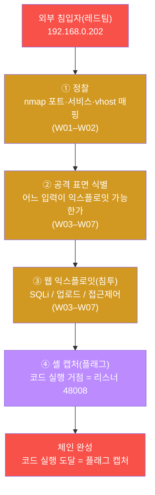
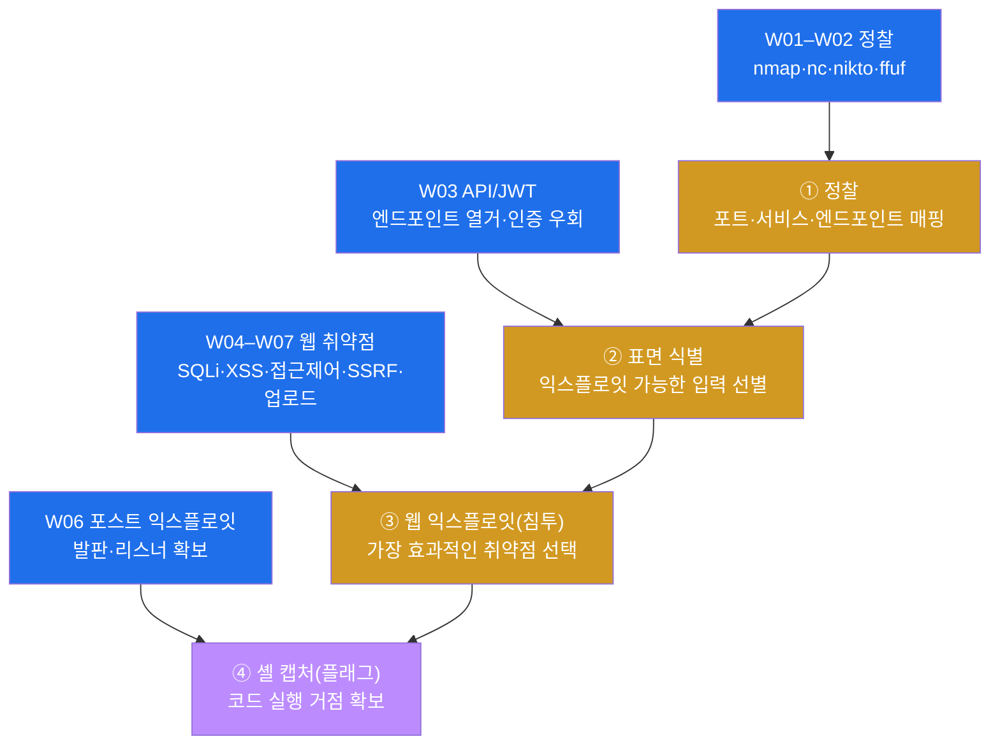
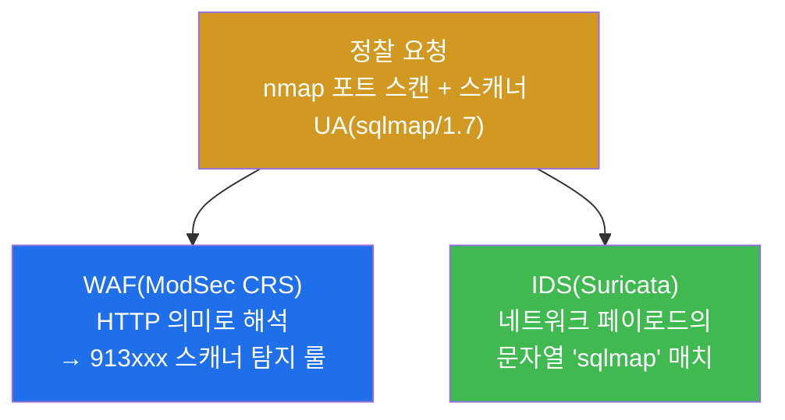
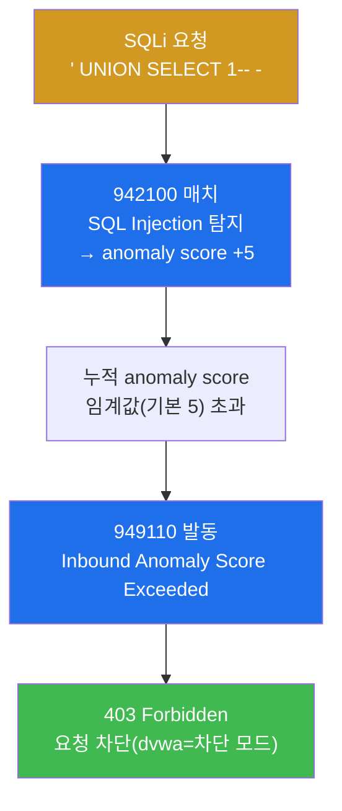
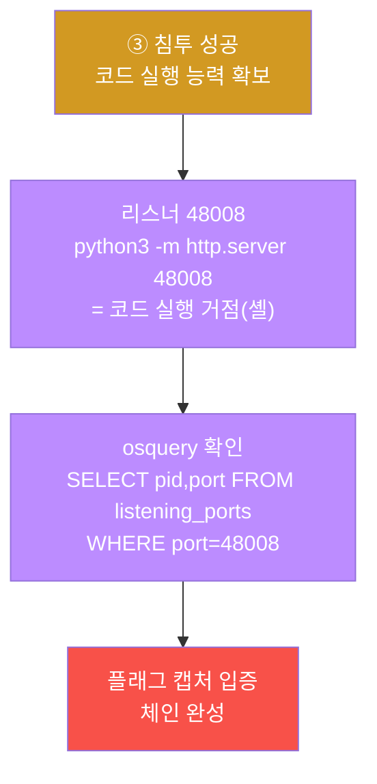
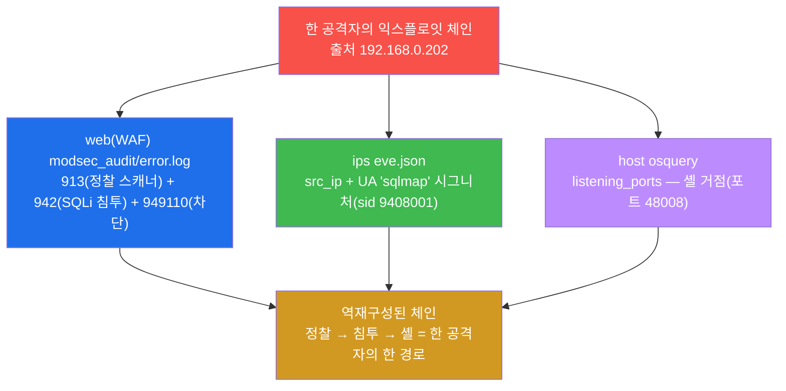
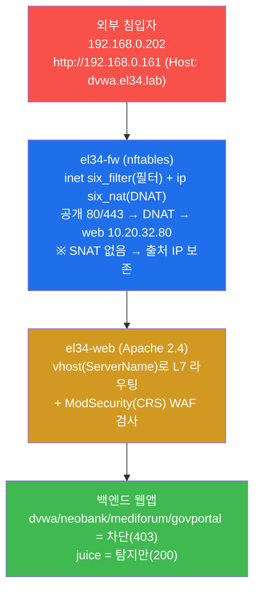
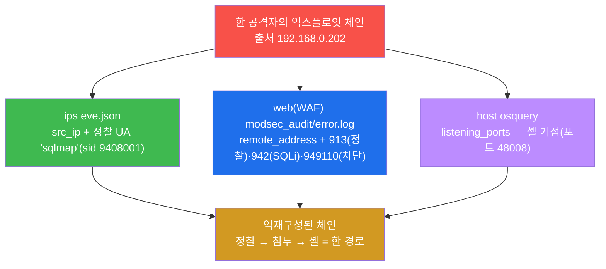
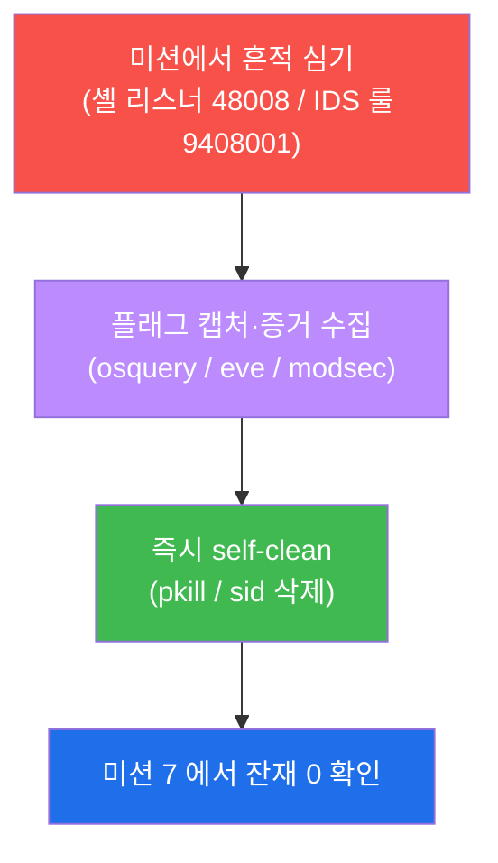
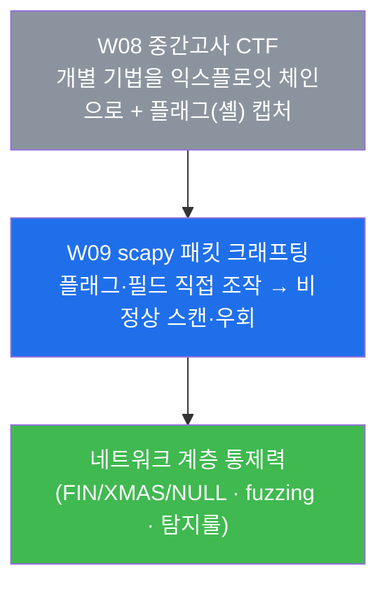

# 공격기법 W08 — 중간고사 CTF: 익스플로잇 체인으로 플래그(셸)를 캡처하기

> **본 주차의 한 줄 요약**
>
> 지난 7주 동안 학생은 정찰(W01–W02) · API/JWT 공격(W03) · SQL Injection(W04) ·
> XSS(W05) · 접근제어 우회(W06) · SSRF/경로탈출/업로드(W07)를 **하나씩** 익혔다.
> 중간고사는 이 개별 기법들을 **따로따로**가 아니라, **한 명의 침입자가 처음부터 끝까지
> 밟는 익스플로잇 체인(exploit chain)** 으로 엮는다. 학생은 공격자(레드팀)의 시선에서
> **정찰 → 공격 표면 식별 → 웹 익스플로잇(침투) → 코드 실행 거점(셸) 확보**의 단계를
> 직접 수행해 **플래그(셸)** 를 캡처하고, 그다음 방어자의 시선으로 돌아서서 그 체인을
> WAF·IDS·호스트 로그로 **역재구성**하는 능력을 평가받는다.
>
> **공격자 한 줄 결론**: CTF에서 점수가 되는 것은 "취약점을 하나 찾았다"가 아니라
> **"어느 입구로 들어가서, 어떻게 코드 실행까지 도달하는 경로(kill chain)를 완성했는가"**
> 다. 단일 취약점은 한 점이고, 익스플로잇 체인은 그 점들을 잇는 선이다. CTF는 선을 본다.

---

## 학습 목표

본 주차(중간 평가) 종료 시 학생은 다음 7가지를 **본인 손으로** 할 수 있어야 한다.

1. W01–W07 에서 배운 개별 공격 기법(정찰 / API·JWT / SQLi / XSS / 접근제어 / SSRF·업로드)이
   PTES 방법론의 **어느 단계**에 속하는지를 한 표로 정리하고, 각 기법이 익스플로잇 체인에서
   **어떤 역할(입구·이동·실행)** 을 하는지 설명한다.
2. 한 외부 침입자의 **익스플로잇 체인(정찰 → 침투 → 셸 캡처)** 을 el34 위에서 재현하고,
   각 단계를 알맞은 도구(nmap / sqlmap / 리스너)로 수행한다.
3. **CTF 플래그가 "코드 실행을 증명하는 것"** 이라는 개념을 이해하고, 본 시험의 플래그인
   **리스너 포트 48008(캡처된 셸)** 을 확보·확인한다.
4. 같은 `sqlmap` 정찰 요청 하나가 **WAF(913 스캐너 룰)** 와 **IDS(네트워크 UA 문자열 룰)** 에
   동시에, 그러나 **서로 다른 층위**로 잡힌다는 것을 증거로 보인다.
5. 방어자의 시선으로 돌아서서, 흩어진 흔적(WAF 913/942 + IDS + 호스트 포트)을 출처 IP 하나로
   **한 익스플로잇 체인으로 역재구성**한다.
6. 정찰을 체인 초기에 끊는 IDS 탐지 룰(sid 9408001)을 직접 작성·reload·트리거·검증하고,
   **끝나면 sid 로 삭제해 베이스 룰을 보존**한다.
7. 위 모든 단계를 **증거(스캔 결과 / 응답 코드 / audit 룰 ID / osquery 결과)와 함께** 한
   익스플로잇 체인의 단계별 표로 정리한 CTF 보고서를 작성한다.

> **중간고사의 시선** — 본 주차는 새 취약점을 배우는 주가 아니라, 지금까지 배운 기법을 **한
> 침입 경로 위에서 통합**하는 주다. 채점은 "취약점을 찾았다"라는 선언이 아니라, **각 단계를
> 올바른 도구로 수행하고 그 증거를 제시했는가**, 그리고 **공격자가 만든 체인을 방어자 관점으로
> 다시 엮을 수 있는가**를 본다.

---

## 0. 용어 해설 (중간고사에서 다시 쓰는 핵심어)

본 주차는 W01–W07 의 용어를 종합한다. 처음 나오거나 시험에서 특히 중요한 용어를 다시 정리한다.
이미 앞 주차에서 정의한 용어라도, 중간고사에서 **이 의미로 쓴다**는 것을 분명히 하기 위해 다시 적는다.

| 용어 | 영문 | 뜻 | 비유 |
|------|------|----|------|
| **CTF** | Capture The Flag | 정해진 목표(플래그)를 먼저 탈취하면 점수를 얻는 보안 경기·평가 형식 | 깃발 뺏기 게임 |
| **플래그** | flag | CTF 에서 "목표 달성을 증명하는 표식" — 본 시험에선 코드 실행 거점(셸) | 점령한 진지에 꽂는 깃발 |
| **익스플로잇 체인** | exploit chain | 여러 단계·여러 취약점을 순서대로 이어 최종 목표(코드 실행)에 도달하는 공격 경로 | 징검다리 — 돌 하나가 아니라 이어진 길 |
| **kill chain** | kill chain | 침입자가 목표 달성까지 거치는 단계들의 연쇄(정찰→침투→실행) | 도둑의 침입 순서(담 넘기→문 따기→금고 열기) |
| **정찰** | Recon(naissance) | 공격 전 표적의 표면을 훑어 약점·서비스를 찾는 단계 | 도둑이 건물 주위를 돌며 약한 문을 찾음 |
| **공격 표면** | attack surface | 외부에서 닿을 수 있는 모든 입력점·포트·엔드포인트의 집합 | 건물의 모든 문·창문·환풍구 |
| **익스플로잇** | exploit | 발견한 취약점을 실제로 악용해 의도하지 않은 동작을 시키는 행위 | 따낸 문으로 안에 들어감 |
| **셸 발판** | shell foothold | 침입한 호스트에서 명령을 실행할 수 있는 거점(셸/리스너) | 안에서 확보한 작전 거점 |
| **셸(shell)** | shell | OS 에 명령을 입력·실행하는 인터페이스. 원격 셸을 얻으면 그 호스트를 조종 가능 | 건물 내부 조종실 |
| **리스너** | listener | 특정 포트에서 외부 연결을 기다리는 프로세스. 셸을 외부와 잇는 통로가 됨 | 몰래 열어 둔 뒷문 + 초인종 |
| **RCE** | Remote Code Execution | 원격에서 표적 호스트의 코드를 실행하는, 가장 치명적인 결과 | 남의 집 가전을 원격으로 켜고 끔 |
| **PTES** | Penetration Testing Execution Standard | 침투 테스트의 표준 6 단계 방법론(정찰→…→보고) | 모의 침입의 표준 작업 순서 |
| **RoE** | Rules of Engagement | 교전 규칙 — 침투 테스트의 허용 범위·시간·방법 | 모의훈련의 허가증과 한계선 |
| **SQLi** | SQL Injection | 입력에 SQL 문법을 주입해 DB 질의를 조작하는 공격 | 주문서에 가짜 항목을 끼워 넣기 |
| **User-Agent(UA)** | — | 요청을 보낸 클라이언트가 자신을 밝히는 HTTP 헤더 한 줄 | 방문객의 명함 |
| **anomaly score** | — | ModSecurity CRS 가 룰 위반마다 점수를 누적해 임계 초과 시 차단 | 벌점 누적 — 일정 점수 넘으면 퇴장 |
| **역재구성** | reconstruction | 방어자가 흩어진 로그를 모아 공격자의 체인을 한 줄로 다시 그림 | 흩어진 발자국을 이어 도주로를 복원 |
| **self-clean** | — | 실습 중 심은 흔적(셸/룰)을 그 단계에서 스스로 정리함 | 훈련 후 사격장 탄피 회수 |

> **헷갈리기 쉬운 한 쌍 — 단일 취약점 vs 익스플로잇 체인.** W01–W07 의 각 주차는 취약점 **하나**를
> 깊게 다뤘다. 그것은 "점"이다. 그런데 실제 침해도, CTF 도, 점수가 되는 것은 점들을 잇는 **선**이다.
> 예를 들어 W04 의 SQLi 하나만으로는 "DB 를 읽었다"에 그칠 수 있지만, **정찰로 입구를 찾고 → SQLi/업로드로
> 침투하고 → 셸을 띄워 코드 실행**까지 이으면 비로소 익스플로잇 체인이 완성된다. CTF 의 플래그는 그 선의
> 끝(코드 실행)에 꽂혀 있다. 본 중간고사가 평가하는 핵심 능력이 바로 이 **"점을 선으로 잇는" 체인 구성**이다.

---

## 1. 왜 단일 취약점이 아니라 익스플로잇 체인인가

### 1.1 한 줄 답: CTF 와 실제 침해는 "경로"를 본다

W01 에서 우리는 침투 테스트가 무작정 공격하는 것이 아니라, **PTES 방법론**의 단계(정찰 → 취약점 분석
→ 익스플로잇 → 포스트 익스플로잇 → 보고)를 따른다고 배웠다. 중간고사는 그 방법론을 **한 사건 위에서
처음부터 끝까지** 밟아 보는 시험이다.

핵심은 **취약점 하나가 곧 침해가 아니라는 것**이다. 공격자가 SQLi 를 하나 찾아도, 그것이 "어디로
들어가서 무엇을 할 수 있는가"로 이어지지 않으면 가치가 작다. 반대로, 사소해 보이는 정찰·접근제어
결함이라도 다른 취약점과 **이어지면** 코드 실행까지 도달할 수 있다. 이렇게 **여러 단계를 순서대로 잇는
공격 경로**가 익스플로잇 체인이며, CTF 는 그 체인의 끝(플래그)에 도달했는지를 본다.



위 체인에서 어느 한 단계라도 빠지면 공격자는 플래그에 도달하지 못한다. 정찰 없이 침투할 입구를 모르고,
침투 없이 셸을 띄울 거점이 없다. 그래서 CTF 의 공격자는 **단계를 순서대로 잇는 사고**를 해야 한다.

### 1.2 W01–W07 의 개별 기법이 체인의 어느 자리에 들어가나

지난 7주의 각 기법은 익스플로잇 체인의 **부품**이다. 같은 체인 위에 어느 주차의 기법이 어느 단계에서
쓰이는지를 겹쳐 그리면 다음과 같다.



이 그림이 중간고사 전체의 지도다. 정찰(W01–W02)이 입구를 찾고, API/엔드포인트 열거(W03)와 웹 취약점
(W04–W07)이 침투로를 열고, 그렇게 확보한 거점에서 코드 실행(셸)으로 체인을 마감한다. 학생이 시험에서
할 일은 이 지도를 실제 명령과 증거로 채우는 것이다.

### 1.3 "왜 중요한가" — 좋은 공격자는 자기 체인이 어떻게 보이는지 안다

W01 에서 강조했듯, el34 는 공격자의 출처 IP 를 fw → ips → web 전 계층에 **보존**한다(SNAT 없음).
그래서 이 트랙은 공격 과목이지만 학생은 **자기 공격이 방어 스택에 어떻게 보이는지**를 동시에 학습한다.
중간고사가 단순히 "셸을 땄다"로 끝나지 않고 **방어자 관점의 체인 역재구성**까지 요구하는 이유가 여기에
있다. 좋은 공격자(레드팀)는 자기가 만든 익스플로잇 체인이 WAF·IDS·호스트 로그에 어떤 흔적으로 남는지
알아야, 실전에서 탐지를 회피하거나(고급), 방어자(블루팀)와 협업해 탐지를 개선(퍼플팀)할 수 있다.

### 1.4 한계 — 이 시험이 다루지 않는 것

본 중간고사는 W01–W07 의 범위 안에서 익스플로잇 체인을 평가한다. 따라서 **W09 이후에 배울 내용**(scapy
패킷 크래프팅, WAF 필터 우회를 위한 인코딩·난독화, SSTI·역직렬화 같은 고급 RCE 기법)은 시험 대상이
아니다. 또한 본 시험의 셸 캡처는 "코드 실행 거점이 잡혔다"를 osquery 로 확인하는 수준까지이며, 실제
리버스 셸 핸들링이나 권한 상승·측면 이동·지속성 확보는 본 트랙의 후반부·고급 트랙에서 다룬다. 본 시험은
**체인을 구성하는 사고**를 평가하는 데 집중한다.

---

## 2. 익스플로잇 체인 상세 — 침입자의 4 단계

이번 시험의 시나리오는 한 외부 침입자가 다음 체인을 시도하는 것이다. el34 의 **외부 공격자 VM
공격자**(`외부 공격자 VM 192.168.0.202`, 출처 IP `192.168.0.202`)가 fw 의 게이트웨이(`192.168.0.161`)를 통해
`dvwa.el34.lab` vhost 를 노린다. el34 는 SNAT 를 하지 않으므로 출처 IP `192.168.0.202` 가 모든
계층에 그대로 보존된다.

> ⚠️ **인가된 실습만.** 이 트랙의 모든 공격은 **인가된 실습 환경(el34)** 안에서, 정해진 대상
> (`외부 공격자 VM 192.168.0.202` → el34 내부 vhost)에 한해서만 수행한다. RoE(범위·시간·방법)를 벗어나거나 실제
> 외부 시스템을 대상으로 한 시도는 불법이며 본 과정의 윤리 규정을 위반한다. CTF 의 플래그(셸)도 공유
> 인프라 보존을 위해 캡처 직후 **반드시 self-clean** 한다(§8).

### 2.1 ① 정찰(Recon) — 공격 표면 매핑

**한 줄 정의.** 정찰은 공격 전에 표적의 표면을 훑어 어떤 포트·서비스·엔드포인트가 있는지 알아내는
단계다(PTES 1단계, W01–W02 복습).

**무엇을 하나.** 공격자는 `nmap` 으로 어떤 포트가 열렸는지, 어떤 서비스·버전이 도는지 매핑한다.
el34 의 fw 는 공개 포트를 DNAT 로 내부에 전달하므로, 공격자는 fw 게이트웨이(`192.168.0.161`)의 80/443
등을 스캔해 "어디로 들어갈 수 있는가"를 그린다. 이때 발견한 열린 포트·웹 vhost 가 곧 **익스플로잇
후보**가 된다.

> **용어 — nmap.** 가장 널리 쓰이는 네트워크 스캐너다. `-p` 로 포트를, `-sV` 로 서비스/버전을
> 식별한다. 본 시험에서는 `-T4`(빠른 타이밍)와 `--max-retries 1`(재시도 1회)로 빠르게 표면을
> 훑는다. 빠른 스캔은 그만큼 IDS 에 "시끄럽게" 잡힌다 — 정찰의 은밀성과 속도는 trade-off 다(W01).

**el34 에서 어떻게 잡히나.** 같은 정찰 행위가 방어 스택에 흔적을 남긴다. 특히 스캐너 도구는 자기
정체를 드러내는 **User-Agent(UA)** 문자열(예: `sqlmap/1.7`)을 HTTP 헤더에 담기 때문에, 이 정찰
요청 하나가 두 장비에 동시에, 그러나 다른 층위로 잡힌다.



- **WAF** 에는 CRS 의 **913 룰군(scanner detection)** 으로 잡힌다 — WAF 는 이 요청을 "알려진 스캐너의
  HTTP 패턴"으로 해석한다.
- **IDS** 에는 네트워크를 흐르는 페이로드 안의 문자열 `sqlmap` 으로 잡힌다 — 단, 이 룰은 방어자가 직접
  만들어야 한다(시험 미션 5). IDS 는 이 요청을 "특정 바이트 문자열을 포함한 네트워크 트래픽"으로 본다.

**공격자의 시선.** 정찰은 가장 시끄러운 단계다. 자동화 스캐너의 기본 UA 와 빠른 타이밍은 방어 스택에
쉽게 잡힌다. 실전 레드팀은 느린 스캔(`-T2`)·분산·UA 위장으로 은밀성을 높이지만(W09 이후 고급), 본
시험에서는 정찰의 신호를 명확히 보기 위해 스캐너의 기본 UA 를 그대로 쓴다.

### 2.2 ② 웹 익스플로잇(Exploit) — SQLi 로 침투

**한 줄 정의.** 웹 익스플로잇은 정찰로 찾은 약점을 실제로 악용해 웹앱 안으로 들어가는 단계다(PTES
4단계, W03–W07 복습).

**무엇을 하나.** 공격자는 정찰로 식별한 입력점에 가장 효과적인 취약점을 시도한다. 본 시험의 대표
경로는 **SQL Injection(SQLi)** 이다 — 예를 들어 파라미터에 `' UNION SELECT 1-- -` 같은 SQL 조각을
끼워 넣어, 웹앱이 의도하지 않은 DB 질의를 실행하게 만든다(W03 의 인증 우회용 SQLi, W04 의 sqlmap
자동화 복습).

> **용어 — SQL Injection(SQLi) / UNION SELECT.** SQLi 는 웹앱이 사용자 입력을 SQL 질의에 그대로
> 이어붙일 때, 공격자가 SQL 문법을 주입해 DB 를 조작하는 공격이다. `UNION SELECT` 는 원래 질의 결과에
> 공격자가 고른 다른 데이터를 덧붙여 빼내는 전형적 기법이다. 본 시험의 페이로드 `' UNION SELECT 1-- -`
> 는 URL 인코딩되어(`%27%20UNION%20SELECT%201--%20-`) 전송된다.

**el34 에서 어떻게 막히나.** el34 의 `dvwa.el34.lab` vhost 는 **차단 모드**다(W05 에서 본 대로,
dvwa 는 차단·juice 는 탐지만). WAF(ModSecurity + CRS)가 이 요청을 잡아 **403(Forbidden)** 으로
응답한다. 즉 공격자가 dvwa 에 정직하게 SQLi 를 던지면 403 이 떨어지는데, 이 403 자체가 "여기는
차단형 자산이다"라는 정보를 준다. 실전 CTF 에서 공격자는 이 신호를 읽고 **차단이 안 되는 경로/취약점
(탐지만 모드인 juice, 다른 엔드포인트, 우회 인코딩)** 으로 방향을 튼다.



중요한 점은 차단이 **단일 룰**의 결과가 아니라는 것이다. CRS 는 룰 위반마다 **anomaly score** 를
누적한다. SQLi 를 잡는 942 룰군이 점수를 올리고, 그 누적 점수가 임계값을 넘으면 **949110(Inbound
Anomaly Score Exceeded)** 룰이 발동해 403 으로 차단한다. 즉 "942 가 직접 차단"이 아니라 "942 가
점수를 올리고 949110 이 누적 임계 초과로 차단"이라는 2 단계 메커니즘이다(W04–W05 복습). 공격자가 이
메커니즘을 이해하면, 어떤 입력이 점수를 얼마나 올리는지를 가늠해 임계 아래로 회피하는 전략(고급)을
세울 수 있다.

**공격자의 시선.** CTF 의 침투 단계에서 핵심은 "가장 효과적인 입구를 고르는 판단"이다. 모든 vhost 에
무차별로 페이로드를 던지는 것이 아니라, 정찰 결과를 바탕으로 **차단되지 않거나 가장 취약한 경로**를
선택한다. 본 lab 은 학습 목적상 차단형 dvwa 에 SQLi 를 던져 403(탐지/차단)을 관찰하지만, 실전 CTF 의
판단은 "이 경로가 막히면 다음 경로로"라는 우선순위 사고임을 기억한다.

### 2.3 ③ 셸 캡처(Foothold) — 코드 실행 거점 = 플래그

**한 줄 정의.** 셸 캡처는 침투에 성공한 공격자가 표적 호스트에서 **명령을 실행할 수 있는 거점(셸)** 을
확보하는 단계다(PTES 5단계 포스트 익스플로잇의 첫 발, W06 복습). 본 CTF 에서 이 거점이 곧 **플래그**다.

**왜 셸이 플래그인가.** CTF 의 "플래그"는 보통 **코드 실행을 증명하는 것** — 셸 획득, 특정 파일 읽기,
리스너 포트 같은 형태다. "DB 를 읽었다"보다 "임의 코드를 실행할 수 있다"가 침해의 정점이기 때문이다.
일단 셸을 얻으면 공격자는 파일 탈취·권한 상승·측면 이동 등 무엇이든 할 수 있다. 그래서 본 시험은 **코드
실행 거점의 확보** 자체를 플래그로 정의한다.

**el34 에서 플래그의 형태 — 리스너 포트 48008.** 본 시험의 플래그는 표적 호스트(web)에 **비표준 포트
48008 에 리스너를 띄우는 것**이다. 리스너가 떠 있다는 것은 그 호스트에서 임의 프로세스를 실행할 수
있었다는 증거이며, 곧 코드 실행 거점(셸)이 확보되었다는 뜻이다. 확보 여부는 **osquery** 로 확인한다 —
"포트 48008 을 어떤 프로세스가 듣고 있는가"를 SQL 로 질의해, 플래그가 실제로 캡처되었음을 증명한다.



> **용어 — 리스너 / osquery.** **리스너**는 특정 포트에서 외부 연결을 기다리는 프로세스다. 공격자가
> 셸을 외부와 잇는 통로로 흔히 쓴다. **osquery** 는 OS 를 SQL 테이블로 질의하는 호스트 가시화 도구다
> (W06). `listening_ports` 테이블로 "어느 프로세스가 어느 포트를 듣는가"를 SQL 한 줄로 확인한다 —
> 공격자에겐 자기 발판 점검 도구이자, 방어자에겐 발판 사냥 도구다.

**공유 인프라 — 즉시 정리.** 이 셸(리스너)은 캡처를 osquery 로 확인한 **즉시 종료(pkill)** 한다. el34
는 여러 학생이 함께 쓰는 공유 인프라이므로, 플래그 캡처를 입증한 뒤에는 흔적을 남기지 않아야 한다(§8).

### 2.4 ④ 방어자의 시선 — 체인을 역재구성하다

**한 줄 정의.** 역재구성은 방어자(블루팀)가 흩어진 흔적을 모아 공격자가 밟은 익스플로잇 체인을 한 줄로
다시 그리는 작업이다.

**왜 공격 과목에서 방어를 보나.** 좋은 공격자는 자기 체인이 어떻게 탐지되는지 안다(§1.3). 본 시험은
공격자가 만든 체인을 방어자 관점으로 되짚어, **어느 흔적이 어느 단계를 가리키는가**를 학생이 직접 엮게
한다. 공격자는 흔적을 흩어진 점으로 남기지만, 방어자는 그 점들을 출처 IP 하나로 한 선(체인)으로 잇는다.



방어자는 WAF 의 audit 로그에서 **913(정찰 스캐너) → 942(SQLi 침투)** 의 룰 ID 를, IDS 의 eve.json 에서
같은 출처 IP 의 정찰 시그니처를, 호스트 osquery 에서 셸 거점(포트 48008)을 모은다. 그리고 이 세 흔적이
모두 같은 출처 IP `192.168.0.202` 를 가리킨다는 사실로, 흩어진 흔적이 **한 공격자의 한 익스플로잇
체인**임을 입증한다. el34 가 SNAT 를 하지 않아 출처 IP 가 전 계층에 보존되기에 가능한 역재구성이다.

**한계.** 본 시험의 역재구성은 WAF·IDS·호스트 흔적을 모아 체인을 그리는 수준까지다. 이 흔적들이 SIEM
(Wazuh manager) 내부에서 어떻게 한 평결(alert)로 상관·격상되는지는 방어 트랙(secuops/soc)의 영역이며,
공격 트랙에서는 "공격이 어떤 흔적으로 남는가"를 아는 데 집중한다.

---

## 3. el34 의 진입 경로와 플래그(셸) 정의

중간고사의 모든 공격은 el34 의 **공개 진입점 → 방화벽 → 웹** 경로를 거쳐 들어간다. 이 경로를 정확히
이해해야 "내 공격이 어디로 가고, 어느 장비에 흔적을 남기는가"를 추적할 수 있다.

### 3.1 두 계층의 역할 분담 (HAProxy 없음)



- **방화벽 계층(el34-fw).** nftables 가 무엇이 들어오고(허용 포트) 어디로 가는지(DNAT)를 결정하는 **L4
  정책**이다. el34 의 nftables 는 두 테이블을 쓴다 — `inet six_filter`(필터 정책)와 `ip six_nat`(DNAT).
  공개 80/443 으로 온 요청을 DNAT 로 web `10.20.32.80` 에 보낸다. 방화벽은 IP/포트(L3/L4)만 보므로,
  HTTP 안의 SQLi 페이로드나 스캐너 UA 는 보지 못한다.
- **L7 + WAF 계층(el34-web).** Apache 가 HTTP 의 의미를 보고 `ServerName`(vhost)으로 라우팅한 뒤,
  ModSecurity(CRS)로 공격 페이로드를 검사하는 **L7 계층**이다.

즉 **L3/L4 는 fw 가, L7 은 web 의 Apache 가** 담당하는 명확한 분리 구조이며, 그 사이 어디에도 HAProxy
는 없다. 공격자 입장에서 이 구조를 알면 "내 SQLi 는 fw 를 통과하지만 web 의 ModSec 에서 걸린다"는 것을
예측할 수 있다.

### 3.2 출처 IP 보존이 왜 핵심인가 (공격자에게도 방어자에게도)

el34 의 fw 는 DNAT 만 하고 SNAT 를 하지 않으므로, 안쪽의 모든 장비가 공격자의 **진짜 출처 IP
`192.168.0.202`** 를 본다. ModSec 의 `remote_address`, Suricata 의 `src_ip`, Apache access.log 가 모두
같은 IP 를 가리킨다.

- **공격자에게는** — 내 모든 요청이 같은 출처 IP 로 묶여 기록된다는 뜻이다. 즉 정찰부터 침투까지 한
  공격자의 행위가 출처 IP 로 쉽게 상관된다. 실전에서 이것은 탐지 회피를 위해 출처 분산을 고민하게 만드는
  요인이다(고급).
- **방어자에게는** — 정찰·침투·셸이라는 흩어진 흔적을 출처 IP 하나로 **한 체인**으로 엮는 키다(§2.4의
  역재구성). 만약 el34 가 SNAT 를 했다면 안쪽 장비는 fw 의 IP 만 보게 되어 이 역재구성이 불가능했을 것이다.

el34 의 4-tier 세그먼트는 `ext 10.20.30` / `pipe 10.20.31` / `dmz 10.20.32` / `int 10.20.40` 이며,
공격자(ext .202) → fw(ext .1) → web(dmz .80) 경로로 흐른다.

### 3.3 플래그 = 셸 (코드 실행 거점), 본 시험은 리스너 포트 48008

본 시험에서 **플래그를 "코드 실행을 증명하는 것"** 으로 정의한다는 점을 한 번 더 못 박는다(§2.3). 셸을
얻는다는 것은 표적 호스트에서 임의 명령을 실행할 수 있다는 뜻이고, 그 능력의 증거를 **비표준 포트 48008
에 리스너를 띄우는 것**으로 삼는다. 리스너가 떠 있음을 osquery 로 확인하면 플래그 캡처가 입증된다.

```bash
# 셸 캡처(플래그) — 리스너 포트 48008 을 띄우고 osquery 로 확인
ssh ccc@10.20.32.80 'nohup python3 -m http.server 48008 >/dev/null 2>&1 & echo shell_captured'
ssh ccc@10.20.32.80 ss -tlnp | grep ':48008'
# 확인 즉시 self-clean (공유 인프라 보존)
ssh ccc@10.20.32.80 'pkill -f "[h]ttp.server 48008"; true'
```

위 명령에서 `python3 -m http.server 48008` 은 포트 48008 에 간단한 리스너를 띄우는 가장 단순한 방법으로,
"이 호스트에서 임의 프로세스를 실행할 수 있다"는 코드 실행 거점을 모사한다. 실전의 리버스 셸·webshell 도
결국 "표적에서 임의 코드를 실행한다"는 본질은 같다. osquery 의 `listening_ports` 가 포트 48008 과 그
주인 프로세스를 보여주면 플래그가 캡처된 것이다. **확인 직후 `pkill` 로 반드시 정리한다.**

---

## 4. 도구별 빠른 복습 — "무엇을 어디서 쓰나"

시험에서 각 단계를 수행·검증하는 핵심 명령을 한 번에 정리한다. 공격은 내 공격 VM
(`ssh att@192.168.0.202`, 비번 1)에서 자연 URL 로, 표적/방어 확인은 각 장비(`ssh ccc@10.20.32.80` web /
`ssh ccc@10.20.31.2` IPS, 비번 1)에 직접 접속해 실행한다.

### 4.1 정찰 — 외부 공격자 VM 192.168.0.202 / nmap

nmap 은 네트워크 스캐너다(W01). 공격자 컨테이너에서 fw 게이트웨이의 공개 포트를 스캔해 공격 표면을
매핑한다.

```bash
nmap -p 80,443,8001-8007 192.168.0.161 -T4 --max-retries 1 2>/dev/null | grep -E "open|PORT"
```

무엇을 보나 — 어떤 포트가 `open` 인지. 열린 포트·웹 vhost 가 다음 단계의 익스플로잇 후보다. 빠른 스캔은
IDS 에 잡히므로, 이 정찰 자체가 방어 흔적을 남긴다(공격자의 가시성 인식).

### 4.2 웹 익스플로잇 — 외부 공격자 VM 192.168.0.202 / sqlmap UA(진짜 sqlmap) + nc

SQLi 는 입력에 SQL 문법을 주입하는 공격이다(W03–W04). 스캐너 UA(`-A sqlmap/1.7`)와 함께 SQLi
페이로드를 보내면, 같은 요청이 정찰 신호(UA)와 침투 신호(SQLi)를 동시에 담는다.

```bash
echo "exploit=$(echo -en 'GET /?id=ct8%27%20UNION%20SELECT%201--%20- HTTP/1.0\r\nHost: dvwa.el34.lab\r\nUser-Agent: sqlmap/1.7\r\nConnection: close\r\n\r\n' | nc -w3 192.168.0.161 80 | head -1 | grep -oE '[0-9]{3}')"
```

무엇을 보나 — 응답 코드. dvwa(차단 모드)에서는 `403`(WAF 차단)이 정상이다. 403 은 "여기는 차단형"이라는
신호이며, 실전에서는 차단되지 않는 경로로 방향을 튼다.

> **용어 — `-A` / `-w` / `-o`.** curl 옵션이다. `-A` 는 User-Agent 를 지정(여기선 `sqlmap/1.7` 으로
> 위장), `-w` 는 응답 후 출력 포맷 지정(여기선 `exploit=%{http_code}` 로 응답 코드만), `-o /dev/null`
> 은 응답 본문을 버린다(코드만 볼 때 유용).

### 4.3 셸 캡처(플래그) — el34-web / python3 리스너 + osquery

코드 실행 거점을 비표준 포트 48008 리스너로 모사하고, osquery 로 확인한다(§3.3). osquery 는 OS 를 SQL
로 질의하는 도구다(W06).

```bash
ssh ccc@10.20.32.80 'nohup python3 -m http.server 48008 >/dev/null 2>&1 & echo shell_captured'
ssh ccc@10.20.32.80 ss -tlnp | grep ':48008'
ssh ccc@10.20.32.80 'pkill -f "[h]ttp.server 48008"; true'
```

무엇을 보나 — osquery 결과에 포트 48008 과 그 주인 프로세스(pid)가 보이면 플래그 캡처 입증. **확인 즉시
정리한다.**

### 4.4 방어자 역재구성 — el34-web / modsec 흔적 + el34-ips / IDS 룰

방어자는 WAF audit 흔적과 IDS 룰로 체인을 역재구성한다. ModSec audit/error 로그는 매치된 CRS 룰 ID 를
담는다(W05). Suricata `local.rules` 에는 정찰을 잡는 커스텀 룰을 추가한다(W03 의 IDS 룰 패턴).

```bash
# WAF 흔적: 매치된 CRS 룰 ID 모으기 (913 정찰 / 942 SQLi 등)
ssh ccc@10.20.32.80 'sudo tail -100 /var/log/apache2/modsec_audit.log | grep -oE "9[0-9]{5}" | sort -u | head'
# IDS 정찰 탐지 룰(sid 9408001) 추가 → reload → 트리거 → eve 확인 → sed 삭제(베이스 보존)
ssh ccc@10.20.31.2 'sudo bash -c "cat >> /etc/suricata/rules/local.rules <<EOF
alert http any any -> any any (msg:\"CTF8 sqlmap recon\"; http.user_agent; content:\"sqlmap\"; nocase; fast_pattern; sid:9408001; rev:1;)
EOF"'
ssh ccc@10.20.31.2 'sudo suricatasc -c reload-rules'
# (트리거 후) eve 확인 → 정리
ssh ccc@10.20.31.2 'sudo sed -i "/sid:9408001/d" /etc/suricata/rules/local.rules; sudo suricatasc -c reload-rules >/dev/null'
```

무엇을 보나 — WAF 흔적에 913(정찰)·942(SQLi)가 보이고, 내가 만든 IDS 룰(sid 9408001)이 eve.json 에
`CTF8 sqlmap recon` 시그니처로 잡히는지. 이 흔적들을 출처 IP 로 묶으면 한 체인이 된다.

> **용어 — fast_pattern / suricatasc.** `fast_pattern` 은 Suricata 가 룰 전체를 검사하기 전에 빠르게
> 후보를 거르는 핵심 문자열 지정이다(성능 최적화). `suricatasc` 는 Suricata 에 명령을 보내는 소켓
> 클라이언트로, `reload-rules` 는 데몬을 멈추지 않고 룰만 다시 읽게 한다(무중단 reload). IDS 룰은 내
> 네임스페이스 `9408xxx` 를 쓰고, 끝나면 **sid 로 삭제**해 베이스 룰을 보존한다(§8).

---

## 5. 판단 프레임워크 — "어느 단계에 어느 도구·기법인가"

중간고사의 가장 중요한 능력은 **"이 단계에서 어느 도구·기법을 쓰고, 그 단계가 어느 흔적을 남기는가"**를
즉시 판단하는 것이다. 다음 표가 그 판단의 정답지다. 학생은 이 표를 머릿속에 두고, 각 단계를 알맞은
도구로 수행한 뒤 그 증거를 제시한다.

| 체인 단계 | 공격자 도구·기법(W#) | 노리는 것 | 남기는 흔적(방어 가시성) |
|-----------|---------------------|----------|------------------------|
| ① 정찰 | nmap 포트·서비스 스캔, 스캐너 UA (W01–W02) | 공격 표면(열린 포트·vhost) | IDS UA 룰(sid 9408001) / WAF 913 |
| ② 표면 식별 | 엔드포인트 열거, 취약 입력 선별 (W03·W06) | 익스플로잇 가능한 입력점 | access.log 다량 404/탐색 패턴 |
| ③ 웹 익스플로잇(침투) | SQLi(`UNION SELECT`) / 업로드 / 접근제어 (W03–W07) | 웹앱 침투, 코드 실행 능력 | WAF 942→949110 403 + remote IP |
| ④ 셸 캡처(플래그) | 리스너 48008 = 코드 실행 거점 | 플래그(코드 실행 증명) | osquery listening_ports / 호스트 포트 |
| (방어자) 역재구성 | modsec 흔적 + IDS 룰 + osquery | 체인 복원 | 출처 IP 로 913·942·48008 상관 |

이 표를 읽는 법은 두 방향이다. **"무엇으로 수행하나"** — 정찰은 nmap, 침투는 SQLi, 플래그는 셸 리스너.
그리고 **"어떤 흔적을 남기나"** — 정찰은 IDS/WAF 913, 침투는 WAF 942, 셸은 호스트 포트. 공격자가 두
방향을 모두 말할 수 있으면 "자기 체인이 어떻게 보이는지 아는 좋은 공격자"가 된 것이다.

> **시험의 채점 포인트.** 각 단계를 올바른 도구로 수행하고, 그 증거(스캔 결과/응답 코드/audit 룰 ID/
> osquery 결과)를 제시하며, 마지막에 흩어진 흔적을 방어자 관점으로 한 체인으로 역재구성하는 것. "땄다"는
> 선언이 아니라 **증거**가 점수다. 합격 임계값은 0.7 이다.

---

## 6. 상관(correlation) — 흩어진 흔적, 하나의 체인

공격자가 만든 익스플로잇 체인은 방어 스택에 흩어진 흔적을 남긴다. 이 흔적들을 **출처 IP(192.168.0.202)
+ 시각**으로 엮으면 하나의 체인이 복원된다. 같은 공격자의 행위가 장비마다 다른 단서로 보인다는 것을
이해하는 것이 종합 사고의 정점이다.



| 장비 | 로그/질의 | 같은 체인의 다른 단서 |
|------|----------|----------------------|
| ips | eve.json `src_ip` | 정찰 UA 문자열 "sqlmap" 시그니처(sid 9408001) |
| web(WAF) | modsec_audit `remote_address` + error.log | 913(정찰) → 942(SQLi 침투) → 949110(403 차단) |
| host | osquery `listening_ports` | 침투 후 띄운 셸 거점(포트 48008) |

이 표를 손으로 채울 수 있으면 중간고사의 종합 사고를 갖춘 것이다. 핵심은 **IDS 의 `src_ip` 와 WAF 의
`remote_address` 가 같은 `192.168.0.202`** 라는 것 — 이것이 출처 보존(SNAT 없음) 덕에 가능하며, 흩어진
흔적을 한 익스플로잇 체인으로 묶는 증거다(미션 6 의 역재구성).

---

## 7. 실습 안내 — 중간고사 CTF lab 8 미션 (4 축 설명)

중간고사 실습은 8 미션으로 구성된다. 각 미션을 **4 축**으로 설명한다 — 왜 하는가 / 무엇을 알 수 있는가 /
결과 해석(정상 vs 비정상) / 실전 활용. 미션은 익스플로잇 체인을 따라 점검 → ① 정찰 → ② 침투 → ③ 셸
캡처(플래그) → IDS 탐지 룰 → 방어자 역재구성 → 플래그 검증·정리 → CTF 보고서 순서로 흐른다.

> **시험 진행 원칙.** 공격은 `ssh att@192.168.0.202`(자연 URL), 표적/방어 확인은 각 장비
> (`ssh ccc@10.20.32.80`·`ssh ccc@10.20.31.2`)에 직접 접속해. **인가된 실습 환경(el34)에서만** 수행한다. 셸(리스너)과 IDS 룰은 각 미션에서 심으면 그 미션에서
> 정리한다(self-clean). 합격 임계값은 0.7 이다.

### 미션 1 — 점검: 도구 + 대상 (8점, survey)

> **왜 하는가?** 익스플로잇 체인의 전제는 공격 도구가 갖춰져 있고 대상에 도달 가능해야 한다는 것이다.
> 침투 테스터는 RoE 확인 직후 항상 도구·도달성부터 점검한다.
>
> **무엇을 알 수 있는가?** 공격자 컨테이너에 nmap·sqlmap 이 있는지, 그리고 대상 `dvwa.el34.lab` 이
> 응답하는지. CTF 를 시작할 준비가 됐는지.
>
> **결과 해석.** 정상: `nmap`/`sqlmap` 경로가 보이고 dvwa 가 HTTP 코드로 응답. 비정상: 도구가 없거나
> 대상이 무응답이면 체인을 시작할 수 없다 — 먼저 원인을 파악한다.
>
> **실전 활용.** 모의 침투 착수 시 첫 점검. 도구 가용성과 대상 도달성을 확인해야 본격 정찰로 넘어간다.

### 미션 2 — ① 정찰: 공격 표면 식별 (10점, recon)

> **왜 하는가?** 익스플로잇 체인의 첫 단계인 정찰을 직접 수행해, 어디로 들어갈 수 있는지(공격 표면)를
> 그린다(PTES 1단계).
>
> **무엇을 알 수 있는가?** nmap 으로 fw 게이트웨이(192.168.0.161)의 열린 포트·서비스를 매핑하는 법. 열린
> 포트·웹 vhost 가 곧 다음 단계의 익스플로잇 후보다.
>
> **결과 해석.** 정상: `open` 포트가 식별됨(80/443 등). 핵심 깨달음 — 정찰은 가장 시끄러운 단계라
> IDS 에 잡힌다. 빠른 스캔(`-T4`)일수록 더 잘 잡힌다.
>
> **실전 활용.** 모든 침투의 출발점. 표면을 정확히 그려야 효율적인 침투 경로를 고를 수 있다.

### 미션 3 — ② 웹 익스플로잇: SQLi 침투 (12점, manipulation)

> **왜 하는가?** 정찰 다음 단계인 실제 침투를 수행해, 정찰로 찾은 입력점에 가장 효과적인 취약점(SQLi)을
> 시도한다(PTES 4단계).
>
> **무엇을 알 수 있는가?** dvwa(차단 모드) vhost 에 스캐너 UA + `UNION SELECT` SQLi 를 보내면 WAF 가
> 403 으로 막는다는 것. 같은 요청이 정찰 신호(UA)와 침투 신호(SQLi)를 동시에 담는다는 것.
>
> **결과 해석.** 정상: 응답이 `403`(WAF 차단=탐지). 핵심 깨달음 — 403 은 "차단형 자산"이라는 신호이며,
> 실전 CTF 는 차단되지 않는 경로/취약점(juice, 다른 엔드포인트, 우회)으로 방향을 튼다.
>
> **실전 활용.** 정찰 결과를 바탕으로 가장 효과적인 입구를 고르는 판단. 막히면 다음 경로로 가는 우선순위
> 사고.

### 미션 4 — ③ 셸 캡처(플래그): 리스너 48008 → osquery 확인 (14점, manipulation)

> **왜 하는가?** 익스플로잇 체인의 정점인 코드 실행 거점(셸)을 확보해 **플래그**를 캡처한다(PTES 5단계의
> 첫 발).
>
> **무엇을 알 수 있는가?** 코드 실행 거점을 비표준 포트 48008 리스너로 모사하고, osquery 의
> `listening_ports` 로 "포트 48008 을 어떤 프로세스가 듣는가"를 확인해 플래그 캡처를 입증하는 법.
>
> **결과 해석.** 정상: osquery 결과에 포트 48008 과 그 주인 프로세스가 보임 = 플래그 캡처. 핵심 깨달음 —
> CTF 의 플래그는 "코드 실행을 증명하는 것"이며, 셸(리스너)이 곧 그 증거다. 확인 즉시 self-clean.
>
> **실전 활용.** 침투를 코드 실행으로 마감하는 것이 침해의 정점. 실전의 리버스 셸·webshell 도 본질은
> "표적에서 임의 코드 실행"으로 같다.

### 미션 5 — ④ IDS 탐지 룰(방어자): 정찰 탐지 sid 9408001 작성→reload→트리거→정리 (14점, manipulation)

> **왜 하는가?** 좋은 공격자는 자기 정찰이 어떻게 탐지되는지 안다. 방어자 관점으로 돌아서서, 정찰(스캐너
> UA)을 체인 초기에 잡는 IDS 룰을 직접 만들어 "탐지를 설계하는" 능력을 평가한다.
>
> **무엇을 알 수 있는가?** Suricata `local.rules` 에 `http.user_agent; content:"sqlmap"; fast_pattern`
> 룰(sid 9408001)을 추가하고, 무중단 reload → 트리거 → eve.json 확인 → **sid 로 삭제**까지의 룰
> 수명주기 전체. 같은 sqlmap UA 를 WAF 는 HTTP 의미(913)로, IDS 는 네트워크 UA 문자열로 본다는 교차.
>
> **결과 해석.** 정상: eve.json 에 `CTF8 sqlmap recon` 시그니처가 잡히고, 정리 후 local.rules 에서
> 9408001 이 사라짐. 비정상: 트리거 후에도 eve 에 안 잡히면 룰 문법·reload 를 점검.
>
> **실전 활용.** 신종 정찰 도구가 나타나면 운영자가 직접 탐지 룰을 작성·배포·검증한 뒤, 임시 룰은 정리해
> baseline 을 깨끗이 유지한다.

### 미션 6 — ⑤ 체인 역재구성(방어자): WAF/IDS/호스트 흔적 종합 (12점, analysis)

> **왜 하는가?** 종합 사고의 정점 — 공격자가 만든 흩어진 흔적을 방어자 관점으로 한 익스플로잇 체인으로
> 다시 엮는다.
>
> **무엇을 알 수 있는가?** WAF audit 로그의 룰 ID(913 정찰 → 942 SQLi 침투)와 호스트 포트(48008 셸)를
> 모아, 정찰 → 침투 → 셸 경로를 복원하는 법. 흩어진 흔적이 출처 IP 하나로 한 공격자의 한 체인임을 입증.
>
> **결과 해석.** 정상: modsec 흔적에 `942`(및 913)가 보이고, 이를 정찰→침투→셸 체인으로 종합. 핵심 —
> 방어는 어느 단계에서든 체인을 끊으면 공격을 막는다.
>
> **실전 활용.** 실제 사고 조사에서 출처 IP + 시각으로 다중 소스 로그를 한 공격 경로로 재구성하는 핵심
> 기법(블루팀의 표준 작업).

### 미션 7 — 플래그 검증 + 정리: 셸/룰 잔재 0 (10점, cleanup)

> **왜 하는가?** 공유 인프라에서는 CTF 흔적(셸·룰)을 끝까지 남기지 않아야 한다. 다음 학생·운영에 영향을
> 주면 안 된다.
>
> **무엇을 알 수 있는가?** 플래그(48008 리스너)가 정리되었는지, IDS 룰(sid 9408001)이 local.rules 에서
> 사라졌는지. self-clean 결과를 검증하는 법.
>
> **결과 해석.** 정상: `shell clean` 출력(48008 리스너 잔재 0)과 9408001 잔재 카운트 0. 비정상: 잔재가
> 있으면 해당 미션의 정리 명령을 다시 실행.
>
> **실전 활용.** 모의 침투·훈련 환경에서 변경분(심은 발판·룰)을 추적·원복하는 변경 관리 규율. 실전
> 침투에서도 흔적 최소화는 포스트 익스플로잇의 한 축이다(고급).

### 미션 8 — CTF 보고서: 익스플로잇 체인 종합 (10점, report)

> **왜 하는가?** 미션 1–7 을 한 익스플로잇 체인의 단계별로 정리해, 종합 판단을 문서로 입증한다(PTES
> 6단계 보고).
>
> **무엇을 알 수 있는가?** 정찰 → 익스플로잇 체인(침투 경로) → 플래그 캡처(셸 48008) → 방어자 역재구성을
> 한 보고서로 종합하는 법. CTF 보고서의 표준 구조.
>
> **결과 해석.** 정상: 보고서에 정찰·체인·플래그·방어 역재구성이 모두 포함됨. 핵심 결론 — 개별 취약점을
> 체인으로 엮어 코드 실행까지 도달했고, 방어는 어느 단계에서든 체인을 끊어 막는다.
>
> **실전 활용.** 침투 테스트 종료 후 고객에게 제출하는 보고서의 표준 구조(개요→공격 경로→영향→방어 권고).
> 발견을 경로로 설명하는 것이 단일 취약점 나열보다 훨씬 설득력 있다.

---

## 8. 시험 수칙 — 인가된 실습 + 공유 인프라 보존

el34 는 여러 학생이 함께 쓰는 공유 인프라이며, 이 트랙은 공격을 다루므로 윤리 규정이 특히 엄격하다.
다음 수칙을 반드시 지킨다.

- **인가된 실습만.** 모든 공격은 인가된 실습 환경(el34) 안에서, 정해진 대상(`외부 공격자 VM 192.168.0.202` → el34
  내부 vhost)에 한해서만. 실제 외부 시스템 대상 시도는 불법이며 RoE 위반이다.
- **baseline 을 수정/삭제하지 말 것.** fw 정책, suricata base 룰, apache vhost, 정상 계정·서비스는
  점검만 하고 절대 바꾸지 않는다.
- **내 흔적은 내가 정리(self-clean).** 셸(리스너)은 pkill, IDS 룰은 sid 로 삭제. 각 미션 안에서 즉시
  정리한다.
- **네임스페이스를 지킨다.** 플래그 리스너 포트는 `48008`, IDS sid 는 `9408xxx` 로 고정해 다른 학생과
  겹치지 않게 한다.
- **증거 우선.** "셸을 땄다"가 아니라 **스캔 결과/응답 코드/audit 룰 ID/osquery 결과를 제시**해야
  점수다. 결과 선언만으로는 채점되지 않는다.



---

## 9. 다음 주차 (W09) 예고 — 패킷을 직접 만들다(scapy)

중간고사에서 학생은 완성된 도구(nmap·sqlmap)로 익스플로잇 체인을 구성했다. 하지만 도구가 만들어 주는
표준 패킷을 넘어, **공격자가 패킷의 플래그·필드를 직접 조작**하면 더 정교한 정찰·우회가 가능하다.

W09 부터는 **scapy** 로 패킷을 직접 조립한다 — `IP()/TCP(flags='S')` 처럼 필드를 손으로 짜서, 비정상
스캔(FIN/XMAS/NULL)으로 일부 필터·스택을 우회하고, 대량 SYN 으로 스캔을 일으키며, 그 비정상 패킷이
Suricata 에 어떻게 탐지되는지 본다. 중간고사가 "개별 기법을 체인으로 엮는" 사고를 길렀다면, W09 는
"도구 대신 패킷 자체를 다루는" 더 낮은 계층의 통제력을 연다.


