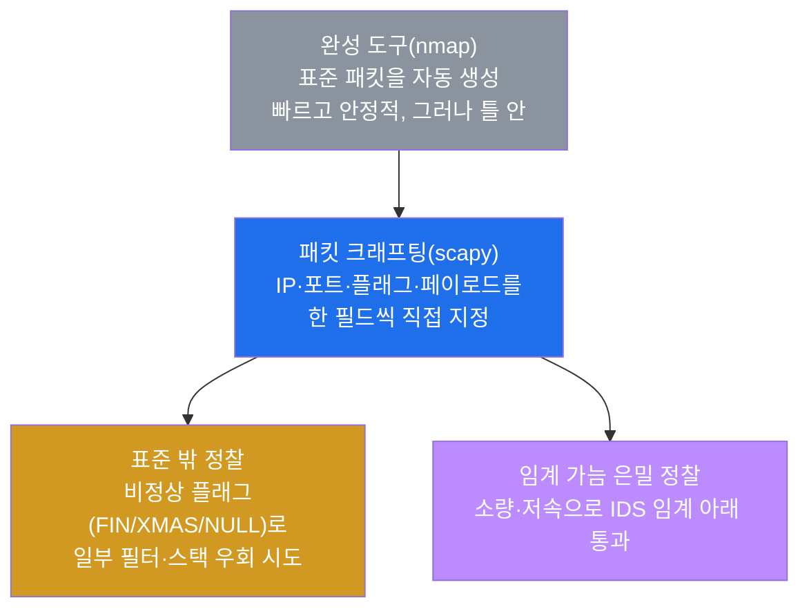
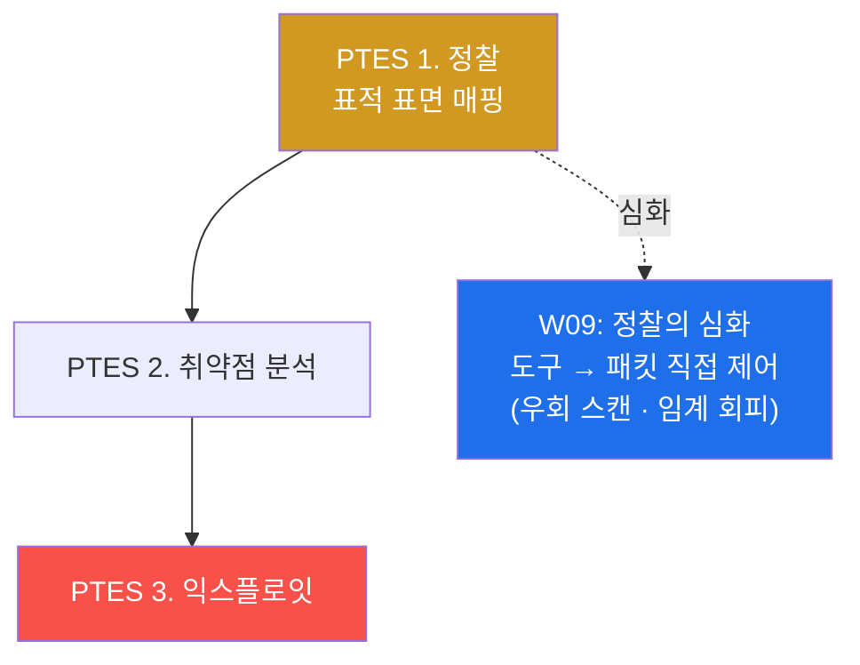
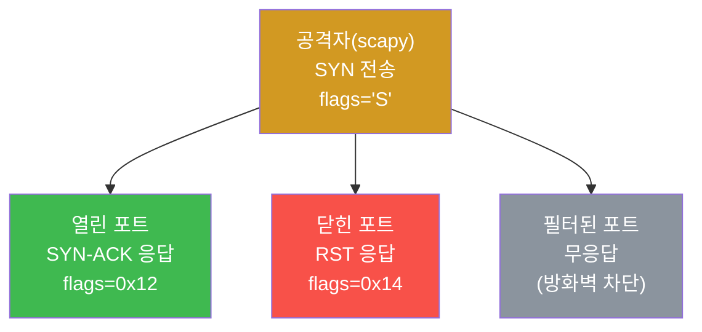
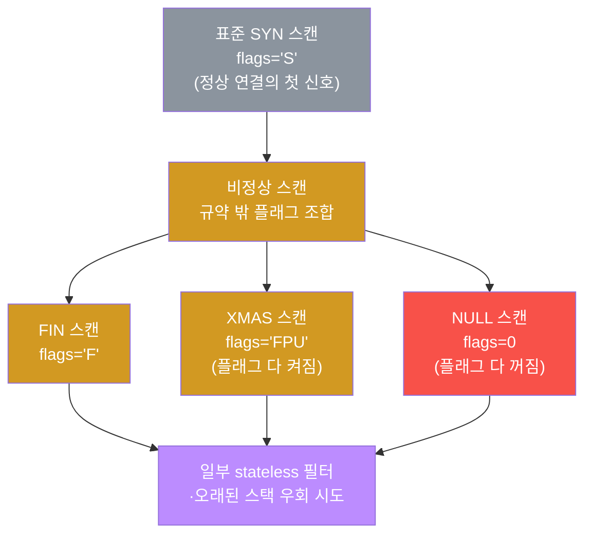
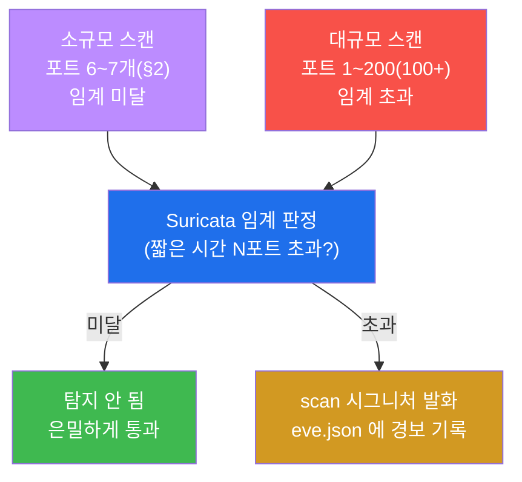
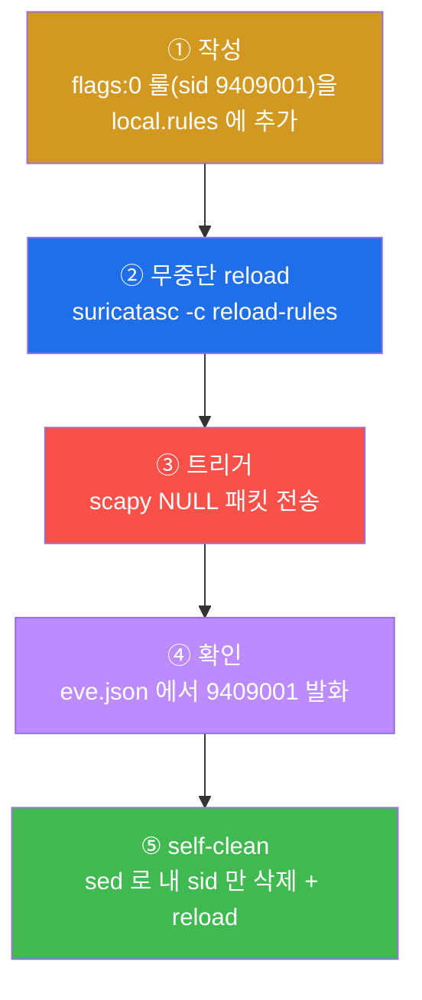
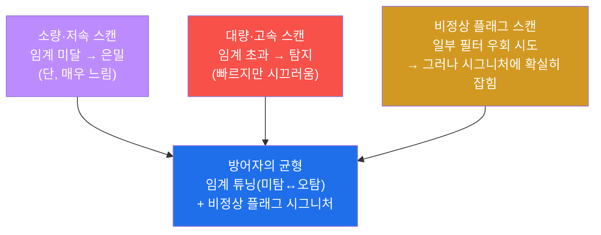
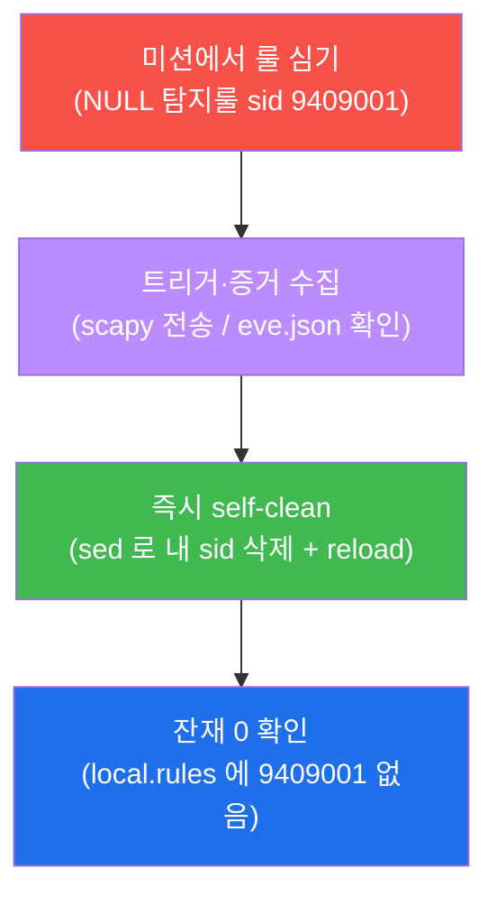
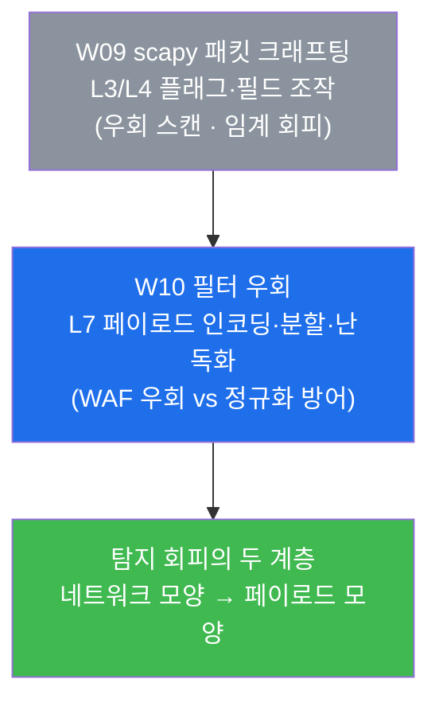

# 공격기법 W09 — 패킷을 직접 만들다: scapy 크래프팅과 포트 스캔 탐지 회피

> **본 주차의 한 줄 요약**
>
> 지난 8주 동안 학생은 nmap·sqlmap 같은 **완성된 도구**로 정찰부터 익스플로잇 체인까지
> 수행했다. 이 도구들은 편리하지만, 공격자에게 패킷의 모양을 직접 고를 자유를 주지는
> 않는다. 이번 주에는 한 단계 아래로 내려가, **scapy** 라는 라이브러리로 TCP 패킷을
> 한 필드씩 손으로 조립한다. SYN 하나를 직접 만들어 포트가 열렸는지 닫혔는지 판정하고,
> 표준이 아닌 비정상 플래그 조합(FIN·XMAS·NULL)으로 일부 필터·스택을 우회하려 시도하며,
> 그 비정상·대량 트래픽이 방어자의 IDS(Suricata)에 **어떻게 탐지되거나 임계를 빠져나가는지**
> 를 공격자와 방어자 양쪽 시선에서 직접 확인한다.
>
> **공격자 한 줄 결론**: 도구는 "표준 패킷"만 만든다. 패킷을 직접 다루면 **표준 밖의
> 정찰**(우회 스캔)과 **탐지 임계를 가늠한 은밀한 정찰**이 가능해진다. 그러나 같은 통제력은
> 양날의 칼이다 — 정상 트래픽에는 절대 없는 비정상 플래그(NULL 스캔의 flags=0)는 오히려
> **단 한 줄의 시그니처로 확실히 잡힌다.** 좋은 공격자는 "내가 만든 패킷이 와이어 위에서
> 어떻게 보이는가"를 패킷 단위로 안다.

---

## 학습 목표

본 주차 종료 시 학생은 다음 6가지를 **본인 손으로** 할 수 있어야 한다.

1. **패킷 크래프팅**이 무엇이며 nmap 같은 완성 도구와 어떻게 다른지 설명하고, scapy 로
   `IP()/TCP()` 패킷을 한 필드씩 조립해 전송하는 기본기를 익힌다.
2. TCP 플래그(SYN·SYN-ACK·RST·ACK·FIN·PSH·URG)가 각각 무엇을 의미하는지 알고, **SYN 을
   보내 돌아오는 응답 플래그로 포트의 열림/닫힘/필터링을 판정**한다(scapy SYN 스캔).
3. 표준이 아닌 **비정상 스캔(FIN·XMAS·NULL)** 을 scapy 로 수행하고, 이들이 어떤 원리로
   일부 stateless 필터·오래된 스택을 우회하려 하는지 설명한다.
4. **임계 기반 IDS 탐지**의 개념을 이해하고, 소규모 스캔은 임계 미달로 빠져나가지만
   대규모 스캔(100개 이상의 포트)은 Suricata 의 스캔 임계를 넘겨 탐지된다는 것을 증거로 보인다.
5. 정상 트래픽에 결코 나타나지 않는 NULL 스캔(`flags:0`)을 잡는 **네트워크 탐지룰(sid 9409001)**
   을 직접 작성·문법검증·reload·트리거하고, **끝나면 sid 로 삭제해 베이스 룰을 보존**한다.
6. 위 과정을 통해 **은밀(저속·소량) ↔ 탐지(고속·대량)** 의 trade-off 를 정리하고, scapy
   크래프팅의 유연성과 그 흔적을 함께 설명하는 공격 보고서를 작성한다.

> **이번 주의 시선** — 지난주 중간고사가 "개별 기법을 하나의 익스플로잇 체인으로 엮는"
> 사고를 길렀다면, W09 는 그 체인의 **첫 단계(정찰)를 네트워크 계층까지 파고들어** 패킷
> 자체를 통제한다. PTES(침투 테스트 표준)의 정찰 단계를 도구가 아니라 패킷 수준에서
> 수행하는 것이 본 주차의 핵심이다.

---

## 0. 용어 해설 (이번 주 처음 나오는 핵심어)

본 주차는 네트워크 계층의 용어가 처음 다수 등장한다. 헷갈리지 않도록 먼저 정리한다.

| 용어 | 영문 | 뜻 | 비유 |
|------|------|----|------|
| **패킷 크래프팅** | packet crafting | 네트워크 패킷의 각 필드(IP·포트·플래그·페이로드)를 직접 지정해 만드는 행위 | 기성품 대신 부품을 골라 직접 조립하는 것 |
| **scapy** | scapy | 파이썬으로 패킷을 한 필드씩 만들고·보내고·받은 응답을 분석하는 라이브러리 | 패킷용 3D 프린터 + 현미경 |
| **TCP 플래그** | TCP flags | TCP 헤더 안의 1비트 제어 신호들. 켜고 끔으로 연결 의도를 표현 | 편지 봉투의 체크박스(긴급·답장요망 등) |
| **SYN** | synchronize | "연결을 시작하자"는 첫 신호. 정상 연결의 출발점 | 노크 — "들어가도 될까요?" |
| **SYN-ACK** | synchronize-acknowledge | "좋다, 받아줄게"라는 응답. 포트가 **열려 있음**을 뜻함 | "네, 들어오세요" |
| **RST** | reset | "그런 연결은 없다, 끊어라"는 응답. 포트가 **닫혀 있음**을 뜻함 | "그런 사람 없습니다" 하고 문을 닫음 |
| **ACK** | acknowledge | "받았다"는 확인 신호. 이미 성립된 대화의 응답에 쓰임 | "알겠다"는 끄덕임 |
| **FIN / PSH / URG** | finish / push / urgent | 각각 연결종료·즉시전달·긴급 신호. 비정상 스캔은 이들을 엉뚱하게 조합 | 대화 도중 갑자기 "끝/지금/긴급"만 외치기 |
| **SYN 스캔** | SYN scan | SYN 만 보내 응답(SYN-ACK/RST)으로 포트 상태를 보는 정찰. 연결을 끝까지 맺지 않음(반열림) | 노크만 하고 답하는 소리로 판단, 안엔 안 들어감 |
| **비정상 스캔** | FIN/XMAS/NULL scan | 표준 SYN 대신 비정상 플래그로 보내, 일부 필터·스택의 반응 차이를 노리는 정찰 | 정문 대신 엉뚱한 문을 두드려 반응을 떠봄 |
| **임계 기반 IDS 탐지** | threshold-based detection | "일정 시간 안에 같은 출처가 N개 넘는 포트/연결을 건드리면 스캔" 식으로 횟수 임계로 판정 | 같은 사람이 문을 100번 두드리면 경비가 출동 |
| **시그니처 탐지** | signature detection | 패킷에 특정 패턴(예: flags=0)이 나타나면 즉시 경보. 임계와 달리 한 번만 보여도 잡힘 | 지명수배 전단의 얼굴과 일치하면 즉시 체포 |
| **IDS** | Intrusion Detection System | 네트워크 트래픽을 검사해 공격을 탐지하는 장비(el34 에선 Suricata) | 복도의 CCTV + 경비 |
| **stateless 필터** | stateless filter | 패킷 하나하나만 보고 연결의 맥락(이전에 SYN 이 있었나)은 기억하지 않는 방화벽 | 앞 손님을 기억 못 하는 검표원 |

> **헷갈리기 쉬운 한 쌍 — 임계 탐지 vs 시그니처 탐지.** 이번 주의 방어 메커니즘은 두
> 종류다. **임계 기반 탐지**는 "얼마나 많이(횟수)" 를 본다 — 포트 1개를 두드리는 것은
> 정상일 수 있으니 그냥 두지만, 짧은 시간에 100개 넘게 두드리면 "스캔"으로 경보한다.
> 그래서 공격자는 **소량·저속**으로 임계 아래를 기어가면 빠져나갈 수 있다. 반대로
> **시그니처 탐지**는 "무엇을(패턴)" 을 본다 — 정상 트래픽에는 결코 없는 모양(예: TCP
> 플래그가 전부 0인 NULL 패킷)이 단 한 개만 지나가도 즉시 잡는다. 이 패턴은 횟수로
> 숨길 수 없다. 본 주차의 두 미션(대규모 스캔 탐지 / NULL 룰 탐지)은 바로 이 두 탐지
> 방식의 차이를 몸으로 익히게 한다.

---

## 1. 왜 도구를 넘어 패킷을 직접 만드는가

### 1.1 한 줄 답: 도구는 "표준 패킷"만 만든다

W01–W08 에서 학생은 nmap 으로 포트를 스캔하고 sqlmap 으로 SQLi 를 자동화했다. 이 도구들은
검증된 표준 패킷을 빠르고 안정적으로 만들어 준다. 그러나 도구가 정해 둔 틀을 벗어나는 일,
예컨대 "SYN 도 FIN 도 아닌 플래그 조합을 보내 보겠다", "헤더의 이 필드만 일부러 비정상으로
채워 스택의 반응을 보겠다" 같은 시도는 도구의 옵션만으로는 한계가 있다.

**패킷 크래프팅**은 이 한계를 푼다. 네트워크 패킷의 각 계층(IP 주소·TCP 포트·TCP 플래그·
페이로드)을 **공격자가 한 필드씩 직접 지정**해 만들기 때문에, 표준을 벗어난 어떤 패킷이든
조립해 전송할 수 있다. 정찰의 정교함(우회 스캔)과 은밀함(임계 회피)이 여기서 나온다.



위 그림에서 도구(회색)는 출발점일 뿐이다. 패킷을 직접 다루는 순간(파랑) 공격자는 표준을
벗어난 정찰(주황)과 탐지 임계를 가늠한 정찰(보라)이라는 두 갈래의 새 능력을 얻는다. 이것이
이번 주에 한 계층 아래로 내려가는 이유다.

### 1.2 scapy 란 무엇인가

**한 줄 정의.** scapy 는 파이썬에서 패킷을 한 필드씩 조립하고, 전송하고, 돌아온 응답을
객체로 분석하는 라이브러리다. el34 의 공격자 컨테이너(`외부 공격자 VM 192.168.0.202`)에 **scapy 2.4.4** 이
설치되어 있다.

**왜 중요한가.** scapy 의 진짜 가치는 "패킷을 보낸다"가 아니라 **"보낸 패킷과 받은 응답을
프로그래밍 객체로 자유롭게 다룬다"** 는 데 있다. 응답 패킷의 TCP 플래그를 숫자로 꺼내
비교하고, 포트 범위를 리스트로 한 번에 보내고, 조건에 맞는 응답만 골라내는 일을 파이썬
한 줄로 한다. nmap 이 결과를 "사람이 읽는 표"로 준다면, scapy 는 결과를 "코드가 다루는
데이터"로 준다.

**el34 에서 어떻게.** scapy 로 패킷을 보내려면 운영체제의 **raw socket**(원시 소켓 — 일반
프로그램이 못 만지는 낮은 계층의 패킷을 직접 보내는 권한)이 필요하고, 이는 root 권한을
요구한다. 외부 공격자 VM 192.168.0.202는 root 로 동작하므로 scapy 가 그대로 동작한다.

```bash
# scapy 가용 확인 — 버전이 찍히면 패킷 크래프팅 준비 완료
python3 -c "import scapy; print('scapy', scapy.__version__)"
```

**한계.** scapy 는 강력하지만 **저수준이라 느리고, 잘못 쓰면 통제 불능의 트래픽**을 만들 수
있다. 또한 el34 에는 같은 목적의 또 다른 패킷 도구인 **hping3 가 설치되어 있지 않다** — 본
주차의 모든 패킷 크래프팅은 scapy 로 수행한다(hping3 를 쓰는 외부 예제를 그대로 따라 하면
"command not found" 가 난다는 점에 주의).

### 1.3 PTES 관점 — 패킷 크래프팅은 정찰의 심화다

W01 에서 배운 PTES(Penetration Testing Execution Standard, 침투 테스트 표준 6단계: 정찰 →
취약점 분석 → 익스플로잇 → 포스트 익스플로잇 → 보고)에서, 패킷 크래프팅은 **첫 단계인
정찰을 더 깊이 파고드는 기술**이다. 같은 정찰이라도 도구가 만든 표준 스캔과, 패킷을 손으로
짠 우회·은밀 스캔은 방어자에게 남기는 흔적의 양과 종류가 크게 다르다.



> ⚠️ **인가된 실습만.** 이 트랙의 모든 패킷 크래프팅·스캔은 **인가된 실습 환경(el34)** 안에서,
> 정해진 대상(`외부 공격자 VM 192.168.0.202` → el34 내부 fw 게이트웨이 `192.168.0.161`)에 한해서만 수행한다.
> 임의 외부 IP·실제 서비스를 향한 포트 스캔은 많은 국가에서 불법이며 본 과정의 RoE(교전
> 규칙)와 윤리 규정을 위반한다. 실습에서 작성한 IDS 룰은 그 미션 안에서 반드시 self-clean
> 한다(§5·§8).

---

## 2. scapy 기본 — SYN 스캔으로 포트 상태를 읽다

### 2.1 TCP 플래그 — 포트 상태를 말해 주는 신호

**한 줄 정의.** TCP 플래그는 TCP 헤더 안의 작은 제어 비트들로, 켜고 끔으로 "연결을 시작하자
(SYN)", "받아준다(SYN-ACK)", "끊어라(RST)" 같은 의도를 표현한다.

**왜 중요한가.** 포트 스캔의 본질은 **"SYN 을 하나 보내고, 무엇이 돌아오는지를 본다"** 이다.
열린 포트는 "받아주겠다"는 의미로 SYN-ACK 을, 닫힌 포트는 "그런 연결 없다"는 의미로 RST 을
돌려준다. 그래서 돌아온 플래그를 읽으면 포트 상태를 알 수 있다. 정상적인 연결이라면 이
뒤에 ACK 을 보내 3-way 핸드셰이크를 완성하지만, SYN 스캔은 그 마지막 ACK 을 일부러 보내지
않아 연결을 끝까지 맺지 않는다(그래서 "반열림 스캔"이라 부른다).



위 세 갈래가 SYN 스캔이 읽어 내는 전부다. **SYN-ACK(0x12)=열림, RST(0x14)=닫힘, 무응답=
필터링(방화벽이 조용히 버림).** `0x12`·`0x14` 는 여러 플래그 비트가 동시에 켜진 상태를
16진수로 표기한 것으로, scapy 가 응답 패킷의 플래그를 이 숫자로 알려 준다(0x12 = SYN+ACK,
0x14 = RST+ACK).

### 2.2 el34 에서 어떻게 — sr() 로 보내고 응답을 거른다

scapy 의 핵심 함수는 `sr()`(send-receive)이다. **패킷을 보내고 돌아온 응답을 받아 두 묶음
(응답이 온 것 `ans`, 안 온 것 `unans`)으로 돌려준다.** 포트 리스트를 한 번에 넣으면 여러
포트를 동시에 떠볼 수 있다.

```bash
# fw 게이트웨이의 여러 포트에 SYN 을 한 번에 보내, SYN-ACK(0x12) 받은 포트만 open 으로 출력
python3 -c "from scapy.all import *; \
  ans,u=sr(IP(dst='192.168.0.161')/TCP(dport=[22,80,443,8001,8002,3306],flags='S'),timeout=4,verbose=0); \
  print('open:', sorted(p[1].sport for p in ans if p[1][TCP].flags==0x12))"
```

이 한 줄을 뜯어보면 패킷 크래프팅의 문법이 보인다.

- **`IP(dst='192.168.0.161')`** — IP 계층. 목적지를 fw 게이트웨이로 지정한다.
- **`/TCP(dport=[...],flags='S')`** — TCP 계층을 IP 위에 "쌓는다"(scapy 의 `/` 는 계층을
  포갠다는 뜻). `dport` 는 목적 포트 리스트, `flags='S'` 는 SYN 만 켠 패킷.
- **`sr(...)`** — 만든 패킷을 보내고 응답을 받는다. `timeout=4` 는 4초까지 응답을 기다리고,
  `verbose=0` 은 진행 로그를 끈다.
- **`for p in ans if p[1][TCP].flags==0x12`** — 받은 응답 중 플래그가 `0x12`(SYN-ACK)인
  것만 골라, 그 출발 포트(`sport`)를 모은다. 즉 **열린 포트만 추려 낸다.**

**무엇을 보나.** 출력 `open: [...]` 에 나타난 포트가 열린 포트다. nmap 이 자동으로 해 주던
일을 scapy 로 **한 필드씩 직접** 한 것이며, 이렇게 직접 다루기에 다음 절의 비정상 플래그
조합도 자유롭게 만들 수 있다.

### 2.3 응답 패킷을 직접 분석하기 — sr1()

포트 하나의 응답만 자세히 보고 싶을 때는 `sr1()`(send-receive-1)을 쓴다. **첫 응답 패킷
하나만 돌려주는** 함수다.

```bash
# 포트 80 에 SYN 하나를 보내고, 돌아온 응답 패킷의 TCP 플래그를 직접 해석
python3 -c "from scapy.all import *; \
  a=sr1(IP(dst='192.168.0.161')/TCP(dport=80,flags='S'),timeout=3,verbose=0); \
  print('flags:', str(a[TCP].flags) if a else 'no-resp')"
```

**무엇을 보나.** 응답 플래그를 사람이 읽는 글자로 보여 준다 — `SA`(SYN-ACK)=열림, `RA`
(RST-ACK)=닫힘, `no-resp`(무응답)=필터링. 2.2 에서는 숫자(`0x12`)로 걸렀고, 여기서는 같은
플래그를 글자(`SA`)로 읽는다. **둘은 같은 정보를 숫자/글자로 표현한 것**이다. 이것이 "패킷
분석" — 와이어를 흐르는 응답의 의미를 필드 단위로 해독하는 일 — 의 가장 기본 형태다.

**한계.** 응답 플래그만으로는 "왜 무응답인가"(방화벽 차단인지, 패킷 유실인지)까지는
단정할 수 없다. 그래서 정확한 정찰은 응답 분석에 더해 타이밍·재시도·다른 스캔 기법을 함께
본다.

---

## 3. 비정상 스캔 — FIN / XMAS / NULL

### 3.1 한 줄 정의와 원리

**한 줄 정의.** 비정상 스캔은 표준 SYN 대신 **TCP 규약상 정상 연결에는 나오지 않는 플래그
조합**을 보내, 그에 대한 응답(또는 무응답)의 차이로 포트 상태를 떠보거나 일부 필터를
우회하려는 정찰이다.

**왜 이런 걸 하나.** 어떤 stateless 필터나 오래된 TCP 스택은 SYN 패킷만 꼼꼼히 검사하고,
규약을 벗어난 엉뚱한 플래그 조합은 제대로 처리하지 못해 반응이 달라진다. 공격자는 이 반응
차이를 이용해 **SYN 스캔이 막히는 곳을 우회**하려 한다. 세 가지 대표 기법은 다음과 같다.

| 스캔 | scapy 플래그 | 원리 |
|------|-------------|------|
| **FIN 스캔** | `flags='F'` | FIN 만 보냄. 규약상 닫힌 포트는 RST 로 답하고, 열린 포트는 무응답 — 이 차이로 판정 |
| **XMAS 스캔** | `flags='FPU'` | FIN+PSH+URG 를 동시에 켬. 패킷에 "불이 다 켜진" 모양이라 크리스마스트리(XMAS) |
| **NULL 스캔** | `flags=0` | 플래그를 하나도 켜지 않음. 정상 트래픽에는 **결코 존재하지 않는** 모양 |



### 3.2 el34 에서 어떻게

scapy 로는 플래그 문자열만 바꾸면 세 스캔을 모두 만들 수 있다. 패킷을 직접 다루기에
가능한 유연성이다(nmap 에도 `-sF`/`-sX`/`-sN` 옵션이 있지만, scapy 는 더 낮은 계층에서
임의 조합까지 만들 수 있다).

```bash
# FIN(F) → XMAS(FPU) → NULL(0) 세 비정상 스캔을 차례로 전송
python3 -c "from scapy.all import *; \
  sr(IP(dst='192.168.0.161')/TCP(dport=80,flags='F'),timeout=2,verbose=0); \
  sr(IP(dst='192.168.0.161')/TCP(dport=80,flags='FPU'),timeout=2,verbose=0); \
  sr(IP(dst='192.168.0.161')/TCP(dport=80,flags=0),timeout=2,verbose=0); \
  print('FIN/XMAS/NULL sent')"
```

**무엇을 보나.** `FIN/XMAS/NULL sent` 가 찍히면 세 비정상 패킷이 와이어로 나간 것이다.
응답의 유무·종류는 대상 스택과 필터의 처리 방식에 따라 달라지므로, 이 미션의 학습
초점은 "응답 결과"가 아니라 **"표준이 아닌 플래그 조합을 직접 만들어 보냈다"** 는 크래프팅
경험과, 다음 절에서 보게 될 **그 비정상 패턴이 방어자에게 어떻게 보이는가** 이다.

### 3.3 한계 — 우회의 대가는 "더 잘 잡힘"

비정상 스캔은 우회를 노리지만 대가가 있다. 현대의 방화벽·IDS 는 **"정상 트래픽에는 없는
모양"** 을 오히려 강력한 탐지 신호로 본다. 특히 NULL 스캔(flags=0)은 어떤 정상 통신에도
나타날 수 없으므로, 단 한 개의 패킷만으로도 **시그니처 한 줄에 확실히 잡힌다**(§5 에서
직접 작성해 본다). 즉 비정상 스캔은 "어떤 필터는 우회하지만 어떤 탐지에는 더 잘 걸리는"
trade-off 위에 있다.

---

## 4. 탐지 — 임계 기반 스캔 탐지

### 4.1 한 줄 정의: "얼마나 많이 두드렸나"로 잡는다

**한 줄 정의.** 임계 기반 IDS 탐지는 "한 출처가 짧은 시간 안에 정해진 횟수(임계)를 넘는
포트·연결을 건드리면 스캔으로 판정"하는 방식이다. 개별 패킷의 모양이 아니라 **빈도·규모**를
본다.

**왜 이렇게 하나.** 포트 한두 개를 두드리는 것은 정상 통신에서도 늘 일어난다. 그래서 단일
패킷만으로는 "정찰인지 정상인지" 구분이 어렵다. 대신 **같은 출처가 수십·수백 개 포트를
빠르게 훑는 패턴**은 정상 통신에선 거의 없으므로, 그 규모가 임계를 넘는 순간을 스캔으로
잡는다.

### 4.2 el34 에서 어떻게 — 소규모는 통과, 대규모는 탐지

여기에 공격자에게 중요한 사실이 있다. **el34 의 Suricata 는 소규모 스캔(포트 몇 개)에는
임계가 발동하지 않는다.** §2 에서 6~7개 포트를 SYN 스캔했을 때 "scan" 경보가 뜨지 않은
이유가 이것이다. 탐지를 보려면 **임계를 확실히 넘기는 규모(100개 이상의 포트)** 가 필요하다.

```bash
# 1~200 포트에 대량 SYN 스캔 → 잠시 후 Suricata eve.json 에서 같은 출처의 scan 경보 집계
python3 -c "from scapy.all import *; \
  sr(IP(dst='192.168.0.161')/TCP(dport=(1,200),flags='S'),timeout=6,verbose=0); print('mass scan sent')"
sleep 5
docker exec el34-ips sh -c 'tail -3000 /var/log/suricata/eve.json | jq -rc "select(.event_type==\"alert\" and .src_ip==\"192.168.0.202\" and (.alert.signature|test(\"scan\";\"i\")))|.alert.signature" | sort | uniq -c | tail -2'
```

명령을 해석하면 이렇다. `dport=(1,200)` 은 포트 1번부터 200번까지를 **범위**로 지정하는
scapy 문법이다(리스트가 아니라 튜플이면 범위). 이 200개 포트로의 SYN 이 한꺼번에 나가면
Suricata 의 스캔 임계를 넘긴다. 뒤이어 `el34-ips` 의 `/var/log/suricata/eve.json`(Suricata
가 모든 탐지를 JSON 한 줄씩 적는 로그)에서, **출처 IP `192.168.0.202`**(외부 공격자 VM 192.168.0.202 의 내부
주소 — el34 는 SNAT 를 하지 않아 출처가 보존된다)이면서 시그니처에 `scan` 이 들어간 경보만
`jq` 로 추려 개수를 센다.



**무엇을 보나.** 출력에 `scan` 을 포함한 시그니처와 그 개수가 나타나면, 대규모 스캔이 임계
탐지에 걸린 것이다. 핵심 깨달음은 **"같은 SYN 스캔이라도 규모에 따라 잡히기도, 빠져나가기도
한다"** — 이것이 바로 다음 절의 은밀-탐지 trade-off 다.

**한계.** 임계 탐지는 "느리고 작게" 기어가는 정찰에는 약하다. 그래서 실전 방어자는 임계값을
무작정 낮추지 않는다 — 너무 낮추면 정상 통신까지 스캔으로 오탐(false positive)하기 때문이다.
임계 튜닝은 "놓침(미탐)"과 "오탐" 사이의 균형 문제다.

---

## 5. 네트워크 탐지룰 — 비정상 플래그를 시그니처로 잡다

### 5.1 임계로 못 잡는 것은 시그니처로 잡는다

§4 의 임계 탐지는 "규모"로 잡으므로, 소량이면 놓친다. 그렇다면 **소량이라도 모양 자체가
비정상인 패킷**(NULL 스캔의 flags=0)은 어떻게 잡을까? 답은 **시그니처 탐지** — "이 패턴이
보이면 횟수와 무관하게 즉시 경보"하는 룰이다. NULL 스캔은 정상 트래픽에 결코 없으므로,
flags=0 단 하나만 잡으면 되는 **명확한 시그니처 대상**이다.

> **용어 — Suricata / local.rules / sid.** **Suricata** 는 el34 의 IDS 엔진이다. 탐지
> 규칙은 텍스트 파일 `local.rules` 에 한 줄씩 적는다. 각 룰은 고유 번호 **sid**(signature
> id)로 식별한다. 학생은 다른 학생·베이스 룰과 겹치지 않도록 **이번 주 네임스페이스
> `9409xxx`** 를 쓰고, 끝나면 **그 sid 만 골라 삭제**해 베이스 룰을 그대로 보존한다.

### 5.2 el34 에서 어떻게 — 룰의 수명주기 전체

탐지룰은 한 번 쓰고 끝이 아니라 **작성 → 문법검증 → reload → 트리거 → 확인 → 정리** 라는
수명주기를 돈다. el34 에서 이 전 과정을 직접 수행한다.

```bash
# ① NULL 스캔(flags:0) 탐지룰을 local.rules 에 추가 (sid 9409001)
docker exec el34-ips sh -c 'sudo bash -c "cat >> /etc/suricata/rules/local.rules <<EOF
alert tcp any any -> any any (msg:\"W9 NULL scan detected\"; flags:0; sid:9409001; rev:1;)
EOF"'
# ② 무중단 reload (데몬을 멈추지 않고 룰만 다시 읽음)
docker exec el34-ips sh -c 'sudo suricatasc -c reload-rules'; sleep 2
# ③ 트리거 — NULL 패킷 전송
sudo python3 -c "from scapy.all import *; sr(IP(dst='192.168.0.161')/TCP(dport=80,flags=0),timeout=2,verbose=0); print('null sent')"
sleep 4
# ④ eve.json 에서 내 룰(9409001)이 잡혔는지 확인
docker exec el34-ips sh -c 'sudo grep "9409001" /var/log/suricata/eve.json | tail -1 | jq "{sig:.alert.signature}"'
# ⑤ self-clean — 내 sid 만 삭제 후 reload (베이스 룰 보존)
docker exec el34-ips sh -c 'sudo sed -i "/sid:9409001/d" /etc/suricata/rules/local.rules; sudo suricatasc -c reload-rules >/dev/null'
```

룰 한 줄의 문법을 읽어 보자. `alert tcp any any -> any any` 는 "어떤 출발지에서 어떤
목적지로 가는 TCP 든"을 뜻하고, `msg:"..."` 는 경보에 붙는 설명, **`flags:0`** 이 핵심
조건으로 "TCP 플래그가 하나도 안 켜진(NULL) 패킷"을 의미하며, `sid:9409001` 이 이 룰의
고유 번호다.



> **용어 — suricata -T / suricatasc / reload-rules.** 실습 정답에서는 룰을 적용하기 전
> **`suricata -T`**(테스트 모드 — 룰 문법이 올바른지 실제 적용 없이 검사)로 문법을 먼저
> 검증한다. **`suricatasc`** 는 Suricata 데몬에 명령을 보내는 소켓 클라이언트이고,
> **`reload-rules`** 는 데몬을 멈추지 않고 룰만 다시 읽게 하는 무중단 명령이다. 운영 중인
> IDS 를 끊지 않고 룰을 갱신하는, 실무의 표준 절차다.

**무엇을 보나.** ④ 단계에서 eve.json 에 `W9 NULL scan detected` 시그니처가 나타나면 내 룰이
정확히 NULL 패킷을 잡은 것이다. ⑤ 이후 `local.rules` 에서 9409001 이 사라지면 베이스 룰을
온전히 보존한 채 실습을 마친 것이다. (탐지 확인은 환경 타이밍에 따라 베스트에포트로, 정답
스크립트는 `grep -c` 로 발화 건수를 센다.)

**한계.** 시그니처 탐지는 "아는 패턴"만 잡는다. 공격자가 NULL 이 아닌, 정상과 구분이 모호한
플래그 조합으로 바꾸면 단순 시그니처는 놓칠 수 있다. 그래서 실전 방어는 시그니처(모양) +
임계(규모) + 이상행위(베이스라인 이탈)를 **함께** 쓴다.

---

## 6. 은밀 vs 탐지 — 공격자와 방어자의 줄다리기

§4 와 §5 를 합치면 이번 주의 결론이 보인다. 공격자의 정찰은 **속도·규모를 높이면 빨라지지만
잡히고, 낮추면 은밀하지만 느리다.** 방어자는 그 반대 방향에서 임계와 시그니처를 조율한다.
이 줄다리기를 한 장으로 정리한다.



| 공격자 선택 | 장점 | 대가 | 방어자 대응 |
|------------|------|------|------------|
| 소량·저속 SYN | 임계 미달로 은밀 | 매우 느림, 정찰 효율 낮음 | 장기 누적·이상행위 분석 |
| 대량·고속 SYN | 빠른 표면 매핑 | 임계 초과로 탐지 | 임계 기반 scan 룰 |
| 비정상(FIN/XMAS/NULL) | 일부 stateless 필터 우회 | 정상에 없는 모양 → 시그니처에 확실히 잡힘 | flags 기반 시그니처(§5) |

이 표를 양방향으로 읽을 수 있으면 이번 주의 핵심을 갖춘 것이다. **공격자 방향** — "은밀하게
가려면 느림을, 빠르게 가려면 노출을 감수한다." **방어자 방향** — "규모는 임계로, 모양은
시그니처로 잡되, 임계를 너무 낮추면 오탐이 늘어난다." 좋은 공격자는 자기 정찰이 어느 쪽
탐지에 걸리는지를 패킷 단위로 안다.

---

## 7. 실습 안내 — scapy lab 8 미션 (4 축 설명)

이번 주 실습은 8 미션으로, scapy 점검 → SYN 크래프팅 → 비정상 스캔 → 대규모 스캔 탐지 →
패킷 분석 → 탐지룰 → 은밀 vs 탐지 → 보고서 순서로 흐른다. 각 미션을 **4 축**으로 설명한다 —
왜 하는가 / 무엇을 알 수 있는가 / 결과 해석(정상 vs 비정상) / 실전 활용.

> **실습 진행 원칙.** 모든 명령은 el34 호스트(`ssh ccc@192.168.0.80`)에서
> `ssh att@192.168.0.202`(공격) 또는 `docker exec el34-ips`(방어)로 실행한다. **인가된
> 실습 환경(el34)에서만** 수행하며, IDS 룰은 그 미션 안에서 self-clean 한다. 합격 임계값은
> 0.7 이다.

### 미션 1 — 점검: scapy (10점, survey)

> **왜 하는가?** 패킷 크래프팅의 전제는 scapy 가 동작해야 한다는 것이다. 모든 모의 작업의
> 첫 단계는 도구 가용성 점검이다.
>
> **무엇을 알 수 있는가?** 외부 공격자 VM 192.168.0.202에 scapy 가 설치되어 있고(버전 2.4.4), raw socket
> 은 sudo 로 쓸 수 있는지.
>
> **결과 해석.** 정상: `scapy <버전>` 이 출력됨 → 크래프팅 준비 완료. 비정상: import 오류면
> 라이브러리·권한 문제이므로 먼저 해결한다.
>
> **실전 활용.** 패킷 수준 작업 착수 시 첫 점검. 도구가 없으면 어떤 크래프팅도 시작할 수 없다.

### 미션 2 — SYN 크래프팅: open 포트 식별 (12점, manipulation)

> **왜 하는가?** 정찰의 기본인 포트 스캔을 도구가 아니라 패킷으로 직접 수행해, SYN 하나가
> 어떻게 포트 상태를 읽어 내는지 손으로 익힌다.
>
> **무엇을 알 수 있는가?** `sr()` 로 여러 포트에 SYN 을 보내고, 응답 플래그 `0x12`(SYN-ACK)
> 인 포트만 골라 open 으로 식별하는 법.
>
> **결과 해석.** 정상: `open: [...]` 에 열린 포트가 나타남. 핵심 깨달음 — nmap 이 자동화하던
> 일을 패킷 한 필드씩 직접 했고, 그래서 다음 미션의 비정상 플래그도 만들 수 있다.
>
> **실전 활용.** 모든 정찰의 출발점. 도구가 막히거나 비표준 동작이 필요할 때 패킷을 직접
> 짜는 능력이 차별점이 된다.

### 미션 3 — 비정상 스캔: FIN/XMAS/NULL (12점, manipulation)

> **왜 하는가?** 표준 SYN 만으로 막히는 곳을 우회하려는 시도를 직접 만들어 본다. 패킷을
> 손으로 다루기에 가능한 유연성을 체험한다.
>
> **무엇을 알 수 있는가?** `flags='F'`/`'FPU'`/`0` 세 가지로 FIN·XMAS·NULL 패킷을 조립·전송
> 하는 법. 비정상 플래그가 어떤 원리로 일부 필터를 우회하려 하는지.
>
> **결과 해석.** 정상: `FIN/XMAS/NULL sent` 출력 → 세 비정상 패킷 전송 성공. 핵심 깨달음 —
> 우회를 노리지만, 정상에 없는 모양이라 다음 미션들에서 보듯 오히려 탐지에 취약하다.
>
> **실전 활용.** 방화벽·스택의 처리 차이를 떠보는 정찰 기법(nmap 의 -sF/-sX/-sN 에 대응).

### 미션 4 — 대규모 스캔 → Suricata 탐지 (14점, detect)

> **왜 하는가?** 같은 SYN 스캔이라도 규모가 임계를 넘으면 탐지된다는 것을 증거로 확인한다.
> 임계 기반 탐지의 작동을 직접 본다.
>
> **무엇을 알 수 있는가?** `dport=(1,200)` 대량 스캔이 Suricata 의 스캔 임계를 초과해
> eve.json 에 `scan` 경보로 남는 것. 소량(미션 2)은 임계 미달로 빠져나간다는 대비.
>
> **결과 해석.** 정상: eve.json 집계에 `scan` 시그니처가 잡힘. 핵심 깨달음 — 소규모는 은밀,
> 대규모는 탐지. 규모가 탐지 여부를 가른다.
>
> **실전 활용.** 공격자는 "얼마나 빠르게 vs 얼마나 은밀하게"를 저울질하고, 방어자는 그
> 임계를 어디에 둘지 튜닝한다.

### 미션 5 — 패킷 분석: 응답 플래그 해석 (12점, analysis)

> **왜 하는가?** 정찰의 절반은 "보낸 것"이 아니라 "받은 것"을 읽는 일이다. 응답 패킷을
> 필드 단위로 해석하는 패킷 분석의 기본을 익힌다.
>
> **무엇을 알 수 있는가?** `sr1()` 로 응답 하나를 받아 TCP 플래그를 꺼내, `SA`=open /
> `RA`=closed / 무응답=filtered 로 판정하는 법.
>
> **결과 해석.** 정상: `flags: SA`(또는 RA/no-resp) 출력 → 플래그가 포트 상태를 말해 줌.
> 핵심 깨달음 — 응답의 플래그 한 필드가 곧 포트 상태의 정보다.
>
> **실전 활용.** 모든 스캔·디버깅의 토대. 와이어의 응답을 직접 해독할 수 있어야 비표준
> 상황을 판단한다.

### 미션 6 — 네트워크 탐지룰: NULL 스캔 (sid 9409001) (14점, manipulation)

> **왜 하는가?** 좋은 공격자는 자기 비정상 패킷이 어떻게 탐지되는지 안다. 방어자 관점으로
> 돌아서서, 정상에 없는 모양(flags=0)을 잡는 시그니처를 직접 설계한다.
>
> **무엇을 알 수 있는가?** Suricata `local.rules` 에 `flags:0` 룰(sid 9409001)을 작성 →
> `suricata -T` 문법검증 → 무중단 reload → NULL 패킷 트리거 → eve 확인 → **sid 로 삭제**까지
> 의 룰 수명주기 전체. 임계로 못 잡는 소량 비정상을 시그니처로 잡는다는 원리.
>
> **결과 해석.** 정상: 문법검증이 `successfully`로 통과하고, 트리거 후 9409001 발화가
> 확인되며, 정리 후 local.rules 에서 9409001 잔재가 0. 비정상: 문법 오류면 룰 한 줄을
> 점검한다.
>
> **실전 활용.** 신종 비정상 트래픽이 나타나면 운영자가 직접 탐지 룰을 작성·검증·배포한 뒤,
> 임시 룰은 정리해 baseline 을 깨끗이 유지한다.

### 미션 7 — 은밀 vs 탐지 (12점, analysis)

> **왜 하는가?** 이번 주의 결론인 은밀-탐지 trade-off 를 스스로 언어로 정리해, 공격·방어
> 양쪽의 선택을 종합한다.
>
> **무엇을 알 수 있는가?** 소량·저속(은밀하나 느림) / 대량·고속(빠르나 탐지) / 비정상 플래그
> (일부 우회하나 시그니처에 잡힘) 의 장단을 한 틀로 정리하는 법.
>
> **결과 해석.** 정상: 속도·은밀의 trade-off 가 정리됨. 핵심 깨달음 — 완벽한 선택은 없고,
> 공격자는 균형을, 방어자는 임계·시그니처 조합을 택한다.
>
> **실전 활용.** 레드팀은 탐지 위험을 가늠해 정찰 속도를 정하고, 블루팀은 미탐·오탐 균형으로
> 임계를 정한다.

### 미션 8 — scapy 공격 보고서 (10점, report)

> **왜 하는가?** 미션 1–7 을 한 보고서로 종합해, 패킷 크래프팅의 유연성과 그 흔적을 문서로
> 입증한다(PTES 6단계 보고).
>
> **무엇을 알 수 있는가?** SYN 크래프팅 → 비정상 스캔 → 대규모 스캔 탐지·탐지룰 → 은밀 vs
> 탐지를 한 보고서로 엮는 표준 구조.
>
> **결과 해석.** 정상: 보고서에 크래프팅·비정상 스캔·탐지가 모두 포함됨. 핵심 결론 — 패킷을
> 직접 조립하면 정찰이 유연해지지만, 비정상·대량 트래픽은 결국 탐지된다.
>
> **실전 활용.** 침투 테스트 보고서에서 정찰 방법과 그 탐지 가능성을 함께 기술하는 것이
> 고객에게 실질적 방어 가치를 준다.

---

## 8. 실습 수칙 — 인가된 실습 + 공유 인프라 보존

el34 는 여러 학생이 함께 쓰는 공유 인프라이며, 이 트랙은 공격을 다루므로 윤리 규정이 특히
엄격하다. 다음 수칙을 반드시 지킨다.

- **인가된 실습만.** 모든 패킷 크래프팅·스캔은 인가된 실습 환경(el34) 안에서, 정해진 대상
  (`외부 공격자 VM 192.168.0.202` → fw 게이트웨이 `192.168.0.161`)에 한해서만. 임의 외부 IP 를 향한 포트
  스캔은 불법이며 RoE 위반이다.
- **baseline 을 수정/삭제하지 말 것.** Suricata 의 base 룰, fw 정책, 정상 서비스는 점검만
  하고 절대 바꾸지 않는다.
- **내 흔적은 내가 정리(self-clean).** 작성한 IDS 룰은 `sed` 로 **내 sid 만** 삭제하고
  reload 한다. 각 미션 안에서 즉시 정리한다.
- **네임스페이스를 지킨다.** 이번 주 IDS sid 는 `9409xxx` 로 고정해 다른 학생·베이스 룰과
  겹치지 않게 한다.
- **증거 우선.** "스캔했다/룰을 만들었다"가 아니라 **scapy 출력·eve.json 경보·문법검증
  결과를 제시**해야 점수다.



---

## 9. 다음 주차 (W10) 예고 — 필터 우회(인코딩·분할·난독화)

W09 는 **네트워크 계층(L3/L4)** 에서 패킷의 플래그·필드를 직접 조작해 정찰을 우회·은밀화했다.
다음 주 W10 은 한 계층 위, **애플리케이션 계층(L7)** 으로 올라간다. 네트워크 플래그가 아니라
HTTP 페이로드 자체를 **인코딩·분할·난독화**해서, ModSecurity 같은 WAF 필터를 빠져나가려는
공격과, 그 입력을 정규화(normalization)해 막는 방어를 다룬다.



W09 가 "패킷의 모양"으로 탐지를 우회·자극했다면, W10 은 "페이로드의 모양"으로 같은 게임을
한 계층 위에서 벌인다. 두 주차를 합치면 **네트워크부터 애플리케이션까지의 탐지 회피 사고**가
완성된다.
