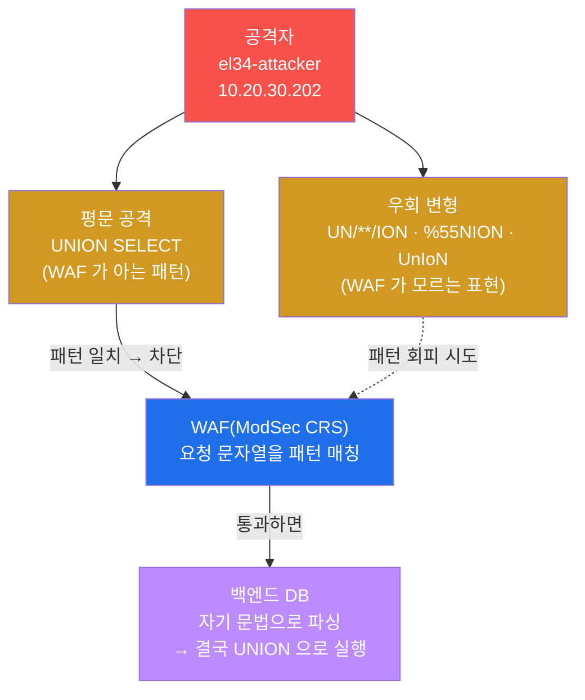
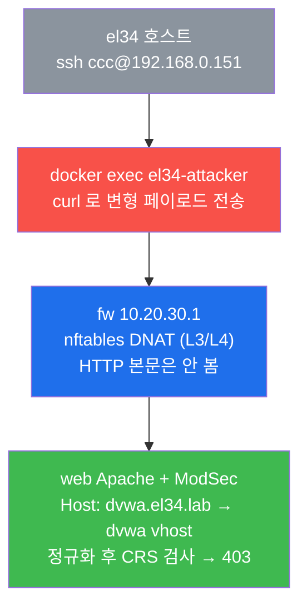
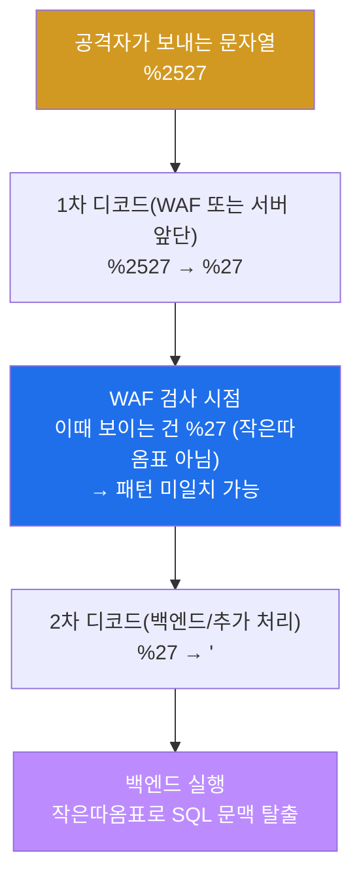
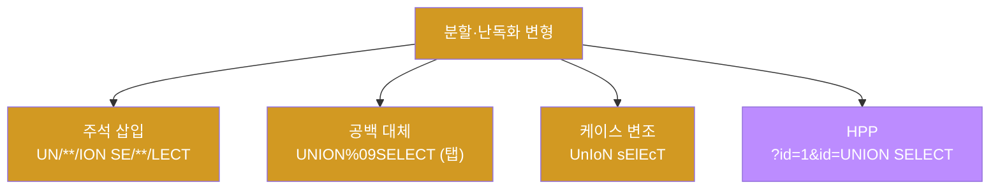
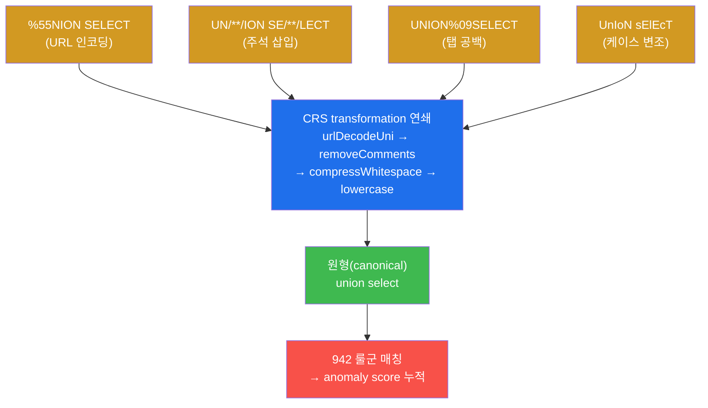
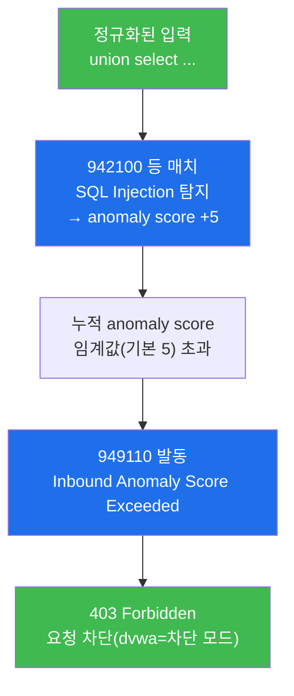
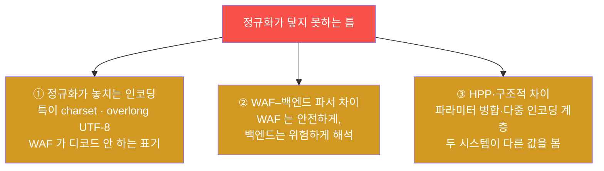
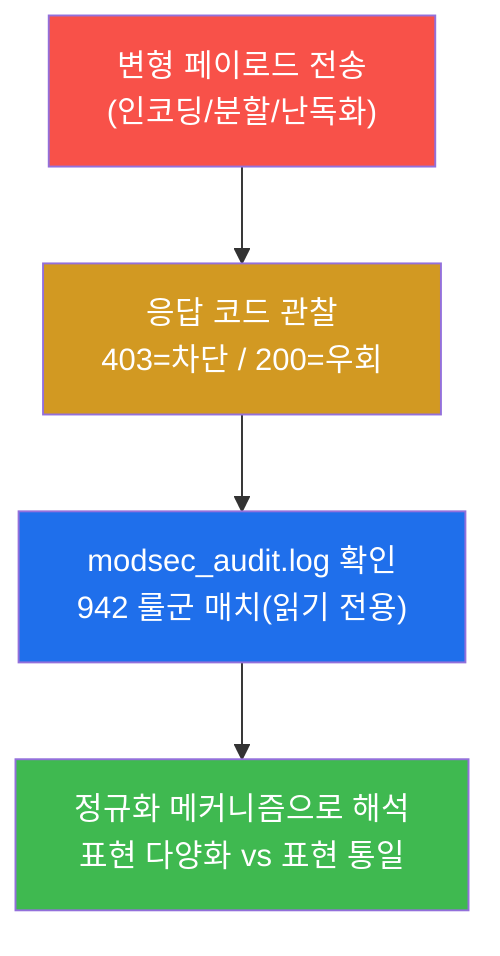
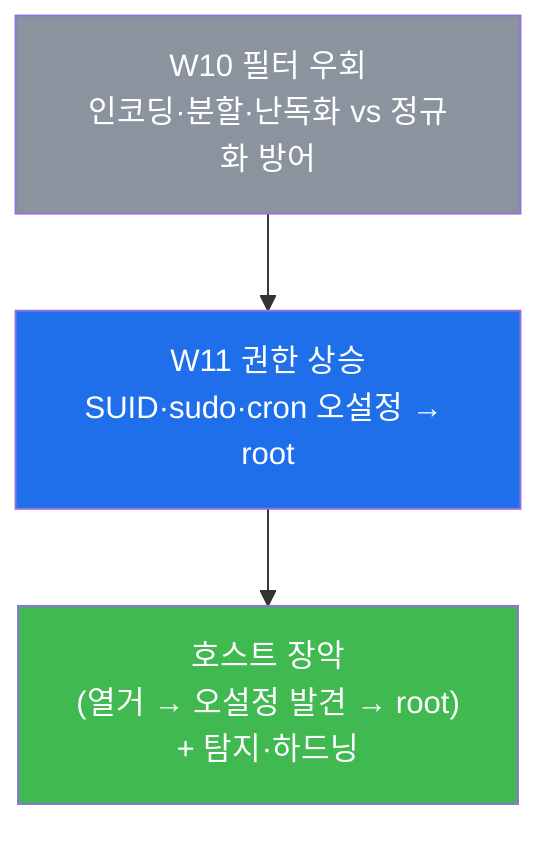

# 공격기법 W10 — 필터를 빠져나가기: 인코딩·분할·난독화 우회 vs 정규화 방어

> **본 주차의 한 줄 요약**
>
> W04–W05 에서 학생은 SQL Injection 과 XSS 가 WAF(ModSecurity + CRS)에 **403 으로
> 차단**되는 것을 보았다. 그런데 공격자는 포기하지 않는다 — **같은 의미의 공격을 다르게
> 표현**해 WAF 의 패턴 매칭을 빠져나가려 한다. 이것이 **WAF 우회(WAF evasion)** 이며, 그
> 무기가 인코딩(encoding) · 분할(splitting) · 난독화(obfuscation) 다. 본 주차에서 학생은
> `el34-attacker` 에서 평문 SQLi(`UNION SELECT`)를 여러 방식으로 변형해 던지고, ModSec 의
> **정규화(normalization)** 가 그 변형들을 어떻게 원형으로 되돌려 다시 잡아내는지를 본인
> 손으로 확인한다. 마지막엔 "단순 우회는 왜 무력한가"와 "그럼에도 우회가 통하는 고급
> 영역은 어디인가"까지 정리한다. **모든 실습은 인가된 el34 실습 환경 안에서만 수행한다.**
>
> **공격자 한 줄 결론**: WAF 우회의 본질은 "**WAF 가 보는 문자열**"과 "**백엔드가 실행하는
> 의미**"를 갈라놓는 것이다. WAF 가 `UN/**/ION` 을 키워드로 못 알아보지만 DB 는 `UNION` 으로
> 실행한다면, 그 틈이 곧 우회의 입구다. 그래서 방어자는 검사 **전에** 모든 표현을 하나로
> 통일(정규화)해 그 틈을 메운다. W10 은 이 "표현 다양화 vs 표현 통일"의 싸움이다.

---

## 학습 목표

본 주차 종료 시 학생은 다음 6가지를 **본인 손으로** 할 수 있어야 한다.

1. WAF 우회의 근본 원리 — "WAF 가 보는 표현"과 "백엔드가 해석하는 의미"의 분리 — 를
   비유 없이 1분 안에 설명하고, 인코딩·분할·난독화가 각각 그 분리를 어떻게 노리는지
   구분한다.
2. `el34-attacker` 에서 평문 SQLi(`UNION SELECT`)를 baseline 으로 던져 dvwa(차단 모드)가
   `403` 으로 막는 것을 확인하고, 이 403 을 우회 성공 여부의 기준점으로 삼는다.
3. URL 인코딩 · 이중 인코딩 · 유니코드 인코딩 · 케이스 변조 · 주석 삽입 · 공백 대체 ·
   파라미터 오염(HPP) 의 각 우회 기법을 실제 curl 페이로드로 변형해 전송하고, **무엇이 막히고
   (인코딩·탭·대소문자=403) 무엇이 뚫리는지(주석분할=302 우회)** 를 실측으로 갈라 해석한다.
4. ModSec CRS 의 **transformation(`t:`)** 4종(`urlDecodeUni` / `lowercase` /
   `removeComments` / `compressWhitespace`)이 각 우회 표현을 어떻게 원형으로 되돌리는지를,
   변형 → 정규화 → 매칭의 흐름으로 설명하고, **정규화가 놓치는 빈틈**(이 CRS 3.3.2 의
   libinjection 이 주석분할 `UN/**/ION` 을 복원 못 해 302 우회)도 실측으로 확인한다.
5. web 컨테이너의 `modsec_audit.log` 에서 본인의 우회 시도들이 정규화 후 **942 룰군(SQLi)**
   에 잡힌 흔적을 찾아, "표현은 달라도 정규화하면 같은 공격"임을 증거로 입증한다.
6. 다수 변형(인코딩·탭·대소문자)이 CRS 정규화에 막히는 이유와, **실제로 통하는 우회**(이 CRS 의
   주석분할 302 우회)·고급 영역(WAF–백엔드 파서 차이, HPP)을 구분해 "WAF 는 완벽이 아니라
   진입장벽"이라는 결론을 정리한다.

> **본 주차의 시선** — W10 은 공격 트랙이지만, "우회가 통했다"를 자랑하는 주가 아니다.
> 오히려 **인코딩·탭·대소문자 변형이 왜 정규화에 막히는지(403)** 를 직접 겪어 정규화의 위력을
> 체감하고, 동시에 **주석분할처럼 정규화가 놓치는 실제 빈틈(302 우회)** 도 확인해 "WAF 는
> 진입장벽이지 완벽이 아니다"를 가늠하는 주다. 채점은 우회 성공/실패의 결과가 아니라,
> 각 기법을 올바르게 시도하고 그 차단을 정규화 메커니즘으로 설명할 수 있는가를 본다.

---

## 0. 용어 해설 (이번 주 처음 나오는 용어)

이번 주에 처음 등장하거나 정확히 짚고 넘어가야 하는 용어를 먼저 정리한다. 본문에서 다시
등장할 때 막히면 이 표로 돌아오면 흐름이 끊기지 않는다.

| 용어 | 영문 | 뜻 | 비유 |
|------|------|----|------|
| **WAF 우회** | WAF evasion / bypass | WAF 의 탐지 패턴에 걸리지 않게 같은 공격을 변형해 통과시키려는 시도 | 금속탐지기를 피하려 흉기를 비금속으로 위장 |
| **인코딩** | encoding | 문자를 다른 표기 규칙으로 바꿔 적는 것(의미는 그대로, 표현만 변경) | 같은 말을 암호표로 바꿔 적기 |
| **URL 인코딩** | percent-encoding | URL 에서 문자를 `%`+16진수로 표기(`U`=`%55`, 공백=`%20`, `'`=`%27`) | 봉투에 못 쓰는 글자를 코드로 바꿔 적기 |
| **이중 인코딩** | double encoding | 이미 인코딩한 문자열을 한 번 더 인코딩(`%` 자체를 `%25` 로) | 암호를 다시 한 번 더 암호화 |
| **유니코드 인코딩** | unicode/wide encoding | 문자를 `%u0055`·overlong UTF-8 같은 유니코드 표기로 변환 | 같은 글자를 다른 문자체계로 적기 |
| **HTML 엔티티** | HTML entity | 문자를 `&#85;`(=U)·`&lt;`(=`<`) 같은 HTML 표기로 변환 | 글자를 HTML 약어로 적기 |
| **케이스 변조** | case manipulation | 키워드의 대소문자를 섞어 패턴 매칭을 피함(`UnIoN`) | 글씨체를 일부러 들쭉날쭉하게 |
| **주석 삽입** | comment injection | SQL 주석(`/**/`)을 키워드 사이에 끼워 쪼갬(`UN/**/ION`) | 단어 사이에 안 보이는 칸막이 끼우기 |
| **공백 대체** | whitespace substitution | 공백을 탭(`%09`)·개행(`%0a`)·주석으로 바꿔 표기 | 띄어쓰기를 다른 빈칸 기호로 |
| **HPP** | HTTP Parameter Pollution | 같은 파라미터를 여러 번 보내(`?id=1&id=UNION`) 서버별 병합 차이를 악용 | 같은 칸을 두 번 적어 처리기를 헷갈리게 |
| **난독화** | obfuscation | 패턴을 알아보기 어렵게 만드는 변형의 총칭(케이스·주석·공백 등) | 글자를 일부러 알아보기 어렵게 흩뜨림 |
| **정규화** | normalization | WAF 가 검사 **전에** 인코딩·주석·대소문자를 원형으로 되돌리는 과정 | 암호로 적힌 글을 풀어서 읽기 |
| **transformation** | transformation (`t:`) | ModSec 이 정규화를 수행하는 함수(룰의 `t:` 액션) | 암호 해독 절차 하나하나 |
| **CRS** | OWASP Core Rule Set | ModSec 의 표준 룰셋(룰 ID 9xxxxx 대역) | 표준 검문 매뉴얼 |
| **942 룰군** | REQUEST-942 | CRS 중 **SQLi 전용** 룰 파일·ID 묶음 | 매뉴얼의 "위조 주문서" 항목 |
| **949110** | rule 949110 | anomaly 누적이 임계 초과 시 **최종 차단**하는 룰 | 감점 한도 초과 → 퇴장 명령 |
| **anomaly score** | anomaly score | CRS 가 룰 위반마다 누적하는 위험 점수(기본 임계 5) | 검문 감점 누적 |
| **파서 차이** | parser differential | WAF 와 백엔드가 같은 입력을 다르게 해석하는 틈 | 두 통역사가 같은 말을 다르게 옮김 |
| **baseline** | baseline | 비교의 기준점(여기선 평문 SQLi 의 403 차단) | 실험의 대조군 |

> **헷갈리기 쉬운 한 쌍 — 표현(representation) vs 의미(semantics).** 본 주차 전체를 관통하는
> 한 가지 구분이 이것이다. `UNION`, `%55NION`, `UN/**/ION`, `UnIoN` 은 **표현이 모두 다르다.**
> 그러나 데이터베이스가 최종적으로 실행하는 **의미는 모두 똑같이 `UNION`** 이다. 공격자의 우회는
> "표현을 바꿔도 의미는 유지된다"는 성질을 이용해 **표현만 보는 WAF**를 속이려는 것이다. 반대로
> 방어자의 정규화는 "표현이 달라도 의미가 같으면 같은 것으로 본다"를 강제해, 검사 전에 모든
> 표현을 하나의 원형으로 되돌린다. 이 한 쌍의 긴장 — 표현을 흩뜨리는 공격 vs 표현을 통일하는
> 방어 — 이 W10 의 전부다.

---

## 1. 이번 주의 통찰 — 같은 공격, 다른 표현

### 1.1 한 줄 답: WAF 는 "문자열"을 보고, 백엔드는 "의미"를 실행한다

W04(SQLi)·W05(XSS)에서 학생은 평문 공격이 WAF 에 막히는 것을 보았다. 그때 ModSec CRS 가
공격을 잡는 방식은 본질적으로 **패턴 매칭** — `UNION SELECT` 같은 알려진 공격 문자열이
요청에 들어 있는지를 룰(정규식)로 찾는 것이다. 여기서 공격자의 발상이 출발한다.

> 만약 WAF 가 찾는 그 **문자열**을, 데이터베이스가 실행하는 **의미**는 그대로 둔 채 다르게
> 바꿔 쓸 수 있다면? WAF 의 패턴에는 안 걸리지만, 백엔드는 여전히 공격으로 실행한다.

이것이 WAF 우회의 한 줄 답이다. WAF 와 백엔드는 같은 입력을 **다른 층위**에서 본다 — WAF 는
HTTP 요청의 바이트/문자열을, 백엔드(DB·웹앱)는 그 입력을 자기 문법으로 파싱한 결과를. 이
두 시선 사이에 틈을 벌리는 것이 모든 우회 기법의 공통 원리다.



공격자가 노리는 것은 위 그림의 점선 — 우회 변형이 WAF 의 패턴 매칭을 빠져나가 백엔드에
닿는 경로다. 백엔드는 표현이 달라도 `UN/**/ION` 을 `UNION` 으로 해석하므로(SQL 문법상
주석은 토큰 구분자), 공격은 유효한 채로 남는다.

### 1.2 왜 중요한가 — WAF 는 마지막 방어선이 아니다

이 주제가 중요한 이유는 **WAF 의 한계를 정확히 알아야 WAF 를 올바르게 운영**할 수 있기
때문이다. 운영자가 "WAF 가 있으니 SQLi 는 막힌다"고 안심하면, 우회 한 번에 그 가정이
무너진다. 반대로 "WAF 는 완벽하지 않다"는 것을 알면, WAF 를 **유일한 방어가 아니라 시간을
벌어주는 한 겹**으로 두고 그 뒤에 입력 검증·파라미터 바인딩(prepared statement)·출력
인코딩 같은 근본 방어를 함께 쌓는다(Defense in Depth). 공격 트랙에서 이 한계를 직접
체감하는 것이, 방어 트랙에서 "WAF 만 믿지 않는" 설계로 이어진다.

또한 el34 는 공격자의 출처 IP 를 `fw → ips → web` 전 계층에 보존(SNAT 없음)하므로, 학생은
자기 우회 시도가 ModSec 로그에 **어떤 흔적으로 남는지**를 같은 실습에서 확인한다. 좋은
공격자는 자기 우회가 어떻게 탐지되는지 안다 — 이것이 더 정교한 회피(고급)의 출발점이다.

### 1.3 el34 에서 어떻게 — 변형해 던지고, 정규화에 막히는 것을 본다

el34 에서 본 주차의 무대는 **dvwa(`dvwa.el34.lab`) vhost** 다. W05 에서 배운 대로 el34 의
web Apache 는 vhost 별로 ModSec 운영 모드가 다르다 — **dvwa 는 차단 모드(SecRuleEngine On
→ 403)**, juice 는 탐지만(DetectionOnly → 200). 우회 성공/실패를 가장 또렷이 보려면 차단형인
dvwa 가 적합하다. 평문 SQLi 가 403 으로 막히는 것을 baseline 으로 잡고, 같은 공격을 인코딩·
분할·난독화로 변형해 던졌을 때 응답 코드가 **여전히 403 인지**(= 우회 실패)를 본다.



핵심은 **fw 는 우회를 막지 못한다**는 점이다. fw 는 L3/L4(IP·포트)만 보므로 HTTP 본문 속
`%55NION` 같은 인코딩은 보지도 못한 채 통과시킨다. 우회를 잡고 못 잡고는 전적으로 L7 의
web Apache + ModSec 의 몫이다. 이 계층 분리(W08 에서 정리한 fw=L3/L4, web=L7)는 본 주차에서
"우회는 L7 의 싸움"이라는 사실로 다시 확인된다.

### 1.4 한계 / 주의

본 주차의 실습은 `curl` 로 변형 페이로드를 보내 **응답 코드(403/200)와 ModSec 로그**로 우회
성공 여부를 판정한다. 즉 "DB 에서 실제로 데이터가 빠졌는가"를 끝까지 추적하지는 않는다 —
dvwa 가 차단형이라 대부분 403 에서 끊기기 때문이다. 또한 본 주차가 다루는 것은 **단순·
표준적인 우회 기법**과 그에 대한 CRS 정규화의 대응까지다. 정규화가 놓치는 특수 인코딩,
WAF–백엔드 파서 차이를 정밀하게 파고드는 고급 우회는 §6 에서 "방향"으로만 짚고, 본격적인
실습은 고급 트랙(attack-adv)의 영역이다.

---

## 2. 인코딩 우회 — 같은 문자를 다르게 적는다

인코딩 우회는 공격 문자열의 **문자 하나하나를 다른 표기로 바꿔** WAF 의 패턴에서 벗어나려는
기법이다. 핵심 전제는 "WAF 나 웹 서버가 어딘가에서 이 인코딩을 **디코드**해 원래 문자로
되돌린다"는 것이다. 디코드되는 지점과 WAF 가 검사하는 지점의 순서가 어긋나면 우회가
성립한다.

### 2.1 URL 인코딩 — 문자를 `%`+16진수로

**한 줄 정의.** URL 인코딩(percent-encoding)은 URL 에서 문자를 `%` 와 16진수 두 자리로
표기하는 방식이다. `U` 의 ASCII 코드는 16진수 `55` 이므로 `U` 를 `%55` 로 적을 수 있다.

따라서 `UNION` 을 `%55NION`(U 만 인코딩)처럼 일부만, 또는 `%55%4e%49%4f%4e`(전부)처럼
바꿀 수 있다. 평문에는 `UNION` 이라는 글자가 보이지 않으므로, 단순 문자열 매칭만 하는 약한
필터는 이를 놓친다.

> **왜 통할 것 같은가.** 웹 서버는 URL 을 받으면 percent-encoding 을 **자동으로 디코드**해
> 애플리케이션에 넘긴다. 만약 WAF 가 디코드 **전**의 원시 문자열만 본다면 `%55NION` 으로
> 보여 못 잡고, 백엔드는 디코드 **후**의 `UNION` 을 실행한다 — 이 순서 차이가 우회의 노림수다.

### 2.2 이중 인코딩 — 한 번 더 인코딩한다

**한 줄 정의.** 이중 인코딩(double encoding)은 이미 인코딩된 문자열을 **한 번 더** 인코딩하는
기법이다. 핵심은 `%` 기호 자체를 `%25` 로 바꾸는 것이다.

예를 들어 `'`(작은따옴표)는 URL 인코딩으로 `%27` 이다. 여기서 `%` 를 다시 `%25` 로 인코딩하면
`%2527` 이 된다. 디코드 과정을 따라가면 `%2527` → (1차 디코드) `%27` → (2차 디코드) `'` 다.



이중 인코딩이 위험한 이유는, 시스템 어딘가에서 디코드가 **두 번** 일어나는 구성(예: 프록시가
한 번, 애플리케이션이 한 번)에서 WAF 가 중간의 한 단계만 디코드해 검사하면 최종 문자를 보지
못하기 때문이다. 본 실습의 대표 페이로드 `1%2527%20UNION%20SELECT` 가 이 기법이다.

### 2.3 유니코드·와이드 인코딩, HTML 엔티티

문자를 표기하는 체계는 percent-encoding 만 있는 것이 아니다. 같은 문자를 여러 문자체계로
적을 수 있고, 각 변형이 다른 WAF 우회 시도가 된다.

| 기법 | 예시 | 설명 |
|------|------|------|
| URL 인코딩 | `%55NION` | `U`=`%55`. 가장 기본 |
| 이중 인코딩 | `%2555` | `%`→`%25`, 그 뒤 `55` → 디코드 시 `%55`→`U` |
| 유니코드/와이드 | `%u0055`, overlong UTF-8 | `U` 의 유니코드 표기. 일부 파서만 해석 |
| HTML 엔티티 | `&#85;NION` | `&#85;`=`U`. HTML 문맥에서 디코드되는 경우 악용 |

**유니코드/와이드 인코딩**은 `%u0055`(IIS 계열이 쓰던 표기)나 overlong UTF-8(같은 문자를
필요 이상의 바이트로 표현한 비정상 인코딩)처럼, **표준이 아닌 인코딩**을 백엔드 파서가
관대하게 해석할 때를 노린다. **HTML 엔티티**(`&#85;` 등)는 입력이 HTML 문맥에서 디코드되는
경로(주로 XSS)에서 의미가 있다. 이들은 "어떤 파서는 해석하고 어떤 파서는 안 한다"는 **파서
차이**(§6)를 정면으로 노리는 인코딩이라, 환경에 따라 통할 수도 막힐 수도 있다.

el34 에서는 이런 인코딩 변형을 다음처럼 보낸다(이중 인코딩 예).

```bash
docker exec el34-attacker sh -c "curl -s -o /dev/null -w 'double=%{http_code}\n' -H 'Host: dvwa.el34.lab' 'http://10.20.30.1/?id=1%2527%20UNION'"
```

이 명령에서 `-H 'Host: dvwa.el34.lab'` 는 fw 게이트웨이(10.20.30.1)에 보내되 Host 헤더로
dvwa vhost 를 지정하고, `-w 'double=%{http_code}'` 는 응답 코드만 출력한다. **el34 의 실제
동작은 대부분 여전히 403** 이다 — 그 이유가 §4 의 정규화다.

---

## 3. 분할·난독화 — 키워드를 쪼개고 흐트러뜨린다

인코딩이 "문자를 다르게 적기"라면, 분할·난독화는 "키워드의 **형태**를 흐트러뜨리기"다.
공격 문자열은 그대로 두되, 패턴(보통 `UNION SELECT` 같은 연속된 키워드)을 **알아보기 어렵게**
만든다.

### 3.1 주석 삽입 — SQL 주석으로 키워드를 쪼갠다

**한 줄 정의.** 주석 삽입(comment injection)은 SQL 의 인라인 주석 `/**/` 을 키워드 사이에
끼워 `UNION` 을 `UN/**/ION` 으로 쪼개는 기법이다.

SQL 문법에서 `/**/` 은 **토큰을 나누는 빈 주석**이라, DB 파서는 `UN/**/ION` 을 `UN` + (주석)
+ `ION` 으로 읽은 뒤 이를 이어 `UNION` 키워드로 처리한다. 즉 의미는 `UNION` 그대로지만,
표면 문자열에는 `UNION` 이라는 연속된 글자가 없다. `UN/**/ION SE/**/LECT` 처럼 모든 키워드를
쪼개면 단순 정규식 `UNION\s+SELECT` 는 매치에 실패한다.

### 3.2 공백 대체 — 공백을 다른 빈칸으로

**한 줄 정의.** 공백 대체(whitespace substitution)는 키워드를 구분하는 공백을 탭(`%09`)·
개행(`%0a`)·캐리지리턴(`%0d`)·주석(`/**/`) 등 **다른 공백류 문자**로 바꾸는 기법이다.

SQL 파서는 토큰 구분자로 일반 공백 외에 탭·개행도 받아들인다. 그래서 `UNION SELECT` 를
`UNION%09SELECT`(탭) 또는 `UNION%0aSELECT`(개행)로 보내도 DB 는 동일하게 실행한다. 그러나
공백(`\s`)만 기대하는 약한 룰은 탭·개행을 다른 문자로 보아 매치에 실패할 수 있다.

### 3.3 케이스 변조 — 대소문자를 섞는다

**한 줄 정의.** 케이스 변조(case manipulation)는 키워드의 대소문자를 섞어 `UNION` 을
`UnIoN`, `SELECT` 를 `sElEcT` 로 쓰는 기법이다.

SQL 키워드는 대소문자를 가리지 않으므로(case-insensitive) `UnIoN sElEcT` 도 정상 실행된다.
대소문자를 구분하는(case-sensitive) 룰이라면 이 변형에 속을 수 있다.

### 3.4 파라미터 오염(HPP) — 같은 파라미터를 여러 번

**한 줄 정의.** HPP(HTTP Parameter Pollution)는 같은 이름의 파라미터를 **여러 번** 보내
(`?id=1&id=UNION SELECT`) 서버마다 다른 **병합 규칙**을 악용하는 기법이다.

같은 `id` 가 두 번 오면 어느 값을 쓸지는 표준이 정해두지 않아 구현마다 다르다 — 어떤 서버는
첫 값(`1`), 어떤 서버는 마지막 값(`UNION SELECT`), 어떤 서버는 둘을 이어 붙인다(`1,UNION
SELECT`). WAF 와 백엔드가 **서로 다른 값**을 보면(예: WAF 는 첫 값만 검사, 백엔드는 마지막
값을 실행) 우회가 성립한다. HPP 는 인코딩·분할과 결이 다른, **파서 차이**(§6)를 정면으로
노리는 기법이다.



el34 에서는 주석·탭 변형을 다음처럼 보낸다.

```bash
docker exec el34-attacker sh -c "curl -s -o /dev/null -w 'cmt=%{http_code}\n' -H 'Host: dvwa.el34.lab' 'http://10.20.30.1/?id=1%27%20UN/**/ION%20SE/**/LECT'"
docker exec el34-attacker sh -c "curl -s -o /dev/null -w 'tab=%{http_code}\n' -H 'Host: dvwa.el34.lab' 'http://10.20.30.1/?id=1%27%09UNION%09SELECT'"
```

이 변형들 중 **탭·대소문자는 el34 에서 여전히 403** 으로 막힌다 — CRS 정규화(다음 절)의
`t:compressWhitespace`·`t:lowercase` 가 정확히 겨냥하는 표적이기 때문이다. **그러나 주석 삽입
(`UN/**/ION`)은 다르다** — 이 CRS 3.3.2 의 libinjection 이 분할된 키워드를 토큰으로 복원하지 못해
실측상 **302 로 우회**된다. 같은 "분할·난독화"라도 정규화가 잡는 것(탭·대소문자)과 놓치는 것
(주석분할)이 갈린다(미션 4 에서 직접 확인).

---

## 4. 정규화 방어 — CRS 가 이기는 이유

### 4.1 한 줄 정의: 검사 전에 모든 표현을 원형으로 되돌린다

**정규화(normalization)** 는 WAF 가 룰로 검사하기 **전에**, 입력의 다양한 표현을 하나의
원형(canonical form)으로 통일하는 과정이다. ModSec 에서 이 일을 하는 함수가
**transformation(`t:`)** 이며, CRS 의 SQLi 룰(942 룰군)은 검사 직전에 여러 transformation 을
연쇄로 적용한다.

핵심은 **순서**다. 공격자의 우회는 "WAF 가 디코드/정규화하기 전에 검사한다"는 가정에
의존하는데, CRS 는 정반대로 **정규화를 먼저, 검사를 나중에** 한다. 그래서 인코딩·주석·
대소문자로 흐트러진 표현이 모두 원형으로 되돌려진 뒤에 패턴 매칭이 일어난다.

### 4.2 CRS 의 핵심 transformation 4종

| transformation | 하는 일 | 무력화되는 우회 | el34 결과 |
|----------------|---------|-----------------|-----------|
| **`t:urlDecodeUni`** | URL/유니코드 인코딩을 디코드(`%55`→`U`, `%2527`→`'`) | URL 인코딩 · 이중 인코딩 · 유니코드 | 차단(403) |
| **`t:compressWhitespace`** | 연속·다양한 공백류를 단일 공백으로(`%09`→` `, 다중→1) | 공백 대체(탭·개행) | 차단(403) |
| **`t:lowercase`** | 모든 문자를 소문자로(`UnIoN`→`union`) | 케이스 변조 | 차단(403) |
| **`t:removeComments`** | SQL 주석 `/**/` 을 제거 | (이론상) 주석 삽입 | ⚠️ **우회(302)** |

위 3종(인코딩·공백·대소문자)은 el34 에서 실제로 원형으로 수렴해 차단(403)된다. 그러나 마지막 행에
주의 — 이론상 `t:removeComments` 가 주석을 제거해야 하지만, 이 el34 의 CRS 3.3.2 SQLi 탐지 핵심인
**libinjection(942100)은 `UN/**/ION` 같은 주석분할을 하나의 SQL 토큰으로 복원하지 못해**, 주석삽입은
실측상 **302 로 우회**된다(미션 4 에서 직접 목격). 즉 정규화는 대다수 변형을 수렴시키지만 **모든 변형을
잡지는 못한다** — 이 빈틈이 §6 의 "WAF 는 진입장벽이지 완벽이 아니다"의 실증 근거다.



이 그림이 "CRS 가 이기는 이유"의 전부다. 표현을 아무리 다양하게 흐트러뜨려도, 정규화가 모두
`union select` 라는 **같은 원형**으로 되돌리기 때문에 단 하나의 룰군(942)이 모든 변형을
한꺼번에 잡는다. 공격자가 표현을 N 가지로 늘려도 방어자는 룰을 N 개 만들 필요가 없다 —
정규화 한 번이면 된다. 이것이 시그니처 기반 WAF 가 그나마 우회에 버티는 핵심 설계다.

### 4.3 차단은 2단계 — 942 가 점수를 올리고 949110 이 차단한다

W04–W05 에서 배운 anomaly score 메커니즘이 여기서도 그대로 작동한다. 정규화 후 942 룰군이
SQLi 를 탐지하면 곧장 차단하는 것이 아니라 **anomaly score 를 누적**하고, 그 누적 점수가
임계값(CRS 기본 5)을 넘으면 **949110(Inbound Anomaly Score Exceeded)** 룰이 발동해 403 으로
차단한다.



그래서 우회 시도를 던진 뒤 modsec_audit.log 를 보면, 막은 룰이 942 룰군(과 최종 949110)으로
기록된다. "표현은 달라도 정규화하면 같은 942 에 잡힌다"는 것이 본 주차 탐지 분석(§7 의 lab
6)에서 학생이 직접 확인할 사실이다. 공격자 입장에서 이 2단계를 이해하면, 어떤 입력이 점수를
얼마나 올리는지를 가늠해 **임계 아래로 회피**하는 고급 전략의 단서를 얻는다.

---

## 5. 우회 기법 ↔ 정규화 대응표 — 한눈에

지금까지의 공격(표현 다양화)과 방어(표현 통일)를 한 표로 묶는다. 학생은 이 표를 머릿속에
두고, 각 우회를 던진 뒤 "이 표현이 어느 transformation 에 무력화되는가"를 즉시 말할 수
있어야 한다.

| 우회 기법(공격) | 페이로드 예시 | 무력화하는 정규화(방어) | el34 결과 |
|-----------------|---------------|--------------------------|-----------|
| 평문(baseline) | `' UNION SELECT 1--` | (변형 없음) 그대로 942 매치 | 403 |
| URL 인코딩 | `%55NION %53ELECT` | `t:urlDecodeUni` | 차단 403 |
| 이중 인코딩 | `1%2527%20UNION` | `t:urlDecodeUni` | 차단 403 |
| 공백 대체(탭) | `UNION%09SELECT` | `t:compressWhitespace` | 차단 403 |
| 케이스 변조 | `UnIoN sElEcT` | `t:lowercase` | 차단 403 |
| 주석 삽입 | `UN/**/ION SE/**/LECT` | (이론상 `t:removeComments`) — libinjection 미복원 | ⚠️ **우회 302** |
| HPP | `?id=1&id=UNION SELECT` | (정규화로는 한계) 파서 차이 의존 | 환경 특이적 |

이 표를 읽는 두 방향이 있다. **공격자 방향** — 왼쪽에서 오른쪽으로, "내 변형이 어느 정규화에
막히는가"를 안다. **방어자 방향** — 오른쪽에서 왼쪽으로, "이 transformation 하나가 어떤
우회들을 한꺼번에 막는가"를 안다. 두 방향을 모두 말할 수 있으면, "내 우회가 어떻게 막히는지
아는 좋은 공격자"이자 "왜 정규화가 효율적인지 아는 방어자"가 된 것이다.

> **주목할 두 줄.** 인코딩·공백·대소문자는 정규화라는 단일 방어로 깔끔히 차단(403)된다.
> 그러나 **주석 삽입**은 이 CRS 3.3.2 의 libinjection 이 토큰을 복원하지 못해 실측상 **302 로 우회**
> 되고, **HPP** 는 WAF–백엔드 파서 차이를 노려 정규화만으로는 닫히지 않는다(환경 특이적). 이 두
> 빈틈이 "정규화는 강력하나 만능이 아니다"의 실증이다. 그래서 §6 의 고급 우회는
> 인코딩이 아니라 이런 **파서 차이**에서 출발한다.

---

## 6. 우회의 한계와 고급 방향 — WAF 는 진입장벽이지 완벽이 아니다

### 6.1 단순 우회는 대부분 막히지만, 빈틈도 있다

§2–§3 의 인코딩·탭·대소문자 우회가 el34 에서 403 으로 막히는 이유는 명확하다 — 이 변형들은
모두 **표현 계층**의 장난이고, CRS 의 정규화가 정확히 그 표현 계층을 원형으로 되돌리기
때문이다. 공격자가 표현을 바꾸는 속도보다, 방어자가 정규화로 표현을 통일하는 것이 훨씬 적은
비용이다(룰 N 개 대신 정규화 1번). 그래서 **잘 정규화하는 현대 WAF 앞에서 대부분의 단순 우회는
통하지 않는다**는 것이 본 주차의 1차 결론이다. **단, 예외가 있다** — 주석 삽입(`UN/**/ION`)은 이
CRS 3.3.2 의 libinjection 이 못 잡아 실측상 302 로 우회된다. 즉 "단순 우회 = 모두 무력"이 아니라
"대부분 무력하되 정규화가 놓치는 표현(주석분할)은 실제로 뚫린다"가 정확한 1차 결론이다.

### 6.2 그럼에도 우회가 통하는 영역 — 정규화가 닿지 못하는 틈

그러나 WAF 우회는 "불가능"이 아니라 "어렵고 환경 특이적"이다. 정규화의 빈틈은 다음 세 곳에서
열린다.



- **① 정규화가 놓치는 인코딩.** WAF 가 디코드 규칙을 가지지 않은 인코딩(특정 charset, overlong
  UTF-8, 드문 유니코드 표기)을 백엔드가 관대하게 해석하면, WAF 는 의미를 못 보고 백엔드만
  실행한다. "WAF 가 모르는 디코드"를 찾는 것이 핵심이라, 환경마다 다르다.
- **② WAF–백엔드 파서 차이(parser differential).** 같은 입력을 WAF 는 무해하게, 백엔드는
  위험하게 파싱하는 틈이다. 예컨대 WAF 가 어떤 구분자를 토큰 경계로 안 보지만 DB 는 본다면,
  그 차이가 곧 우회의 입구다. 이것이 가장 근본적이고 강력한 우회 계열이다.
- **③ HPP·구조적 차이.** §3.4 의 HPP 처럼, WAF 와 백엔드가 같은 요청에서 **서로 다른 값**을
  보게 만드는 구조적 기법이다. 다중 인코딩 계층(프록시·앱이 각자 디코드)도 같은 부류다.

이 세 영역의 공통점은 **인코딩 표면이 아니라 "두 파서의 해석 차이"를 노린다**는 것이다. 그래서
고급 우회는 페이로드를 더 꼬는 것이 아니라, "WAF 와 백엔드가 같은 입력을 어디서 다르게 보는가"를
찾는 정찰에 가깝다.

### 6.3 결론 — WAF 는 시간을 벌어주는 한 겹

종합하면, WAF 우회는 **가능하지만 어렵고 환경 특이적**이다. 단순 기법은 정규화에 무력하고,
고급 기법은 특정 WAF–백엔드 조합의 빈틈을 일일이 찾아야 한다. 이는 두 가지를 동시에 말해준다.

- **공격자에게** — WAF 를 만나면 무차별 페이로드 변형이 아니라, 정규화가 닿지 못하는 틈(파서
  차이)을 찾는 사고로 전환해야 한다. 그리고 그 시도조차 anomaly score·로그에 흔적을 남긴다.
- **방어자에게** — WAF 는 **유일한 방어가 아니라 진입장벽을 크게 높이는 한 겹**이다. WAF 가
  공격자의 비용·시간을 늘려 주는 동안, 그 뒤에서 prepared statement(파라미터 바인딩)·입력
  검증·출력 인코딩 같은 근본 방어로 실제 취약점을 없애야 한다(Defense in Depth).

el34 의 이 실습은 그 결론을 **직접 겪어** 얻게 한다 — 단순 우회를 던져 403 에 막히는 경험이,
"WAF 는 만능이 아니지만 결코 쉽게 뚫리지도 않는다"는 균형 잡힌 감각으로 남는다.

---

## 7. 실습 안내 — 필터 우회 lab 8 미션 (4 축 설명)

본 주차 실습은 8 미션으로 구성된다. 각 미션을 **4 축**으로 설명한다 — 왜 하는가 / 무엇을 알
수 있는가 / 결과 해석(정상 vs 비정상) / 실전 활용. 미션은 점검 → 기준 공격(baseline 403) →
인코딩 우회 → 분할·난독화 우회 → 정규화 확인 → 탐지 분석 → 우회 한계·고급 → 보고서 순으로
흐른다.

> **실습 진행 원칙.** 모든 명령은 el34 호스트(`ssh ccc@192.168.0.151`, 비밀번호 1)에서
> `docker exec el34-attacker`(공격) 또는 `docker exec el34-web`(로그 분석)로 실행한다.
> **인가된 실습 환경(el34)에서만** 수행한다. 대상은 차단형 vhost `dvwa.el34.lab` 이며, 우회
> 성공 여부는 응답 코드(403=차단)와 modsec_audit.log 로 판정한다. 합격 임계값은 0.7 이다.

### 미션 1 — 점검: 대상 도달성 (10점, survey)

> **왜 하는가?** 우회 실습의 전제는 대상(dvwa vhost)이 응답해야 한다는 것이다. 도달하지
> 못하면 우회를 시험할 수 없다.
>
> **무엇을 알 수 있는가?** `el34-attacker` 에서 fw 게이트웨이(10.20.30.1)에 Host 헤더로 dvwa
> vhost 를 지정해 보냈을 때, dvwa 가 HTTP 코드로 응답하는지.
>
> **결과 해석.** 정상: `dvwa=<코드>` 형태로 응답이 출력됨(대상 도달). 비정상: 무응답·연결
> 실패면 fw/web 경로나 vhost 지정을 먼저 점검한다.
>
> **실전 활용.** 모든 웹 공격의 0단계 — 대상 도달성 확인. 도달 가능해야 본격 우회 시도로
> 넘어간다.

### 미션 2 — 기준 공격: 평문 SQLi baseline (12점, manipulation)

> **왜 하는가?** 우회 성공/실패를 판정하려면 비교의 기준점(baseline)이 필요하다. 변형 없는
> 평문 SQLi 가 어떻게 처리되는지를 먼저 못 박는다.
>
> **무엇을 알 수 있는가?** 평문 `' UNION SELECT 1--` 을 dvwa(차단 모드)에 보내면 ModSec 이
> 403 으로 막는다는 것. 이 403 이 이후 모든 우회 시도의 기준이 된다.
>
> **결과 해석.** 정상: 응답이 `403`(WAF 차단). 핵심 깨달음 — 평문은 당연히 막힌다. 관건은
> "우회가 이 403 을 200 으로 바꿀 수 있는가"다. 비정상: 403 이 아니면 vhost 모드(차단형인지)를
> 확인한다.
>
> **실전 활용.** 우회 평가의 표준 절차 — 먼저 평문이 막히는 것을 확인하고, 그 baseline 대비
> 변형의 효과를 측정한다.

### 미션 3 — 인코딩 우회: 이중/유니코드 (12점, manipulation)

> **왜 하는가?** 가장 기본적인 우회 계열인 인코딩(이중·부분 URL 인코딩)을 직접 던져, 표현을
> 바꿔 패턴을 피하려는 시도가 실제로 통하는지 본다.
>
> **무엇을 알 수 있는가?** `%2527`(이중 인코딩)·`%55NION`(부분 URL 인코딩)으로 변형한 SQLi 의
> 응답 코드. 그리고 CRS 의 `t:urlDecodeUni` 가 이를 디코드해 다시 잡는다는 사실.
>
> **결과 해석.** 정상: 대부분 여전히 `403`. 핵심 깨달음 — 인코딩은 "WAF 가 디코드 전에
> 검사한다"는 가정에 기대지만, CRS 는 정규화(디코드)를 먼저 하므로 무력하다. 비정상: 만약
> 200 이 나오면 그 인코딩이 정규화를 빠져나간 것 — 어떤 표기였는지 기록한다(고급 단서).
>
> **실전 활용.** 인코딩 우회는 약한 필터에는 통하지만 정규화하는 WAF 에는 안 통한다는 것을
> 실측으로 아는 것. 환경의 WAF 수준을 가늠하는 척도가 된다.

### 미션 4 — 분할·난독화: 주석/공백/대소문자 (12점, manipulation)

> **왜 하는가?** 인코딩과 결이 다른 우회 — 키워드의 형태를 흐트러뜨리는 분할·난독화(주석·
> 탭·대소문자)를 던져 그 효과를 본다.
>
> **무엇을 알 수 있는가?** `UN/**/ION`(주석 분할)·`%09`(탭 공백)으로 키워드를 쪼갠 SQLi 의
> 응답 코드 차이. 탭은 `t:compressWhitespace` 가 원형으로 되돌려 차단되지만, 주석분할은 이 CRS 의
> libinjection 이 토큰을 복원하지 못해 빠져나간다는 사실.
>
> **결과 해석.** 정상: `tab=403`(탭은 정규화로 차단) + `cmt=302`(주석분할은 우회). 핵심 깨달음 —
> 탭·대소문자는 정규화가 겨냥하는 표적이라 무력하지만, **주석분할은 이 CRS 3.3.2 의 실제 우회
> 경로**다. 같은 난독화라도 결과가 갈린다(무엇이 막히고 무엇이 뚫리는지 분리 기록).
>
> **실전 활용.** 분할·난독화는 변형마다 결과가 다르다 — 여러 변형을 비교 probe 해 막히는 것
> (탭·대소문자)과 뚫리는 것(주석분할)을 가른다. 뚫리는 변형이 곧 그 WAF 의 실제 우회 경로다.

### 미션 5 — 정규화 확인: CRS 가 이긴다 (12점, analysis)

> **왜 하는가?** 미션 2–4 에서 다양한 변형이 모두 403 으로 막힌 이유를 한곳으로 모아, 정규화
> 메커니즘으로 설명한다(종합 사고).
>
> **무엇을 알 수 있는가?** `t:urlDecodeUni`·`t:removeComments`·`t:compressWhitespace`·
> `t:lowercase` 각각이 어떤 우회를 무력화하는지, 그리고 모든 표현이 정규화 후 같은 패턴으로
> 수렴해 942 에 잡힌다는 원리.
>
> **결과 해석.** 정상: 4종 transformation 과 각자가 막는 우회를 짝지어 정리할 수 있음. 핵심 —
> 공격자가 표현을 N 가지로 늘려도 방어자는 정규화 한 번이면 된다. 비정상: 정규화 종류를
> 우회 기법과 잘못 짝지으면 §4.2 표로 돌아가 재확인.
>
> **실전 활용.** WAF 룰을 운영·튜닝할 때, "왜 이 룰 하나가 수많은 변형을 잡는가"를 설명할 수
> 있는 능력. 정규화가 시그니처 WAF 의 핵심임을 이해한다.

### 미션 6 — 탐지 분석: ModSec 942 (12점, analysis)

> **왜 하는가?** 좋은 공격자는 자기 우회가 어떤 흔적을 남기는지 안다. 방어자의 시선으로
> modsec_audit.log 를 열어, 흩어진 우회 시도들이 어떻게 기록됐는지 확인한다.
>
> **무엇을 알 수 있는가?** web 의 `/var/log/apache2/modsec_audit.log` 에서 본인의 우회
> 시도들이 정규화 후 **942 룰군(SQLi)** 에 매치된 흔적. 표현은 달라도 같은 942 에 잡힌다는
> 사실의 증거.
>
> **결과 해석.** 정상: 942 대역의 룰 ID 가 (빈도와 함께) 출력됨. 핵심 깨달음 — 인코딩·주석·
> 공백 우회가 **모두 같은 942** 에 잡혔다 = 정규화가 표현을 통일했다는 증거. 비정상: 942 가
> 안 보이면 최근 시도가 로그에 적재됐는지(tail 범위)를 점검한다.
>
> **실전 활용.** 사고 분석에서 출처 IP 의 우회 시도를 룰 ID 로 묶어 "한 공격자의 여러 변형"으로
> 읽는 블루팀 표준 작업. CRS 룰 ID 대역(942=SQLi)을 읽는 훈련.

### 미션 7 — 우회 한계 + 고급 (10점, analysis)

> **왜 하는가?** 단순 우회가 무력하다는 1차 결론 위에서, "그럼 우회는 영영 불가능한가"라는
> 질문에 답한다 — 고급 우회가 출발하는 영역을 가늠한다.
>
> **무엇을 알 수 있는가?** 단순 우회 중 인코딩·탭·대소문자는 CRS 정규화에 무력하지만 **주석분할은
> 이 CRS 의 실제 우회 경로**라는 것, 그리고 고급 우회는 정규화가 놓치는 빈틈(주석분할 같은 토큰
> 미복원·WAF–백엔드 파서 차이·HPP) 같은 **구조적 틈**에서 출발한다는 것.
>
> **결과 해석.** 정상: 단순 우회의 무력함과 고급 우회의 세 방향(파서 차이/특이 인코딩/HPP)을
> 구분해 정리할 수 있음. 핵심 결론 — WAF 우회는 불가능이 아니라 "어렵고 환경 특이적". 비정상:
> 고급 우회를 단순 인코딩의 연장으로 오해하면 §6 으로 돌아가 "파서 차이" 개념을 재확인.
>
> **실전 활용.** WAF 운영자는 "WAF 만 믿지 않는" 설계(prepared statement·입력 검증을 병행)를
> 한다. 레드팀은 WAF 앞에서 무차별 변형 대신 파서 차이를 찾는 사고로 전환한다.

### 미션 8 — 필터 우회 보고서 (10점, report)

> **왜 하는가?** 미션 1–7 을 "표현 다양화 vs 표현 통일"이라는 한 축으로 종합해, 우회 시도와
> 정규화 방어를 문서로 입증한다.
>
> **무엇을 알 수 있는가?** 기준 공격(403) → 우회 시도(인코딩/분할/난독화) → 정규화 방어
> (transformation) → 탐지(942) → 우회 한계까지를 한 보고서로 종합하는 법.
>
> **결과 해석.** 정상: 보고서에 우회 시도·정규화 방어·탐지·한계가 모두 포함됨. 핵심 결론 —
> 정규화가 통일하는 표현(인코딩·탭·대소문자)은 차단되지만 주석분할은 우회되며, 고급 우회는
> 파서 차이를 노린다. 비정상: "전부 막혔다"로 뭉뚱그리거나 "왜 막혔는가/왜 뚫렸는가"가 빠지면 보강.
>
> **실전 활용.** WAF 평가 보고서의 표준 구조(시도한 우회 → WAF 대응 → 잔여 위험 → 권고). 결과
> 나열이 아니라 메커니즘으로 설명하는 것이 설득력을 만든다.

---

## 8. 실습 수칙 — 인가된 실습 + 공유 인프라 보존

el34 는 여러 학생이 함께 쓰는 공유 인프라이며, 이 트랙은 공격을 다루므로 윤리 규정이
엄격하다. 다음 수칙을 반드시 지킨다.

- **인가된 실습만.** 모든 우회 시도는 인가된 실습 환경(el34) 안에서, 정해진 대상
  (`el34-attacker` → `dvwa.el34.lab`)에 한해서만 수행한다. 실제 외부 시스템을 대상으로 한
  우회 시도는 불법이며 본 과정의 윤리 규정(RoE)을 위반한다.
- **baseline 을 수정/삭제하지 말 것.** dvwa 의 ModSec 설정, CRS base 룰, web/apache 정상
  구성은 점검·관찰만 하고 절대 바꾸지 않는다. 본 주차의 실습은 페이로드 전송과 로그 읽기뿐이라
  심는 흔적이 없다.
- **로그는 읽기 전용.** modsec_audit.log 분석은 `tail`·`grep` 으로 읽기만 한다. 로그를
  지우거나 회전시키지 않는다.
- **증거 우선.** "우회했다/막혔다"는 선언이 아니라 **응답 코드(403/200)와 modsec_audit.log 의
  룰 ID(942)** 를 제시해야 점수다.



---

## 9. 다음 주차 (W11) 예고 — user 에서 root 로: 권한 상승

W10 은 **애플리케이션 계층의 필터(WAF)를 빠져나가는** 싸움이었다 — 표현을 흐트러뜨리는 공격
대 표현을 통일하는 방어. 그런데 우회든 정공법이든 침투에 성공해 셸을 얻었다고 해도, 그 셸은
보통 **저권한 사용자**(www-data 등)다.

W11 부터는 침투 **이후**의 단계 — **권한 상승(privilege escalation)** 을 다룬다. SUID 오설정·
sudo 오설정·cron·world-writable 파일 같은 리눅스 privesc 의 단골 경로를 열거(enumeration)로
찾아 일반 사용자에서 root 로 올라가고, 방어자가 이를 osquery·FIM 으로 탐지하고 최소 권한
원칙으로 하드닝하는 법을 본다. W10 이 "어떻게 들어가는가(우회)"였다면, W11 은 "들어간 뒤
어떻게 장악하는가(상승)"다.


