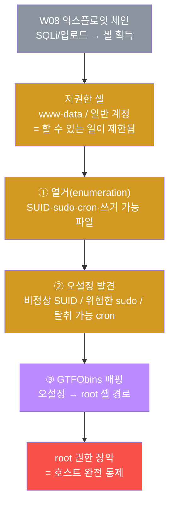
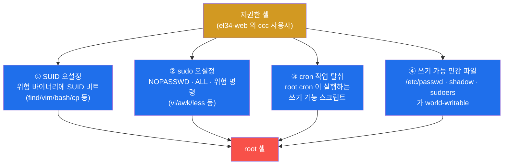
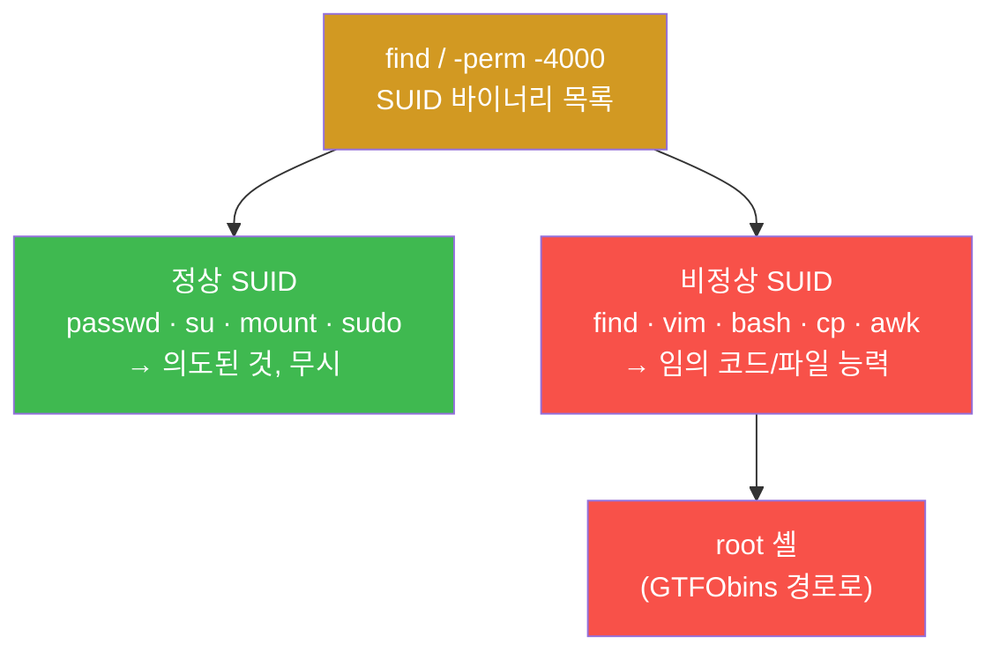
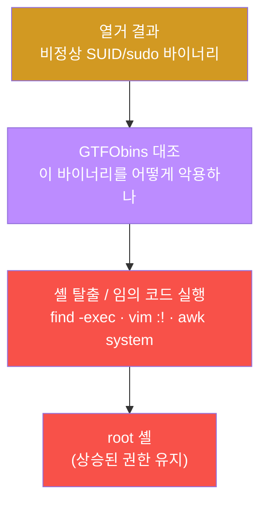
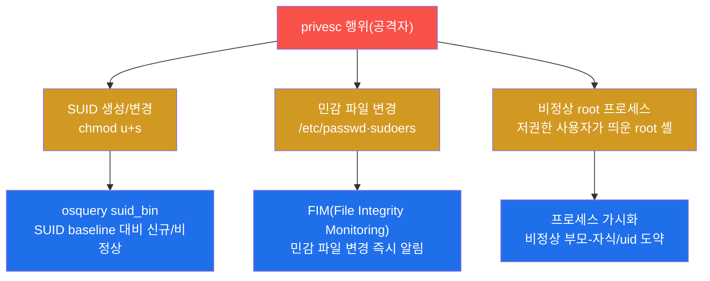
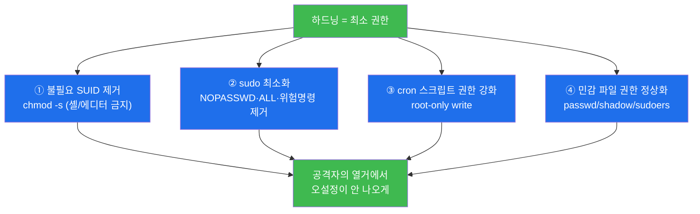
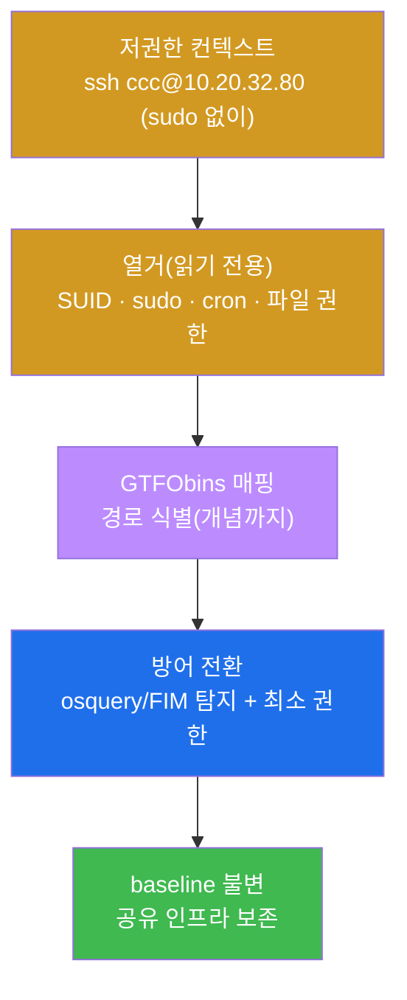
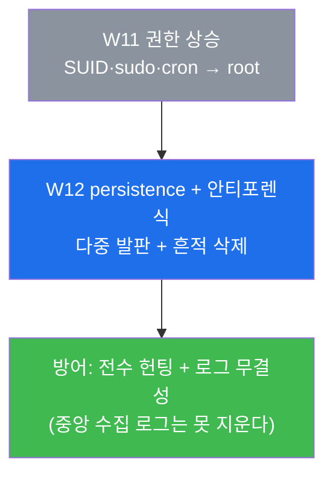

# 공격기법 W11 — user에서 root로: SUID·sudo 오설정·cron으로 권한 상승 vs 탐지·하드닝

> **본 주차의 한 줄 요약**
>
> W08 중간고사에서 학생은 익스플로잇 체인을 완성해 표적 호스트에 **셸(코드 실행 거점)** 을
> 확보했다. 그런데 그렇게 얻은 셸은 거의 항상 **저권한 사용자**(웹앱이 도는 `www-data`,
> 일반 계정)다 — 안에는 들어왔지만 아직 "주인"은 아니다. 본 주차에 학생은 공격자(PTES
> 포스트 익스플로잇 단계) 관점에서 **저권한 셸을 root 로 끌어올리는 권한 상승(privilege
> escalation)** 을 다룬다. 리눅스 privesc 의 4대 단골 경로 — **SUID 오설정**, **sudo
> 오설정**, **cron 작업 탈취**, **쓰기 가능 민감 파일** — 을 직접 **열거(enumeration)** 로
> 찾아내고, 그것을 root 로 잇는 **GTFObins** 경로를 식별한다. 그다음 방어자의 시선으로
> 돌아서서, 같은 오설정을 osquery·FIM 으로 **탐지**하고 최소 권한 원칙으로 **하드닝**한다.
>
> **공격자 한 줄 결론**: privesc 의 90%는 익스플로잇 코드가 아니라 **열거**다. root 로 가는
> 길은 대개 시스템 어딘가에 이미 잘못 놓여 있다 — 공격자는 그것을 **찾을** 뿐이다. 그래서
> 방어의 핵심도 "공격을 막는 것"이 아니라 "찾을 오설정을 애초에 남기지 않는 것"이다.

---

## 학습 목표

본 주차 종료 시 학생은 다음 6가지를 **본인 손으로** 할 수 있어야 한다.

1. 권한 상승(privilege escalation)이 PTES 의 **어느 단계**(포스트 익스플로잇, 5단계)에
   속하는지, 그리고 "셸을 얻는 것"과 "root 가 되는 것"이 왜 다른 일인지를 설명한다.
2. 저권한 컨텍스트(el34-web 의 `ccc` 사용자)에서 **privesc 열거 3종 세트**(SUID 바이너리·
   sudo 권한·cron/쓰기 가능 파일)를 직접 수행하고, 각 명령이 무엇을 보는지 해석한다.
3. **SUID 비트**가 무엇이며, 정상 SUID(passwd/su/mount)와 위험한 SUID(셸·에디터·find 등)를
   구분하고, 위험한 SUID 가 왜 곧 root 셸인지를 설명한다.
4. **sudo 오설정**(NOPASSWD·`ALL`·위험 명령 허용)과 **cron 작업 탈취**(root cron 이 쓰기 가능
   스크립트 실행)가 어떻게 권한 경계를 무너뜨리는지를 구체적 경로로 설명한다.
5. **GTFObins** 의 개념을 이해하고, 열거에서 찾은 비정상 SUID/sudo 바이너리를 GTFObins
   경로(예: `find -exec sh -p`, `vim :!sh`, `awk system()`)로 매핑해 root 로 잇는다.
6. 방어자의 시선으로 돌아서서, privesc 오설정을 **osquery `suid_bin`** 과 **FIM** 으로
   탐지하고, **최소 권한 원칙**에 따라 하드닝(불필요 SUID 제거·sudo 최소화·권한 강화)한다.

> **공격 트랙의 시선** — 이 트랙은 공격 과목이지만, el34 는 공격자의 흔적을 호스트
> 가시화(osquery)·FIM 으로 그대로 노출한다(W06). 그래서 학생은 "어떻게 root 가 되는가"와
> 동시에 "그 시도가 방어 스택에 어떻게 보이는가"를 함께 배운다. 좋은 공격자는 자기 행위가
> 어떤 흔적을 남기는지 안다.

---

## 0. 용어 해설 (권한 상승 입문)

본 주차에 처음 나오거나 특히 중요한 용어를 먼저 정리한다. 이미 앞 주차에서 본 용어라도,
W11 에서 **이 의미로 쓴다**는 것을 분명히 하기 위해 다시 적는다.

| 용어 | 영문 | 뜻 | 비유 |
|------|------|----|------|
| **권한 상승** | Privilege Escalation | 낮은 권한에서 더 높은 권한(보통 root)으로 올라서는 것 | 손님이 직원, 직원이 사장 권한을 손에 넣음 |
| **저권한 셸** | low-priv shell | 일반 사용자(www-data 등) 권한의 셸. 할 수 있는 일이 제한됨 | 건물에 들어왔으나 일반 사무실만 출입 가능 |
| **root** | superuser, uid 0 | 리눅스의 최고 권한 계정. 모든 파일·프로세스를 통제 | 모든 방의 마스터키를 가진 관리소장 |
| **수직 상승** | Vertical PrivEsc | 같은 호스트에서 더 높은 권한으로(user→root) | 일반 직원 → 사장 |
| **수평 이동** | Horizontal PrivEsc | 같은 권한의 다른 사용자로(userA→userB) | 옆 부서 동료 계정으로 갈아탐 |
| **열거** | Enumeration | 시스템을 샅샅이 훑어 오설정·약점을 찾는 정보 수집 | 마스터키를 찾으러 건물 구석구석을 뒤짐 |
| **SUID 비트** | Set-User-ID bit | 실행 시 **파일 소유자 권한**으로 동작하게 하는 특수 권한 플래그 | "이 도구를 쓸 땐 소장 권한으로" 라고 적힌 출입증 |
| **sudo** | superuser do | 지정된 명령을 일시적으로 상위 권한으로 실행하게 하는 도구 | "이 일에 한해 소장 대리 허가" |
| **NOPASSWD** | — | sudo 를 비밀번호 없이 쓰게 하는 설정. 오설정 시 위험 | 비밀번호 없이 쓰는 임시 마스터키 |
| **cron** | cron / crontab | 정해진 시각·주기로 명령을 자동 실행하는 스케줄러 | 매일 정해진 시각에 도는 자동 순찰 |
| **cron 작업 탈취** | cron job hijack | root cron 이 실행하는 스크립트를 공격자가 바꿔치기 | 자동 순찰 코스에 함정을 심어둠 |
| **world-writable** | — | 누구나 쓸 수 있는(`o+w`) 권한. 민감 파일에 붙으면 위험 | 아무나 고쳐 쓸 수 있는 공용 메모판 |
| **GTFObins** | Get The F\* Out Binaries | 정상 바이너리를 악용해 권한을 탈출하는 기법 DB | "이 도구는 이렇게 쓰면 마스터키가 된다" 비법 노트 |
| **셸 탈출** | shell escape | 제한된 도구(에디터·페이저) 안에서 셸 명령을 실행해 빠져나감 | 면회실 안에서 직원 통로로 새어 나감 |
| **최소 권한 원칙** | Least Privilege | 각 주체에게 꼭 필요한 권한만 주는 보안 원칙 | 필요한 방의 열쇠만, 마스터키는 최소로 |
| **하드닝** | Hardening | 공격 표면·오설정을 줄여 시스템을 단단하게 만드는 작업 | 약한 문·여분 열쇠를 없애 침입 경로를 줄임 |
| **FIM** | File Integrity Monitoring | 민감 파일의 변경을 실시간 감시·알림하는 기능 | 금고·열쇠함에 단 CCTV |
| **osquery** | — | OS 내부 상태를 SQL 로 질의하는 호스트 가시화 도구(W06) | 건물 안 모든 방을 검색하는 통합 조회 시스템 |
| **suid_bin** | — | osquery 의 테이블 — 시스템의 SUID/SGID 바이너리 목록 | 마스터키 출입증이 붙은 도구 대장 |

> **헷갈리기 쉬운 한 쌍 — 셸 획득 vs 권한 상승.** W08 에서 얻은 "셸"은 호스트 **안에**
> 들어왔다는 뜻이지, 그 호스트를 **장악**했다는 뜻이 아니다. 웹앱이 도는 계정(`www-data`)은
> 보통 자기 디렉터리와 일부 명령만 쓸 수 있다 — DB 설정을 읽거나 다른 사용자의 파일을 보거나
> 시스템 설정을 바꾸지 못한다. **진짜 장악은 root 권한**을 손에 넣는 것이며, 거기에 도달하는
> 과정이 권한 상승이다. 비유하자면 셸 획득은 "건물에 들어온 것", 권한 상승은 "마스터키를
> 손에 넣는 것"이다. 본 주차가 다루는 것이 바로 이 두 번째 단계다.

---

## 1. 왜 셸이 곧 root 가 아닌가 — privesc 의 자리

### 1.1 한 줄 답: 침투의 끝이 아니라 시작이다

W08 에서 우리는 익스플로잇 체인을 완성해 코드 실행 거점(셸)을 얻었다. 하지만 침해 사고를
실제로 분석해 보면, **초기 셸은 거의 언제나 저권한**이다. 공격자가 침투한 입구는 웹앱이고,
웹앱은 보안상 `www-data` 같은 **일부러 권한을 깎아 둔 계정**으로 돌기 때문이다. 그 계정으로는
시스템을 마음대로 주무를 수 없다 — 다른 사용자의 데이터를 읽거나, 백도어를 심거나, 로그를
지우거나, 다른 호스트로 번지는 일(측면 이동)을 하려면 더 높은 권한이 필요하다.

그래서 PTES(침투 테스트 표준 방법론)는 익스플로잇(4단계) 다음에 **포스트 익스플로잇(post
exploitation, 5단계)** 을 둔다. 권한 상승은 그 포스트 익스플로잇의 첫 발이다. 공격자의 관점에서
보면 셸 획득은 끝이 아니라 **시작**이다.



이 흐름에서 학생이 기억할 핵심은 **가운데 세 단계(열거 → 발견 → 매핑)가 곧 privesc** 라는
점이다. 익스플로잇처럼 화려한 코드가 아니라, 시스템에 이미 잘못 놓인 것을 찾아 잇는 작업이다.

### 1.2 왜 중요한가 — 영향이 한 단계 도약한다

권한 상승이 성공하면 공격의 영향이 **질적으로 도약**한다. 저권한 셸에서 root 로 올라서는 순간
공격자는 다음을 할 수 있게 된다.

- **전면 데이터 접근** — 다른 사용자의 파일, DB 자격 증명, `/etc/shadow`(비밀번호 해시) 열람.
- **지속성(persistence) 확보** — 백도어 계정 생성, cron·SSH 키 심기(다음 주 W12 의 주제).
- **흔적 삭제(anti-forensics)** — 로그 변조·삭제로 자기 행적을 지움(W12).
- **측면 이동(lateral movement)** — 확보한 자격으로 다른 호스트로 번짐.

즉 privesc 는 "한 호스트를 들여다보는 것"과 "한 인프라를 장악하는 것" 사이의 분기점이다.
방어자 입장에서도, privesc 를 한 곳에서 끊으면 침해가 단일 호스트의 저권한 사고로 머문다.

### 1.3 한계 — 본 주차가 다루지 않는 것

본 주차는 **리눅스의 오설정 기반 privesc**(SUID·sudo·cron·파일 권한)에 집중한다. 따라서 다음은
범위 밖이며 다른 주차·트랙에서 다룬다.

- **커널 익스플로잇** — `CVE-2021-4034`(PwnKit) 같은 커널/setuid 바이너리 취약점을 이용한 상승은
  버전·패치에 크게 의존하므로 본 주차에서는 개념만 언급하고 실습하지 않는다.
- **컨테이너 탈출** — Docker 소켓 노출·특권 컨테이너를 통한 호스트 장악은 cloud-container 트랙의
  주제다.
- **지속성·안티포렌식** — root 를 얻은 뒤의 장악 유지는 다음 주 **W12** 에서 다룬다.

또한 el34 는 여러 학생이 함께 쓰는 공유 인프라이므로, 본 실습은 **열거 중심(읽기 전용)** 이며
실제 root 상승·하드닝은 **개념과 점검까지**만 수행한다(§7). 인가된 실습 환경에서만 한다.

---

## 2. privesc 의 90%는 열거 — 무엇을, 왜 찾는가

### 2.1 한 줄 답: root 로 가는 길은 이미 어딘가 놓여 있다

권한 상승의 가장 큰 오해는 "root 가 되려면 새로운 익스플로잇을 짜야 한다"는 것이다. 실제로는
정반대다. 잘 운영되지 않은 시스템에는 **이미 잘못 설정된 권한**이 곳곳에 있다 — 누군가 편의를
위해 붙여 둔 SUID, 감사 없이 늘어난 sudo 규칙, 권한을 느슨하게 둔 cron 스크립트. 공격자가 할
일은 그 오설정을 **샅샅이 찾는 것(열거)** 이다. 그래서 현장 격언이 "privesc 는 90%가 열거"다.

열거가 핵심이라는 말은 방어에도 그대로 적용된다. 공격자가 찾을 것이 없도록 오설정을 애초에
남기지 않으면(=최소 권한·하드닝), 열거를 아무리 잘해도 root 로 가는 길이 없다. §5 의 방어가
바로 이 관점이다.

### 2.2 열거의 4대 경로 — 한눈에

저권한 셸에서 root 로 이어지는 단골 경로는 네 가지다. 본 주차의 모든 열거가 이 네 갈래를
훑는 작업이다.



각 경로는 §3 에서 하나씩 자세히 본다. 공통점은 모두 **권한 경계가 의도보다 느슨해진 지점**을
노린다는 것이다.

### 2.3 el34 에서 어떻게 — 비-root `ccc` 컨텍스트

privesc 를 시연하려면 먼저 **저권한 출발점**이 있어야 한다. 표적 web 에는 일반 사용자
**`ccc`(uid 1000)** 로 로그인한다 — 침투로 막 얻은 셸이 이 위치다. 학생은 `ssh ccc@10.20.32.80`
로 접속해, privesc 벡터(SUID·sudo·cron)를 **`sudo` 없이 열거**한다(저권한 시선). 하드닝·방어
점검이 필요할 때만 `sudo` 를 쓴다. 이렇게 "웹앱 침투로 막 얻은 저권한 셸 → 권한 상승 벡터 탐색"을
현실적으로 재현한다.

```bash
# el34 호스트(ssh ccc@192.168.0.80, 비밀번호 1)에서

# 저권한(ccc) 컨텍스트로 들어가 내 정체를 확인
ssh ccc@10.20.32.80 id
# 예상: uid=1000(ccc) gid=1000(ccc) groups=1000(ccc),...

# (대조) 옵션을 빼면 컨테이너 기본 사용자 = root
ssh ccc@10.20.32.80 id
# 예상: uid=0(root) gid=0(root) groups=0(root)
```

위 두 명령의 차이가 본 주차의 출발선이다. `-u ccc` 를 붙인 쪽이 "공격자가 침투로 얻은 저권한
셸"이고, 우리의 목표는 거기서 root(아래쪽 출력)로 올라서는 길을 **찾는 것**이다.

> **방어 작업은 root 로.** 반대로 §5 의 방어(osquery `suid_bin` 조회, FIM 점검)는 호스트
> 가시화·관리 작업이므로 `-u ccc` 없이(=root 권한으로) 실행한다. 공격(열거)은 저권한, 방어(탐지)는
> 관리 권한이라는 구분을 명령에서부터 일관되게 지킨다.

---

## 3. 권한 상승의 4대 경로 상세

### 3.1 ① SUID 오설정 — "이 도구를 쓸 땐 소장 권한으로"

**한 줄 정의.** SUID(Set-User-ID) 비트는 실행 파일에 붙는 특수 권한으로, 그 파일을 누가
실행하든 **파일 소유자의 권한**으로 동작하게 만든다. 소유자가 root 인 SUID 바이너리는, 일반
사용자가 실행해도 그 순간만큼은 root 권한으로 돈다.

**왜 SUID 가 존재하나.** 일부 정상 작업은 일반 사용자가 root 자원을 잠깐 건드려야 한다. 예를
들어 `passwd`(비밀번호 변경)는 일반 사용자가 root 소유의 `/etc/shadow` 를 써야 하므로 SUID 가
**의도적으로** 붙어 있다. `su`, `mount`, `ping` 등도 마찬가지다. 즉 SUID 자체가 나쁜 것이 아니라,
**엉뚱한 바이너리에 붙은 SUID** 가 문제다.

**왜 위험한가.** `find`, `vim`, `bash`, `cp`, `awk` 같은 바이너리는 내부에서 **임의 명령을 실행**
하거나 **임의 파일을 읽고 쓸** 수 있다. 이런 바이너리에 root SUID 가 붙으면, 그 능력이 그대로
root 권한으로 발휘된다 — 사실상 root 셸이다. 권한을 식별하는 방법은 `find / -perm -4000` 으로
SUID 비트(`-4000`)가 켜진 파일을 전부 찾는 것이다.

```bash
# SUID 바이너리 열거 — root 권한으로 실행되는 파일 전부
ssh ccc@10.20.32.80 'find / -perm -4000 -type f 2>/dev/null'
```

> **용어 — `find / -perm -4000`.** `find` 는 파일을 조건으로 검색하는 도구다. `-perm -4000` 은
> "권한 비트에 SUID(8진수 4000)가 **포함된** 파일"을 뜻한다(`-` 접두사 = 해당 비트를 포함). `-type f`
> 는 일반 파일만, `2>/dev/null` 은 권한 없는 디렉터리 접근 오류를 버린다. 결과 목록이 곧 "root
> 권한으로 실행되는 도구 대장"이다.

**결과 해석 — 정상 vs 비정상.** 출력에서 다음을 구분하는 것이 핵심이다.

| 분류 | 예시 | 의미 |
|------|------|------|
| **정상 SUID** | `/usr/bin/passwd`, `/bin/su`, `/bin/mount`, `/usr/bin/sudo` | 의도된 것. 건드리지 않는다 |
| **비정상 SUID(위험)** | `/usr/bin/find`, `/usr/bin/vim`, `/bin/bash`, `/usr/bin/cp`, `/usr/bin/awk` | 셸·에디터·범용 도구. **GTFObins 후보 = root 셸** |

비정상 SUID 가 보이면 그 즉시 root 로 가는 길(§3.5 GTFObins)이 열린 것이다.



### 3.2 ② sudo 오설정 — 너무 넓은 대리 허가

**한 줄 정의.** `sudo` 는 일반 사용자가 지정된 명령을 **상위 권한(보통 root)으로** 실행하게
해 주는 도구다. 누가 무엇을 sudo 로 실행할 수 있는지는 `/etc/sudoers` 파일에 정의된다.
`sudo -l`(또는 비번 없이 조회하는 `sudo -ln`)로 현재 사용자의 sudo 권한을 확인한다.

**왜 오설정이 위험한가.** sudo 는 "이 사람은 이 명령에 한해 root 대리"라는 **최소 권한**으로
써야 안전하다. 그런데 다음과 같이 설정되면 곧 root 로 가는 길이 된다.

- **`ALL` 허용** — `ccc ALL=(ALL) ALL` 처럼 모든 명령을 sudo 로 허용하면, `sudo bash` 한 줄로
  root 셸이다.
- **NOPASSWD** — 비밀번호 없이 sudo 를 쓰게 하면, 공격자가 비밀번호를 몰라도 권한을 쓸 수 있다.
- **위험한 단일 명령 허용** — `vi`, `less`, `awk`, `find` 처럼 **내부에서 셸을 띄울 수 있는**
  명령 하나만 sudo 로 허용해도, 그 명령의 셸 탈출 기능으로 root 셸을 얻는다(§3.5).

```bash
# sudo 권한 + 내 그룹(sudo 그룹 멤버십도 단서) 점검
ssh ccc@10.20.32.80 'id; sudo -ln 2>/dev/null | head -5 || echo "sudo 비번 필요"'
```

> **용어 — `sudo -ln` / NOPASSWD / sudo 그룹.** `sudo -l` 은 "내가 sudo 로 무엇을 할 수 있나"를
> 보여준다. `-n`(non-interactive)을 더한 `sudo -ln` 은 비밀번호 프롬프트 없이 조회만 시도한다
> (비번이 필요하면 조용히 실패). `NOPASSWD:` 가 붙은 항목은 비밀번호 없이 실행 가능하다는 뜻이다.
> 또한 `id` 결과의 그룹에 `sudo`(데비안 계열) 또는 `wheel`(레드햇 계열)이 보이면, 그 사용자는
> 폭넓은 sudo 권한을 가진 경우가 많아 그 자체가 중요한 단서다.

**결과 해석.** `sudo -ln` 출력에 `(ALL) ALL`, `NOPASSWD`, 또는 위험 명령(`vi`/`awk`/`less` 등)이
보이면 바로 root 경로다. 출력이 비어 있거나 "비번 필요"로 나오면, 대신 `id` 의 그룹 멤버십이
다음 단서다.

### 3.3 ③ cron 작업 탈취 — 자동 순찰 코스에 함정 심기

**한 줄 정의.** `cron` 은 정해진 시각·주기로 명령을 자동 실행하는 리눅스 스케줄러다. 작업은
`/etc/crontab`, `/etc/cron.d/`, 사용자별 crontab 등에 정의되며, root 의 cron 작업은 **root
권한으로** 실행된다.

**왜 탈취가 가능한가.** 문제는 root cron 이 실행하는 **대상 스크립트의 권한**이다. 만약 root
cron 이 `/opt/backup.sh` 같은 스크립트를 주기적으로 실행하는데, 그 스크립트가 **일반 사용자도
쓸 수 있게(world-writable)** 되어 있다면, 공격자는 그 스크립트 내용을 자기 명령으로 바꿔치기할
수 있다. 그러면 다음 cron 실행 시각에 공격자의 명령이 **root 권한으로** 돈다 — 이것이 cron
작업 탈취다.

```bash
# cron 작업 정의 + 쓰기 가능 민감 파일 점검
ssh ccc@10.20.32.80 'ls -la /etc/cron.d/ /etc/crontab 2>/dev/null; find / -writable -type f 2>/dev/null | grep -vE "^/proc|^/sys|^/tmp|/home/ccc" | head -5'
```

> **용어 — cron 의 탈취 조건 두 가지.** 탈취가 성립하려면 ① **root 가 실행하는 cron 작업**이
> 있고, ② 그 작업이 부르는 **스크립트·디렉터리를 공격자가 쓸 수 있어야** 한다. 둘 중 하나라도
> 빠지면 탈취되지 않는다. 그래서 점검은 "어떤 cron 이 있나(`/etc/cron.d`, `/etc/crontab`)"와
> "내가 쓸 수 있는 파일 중 cron 이 부르는 것이 있나(`find -writable`)"를 함께 본다.

**결과 해석.** cron 작업 목록에서 root 가 실행하는 스크립트 경로를 찾고, 그 경로가 `find
-writable` 결과에 함께 나타나면 탈취 가능 후보다. (위 명령은 `/home/ccc`·임시 디렉터리를
제외해, 정말 위험한 시스템 경로의 쓰기 가능 파일만 추린다.)

### 3.4 ④ 쓰기 가능 민감 파일 — 권한의 원장을 직접 고치다

**한 줄 정의.** 리눅스의 권한 체계는 몇몇 **민감 파일**에 기록된다 — 계정은 `/etc/passwd`,
비밀번호 해시는 `/etc/shadow`, sudo 규칙은 `/etc/sudoers`. 이 파일들은 **root 만 쓸 수 있어야**
정상이다.

**왜 위험한가.** 만약 이 파일 중 하나라도 일반 사용자가 쓸 수 있게 되어 있다면, 공격자는
권한 체계 자체를 직접 고쳐 root 가 된다.

- `/etc/passwd` 쓰기 가능 → 비밀번호 필드가 빈(또는 자기가 아는) **uid 0 계정**을 한 줄 추가.
- `/etc/shadow` 쓰기 가능 → 기존 계정의 비밀번호 해시를 자기 것으로 교체.
- `/etc/sudoers` 쓰기 가능 → 자기 계정에 `NOPASSWD: ALL` 한 줄 추가.

```bash
# 민감 파일의 권한 직접 확인 (쓰기 가능하면 위험)
ssh ccc@10.20.32.80 'ls -la /etc/passwd /etc/shadow 2>/dev/null | head'
```

**결과 해석.** `ls -la` 출력의 권한 필드를 읽는다. 정상은 `/etc/passwd` 가 `-rw-r--r--`
(소유자 root 만 쓰기), `/etc/shadow` 가 `-rw-r-----`(root 만 읽기·쓰기)다. 만약 끝자리(others)에
`w` 가 보이면(예: `-rw-rw-rw-`) 그 파일은 누구나 쓸 수 있다는 뜻 — 즉시 권한 추가가 가능한
치명적 오설정이다.

### 3.5 GTFObins — 오설정을 root 셸로 잇는 비법 노트

지금까지의 §3.1–§3.2 에서 "비정상 SUID/sudo 바이너리가 root 셸로 직행한다"고 했다. 그
**구체적 방법**을 모아 둔 공개 데이터베이스가 **GTFObins**(gtfobins.github.io)다.

**한 줄 정의.** GTFObins 는 `find`, `vim`, `awk`, `less` 같은 **정상 바이너리**가 SUID·sudo 같은
상승된 권한으로 실행될 때, 어떻게 **셸을 띄우거나 파일을 읽고 쓰는지**를 정리한 기법 카탈로그다.
공격자는 열거에서 찾은 비정상 바이너리를 GTFObins 에 대조해 root 경로를 즉시 확인한다.

**대표 경로(개념).** 본 실습은 열거→매핑까지만 하므로 아래는 "이런 식으로 잇는다"는 개념이다.

| 바이너리 | 상황 | root 셸 경로(개념) | 원리 |
|----------|------|--------------------|------|
| `find` | SUID 또는 sudo | `find . -exec /bin/sh -p \; -quit` | `-exec` 로 셸 실행, `-p` 로 권한 유지 |
| `vim` | SUID 또는 sudo | `vim -c ':!/bin/sh'` | 에디터 안에서 `:!` 로 셸 탈출 |
| `awk` | sudo | `awk 'BEGIN{system("/bin/sh")}'` | `system()` 으로 명령 실행 |
| `less`/`more` | sudo | 페이저 안에서 `!/bin/sh` | 페이저의 `!` 셸 탈출 |
| `cp` | SUID | `/etc/passwd` 덮어써 uid 0 계정 추가 | 임의 파일 쓰기 능력 악용 |

> **용어 — 셸 탈출(shell escape)과 `-p`.** 많은 도구는 작업 중 외부 명령을 부르는 기능이 있다
> (vim 의 `:!`, less 의 `!`). 이를 통해 도구 안에서 `/bin/sh` 를 띄우는 것이 셸 탈출이다. 또 `sh -p`
> 의 `-p`(privileged)는 셸이 시작할 때 권한을 일반 사용자로 떨어뜨리지 않고 **상승된 실효 권한을
> 그대로 유지**하게 한다 — SUID 셸에서 root 를 잃지 않으려면 필요하다.



핵심은 **열거 → 매핑**의 두 박자다. 열거에서 무엇이 잘못 놓였는지 찾고(§3.1–§3.4), GTFObins
로 그것을 root 셸로 잇는다(§3.5). 이것이 privesc 의 전부라 해도 과언이 아니다.

---

## 4. 같은 행위가 어떤 흔적을 남기나 — 공격자의 가시성 인식

이 트랙은 공격 과목이지만, el34 는 호스트 행위를 그대로 가시화한다. 좋은 공격자는 자기 privesc
시도가 방어 스택에 어떻게 보이는지 안다. privesc 의 각 단계는 다음과 같은 흔적을 남긴다.



- **SUID 변경**은 osquery 의 `suid_bin` 테이블이 baseline 대비 새 항목으로 드러낸다.
- **민감 파일 변경**(`/etc/passwd`, `/etc/sudoers`)은 FIM 이 변경 즉시 알림으로 잡는다(W01 §0.5.6).
- **uid 도약**(저권한 사용자가 root 프로세스를 띄움)은 호스트 프로세스 가시화로 드러난다.

공격자가 이 가시성을 이해하면, 실전에서 탐지를 우회하려 노력하거나(고급), 방어자(블루팀)와
협업해 탐지를 개선(퍼플팀)할 수 있다. 본 주차는 **공격(열거) → 방어(탐지·하드닝)** 를 한 호스트
위에서 모두 다룬다는 점에서, 이 가시성 인식이 강의의 한 축이다.

---

## 5. 탐지 + 하드닝 — 방어자의 시선

privesc 의 90%가 열거라면, 방어의 핵심은 **찾을 오설정을 남기지 않는 것**과 **남은 변화를 즉시
감지하는 것** 두 가지다. 전자가 하드닝(예방), 후자가 탐지(감지)다.

### 5.1 탐지 — osquery `suid_bin` 과 FIM

방어자는 공격자와 같은 곳(SUID·민감 파일)을, 그러나 **상시 감시** 목적으로 본다. 핵심 도구는
W06 에서 배운 **osquery**(OS 를 SQL 로 질의하는 호스트 가시화 도구)다.

```bash
# 방어 관점: SUID 바이너리 baseline 점검 (표적 web 에서)
ssh ccc@10.20.32.80 'find / -perm -4000 -type f 2>/dev/null | head -8'
```

> **용어 — osquery `suid_bin` 테이블.** osquery 는 시스템 상태를 SQL 테이블로 추상화한다(W06).
> `suid_bin` 은 그중 "SUID/SGID 비트가 붙은 바이너리"를 행으로 보여주는 테이블로, `path`(경로)와
> `username`(소유자)을 질의할 수 있다. 운영자는 이 결과를 **알려진 정상 목록(baseline)** 과 주기적으로
> 대조해, 새로 생긴 비정상 SUID 를 찾아낸다. (위 명령은 osquery 가 없는 환경을 대비해 `find` 로
> 폴백한다.)

이와 함께 **FIM**(File Integrity Monitoring, W01 §0.5.6)이 `/etc/passwd`·`/etc/shadow`·
`/etc/sudoers` 같은 민감 파일의 **변경을 실시간으로** 잡는다. el34 의 Wazuh agent 는 FIM 이 기본
활성이라, 이 경로가 바뀌면 즉시 manager 로 알림이 간다. 즉 공격자가 §3.4 의 권한 추가를 시도하면
그 변경 자체가 탐지된다.

**탐지 3종 요약.**

| 탐지 수단 | 무엇을 잡나 | privesc 의 어느 경로 |
|-----------|------------|---------------------|
| osquery `suid_bin` | 비정상 SUID 바이너리(baseline 대비 신규) | ① SUID 오설정 |
| FIM | `/etc/passwd`·`shadow`·`sudoers` 변경 | ④ 쓰기 가능 민감 파일 |
| 프로세스 가시화 | 비정상 root 프로세스(uid 도약) | ②③ sudo/cron 악용 결과 |

### 5.2 하드닝 — 최소 권한 원칙

탐지가 "이미 일어난 변화를 잡는 것"이라면, 하드닝은 **애초에 오설정을 없애는 것**이다. 핵심
원칙은 **최소 권한(least privilege)** — 각 주체에게 꼭 필요한 권한만 주고, root 능력은 최소로
둔다. 본 실습은 공유 인프라 보존을 위해 개념·점검까지만 하지만, 실제 하드닝 조치는 다음과 같다.

1. **불필요한 SUID 제거** — `chmod -s <바이너리>` 로 SUID 비트를 끈다. 특히 셸(`bash`)·에디터
   (`vim`)·범용 도구(`find`/`awk`/`cp`)에는 SUID 가 **절대 붙으면 안 된다**.
2. **sudo 최소화** — `/etc/sudoers` 에서 `NOPASSWD`·`ALL`·위험 명령(`vi`/`awk`/`less`)을 제거하고,
   꼭 필요한 **명시적 명령만** 허용한다. sudo 규칙은 주기적으로 감사한다.
3. **cron 스크립트 권한 강화** — root cron 이 부르는 스크립트·디렉터리는 **root 만 쓸 수 있게**
   (`chmod 700`, 소유자 root) 둔다. 일반 사용자 쓰기 권한을 제거하면 §3.3 탈취가 막힌다.
4. **민감 파일 권한 점검** — `/etc/passwd`(`644`)·`/etc/shadow`(`640` 이하)·`/etc/sudoers`(`440`)의
   권한을 정상으로 유지한다. world-writable 이 절대 없어야 한다.



하드닝의 목표를 한 문장으로 요약하면, **"공격자가 열거를 아무리 잘해도 root 로 가는 길이
나오지 않게 만드는 것"** 이다. privesc 가 열거의 게임이라면, 방어는 그 열거를 빈손으로 끝내게
하는 게임이다.

---

## 6. 판단 프레임워크 — "이 단서는 어느 경로인가"

privesc 의 실전 능력은 **열거 결과를 보고 어느 경로인지 즉시 판단**하는 것이다. 다음 표가 그
판단의 정답지다. 학생은 이 표를 머릿속에 두고, 열거에서 본 단서를 경로와 GTFObins 매핑으로
잇고, 동시에 그 경로의 방어를 말할 수 있어야 한다.

| 열거에서 본 단서 | 어느 경로인가 | root 로 잇는 법(개념) | 방어(탐지·하드닝) |
|------------------|---------------|-----------------------|-------------------|
| `find`/`vim`/`bash` 에 SUID | ① SUID 오설정 | GTFObins(`find -exec sh -p` 등) | osquery `suid_bin` / `chmod -s` |
| `sudo -l` 에 `NOPASSWD`·`ALL` | ② sudo 오설정 | `sudo bash` 또는 위험 명령 escape | sudoers 감사 / 최소 권한 |
| root cron + 쓰기 가능 스크립트 | ③ cron 탈취 | 스크립트 내용 교체 → 다음 실행 시 root | 스크립트 root-only write |
| `/etc/passwd`·`sudoers` world-writable | ④ 쓰기 가능 민감 파일 | uid 0 계정/규칙 직접 추가 | FIM / 권한 정상화 |

이 표를 두 방향으로 읽는다. **공격자 방향** — "이 단서를 보면 이렇게 root 로 잇는다". **방어자
방향** — "이 경로는 이렇게 탐지·차단한다". 공격 트랙의 학생이 두 방향을 모두 말할 수 있으면,
"자기 행위가 어떻게 보이는지 아는 좋은 공격자"가 된 것이다.

> **채점 포인트(본 주차 lab).** 각 열거를 올바른 명령으로 **수행하고 그 결과(증거)를 제시**하며,
> 비정상 SUID/sudo 를 GTFObins 경로로 매핑하고, 방어(osquery/FIM·최소 권한)까지 종합하는 것.
> "root 를 땄다"는 선언이 아니라 **열거 결과·매핑·방어 설명**이 점수다. 합격 임계값은 0.7 이다.

---

## 7. 실습 안내 — privesc lab 8 미션 (4 축 설명)

본 주차 실습은 8 미션으로 구성된다. 각 미션을 **4 축**으로 설명한다 — 왜 하는가 / 무엇을 알 수
있는가 / 결과 해석(정상 vs 비정상) / 실전 활용. 미션은 privesc 의 흐름을 따라 점검 → 열거(SUID
→ sudo → cron/쓰기) → GTFObins 매핑 → 탐지 → 하드닝 → 보고서 순서로 흐른다.

> **실습 진행 원칙.** 표적 web 셸 `ssh ccc@10.20.32.80`(비번 1)에서 실행한다. **공격(열거)은
> `sudo` 없이(저권한 시선)**, **방어·하드닝 점검은 `sudo` 로(관리 권한)**. 본 실습은 **열거 중심(읽기 전용)** 이며, 실제 root 상승·하드닝은
> 개념·점검까지만 한다(공유 인프라 보존). **인가된 실습 환경(el34)에서만** 수행한다.

### 미션 1 — 점검: 비-root 컨텍스트 (10점, survey)

> **왜 하는가?** privesc 의 전제는 "지금 내가 저권한"이라는 사실이다. 침투 테스터는 상승을
> 시도하기 전에 항상 **현재 권한과 컨텍스트**부터 확인한다.
>
> **무엇을 알 수 있는가?** `ssh ccc@10.20.32.80 id` 로 자신이 uid 1000(`ccc`), 비-root
> 임을 확인한다. `id` 의 그룹 멤버십(예: `sudo`·`www-data`)도 다음 단계의 중요한 단서다.
>
> **결과 해석.** 정상: `uid=1000(ccc)` 가 보임 = 저권한 출발점 확보. 비정상: uid 0(root)이
> 나오면 `-u ccc` 옵션이 빠진 것 — 저권한 실습이 성립하지 않으니 명령을 다시 확인한다.
>
> **실전 활용.** 셸을 막 얻은 공격자의 첫 명령이 `id`/`whoami` 다. "내가 누구이고 무엇을 할 수
> 있는가"를 알아야 상승 경로를 고른다.

### 미션 2 — ① SUID 열거 (12점, recon)

> **왜 하는가?** privesc 열거의 1순위가 SUID 다. root 권한으로 실행되는 파일 목록이 곧 가장
> 빠른 root 경로 후보이기 때문이다.
>
> **무엇을 알 수 있는가?** `find / -perm -4000 -type f` 로 시스템의 모든 SUID 바이너리를
> 열거하는 법. 정상 SUID(passwd/su/mount)와 비정상 SUID(셸/에디터/find)를 구분하는 눈.
>
> **결과 해석.** 정상: SUID 목록에 `passwd` 등이 보임 = 열거 성공. 핵심 깨달음 — 목록에서
> `find`/`vim`/`bash` 같은 **위험 바이너리**가 보이면 그것이 GTFObins root 경로 후보다.
>
> **실전 활용.** 모든 리눅스 privesc 의 출발점. 자동화 도구(LinPEAS 등)도 가장 먼저 이 SUID
> 목록을 뽑는다.

### 미션 3 — ② sudo·그룹 점검 (12점, recon)

> **왜 하는가?** SUID 다음으로 흔한 root 경로가 sudo 오설정이다. 너무 넓게 허가된 sudo 권한
> 하나가 곧 root 셸이 된다.
>
> **무엇을 알 수 있는가?** `id`(그룹 멤버십)와 `sudo -ln`(sudo 권한)으로 무엇을 root 로 실행할
> 수 있는지 점검하는 법. `NOPASSWD`·`ALL`·위험 명령(`vi`/`awk`/`less`)이 단서임을 익힌다.
>
> **결과 해석.** 정상: `id` 에 그룹이 보이고 sudo 권한 점검이 수행됨. 핵심 깨달음 — sudo 그룹
> 멤버이거나 sudo 로 위험 명령을 쓸 수 있으면 GTFObins escape 로 root. 비번이 필요해 `sudo -l`
> 이 막히면, 그룹 멤버십이 차선 단서다.
>
> **실전 활용.** "내가 sudo 로 무엇을 할 수 있나"는 침투 테스터의 필수 점검. 운영자에게는 sudo
> 규칙 감사가 곧 방어다.

### 미션 4 — ③ cron·쓰기 가능 점검 (12점, recon)

> **왜 하는가?** SUID·sudo 가 막혀도, root cron 이 부르는 쓰기 가능 스크립트가 있으면 그것이
> root 경로다. 쓰기 가능 민감 파일도 같은 맥락의 치명적 오설정이다.
>
> **무엇을 알 수 있는가?** `/etc/cron.d/`·`/etc/crontab` 의 cron 작업과, `find -writable` 로
> 쓰기 가능한 시스템 파일을 점검하는 법. `/etc/passwd`·`/etc/shadow` 의 권한을 직접 읽는 법.
>
> **결과 해석.** 정상: cron 정의와 민감 파일 권한이 출력됨(`passwd` 등 확인). 핵심 깨달음 —
> root cron 이 쓰기 가능 스크립트를 실행하거나 민감 파일이 world-writable 이면 곧 root 경로다.
> 민감 파일 권한이 정상(`-rw-r--r--` 등)이면 그 경로는 막혀 있다는 뜻.
>
> **실전 활용.** cron·파일 권한 점검은 SUID·sudo 가 깨끗할 때 다음으로 보는 경로. 운영자에게는
> 스크립트·민감 파일 권한 강화가 방어다.

### 미션 5 — ④ 권한 상승 경로: GTFObins 매핑 (12점, analysis)

> **왜 하는가?** 열거(미션 2–4)에서 찾은 오설정을 **실제 root 셸로 잇는 사고**가 privesc 의
> 핵심이다. 무엇을 찾았는지보다, 그것을 어떻게 잇는지가 능력이다.
>
> **무엇을 알 수 있는가?** GTFObins 의 개념과, 비정상 SUID/sudo 바이너리를 root 경로로 매핑하는
> 법 — `find -exec sh -p`, `vim :!sh`, `awk system()`, `less !sh` 등. "열거 → 매핑"의 두 박자.
>
> **결과 해석.** 정상: 출력에 `GTFObins` 와 바이너리별 경로가 정리됨 = 매핑 완료. 핵심 깨달음 —
> 정상 바이너리도 상승된 권한으로 실행되면 셸 탈출·임의 코드로 root 가 된다.
>
> **실전 활용.** 실전에서 열거 후 즉시 GTFObins 를 대조해 root 경로를 확정한다. 방어자는 같은
> DB 로 "어떤 바이너리에 SUID/sudo 를 주면 위험한지"를 안다.

### 미션 6 — ⑤ 탐지: osquery suid_bin / FIM (12점, analysis)

> **왜 하는가?** 좋은 공격자는 자기 privesc 가 어떻게 탐지되는지 안다. 방어자 관점으로 돌아서서
> SUID·민감 파일 변경을 잡는 호스트 가시화를 직접 다룬다.
>
> **무엇을 알 수 있는가?** osquery `suid_bin` 테이블로 SUID 바이너리를 baseline 관점에서 조회하는
> 법(W06 의 호스트 가시화), 그리고 FIM 이 `/etc/sudoers`·`/etc/passwd` 변경을 잡는 원리.
>
> **결과 해석.** 정상: osquery 결과(또는 `find` 폴백)에 SUID 목록(`passwd` 등)이 보임 = 탐지
> 관점 확인. 핵심 깨달음 — 방어자는 SUID baseline 대비 신규 항목과 민감 파일 변경(FIM)으로
> privesc 시도를 호스트에서 잡는다.
>
> **실전 활용.** SOC·블루팀은 osquery `suid_bin` 을 주기 스케줄로 돌려 SUID 변화를 상시 감시하고,
> FIM 알림을 privesc 조기 신호로 본다.

### 미션 7 — ⑥ 하드닝: 최소 권한 (12점, report)

> **왜 하는가?** 탐지가 사후 감지라면, 하드닝은 애초에 오설정을 없애는 예방이다. privesc 의
> 근본 방어는 **최소 권한 원칙**이다.
>
> **무엇을 알 수 있는가?** 불필요 SUID 제거(`chmod -s`)·sudo 최소화(NOPASSWD/위험 명령 제거)·
> cron 스크립트 권한 강화·민감 파일 권한 점검이라는 4대 하드닝 조치를 정리하는 법.
>
> **결과 해석.** 정상: 출력에 `최소 권한` 과 4대 조치가 정리됨 = 하드닝 정리 완료. 핵심 깨달음 —
> 공격자의 열거에서 오설정이 **나오지 않게** 만드는 것이 가장 강한 방어다.
>
> **실전 활용.** 운영자가 신규 호스트를 배포할 때 적용하는 하드닝 체크리스트의 핵심 항목. CIS
> 벤치마크의 SUID·sudo·파일 권한 통제와 직결된다.

### 미션 8 — privesc 보고서 (10점, report)

> **왜 하는가?** 미션 1–7 을 한 흐름(열거 → 경로 → 방어)으로 정리해, 종합 판단을 문서로
> 입증한다(PTES 6단계 보고).
>
> **무엇을 알 수 있는가?** SUID/sudo/cron 열거 결과, GTFObins root 경로, 그리고 탐지(osquery/
> FIM)·하드닝(최소 권한)을 한 보고서로 종합하는 법. privesc 보고서의 표준 구조.
>
> **결과 해석.** 정상: 보고서에 열거·경로·방어가 모두 포함됨(`GTFObins` 확인). 핵심 결론 —
> privesc 는 열거가 90%이며, 방어는 최소 권한으로 찾을 오설정을 남기지 않는 것.
>
> **실전 활용.** 침투 테스트 보고서에서 privesc 발견은 "어느 오설정으로 어떻게 root 에 도달했고,
> 어떻게 막는가"를 경로로 설명한다. 단일 발견 나열보다 경로 서술이 훨씬 설득력 있다.

---

## 8. 실습 수칙 — 인가된 실습 + 공유 인프라 보존

el34 는 여러 학생이 함께 쓰는 공유 인프라이며, 이 트랙은 공격(권한 상승)을 다루므로 윤리·운영
수칙이 특히 엄격하다. 다음을 반드시 지킨다.

- **인가된 실습만.** 모든 권한 상승 시도는 인가된 실습 환경(el34) 안에서, 정해진 대상(el34-web
  의 `ccc` 컨텍스트)에 한해서만. 실제 외부 시스템 대상 시도는 불법이며 윤리 규정 위반이다.
- **열거 중심(읽기 전용).** 본 실습은 SUID·sudo·cron·파일 권한을 **점검(읽기)** 한다. 실제 root
  상승(GTFObins 실행)·하드닝(`chmod -s` 등 변경)은 **개념과 점검까지**만 한다.
- **baseline 을 바꾸지 말 것.** SUID 비트, sudo 규칙(`/etc/sudoers`), cron 작업, 정상 계정·
  파일 권한은 점검만 하고 절대 변경하지 않는다. 공유 인프라의 다음 학생·운영에 영향을 주면 안 된다.
- **열거는 sudo 없이, 하드닝은 sudo.** 표적 web 셸 `ssh ccc@10.20.32.80` 에서 privesc 벡터를 sudo
  없이 열거하고, 방어·하드닝 점검은 sudo 로. 권한 컨텍스트를 명령에서부터 일관되게 지킨다.
- **증거 우선.** "root 를 땄다"가 아니라 **열거 결과·GTFObins 매핑·방어 설명**을 제시해야 점수다.
  결과 선언만으로는 채점되지 않는다.



---

## 9. 다음 주차 (W12) 예고 — 숨고 버티기: persistence + 안티포렌식

W11 에서 학생은 저권한 셸을 root 로 끌어올렸다. 그런데 공격자에게 root 획득은 또 다른 시작이다 —
재부팅·패치 후에도 **계속 머무르고(persistence)**, 자기 흔적을 **지우는(anti-forensics)** 것이
다음 목표가 된다.

W12 부터는 root 권한으로 **다중 persistence**(백도어 계정·cron·SSH 키·SUID·서비스)를 심어 하나가
지워져도 다른 것이 재침투를 부르게 만드는 기법과, 로그 삭제·타임스톰프 같은 안티포렌식을 다룬다.
그리고 방어자가 이를 **전수 헌팅**(빠짐없이 찾기)과 **로그 무결성**(중앙 수집·FIM)으로 잡는 법을
배운다. W11 이 "root 가 되는 법"이었다면, W12 는 "root 를 유지하고 숨는 법 vs 끝까지 찾아내는 법"이다.


