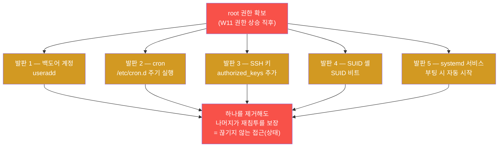
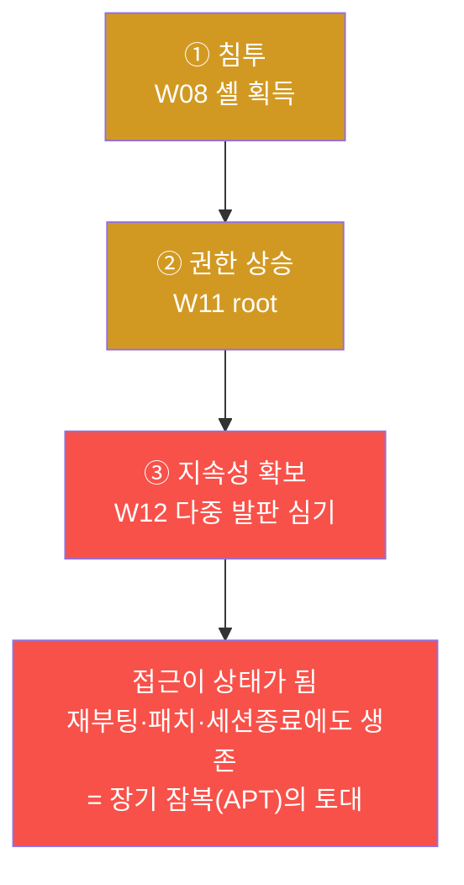
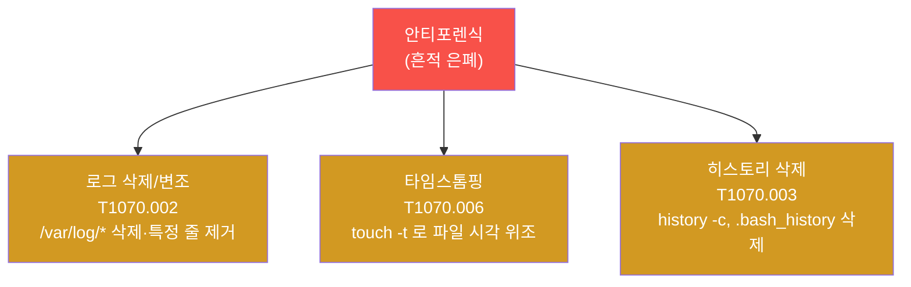
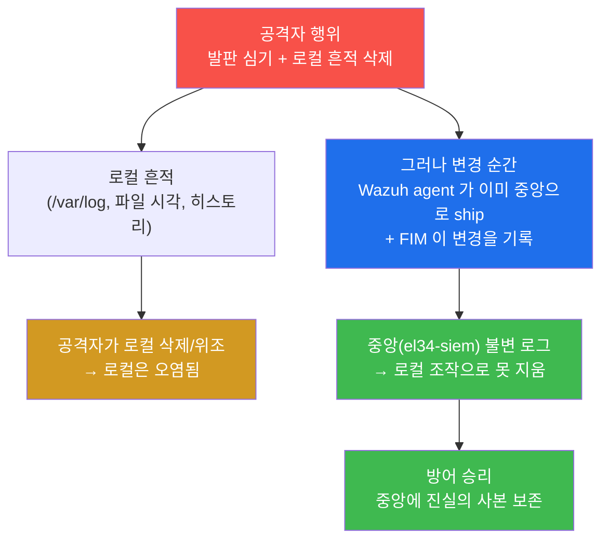
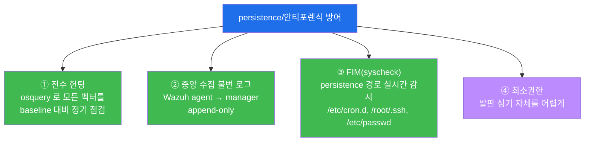
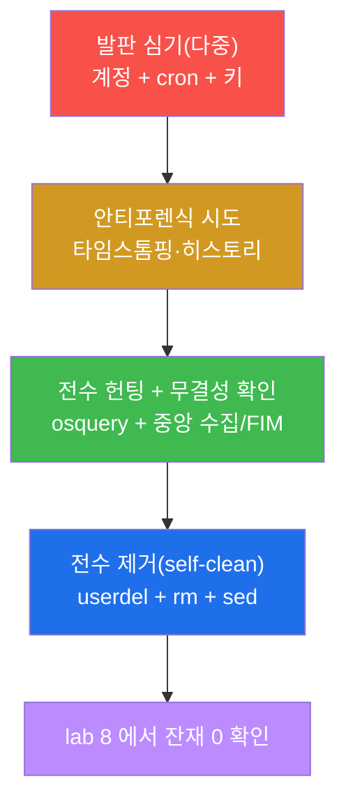
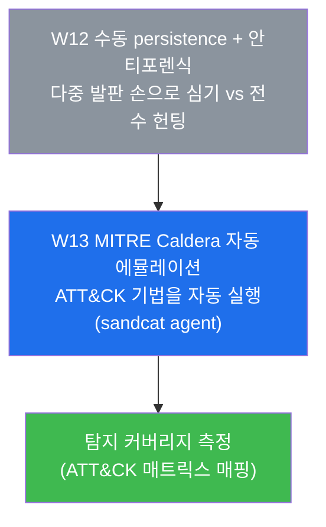

# 공격기법 W12 — 숨어서 버티기: 다중 persistence + 안티포렌식 vs 전수 헌팅·로그 무결성

> **본 주차의 한 줄 요약**
>
> W08 에서 셸(코드 실행 거점)을 얻고 W11 에서 root 로 권한을 끌어올린 공격자의 다음 고민은
> 단 하나다 — "다시 들어오려면 어떻게 해야 하나, 그리고 내가 들어왔던 흔적을 어떻게 지우나."
> 본 주차는 공격자가 재부팅·패치·세션 종료 후에도 살아남기 위해 심는 **지속성
> (persistence)** 의 여러 발판(백도어 계정 · cron · SSH 키 · SUID · systemd 서비스)과, 자기
> 흔적을 숨기는 **안티포렌식**(로그 삭제 · 타임스톰핑 · 히스토리 삭제)을 직접 다룬다. 그다음
> 방어자의 시선으로 돌아서서, 흩어진 발판을 **빠짐없이(전수) 헌팅**하는 osquery 와, 로컬
> 흔적을 지워도 무력화되지 않는 **로그 무결성**(중앙 수집 · FIM · 불변 로그)으로 맞선다.
>
> **공격자 한 줄 결론**: 침투 한 번은 "사건"이고, 지속성은 그 사건을 "상태"로 바꾼다. 공격자는
> **하나를 지워도 다른 게 남도록** 발판을 중복으로 심고, 방어자는 **하나라도 놓치면 재침투**
> 하므로 모든 벡터를 빠짐없이 본다. 양쪽 모두의 핵심어가 "빠짐없이"다.

---

## 학습 목표

본 주차 종료 시 학생은 다음 6가지를 **본인 손으로** 할 수 있어야 한다.

1. 지속성(persistence)이 왜 "단일 발판"이 아니라 "다중 발판"이어야 하는지를, MITRE ATT&CK 의
   persistence 전술(TA0003) 관점에서 설명하고, 백도어 계정·cron·SSH 키·SUID·systemd 서비스 다섯
   벡터가 각각 어느 ATT&CK 기법에 대응하는지 한 표로 정리한다.
2. el34 의 인가된 실습 환경(`el34-web`)에 백도어 계정 + cron + SSH 키의 **다중 persistence** 를
   직접 심고, 각 발판이 독립적으로 재침투를 부른다는 것을 설명한다.
3. 안티포렌식의 세 축(로그 삭제/변조 · 타임스톰핑 · 히스토리 삭제)을 직접 시도하고, **왜 이것이
   로컬에서만 통하고 중앙 수집·FIM·외부 백업 앞에서는 무력한지** 그 한계를 증거로 보인다.
4. 방어자의 시선으로 돌아서서, osquery 로 계정·cron·SSH 키·SUID 를 **전수(빠짐없이) 헌팅**하고,
   한 벡터만 보면 왜 놓치는지를 설명한다.
5. el34 의 Wazuh 중앙 수집 + FIM(syscheck)이 로컬 안티포렌식을 어떻게 무력화하는지를 확인하고,
   "불변(append-only) 중앙 로그"가 왜 안티포렌식의 천적인지 설명한다.
6. 심은 모든 발판을 **전수 제거(self-clean)** 해 공유 인프라를 원상복구하고, 본 주차 전체를 한
   persistence 보고서로 종합한다.

> **이 주차의 시선** — 본 주차는 공격과 방어를 한 사건 위에서 동시에 본다. 공격자는 "다중·은폐"
> 로, 방어자는 "전수·불변"으로 맞선다. 좋은 공격자는 자기 발판이 어떻게 사냥당하는지를 알아야
> 더 깊게 숨고, 좋은 방어자는 공격자의 중복 발판 습성을 알아야 빠짐없이 제거한다.

---

## 0. 용어 해설 (지속성과 안티포렌식의 핵심어)

본 주차에서 처음 나오거나 특히 중요한 용어를 먼저 정리한다. 한 줄 정의에 그치지 않고, 헷갈리기
쉬운 핵심 용어는 §0.5 에서 일상 비유로 풀어 설명한다.

| 용어 | 영문 | 뜻 | 비유 |
|------|------|----|------|
| **지속성** | Persistence | 재부팅·세션 종료·패치 후에도 공격자가 접근을 유지하는 능력 | 빈집에 몰래 만들어 둔 여벌 열쇠 |
| **발판(벡터)** | foothold / vector | 지속성을 실현하는 개별 진입 수단(계정·cron·키 등) 하나하나 | 여러 곳에 숨겨 둔 여벌 열쇠 각각 |
| **다중 persistence** | multiple persistence | 발판을 여러 개 중복으로 심어 하나가 제거돼도 살아남게 함 | 현관·창문·뒷문에 각각 열쇠 숨김 |
| **백도어 계정** | backdoor account | 공격자가 몰래 만든 로그인 계정(uid 0 또는 sudo 권한) | 명부에 몰래 올린 가짜 직원 |
| **cron** | cron / crontab | 정해진 주기로 명령을 자동 실행하는 리눅스 스케줄러 | 매일 같은 시각 울리는 자동 알람 |
| **authorized_keys** | — | SSH 공개키를 등록해 비밀번호 없이 로그인을 허용하는 파일 | 미리 등록해 둔 지문 한 벌 |
| **SUID** | Set-User-ID bit | 실행 시 파일 소유자(보통 root) 권한으로 동작하게 하는 권한 비트 | 사장 명의로 결재되는 도장 |
| **systemd 서비스** | systemd unit | 부팅 시 자동 시작·재시작되는 리눅스 서비스 관리 단위 | 자동으로 다시 켜지는 백그라운드 직원 |
| **안티포렌식** | anti-forensics | 침해 흔적을 지우거나 위조해 조사를 방해하는 행위 | 범행 후 지문 닦고 CCTV 끄기 |
| **타임스톰핑** | timestomping | 파일의 생성·수정 시각을 위조해 추적을 흐림 | 서류에 가짜 날짜 도장 찍기 |
| **히스토리 삭제** | history clearing | 셸 명령 기록(`~/.bash_history`)을 지워 행적을 숨김 | 작업 일지 찢어 버리기 |
| **전수 헌팅** | comprehensive hunting | 모든 persistence 벡터를 빠짐없이 점검하는 방어 활동 | 모든 문·창문을 하나도 빼지 않고 점검 |
| **FIM** | File Integrity Monitoring | 중요 파일의 변경을 실시간 감지·기록하는 기능 | 금고 위 24시간 CCTV |
| **로그 무결성** | log integrity | 로그가 사후 위·변조되지 않도록 보장하는 성질 | 한 번 적으면 못 고치는 잉크 장부 |
| **불변 로그** | append-only / immutable log | 추가만 가능하고 수정·삭제가 불가능한 로그 | 페이지를 뜯을 수 없는 제본 일지 |
| **중앙 수집** | central log collection | 각 호스트의 로그를 중앙(SIEM)으로 즉시 전송·보관 | 모든 지점 CCTV가 본사로 실시간 송출 |
| **self-clean** | — | 실습에서 심은 흔적을 그 자리에서 스스로 제거 | 훈련 후 사격장 탄피 회수 |
| **MITRE ATT&CK** | — | 실제 공격 기법을 전술·기법 체계로 정리한 지식베이스 | 공격 수법 백과사전 |

> **헷갈리기 쉬운 한 쌍 — "지속성" vs "권한 상승".** W11 의 권한 상승(privilege escalation)은
> "지금 이 세션에서 더 높은 권한을 얻는 것"이고, 본 주차의 지속성은 "지금 세션이 끊겨도 다음에
> 다시 들어오는 것"이다. 둘은 순서가 다르다 — 보통 권한을 먼저 끌어올린(root) 뒤, 그 권한으로
> 지속성 발판을 심는다. root 가 있어야 `/etc/cron.d`, `/root/.ssh`, `/etc/passwd` 같은 핵심
> 경로에 발판을 박을 수 있기 때문이다. 그래서 본 주차는 W11(root) 다음에 온다.

---

## 0.5 핵심 용어 개념 설명 — 일상 비유

위 표는 한 줄 정의라 처음 만나는 학생에게는 부족하다. 본 절에서 본격 학습 전에, 헷갈리기 쉬운
핵심 개념 다섯 가지를 일상 비유로 풀어 설명한다.

### 0.5.1 지속성(persistence) — 빈집에 숨겨 둔 여벌 열쇠 비유

도둑이 한 집에 한 번 들어갔다고 하자. 그날 훔칠 것만 훔치고 나오면, 다음에 다시 들어오려면 또
처음부터 자물쇠를 따야 한다. 영리한 도둑은 다르다. 들어간 김에 **여벌 열쇠를 몰래 만들어 화분
밑에 숨겨 둔다.** 그러면 주인이 자물쇠를 바꿔도(=패치), 집을 비워도(=재부팅), 도둑은 숨겨 둔
열쇠로 언제든 다시 들어온다.

이 "한 번 들어간 김에 다음을 위한 통로를 미리 만들어 두는 것"이 보안에서 **지속성
(persistence)** 이다.

**지속성** 은 공격자가 최초 침투 이후에도 표적에 대한 접근을 유지하는 능력이다. 침투는 한 번의
"사건"이지만, 지속성은 그 접근을 끊기지 않는 "상태"로 바꾼다. 그래서 침해 사고에서 가장 위험한
국면은 침투 그 자체보다, 공격자가 지속성을 확보해 **장기 잠복(APT)** 으로 넘어가는 순간이다.

### 0.5.2 다중 persistence — 여러 곳에 열쇠를 숨기는 이유

여벌 열쇠를 **화분 밑 한 곳에만** 숨긴 도둑을 떠올려보자. 주인이 어느 날 화분을 옮기다가 열쇠를
발견하면, 도둑의 통로는 그것으로 끝이다. 그래서 노련한 도둑은 열쇠를 **현관 매트 밑, 우편함 안,
뒷마당 벽돌 틈** 등 여러 곳에 나눠 숨긴다. 주인이 하나를 찾아 없애도, 나머지로 다시 들어온다.

이것이 **다중 persistence** 다. 공격자는 서로 독립적인 발판을 여러 개 심어, **하나가 제거돼도
다른 발판이 재침투를 보장**하게 만든다.



이 그림이 본 주차 공격 측의 핵심이다. 발판이 한 개면 발견 즉시 끝나지만, 여러 개면 방어자가
**모두를 빠짐없이** 찾아 제거해야 비로소 공격자를 끊을 수 있다. 그래서 다음 절의 방어가 "전수"
헌팅을 강조하는 것이다.

### 0.5.3 안티포렌식 — 범행 후 지문 닦고 CCTV 끄기 비유

도둑이 집을 털고 나가기 전에 하는 일이 또 있다. **장갑으로 만진 곳의 지문을 닦고, 거실 CCTV의
녹화를 멈추고, 자기가 다녀간 시각이 적힌 방문 기록을 위조한다.** 나중에 경찰(=포렌식 조사관)이
왔을 때 누가, 언제, 어떻게 들어왔는지 알아내기 어렵게 만드는 것이다.

이것이 **안티포렌식(anti-forensics)** 이다. 공격자가 자기 침해 흔적을 지우거나 위조해 사후 조사를
방해하는 모든 행위를 가리킨다. 본 주차에서는 세 축을 다룬다.

- **로그 삭제/변조** — 자기 행적이 적힌 로그(`/var/log/*`)를 통째로 지우거나 특정 줄만 골라 지운다.
- **타임스톰핑(timestomping)** — `touch -t` 로 파일의 생성·수정 시각을 위조해, 발판이 "오래전부터
  있던 정상 파일"인 것처럼 위장한다(언제 심었는지 추적을 흐린다).
- **히스토리 삭제** — 자기가 친 명령 기록(`~/.bash_history`, `history -c`)을 지워 무슨 작업을
  했는지 숨긴다.

> **중요 — 안티포렌식의 구조적 약점.** 거실 CCTV는 끌 수 있어도, 그 영상이 이미 **본사 관제실로
> 실시간 송출**되고 있었다면 도둑은 송출된 영상까지는 지우지 못한다. 보안에서 이 "본사 관제실"이
> 바로 **중앙 수집 로그(SIEM)** 와 **FIM** 이다. 안티포렌식은 어디까지나 **로컬(그 호스트 안)**
> 에서만 통한다 — 변경이 일어나는 순간 이미 중앙으로 전송된 로그, 별도 보관된 백업, 불변 로그는
> 로컬 조작으로 지울 수 없다. 이것이 §3·§4 에서 방어가 이기는 핵심 이유다.

### 0.5.4 전수 헌팅 — 문·창문을 하나도 빼지 않고 점검 비유

집주인이 "도둑이 다녀간 것 같다"고 느꼈을 때, 현관문만 확인하고 안심하면 안 된다. 도둑은 뒷문,
1층 창문, 지하 통풍구 어디로든 들어왔을 수 있고, 여벌 열쇠도 여러 곳에 숨겨 뒀을 수 있다.
**모든 출입구와 모든 은닉 장소를 하나도 빠뜨리지 않고** 점검해야 한다.

이것이 방어의 **전수(全數) 헌팅** 이다. 공격자가 다중 발판을 심는 습성이 있으므로, 방어자는
계정·cron·SSH 키·SUID·서비스 **모든 벡터를 빠짐없이** 점검해야 한다. 한 벡터만 보고 "깨끗하다"
고 판단하면, 보지 않은 벡터에 남은 발판이 재침투를 부른다.

이 전수 헌팅을 한 도구로 일괄 수행하게 해 주는 것이 **osquery** 다. osquery 는 운영체제의 상태
(계정·crontab·authorized_keys·SUID 바이너리 등)를 **SQL 테이블로 추상화**해, "모든 계정을
보여줘", "모든 cron 작업을 보여줘" 같은 질의를 SQL 한 줄로 던지게 해 준다(W07 학습 도구).

### 0.5.5 로그 무결성 — 한 번 적으면 못 고치는 잉크 장부 비유

연필로 쓴 장부는 지우개로 고칠 수 있다. 하지만 **지워지지 않는 잉크로 제본된 장부**는, 한 번
적힌 줄을 고치거나 뜯어낼 수 없다. 잘못 적었으면 새 줄에 정정만 가능하다. 이렇게 "이미 적힌 것은
바꿀 수 없다"는 성질이 **로그 무결성(log integrity)** 이고, 추가만 되고 수정·삭제가 안 되는
로그를 **불변(append-only) 로그** 라 한다.

안티포렌식(로그 삭제/타임스톰핑)은 결국 "이미 적힌 기록을 고치거나 지우는" 시도다. 따라서 로그가
**불변**이고 **중앙으로 즉시 송출**되면, 공격자가 로컬에서 아무리 지워도 진실의 사본이 중앙에
남는다. el34 에서는 각 컨테이너의 Wazuh agent 가 변경을 즉시 중앙(`el34-siem`)으로 ship 하고,
FIM(syscheck)이 핵심 파일의 변경을 기록한다. 이것이 로컬 안티포렌식의 천적이다.

---

이 다섯 개념 — 지속성 / 다중 발판 / 안티포렌식 / 전수 헌팅 / 로그 무결성 — 이 본 주차의 두 축
(공격: 다중·은폐 / 방어: 전수·불변)을 떠받친다. 본문에서 막히면 본 절로 돌아오면 흐름이 끊기지
않는다.

---

## 1. 침투 "한 번"을 "상태"로 바꾸는 지속성

### 1.1 한 줄 답: 발판이 없으면 모든 침투는 일회용이다

W08 에서 학생은 셸(코드 실행 거점)을 얻었고, W11 에서 그 셸을 root 로 끌어올렸다. 그런데 그
세션이 끊기면 — 관리자가 프로세스를 죽이거나, 서버가 재부팅되거나, 침투에 쓴 취약점이 패치되면 —
공격자는 처음부터 다시 침투해야 한다. 힘들게 뚫은 입구가 **일회용**이 되는 것이다.

지속성은 이 일회용 침투를 **재사용 가능한 통로**로 바꾼다. 공격자는 root 권한이 있는 동안, 다음에
다시 들어올 길을 미리 여러 개 만들어 둔다. 그 순간부터 침투는 "한 번 일어난 사건"이 아니라
"끊기지 않는 접근 상태"가 된다. 침해 사고가 며칠·몇 주가 아니라 **수개월씩 잠복**하는 APT 가
가능한 이유가 바로 이 지속성이다.



### 1.2 왜 "다중"인가 — 단일 발판은 발견 한 번에 끝난다

발판을 하나만 심으면, 방어자가 그 하나를 발견하는 순간 공격자의 통로는 완전히 끊긴다. 그래서
실전 공격자는 **서로 독립적인** 발판을 여러 개 심는다. "독립적"이라는 말이 핵심이다 — 계정 백도어와
cron 백도어는 작동 원리가 전혀 달라서, 방어자가 계정만 점검하고 cron 을 놓치면 cron 으로 재침투가
일어난다. 발판들이 서로 다른 메커니즘에 기대고 있을수록, 방어자가 **모두를 동시에** 찾아내기
어려워진다.

이 "다중·독립"이라는 공격자의 습성이, 방어자에게 정확히 거울처럼 반사된다. 방어자는 **하나라도
놓치면 진다.** 그래서 방어의 원칙은 "전수" — 모든 벡터를 빠짐없이 본다(§4). 공격의 "다중"과
방어의 "전수"는 동전의 양면이다.

### 1.3 MITRE ATT&CK 으로 본 지속성 — TA0003 전술

공격 기법을 체계적으로 이해하려면 **MITRE ATT&CK** 을 본다.

> **용어 — MITRE ATT&CK.** 미국 비영리 연구기관 MITRE 가 만든, 실제 관측된 공격 기법을 **전술
> (Tactic, 공격자의 목표)** 과 **기법(Technique, 그 목표를 이루는 방법)** 의 행렬로 정리한 공개
> 지식베이스다. 예를 들어 "지속성"은 하나의 전술(TA0003)이고, 그 아래 "계정 생성", "cron 사용"
> 같은 구체적 기법들이 ID(`T1136`, `T1053.003` 등)로 분류된다. 방어자는 이 ID 로 "우리는 이
> 기법을 탐지할 수 있나?"를 점검하고, 공격자(레드팀)는 이 ID 로 공격 시나리오를 설계한다. el34 의
> W13(Caldera)·W14 는 이 ATT&CK 매트릭스를 본격적으로 다룬다.

본 주차의 다섯 발판은 모두 ATT&CK 의 **Persistence 전술(TA0003)** 에 속한다. 각 발판이 어느
기법에 대응하는지를 정리하면 다음과 같다(괄호 안은 ATT&CK 기법 ID).

| 발판(벡터) | ATT&CK 기법 | 작동 원리 | 본 lab 에서 |
|------------|-------------|-----------|-------------|
| 백도어 계정 | T1136 (Create Account) | 로그인 가능한 계정을 몰래 추가(uid 0 또는 sudo) | `useradd atkw12bd` |
| cron | T1053.003 (Scheduled Task/Job: Cron) | 주기적으로 명령을 자동 실행 | `/etc/cron.d/atkw12_persist` |
| SSH 키 | T1098.004 (Account Manipulation: SSH Keys) | `authorized_keys` 에 공개키를 추가해 무비밀번호 로그인 | `ATKW12FAKE` 키 추가 |
| SUID 셸 | T1548.001 (Abuse Elevation: setuid/setgid) | 셸에 SUID 비트를 붙여 언제든 root 셸 | (개념 — W11 의 SUID 와 연결) |
| systemd 서비스 | T1543.002 (Create/Modify System Process: systemd) | 부팅 시 자동 시작·재시작되는 서비스 등록 | (개념) |

> 본 lab 의 실습은 권한·환경상 확실히 재현·검증되는 세 벡터(**계정 + cron + SSH 키**)를 손으로
> 심는다. SUID(T1548.001)와 systemd 서비스(T1543.002)는 본문에서 개념으로 다루되, SUID 는 W11 의
> 권한 상승에서 이미 손을 댔으므로 "권한 상승 도구가 곧 지속성 발판도 된다"는 연결로 이해한다.

### 1.4 한계 — 이 주차가 다루지 않는 것

본 주차는 **수동(manual)** 지속성과 그 방어에 집중한다. 따라서 다음은 본 주차 범위 밖이다 —
지속성을 **자동으로** 여러 기법 묶어 심는 프레임워크(W13 의 MITRE Caldera), 메모리에만 상주하는
fileless persistence, 커널 루트킷처럼 OS 자체를 속이는 고급 은폐 기법. 또한 본 주차의 방어는
osquery 의 스냅샷 헌팅과 Wazuh FIM 확인까지이며, SIEM 내부에서 이 흔적들이 어떻게 한 평결로
상관·격상되는지는 방어 트랙(secuops/soc)의 영역이다. 본 주차는 "발판을 빠짐없이 심고, 빠짐없이
찾아 제거하는" 사고를 기르는 데 집중한다.

---

## 2. 다섯 persistence 벡터 상세 — "중복이 핵심"

이번 시나리오는 W11 에서 root 를 확보한 공격자가 `el34-web` 에 다중 발판을 심는 것이다. 각 벡터를
**한 줄 정의 → 왜 효과적인가 → el34 에서 어떻게 → 어떻게 잡히나(방어 가시성)** 순으로 본다.

> ⚠️ **인가된 실습만.** 본 트랙의 모든 공격은 **인가된 실습 환경(el34)** 안에서, 정해진 대상
> (`el34-web`)에 한해서만 수행한다. RoE(범위·시간·방법)를 벗어나거나 실제 외부 시스템에 지속성을
> 심는 행위는 명백한 불법이며 본 과정의 윤리 규정을 위반한다. 심은 모든 발판은 공유 인프라 보존을
> 위해 **반드시 self-clean** 한다(§6, lab 6·8). 본 lab 의 SSH 키·계정은 실제 접속용이 아닌
> **탐지·헌팅 학습용 가짜 마커**(`ATKW12FAKE`, `atkw12bd`)다.

### 2.1 백도어 계정 (T1136)

**한 줄 정의.** 공격자가 시스템에 몰래 추가하는 로그인 계정이다. uid 0(root 와 동급)이거나 sudo
권한을 주면, 그 계정으로 로그인하는 것만으로 시스템을 장악할 수 있다.

**왜 효과적인가.** 계정은 OS 가 정식으로 인정하는 인증 수단이라, 취약점 패치와 무관하게 작동한다.
이름을 `support`, `backup`, `svc-monitor` 처럼 정상 서비스 계정처럼 위장하면, 관리자가 계정 목록을
훑어봐도 의심하기 어렵다.

**el34 에서 어떻게.** 본 lab 은 `useradd -m -s /bin/bash atkw12bd` 로 백도어 계정을 만든다.
`atkw12bd`(attack-w12-backdoor)는 다른 학생과 겹치지 않게 정한 **네임스페이스 마커**다. 실전이라면
여기에 sudo 권한이나 uid 0 을 더하지만, 본 lab 은 탐지·헌팅 학습이 목적이므로 일반 계정으로 심어
osquery 가 그 존재를 잡아내는지를 본다.

**어떻게 잡히나.** osquery 의 `users` 테이블이 모든 계정을 SQL 로 보여준다. `SELECT username,uid
FROM users` 한 줄이면 baseline 에 없던 새 계정이 즉시 드러난다 — 타임스톰핑으로 파일 시각을 위조해도
계정의 **존재 자체**는 숨길 수 없다.

### 2.2 cron (T1053.003)

**한 줄 정의.** cron 은 정해진 주기(분/시/일 단위)로 명령을 자동 실행하는 리눅스 스케줄러다.
공격자는 cron 에 "주기적으로 자기 백도어를 다시 띄우는" 명령을 등록한다.

**왜 효과적인가.** 방어자가 공격자의 백도어 프로세스를 죽여도, cron 이 다음 주기에 그것을 다시
살려낸다. 즉 cron 은 "제거에 대한 자동 복구" 발판이다. `/etc/cron.d/` 에 파일 하나만 두면 시스템이
알아서 주기 실행해 준다.

**el34 에서 어떻게.** 본 lab 은 `/etc/cron.d/atkw12_persist` 에 `* * * * * root /tmp/.atkw12.sh`
를 쓴다. 앞의 `* * * * *` 는 "매분 실행"이라는 cron 시간 표기이고, `root` 는 실행 사용자, 뒤는
실행할 스크립트 경로다. 경로 앞의 점(`.atkw12.sh`)은 `ls` 기본 출력에서 숨겨지는 **은닉 파일**
관행으로, 안티포렌식의 일종이다.

**어떻게 잡히나.** osquery 의 `crontab` 테이블이 모든 cron 항목을 보여준다. `SELECT command,path
FROM crontab` 으로 공격자가 심은 주기 명령이 드러난다. 은닉 파일이든 타임스톰핑된 파일이든, cron
엔트리로 등록된 이상 osquery 의 시야를 벗어나지 못한다.

### 2.3 SSH 키 (T1098.004)

**한 줄 정의.** SSH 는 공개키를 `~/.ssh/authorized_keys` 에 등록하면 비밀번호 없이 로그인을
허용한다. 공격자는 자기 공개키를 이 파일에 추가해, 비밀번호가 바뀌어도 키로 들어올 수 있게 한다.

**왜 효과적인가.** 관리자가 보안 사고 후 모든 비밀번호를 바꿔도, `authorized_keys` 에 남은 공격자
키는 그대로 작동한다. 비밀번호 변경이라는 가장 흔한 대응을 **무력화**하는 발판이다.

**el34 에서 어떻게.** 본 lab 은 `/root/.ssh/authorized_keys` 에 `ssh-rsa AAAAB3_ATKW12FAKE
atk@evil` 한 줄을 추가한다. 이것은 **형식만 갖춘 가짜 마커**이며 실제 로그인용 유효 키가 아니다 —
목적은 "방어자가 authorized_keys 변경을 헌팅으로 잡아내는가"를 확인하는 것이다.

**어떻게 잡히나.** osquery 의 `authorized_keys` 테이블이 등록된 키를 보여주고, 더 강력하게는 Wazuh
FIM 이 `/root/.ssh/authorized_keys` 파일의 변경을 **변경되는 순간** 중앙으로 ship 한다. 즉 키를
추가하는 행위 자체가 실시간으로 중앙 로그에 기록된다(§3 의 안티포렌식 무력화로 이어진다).

### 2.4 SUID 셸 (T1548.001) — 개념

**한 줄 정의.** 파일에 SUID 비트가 붙으면, 누가 실행하든 그 파일은 **소유자(보통 root) 권한**으로
동작한다. 공격자는 셸(`/bin/bash` 사본)에 SUID 비트를 붙여, 일반 계정으로도 언제든 root 셸을 열 수
있게 한다.

**W11 과의 연결.** SUID 는 W11 에서 권한 상승의 통로로 배웠다(잘못 설정된 SUID 바이너리로 root 셸
획득). 여기서 핵심 통찰은 — **공격자가 직접 SUID 셸을 만들어 두면, 그것이 곧 지속성 발판이 된다는
것**이다. 같은 메커니즘(SUID)이 W11 에서는 "지금 권한을 올리는" 도구였고, W12 에서는 "다음에 다시
root 가 되는" 발판이다. 공격자의 한 기술이 단계에 따라 다른 역할을 한다.

**어떻게 잡히나.** osquery 의 `suid_bin` 테이블이 SUID/SGID 가 붙은 모든 바이너리를 나열한다.
baseline(정상 시스템의 SUID 목록)과 비교하면, 공격자가 새로 만든 SUID 셸이 "원래 없던 항목"으로
드러난다.

### 2.5 systemd 서비스 (T1543.002) — 개념

**한 줄 정의.** systemd 는 리눅스의 서비스 관리자로, 부팅 시 서비스를 자동 시작하고 죽으면
재시작한다. 공격자는 자기 백도어를 systemd 서비스로 등록해, **재부팅 후에도 자동 부활**하게 한다.

**왜 효과적인가.** cron 이 "주기 실행"이라면 systemd 서비스는 "부팅 시작 + 죽으면 즉시 재시작"이라
더 끈질기다. `enabled` 상태로 두면 재부팅이 오히려 공격자의 백도어를 다시 켜 주는 셈이다.

**어떻게 잡히나.** osquery 의 `systemd_units` 테이블(또는 `systemctl list-units`)로 등록된 서비스를
점검한다. 정상 서비스 목록 baseline 과 대조해 낯선 unit 을 찾는다.

### 2.6 다섯 벡터의 종합 — 중복이 방어를 어렵게 한다

다섯 벡터는 작동 원리가 모두 다르다 — 계정은 인증, cron 은 스케줄러, SSH 키는 키 기반 인증, SUID 는
권한 비트, systemd 는 서비스 관리. 공격자가 이 중 셋만 동시에 심어도, 방어자는 **세 가지 전혀 다른
곳**을 모두 점검해야 한다. 하나라도 빠뜨리면 그 벡터로 재침투가 일어난다. 이 "서로 다른 메커니즘에
분산"이 다중 persistence 가 방어자를 괴롭히는 본질이며, 다음 절(§4)에서 방어가 "전수"를 강조하는
직접적 이유다.

---

## 3. 안티포렌식 — 흔적 지우기와 그 구조적 한계

지속성 발판을 심은 공격자는 자기가 다녀간 흔적을 지운다. 그런데 본 주차에서 학생이 반드시 가져가야
할 통찰은 **"안티포렌식은 로컬에서만 통하고 중앙 앞에서는 진다"** 는 것이다.

### 3.1 안티포렌식의 세 축

**한 줄 정의.** 안티포렌식은 공격자가 침해 흔적을 지우거나 위조해 사후 조사를 방해하는 행위다
(ATT&CK 의 Indicator Removal, T1070 계열).



- **로그 삭제/변조(T1070.002).** 자기 행적이 적힌 로컬 로그(`/var/log/auth.log`, web 접근 로그
  등)를 통째로 지우거나, 자기 IP 가 든 줄만 골라 제거한다.
- **타임스톰핑(T1070.006).** `touch -t 202001010000 <파일>` 처럼 파일의 mtime/atime 을 과거로
  위조해, 방금 심은 발판이 "오래전부터 있던 정상 파일"처럼 보이게 한다. 조사관이 "최근 변경된 파일"
  을 추릴 때 발판이 그 목록에서 빠지게 만드는 것이 노림수다.
- **히스토리 삭제(T1070.003).** 셸 명령 기록(`~/.bash_history`)을 지우거나 `history -c` 로 비워,
  공격자가 어떤 명령을 실행했는지(=무엇을 심고 무엇을 훔쳤는지)를 숨긴다.

### 3.2 왜 로컬에서는 통하나

이 세 기법은 **그 호스트 안에서만** 보는 조사관에게는 꽤 효과적이다. root 권한이 있으면 로컬 로그
파일을 지울 수 있고, 파일 시각도 위조할 수 있고, 자기 셸 히스토리도 비울 수 있다. 침해 호스트
하나만 떼어 와서 디스크를 분석하는 전통적 포렌식은, 이렇게 로컬이 오염되면 큰 어려움을 겪는다.

### 3.3 왜 중앙 앞에서는 지나 — 안티포렌식의 천적

그러나 핵심은 여기다. **변경이 일어나는 그 순간, 이미 중앙으로 사본이 전송되었다면** 공격자는
중앙의 사본까지는 지우지 못한다.



el34 에서 이를 떠받치는 세 장치는 다음과 같다.

- **중앙 수집(Wazuh agent → manager).** el34 의 web·ips 컨테이너에는 Wazuh agent 가 있어, 로그
  변경과 보안 이벤트를 즉시 `el34-siem`(Wazuh manager, dmz .100)으로 전송한다. 로컬에서 로그를
  지워도 이미 전송된 사본은 중앙에 남는다.
- **FIM(syscheck).** Wazuh 의 File Integrity Monitoring 은 `/etc/passwd`, `/etc/cron.d`,
  `/root/.ssh/authorized_keys` 같은 핵심 경로의 변경을 실시간 감지해 alert 로 올린다. 즉 발판을
  심는 행위 자체가 중앙에 기록된다.
- **불변(append-only) 로그.** 중앙 로그를 추가만 가능하게(수정·삭제 불가) 운영하면, 설령 공격자가
  중앙 서버에 손을 뻗어도 과거 기록을 고칠 수 없다.

**결론.** 안티포렌식은 "로컬을 더럽히는" 기술이고, 방어는 "진실을 로컬 바깥(중앙·불변)에 미리
복사해 두는" 전략으로 이를 이긴다. 그래서 본 lab 의 흐름은 공격자가 타임스톰핑(§lab3)을 해도,
방어자가 osquery 전수 헌팅(§lab4)과 중앙 수집/FIM 확인(§lab5)으로 **모든 발판을 그대로 찾아내는**
것을 보여준다.

---

## 4. 방어 — 전수 헌팅 + 로그 무결성

공격의 "다중·은폐"에 방어는 "전수·불변"으로 맞선다. 방어의 두 기둥은 osquery 전수 헌팅과 로그
무결성(중앙 수집/FIM)이다.

### 4.1 전수 헌팅 — osquery 로 모든 벡터를 한 번에

**한 줄 정의.** 전수 헌팅은 계정·cron·SSH 키·SUID·서비스 등 **모든 persistence 벡터를 빠짐없이**
점검하는 방어 활동이다.

**왜 osquery 인가.** osquery 는 OS 상태를 SQL 테이블로 추상화하므로, 서로 다른 다섯 벡터를 모두
**같은 도구·같은 문법**으로 질의할 수 있다(W07). 계정은 `users`, cron 은 `crontab`, SSH 키는
`authorized_keys`, SUID 는 `suid_bin`, 서비스는 `systemd_units` 테이블이다. 한 도구로 전 벡터를
훑을 수 있다는 것이 전수 헌팅에 결정적이다.

```bash
# 전수 헌팅(osquery): 모든 persistence 벡터를 한 번에
ssh ccc@10.20.32.80 'sudo osqueryi --json "SELECT username,uid FROM users WHERE uid>=1000;"'
ssh ccc@10.20.32.80 'sudo osqueryi --json "SELECT command,path FROM crontab;"'
ssh ccc@10.20.32.80 'sudo osqueryi --json "SELECT * FROM authorized_keys LIMIT 5;" 2>/dev/null'
ssh ccc@10.20.32.80 'sudo osqueryi --json "SELECT path FROM suid_bin;"'
```

위 질의들이 보여주는 것을 해석하면 — 첫 줄은 일반 사용자 계정(uid≥1000) 목록에서 baseline 에 없던
백도어 계정을 드러내고, 둘째 줄은 모든 cron 명령에서 낯선 주기 작업을 드러내며, 셋째 줄은 등록된
SSH 키에서 공격자 키를, 넷째 줄은 SUID 바이너리에서 새로 만들어진 SUID 셸을 드러낸다. **한 벡터만
보면 놓친다** — 계정만 점검하고 cron 을 안 보면 cron 으로 재침투가 일어난다.

> **타임스톰핑이 무력한 이유.** 타임스톰핑은 파일의 **시각(mtime)** 만 위조한다. 그러나 osquery 는
> 계정·cron·키의 **존재 자체**를 질의한다. 시각을 아무리 과거로 바꿔도, 계정이 있으면 `users` 에
> 보이고 cron 엔트리가 있으면 `crontab` 에 보인다. 즉 안티포렌식(시각 위조)은 전수 헌팅(존재 질의)
> 을 이기지 못한다.

### 4.2 baseline 의 중요성

전수 헌팅이 의미를 가지려면 **baseline** 이 있어야 한다. baseline 은 "정상 상태의 계정·cron·키·SUID
목록"이다. 헌팅 결과를 baseline 과 대조해야 "원래 없던 것"이 무엇인지 알 수 있다. baseline 없이
헌팅 결과만 보면, 정상 시스템 계정과 공격자 백도어를 구분하기 어렵다. 그래서 방어 운영은 침해 전에
미리 baseline 을 떠 두고, 정기적으로(예: 매일) 현재 상태와 diff 를 본다.

### 4.3 로그 무결성 — 안티포렌식의 천적

§3.3 에서 본 대로, 로그 무결성은 안티포렌식을 구조적으로 무력화한다. 방어 운영에서 이를 실현하는
세 가지를 다시 정리하면 다음과 같다.



- **① 전수 헌팅** — 모든 벡터를 baseline 대비 정기 점검(osquery). 다중 발판의 천적.
- **② 중앙 수집 불변 로그** — 변경을 즉시 중앙으로 ship 하고 추가만 가능하게 보관. 로그 삭제의 천적.
- **③ FIM** — persistence 가 심어지는 핵심 경로를 실시간 감시. 타임스톰핑·은닉 파일의 천적(변경
  **순간**을 잡으므로 사후 시각 위조가 소용없다).
- **④ 최소권한** — 애초에 root 가 아니면 `/etc/cron.d` 나 `/root/.ssh` 에 발판을 박기 어렵다.
  발판 심기 자체를 어렵게 만드는 예방적 통제다.

이 네 가지가 합쳐지면, 공격자가 다중 발판을 심고 로컬 흔적을 지워도 — 중앙에는 진실이 남고
(②③), 방어자는 모든 발판을 빠짐없이 찾아(①) 제거하며, 애초에 발판 심기도 어렵다(④).

---

## 5. 공격 vs 방어 — 한 표로 본 본 주차

본 주차의 모든 내용을 "공격자가 무엇을 하고 / 그것이 어떻게 잡히는가"의 한 표로 압축한다. 학생은
이 표를 머릿속에 두고, 각 벡터를 심을 때 그것이 어느 방어 가시성에 걸리는지를 즉시 떠올려야 한다.

| 공격(다중·은폐) | ATT&CK | 방어(전수·불변) | 방어 가시성 |
|----------------|--------|----------------|-------------|
| 백도어 계정(`atkw12bd`) | T1136 | osquery `users` 전수 + baseline diff | 계정 존재는 시각 위조로 못 숨김 |
| cron(`atkw12_persist`) | T1053.003 | osquery `crontab` 전수 | 은닉 파일이어도 cron 엔트리로 노출 |
| SSH 키(`ATKW12FAKE`) | T1098.004 | osquery `authorized_keys` + FIM | 키 추가 순간 FIM 이 중앙으로 ship |
| SUID 셸 | T1548.001 | osquery `suid_bin` + baseline diff | 새 SUID 가 baseline 에 없음으로 노출 |
| systemd 서비스 | T1543.002 | osquery `systemd_units` + baseline diff | 낯선 unit 이 baseline 에 없음으로 노출 |
| 로그 삭제/변조 | T1070.002 | 중앙 수집(이미 ship 됨) | 로컬 삭제해도 중앙 사본 보존 |
| 타임스톰핑 | T1070.006 | osquery 존재 질의 + FIM(변경 순간) | 시각만 속이지 존재·변경 순간은 못 숨김 |
| 히스토리 삭제 | T1070.003 | 중앙 수집 + 명령 감사(auditd) | 로컬 히스토리 외 중앙 기록 별도 |

이 표를 읽는 두 방향은 — **공격자 방향**: "내가 이 발판을 심으면 어디에 흔적이 남나"(자기 가시성
인식), **방어자 방향**: "이 발판을 잡으려면 어느 osquery 테이블·어느 중앙 로그를 보나"(전수 헌팅
체크리스트). 두 방향을 다 말할 수 있으면, "자기 발판이 어떻게 사냥당하는지 아는 좋은 공격자"이자
"공격자의 중복 습성을 아는 좋은 방어자"가 된 것이다.

> **핵심 결론.** 공격의 무기는 "다중(여러 발판) + 은폐(안티포렌식)", 방어의 무기는 "전수(모든
> 벡터) + 불변(중앙·append-only 로그)". 양쪽 모두 승부를 가르는 단어는 **"빠짐없이"** 다. 공격자는
> 빠짐없이 중복으로 심고, 방어자는 빠짐없이 찾아 제거한다.

---

## 6. 실습 안내 — lab 8 미션 (4 축 설명)

본 주차 실습은 8 미션으로 구성된다. 각 미션을 **4 축**으로 설명한다 — 왜 하는가 / 무엇을 알 수
있는가 / 결과 해석(정상 vs 비정상) / 실전 활용. 미션은 점검 → 다중 발판 심기 → 안티포렌식 시도 →
전수 헌팅 → 로그 무결성 → 전수 제거 → 방어 종합 → 보고서 순서로, **공격(심기·은폐) 다음에 방어
(헌팅·무결성·제거)** 가 오도록 흐른다.

> **실습 진행 원칙.** 모든 명령은 el34 호스트(`ssh ccc@192.168.0.80`, 비밀번호 1)에서
> 표적 web 셸 `ssh ccc@10.20.32.80`(root 작업 sudo) / SIEM `ssh ccc@10.20.32.100` 로 실행한다. **인가된 실습 환경(el34)에서만** 수행한다. 심은 발판
> (계정·cron·키)은 lab 6 에서 전수 제거하고 lab 8 에서 잔재 0 을 확인한다(self-clean). SSH 키·계정은
> 실제 접속용이 아닌 가짜 마커다. 합격 임계값은 0.7 이다.

### 미션 1 — 점검: osquery (10점, survey)

> **왜 하는가?** 본 주차 방어의 핵심 도구가 osquery 다. 전수 헌팅을 시작하기 전, osquery 가
> 사용 가능한지부터 점검한다. 도구가 없으면 헌팅을 시작할 수 없다.
>
> **무엇을 알 수 있는가?** `el34-web` 에 osquery(osqueryi)가 설치되어 동작하는지. osquery 는
> users·crontab·authorized_keys·suid_bin 등 모든 persistence 벡터를 SQL 로 질의하는 전수 헌팅
> 도구다.
>
> **결과 해석.** 정상: osqueryi 버전이 출력됨(예: 5.x). 비정상: 명령을 못 찾으면 osquery 미설치 —
> 이 경우 헌팅 실습을 진행할 수 없으니 환경을 먼저 확인한다.
>
> **실전 활용.** 침해 대응 착수 시 first responder 가 헌팅 도구의 가용성부터 확인하는 절차에 대응.

### 미션 2 — 다중 persistence 심기: 계정 + cron + SSH 키 (12점, manipulation)

> **왜 하는가?** 익스플로잇·권한 상승(W08·W11) 다음 단계인 지속성 확보를 직접 수행한다. 단일이
> 아닌 **다중** 발판을 심어, 하나가 제거돼도 다른 게 재침투를 부른다는 공격자의 핵심 전략을 손으로
> 익힌다.
>
> **무엇을 알 수 있는가?** 서로 독립적인 세 벡터 — 백도어 계정(T1136, `atkw12bd`) + cron
> (T1053.003, `atkw12_persist`) + SSH 키(T1098.004, `ATKW12FAKE`) — 를 심는 법. 세 발판이 각각
> 인증·스케줄러·키라는 전혀 다른 메커니즘에 기댄다는 것.
>
> **결과 해석.** 정상: `planted`(계정 + cron + 키) 출력. 핵심 깨달음 — 세 발판이 독립적이라
> 방어자가 셋을 모두 빠짐없이 제거해야 비로소 공격자를 끊는다.
>
> **실전 활용.** 레드팀이 장악 후 다중 발판을 심어 방어자의 단편적 제거를 무력화하는 전형적 절차.
> 본 lab 은 학습용 가짜 마커로 심고 반드시 self-clean 한다.

### 미션 3 — 안티포렌식 시도: 타임스톰핑 + 그 한계 (12점, manipulation)

> **왜 하는가?** 발판을 심은 공격자가 흔적을 숨기는 안티포렌식을 직접 시도하고, **그것이 왜
> 로컬에서만 통하는지** 그 한계를 체득한다.
>
> **무엇을 알 수 있는가?** `touch -t` 타임스톰핑(T1070.006)으로 발판 파일의 생성 시각을 과거로
> 위조하는 법, 그리고 히스토리 삭제·로컬 로그 정리까지 시도해도 **중앙 수집(Wazuh)·FIM·외부
> 백업은 못 지운다**는 구조적 한계.
>
> **결과 해석.** 정상: 위조된 파일 시각(예: 2020년)이 출력되고, "중앙 수집은 못 지운다"는 한계가
> 확인됨. 핵심 깨달음 — 타임스톰핑은 시각만 속이지 발판의 **존재**는 못 숨긴다(다음 미션에서 입증).
>
> **실전 활용.** 침해 조사 시 "최근 변경 파일" 추리기가 타임스톰핑으로 회피된다는 점을 알아야,
> 조사관은 mtime 이 아니라 중앙 로그·FIM·존재 질의로 보강한다.

### 미션 4 — 전수 헌팅(osquery): 모든 벡터 발견 (14점, analysis)

> **왜 하는가?** 방어자의 시선으로 돌아서서, 공격자가 심은 모든 발판을 **빠짐없이(전수)** 찾아낸다.
> 한 벡터만 보면 놓친다는 방어 원칙을 직접 확인한다.
>
> **무엇을 알 수 있는가?** osquery `users`(계정)·`crontab`(cron)·`authorized_keys`(키)를 한 번에
> 질의해 세 발판을 모두 드러내는 법. 그리고 미션 3 의 타임스톰핑에도 불구하고 osquery 가 발판의
> **존재 자체**를 그대로 잡아낸다는 것.
>
> **결과 해석.** 정상: `atkw12bd` 계정 + cron + 키가 모두 발견됨. 핵심 깨달음 — 시각 위조는 mtime
> 만 속이지 존재를 못 숨기므로, 존재를 질의하는 전수 헌팅이 안티포렌식을 이긴다.
>
> **실전 활용.** 침해 대응에서 다중 발판을 baseline 대비 일괄 헌팅하는 블루팀의 표준 작업. 한
> 벡터만 보고 안심하지 않는 규율.

### 미션 5 — 로그 무결성: 안티포렌식 무력화 확인 (12점, analysis)

> **왜 하는가?** 안티포렌식의 천적인 로그 무결성(중앙 수집/FIM)을 직접 확인해, "왜 방어가
> 구조적으로 이기는가"를 증거로 본다.
>
> **무엇을 알 수 있는가?** el34 의 web 컨테이너에 Wazuh agent 가 살아 있어 변경을 중앙
> (`el34-siem`)으로 ship 하고, FIM(syscheck)이 핵심 경로 변경을 기록한다는 것. 로컬을 위조·삭제해도
> 중앙엔 사본이 남는다는 것.
>
> **결과 해석.** 정상: web agent 가 연결됨이 확인되고, syscheck/integrity 관련 중앙 경보가 집계됨.
> 핵심 깨달음 — 변경이 일어나는 순간 이미 중앙으로 ship 되므로, 사후 로컬 조작이 소용없다.
>
> **실전 활용.** SIEM·FIM 운영의 핵심 가치 — 침해 호스트가 오염돼도 중앙에 진실이 남아 사고 조사가
> 가능하다. 불변 중앙 로그가 안티포렌식을 무력화하는 실증.

### 미션 6 — 전수 제거(self-clean): 모든 벡터 제거 (12점, response)

> **왜 하는가?** 공격자의 "다중"에 방어자는 "전수 제거"로 답한다. 발견한 모든 발판을 빠짐없이
> 제거해야 재침투를 끊을 수 있다. 동시에 공유 인프라를 원상복구하는 self-clean 이기도 하다.
>
> **무엇을 알 수 있는가?** 계정(`userdel`) + cron(`rm`) + SSH 키(`sed` 로 해당 줄 삭제)를 모두
> 제거하고, 제거가 실제로 됐는지 검증하는 법. 헌팅과 제거 모두 "전수"가 원칙이라는 것.
>
> **결과 해석.** 정상: `cleaned` 출력 + 제거 확인에서 계정·cron 잔재 없음(`user ok`, `cron ok`).
> 비정상: 잔재가 보이면 해당 벡터의 제거 명령을 다시 실행한다.
>
> **실전 활용.** 침해 대응의 봉쇄·박멸 단계 — 발견한 모든 IOC·발판을 빠짐없이 제거. 하나라도 남기면
> 재침투가 일어나므로 제거의 완전성이 생명이다.

### 미션 7 — 방어 종합: 전수 헌팅 + 불변 로그 (12점, report)

> **왜 하는가?** 본 주차 방어를 한 묶음으로 정리해, persistence/안티포렌식에 맞서는 방어 체계를
> 종합적으로 진술한다.
>
> **무엇을 알 수 있는가?** 방어의 네 기둥 — ① 전수 헌팅(모든 벡터 baseline 점검) ② 중앙 수집 불변
> 로그 ③ FIM(persistence 경로 실시간 감시) ④ 최소권한 — 을 한 체계로 엮는 법.
>
> **결과 해석.** 정상: 네 기둥이 모두 포함된 방어 정리 출력. 핵심 결론 — 공격은 다중·은폐, 방어는
> 전수·불변으로 맞선다.
>
> **실전 활용.** 보안 운영 정책 수립 시 persistence 대응 체크리스트의 표준 골격. 예방(최소권한)·
> 탐지(전수 헌팅·FIM)·보존(불변 로그)을 모두 갖춰야 완결적이다.

### 미션 8 — persistence 보고서 (10점, report)

> **왜 하는가?** 미션 1–7 을 한 보고서로 종합해, 다중 persistence 공격과 전수 방어를 문서로
> 입증한다(침투 테스트 보고 단계에 대응).
>
> **무엇을 알 수 있는가?** 다중 persistence(계정/cron/키) → 안티포렌식 + 한계 → 전수 헌팅 + 로그
> 무결성 → 방어(전수+불변)를 한 보고서로 엮는 법. 발견을 단편이 아니라 "공격 vs 방어"의 대결
> 구도로 설명하는 표준 구조.
>
> **결과 해석.** 정상: 보고서에 다중 persistence + 안티포렌식 한계 + 전수 방어가 모두 포함됨. 핵심
> 결론 — 공격은 다중·은폐, 방어는 전수·불변. 하나라도 놓치면(공격자는 발판, 방어자는 제거) 재침투.
>
> **실전 활용.** 침해 대응 보고서의 표준 구조(공격 경로 → 흔적·은폐 → 탐지·제거 → 재발 방지).
> 양쪽 모두 "빠짐없이"가 핵심임을 결론으로 명시한다.

---

## 7. 실습 수칙 — 인가된 실습 + 공유 인프라 보존

el34 는 여러 학생이 함께 쓰는 공유 인프라이며, 본 주차는 실제로 백도어 발판을 심으므로 윤리 규정이
특히 엄격하다. 다음 수칙을 반드시 지킨다.

- **인가된 실습만.** 모든 발판은 인가된 실습 환경(el34) 안에서, 정해진 대상(`el34-web`)에 한해서만
  심는다. 실제 외부 시스템에 지속성을 심는 행위는 명백한 불법이며 RoE 위반이다.
- **가짜 마커만.** 본 lab 의 SSH 키·계정은 실제 접속용 유효 자격이 아니라 탐지·헌팅 학습용 가짜
  마커(`ATKW12FAKE`, `atkw12bd`)다. 유효한 키나 권한 있는 계정을 심지 않는다.
- **baseline 을 수정/삭제하지 말 것.** 정상 계정·서비스·cron·로그는 점검만 하고 절대 바꾸지 않는다.
  특히 중앙 로그(Wazuh)는 무결성 학습 대상이므로 손대지 않는다.
- **내 흔적은 내가 전수 제거(self-clean).** 심은 계정(`userdel`)·cron(`rm`)·키(`sed`)를 lab 6 에서
  모두 제거하고 lab 8 에서 잔재 0 을 확인한다. 헌팅도 제거도 전수가 원칙이다.
- **네임스페이스를 지킨다.** 계정·cron·키 마커는 `atkw12*` / `ATKW12FAKE` 로 고정해 다른 학생과
  겹치지 않게 한다.
- **증거 우선.** "발판을 심었다/제거했다"는 선언이 아니라, osquery 결과·중앙 로그·제거 확인 출력을
  **증거**로 제시해야 점수다.



---

## 8. 다음 주차 (W13) 예고 — 로봇 공격자: MITRE Caldera 자동 에뮬레이션

본 주차에서 학생은 지속성 발판을 **손으로 하나씩** 심고, 방어자로서 하나씩 헌팅했다. 그런데 실전
레드팀은 이런 기법들을 **자동으로** 묶어 일관되게 재현한다.

W13 부터는 **MITRE Caldera** 로 ATT&CK 기법을 자동 에뮬레이션한다. Caldera 는 공격 시나리오
(adversary profile)를 agent(sandcat)에 자동 실행시키는 레드팀 프레임워크로, 본 주차에서 손으로 심은
계정 생성(T1136)·cron 같은 기법들이 **atomic 명령**으로 자동 실행된다. 방어자는 이 자동 공격에 대한
**탐지 커버리지**를 ATT&CK 매트릭스로 측정한다. 본 주차가 "발판을 빠짐없이 심고 빠짐없이 찾는"
사고를 길렀다면, W13 은 "그 기법들을 자동·반복·일관되게 다루는" 한 단계 위의 통제력을 연다.


