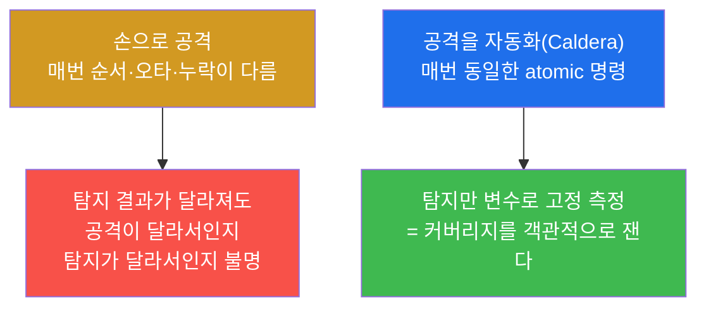
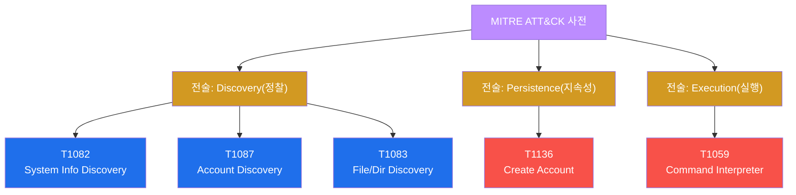
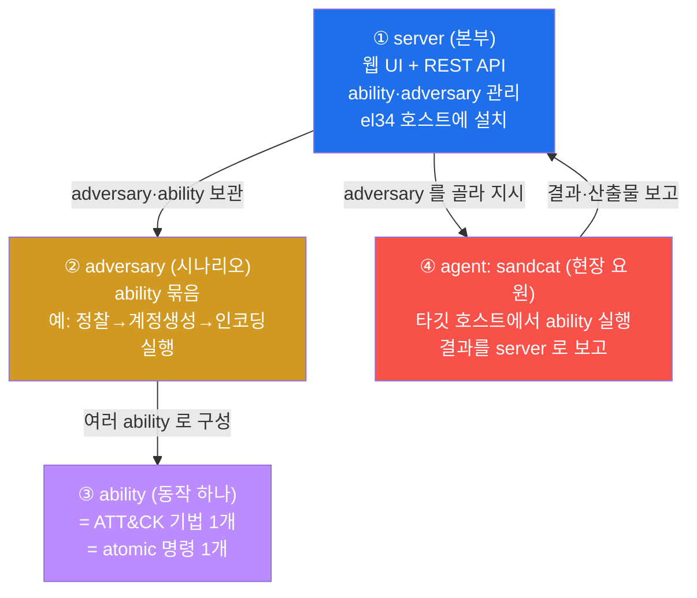
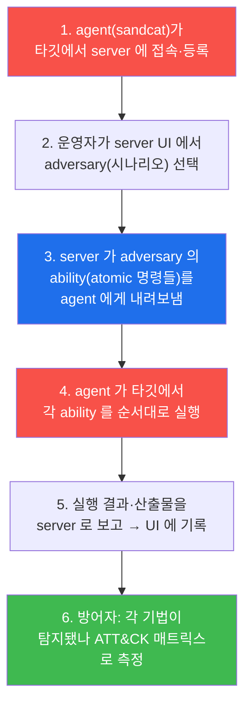
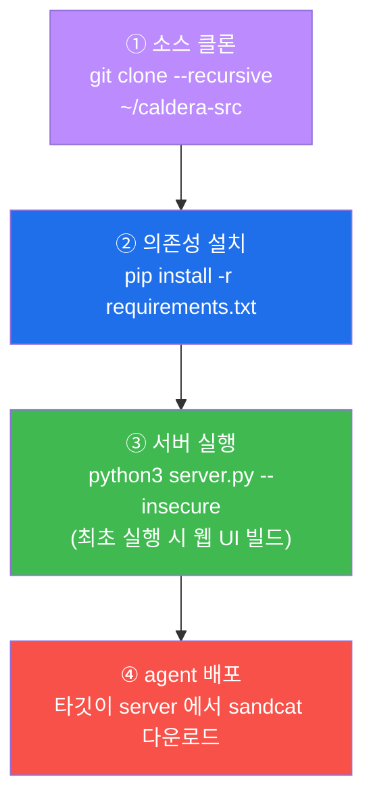
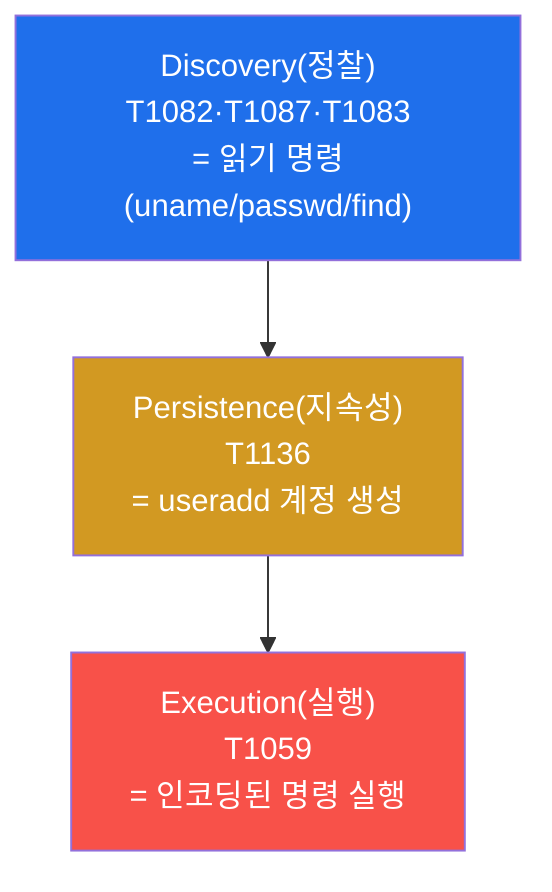
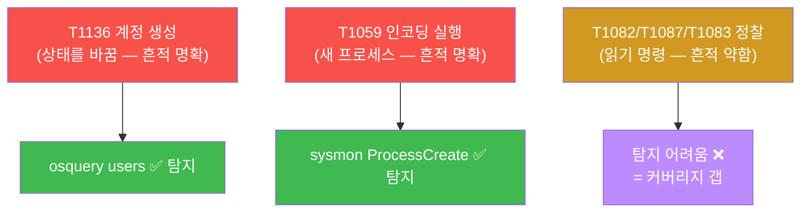
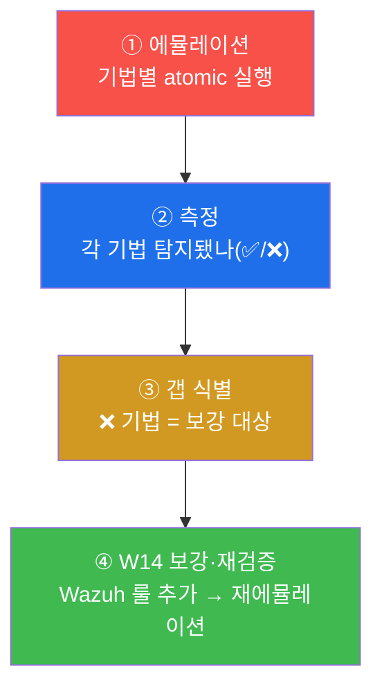
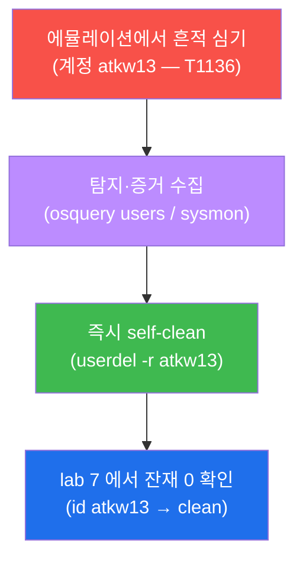
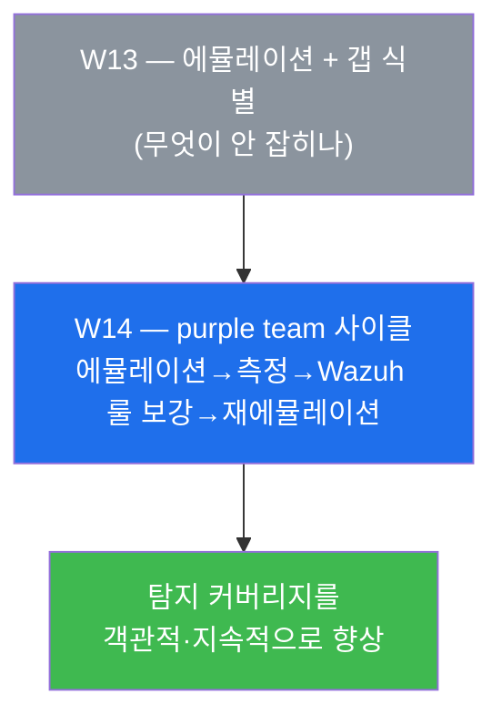

# 공격기법 W13 — 로봇 공격자: MITRE Caldera 로 ATT&CK 자동 에뮬레이션 vs 탐지·매핑 (1)

> **본 주차의 한 줄 요약**
>
> W01–W12 까지 학생은 정찰부터 권한 상승·지속성·은폐까지 **공격을 한 손 한 손 직접**
> 수행했다. 그러나 실전의 레드팀은 같은 공격을 **수십 번 똑같이 반복**해야 한다 — 탐지가
> 고쳐졌는지 객관적으로 재면서. 손으로 하면 매번 미묘하게 달라져 비교가 안 된다. 이번
> 주는 그 반복을 기계에 맡기는 도구 **MITRE Caldera** 를 만난다. Caldera 는 ATT&CK 기법을
> **자동으로 에뮬레이션(adversary emulation)** 하는 레드팀 프레임워크다. 학생은 Caldera 가
> 자동화하는 atomic 기법(정찰·지속성·실행)을 **손으로 한 번 실행해보고**, 그 각각이 방어
> 스택(Wazuh / sysmon / osquery)에 잡히는지 **탐지 커버리지**를 ATT&CK 기준으로 측정한다.
>
> **공격자 한 줄 결론**: 좋은 레드팀의 가치는 "한 번 셸을 땄다"가 아니라 **"같은 공격을
> 일관되게 반복해 방어의 빈틈(커버리지 갭)을 객관적으로 드러냈다"** 에 있다. Caldera 는 그
> 일관·반복을 자동화하는 도구이고, 이번 주는 그 자동화가 무엇을 자동화하는지를 손으로
> 먼저 이해한다. 자동화의 부품을 모르고 버튼만 누르면, 갭이 나와도 해석할 수 없다.

---

## 학습 목표

본 주차 종료 시 학생은 다음 6 가지를 **본인 손으로** 할 수 있어야 한다.

1. **adversary emulation(공격자 에뮬레이션)** 이 무엇이며, 무작정 공격(pentest)·취약점 스캔과
   어떻게 다른지를 "ATT&CK 기법을 일관·반복·자동으로 재현한다"는 한 문장으로 설명한다.
2. MITRE Caldera 의 4 구성요소 — **server / ability / adversary / agent(sandcat)** — 를 각각
   한 줄로 정의하고, 이들이 "ATT&CK 기법별 atomic 명령을 자동 실행"하는 하나의 파이프라인으로
   어떻게 이어지는지 그림으로 그린다.
3. el34 호스트에 Caldera 가 **왜·어떻게 설치되어 있는지**(`git clone --recursive`, `pip install`,
   `server.py --insecure`)를 이해하고, `--recursive` 가 없으면 왜 ability 가 비는지 설명한다.
4. ATT&CK 기법(T1082 / T1087 / T1083 정찰, T1136 지속성, T1059 실행)을 **atomic 명령**으로
   el34 위에서 직접 에뮬레이션하고, 각 기법의 ATT&CK ID 와 전술(tactic)을 말한다.
5. 에뮬레이션한 각 기법이 **어느 탐지 소스에 어떻게 잡히는가**(T1136=osquery, T1059=sysmon,
   discovery=시그니처 약함)를 매핑하고, **탐지 커버리지 갭**을 식별한다.
6. 위 모든 단계를 **증거(에뮬레이션 출력 / osquery·sysmon 탐지 결과)와 함께** ATT&CK
   에뮬레이션 보고서로 정리하고, 심은 흔적(계정)을 **self-clean** 으로 정리한다.

> **이번 주의 시선** — 본 주차는 새 취약점을 배우는 주가 아니다. 지금까지 배운 공격 기법들을
> **ATT&CK 이라는 공통 언어**로 분류하고, 그것을 **자동화·측정**의 대상으로 다시 보는 주다.
> 채점은 "기법을 실행했다"는 선언이 아니라, **각 기법을 올바른 atomic 명령으로 에뮬레이션하고
> 그것이 어느 탐지 소스에 잡히는지(또는 안 잡히는지)를 증거로 보였는가**를 본다.

---

## 0. 용어 해설 (이번 주 처음 나오는 핵심어)

본 주차에서 처음 등장하거나 의미를 분명히 해야 하는 용어를 먼저 정리한다. 본문에서 다시
나올 때 막히면 이 표로 돌아오면 흐름이 끊기지 않는다.

| 용어 | 영문 | 뜻 | 비유 |
|------|------|----|------|
| **MITRE ATT&CK** | Adversarial Tactics, Techniques & Common Knowledge | 실제 공격자가 쓰는 전술(tactic)·기법(technique)을 표준 ID 로 정리한 지식체계 | 공격 수법의 표준 분류 사전 |
| **전술 / 기법** | tactic / technique | 전술="왜(목표 단계, 예: 정찰)", 기법="어떻게(구체 수법, 예: T1087 계정 열거)" | 전술=작전 목표, 기법=그 작전의 구체 동작 |
| **기법 ID** | technique ID (T####) | ATT&CK 기법마다 붙은 고유 번호(예: T1059 명령 실행) | 사전의 표제어 번호 |
| **adversary emulation** | adversary emulation | 실제 공격자의 기법(TTPs)을 **그대로 흉내 내** 방어를 시험하는 행위 | 실제 도둑 수법을 그대로 재현하는 모의 침입 |
| **에뮬레이션 vs pentest** | — | 에뮬레이션=정해진 기법을 일관·반복 재현, pentest=취약점 탐색이 목적 | 정해진 시나리오 재현극 vs 자유 침투 시험 |
| **Caldera** | MITRE Caldera | ATT&CK 기법을 자동 에뮬레이션하는 오픈소스 레드팀 프레임워크 | 공격 자동화 로봇 + 관제판 |
| **server** | Caldera server | 웹 UI + REST API, ability·adversary 를 관리·지시하는 본부 | 작전 본부(관제실) |
| **ability** | ability | 단일 ATT&CK 기법 = 작은 atomic 명령 1개(예: T1087 = `cat /etc/passwd`) | 레시피 한 줄(동작 하나) |
| **adversary** | adversary (profile) | ability 여러 개를 순서로 묶은 공격 시나리오 | 레시피 묶음(코스 요리) |
| **agent** | agent | 타깃 호스트에서 ability 를 실제 실행하고 결과를 server 로 보고하는 프로그램 | 본부의 지시를 수행하는 현장 요원 |
| **sandcat** | sandcat | Caldera 의 기본 agent(Go 로 작성, 경량) | Caldera 의 표준 현장 요원 |
| **atomic 명령** | atomic command | 한 기법을 표현하는 가장 작은 단일 명령 | 분해 불가능한 동작 한 개 |
| **에뮬레이션 plan** | emulation plan | 특정 위협 그룹의 행위를 ATT&CK 순서로 정리한 시나리오 문서 | 특정 범죄조직 수법 재현 대본 |
| **커버리지 / 갭** | coverage / gap | 어떤 기법이 탐지되는가(coverage) / 안 되는가(gap) | 방어망의 촘촘함 / 뚫린 구멍 |
| **submodule** | git submodule | 한 git 저장소가 다른 저장소를 하위로 포함하는 구조 | 본 책 안에 끼워 넣은 별책 부록 |
| **self-clean** | — | 실습에서 심은 흔적(계정/룰)을 그 단계에서 스스로 정리 | 훈련 후 사격장 탄피 회수 |

> **헷갈리기 쉬운 한 쌍 — ability vs adversary.** 둘 다 Caldera 의 핵심 단어라 처음에는 헷갈린다.
> **ability 는 "동작 한 개"**(기법 하나 = atomic 명령 하나), **adversary 는 "동작들의 묶음"**(ability
> 여러 개를 순서로 엮은 시나리오)이다. 요리에 비유하면 ability 는 "양파를 썬다" 같은 단일 단계이고,
> adversary 는 "정찰 → 계정 생성 → 인코딩 실행"처럼 그 단계들을 순서대로 묶은 한 끼 레시피다. agent
> (sandcat)는 그 레시피를 받아 타깃 부엌에서 실제로 요리하는 요원이고, server 는 그 요원에게 레시피를
> 내려보내고 결과를 받아보는 본부다.

> **헷갈리기 쉬운 또 한 쌍 — 에뮬레이션 vs pentest.** W08 중간고사에서 한 것은 "입구를 찾아 셸까지
> 도달하는 경로(익스플로잇 체인)를 구성"하는 **pentest 적 사고**였다 — 목적은 "뚫리는가". 이번 주의
> **adversary emulation 은 목적이 다르다** — 이미 알려진 공격 기법들을 **정해진 대로 똑같이 재현**해서
> "이 기법이 우리 탐지에 잡히는가"를 재는 것이다. pentest 는 새 길을 찾고, 에뮬레이션은 정해진 길을
> 반복해 방어를 측정한다. 그래서 에뮬레이션은 **자동화**가 어울린다 — 매번 똑같아야 비교가 되니까.

---

## 1. 왜 공격을 자동화하나 — adversary emulation

### 1.1 한 줄 답: 손으로 하면 매번 달라져 "측정"이 안 된다

지금까지 학생은 정찰(W01–W02) · SQLi/XSS(W04–W05) · 접근제어/SSRF(W06–W07) · 권한 상승
(W11) · 지속성/은폐(W12)를 모두 **손으로** 수행했다. 학습에는 그것이 옳다 — 한 손 한 손
직접 해봐야 원리를 안다. 그러나 실전 레드팀의 일상은 다르다. 방어팀이 "탐지 룰을 고쳤다"고
하면 레드팀은 **같은 공격을 똑같이 다시** 쳐서 정말 잡히는지 확인해야 한다. 그것도 한 번이
아니라 룰을 고칠 때마다 수십 번.

손으로 하면 매번 미묘하게 달라진다 — 명령 순서가 바뀌고, 오타가 나고, 빠뜨린다. 그러면
"이번엔 잡혔는데 저번엔 왜 안 잡혔지?"가 공격이 달라서인지 탐지가 달라서인지 구분이 안
된다. **측정의 기본은 "변수를 하나만 바꾸는 것"** 이다. 공격을 고정(자동화)해야 탐지의
변화를 잴 수 있다. 그래서 공격을 자동화한다.



### 1.2 adversary emulation 이란 — "실제 수법을 그대로 흉내 낸다"

**한 줄 정의.** adversary emulation(공격자 에뮬레이션)은 **실제 공격자가 쓰는 기법(TTPs)을
그대로 재현**해 우리 방어가 그것을 막거나 탐지하는지 시험하는 활동이다. 핵심 단어는 "그대로"
와 "재현"이다 — 새로운 취약점을 찾는 것이 목적이 아니라, **이미 알려진 공격 행위를 똑같이
반복**하는 것이 목적이다.

이것이 일반적인 침투 테스트(pentest)·취약점 스캔과 다른 점이다.

| 활동 | 목적 | 비유 |
|------|------|------|
| **취약점 스캔** | "어디에 알려진 취약점이 있나" 자동 점검 | 건물의 잠기지 않은 문 자동 점검 |
| **pentest(침투)** | "뚫리는가" — 새 침투 경로 탐색 | 침입 전문가가 자유롭게 침투 시도 |
| **adversary emulation** | "이 알려진 수법이 탐지되는가" — 정해진 기법 재현 | 특정 도둑의 수법을 그대로 재연해 경보를 시험 |

> **용어 — TTPs.** Tactics(전술) · Techniques(기법) · Procedures(절차)의 약자다. 공격자가 "무엇을
> 노리고(전술), 어떤 수법으로(기법), 구체적으로 어떻게(절차)" 행동하는지를 가리킨다. 에뮬레이션은 이
> TTPs 를 그대로 흉내 낸다.

### 1.3 ATT&CK — 에뮬레이션의 공통 언어

에뮬레이션이 "정해진 기법을 재현"하는 것이라면, 그 "기법"의 목록과 이름은 어디서 오는가?
**MITRE ATT&CK** 프레임워크다.

**한 줄 정의.** MITRE ATT&CK 은 실제 침해 사고에서 관찰된 공격자의 **전술(tactic)과
기법(technique)을 표준 ID 로 정리한 지식 사전**이다. 예를 들어 "계정 정보를 캐는 행위"는
어느 회사·어느 도구가 하든 똑같이 **T1087 (Account Discovery)** 라는 한 ID 로 부른다.

ATT&CK 의 두 축을 구분하는 것이 중요하다.

- **전술(tactic)** = "왜 / 어느 단계" — 공격의 목표 단계다. 예: Discovery(정찰),
  Persistence(지속성), Execution(실행), Privilege Escalation(권한 상승).
- **기법(technique, T####)** = "어떻게" — 그 단계를 이루는 구체적 수법이다. 예: 같은
  Discovery 전술 안에 T1082(System Info), T1087(Account), T1083(File/Dir Discovery)가 있다.



**왜 ATT&CK 이 에뮬레이션에 필수인가.** 공격과 방어가 **같은 단어**를 써야 측정이 가능하기
때문이다. 레드팀이 "T1059 를 쳤다"고 하면, 블루팀은 "우리 sysmon 룰이 T1059 를 잡는가"로
정확히 대응할 수 있다. ATT&CK 이 없으면 "인코딩된 명령을 실행했어요" vs "이상한 프로세스가
떴는데요"처럼 서로 다른 말을 하다가 매핑에 실패한다. ATT&CK 은 공격–방어의 **공통 좌표계**다.

> **위 그림과 본 트랙의 연결.** 학생은 이미 이 기법들을 손으로 해봤다 — W12 에서 백도어 계정
> (T1136)·cron 지속성을, W11 권한 상승 과정에서 다양한 정찰을. 이번 주가 새로운 점은 그 행위들에
> **ATT&CK ID 라는 이름표를 붙이고**, 그 이름표 단위로 자동화·측정한다는 것이다.

### 1.4 한계 — 에뮬레이션이 답하지 못하는 것

에뮬레이션은 **"알려진 기법이 탐지되는가"** 를 잰다. 따라서 다음은 에뮬레이션의 범위 밖이다.

- **새로운(0-day) 공격 발견** — 에뮬레이션은 이미 알려진 ATT&CK 기법을 재현할 뿐, 새 취약점을
  찾지 않는다. 그것은 pentest·연구의 몫이다.
- **탐지 갭의 자동 해결** — 에뮬레이션은 갭을 **드러내기만** 한다. 그 갭을 메우는 룰 작성과
  재검증은 다음 주(W14)의 purple team 사이클이다.
- **실제 피해 입증** — 본 트랙의 실습은 atomic 기법을 **읽기/생성 수준**까지만 수행하고(실제
  데이터 탈취·파괴는 하지 않는다), 공유 인프라이므로 흔적을 즉시 정리한다.

---

## 2. MITRE Caldera 구조 — 자동화가 무엇을 자동화하나

이제 ATT&CK 기법을 **자동으로** 에뮬레이션하는 도구, Caldera 를 본다. Caldera 는 MITRE 가
직접 만든 오픈소스 레드팀 프레임워크다. 결국 하는 일은 한 줄로 요약된다 — **ATT&CK 기법별
atomic 명령을 agent 에게 자동 실행시키고 결과를 모은다**. W11–W12 에서 학생이 손으로 친
명령들을, 사람 대신 프로그램이 일관·반복·자동으로 친다고 보면 정확하다.

### 2.1 4 구성요소 — server / ability / adversary / agent

Caldera 를 이해하는 가장 좋은 방법은 4 개의 구성요소를 "본부–레시피–요원" 구조로 보는
것이다.



- **server** — 웹 UI 와 REST API 를 제공하는 본부다. 운영자가 여기서 adversary 를 고르고,
  연결된 agent 에게 작전을 지시하며, 결과를 본다. el34 에서는 **호스트(192.168.0.80)에 직접
  설치**되어 있다(컨테이너가 아니다 — §2.3).
- **ability** — 단일 ATT&CK 기법을 표현하는 가장 작은 동작이다. 예컨대 T1087(계정 열거) ability
  의 Linux 명령은 `cat /etc/passwd` 한 줄이다. ability 하나 = 기법 하나 = atomic 명령 하나라고
  외우면 된다.
- **adversary** — ability 여러 개를 순서로 묶은 공격 시나리오(profile)다. "정찰 → 계정 생성 →
  인코딩 실행"처럼 한 침입자의 행동 패턴을 표현한다. 특정 위협 그룹(예: 알려진 APT)의
  **에뮬레이션 plan** 을 adversary 로 구성할 수도 있다.
- **agent — sandcat** — 타깃 호스트에서 ability 를 실제로 실행하고 결과를 server 로 돌려주는
  현장 요원 프로그램이다. Caldera 의 기본 agent 가 sandcat(Go 로 작성된 경량 바이너리)이다.
  agent 가 타깃에 있어야 server 의 지시가 그 호스트에서 실행된다.

### 2.2 한 번의 자동화가 어떻게 흐르는가

위 4 요소가 실제 작전 한 번에서 어떻게 맞물리는지를 순서로 보면 자동화의 정체가 분명해진다.



핵심은 4 단계다 — **agent 가 atomic 명령을 자동 실행**한다. 즉 W11–W12 에서 학생이 키보드로
친 `cat /etc/passwd`, `useradd`, 인코딩 실행 같은 명령을, sandcat 이 server 의 지시에 따라
사람 없이 순서대로 친다. 그래서 같은 작전을 100 번 돌려도 100 번 동일하다 — 이것이 "측정
가능한 공격"의 정체다(§1.1).

> **본 lab 의 범위 — 왜 agent 풀 운영이 아니라 atomic 수동 실행인가.** Caldera 의 server·agent 풀
> 운영(웹 UI 에서 작전을 돌리는 것)은 별도 환경·시간이 필요하고, 여러 학생이 공유하는 el34 에서 동시에
> 돌리면 충돌·잔재가 생긴다. 그래서 본 주차 lab 은 Caldera 가 **자동화하는 atomic 기법을 학생이 손으로
> 한 번씩 실행**해 **그 기법이 어떤 명령이고 어떻게 탐지되는지를 먼저 이해**하는 데 집중한다. 자동화의
> 부품(atomic 명령과 탐지)을 손으로 익혀야, 나중에 Caldera UI 에서 작전을 돌렸을 때 결과를 해석할 수
> 있다. server 는 호스트에 설치되어 있으므로(§2.3) 관심 있는 학생은 UI 를 띄워 구조를 직접 확인할 수
> 있다.

### 2.3 el34 의 Caldera 설치 해부 — "왜 갑자기 이 도구가 나왔나"

Caldera 는 el34 인프라에 **원래 없던 도구**다. el34 의 41 개 컨테이너(fw / ips / web / siem /
취약앱 등)는 방어 스택과 공격 대상으로 구성되어 있을 뿐, 공격 자동화 도구는 포함하지 않았다.
이번 주를 위해 Caldera 를 **el34 호스트(192.168.0.80)에 직접 설치**했다 — 컨테이너 안이
아니라 호스트 OS 위에 둔 것은, Caldera 가 el34 의 보안 컨테이너들을 타깃으로 삼는 "외부의
공격 본부" 역할이기 때문이다. 학생이 "이 도구가 어디서 갑자기 나왔지?"라고 묻지 않도록, 설치
과정을 그대로 해부한다.



설치 명령은 다음과 같다(호스트, root 기준).

```bash
# ① 소스 클론 — --recursive 가 핵심(아래 설명)
git clone https://github.com/mitre/caldera.git --recursive ~/caldera-src

# ② Python 의존성 설치 (pip 없으면: apt-get install -y python3-pip)
cd ~/caldera-src && python3 -m pip install -r requirements.txt

# ③ 서버 실행 — 웹 UI + REST API (기본 8888 포트, conf/default.yml 로 설정)
python3 server.py --insecure
```

각 단계가 왜 그렇게 되어 있는지를 학생이 이해해야 한다.

- **`--recursive` 가 왜 결정적인가.** Caldera 의 본체 저장소는 비어 있다시피 하고, 실제 공격
  내용물은 **git submodule(별책 부록)** 로 따로 들어 있다. 대표적으로 **stockpile**(수많은
  ability 가 담긴 기본 라이브러리)과 **sandcat**(agent) 이 submodule 이다. `git clone` 만 하면
  본체만 받고 이 submodule 들이 **빈 채로** 남아 — 결과적으로 **ability 가 하나도 없고 agent 도
  없는** 껍데기가 된다. `--recursive` 를 붙여야 submodule 까지 함께 받아 ability 라이브러리와
  agent 가 채워진다. 즉 `--recursive` 누락은 "공격 도구를 깔았는데 정작 공격 내용이 없다"는
  전형적 함정이다.
- **`--insecure` 는 무엇인가.** 운영용 TLS 인증서·보안 설정 없이 **기본 설정(`conf/default.yml`)
  으로 빠르게 띄우는** 실습용 플래그다. 실습 환경(el34, 격리망)에서 빠른 기동을 위한 것이며,
  실제 운영 서버라면 인증서·접근 통제를 갖춰야 한다.
- **`server.py` 최초 실행 시 UI 빌드.** 처음 띄울 때 웹 UI 정적 자원을 빌드한다. 이 과정에
  node 가 필요할 수 있고, 소스 클론·pip 설치에는 호스트의 **인터넷 접근(GitHub + PyPI)** 이
  필요하다 — 그래서 Caldera 는 격리된 컨테이너가 아니라 인터넷이 닿는 호스트에 설치되었다.
- **agent(sandcat) 배포 개념.** server 가 뜨면, 타깃 호스트가 `http://<server>:8888/file/download`
  로 sandcat 바이너리를 받아 실행하는 것이 표준 흐름이다. 그러면 그 타깃이 server 에 등록되고,
  server 의 지시(ability)를 그 호스트에서 수행한다(§2.2의 1단계).

> **el34 사실 정리(지어내지 말 것).** el34 호스트의 `~/caldera-src` 에 Caldera 가 설치되어 있고,
> 진입점은 `server.py`(`--insecure` 로 기동), ability 라이브러리는 stockpile, agent 는 sandcat 이다.
> 본 lab 1(점검)에서 `ls ~/caldera-src/server.py` 로 설치 사실을, lab 7 에서 `plugins` 등 구조를
> 확인한다. 본 lab 은 server·agent 풀을 직접 돌리지 않고(§2.2 참고), Caldera 가 자동화하는 atomic
> 기법을 손으로 실행한다.

---

## 3. ATT&CK 기법 = atomic 명령 — 본 주차에서 에뮬레이션할 5 기법

Caldera 의 ability(그리고 자매 프로젝트 Atomic Red Team)는 각 ATT&CK 기법을 **작은 명령
하나**로 정의한다. 본 주차 lab 에서 손으로 에뮬레이션할 기법과 그 atomic 명령(Linux)은
다음과 같다. 이 표가 lab 2–4 의 지도다.

| 전술(tactic) | 기법 ID | 기법 이름 | atomic 명령 (Linux) | 본 트랙 연결 |
|--------------|---------|-----------|---------------------|--------------|
| Discovery | **T1082** | System Info Discovery | `uname -a; cat /etc/os-release` | W11 열거 |
| Discovery | **T1087** | Account Discovery | `cat /etc/passwd` | W12 헌팅 대상 |
| Discovery | **T1083** | File/Directory Discovery | `find / -name "*.conf"` | W07 LFI 정찰 |
| Persistence | **T1136** | Create Account | `useradd backdoor` | W12 백도어 계정 |
| Execution | **T1059** | Command & Scripting Interpreter | `bash -c '...'` / 인코딩 명령 | W11–W12 실행 |

이 atomic 명령들을 순서로 묶으면 그것이 곧 하나의 **adversary(시나리오)** 이고, agent 가 그
순서대로 자동 실행하면 그것이 **에뮬레이션**이다. 방어자는 각 기법이 실행된 직후, 그 기법이
탐지됐는지를 본다(§4).



> **왜 이 순서(정찰 → 지속성 → 실행)인가.** 실제 공격자의 행동 순서를 축약한 것이다 — 먼저 환경을
> 파악하고(정찰), 발판을 굳히고(지속성), 명령을 실행한다. 본 lab 은 이 세 전술을 대표 기법으로 하나씩
> 짚어 "전술마다 탐지 난이도가 다르다"(§4)는 핵심 교훈으로 이어진다.

---

## 4. 탐지 커버리지 매핑 — 방어자의 측정

에뮬레이션의 목적은 공격 자체가 아니라 **"이 기법이 잡히는가"** 의 측정이다(§1.1). 각 ATT&CK
기법을 실행한 뒤, 그 기법이 어느 탐지 소스에 어떻게 잡히는지(또는 안 잡히는지)를 매핑한다.
이때 방어 도구는 학생이 이미 배운 것들이다.

- **osquery**(W06·W12) — OS 를 SQL 테이블로 질의하는 호스트 가시화 도구. 예: `SELECT username
  FROM users WHERE username='atkw13';` 로 새로 생긴 계정(T1136)을 확인한다.
- **sysmon for Linux**(W11 맥락) — process create / network / file 이벤트를 stream 으로 남기는
  도구. 인코딩 명령 실행(T1059)이 새 프로세스로 뜨는 것을 잡는다(`Linux-Sysmon` 로그).
- **Wazuh**(W09–W10) — 중앙 SIEM. agent 들이 올린 로그를 룰로 평가해 경보를 만든다(FIM 으로
  계정 파일 변경 등).

### 4.1 기법마다 탐지 난이도가 다르다 — 핵심 교훈

같은 "공격"이라도 전술에 따라 탐지가 쉽기도 어렵기도 하다. 이것이 본 주차에서 학생이 얻어야
할 가장 중요한 통찰이다.



- **T1136(계정 생성)과 T1059(인코딩 실행)는 잘 잡힌다.** 둘 다 시스템의 **상태를 바꾸기**
  때문이다 — 계정 생성은 `/etc/passwd` 와 users 테이블에 새 항목을 남기고(osquery·FIM 이
  포착), 인코딩 명령 실행은 새 프로세스를 띄운다(sysmon 의 process create 가 포착). 상태
  변화는 명확한 흔적이라 탐지 시그니처를 걸기 쉽다.
- **Discovery 계열(T1082/T1087/T1083)은 잡기 어렵다.** 이들은 대개 `uname`·`cat`·`find` 같은
  **읽기 명령**이라 시스템 상태를 바꾸지 않는다. 게다가 이 명령들은 정상 운영에서도 늘 쓰여
  "정상과 구별되는 시그니처"를 만들기 어렵다. 그래서 단순 시그니처로는 **갭(❌)** 이 생긴다 —
  정찰을 잡으려면 "짧은 시간에 정찰 명령이 비정상적으로 몰리는" 같은 **행위 기반(baseline 이상)
  탐지**가 필요하다(W14 의 보강 주제).

### 4.2 갭은 보강의 출발점이다

탐지 매트릭스에서 ❌ 로 남은 기법이 곧 **커버리지 갭**이며, 이는 W14 에서 메울 대상이다.
에뮬레이션의 진짜 가치가 여기 있다 — **"무엇이 안 잡히는지"를 객관적으로 드러내** 방어 개선의
우선순위를 정해 준다. 손으로 한 번 공격해서는 "운 좋게 잡혔다/안 잡혔다"로 끝나지만, 자동화된
일관 에뮬레이션은 "이 기법은 구조적으로 안 잡힌다"를 반복 가능하게 증명한다.



---

## 5. 판단 프레임워크 — "어느 기법을 어느 atomic 으로, 어디서 탐지"

본 주차의 핵심 능력은 **각 ATT&CK 기법에 대해 (1) 어떤 atomic 명령으로 에뮬레이션하고 (2) 어느
탐지 소스에 잡히는가(또는 갭인가)** 를 즉시 말하는 것이다. 다음 표가 그 판단의 정답지다.

| 전술 | 기법 | atomic 명령(에뮬레이션) | 탐지 소스 | 결과 |
|------|------|------------------------|-----------|------|
| Discovery | T1082 System Info | `uname -a` | (읽기 — 시그니처 약함) | ❌ 갭 |
| Discovery | T1087 Account | `cat /etc/passwd` | (읽기 — 시그니처 약함) | ❌ 갭 |
| Discovery | T1083 File/Dir | `find /etc -name "*.conf"` | (읽기 — 시그니처 약함) | ❌ 갭 |
| Persistence | T1136 Create Account | `useradd atkw13` | osquery users / FIM | ✅ 탐지 |
| Execution | T1059 Interpreter | 인코딩 명령(`b64decode`) | sysmon ProcessCreate | ✅ 탐지 |

이 표를 두 방향으로 읽는다. **"무엇으로 에뮬레이션하나"** — 전술별 대표 기법의 atomic 명령.
그리고 **"어떤 흔적을 남기나"** — 상태를 바꾸는 기법(T1136·T1059)은 명확한 탐지, 읽기 기법
(discovery)은 갭. 학생이 두 방향을 모두 말할 수 있으면 "자기 공격이 어떻게 보이는지 아는 좋은
공격자"이자 "무엇이 안 잡히는지 아는 좋은 측정자"가 된 것이다.

> **이번 주의 채점 포인트.** 각 기법을 올바른 atomic 명령으로 에뮬레이션하고, 그 기법이 어느 소스에
> 잡히는지(또는 갭인지)를 **증거(에뮬레이션 출력 / osquery·sysmon 결과)와 함께** 제시하며, 마지막에
> Caldera 의 자동화 구조(server/ability/adversary/agent)를 설명하는 것. "실행했다"는 선언이 아니라
> **증거와 매핑**이 점수다. 합격 임계값은 0.7 이다.

---

## 6. 인가된 실습 + 공유 인프라 보존

이 트랙은 공격을 다루므로 윤리 규정이 특히 엄격하다. el34 는 여러 학생이 함께 쓰는 공유
인프라이므로 다음 수칙을 반드시 지킨다.

- ⚠️ **인가된 실습만.** 모든 에뮬레이션은 인가된 실습 환경(el34) 안에서만 수행한다. 실제 외부
  시스템을 대상으로 한 ATT&CK 기법 실행은 불법이며 본 과정의 윤리 규정을 위반한다.
- **baseline 을 바꾸지 말 것.** Wazuh 룰, sysmon 설정, 정상 계정·서비스는 점검만 하고 바꾸지
  않는다(룰 보강은 W14 의 통제된 범위에서 한다).
- **심은 흔적은 내가 정리(self-clean).** 에뮬레이션으로 만든 계정(`atkw13`)은 `userdel -r` 로
  즉시 정리한다. 본 lab 의 정찰·실행 기법은 읽기/일시 실행이라 별도 잔재가 없다.
- **네임스페이스를 지킨다.** 본 주차의 흔적 계정명은 `atkw13` 으로 고정해 다른 학생·주차와
  겹치지 않게 한다.
- **증거 우선.** "기법을 실행했다"가 아니라 **에뮬레이션 출력 + 탐지 결과(osquery/sysmon)** 를
  제시해야 점수다.



---

## 7. 실습 안내 — ATT&CK 에뮬레이션 lab 8 미션 (4 축 설명)

본 주차 실습은 8 미션으로 구성된다. 각 미션을 **4 축**으로 설명한다 — 왜 하는가 / 무엇을 알 수
있는가 / 결과 해석(정상 vs 비정상) / 실전 활용. 미션은 점검 → discovery 에뮬레이션 →
persistence → execution → 탐지 매핑 → 커버리지 갭 → Caldera 구조 이해·정리 → 보고서 순서로
흐른다.

> **실습 진행 원칙.** 모든 명령은 el34 호스트(`ssh ccc@192.168.0.80`, 비밀번호 `1`)에서 실행한다.
> Wazuh 확인은 `ssh ccc@10.20.32.100`(SIEM), 에뮬레이션·탐지는 표적 web `ssh ccc@10.20.32.80` 로 한다.
> **인가된 실습 환경(el34)에서만** 수행하며, 계정 흔적은 self-clean 한다. 합격 임계값은 0.7 이다.

### 미션 1 — 점검: Caldera + Wazuh (10점, survey)

> **왜 하는가?** 에뮬레이션의 전제는 두 가지다 — 공격 자동화 도구(Caldera)가 설치되어 있고,
> 측정용 방어(Wazuh)가 살아 있어야 한다. 본격 작업 전 이 둘을 먼저 확인한다.
>
> **무엇을 알 수 있는가?** 호스트의 `~/caldera-src/server.py` 가 존재하는지(=Caldera 설치 사실,
> §2.3)와, Wazuh 의 핵심 데몬 `analysisd`(로그를 룰로 평가하는 두뇌)가 가동 중인지.
>
> **결과 해석.** 정상: 출력에 `caldera`(설치됨)가 보이고 `analysisd` 가 running. 비정상: Caldera
> 경로가 없으면 §2.3 설치가 안 된 것, analysisd 가 죽었으면 탐지 측정이 불가하니 먼저 원인을 본다.
>
> **실전 활용.** 에뮬레이션 착수 전 "공격 도구 + 측정 수단" 가용성 점검 — 측정 도구가 죽어 있으면
> 에뮬레이션 결과(탐지됨/안 됨)를 신뢰할 수 없다.

### 미션 2 — 에뮬레이션 ① Discovery: T1082/T1087/T1083 (12점, recon)

> **왜 하는가?** 공격의 첫 전술인 정찰(Discovery)을 atomic 명령으로 직접 에뮬레이션해, Caldera
> ability 가 자동화하는 "환경 파악" 기법이 어떤 명령인지 손으로 익힌다.
>
> **무엇을 알 수 있는가?** T1082(시스템 정보=`uname -a`)·T1087(계정=`/etc/passwd`)·T1083(파일
> =`find ... *.conf`) 세 기법을 한 번에 에뮬레이션하는 법. 이 셋이 모두 **읽기 명령**이라는 공통점.
>
> **결과 해석.** 정상: 출력에 `T1082` 등 각 기법 표지와 함께 시스템 정보·계정·설정 파일 목록이 보임.
> 핵심 깨달음 — 정찰은 시스템을 바꾸지 않는 읽기라, 나중에(미션 6) 탐지가 어렵다는 복선이 된다.
>
> **실전 활용.** 모든 침해의 출발점인 정찰을 ATT&CK ID 단위로 식별·실행하는 능력. 에뮬레이션 plan 의
> 첫 블록.

### 미션 3 — 에뮬레이션 ② Persistence: T1136 (12점, manipulation)

> **왜 하는가?** 지속성(Persistence)의 대표 기법인 계정 생성(T1136)을 에뮬레이션해, 공격자가 발판을
> 굳히는 동작을 ATT&CK 기준으로 재현한다(W12 백도어 계정의 ATT&CK 이름표).
>
> **무엇을 알 수 있는가?** `useradd` 로 `atkw13` 계정을 만드는 것이 T1136 atomic 이라는 것. Caldera
> persistence ability 가 자동화하는 것이 이런 "계정/cron/키" 생성 동작이라는 것.
>
> **결과 해석.** 정상: `[T1136] account ... created` 출력. 이 계정은 시스템 **상태를 바꾸므로** 미션
> 5 에서 osquery 에 명확히 잡힌다(상태 변화 = 탐지 용이의 예고). 비정상: 권한 문제로 생성 실패 시
> 컨테이너 컨텍스트를 확인한다.
>
> **실전 활용.** 지속성 기법을 ATT&CK 단위로 재현해 "이 발판이 탐지되는가"를 측정하는 표준 절차.

### 미션 4 — 에뮬레이션 ③ Execution: T1059 인코딩 (12점, manipulation)

> **왜 하는가?** 실행(Execution)의 대표 기법인 명령 인터프리터(T1059)를 인코딩된 형태로 에뮬레이션해,
> 공격자가 명령을 난독화해 실행하는 동작을 재현한다.
>
> **무엇을 알 수 있는가?** base64 로 인코딩된 명령을 디코드·실행하는 것이 T1059 atomic 의 한 형태라는
> 것. 인코딩은 단순 시그니처를 피하려는 시도이지만, **새 프로세스가 뜨는 행위 자체**는 sysmon 이 잡는
> 다는 것(미션 5 예고).
>
> **결과 해석.** 정상: `[T1059] encoded ... executed` 출력. 핵심 — 인코딩으로 "무엇을" 실행했는지는
> 가렸어도 "프로세스를 실행했다"는 흔적은 남는다(상태 변화 = 탐지 용이).
>
> **실전 활용.** 난독화 실행 기법의 재현과, 그것이 프로세스 생성 탐지에 잡히는지 검증하는 작업.

### 미션 5 — 탐지 매핑: 기법별 탐지 소스 (14점, analysis)

> **왜 하는가?** 에뮬레이션의 목적인 "측정"의 핵심 단계 — 실행한 각 기법이 **어느 탐지 소스에
> 잡히는가**를 매핑한다. 공격과 탐지를 ATT&CK 으로 잇는 종합 사고다.
>
> **무엇을 알 수 있는가?** T1136(계정)은 **osquery 의 users 테이블**에, T1059(인코딩 실행)는
> **sysmon 의 ProcessCreate(`Linux-Sysmon`/`b64decode`)** 에 잡힌다는 것. 같은 공격을 다른 소스가
> 다른 단서로 본다는 교차.
>
> **결과 해석.** 정상: osquery 결과에 `atkw13` 계정이, sysmon 로그에 인코딩 실행 흔적이 보임. 비정상:
> 한쪽이 안 잡히면 해당 탐지 소스(osquery/sysmon)의 가동 상태를 점검한다.
>
> **실전 활용.** ATT&CK 기법을 탐지 소스에 매핑하는 것은 SOC/purple team 의 핵심 작업 — "이 기법은
> 무엇으로 잡는가"의 대장(臺帳)을 만드는 일이다.

### 미션 6 — 커버리지 갭 식별 (12점, analysis)

> **왜 하는가?** 종합 사고의 정점 — 탐지된 기법(✅)과 안 된 기법(❌=갭)을 구분해, 방어 개선의
> 우선순위를 드러낸다. 에뮬레이션의 진짜 산출물이 이 갭이다(§4.2).
>
> **무엇을 알 수 있는가?** T1136·T1059 는 상태를 바꿔 잘 잡히지만, discovery(T1082/T1087/T1083)는
> 읽기 명령이라 시그니처가 약해 **갭**이라는 것. 전술마다 탐지 난이도가 다르다는 핵심 교훈.
>
> **결과 해석.** 정상: 출력에 탐지(✅)와 `갭`(❌)이 명확히 구분되고, discovery 가 갭으로 분류됨. 핵심 —
> 갭은 "탐지 실패"가 아니라 "다음에 메울 곳"이다(W14).
>
> **실전 활용.** 커버리지 매트릭스로 방어 투자 우선순위를 정하는 것 — 한정된 자원을 "안 잡히는 기법"에
> 먼저 쓰게 해 주는 객관적 근거.

### 미션 7 — Caldera 자동화 이해 + 정리 (12점, cleanup)

> **왜 하는가?** 본 주차의 두 마무리를 한 번에 한다 — Caldera 의 자동화 **구조를 설명**할 수 있는지,
> 그리고 심은 흔적(`atkw13`)을 **정리**했는지.
>
> **무엇을 알 수 있는가?** server(본부) → adversary(시나리오) → ability(동작) → agent(sandcat, 현장
> 요원)로 이어지는 자동화 구조와, 호스트 `~/caldera-src` 의 실제 구성(`server.py`·`plugins` 등)을
> 확인하는 법. 그리고 `userdel -r` 로 계정 잔재를 0 으로 만드는 self-clean.
>
> **결과 해석.** 정상: Caldera 구조 설명 + `~/caldera-src` 구성 확인 + `clean`(계정 잔재 없음) 출력.
> 비정상: `id atkw13` 가 계정을 보이면 정리 명령을 다시 실행한다.
>
> **실전 활용.** 자동화 도구의 구조를 설명할 수 있어야 결과를 해석할 수 있다(부품을 알아야 한다, §2.2).
> 그리고 훈련 환경의 변경분(심은 계정)을 추적·원복하는 변경 관리 규율.

### 미션 8 — ATT&CK 에뮬레이션 보고서 (10점, report)

> **왜 하는가?** 미션 1–7 을 ATT&CK 기준으로 정리해, 에뮬레이션의 결론(무엇을 재현했고 무엇이
> 갭인가)을 문서로 입증한다.
>
> **무엇을 알 수 있는가?** 에뮬레이션 기법(discovery/persistence/execution) → 탐지 매핑(기법→소스) →
> 커버리지 갭 → Caldera 자동화를 한 보고서로 종합하는 법. 에뮬레이션 보고서의 표준 구조.
>
> **결과 해석.** 정상: 보고서에 네 요소(에뮬레이션·매핑·갭·Caldera)가 모두 포함됨. 핵심 결론 — 자동
> 에뮬레이션으로 탐지 커버리지를 객관 측정했고, 갭은 W14 에서 메운다.
>
> **실전 활용.** purple team 활동의 표준 산출물 — "무엇을 에뮬레이션했고, 무엇이 잡혔고, 무엇이 갭인가"를
> 의사결정자에게 전달하는 문서다.

---

## 8. 핵심 정리 (1줄씩)

1. **왜 자동화하나** — 손으로 하면 매번 달라져 측정이 안 된다. 공격을 고정해야 탐지의 변화를
   잰다(§1.1).
2. **adversary emulation** — 새 취약점 탐색이 아니라 **알려진 ATT&CK 기법을 그대로 재현**해
   방어를 시험하는 활동(§1.2).
3. **ATT&CK** — 공격–방어의 공통 좌표계. 전술(왜) + 기법(어떻게, T####)으로 행위를 표준 분류
   (§1.3).
4. **Caldera 4 요소** — server(본부) · ability(동작=기법) · adversary(시나리오=묶음) ·
   agent/sandcat(현장 요원). atomic 명령을 자동 실행(§2.1–2.2).
5. **el34 설치** — `~/caldera-src` 에 설치. `--recursive` 가 없으면 ability(stockpile)·agent
   (sandcat) submodule 이 비어 껍데기가 된다(§2.3).
6. **탐지 난이도 차이** — 상태를 바꾸는 T1136(osquery)·T1059(sysmon)는 잘 잡히고, 읽기 기반
   discovery 는 갭(§4.1).
7. **갭 = 보강 출발점** — 에뮬레이션의 산출물은 "무엇이 안 잡히나"이며, 이것이 W14 보강의
   대상(§4.2).
8. **윤리** — 인가된 el34 안에서만. 흔적(`atkw13`)은 self-clean, 네임스페이스 고정(§6).

---

## 9. 다음 주차 (W14) 예고 — 레드와 블루가 함께(purple team)

이번 주는 에뮬레이션으로 **갭을 찾는 것**까지였다. W14 는 그 갭을 **메우고 다시 검증**한다 —
Caldera 로 ATT&CK 을 에뮬레이션(레드)하고, 안 잡힌 갭을 Wazuh 룰로 보강(블루)하고, **같은
기법을 다시 에뮬레이션**해 이제 잡히는지(❌→✅) 재검증한다. 이 반복이 **purple team** 사이클이며,
탐지 커버리지를 객관적·지속적으로 끌어올린다. 핵심 정신은 한 문장이다 — **"고쳤다고 믿지 말고,
다시 공격해 확인하라."**


