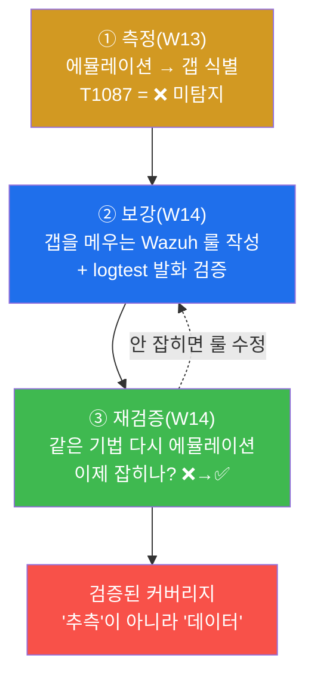
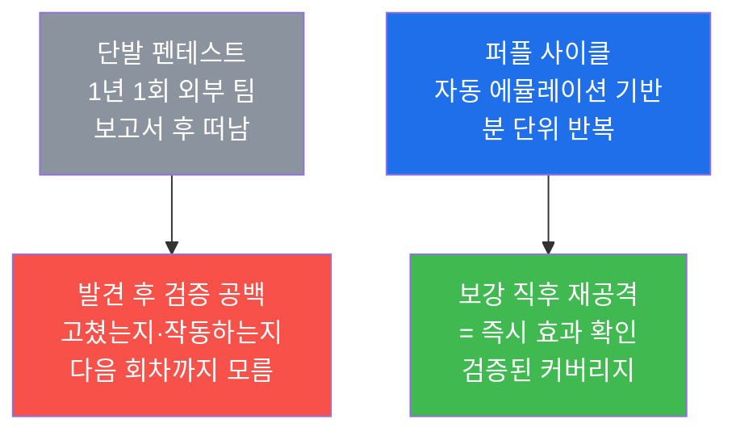
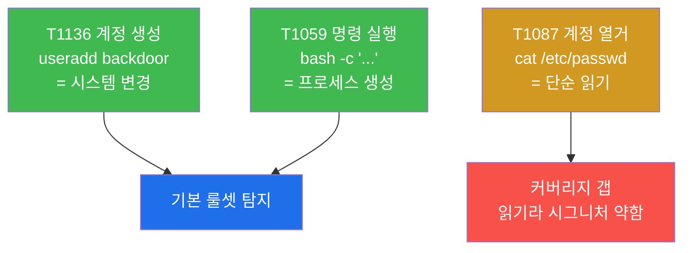
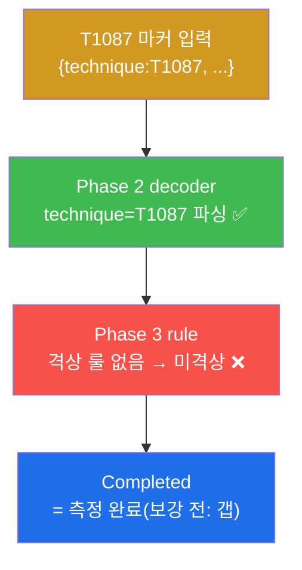
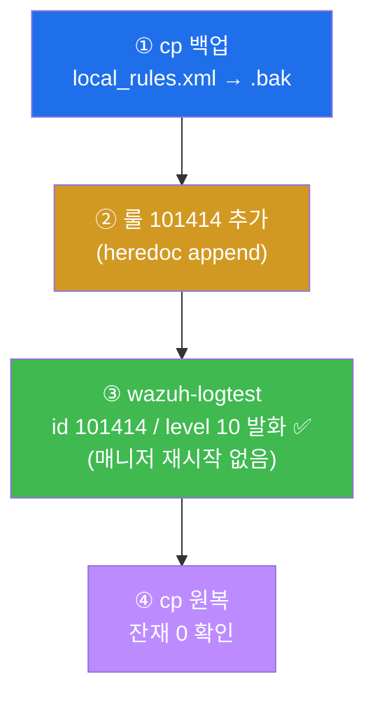
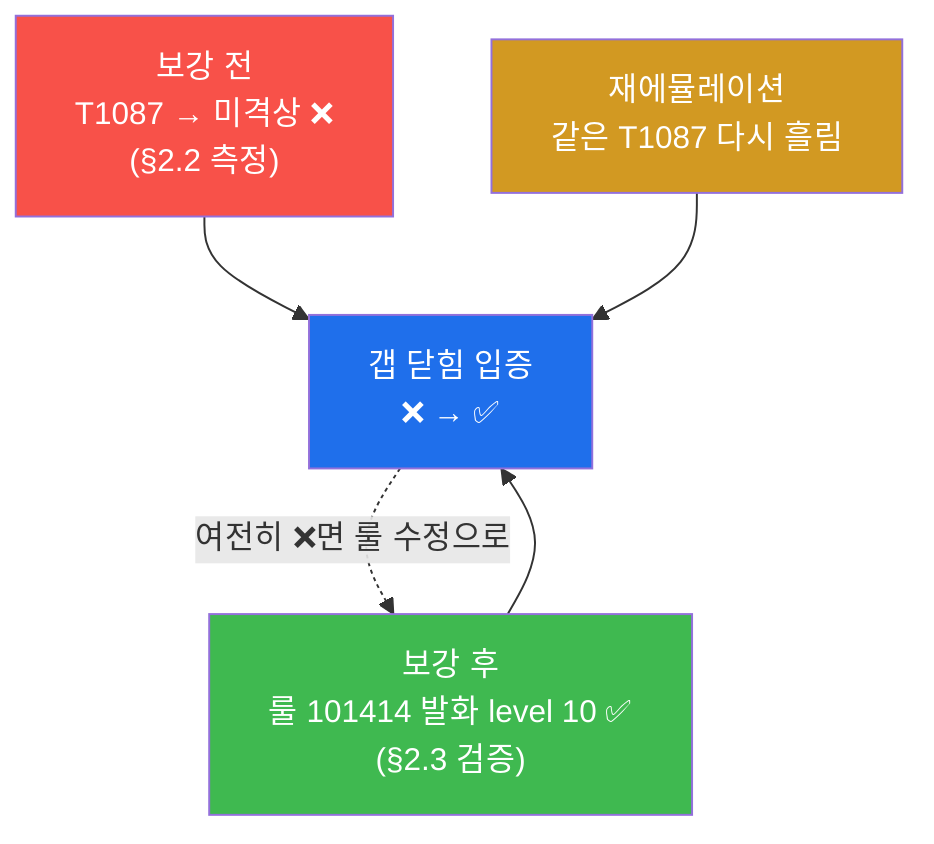
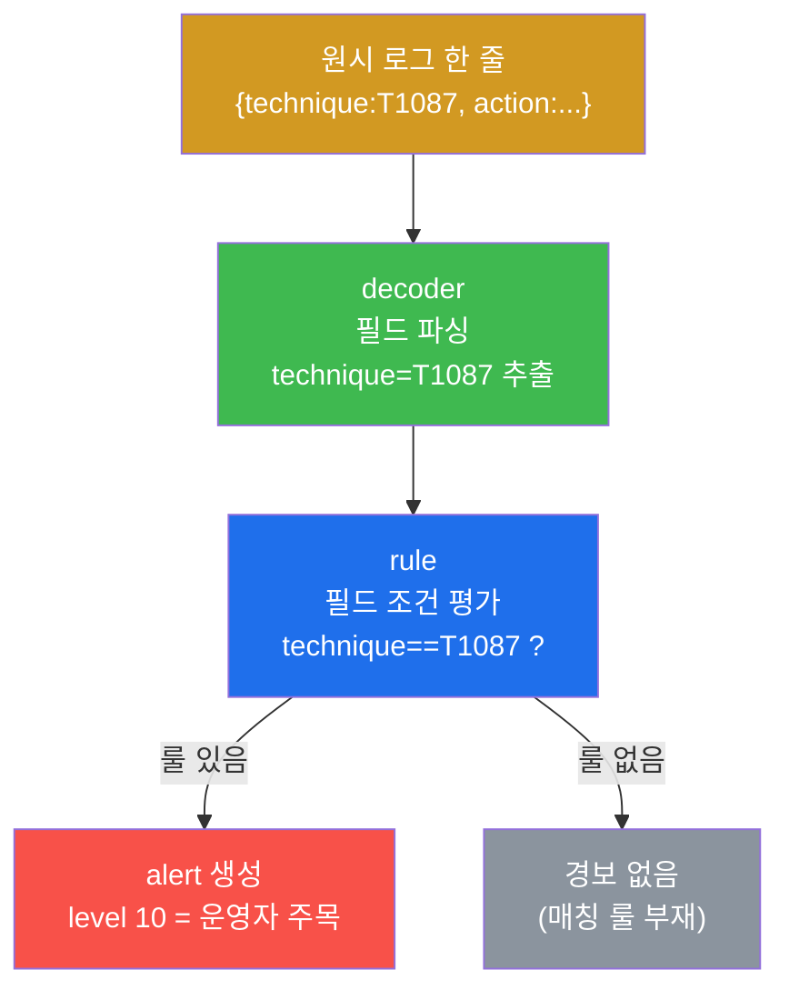
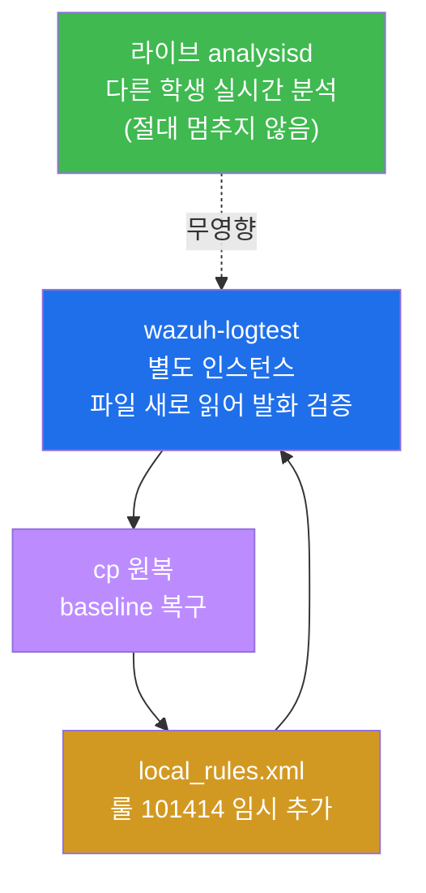
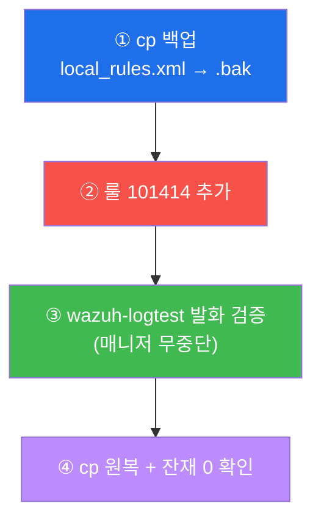
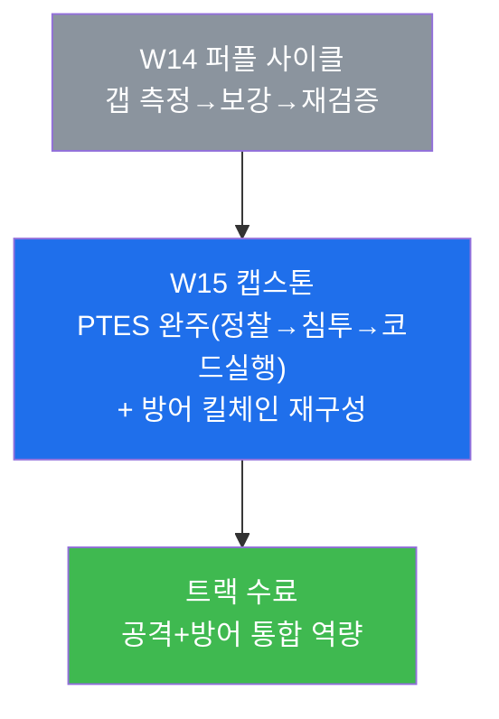

# 공격기법 W14 — 레드와 블루가 함께: Caldera+Wazuh로 탐지 커버리지를 측정·보강·재검증하기

> **본 주차의 한 줄 요약**
>
> 지난 W13 에서 학생은 **Caldera** 로 ATT&CK 기법을 자동 에뮬레이션하고, 어떤 기법은
> 방어 스택에 잡히고 어떤 기법은 **안 잡히는지(커버리지 갭)** 를 측정했다. 그러나 갭을
> 찾는 것만으로는 방어가 한 발짝도 나아가지 않는다. 본 주차는 그 갭을 **실제로 메우고**,
> 메웠다는 것을 **다시 공격해서 증명**하는 한 사이클을 학생 손으로 돌린다. 공격(레드)으로
> 갭을 드러내고 → 방어(블루)가 탐지 룰로 갭을 닫고 → 다시 공격해 닫혔는지 확인하는 이
> 반복이 **Purple Team(퍼플팀)** 의 본질이며, 탐지 커버리지를 "추측"이 아니라
> "검증된 데이터"로 끌어올리는 유일한 방법이다.
>
> **공격자 한 줄 결론**: 좋은 레드팀은 "내가 뚫었다"에서 끝나지 않는다. **"내 공격이
> 방어에 안 잡히는 그 지점"** 을 정확히 짚어 방어자에게 넘기고, 방어자가 만든 새 룰을
> **다시 자기 공격으로 깨뜨려 보는** 것까지가 레드의 일이다. 갭을 찾는 것은 W13 의 측정,
> 갭을 닫고 그 닫힘을 재공격으로 입증하는 것이 W14 의 보강·재검증이다.

---

## 학습 목표

본 주차 종료 시 학생은 다음 6가지를 **본인 손으로** 할 수 있어야 한다.

1. **Purple Team 사이클**(에뮬레이션 → 측정 → 보강 → 재검증)의 4 단계를 각 단계의 도구
   (Caldera / Wazuh)와 함께 1분 안에 설명하고, 이 사이클이 왜 단발성 펜테스트보다
   탐지 커버리지를 더 잘 끌어올리는지 근거를 댄다.
2. W13 에서 식별한 **커버리지 갭**(미탐지 기법, 본 주차는 T1087 계정 열거)을 다시
   에뮬레이션하고, 그 기법이 왜 기본 룰셋에 안 걸리는지(읽기 명령이라 시그니처가 약함)를
   설명한다.
3. `wazuh-logtest` 로 보강 **전** 상태를 측정해, 해당 기법 마커가 디코더에는 파싱되지만
   커스텀 룰이 없어 **격상(escalate)되지 않는다(미탐지/저레벨)** 는 것을 증거로 보인다.
4. 그 갭을 메우는 **Wazuh 탐지 룰**(`local_rules.xml`, rule id `101414`, level 10)을 직접
   작성하고, `wazuh-logtest` 로 **라이브 매니저를 멈추지 않고** 발화를 검증한 뒤,
   `cp` 로 원복해 공유 SIEM 의 baseline 을 보존한다.
5. 보강 **후** 같은 기법을 다시 에뮬레이션해 이제 잡힌다(❌→✅)는 것을 확인하고, 이
   **재검증** 이 왜 "고쳤다고 믿지 말고 다시 공격해 확인"이라는 퍼플팀 원칙의 핵심인지
   설명한다.
6. 보강 전후를 **커버리지 매트릭스**(ATT&CK 기법 × 탐지 여부)로 정리하고, 한 사이클의
   측정·보강·재검증 산출물을 증거와 함께 커버리지 보고서로 작성한다.

> **본 주차의 시선** — W14 는 새 공격 기법을 배우는 주가 아니다. 이미 W13 에서 자동
> 에뮬레이션과 갭 식별을 했다. 본 주차가 평가하는 능력은 **"찾은 갭을 닫고, 닫혔음을
> 데이터로 입증하는"** 운영 사이클이다. 채점은 "룰을 만들었다"라는 선언이 아니라, **룰이
> 실제로 발화하는 것을 logtest 로 증명**하고, **재에뮬레이션으로 갭이 닫힌 것을 보이며**,
> 그 모든 변경을 **원복해 공유 인프라를 깨끗이 유지**했는가를 본다.

---

## 0. 용어 해설 (이번 주에 다시·새로 쓰는 핵심어)

본 주차는 W13(에뮬레이션)과 W04(Wazuh 룰)의 용어를 종합한다. 처음 나오거나 본 주차에서
특히 중요한 용어를 한자리에 정리한다. 헷갈리기 쉬운 한 쌍은 표 아래에서 일상 비유로 다시 푼다.

| 용어 | 영문 | 뜻 | 비유 |
|------|------|----|------|
| **Purple Team** | Purple Team | 레드(공격)와 블루(방어)가 협업해 탐지를 함께 개선하는 활동·역할 | 모의 침입조와 경비조의 합동 훈련 |
| **탐지 커버리지** | detection coverage | 공격 기법들 중 방어 스택이 실제로 탐지해 내는 비율·범위 | CCTV 가 비추는 사각 없는 면적 |
| **커버리지 갭** | coverage gap | 공격은 일어났는데 방어가 **탐지하지 못한** 기법(미탐지 구멍) | CCTV 사각지대 |
| **자동화 공격 캠페인** | automated attack campaign | 여러 ATT&CK 기법을 한 도구가 일관·반복으로 자동 실행하는 공격 묶음 | 자동 점검 코스를 도는 로봇 |
| **에뮬레이션** | emulation | 실제 공격 기법을 **모사**해 방어가 잡는지 시험하는 통제된 재현 | 소방 훈련 — 진짜 불 대신 모사 화재 |
| **Caldera** | MITRE Caldera | ATT&CK 기법을 자동 에뮬레이션하는 오픈소스 레드팀 프레임워크(W13) | 자동 침입 시뮬레이터 |
| **ATT&CK** | MITRE ATT&CK | 공격자 전술(Tactic)·기법(Technique)을 분류한 표준 지식 베이스 | 공격 수법 백과사전 |
| **Technique ID** | T-number | ATT&CK 의 기법 식별자(예: T1087=계정 열거) | 수법별 일련번호 |
| **Wazuh** | Wazuh | 오픈소스 SIEM. manager 가 로그를 디코딩·룰 평가해 alert 생성 | CCTV 관제실 |
| **decoder** | decoder | 들어온 로그를 필드(key:value)로 **파싱**하는 Wazuh 의 1차 처리 | 영상에서 사람·차량을 식별 |
| **rule** | rule | 디코딩된 필드를 조건으로 평가해 **경보 레벨**을 매기는 Wazuh 의 2차 처리 | "이 행동은 위험" 판정 규칙 |
| **wazuh-logtest** | wazuh-logtest | 로그 한 줄을 넣어 현재 룰셋으로 디코더·룰 발화를 **별도 인스턴스에서** 시험하는 도구 | 실전 투입 전 모의 테스트 |
| **escalate(격상)** | escalate | 단순 로그를 더 높은 경보 레벨로 끌어올려 운영자 주목 대상으로 만듦 | 일반 신고를 긴급 출동으로 승격 |
| **level(경보 레벨)** | alert level | Wazuh 가 매기는 0~15 의 심각도. 0=미경보, 높을수록 위험 | 화재경보 등급 |
| **재검증** | re-validation | 보강 후 **같은 기법을 다시** 에뮬레이션해 이제 잡히는지 확인 | 수리 후 재점검 운전 |
| **커버리지 매트릭스** | coverage matrix | ATT&CK 기법별 탐지 여부(✅/❌)를 표로 시각화한 것 | 보안 점검 체크리스트 |
| **baseline** | baseline | 공유 인프라의 원래 정상 설정·룰. 실습 후 반드시 이 상태로 원복 | 훈련 전 원상 복구 기준 |

> **헷갈리기 쉬운 한 쌍 — "갭을 찾기" vs "갭을 닫고 재검증하기".** W13 은 자동 에뮬레이션으로
> **갭을 찾는 측정**까지였다. 그것은 "CCTV 사각지대가 여기 있다"를 발견한 단계다. 그런데
> 사각지대를 발견만 하고 카메라를 더 달지 않으면 도둑은 여전히 그 자리로 들어온다. W14 는
> 그 사각지대에 **카메라를 실제로 달고(보강 룰)**, 카메라가 정말 그 자리를 비추는지를 **다시
> 도둑 역할로 지나가며 확인(재검증)** 하는 단계다. 즉 W13=발견, W14=수리+재점검. 이 "재점검"이
> 빠지면 "고쳤다고 믿었는데 실은 안 고쳐진" 가장 위험한 상태가 된다.

> **헷갈리기 쉬운 한 쌍 — decoder vs rule.** 이 둘은 Wazuh 의 2단 처리 라인이다. **decoder**
> 는 들어온 로그 한 줄에서 의미 있는 필드를 뽑아낸다 — 예컨대 JSON 로그 `{"technique":"T1087"}`
> 에서 `technique=T1087` 이라는 필드를 만든다(CCTV 영상에서 "사람 한 명"을 식별하는 단계).
> **rule** 은 그렇게 뽑힌 필드를 조건으로 보고 경보 레벨을 매긴다 — "technique 가 T1087 이면
> level 10"(그 사람의 행동이 "위험"이라고 판정하는 단계). 본 주차의 갭은 바로 이 **둘 사이의
> 단절**이다: decoder 는 T1087 을 잘 파싱하지만, 그것을 "위험"으로 격상시킬 **rule 이 없어서**
> 경보가 안 뜬다. 그래서 보강은 새 decoder 가 아니라 새 **rule**(101414)을 추가하는 일이다.

---

## 1. 왜 갭을 "찾기"만으로는 부족한가

### 1.1 한 줄 답: 발견은 절반이고, 닫고 재검증해야 방어가 전진한다

W13 에서 학생은 Caldera 가 자동화하는 ATT&CK 기법들을 에뮬레이션하고, 각 기법이 방어 스택에
잡혔는지를 매트릭스로 측정했다. 그 결과 어떤 기법은 ✅(탐지)였고 어떤 기법은 ❌(미탐지=커버리지
갭)였다. 여기까지가 **측정**이다.

문제는 측정만으로는 방어가 한 발짝도 나아가지 않는다는 것이다. "T1087 이 안 잡힌다"를 알았어도,
탐지 룰을 추가하지 않으면 다음에 같은 공격이 와도 똑같이 안 잡힌다. 더 위험한 것은, 룰을
"추가했다"고 믿었지만 실제로는 문법 오류나 조건 착오로 **발화하지 않는** 경우다. 이때 운영자는
"우리는 T1087 을 막는다"고 착각하면서 실제로는 뚫려 있다. 그래서 퍼플팀은 반드시 다음 두 단계를
더 밟는다.



위 그림의 핵심은 **재검증에서 다시 보강으로 돌아가는 점선 화살표**다. 룰을 추가했는데 재검증에서
여전히 안 잡히면, 그것은 룰이 잘못된 것이므로 보강 단계로 돌아가 고친다. 이 되먹임이 있어야
"고쳤다고 믿었는데 안 고쳐진" 상태를 걸러낼 수 있다.

### 1.2 단발 펜테스트 vs 퍼플 사이클 — 무엇이 다른가

전통적 침투 테스트(펜테스트)는 1년에 한 번 외부 팀이 와서 "여기 뚫린다" 보고서를 주고 떠난다.
이 방식의 한계는 명확하다.

전통적 펜테스트는 **한 시점의 스냅샷**이다. 보고서를 받은 방어팀이 정말 그 구멍을 막았는지,
막은 것이 제대로 작동하는지는 다음 펜테스트(1년 뒤)까지 아무도 확인하지 않는다. 그 사이에 룰을
잘못 고쳤거나, 새 로그 소스가 추가되며 디코더가 깨졌어도 알 길이 없다.

반면 **퍼플 사이클**은 **반복 가능한 자동 에뮬레이션**을 기반으로 한다. Caldera 가 같은 기법을
일관되게 재현하므로, 룰을 고친 직후 **즉시 같은 공격을 다시 흘려** 효과를 확인할 수 있다.
"공격 → 측정 → 보강 → 같은 공격으로 재검증"이 분 단위로 돌아간다. 그래서 커버리지가 "지난
펜테스트 때는 막혔던 것 같다"는 기억이 아니라 **"방금 재공격해서 잡히는 것을 확인했다"는
데이터**가 된다.



### 1.3 왜 공격 과목에서 방어 룰을 만드나

이 트랙은 공격 과목인데 본 주차는 Wazuh 탐지 룰을 직접 만든다. 의아할 수 있지만, 이것이
**좋은 레드팀의 핵심 역량**이다. 실력 있는 공격자는 자기 공격이 방어에 **어떻게 보이는지**를
정확히 안다(W08 의 "자기 체인이 어떻게 탐지되는지 아는 좋은 공격자"). 그 앎이 있어야
실전에서 탐지를 회피하거나(고급 레드), 방어자와 협업해 탐지를 개선(퍼플)할 수 있다.

본 주차에서 학생은 공격자(레드)로 갭을 드러내고, 방어자(블루)로 돌아서서 그 갭을 닫는 룰을
직접 쓴 뒤, 다시 공격자로 돌아가 그 룰을 깨뜨려 본다. 이렇게 **양쪽 시선을 한 사이클 안에서
오가는** 경험이 곧 퍼플팀이며, 단순히 "뚫는" 레드를 넘어 "방어를 함께 끌어올리는" 레드로
성장하는 과정이다.

### 1.4 한계 — 본 주차가 다루지 않는 것

본 주차의 보강·재검증은 **Wazuh 룰 한 층위**에서 한 기법(T1087)의 갭을 닫는 것을 표준 예로
삼는다. 따라서 다음은 본 주차의 범위가 아니다. 실제 운영에서는 갭을 닫는 수단이 Wazuh 룰만이
아니라 **Suricata IDS 룰**(네트워크 계층), **osquery/sysmon 헌팅**(호스트 행위), **ATT&CK
전 전술의 체계적 커버리지 측정**(전체 매트릭스 채우기)까지 넓어진다. 또한 본 주차는 공유 SIEM
보존을 위해 룰을 **logtest 로 검증만 하고 원복**한다 — 실제 운영이라면 검증된 룰을 영구
배포하고 매니저를 reload 한다. 본 주차는 **사이클을 한 바퀴 정확히 도는 것**에 집중하며, 그
사이클을 ATT&CK 전체로 확장하는 운영 규모화는 방어 트랙(secuops/soc)과 후속 과정에서 다룬다.

---

## 2. Purple Team 사이클 상세 — 네 단계를 하나씩

본 주차의 시나리오는 단순하고 명확하다. **W13 에서 미탐지였던 T1087(계정 열거)** 이라는 한
갭을 골라, 그것을 닫는 한 사이클을 끝까지 돈다. 네 단계를 차례로 본다.

> ⚠️ **인가된 실습만.** 본 주차의 모든 에뮬레이션과 룰 작업은 **인가된 실습 환경(el34)** 안에서,
> 정해진 대상(`el34-web`, `el34-siem`)에 한해서만 수행한다. 실제 외부 시스템을 대상으로 한
> 시도는 불법이며 본 과정의 윤리 규정(RoE)을 위반한다. 또한 el34 의 Wazuh manager 는 여러 학생이
> 함께 쓰는 **공유 SIEM** 이므로, 룰은 `wazuh-logtest` 로 검증만 하고 `cp` 로 반드시 **원복**한다
> (라이브 매니저를 재시작하거나 baseline 을 영구 변경하지 않는다).

### 2.1 ① 갭 재현(에뮬레이션) — 안 잡히던 기법을 다시 일으킨다

**한 줄 정의.** 갭 재현은 W13 에서 미탐지로 판명된 기법을 다시 한 번 에뮬레이션해, 본 사이클에서
"닫을 대상"을 무대에 올리는 단계다.

**무엇을 하나.** 본 주차의 갭 기법은 **T1087 Account Discovery(계정 열거)** 다. ATT&CK 에서
T1087 은 "표적 호스트에 어떤 계정이 있는지 알아내는" 정찰성 기법이며, Linux 에서 가장 단순한
형태가 `cat /etc/passwd`(시스템 계정 목록 파일 읽기)다. el34 에서는 `el34-web` 컨테이너에서 이
명령을 흘려 기법을 모사한다.

> **용어 — T1087 / `/etc/passwd`.** **T1087** 은 ATT&CK Discovery 전술에 속하는 "계정 열거"
> 기법의 ID 다. **`/etc/passwd`** 는 리눅스의 사용자 계정 목록 파일로, 누구나 읽을 수 있다
> (world-readable). 공격자는 침투 후 이 파일을 읽어 어떤 계정을 노릴지 정찰한다.

**왜 이 기법이 갭인가.** 핵심은 **T1087 이 "읽기" 명령**이라는 데 있다. `cat /etc/passwd` 는
파일을 변경하지도, 새 프로세스를 위험하게 띄우지도, 네트워크로 무언가를 보내지도 않는다. 그저
정상적으로 존재하는 파일을 한 번 읽을 뿐이다. 그래서 파일 변경을 감시하는 FIM, 위험 프로세스를
잡는 시그니처, 외부 통신을 보는 IDS 가 모두 **이 행위를 정상과 구별할 단서를 거의 갖지 못한다**.
반면 W13 의 다른 기법인 T1136(계정 **생성**, `useradd`)은 시스템을 **변경**하므로 기본 룰이 쉽게
잡는다. 즉 "읽기성 정찰"이 "변경성 행위"보다 본질적으로 탐지가 어렵고, 이것이 T1087 이 커버리지
갭으로 남는 이유다.



### 2.2 ② 커버리지 측정 — 정말 안 잡히는지 증거로 확인한다

**한 줄 정의.** 커버리지 측정은 보강 **전** 상태에서 해당 기법 마커를 Wazuh 에 흘려, 경보로
격상되지 않음(미탐지/저레벨)을 **증거로** 확인하는 단계다.

**무엇을 하나.** "안 잡힌다"를 막연히 주장하지 않고, `wazuh-logtest` 로 직접 확인한다. T1087 을
나타내는 작은 JSON 마커 `{"technique":"T1087","action":"account_discovery"}` 를 logtest 에
입력하면, Wazuh 가 이 한 줄을 현재 룰셋으로 처리하는 과정을 그대로 보여준다.

> **용어 — wazuh-logtest 와 처리 단계.** `wazuh-logtest` 는 로그 한 줄을 넣어 **라이브 analysisd
> 를 멈추지 않고** 별도 테스트 인스턴스에서 디코더·룰 발화를 시험하는 도구다. 처리는 단계로
> 진행된다 — **Phase 1**(원시 로그 수신), **Phase 2**(decoder 가 필드 파싱), **Phase 3**(rule
> 평가). 입력 처리가 끝나면 출력 끝에 **`Completed`** 가 찍힌다. 본 lab 의 합격 신호가 바로 이
> `Completed` 로, "logtest 가 정상적으로 한 줄을 처리해 보강 전 상태를 측정했다"는 뜻이다.

**el34 에서 어떻게 보이나(보강 전).** T1087 마커는 JSON 이므로 **decoder 단계(Phase 2)에서는
`technique=T1087` 로 잘 파싱된다**. 그러나 이 필드를 "위험"으로 격상시킬 **커스텀 룰이 아직
없기 때문에**, rule 단계(Phase 3)에서 의미 있는 경보 레벨로 올라가지 않는다. 결과적으로
logtest 출력에는 디코더가 동작한 흔적과 `Completed` 는 보이지만, T1087 을 위험으로 판정하는
높은 level 의 룰 발화는 없다. **이것이 바로 커버리지 갭의 증거**다 — 데이터는 들어오는데
판정하는 룰이 없는 상태.



### 2.3 ③ 갭 보강 — 그 기법을 잡는 Wazuh 룰을 만든다

**한 줄 정의.** 갭 보강은 decoder 가 이미 뽑아낸 필드(`technique=T1087`)를 조건으로 보고 경보
레벨을 격상시키는 **새 Wazuh 룰을 추가**하는 단계다.

**무엇을 하나.** Wazuh 의 사용자 룰 파일 `local_rules.xml` 에, T1087 을 탐지하는 룰을 추가한다.
본 주차의 룰은 다음과 같다(rule id `101414`, level 10).

```xml
<group name="atk_w14,">
  <rule id="101414" level="10">
    <decoded_as>json</decoded_as>
    <field name="technique">T1087</field>
    <description>ATK W14 - account discovery detected (gap closed)</description>
  </rule>
</group>
```

이 룰의 각 줄이 의미하는 바는 다음과 같다. `<decoded_as>json</decoded_as>` 는 "JSON 으로
디코딩된 로그에만 이 룰을 적용한다"는 사전 조건이다(불필요한 로그에 룰을 돌리지 않아 성능을
지킨다). `<field name="technique">T1087</field>` 가 실제 매칭 조건으로, decoder 가 뽑은
`technique` 필드 값이 `T1087` 이면 매치된다. `level="10"` 은 매치 시 부여할 경보 레벨로,
10 은 운영자 주목 대상(중-고 심각도)이다. `<description>` 은 이 경보가 무엇인지 운영자에게
보여줄 설명이다.

> **용어 — local_rules.xml / rule id 네임스페이스.** **`local_rules.xml`**
> (`/var/ossec/etc/rules/`)은 운영자가 추가하는 **사용자 정의 룰** 파일이다. Wazuh 의 수만 개
> 기본 룰을 건드리지 않고 여기에만 추가한다. **rule id** 는 룰의 고유 번호로, 사용자 룰은 보통
> 100000 이상의 대역을 쓴다. 본 주차는 다른 주차·다른 학생과 겹치지 않도록 `101414`(=1014xx
> 네임스페이스, "공격 W14")로 고정한다.

**el34 에서 어떻게 검증하나(라이브 무중단).** 룰을 추가한 뒤, **매니저를 재시작하지 않고**
`wazuh-logtest` 로 발화를 확인하는 것이 핵심이다. 공유 SIEM 에서 `wazuh-control restart` 를
하면 다른 학생의 실시간 분석이 끊긴다. 대신 logtest 는 현재 룰셋(방금 추가한 101414 포함)을
새로 읽어 **별도 인스턴스에서** 같은 T1087 마커를 처리한다. 이번에는 Phase 3 에서 룰 101414 가
매치되어 **"Alert to be generated"** 와 함께 `id: 101414`, `level: 10` 이 출력된다 — 갭이
닫혔다는 직접 증거다.

**끝나면 반드시 원복.** 검증이 끝나면 추가한 룰을 **즉시 원복**한다. 방법은 룰을 추가하기 **전에**
`cp` 로 `local_rules.xml` 을 백업해 두었다가, 검증 후 그 백업으로 덮어쓰는 것이다. 그리고
`grep -c 101414` 로 잔재가 0 인지 확인한다. 이렇게 해야 공유 SIEM 의 baseline 이 본 학생의
실습 흔적 없이 유지된다.



### 2.4 ④ 재검증 — 다시 공격해 갭이 닫혔는지 확인한다

**한 줄 정의.** 재검증은 보강 후 **같은 기법(T1087)을 다시 에뮬레이션**해, 보강 전 ❌였던 것이
보강 후 ✅로 바뀌었음을 확인하는 단계다.

**왜 이것이 퍼플팀의 핵심인가.** 룰을 추가하고 logtest 에서 한 번 발화를 본 것만으로는 부족할
수 있다 — 실제 같은 공격 마커가 다시 들어왔을 때 정말 잡히는지를 **재현해서** 확인해야 한다.
이 단계의 표어가 **"고쳤다고 믿지 말고 다시 공격해 확인(don't trust, verify)"** 이다. 보강 전
측정(§2.2)에서 본 ❌와, 보강 후 발화(§2.3)에서 본 ✅를 **나란히 대조**해 "❌→✅"라는 변화를
명시적으로 입증한다.



위 그림의 점선이 다시 강조하는 핵심이다 — 재검증에서 여전히 안 잡히면 그것은 룰이 잘못된
것이므로 보강으로 돌아간다. 재검증이 통과해야 비로소 한 사이클이 닫힌다.

---

## 3. Wazuh 탐지 파이프라인과 무중단 검증 원리

본 주차의 보강·검증을 정확히 하려면, 룰이 어디서 어떻게 동작하는지를 알아야 한다.

### 3.1 로그 한 줄이 경보가 되기까지 — decoder → rule

Wazuh manager 의 심장은 **analysisd** 데몬이다(W09 에서 학습). analysisd 는 들어온 로그를 두
단계로 처리한다.



먼저 **decoder** 가 로그에서 의미 있는 필드를 뽑는다. 본 주차 마커는 JSON 이므로 Wazuh 의
내장 JSON 디코더가 `technique`, `action` 같은 키-값을 자동으로 추출한다. 그다음 **rule** 이
그 필드를 조건으로 평가한다. 조건에 맞는 룰이 있으면 그 룰의 level 로 경보를 생성하고, 없으면
경보 없이 지나간다. **본 주차의 갭은 이 두 번째 단계의 공백** — 디코더는 T1087 을 잘 뽑지만,
그것을 격상시킬 룰이 없어 경보가 안 뜬다. 그래서 보강은 새 **rule**(101414)을 추가하는 일이다.

### 3.2 왜 logtest 로 검증하고 매니저를 재시작하지 않는가

el34 의 Wazuh manager 는 **여러 학생이 동시에 쓰는 공유 SIEM** 이다. 누군가 룰을 바꿀 때마다
`wazuh-control restart` 를 하면, 그 순간 다른 모든 학생의 실시간 로그 분석이 끊긴다. 이는 운영
환경에서도 같은 문제다 — 룰 하나 고치자고 SOC 전체의 실시간 탐지를 멈출 수는 없다.

해결책이 **`wazuh-logtest`** 다. logtest 는 입력 한 줄을 받을 때 **현재 룰셋 파일을 새로 읽어**
별도의 테스트 인스턴스에서 처리한다. 그래서 방금 `local_rules.xml` 에 추가한 101414 가 즉시
반영되면서도, **라이브 analysisd 는 전혀 건드리지 않는다**. 룰이 발화하는지(`id: 101414`,
`level: 10`, `Alert to be generated`)를 확인만 하고, 검증이 끝나면 파일을 원복한다. 이것이
공유 인프라에서 룰을 안전하게 검증하는 표준 절차다.



### 3.3 el34 환경 사실 — 어디서 무엇을 실행하나

본 주차의 모든 명령은 **el34 호스트**(`ssh ccc@192.168.0.151`, 비밀번호 1)에 접속한 뒤
`docker exec` 로 컨테이너에 들어가 실행한다. 사용하는 두 컨테이너의 역할은 다음과 같다.

| 컨테이너 | 역할(본 주차) | 핵심 경로·명령 |
|----------|---------------|----------------|
| `el34-web` | 갭 기법(T1087) 에뮬레이션 대상 | `cat /etc/passwd` |
| `el34-siem` | Wazuh manager — 측정·보강·검증 | `/var/ossec/bin/wazuh-logtest`, `/var/ossec/etc/rules/local_rules.xml` |

el34 의 Wazuh 는 **버전 4.10**, manager 컨테이너는 `el34-siem`(dmz 10.20.32.100)이며, 현재
활성 agent 는 ips(003)·web(004) 두 개다. Caldera 는 el34 기본에 없던 도구라 **호스트에 직접
설치**되어 있다(`~/caldera-src`, W13 에서 설명). 본 lab 은 Caldera 가 자동화하는 atomic 기법을
**수동으로 흘려** 탐지를 측정·보강하는 데 집중한다(서버/agent 풀 운영은 별도).

---

## 4. 커버리지 매트릭스 — 사이클의 산출물

한 사이클을 돌고 나면, 그 결과를 **커버리지 매트릭스**로 정리한다. 매트릭스는 ATT&CK 기법을
행으로, 보강 전후의 탐지 여부를 열로 두어 "어디가 막혔고 어디가 열렸는지"를 한눈에 보여준다.

| Tactic(전술) | 기법 | 보강 전 | 보강 후 |
|--------------|------|---------|---------|
| Discovery | T1087 (계정 열거) | ❌ | ✅ (rule 101414) |
| Persistence | T1136 (계정 생성) | ✅ | ✅ |
| Execution | T1059 (명령 실행) | ✅ | ✅ |

이 매트릭스의 가치는 두 가지다. 첫째, **우선순위화**다. ❌가 여러 개라면, 어느 갭부터 닫을지를
공격 빈도·심각도로 판단한다(본 주차는 읽기성 정찰인 T1087 을 예로 닫았다). 둘째, **진척의
가시화**다. "보강 전 ❌ → 보강 후 ✅"라는 칸의 변화가 곧 방어가 한 발짝 전진했다는 증거이며,
이 매트릭스가 시간이 지나며 ✅로 채워지는 것이 퍼플팀의 누적 성과다.

> **핵심 — 매트릭스는 "데이터"여야 한다.** 매트릭스의 ✅는 "막을 것 같다"는 추측이 아니라
> **재검증으로 확인된 ✅**여야 한다. ❌→✅로 칸을 칠하기 전에, 반드시 §2.4 의 재검증을 통과해야
> 한다. 검증 없이 칠한 ✅는 가장 위험한 자기기만이다.

---

## 5. 실습 안내 — W14 lab 8 미션 (4 축 설명)

본 주차 실습은 8 미션으로 구성되며, Purple Team 사이클을 그대로 따라간다 — 점검 → ① 갭
재현 → ② 측정 → ③ 보강 → ④ 재검증 → 매트릭스 → 사이클 정리 → 보고서. 각 미션을 **4 축**으로
설명한다 — 왜 하는가 / 무엇을 알 수 있는가 / 결과 해석(정상 vs 비정상) / 실전 활용.

> **실습 진행 원칙.** 모든 명령은 el34 호스트(`ssh ccc@192.168.0.151`)에서 `docker exec
> el34-<comp>` 로. **인가된 실습 환경(el34)에서만** 수행한다. 보강 룰은 `wazuh-logtest` 로
> 검증만 하고 `cp` 로 **원복**해 공유 SIEM 의 baseline 을 보존한다. 합격 임계값은 0.7 이다.

### 미션 1 — 점검: Caldera + Wazuh (10점, survey)

> **왜 하는가?** 퍼플 사이클의 전제는 공격 도구(Caldera)와 탐지 엔진(Wazuh analysisd)이 모두
> 준비돼 있어야 한다는 것이다. 운영자는 사이클 착수 전 항상 두 축을 먼저 점검한다.
>
> **무엇을 알 수 있는가?** 호스트에 Caldera 소스(`~/caldera-src/server.py`)가 있는지, 그리고
> Wazuh 의 핵심 데몬 **analysisd**(디코더·룰의 심장)가 가동 중인지. 사이클을 시작할 준비가
> 됐는지를 한 번에 확인한다.
>
> **결과 해석.** 정상: Caldera 소스가 보이고 `analysisd` 가 `is running` 으로 출력. 비정상:
> analysisd 가 멈춰 있으면 어떤 룰도 평가되지 않으므로, 먼저 매니저 상태부터 점검한다.
>
> **실전 활용.** 퍼플 훈련 착수 시 첫 점검. 에뮬레이션 도구와 탐지 엔진 양쪽의 가용성을
> 확인해야 측정·보강으로 넘어갈 수 있다.

### 미션 2 — ① 갭 재현: 안 잡히는 기법 에뮬레이션 (12점, recon)

> **왜 하는가?** 사이클에서 "닫을 대상"을 무대에 올린다. W13 에서 미탐지였던 T1087(계정
> 열거)을 다시 에뮬레이션한다.
>
> **무엇을 알 수 있는가?** `el34-web` 에서 `cat /etc/passwd`(T1087 의 atomic 명령)로 계정 열거를
> 모사하는 법. 그리고 이 기법이 왜 갭인지 — **읽기 명령이라 변경·통신·위험 프로세스 신호가
> 없어** 기본 룰이 잡을 단서가 약하다는 것.
>
> **결과 해석.** 정상: 계정 목록 일부가 출력되고 `emulated` 마커가 찍힘. 핵심 깨달음 — 같은
> "공격"이라도 읽기성(T1087)은 변경성(T1136 계정 생성)보다 본질적으로 탐지가 어렵다.
>
> **실전 활용.** 정찰성 기법(읽기·열거)이 탐지 사각으로 남기 쉽다는 인식. 방어 설계 시 변경
> 이벤트뿐 아니라 읽기·접근 패턴도 고려해야 함을 보여준다.

### 미션 3 — ② 커버리지 측정: 갭 확인 (12점, analysis)

> **왜 하는가?** "안 잡힌다"를 주장이 아니라 **증거**로 확인한다. 보강 전 상태를 logtest 로
> 측정한다.
>
> **무엇을 알 수 있는가?** T1087 마커를 `wazuh-logtest` 에 흘렸을 때, decoder(Phase 2)는
> `technique=T1087` 을 잘 파싱하지만 **격상 룰이 없어** 의미 있는 경보로 올라가지 않는다는 것.
> logtest 처리가 끝나면 출력 끝에 `Completed` 가 찍힌다는 것.
>
> **결과 해석.** 정상: 출력에 `Completed` 가 보이고, T1087 을 위험으로 격상하는 높은 level 룰
> 발화는 없음 = 커버리지 갭(보강 전). 비정상: logtest 가 `Completed` 없이 끝나면 입력 형식·경로를
> 점검한다.
>
> **실전 활용.** 갭을 데이터로 입증하는 습관. "막연히 안 잡힐 것 같다"가 아니라 logtest 로 "이
> 마커가 격상되지 않는다"를 보여주는 것이 운영의 기본이다.

### 미션 4 — ③ 갭 보강 룰: rule 101414 작성 → logtest → 원복 (16점, manipulation)

> **왜 하는가?** 사이클의 중심 — 발견한 갭을 실제로 닫는 탐지 룰을 직접 만든다.
>
> **무엇을 알 수 있는가?** `local_rules.xml` 에 T1087 을 탐지하는 룰(id 101414, level 10,
> `field name="technique"` 매칭)을 추가하고, **매니저를 재시작하지 않고** `wazuh-logtest` 로
> 발화(`id 101414`/`level 10`/`Alert to be generated`)를 확인한 뒤, `cp` 로 원복해 baseline 을
> 보존하는 전 과정. 룰 추가 **전** 백업(cp .bak)이 원복의 전제임을 체득한다.
>
> **결과 해석.** 정상: logtest 출력에 `101414` 가 발화로 보이고, 원복 후 `grep -c 101414` 잔재
> 카운트가 0. 비정상: 발화가 안 보이면 XML 문법(따옴표·태그)·field 이름을 점검하고, 잔재가
> 남으면 원복 명령을 다시 실행한다.
>
> **실전 활용.** 신종 기법이 미탐지로 드러나면 운영자가 직접 탐지 룰을 작성·검증한다. 공유 SIEM
> 에서는 무중단 검증(logtest)+검증 후 정리가 변경 관리의 규율이다.

### 미션 5 — ④ 재검증: 갭이 닫혔나 (12점, analysis)

> **왜 하는가?** 퍼플팀의 핵심 — "고쳤다고 믿지 말고 다시 공격해 확인". 보강 후 같은 기법을
> 다시 에뮬레이션해 ❌→✅를 입증한다.
>
> **무엇을 알 수 있는가?** 보강 전 측정(미션 3, ❌)과 보강 후 발화(미션 4, ✅)를 나란히 대조해,
> 룰 101414 가 실제로 갭을 닫았음을 명시적으로 보이는 법. 재검증이 한 사이클을 닫는 마지막
> 관문이라는 것.
>
> **결과 해석.** 정상: 출력에 "보강 전 ❌ → 보강 후 ✅, 갭 닫힘"이 정리됨. 비정상: 재검증에서
> 여전히 ❌면 룰이 잘못된 것이므로 미션 4(보강)로 돌아가 수정한다.
>
> **실전 활용.** 어떤 수정이든 "고친 뒤 같은 조건으로 재현해 확인"이 운영의 철칙. 검증 없는
> 수정은 자기기만이며, 재검증이 그것을 걸러낸다.

### 미션 6 — 커버리지 매트릭스 (12점, analysis)

> **왜 하는가?** 사이클의 결과를 한눈에 보이는 산출물로 정리해, 진척을 가시화하고 다음 갭을
> 우선순위화한다.
>
> **무엇을 알 수 있는가?** ATT&CK 기법(T1087/T1136/T1059) × 보강 전후(❌/✅)를 매트릭스로
> 그리는 법. T1087 칸이 ❌→✅로 바뀐 것이 본 사이클의 성과임을, 매트릭스가 어떻게 우선순위
> 판단을 돕는지.
>
> **결과 해석.** 정상: 매트릭스에 Discovery(T1087) ❌→✅, Persistence/Execution ✅가 정리됨.
> 핵심 — ✅는 추측이 아니라 재검증으로 확인된 ✅여야 한다.
>
> **실전 활용.** ATT&CK 매트릭스 기반 커버리지 관리는 SOC 의 표준 산출물. 경영진·감사에 "우리가
> 무엇을 탐지하고 무엇이 갭인지"를 보고하는 공용어다.

### 미션 7 — Purple 사이클 정리 (12점, report)

> **왜 하는가?** 한 바퀴 돈 사이클의 4 단계를 말로 정리해, 이 방법론을 본인이 설명할 수 있는지
> 확인한다.
>
> **무엇을 알 수 있는가?** 에뮬레이션 → 측정 → 보강 → 재검증의 반복이 왜 레드+블루 협업이며,
> 왜 "추측이 아닌 검증된 커버리지"를 만드는지. 이 사이클이 단발 펜테스트와 어떻게 다른지.
>
> **결과 해석.** 정상: 4 단계 사이클과 "레드+블루 협업, 데이터 기반 개선"이 정리됨. 핵심 —
> 사이클은 한 번으로 끝나지 않고 갭이 남는 한 계속 돈다.
>
> **실전 활용.** 퍼플팀 프로그램을 조직에 제안·운영할 때의 설명 틀. 자동 에뮬레이션 기반 반복이
> 탐지 성숙도를 지속적으로 끌어올린다.

### 미션 8 — 커버리지 보고서 (10점, report)

> **왜 하는가?** 미션 1–7 을 한 사이클의 산출물로 종합해, 측정·보강·재검증을 문서로 입증한다.
>
> **무엇을 알 수 있는가?** 갭 측정(미탐지 기법) → 보강 룰(101414)+logtest → 재검증(❌→✅) →
> 커버리지 매트릭스 + 퍼플 사이클을 한 보고서로 엮는 법. 퍼플팀 보고서의 표준 구조.
>
> **결과 해석.** 정상: 보고서에 측정·보강·재검증이 모두 포함됨. 핵심 결론 — 갭을 데이터로 찾아
> 닫고, 닫혔음을 재공격으로 입증했다.
>
> **실전 활용.** 퍼플 훈련 종료 후 제출하는 보고서 구조(갭→보강→재검증→매트릭스). 발견을
> "닫았고 검증했다"까지 보고하는 것이 단순 갭 나열보다 훨씬 가치 있다.

---

## 6. 실습 수칙 — 인가된 실습 + 공유 SIEM 보존

el34 의 Wazuh manager 는 여러 학생이 함께 쓰는 공유 인프라이며, 본 주차는 그 매니저의 룰을
다루므로 보존 규율이 특히 중요하다. 다음 수칙을 반드시 지킨다.

- **인가된 실습만.** 모든 에뮬레이션·룰 작업은 인가된 실습 환경(el34) 안에서, 정해진 대상
  (`el34-web`/`el34-siem`)에 한해서만. 실제 외부 시스템 대상 시도는 불법이며 RoE 위반이다.
- **baseline 을 영구 변경하지 말 것.** Wazuh 기본 룰셋·디코더, 정상 설정은 점검만 하고 바꾸지
  않는다. 보강 룰은 **logtest 검증 후 cp 로 원복**한다.
- **매니저를 재시작하지 말 것.** `wazuh-control restart` 는 다른 학생의 실시간 분석을 끊는다.
  검증은 **무중단 `wazuh-logtest`** 로만 한다.
- **네임스페이스를 지킨다.** 본 주차 rule id 는 `101414`(1014xx 대역)로 고정해 다른 학생·주차와
  겹치지 않게 한다.
- **증거 우선.** "룰을 만들었다"가 아니라 **logtest 발화(id/level)·❌→✅ 대조·잔재 0 확인**을
  제시해야 점수다. 선언만으로는 채점되지 않는다.



---

## 7. 핵심 정리 (1줄씩)

1. **Purple Team 사이클** — 에뮬레이션 → 측정 → 보강 → 재검증의 반복. 레드+블루 협업으로 탐지
   커버리지를 "추측"이 아니라 "검증된 데이터"로 끌어올린다.
2. **발견은 절반** — W13 의 갭 측정만으로는 방어가 전진하지 않는다. 닫고(보강) 다시 공격해
   확인(재검증)해야 비로소 한 사이클이 완성된다.
3. **갭 = decoder 와 rule 사이의 공백** — T1087 마커는 디코더가 잘 파싱하지만 격상 룰이 없어
   미탐지. 보강은 새 **rule**(101414)을 추가하는 일이다.
4. **읽기성 정찰이 어렵다** — T1087(`cat /etc/passwd`)은 변경·통신·위험 프로세스 신호가 없어
   변경성 기법(T1136 계정 생성)보다 본질적으로 탐지가 어렵다.
5. **무중단 검증** — 공유 SIEM 은 `wazuh-control restart` 금지. `wazuh-logtest` 로 라이브
   매니저를 멈추지 않고 발화를 확인하고, `cp` 로 원복해 baseline 을 보존한다.
6. **재검증이 자기기만을 막는다** — "고쳤다고 믿지 말고 다시 공격해 확인". ✅는 반드시 재검증으로
   확인된 ✅여야 한다.

---

## 8. 다음 주차 (W15) 예고 — 캡스톤: PTES 완주

W14 는 한 갭을 닫는 퍼플 사이클이었다. W15 는 본 트랙의 **수료 캡스톤** — 그동안 익힌 모든
기법을 **PTES(침투 테스트 표준) 단계**에 따라 정찰부터 침투·코드 실행까지 **한 침입으로 완주**
하고, 방어자 시선으로 그 킬체인을 재구성해 어느 단계에서든 끊어 막는 종합 시험이다. W08
중간고사가 W01–W07 을 체인으로 엮었다면, W15 는 W01–W14 전체(자동 에뮬레이션·퍼플 사이클
포함)를 한 시나리오로 통합한다.


