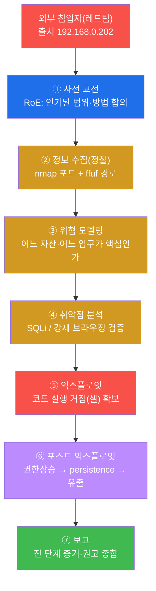
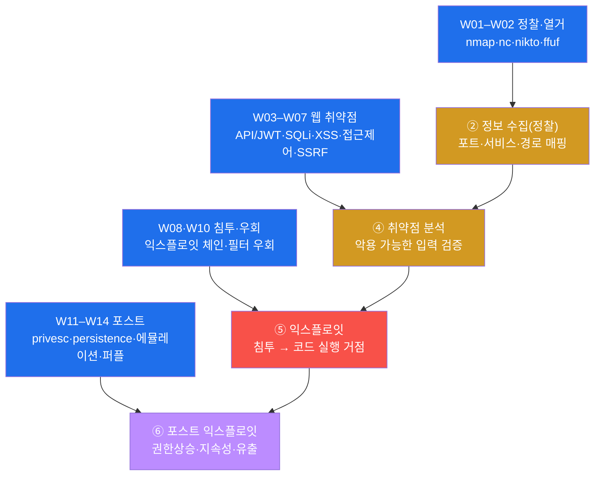
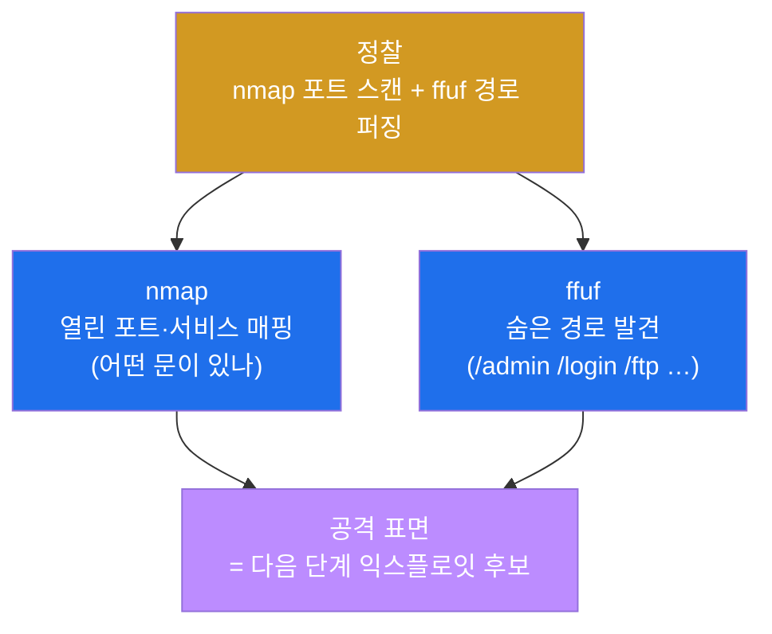
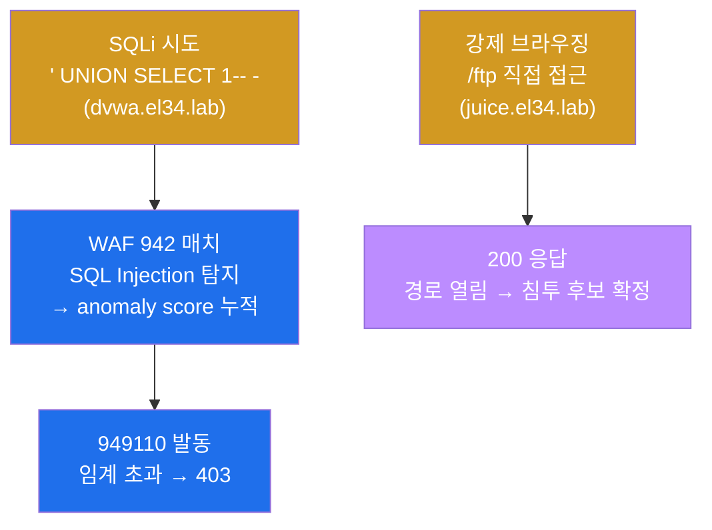
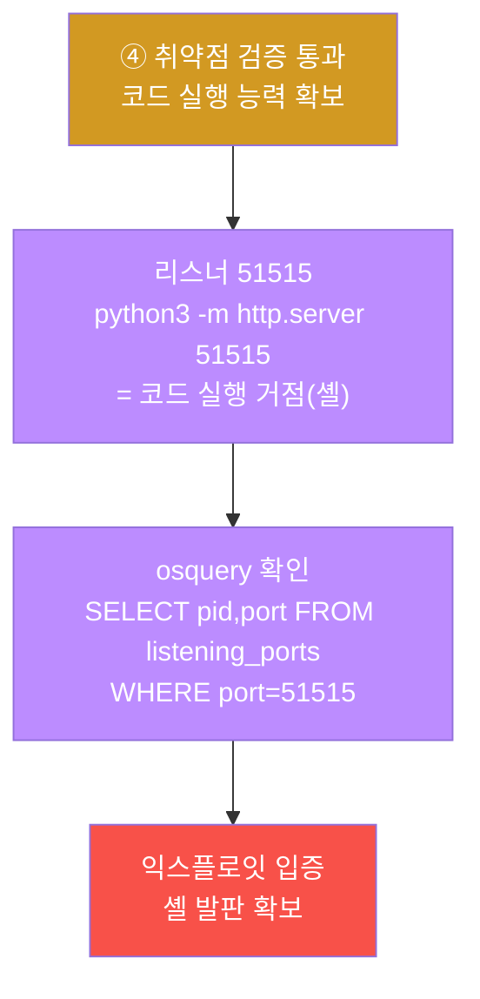
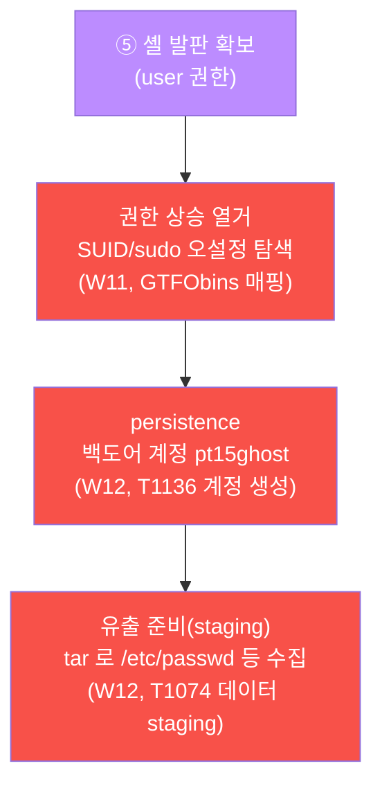
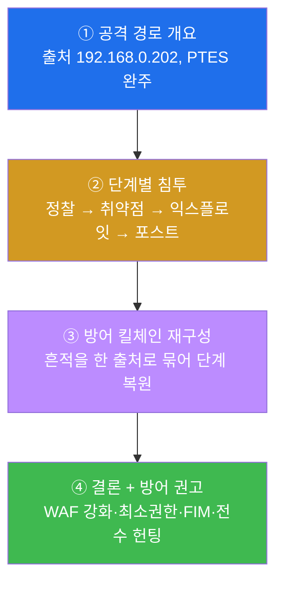
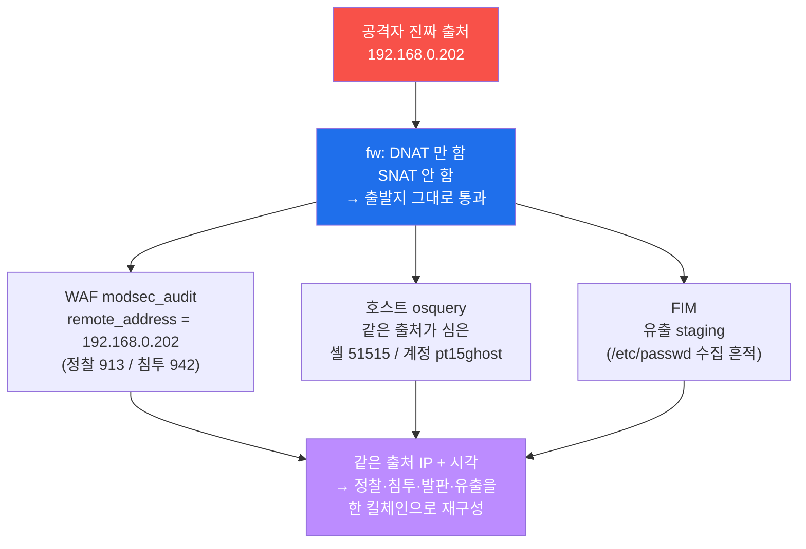
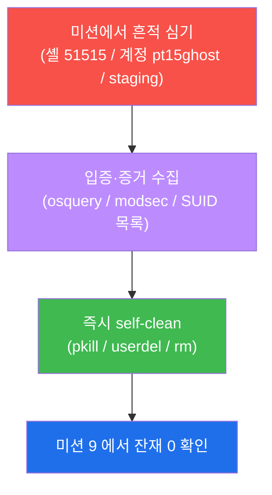
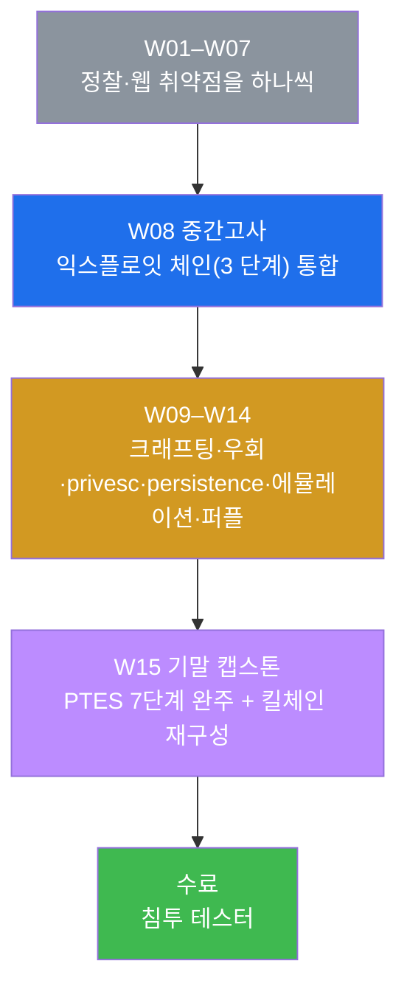

# 공격기법 W15 — 기말(수료) 캡스톤: PTES 7단계로 완주하는 한 번의 완전한 침투, 킬체인 재구성으로 막는 방어

> **본 주차의 한 줄 요약**
>
> 지난 14주 동안 학생은 정찰(W01–W02) · API/JWT 공격(W03) · SQL Injection(W04) ·
> XSS(W05) · 접근제어 우회(W06) · 경로순회/명령주입/SSRF(W07)를 익히고, W08 중간고사에서
> 정찰 → 웹 침투 → 셸 캡처의 **3 단계 익스플로잇 체인**을 처음으로 엮었다. 이어 패킷
> 크래프팅(W09) · 필터 우회(W10) · 권한 상승(W11) · persistence·안티포렌식(W12) · 자동
> 에뮬레이션(W13) · 퍼플 협업(W14)으로 침투의 후반부 전 기법을 더했다. 기말 캡스톤은
> 이 모든 무기를 **한 번의 완전한 침투** 안에, 침투 테스트의 산업 표준 방법론인 **PTES
> 7단계**(사전 교전 → 정보 수집(정찰) → 위협 모델링 → 취약점 분석 → 익스플로잇 →
> 포스트 익스플로잇 → 보고)에 따라 처음부터 끝까지 완주한다. 그런 다음 방어자의 시선으로
> 돌아서서, 그 침투가 5종 방어 계층에 남긴 흔적을 출처 IP 하나로 **한 킬체인으로 재구성**해
> 어느 단계서든 끊는 능력까지 입증한다.
>
> **공격자 한 줄 결론**: 캡스톤에서 점수가 되는 것은 "취약점을 하나 찾았다"가 아니라,
> **정찰부터 보고까지 PTES 전 단계를 빠짐없이 밟아 한 침투를 절차적으로 완주했는가**, 그리고
> **자기 침투가 방어 스택에 어떻게 보이는지 알고 그것을 한 킬체인으로 역재구성할 수 있는가**
> 다. 단일 기법은 한 점이고, **익스플로잇 체인 종합**은 그 점들을 PTES 라는 표준 공정 위에
> 순서대로 잇는 선이다. 이 한 침투를 끝까지 완주하면 공격기법 과정을 **수료**할 자격이 있다.

---

## 학습 목표

본 주차(기말 평가) 종료 시 학생은 다음 6가지를 **본인 손으로** 할 수 있어야 한다.

1. **PTES 7단계**(사전 교전 → 정보 수집(정찰) → 위협 모델링 → 취약점 분석 → 익스플로잇 →
   포스트 익스플로잇 → 보고)를 순서대로 말하고, W01–W14 에서 배운 개별 기법이 각각 **어느
   단계**에 속하는지를 한 표로 그린다.
2. PTES 2단계(정찰)를 `nmap`(포트)과 `ffuf`(경로)로 수행해 el34 의 **공격 표면**(열린 포트 +
   웹 경로)을 매핑하고, 이 정찰이 곧 다음 단계의 익스플로잇 후보가 됨을 설명한다.
3. PTES 4단계(취약점 분석)에서 SQLi(W04)와 강제 브라우징(W06)으로 침투 경로를 식별하고,
   PTES 5단계(익스플로잇)에서 **코드 실행 거점(셸)** 을 비표준 포트 **51515** 리스너로 확보해
   osquery 로 입증한다.
4. PTES 6단계(포스트 익스플로잇)에서 SUID/sudo 권한 상승 경로를 열거(W11)하고, 백도어 계정
   **pt15ghost**(W12)와 데이터 staging(유출 준비)을 재현한 뒤, 이 흔적을 osquery 로 확인한다.
5. el34 가 **SNAT 를 하지 않아 출처 IP(192.168.0.202)가 전 계층에 보존**됨을 이용해, 정찰·침투·
   발판·유출의 흩어진 흔적(WAF 913/942 + osquery + FIM)을 **한 킬체인으로 재구성**하고, 방어가
   어느 단계서든 체인을 끊으면 침투가 좌절됨(defense in depth)을 데이터로 보인다.
6. 위 전 과정을 PTES 전 단계의 무기·증거·방어 가시성으로 종합한 **침투 보고서**(PTES 7단계)를
   작성하고, 공유 인프라에 심은 모든 흔적(셸·계정·staging)을 self-clean 해 베이스 상태로
   복원한다.

---

## 0. 용어 해설 (캡스톤에서 다시 쓰는 핵심어)

본 주차는 W01–W14 의 용어를 한 침투 위에서 종합한다. 처음 나오거나 캡스톤에서 특히 중요한
용어를 다시 정리한다. 이미 앞 주차에서 정의한 용어라도, 캡스톤에서 **이 의미로 쓴다**는 것을
분명히 하기 위해 다시 적는다.

| 용어 | 영문 | 뜻 | 비유 |
|------|------|----|------|
| **PTES** | Penetration Testing Execution Standard | 침투 테스트를 누가 하든 일관되게 수행하도록 만든 산업 표준 7단계 방법론 | 집 짓는 표준 공정표(측량→설계→…→준공검사) |
| **캡스톤** | capstone | 과정 전체의 역량을 한 종합 과제로 완주·입증하는 마무리 평가 | 졸업 작품 — 배운 모든 기술을 한 작품에 담음 |
| **RoE** | Rules of Engagement | 교전 규칙 — 침투 테스트의 허용 범위·시간·방법을 합의한 경계선 | 모의훈련의 허가증과 안전 수칙 |
| **정찰** | Recon(naissance) | 공격 전 표적의 표면을 훑어 포트·서비스·경로를 찾는 단계 | 도둑이 집 주위를 돌며 약한 문을 찾음 |
| **공격 표면** | attack surface | 외부에서 닿을 수 있는 모든 입력점·포트·엔드포인트의 집합 | 건물의 모든 문·창문·환풍구 |
| **위협 모델링** | Threat Modeling | 정찰 결과를 보고 어떤 자산이 중요하고 어디로 들어갈지 분석하는 단계 | 답사 정보를 보고 침입 동선을 짜는 작전 회의 |
| **취약점 분석** | Vulnerability Analysis | 식별한 약점이 실제로 악용 가능한지 검증하는 단계 | 흔들어 본 문이 진짜 열리는지 확인 |
| **익스플로잇** | exploit / Exploitation | 검증된 취약점을 실제로 악용해 침투(코드 실행)하는 단계 | 열리는 문으로 안에 들어감 |
| **익스플로잇 체인** | exploit chain | 여러 단계·취약점을 순서대로 이어 최종 목표(코드 실행)에 도달하는 공격 경로 | 징검다리 — 돌 하나가 아니라 이어진 길 |
| **킬체인** | kill chain | 공격자가 목표까지 거치는 단계들의 연쇄(정찰→침투→발판→유출) | 절도단의 작업 순서 |
| **셸 발판** | shell foothold | 침입한 호스트에서 명령을 실행할 수 있는 거점(셸/리스너) | 안에서 확보한 작전 거점 |
| **포스트 익스플로잇** | Post-Exploitation | 침투 후 권한상승·지속성·측면이동·유출을 하는 단계 | 들어온 뒤 금고를 열고 물건을 반출 |
| **권한 상승** | Privilege Escalation | 낮은 권한(user)에서 높은 권한(root)으로 올라서는 것 | 일반 직원 출입증을 관리자 마스터키로 바꿈 |
| **persistence** | Persistence | 호스트를 재부팅·재로그인해도 다시 들어올 재진입 수단을 심는 것 | 몰래 만들어 둔 합법처럼 보이는 출입증 |
| **유출** | Exfiltration | 탈취 대상을 모아(staging) 외부로 빼내는 것 | 훔칠 물건을 한곳에 모아 반출 준비 |
| **침투 보고서** | pen-test report | 발견·증거·영향·권고를 PTES 단계로 정리해 의뢰인에게 제출하는 최종 산출물 | 공사 준공 보고서 |
| **익스플로잇 체인 종합** | chain synthesis | 흩어진 개별 기법을 PTES 위에 한 침투 경로로 엮어 완주하는 것 | 부품들을 설계도대로 조립한 완성품 |
| **킬체인 재구성** | kill-chain reconstruction | 방어자가 흩어진 로그를 모아 공격자의 체인을 한 줄로 다시 그림 | 흩어진 발자국을 이어 침입 동선 복원 |
| **출처 보존** | source preservation | SNAT 를 안 해서 공격자의 진짜 출발지 IP 가 전 계층에 남는 것 | 봉투의 보낸 주소가 위조 없이 그대로 남음 |
| **self-clean** | — | 실습 중 심은 흔적(셸·계정·staging)을 그 단계에서 스스로 정리함 | 훈련 후 사격장 탄피 회수 |

> **헷갈리기 쉬운 한 쌍 — 단일 기법 vs PTES 완주.** W01–W14 의 각 주차는 기법 **하나**(또는
> 한 단계)를 깊게 다뤘다. 그것은 "점"이다. W08 중간고사가 그 점들 중 3개(정찰·침투·셸)를
> 처음으로 이어 "짧은 선"을 그렸다면, 기말 캡스톤은 **PTES 라는 표준 공정 위에 점 전부를
> 순서대로 이어 한 번의 완전한 침투(긴 선)** 를 완주한다. 핵심 차이는 **절차성**이다 — 사전
> 교전(RoE)으로 시작해, 정찰로 표면을 그리고, 위협 모델링으로 동선을 짜고, 취약점 분석으로
> 입구를 검증하고, 익스플로잇으로 셸을 띄우고, 포스트 익스플로잇으로 권한을 올려 버티고
> 유출하고, 마지막에 보고서로 마감하는 **순서 전체**를 빠짐없이 밟는가. 캡스톤이 평가하는
> 핵심 능력이 바로 이 **"점을 PTES 공정 위의 한 선으로 잇는" 익스플로잇 체인 종합**이다.

---

## 1. 왜 단일 기법이 아니라 PTES 완주인가

### 1.1 한 줄 답: 침투 테스트의 가치는 "절차적으로 완주한 한 경로"에 있다

W01 에서 우리는 침투 테스트가 무작정 공격하는 행위가 아니라, **PTES 방법론**의 단계를 순서대로
밟는 **체계적 절차**라고 배웠다. 캡스톤은 그 방법론을 **한 사건 위에서 처음부터 끝까지** 완주해
보는 시험이다.

핵심은 **기법 하나가 곧 침투가 아니라는 것**이다. SQLi 를 하나 찾아도, 그것이 "어디로 들어가서
무엇을 할 수 있는가"로 이어지지 않으면 가치가 작다. 반대로, 사소해 보이는 정찰·접근제어 결함도
다른 기법과 **이어지면** 코드 실행·권한 상승·유출까지 도달할 수 있다. 이렇게 **여러 단계를
순서대로 잇는 한 침투 경로**가 익스플로잇 체인이고, PTES 는 그 경로를 누가 하든 일관되게 밟도록
정한 **표준 공정**이다. 캡스톤은 학생이 이 공정을 빠짐없이 밟아 한 침투를 완주했는지를 본다.



위 7단계에서 어느 한 단계라도 건너뛰면 침투가 무너진다. 정찰 없이는 들어갈 입구를 모르고,
취약점 분석 없이는 어떤 입구가 진짜 열리는지 모르며, 보고 없이는 발견이 의뢰인에게 가치로
전달되지 않는다. 그래서 캡스톤의 공격자는 **단계를 순서대로 밟는 절차적 사고**를 해야 한다.

### 1.2 W01–W14 의 개별 기법이 PTES 의 어느 단계에 들어가나

지난 14주의 각 기법은 PTES 라는 공정의 **부품**이다. 같은 7단계 위에 어느 주차의 기법이 어느
단계에서 쓰이는지를 겹쳐 그리면, 14주 동안 하나씩 익힌 무기가 한 침투 위에 전부 배치된다.



이 그림이 캡스톤 전체의 지도다. 정찰(W01–W02)이 표면을 그리고, 웹 취약점(W03–W07)이 침투할
입구를 검증하고, 익스플로잇 체인·우회(W08·W10)가 코드 실행 거점을 확보하고, 권한상승·
persistence·에뮬레이션(W11–W14)이 침투의 후반부(포스트 익스플로잇)를 채운다. 학생이 시험에서
할 일은 이 지도를 실제 명령과 증거로 채우며 PTES 전 단계를 완주하는 것이다.

> **W08 중간고사와의 관계.** W08 은 PTES 의 ②정찰·④취약점분석·⑤익스플로잇의 첫 발(셸)까지를
> "짧은 익스플로잇 체인"으로 다뤘다. 기말은 여기에 **⑥포스트 익스플로잇(권한상승·persistence·
> 유출)** 과 **⑦보고** 를 더해 PTES 전 주기를 완주한다. W11–W14 에서 배운 무기(privesc·
> persistence·에뮬레이션)가 비로소 한 침투 안에서 제 역할을 한다.

### 1.3 "왜 중요한가" — 좋은 공격자는 자기 침투가 어떻게 보이는지 안다

W01 에서 강조했듯, el34 는 공격자의 출처 IP 를 fw → ips → web 전 계층에 **보존**한다(SNAT 없음).
그래서 이 트랙은 공격 과목이지만 학생은 **자기 침투가 방어 스택에 어떻게 보이는지**를 동시에
학습한다. 캡스톤이 단순히 "셸을 땄다 / 권한을 올렸다"로 끝나지 않고 **방어자 관점의 킬체인
재구성**까지 요구하는 이유가 여기에 있다. 좋은 공격자(레드팀)는 자기 침투가 WAF·IDS·호스트
로그에 어떤 흔적으로 남는지 알아야, 실전에서 탐지를 회피하거나(고급), 방어자(블루팀)와 협업해
탐지를 개선(퍼플팀, W14)할 수 있다. 침투 테스트의 최종 산출물인 보고서도, 발견을 "방어가
어디서 끊을 수 있었는가"로 설명할 수 있어야 의뢰인에게 가치가 된다.

### 1.4 한계 — 이 캡스톤이 다루는 범위

본 캡스톤은 W01–W14 의 범위 안에서 한 침투를 PTES 로 완주·평가한다. 실제 침투는 더 많은 단계와
정교한 회피를 쓰지만(예: 0-day, 합법 도구 악용, 장기 잠복, 실데이터 유출), 본 시험은 14주에
배운 무기로 **정찰·검증·익스플로잇·포스트·보고가 가능한 형태**로 7단계를 재현한다. 또한 권한
상승·유출은 공유 인프라 보존을 위해 **열거·staging 까지(읽기전용·소량)** 로 제한하며(실제
root 탈취·실데이터 반출은 하지 않는다), 모든 행위는 학습용 마커(`pt15*`, 포트 51515, 계정
pt15ghost, staging `pt15_exfil.tar.gz`)를 써 다른 학생·운영과 겹치지 않게 하고, 끝나면 전부
정리한다(§8).

---

## 2. PTES 7단계 상세 — 한 침투를 어느 무기로 완주하나

이번 시험의 시나리오는 한 외부 침입자(`외부 공격자 VM 192.168.0.202`, 출처 IP `192.168.0.202`)가 fw 의
게이트웨이(`192.168.0.161`)를 통해 el34 의 웹 자산(`juice.el34.lab` / `dvwa.el34.lab`)을 노려
PTES 7단계를 완주하는 것이다. el34 는 SNAT 를 하지 않으므로 출처 IP `192.168.0.202` 가 모든
단계·모든 계층에 그대로 보존된다(§4).

> ⚠️ **인가된 실습만.** 이 트랙의 모든 공격은 **인가된 실습 환경(el34)** 안에서, 정해진 대상
> (`외부 공격자 VM 192.168.0.202` → el34 내부 vhost / `el34-web` 호스트)에 한해서만 수행한다. RoE(범위·시간·
> 방법)를 벗어나거나 실제 외부 시스템을 대상으로 한 시도는 불법이며(정보통신망법 등) 본 과정의
> 윤리 규정을 위반한다. 셸·계정·staging 같은 흔적은 입증 직후 **반드시 self-clean** 한다(§8).

### 2.1 ① 사전 교전(Pre-engagement) — RoE 합의

**한 줄 정의.** 사전 교전은 실제 행동 전에, 무엇을·언제·어떻게 공격해도 되는지(그리고 무엇이
금지인지)를 의뢰인과 문서로 합의하는 단계다(PTES 1단계, W01 복습).

**무엇을 하나.** 침투 테스터는 본격 정찰에 앞서 **RoE(Rules of Engagement)** 를 확정한다 —
범위(어떤 IP·도메인까지), 시간(언제), 방법(무엇이 금지: DoS·실데이터 유출 등), 증거(모든
행동을 기록). 본 캡스톤에서 이 RoE 는 "인가된 실습 환경 el34 안에서, 정해진 마커(`pt15*`)로,
읽기전용·소량으로, 끝나면 self-clean"으로 고정된다. lab 의 첫 미션(점검)이 곧 이 단계의
실무적 출발점 — 공격 도구가 갖춰졌고 대상에 도달 가능한지부터 확인한다.

**el34 에서 어떻게.** 캡스톤의 사전 교전은 두 가지를 점검하는 것으로 구현된다 — (1) 공격 도구
(`nmap`/`ffuf`/`sqlmap`)가 `외부 공격자 VM 192.168.0.202` 에 준비됐는지, (2) 대상 vhost 가 응답하는지. 도구가
없거나 대상이 무응답이면 침투를 시작할 수 없다.

**한계.** 사전 교전은 기술적 단계가 아니라 **합의·점검**의 단계다. 여기서 정한 RoE 를 벗어나는
순간, 아무리 뛰어난 기법도 합법이 아닌 불법이 된다. 캡스톤이 인가된 마커·범위를 고정하는 이유다.

### 2.2 ② 정보 수집(정찰) — nmap + ffuf 로 공격 표면 매핑

**한 줄 정의.** 정찰은 표적의 표면을 훑어 어떤 포트·서비스·경로가 있는지 알아내는 단계다(PTES
2단계, W01–W02 복습).

**무엇을 하나.** 공격자는 `nmap` 으로 열린 포트·서비스를, `ffuf` 로 숨은 웹 경로(예: `/admin`,
`/login`, `/ftp`)를 매핑한다. el34 의 fw 는 공개 포트를 DNAT 로 내부에 전달하므로, 공격자는 fw
게이트웨이(`192.168.0.161`)의 80/443 등을 스캔하고 vhost 별로 경로를 퍼징해 "어디로 들어갈 수
있는가"를 그린다. 이때 발견한 열린 포트·웹 경로가 곧 다음 단계의 **익스플로잇 후보**다.



> **용어 — nmap / ffuf.** **nmap** 은 가장 널리 쓰이는 네트워크 스캐너다. `-p` 로 포트를,
> `-T4` 로 빠른 타이밍을 지정한다(빠를수록 IDS 에 시끄럽게 잡힘 — 은밀성↔속도 trade-off, W01).
> **ffuf** 는 URL 의 `FUZZ` 자리에 단어 목록을 대입해 존재하는 경로를 찾는 웹 퍼저다(W02).
> `-mc 200,301,403` 은 그 응답 코드만 "발견"으로 친다. (참고 — el34 에서 `gobuster` 는 동작이
> 불안정해 퍼징은 `ffuf` 를 표준으로 쓴다.)

**el34 에서 어떻게 잡히나.** 같은 정찰 행위가 방어 스택에 흔적을 남긴다. 빠른 포트 스캔은
Suricata(IDS)에, 자동화 스캐너의 UA·다량 경로 탐색은 WAF 의 CRS **913 룰군(scanner detection)**
에 잡힌다. 정찰은 킬체인에서 가장 시끄러운 단계다.

**한계.** 방화벽은 이 단계의 HTTP 의미(스캐너 UA·경로)를 **못 본다**(L3/L4 만 보므로). 정찰 탐지는
IDS/WAF 의 영역이다.

### 2.3 ③ 위협 모델링(Threat Modeling) — 정찰 결과로 침투 동선 짜기

**한 줄 정의.** 위협 모델링은 정찰로 얻은 표면을 보고 "어떤 자산이 중요하고, 어디로 들어가는
것이 가장 효율적인가"를 분석하는 단계다(PTES 3단계, W01).

**무엇을 하나.** 공격자는 정찰에서 나온 vhost·경로·서비스를 놓고 침투 동선을 설계한다. 예를
들어 el34 에서는 "`dvwa.el34.lab` 은 WAF 차단 모드(403)라 정직한 SQLi 가 막히고, `juice.el34.lab`
은 탐지만 모드(200)라 우회 여지가 크며, `/ftp` 같은 강제 브라우징 경로가 열려 있다"는 정찰
사실로부터 **가장 취약하거나 차단되지 않는 경로**를 고른다. 위협 모델링은 별도 명령이라기보다,
②정찰과 ④취약점 분석 사이에서 공격자가 **판단**하는 단계다.

**el34 에서 어떻게.** 캡스톤에서 위협 모델링은 §6 판단 프레임워크 표로 구체화된다 — "어느 단계에
어느 도구를 쓰고, 그 단계가 어느 흔적을 남기는가"를 머릿속에 두고 침투 우선순위를 정하는 것이
곧 위협 모델링의 실천이다.

**한계.** 위협 모델링은 정찰이 충분해야 의미가 있다. 표면을 얕게 그리면 잘못된 입구를 골라 시간을
낭비하고 방어 스택에 시끄러운 흔적만 남긴다 — "충분한 정찰이 곧 좋은 위협 모델링"이다(W01).

### 2.4 ④ 취약점 분석(Vulnerability Analysis) — SQLi + 강제 브라우징 검증

**한 줄 정의.** 취약점 분석은 위협 모델링으로 고른 입력점이 실제로 악용 가능한지 검증하는
단계다(PTES 4단계, W03–W07 복습).

**무엇을 하나.** 공격자는 후보 입력점에 **SQL Injection(SQLi)**(파라미터에 `' UNION SELECT 1-- -`
같은 SQL 조각 주입, W04)과 **강제 브라우징**(권한·링크 없이 `/ftp` 같은 경로에 직접 접근,
W06)을 시도해 "이 경로가 진짜 열리는가"를 확인한다. el34 에서 dvwa 는 차단 모드라 SQLi 가 403
으로 막히고(이 403 자체가 "차단형 자산"이라는 정보), juice 의 `/ftp` 는 200 으로 열려 강제
브라우징이 통한다.



> **용어 — UNION SELECT / 강제 브라우징.** **UNION SELECT** 는 원래 DB 질의 결과에 공격자가
> 고른 다른 결과를 덧붙여 빼내는 전형적 SQLi 기법이다(W04). **강제 브라우징(forced browsing)**
> 은 정상 화면의 링크를 따라가지 않고, 존재하리라 추측되는 경로(`/ftp`, `/admin`)에 URL 로 직접
> 접근해 접근제어 결함을 찌르는 기법이다(W06, OWASP A01). 본 캡스톤의 SQLi 페이로드는 URL
> 인코딩되어(`%27%20UNION%20SELECT%201--`) 전송된다.

**el34 에서 어떻게 막히나/열리나.** dvwa 의 차단(403)은 단일 룰의 결과가 아니다 — CRS 는 룰
위반마다 **anomaly score** 를 누적하고(942 가 SQLi 점수를 올림), 누적이 임계를 넘으면 **949110
(Inbound Anomaly Score Exceeded)** 이 발동해 403 으로 차단한다(W04–W05). 반대로 juice 의 `/ftp`
강제 브라우징은 200 으로 열려, 공격자는 차단되지 않는 이 경로를 침투 후보로 확정한다.

**한계.** 취약점 분석은 "악용 가능성 검증"까지다. 실제 침투(코드 실행)는 다음 단계(⑤
익스플로잇)에서 한다. 또 네트워크 장비(IDS/방화벽)는 이 단계의 호스트 내부 결과를 못 본다.

### 2.5 ⑤ 익스플로잇(Exploitation) — 코드 실행 거점(셸) 확보

**한 줄 정의.** 익스플로잇은 검증된 취약점으로 실제 침투해 표적 호스트에서 **명령을 실행할 수
있는 거점(셸)** 을 확보하는 단계다(PTES 5단계, W08 복습).

**왜 셸이 정점인가.** 침투의 정점은 "DB 를 읽었다"보다 **"임의 코드를 실행할 수 있다"** 이다.
일단 셸을 얻으면 공격자는 파일 탈취·권한 상승·측면 이동·persistence 등 무엇이든 할 수 있다.
그래서 캡스톤은 **코드 실행 거점의 확보** 자체를 익스플로잇 성공의 증거로 삼는다.

**el34 에서 셸의 형태 — 리스너 포트 51515.** 본 캡스톤의 셸은 표적 호스트(web)에 **비표준 포트
51515 에 리스너를 띄우는 것**이다. 리스너가 떠 있다는 것은 그 호스트에서 임의 프로세스를 실행할
수 있었다는 증거이며, 곧 코드 실행 거점(셸)이 확보되었다는 뜻이다. 확보 여부는 **osquery** 로
확인한다 — "포트 51515 를 어떤 프로세스가 듣고 있는가"를 SQL 로 질의해 입증한다.



> **용어 — 리스너 / osquery.** **리스너**는 특정 포트에서 외부 연결을 기다리는 프로세스로,
> 공격자가 셸을 외부와 잇는 통로로 흔히 쓴다. `python3 -m http.server 51515` 는 포트 51515 에
> 리스너를 띄우는 가장 단순한 방법으로, "이 호스트에서 임의 프로세스를 실행할 수 있다"는 거점을
> 모사한다. **osquery** 는 OS 를 SQL 테이블로 질의하는 호스트 가시화 도구다(W06). 실전의 리버스
> 셸·webshell 도 결국 "표적에서 임의 코드를 실행한다"는 본질은 같다.

**공유 인프라 — 즉시 정리.** 이 셸(리스너)은 osquery 로 확인한 **즉시 종료(pkill)** 한다. el34
는 여러 학생이 함께 쓰는 공유 인프라이므로, 익스플로잇을 입증한 뒤에는 흔적을 남기지 않는다(§8).

### 2.6 ⑥ 포스트 익스플로잇(Post-Exploitation) — 권한 상승 → persistence → 유출

**한 줄 정의.** 포스트 익스플로잇은 셸을 확보한 공격자가 권한을 올리고, 재진입 수단을 심고,
데이터를 빼낼 준비를 하는 단계다(PTES 6단계, W11–W12 복습). 침투의 "성과"가 여기서 나온다.

**무엇을 하나 — 세 갈래.** 캡스톤의 포스트 익스플로잇은 세 가지를 차례로 다룬다.



- **권한 상승 열거(W11).** user 셸에서 `find / -perm -4000`(SUID 바이너리)과 `sudo -l`(sudo
  권한)로 root 로 올라설 경로를 찾는다. 발견한 SUID 바이너리는 **GTFObins**(악용 가능한 표준
  바이너리 사전)에 매핑해 root 획득 여부를 판단한다. **캡스톤은 공유 인프라 보존을 위해 실제
  상승 대신 열거까지(읽기전용)** 만 수행한다.
- **persistence(W12).** 재부팅·재로그인해도 다시 들어올 **백도어 계정**(`pt15ghost`)을 만들어
  정상 계정처럼 위장한다. 이는 MITRE ATT&CK **T1136(Create Account)** 에 해당한다.
- **유출 준비(staging, W12).** 탈취 대상을 한곳에 모으는(staging) 행위를 `tar` 로 모사한다(예:
  `/etc/passwd`, `/etc/hostname` 을 `pt15_exfil.tar.gz` 로). 실제 외부 반출은 하지 않고
  **staging 까지(소량)** 만 한다 — MITRE **T1074(Data Staged)**.

> **용어 — SUID / GTFObins / MITRE ATT&CK.** **SUID** 비트가 붙은 바이너리는 실행 시 소유자
> (흔히 root) 권한으로 동작한다 — 오설정되면 권한 상승의 사다리가 된다(W11). **GTFObins** 는
> "이 표준 바이너리를 이렇게 쓰면 셸/권한을 얻는다"를 모은 공개 사전이다. **MITRE ATT&CK** 는
> 실제 공격에서 관찰된 전술·기법을 표준 번호(예: `T1136`)로 정리한 지식 베이스로(W13),
> persistence·유출 같은 행위에 공통 언어를 준다.

**el34 에서 어떻게 잡히나.** 이 단계는 네트워크 장비(방화벽·IDS·WAF)가 모두 못 보는 **호스트
내부**에서 일어난다. 백도어 계정과 staging 흔적은 **osquery**(`users` 테이블, W06–W07)와 Wazuh
FIM(`/etc/passwd` 변경 감시)이 사냥한다.

**한계.** 캡스톤의 포스트 익스플로잇은 **열거·재현·staging 까지**다. 실제 root 탈취, 측면 이동,
실데이터 외부 반출은 공유 인프라·윤리상 하지 않는다. "공격을 알아야 방어가 보인다" — 이 흔적이
어떤 모습인지 알아야 다음 단계(방어 킬체인 재구성)에서 사냥할 수 있다.

### 2.7 ⑦ 보고(Reporting) — PTES 전 단계 + 방어 킬체인 종합

**한 줄 정의.** 보고는 전 단계의 발견·증거·영향·권고를 의뢰인에게 전달하는 침투 테스트의 **최종
산출물**이다(PTES 7단계). 실무에서 가장 중요한 단계다.

**무엇을 하나.** 공격자는 ①~⑥ 을 한 **침투 보고서**로 종합한다 — 어느 단계에서·어느 도구로·어떤
증거가 나왔고, 그것이 어떤 영향을 주며, 방어가 어디서 끊을 수 있었는가(권고). 캡스톤의 보고서는
공격 경로(정찰→취약점→익스플로잇→포스트)와 **방어 킬체인 재구성**(§4)을 함께 담아, "이 침투가
다층 방어로 어느 단계서든 끊겼을 것"이라는 권고로 마감한다.

**el34 에서 어떻게.** lab 의 보고서 미션은 PTES 전 단계를 표로 정리하고, 마지막에 방어 우선순위
(WAF 강화·최소권한·FIM·전수 헌팅)를 권고하는 양식을 따른다(§3).

**한계.** 보고서의 가치는 **증거**에 있다. "셸을 땄다 / 권한을 올렸다"는 선언이 아니라, 스캔
결과·응답 코드·osquery 결과·룰 ID 같은 증거가 동반되어야 침투 테스트가 완결된다.

---

## 3. 침투 보고서 — PTES 전 단계 종합 (수료의 마무리)

캡스톤의 마무리는 **침투 보고서**(PTES 7단계)다. 개별 기법을 넘어, 7단계를 한 침투로 종합하고
방어 권고까지 담는 것이 침투 테스터의 최종 산출물이다.

> **용어 — 침투 보고서.** 침투 테스트 종료 후 의뢰인(경영진·보안팀)에게 제출하는 문서로,
> **무엇을·어느 단계에서·어느 증거로 했고, 그 영향은 무엇이며, 어떻게 방어할 것인가** 를 담는다.
> 발견을 단일 취약점 나열이 아니라 **공격 경로(체인)** 로 설명하는 것이 핵심이다.

### 3.1 보고서가 채워야 할 PTES 단계 표

| PTES 단계 | 공격(무엇을) | 사용 기법(W#) | 핵심 증거 |
|-----------|------------|--------------|-----------|
| ① 사전 교전 | RoE 합의 + 도구·대상 점검 | W01 | 도구 경로 / 대상 응답 |
| ② 정찰 | 포트·경로 매핑 | nmap·ffuf (W01–W02) | open 포트 / 발견 경로 |
| ③ 위협 모델링 | 침투 동선·우선순위 판단 | W01 (판단) | 차단형 vs 탐지형 자산 식별 |
| ④ 취약점 분석 | SQLi·강제 브라우징 검증 | W04·W06 | sqli=403 / ftp=200 |
| ⑤ 익스플로잇 | 셸 발판(51515) 확보 | W08 | osquery listening_ports 51515 |
| ⑥ 포스트 | privesc 열거 + pt15ghost + staging | W11·W12 | SUID 목록 / users / pt15_exfil |
| ⑦ 보고 | 전 단계 + 방어 킬체인 종합 | 전 주차 | 본 표 + 방어 권고 |

이 표를 **증거와 함께** 채울 수 있으면 공격기법 과정을 수료할 자격이 있다. 핵심은 마지막 열 —
"했다"가 아니라 **증거(스캔 결과·응답 코드·osquery·SUID 목록)** 가 점수다.

### 3.2 침투 보고서의 표준 구조

좋은 침투 보고서는 다음 흐름을 따른다(lab STEP 8 양식).



이 구조는 실제 침투 테스트 종료 후 의뢰인에게 제출하는 보고서의 표준이다 — 개요 → 공격 경로 →
방어 관점 → 결론·권고. 특히 마지막 "방어 권고"에 **"어느 단계서든 한 곳만 끊으면 침투가
좌절된다"**(defense in depth)를 담는 것이 공방 통합 과정의 특징이다. 공격자가 자기 침투를 방어
관점으로도 설명할 수 있을 때, 보고서는 비로소 의뢰인에게 가치가 된다.

---

## 4. 출처 IP 보존 — 흩어진 흔적을 한 킬체인으로 묶는 키

### 4.1 왜 출처 보존이 킬체인 재구성의 전제인가

PTES 의 각 단계는 서로 다른 장비에 흔적을 남긴다 — 정찰은 IDS·WAF 에, 침투(SQLi)는 WAF 에,
셸·발판은 호스트(osquery)에, 유출 staging 은 FIM 에. 이 흩어진 흔적을 한 공격자의 한 침투로
묶으려면 **공통 키**가 필요한데, 그 핵심이 **출처 IP** 다.

> **헷갈리기 쉬운 한 쌍 — SNAT vs DNAT(W08 복습).** 둘 다 NAT(주소 변환)지만 바꾸는 곳이
> 정반대다. **DNAT** 는 **목적지**를 바꾼다 — el34 의 fw 가 공개 주소 `192.168.0.161` 로 온 요청을
> 내부 web `10.20.32.80` 으로 보내는 것. **SNAT** 는 **출발지**를 바꾼다 — 만약 el34 가 SNAT 를
> 했다면 안쪽 장비들은 공격자의 진짜 IP 대신 fw 의 IP 만 보게 된다(봉투의 보낸 사람을 위조).
> **el34 는 SNAT 를 하지 않는다.**

### 4.2 el34 는 출처를 보존한다 — 그래서 킬체인이 보인다



fw 가 SNAT 를 하지 않으므로, 안쪽의 모든 장비가 공격자의 **진짜 출처 IP `192.168.0.202`** 를
본다. ModSec 의 `remote_address`, 그 출처가 호스트에 심은 셸·계정, FIM 이 잡는 staging 이 모두
같은 IP 로 연결된다. 이 한 IP 가 정찰·침투·발판·유출이라는 흩어진 흔적을 **한 침투의 한 킬체인**
으로 엮는 키다(lab STEP 7 의 재구성이 바로 이것을 보인다). 방어의 핵심은 — 이렇게 재구성된
킬체인의 **어느 한 단계라도 탐지·차단하면 침투 전체가 좌절된다**(defense in depth).

el34 의 4-tier 세그먼트는 `ext 10.20.30` / `pipe 10.20.31` / `dmz 10.20.32` / `int 10.20.40`
이며, 공격자(ext .202) → fw(ext .1) → web(dmz .80) 경로로 흐른다.

---

## 5. 단계·도구별 빠른 복습 — "어느 단계에 무엇을 어디서"

캡스톤에서 각 단계를 수행·검증하는 핵심 명령을 한 번에 정리한다. 모든 명령은 el34
침투로 얻은 표적 web 셸 `ssh ccc@10.20.32.80`(비번 1, root 작업 sudo)에서 실행한다.

### 5.1 ② 정찰 — 외부 공격자 VM 192.168.0.202 / nmap + ffuf — W01–W02

nmap 은 포트 스캐너, ffuf 는 웹 경로 퍼저다. 공격자 컨테이너에서 fw 게이트웨이의 공개 포트와
vhost 경로를 매핑한다.

```bash
# 포트 스캔
nmap -p 80,443,8001 192.168.0.161 -T4 --max-retries 1 2>/dev/null | grep -E "open|PORT"
# 경로 퍼징 (juice vhost)
printf "admin\nlogin\nftp\n" > /tmp/pt15.txt; ffuf -u http://juice.el34.lab/FUZZ -w /tmp/pt15.txt -mc 200,301,403 -s 2>&1 | head -5; rm -f /tmp/pt15.txt
```

무엇을 보나 — 어떤 포트가 `open` 이고 어떤 경로가 응답하는가. 열린 포트·경로가 다음 단계의
익스플로잇 후보다. 임시 단어 목록(`/tmp/pt15.txt`)은 쓰고 바로 지운다.

### 5.2 ④ 취약점 분석 — 외부 공격자 VM 192.168.0.202 / nc SQLi + 강제 브라우징 — W04·W06

SQLi 는 입력에 SQL 문법을 주입(W04), 강제 브라우징은 경로에 직접 접근(W06)하는 기법이다.

```bash
# SQLi (dvwa=차단 모드 → 403 이 정상)
echo -n "sqli=$(echo -en 'GET /?id=pt15%27%20UNION%20SELECT%201-- HTTP/1.0\r\nHost: dvwa.el34.lab\r\nUser-Agent: sqlmap/1.7\r\nConnection: close\r\n\r\n' | nc -w3 192.168.0.161 80 | head -1 | grep -oE '[0-9]{3}') "
# 강제 브라우징 (juice /ftp → 200 이 정상)
echo "ftp=$(echo -en 'GET /ftp HTTP/1.0\r\nHost: juice.el34.lab\r\nConnection: close\r\n\r\n' | nc -w3 192.168.0.161 80 | head -1 | grep -oE '[0-9]{3}')"
```

무엇을 보나 — `sqli=403`(dvwa 차단 모드라 WAF 가 942→949110 으로 차단=탐지), `ftp=200`(juice
의 강제 브라우징 경로가 열림=침투 후보 확정). 403 은 "차단형 자산"이라는 신호다.

### 5.3 ⑤ 익스플로잇 — el34-web / python3 리스너 + osquery — W08

코드 실행 거점을 비표준 포트 51515 리스너로 모사하고, osquery 로 확인한다. osquery 는 OS 를
SQL 로 질의하는 도구다(W06).

```bash
ssh ccc@10.20.32.80 'nohup python3 -m http.server 51515 >/dev/null 2>&1 & echo shell'
# 고정 sleep 대신 리스너/프로세스가 뜰 때까지 조건 대기(zero-sleep)
timeout 10 bash -c 'until pgrep -f "http.server 51515" >/dev/null; do :; done' || true
ssh ccc@10.20.32.80 "ss -tlnp | grep ':51515'"
ssh ccc@10.20.32.80 'pkill -f "[h]ttp.server 51515"; true'
```

무엇을 보나 — osquery 결과에 포트 51515 와 그 주인 프로세스(pid)가 보이면 셸 발판 확보 입증.
**확인 즉시 pkill 로 정리한다**(대괄호 `[h]` 는 grep/pkill 이 자기 자신을 매치하지 않게 하는
트릭).

### 5.4 ⑥ 권한 상승 열거 — el34-web / find SUID + id — W11

user 권한에서 root 로 올라설 사다리(SUID 바이너리·sudo 권한)를 열거한다(GTFObins 매핑).

```bash
ssh ccc@10.20.32.80 'find / -perm -4000 -type f 2>/dev/null | head -5; id'
```

무엇을 보나 — SUID 바이너리 목록과 현재 사용자의 그룹. 이를 GTFObins 에 매핑하면 root 경로가
보인다. **캡스톤은 열거까지(읽기전용)** — 실제 상승은 하지 않는다.

### 5.5 ⑥ persistence + 유출 staging — el34-web / useradd + tar + osquery — W12

백도어 계정(persistence)과 데이터 staging(유출 준비)을 재현하고, osquery 로 계정을 확인한다.

```bash
ssh ccc@10.20.32.80 'sudo id pt15ghost >/dev/null 2>&1 && userdel -r pt15ghost; sudo useradd -m -s /bin/bash pt15ghost; tar czf /tmp/pt15_exfil.tar.gz /etc/passwd; echo "persist+exfil"'
ssh ccc@10.20.32.80 'sudo osqueryi --json "SELECT username FROM users WHERE username=\"pt15ghost\";"'
```

무엇을 보나 — `users` 에 백도어 계정 `pt15ghost` 가, `/tmp` 에 staging 아카이브가 생겼는지(T1136
계정 생성 + T1074 데이터 staging). 계정은 다음 미션(방어 재구성)에서 사냥할 대상으로 남긴다.

### 5.6 방어 — el34-web / modsec 흔적 + osquery — 킬체인 재구성

방어자는 WAF audit 흔적(매치된 CRS 룰 ID)과 osquery(호스트 발판)로 킬체인을 재구성한다.

```bash
# WAF 흔적: 매치된 CRS 룰 ID (913 정찰 / 942 SQLi 등)
ssh ccc@10.20.32.80 'sudo tail -120 /var/log/apache2/modsec_audit.log | grep -oE "9[0-9]{5}" | sort -u | head'
# 호스트 발판: 백도어 계정
ssh ccc@10.20.32.80 'sudo osqueryi --json "SELECT username FROM users WHERE username=\"pt15ghost\";"'
```

무엇을 보나 — WAF 흔적에 913(정찰)·942(SQLi)가 보이고, osquery 에 발판 흔적(pt15ghost)이
보이는지. 이 흔적들을 출처 IP `192.168.0.202` 로 묶으면 정찰→침투→발판→유출의 한 킬체인이 된다.

> **용어 — anomaly score / 949110.** ModSec CRS 는 룰 위반마다 점수를 누적하고(예: 942 가 SQLi
> 점수를 올림), 누적이 임계를 넘으면 **949110(Inbound Anomaly Score Exceeded)** 이 발동해 403
> 으로 차단한다(W04–W05). "단일 룰 차단"이 아니라 "누적 임계 초과 차단"이라는 2 단계 구조다.

---

## 6. 판단 프레임워크 — "어느 단계에 어느 도구·기법인가"

캡스톤의 가장 중요한 능력은 **"이 단계에서 어느 도구·기법을 쓰고, 그 단계가 어느 흔적을
남기는가"** 를 즉시 판단하는 것이다(이 판단 자체가 PTES ③위협 모델링의 실천이다). 다음 표가 그
판단의 정답지다. 학생은 이 표를 머릿속에 두고, 각 단계를 알맞은 도구로 수행한 뒤 그 증거를
제시한다.

| PTES 단계 | 공격자 도구·기법(W#) | 노리는 것 | 남기는 흔적(방어 가시성) |
|-----------|---------------------|----------|------------------------|
| ① 사전 교전 | RoE 합의 + 도구·대상 점검 (W01) | 합법 범위·도달성 확보 | (기록) 도구 경로·대상 응답 |
| ② 정찰 | nmap 포트 + ffuf 경로 (W01–W02) | 공격 표면(포트·경로) | WAF 913 / IDS 스캔 시그니처 |
| ③ 위협 모델링 | 차단형/탐지형 판단 (W01) | 효율적 침투 동선 | (분석) 우선순위 결정 |
| ④ 취약점 분석 | SQLi·강제 브라우징 (W04·W06) | 악용 가능 입력 검증 | WAF 942→949110 403 / access.log |
| ⑤ 익스플로잇 | 리스너 51515 = 코드 실행 거점 (W08) | 셸 발판 | osquery listening_ports / 호스트 포트 |
| ⑥ 포스트 | SUID 열거·pt15ghost·staging (W11·W12) | 권한·지속성·유출 | osquery users / FIM(/etc/passwd) |
| ⑦ 보고 | PTES + 방어 킬체인 종합 (전 주차) | 가치 전달 | 본 보고서(증거 동반) |

이 표를 읽는 법은 두 방향이다. **"무엇으로 수행하나"** — 정찰은 nmap·ffuf, 침투는 SQLi·강제
브라우징, 익스플로잇은 셸 리스너, 포스트는 SUID 열거·계정·staging. 그리고 **"어떤 흔적을
남기나"** — 정찰은 WAF 913, 침투는 WAF 942, 셸·발판은 호스트 osquery, 유출은 FIM. 공격자가 두
방향을 모두 말할 수 있으면 "자기 침투가 어떻게 보이는지 아는 좋은 공격자"가 된 것이다.

> **시험의 채점 포인트.** 각 단계를 올바른 도구로 수행하고, 그 증거(스캔 결과·응답 코드·osquery
> 결과·SUID 목록)를 제시하며, 마지막에 흩어진 흔적을 방어자 관점으로 한 킬체인으로 재구성하고
> PTES 보고서로 종합하는 것. "했다"는 선언이 아니라 **증거**가 점수다. 합격 임계값은 0.7 이다.

---

## 7. 실습 안내 — 캡스톤 lab 9 미션 (4 축 설명)

캡스톤 실습은 9 미션으로 구성된다. 각 미션을 **4 축**으로 설명한다 — 왜 하는가 / 무엇을 알 수
있는가 / 결과 해석(정상 vs 비정상) / 실전 활용. 미션은 PTES 를 따라 점검(①사전 교전) → ②정찰 →
④취약점 분석 → ⑤익스플로잇 → ⑥권한상승 → ⑥persistence·유출 → 방어 킬체인 재구성 → ⑦보고 →
정리 순서로 흐른다.

> **시험 진행 원칙.** 공격은 `ssh att@192.168.0.202`(자연 URL), 침투 후 단계는 표적 web 셸
> `ssh ccc@10.20.32.80`(root 작업 sudo)에서. **인가된 실습 환경(el34)에서만** 수행한다. 셸(리스너)·계정·staging 은 각
> 미션에서 심으면 그 미션에서 정리한다(self-clean). 합격 임계값은 0.7 이다.

### 미션 1 — 점검(①사전 교전): 전 도구 (8점, survey)

> **왜 하는가?** PTES 의 출발(사전 교전)은 RoE 확인 직후 도구·대상 점검이다. 침투의 전제는 전
> 단계를 수행할 공격 도구가 갖춰져 있어야 한다는 것이다.
>
> **무엇을 알 수 있는가?** `외부 공격자 VM 192.168.0.202` 에 정찰(nmap/ffuf)·익스플로잇(sqlmap) 도구가 모두
> 준비됐는지. 캡스톤을 시작할 준비가 됐는지.
>
> **결과 해석.** 정상: `tools-ok` 와 함께 도구 경로가 보임. 비정상: 도구가 없으면 그 단계를
> 수행할 수 없다 — 먼저 원인을 파악한다.
>
> **실전 활용.** 모의 침투 착수 시 첫 점검. 도구 가용성을 확인해야 본격 정찰로 넘어간다.

### 미션 2 — ②정찰: 공격 표면 매핑 (10점, recon)

> **왜 하는가?** PTES 2단계인 정찰을 직접 수행해, 어디로 들어갈 수 있는지(공격 표면)를 그린다.
>
> **무엇을 알 수 있는가?** nmap 으로 fw 게이트웨이(192.168.0.161)의 열린 포트를, ffuf 로 vhost 의
> 숨은 경로(admin/login/ftp)를 매핑하는 법. 열린 포트·경로가 곧 익스플로잇 후보다.
>
> **결과 해석.** 정상: `open` 포트가 식별됨(80/443 등) + 경로 응답. 핵심 깨달음 — 정찰은 가장
> 시끄러운 단계라 IDS/WAF(913)에 잡힌다. 빠른 스캔(-T4)일수록 더 잘 잡힌다.
>
> **실전 활용.** 모든 침투의 출발점. 표면을 정확히 그려야(③위협 모델링) 효율적 침투 경로를
> 고른다.

### 미션 3 — ④취약점 분석: SQLi + 강제 브라우징 (12점, manipulation)

> **왜 하는가?** PTES 4단계로, 정찰로 찾은 입력점이 실제 악용 가능한지 검증한다 — SQLi(W04)와
> 강제 브라우징(W06)으로 침투 경로를 식별한다.
>
> **무엇을 알 수 있는가?** dvwa(차단 모드)에 SQLi 를 던지면 WAF 가 403 으로 막고(차단형 신호),
> juice 의 `/ftp` 강제 브라우징은 200 으로 열린다는 것(침투 후보 확정).
>
> **결과 해석.** 정상: `sqli=403`(WAF 차단=탐지) + `ftp=200`(경로 열림). 핵심 깨달음 — 403 은
> "차단형 자산"이라는 정보이며, 실전은 차단 안 되는 경로(juice, 다른 엔드포인트, 우회)로 방향을
> 튼다.
>
> **실전 활용.** 정찰 결과를 바탕으로 가장 효과적인 입구를 고르는 판단. 막히면 다음 경로로 가는
> 우선순위 사고.

### 미션 4 — ⑤익스플로잇: 셸 캡처(51515) → osquery 확인 (12점, manipulation)

> **왜 하는가?** PTES 5단계인 익스플로잇의 정점 — 코드 실행 거점(셸)을 확보해 침투를 입증한다.
>
> **무엇을 알 수 있는가?** 코드 실행 거점을 비표준 포트 51515 리스너로 모사하고, osquery 의
> `listening_ports` 로 "포트 51515 를 어떤 프로세스가 듣는가"를 확인해 셸 발판을 입증하는 법.
>
> **결과 해석.** 정상: osquery 결과에 포트 51515 와 그 주인 프로세스가 보임 = 셸 발판 확보. 핵심
> 깨달음 — 침투의 정점은 "코드 실행 능력"이며, 셸(리스너)이 곧 그 증거다. 확인 즉시 self-clean.
>
> **실전 활용.** 침투를 코드 실행으로 마감하는 것이 침해의 정점. 실전의 리버스 셸·webshell 도
> 본질은 "표적에서 임의 코드 실행"으로 같다.

### 미션 5 — ⑥권한 상승 열거: SUID/sudo (12점, recon)

> **왜 하는가?** PTES 6단계(포스트 익스플로잇)의 첫 갈래 — user 셸에서 root 로 올라설 사다리를
> 열거한다(W11).
>
> **무엇을 알 수 있는가?** `find / -perm -4000`(SUID 바이너리)과 `id`(그룹)로 권한 상승 경로를
> 찾고, 발견한 SUID 바이너리를 GTFObins 에 매핑하는 법.
>
> **결과 해석.** 정상: SUID 바이너리 목록이 출력됨. 핵심 깨달음 — SUID/sudo 오설정이 곧 root
> 사다리다. 캡스톤은 **열거까지(읽기전용)** — 실제 상승은 공유 인프라 보존상 하지 않는다.
>
> **실전 활용.** 발판 확보 후 권한 상승 경로를 찾는 표준 열거 패턴. 운영자에겐 이것이 곧 하드닝
> (불필요 SUID 제거)의 점검 항목이다.

### 미션 6 — ⑥persistence + 유출 staging: pt15ghost + tar (12점, manipulation)

> **왜 하는가?** PTES 6단계의 나머지 갈래 — 재진입 수단(백도어 계정)과 데이터 유출 준비
> (staging)를 재현하고, 다음 미션에서 osquery 로 사냥할 대상을 만든다(W12).
>
> **무엇을 알 수 있는가?** 백도어 계정(`pt15ghost`, T1136)과 staging 아카이브(`pt15_exfil.tar.gz`,
> T1074)가 어떻게 심기는지. 이는 네트워크 장비가 못 보는 호스트 내부의 지속성·유출 흔적이다.
>
> **결과 해석.** 정상: `users` 에 pt15ghost 가, /tmp 에 staging 이 생성됨. 핵심 — **네트워크
> 장비는 이 호스트 외부 공격자 VM을 못 본다**. 계정은 다음 헌팅 미션을 위해 남긴다.
>
> **실전 활용.** APT 의 지속성(계정)·유출(staging) 흔적이 어떤 모습인지 알아야 사냥할 수 있다 —
> 공격을 알아야 방어가 보인다.

### 미션 7 — 방어 킬체인 재구성: WAF/osquery 흔적 종합 (12점, analysis)

> **왜 하는가?** 종합 사고의 정점 — 공격자가 만든 흩어진 흔적을 방어자 관점으로 한 킬체인으로
> 다시 엮는다.
>
> **무엇을 알 수 있는가?** WAF audit 의 룰 ID(913 정찰 → 942 SQLi 침투)와 osquery 의 발판
> (pt15ghost)을 모아, 정찰→침투→발판→유출 경로를 복원하는 법. 흩어진 흔적이 출처 IP
> `192.168.0.202` 하나로 한 침투의 한 킬체인임을 입증.
>
> **결과 해석.** 정상: modsec 흔적에 913/942 가, osquery 에 pt15ghost 가 보이고 이를 한 킬체인
> 으로 종합. 핵심 — 방어는 **어느 단계서든 체인을 끊으면** 침투를 막는다(defense in depth).
>
> **실전 활용.** 실제 사고 조사에서 출처 IP + 시각으로 다중 소스 로그를 한 공격 경로로 재구성
> 하는 핵심 기법(블루팀의 표준 작업).

### 미션 8 — ⑦보고: PTES 캡스톤 보고서 (5점, report)

> **왜 하는가?** PTES 7단계(보고) — 미션 1–7 을 PTES 전 단계의 침투 보고서로 종합해, 종합 판단을
> 문서로 입증한다. 침투 테스트의 최종 산출물이다.
>
> **무엇을 알 수 있는가?** 정찰 → 취약점 → 익스플로잇/셸 → 권한상승 → persistence → 유출의 공격
> 경로와 방어 킬체인 재구성을 한 보고서로 종합하는 법. 침투 보고서의 표준 구조(개요→경로→방어
> 관점→권고).
>
> **결과 해석.** 정상: 보고서에 PTES 전 단계 + 방어 킬체인 + 권고가 포함됨(키워드 'PTES' 포함).
> 핵심 결론 — 개별 기법을 PTES 위에 한 침투로 완주했고, 방어는 어느 단계서든 끊어 막는다.
>
> **실전 활용.** 침투 테스트 종료 후 의뢰인에게 제출하는 보고서의 표준(개요→공격 경로→영향→방어
> 권고). 발견을 경로로 설명하는 것이 단일 취약점 나열보다 훨씬 설득력 있다.

### 미션 9 — 정리: 전 흔적 self-clean (5점, cleanup)

> **왜 하는가?** 공유 인프라에서는 캡스톤 흔적(셸·계정·staging)을 끝까지 남기지 않아야 한다.
> 다음 학생·운영에 영향을 주면 안 된다.
>
> **무엇을 알 수 있는가?** 각 미션 self-clean 결과 — 백도어 계정(pt15ghost) / staging
> (pt15_exfil.tar.gz) / 셸 리스너(51515)가 모두 사라졌는지. 잔재 0 을 최종 검증하는 법.
>
> **결과 해석.** 정상: 모든 흔적 0 이고 `check done` 출력. 비정상: 잔재가 있으면 해당 미션의
> 정리 명령을 다시 실행한다.
>
> **실전 활용.** 모의 침투·훈련 환경에서 변경분(발판·계정·staging)을 추적·원복하는 변경 관리
> 규율 — "내가 심은 것은 내가 정리한다". 실전 침투에서도 흔적 최소화는 포스트 익스플로잇의 한
> 축이다(고급).

---

## 8. 시험 수칙 — 인가된 실습 + 공유 인프라 보존

el34 는 여러 학생이 함께 쓰는 공유 인프라이며, 이 트랙은 공격을 다루므로 윤리 규정이 특히
엄격하다. 캡스톤도 다음 수칙을 반드시 지킨다.

- **인가된 실습만.** 모든 공격은 인가된 실습 환경(el34) 안에서, 정해진 대상(`외부 공격자 VM 192.168.0.202` →
  el34 내부 vhost / `el34-web` 호스트)에 한해서만. 실제 외부 시스템 대상 시도는 불법(정보통신망법
  등)이며 RoE 위반이다.
- **baseline 을 수정/삭제하지 말 것.** fw 정책, suricata base 룰, apache vhost, 정상 계정·서비스,
  SUID 바이너리는 점검·열거만 하고 절대 바꾸지 않는다. 권한 상승은 **열거까지**, 유출은
  **staging 까지(소량)** 만 한다.
- **내 흔적은 내가 정리(self-clean).** 셸(리스너)은 pkill, 계정은 userdel, staging 은 rm. 각
  미션 안에서 즉시 정리한다.
- **네임스페이스를 지킨다.** 셸 리스너 포트는 `51515`, 백도어 계정은 `pt15ghost`, staging 은
  `pt15_exfil.tar.gz`, 임시 단어 목록은 `pt15.txt` 로 고정해 다른 학생과 겹치지 않게 한다.
- **증거 우선.** "했다"가 아니라 **스캔 결과·응답 코드·osquery 결과·SUID 목록·룰 ID 를 제시**
  해야 점수다. 결과 선언만으로는 채점되지 않는다.



---

## 9. 수료 — 침투 테스터가 되었다

15주 동안 학생은 **정찰하고(W01–W02), 웹 구조·API 를 분석하고(W03), SQLi 로 DB 를
조작하고(W04), XSS 로 클라이언트를 노리고(W05), 접근제어를 우회하고(W06), 경로순회·명령주입·
SSRF 로 닿으면 안 될 곳에 닿고(W07), 개별 기법을 익스플로잇 체인으로 엮고(W08), 패킷을 직접
만들고(W09), 필터를 우회하고(W10), user 에서 root 로 올라서고(W11), 숨어 버티고(W12), 자동
에뮬레이션하고(W13), 레드·블루가 함께 탐지를 보강하는(W14)** 공격자의 전 기법과, 그것이 어떻게
탐지·차단되는지(공방 통합)를 익혔다.

기말 캡스톤에서는 그 모든 무기를 **한 번의 완전한 침투**에 총동원해, PTES 7단계(사전 교전 →
정찰 → 위협 모델링 → 취약점 분석 → 익스플로잇 → 포스트 익스플로잇 → 보고)를 처음부터 끝까지
완주하고, 출처 IP 하나로 흩어진 흔적을 한 킬체인으로 재구성하며, 침투 보고서로 종합했다. 이제
학생은 **PTES 로 완주하는 침투 테스터**다.



다음 단계는 더 넓은 실전이다 — 실제 인증을 향한 자격(OSCP 등), 더 정교한 회피·C2 프레임워크,
레드팀 작전과 보고 자동화. 하지만 그 모든 것의 토대 — **PTES 라는 표준 공정 위에서 한 침투를
절차적으로 완주하고, 자기 침투가 방어에 어떻게 보이는지 알며, 증거로 말하고, 항상 인가된 범위
에서 합법적으로 행동하는** 사고방식 — 을 학생은 이미 갖추었다. 수료를 축하한다. 🎓
