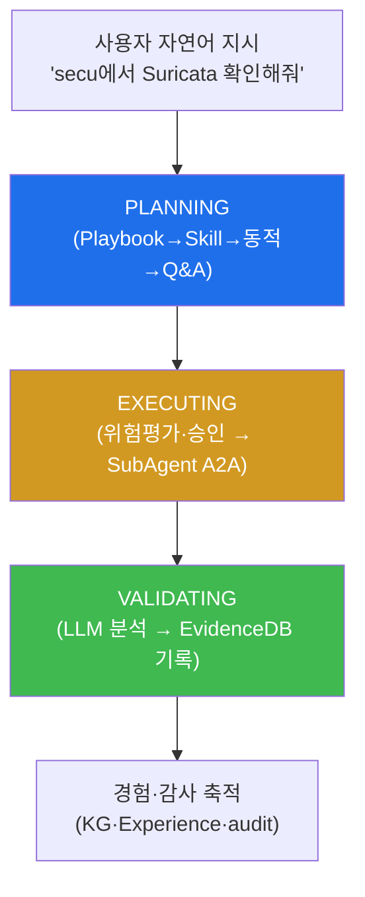

# autonomous-security W01 — 자율보안시스템 개론: 자율 보안 에이전트와 bastion 아키텍처

> **본 주차의 한 줄 요약**
>
> autonomous-security는 **AI 에이전트가 스스로 보안을 수행**하는 시스템을 다룬다. 이 과목의 기준 구현체는 el34/tubewar의
> **bastion(배스천) 에이전트** — "자연어 프롬프트로 보안 인프라를 운영하는 **실행 에이전트**"다. 사용자가 "secu VM에서
> Suricata 상태 확인해줘"처럼 자연어로 지시하면, bastion은 **LLM으로 계획을 세우고(Skill/Playbook 선택) 각 VM의
> SubAgent에 A2A로 명령을 실행**시킨 뒤 결과를 분석·기록한다. bastion의 처리는 **3단계**다: ① **PLANNING** — 무엇을
> 할지 정한다(정적 Playbook 매칭 → 멀티 Skill 선택 → 동적 Playbook 생성 → Q&A 직접 답변의 **4단계 fallback**),
> ② **EXECUTING** — 위험도 평가(`_assess_risk`)와 사전 점검(health_check) 후 SubAgent A2A(`POST :8002/a2a/run_script`)로
> 실행, 위험 작업은 사용자 승인(Y/n), ③ **VALIDATING** — 결과를 LLM으로 분석해 **EvidenceDB(SQLite, evidence-first)**에
> 기록. bastion은 여기에 더해 **하니스 엔지니어링**(다중 페르소나 팀), **Knowledge Graph + Experience**(경험 학습),
> **RAG·history 압축**, **append-only 해시체인 감사**를 갖춘다. LLM은 두 티어 — 계획·분석은 **Manager AI(gpt-oss:120b)**,
> 경량 실행·챗은 **SubAgent(gemma3:4b)**. 왜 자율 보안인가? 공격은 기계 속도로 일어나고 인력은 부족하다. 하지만
> 자율성은 위험도 크므로 **위험 행동 승인·가드레일**이 필수다. 실습에서는 이 처리 루프를 매핑하고(마커 `LOOP_MAPPED`),
> 자율성 수준을 평가하며(마커 `AUTONOMY_ASSESSED`), 가드레일을 설정한다(마커 `GUARDRAILS_SET`).

---

## 학습 목표

본 주차 종료 시 학생은 다음 5가지를 **본인 손으로** 할 수 있어야 한다.

1. bastion이 "실행 에이전트"임과 자동화 vs 자율의 차이를 설명한다.
2. bastion의 처리 루프(PLANNING→EXECUTING→VALIDATING)를 매핑한다(마커 `LOOP_MAPPED`).
3. 행동의 위험도에 따라 **자율성 수준**(사람 승인 여부)을 평가한다(마커 `AUTONOMY_ASSESSED`).
4. 위험 행동에 **가드레일**(승인·범위 제한)을 설정한다(마커 `GUARDRAILS_SET`).
5. bastion 아키텍처(Skill/Playbook·SubAgent A2A·KG/Experience·감사)를 개관하고 종합한다(마커 `Assessment`).

> **이 주차의 시선** — 아직 에이전트를 만들지 않는다. 기준 구현체 **bastion의 실제 구조**와 자율성·안전 경계를
> 정확히 이해해, 이후 12주가 딛고 설 토대를 세운다.

---

## 0. 용어 해설 (bastion 자율 보안)

| 용어 | 영문 | 뜻 | 비유 |
|------|------|----|------|
| **실행 에이전트** | Execution Agent | 자연어 지시를 실제 명령 실행으로 옮기는 에이전트 | 말하면 해내는 비서 |
| **Skill** | Skill | bastion의 원자 도구(probe_host·check_suricata 등) | 연장 하나 |
| **Playbook** | Playbook | 여러 Skill을 엮은 YAML 워크플로 | 작전 매뉴얼 |
| **SubAgent** | SubAgent | 각 VM에 상주하며 A2A 명령을 실행하는 원격 실행기(:8002) | 현장 파견 요원 |
| **A2A** | Agent-to-Agent | Manager↔SubAgent HTTP 프로토콜(`/a2a/run_script`) | 무전 |
| **Manager AI** | — | 계획·분석 담당 LLM(gpt-oss:120b) | 지휘관 |
| **하니스** | Harness | 다중 페르소나 팀 + 단계 워크플로 작업환경 | 편성된 팀 |
| **가드레일** | Guardrail | 위험 행동 승인·범위 제한(자율의 안전 경계) | 도로 난간 |

> **헷갈리기 쉬운 한 쌍 — 자동화 vs 자율.** *자동화*는 정해진 절차만 반복(cron·고정 스크립트)한다. *자율*은 상황을
> 인지해 스스로 판단·적응한다(bastion이 자연어 지시로부터 Skill/Playbook을 골라 실행하고, 결과를 경험으로 학습).
> bastion은 자율이되, 위험 행동은 사람 승인을 거치는 **감독된 자율**이다.

---

## 0.5 핵심 개념

### 0.5.1 bastion 처리 루프 — PLANNING → EXECUTING → VALIDATING

자연어 지시가 **PLANNING**(무엇을 할지)→**EXECUTING**(SubAgent로 실행)→**VALIDATING**(결과 분석·기록)을 거친다.
전통적 "인지→판단→행동→학습" 자율 루프의 실제 구현이 바로 이 3단계다.

### 0.5.2 PLANNING의 4단계 fallback

bastion은 지시를 받으면 순서대로 시도한다.

1. **정적 Playbook 매칭**: 등록된 YAML Playbook 중 맞는 것이 있으면 그대로 실행(가장 일관·안전).
2. **멀티 Skill 선택**: Playbook이 없으면 필요한 Skill들을 골라 순차 실행.
3. **동적 Playbook 생성**: Skill도 안 맞으면 LLM이 즉석에서 스텝을 생성.
4. **Q&A 직접 답변**: 실행이 아니라 "설명해줘"류면 LLM이 직접 답(Skill 미실행).

원칙 — "동일 작업 = 동일 방법: **Playbook이 법, Experience는 보조 노트**". 재현성을 위해 정적 Playbook을 우선한다.

### 0.5.3 SubAgent와 A2A

각 VM(attacker·secu·web·siem·manager)에는 **SubAgent**가 상주한다(SSH 온보딩으로 설치, 포트 8002). Manager의
bastion은 `POST http://{vm_ip}:8002/a2a/run_script {"script":...}`로 명령을 위임하고 `{stdout,stderr,returncode}`를
받는다(`GET /health`로 사전 생존 확인). 계획(Manager)과 실행(SubAgent)이 분리돼 안전·확장이 오른다.

### 0.5.4 하니스·지식·경험

- **하니스 엔지니어링**: 복잡한 임무는 **다중 페르소나 팀**(soc-lead 리더·triage·threat-hunter·siem-analyst 등)을
  구성해 단계(트리아지→조사→봉쇄→보고) 워크플로로 실행한다(orchestrator 6단계, 생성-검증 루프).
- **Knowledge Graph(graph.py)**: Playbook·Experience·Skill·Error·Recovery·Asset·Concept를 연결한 지식망. 그래프
  traversal로 관련 지식을 찾아 매 LLM 호출에 주입(KG Context).
- **Experience(experience.py)**: 실행 결과를 **오버피팅 방지**로 학습(카테고리 일반화·3회+ 성공 승격·70%+ 성공률·
  시간 감쇠). "해본 것"을 다음 계획에 반영.
- **기록**: EvidenceDB(evidence-first)에 실행 기록, history 12턴(초과 시 요약 압축), RAG 지식 인덱스.

### 0.5.5 자율성 수준과 가드레일

bastion은 위험 행동을 그냥 실행하지 않는다. `_assess_risk`로 위험도를 평가하고 **high면 사용자 승인(Y/n)**을 받는다
(감독된 자율). 운영 규칙(CCC.md): 파괴적 작업(rm -rf /·DROP TABLE) 금지, 서비스 중지/재시작은 사용자 확인. 즉
안전한 조회는 자율, 위험한 변경은 승인 — **위험도로 자율성을 나눈다.**

### 0.5.6 감사와 안전

bastion은 모든 chat을 **append-only 해시체인 감사 로그(audit.py)**에 남긴다(1 chat = 1 row: 사용자 지시·최종 답변·
ReAct trace·의사결정). 각 row가 직전 row 해시를 담아 한 줄만 변조돼도 이후가 전부 깨져 **변조가 즉시 드러난다**.
자율 시스템은 강력한 만큼 행동의 투명성·무결성이 신뢰의 기반이다(W06에서 심화).

### 0.5.7 el34 맥락

el34/tubewar는 이 bastion 위에서 돌아간다. LLM은 Manager AI(gpt-oss:120b, 계획·분석)와 SubAgent(gemma3:4b, 경량
실행)로 나뉜다. 이번 주는 처리 루프·자율성 수준·가드레일을 개념·시뮬로 익히고, 이후 주차에서 Skill·Playbook·하니스·
경험을 실제로 다룬다.

---

## 1. 자율 보안 상세 — 루프·자율성·가드레일

### 1.1 처리 루프 매핑 (LOOP_MAPPED)

- **한 줄 정의**: bastion의 PLANNING→EXECUTING→VALIDATING에 실제 활동을 대응시킨다.
- **왜 중요한가**: 3단계와 각 단계의 산출물(계획·실행 증거·분석 기록)을 알아야 에이전트를 이해·설계할 수 있다.
- **bastion에서 어떻게**: PLANNING(Playbook/Skill 선택)→EXECUTING(A2A 실행+증거)→VALIDATING(분석+EvidenceDB)로
  매핑하면 `LOOP_MAPPED`.
- **한계/주의**: VALIDATING의 경험 축적이 빠지면 자율이 아니라 자동화에 그친다.

### 1.2 자율성 수준 평가 (AUTONOMY_ASSESSED)

- **한 줄 정의**: 각 행동에 사람 승인이 필요한지(위험도)를 배정한다.
- **핵심**: 조회(check_suricata 등)는 자율, 변경(configure_nftables·process_kill)은 위험도 high면 승인. `_assess_risk`
  기준.
- **판정**: 행동별 승인 여부를 근거와 함께 배정하면 `AUTONOMY_ASSESSED`.

### 1.3 가드레일 설정 (GUARDRAILS_SET)

- **한 줄 정의**: 위험 행동의 승인·범위·금지를 정한다.
- **핵심**: 파괴적 작업 금지, 위험 변경 승인, 범위 제한(대상 VM·명령), 감사 기록.
- **판정**: 구체적 가드레일이 설정되면 `GUARDRAILS_SET`.

---

## 2. 실습 안내 (총 5 미션)

실행 위치는 el34 **호스트**(`ssh ccc@{{TARGET_IP}}`, 비밀번호 `1`), 참고 GPU는 Ollama
(`http://211.170.162.139:10934`, gemma3:4b)다. 각 미션의 마지막 줄 마커가 채점 기준이다.

### 미션 1 — GPU 헬스체크 → `GEN_OK`

> **왜 하는가?** bastion의 SubAgent LLM(gemma3:4b)이 응답하는지 확인한다.
> **무엇을 아는가?** Ollama 응답 형식·도달성.
> **결과 해석** — 정상 `GEN_OK` / 비정상 `GEN_EMPTY`·연결 오류.
> **실전 활용** — 에이전트 구동 전 LLM 백엔드 확인.

### 미션 2 — 처리 루프 매핑 → `LOOP_MAPPED`

> **왜 하는가?** bastion 설계의 뼈대인 3단계에 실제 활동을 대응시킨다.
> **무엇을 아는가?** PLANNING(계획)→EXECUTING(A2A 실행)→VALIDATING(분석·기록) 매핑.
> **결과 해석** — 정상: 루프 매핑 + `LOOP_MAPPED`.
> **실전 활용** — 자율 보안 파이프라인 이해의 기초.

### 미션 3 — 자율성 수준 평가 → `AUTONOMY_ASSESSED`

> **왜 하는가?** 어떤 행동을 자율로, 어떤 행동을 사람 승인으로 할지 정한다.
> **무엇을 아는가?** 위험도별 승인 여부(_assess_risk 기준).
> **결과 해석** — 정상: 수준 배정 + `AUTONOMY_ASSESSED`.
> **실전 활용** — 자율 대응 정책(위험 행동 승인 게이트).

### 미션 4 — 가드레일 설정 → `GUARDRAILS_SET`

> **왜 하는가?** 잘못된 자율 행동의 피해를 막을 안전 경계를 정한다.
> **무엇을 아는가?** 승인·범위·금지·감사.
> **결과 해석** — 정상: 가드레일 + `GUARDRAILS_SET`.
> **실전 활용** — 자율 에이전트 운영 안전 기준.

### 미션 5 — 종합 소견 → `Assessment`

> **왜 하는가?** 처리 루프·자율성·가드레일과 bastion 구조를 하나의 소견으로 묶는다.
> **무엇을 아는가?** GPU에 요약시키되 첫 줄을 `Assessment`로 강제.
> **결과 해석** — 정상: `Assessment` 포함. 없으면 `[형식 미준수 — 재실행]`.
> **실전 활용** — 자율 보안 설계 개요서.

---

## 2.5 과제 (제출물)

- **A. 처리 루프 매핑 실증 (필수, 40점)** — `LOOP_MAPPED` 단계를 직접 수행해 실제 명령·출력(또는 아티팩트 분석 결과)을 캡처하고, 무엇을 근거로 판정했는지 서술한다.
- **B. 자율성 수준 평가 분석 (필수, 30점)** — `AUTONOMY_ASSESSED` 단계를 직접 수행해 실제 명령·출력(또는 아티팩트 분석 결과)을 캡처하고, 무엇을 근거로 판정했는지 서술한다.
- **C. 가드레일 설정 방어 설계 (필수, 30점)** — `GUARDRAILS_SET` 단계를 직접 수행해 실제 명령·출력(또는 아티팩트 분석 결과)을 캡처하고, 무엇을 근거로 판정했는지 서술한다.

## 2.6 평가 기준

| 항목 | 미흡(0) | 보통 | 우수 |
|------|---------|------|------|
| 탐지/실증(LOOP_MAPPED) | 미수행 | 마커 도출 | 근거·해석·재현까지 |
| 분석(AUTONOMY_ASSESSED) | 미수행 | 마커 도출 | 근거·해석·재현까지 |
| 방어(GUARDRAILS_SET) | 미수행 | 마커 도출 | 근거·해석·재현까지 |

## 2.7 핵심 정리 (1줄씩)

- 이번 주 주제: **자율보안시스템 개론: 자율 보안 에이전트와 bastion 아키텍처**.
- **처리 루프 매핑**(`LOOP_MAPPED`): bastion의 PLANNING→EXECUTING→VALIDATING에 실제 활동을 대응시킨다.
- **자율성 수준 평가**(`AUTONOMY_ASSESSED`): 각 행동에 사람 승인이 필요한지(위험도)를 배정한다.
- **가드레일 설정**(`GUARDRAILS_SET`): 위험 행동의 승인·범위·금지를 정한다.
- 공격을 이해한 만큼 **방어의 우선순위**가 분명해진다 — 탐지 근거와 완화를 함께 익힌다.

---

## 3. 흔한 오해·블루팀 노트

- **"bastion은 챗봇이다."** — bastion은 **실행 에이전트**다. "확인해줘/실행해줘"가 Skill/Playbook 실행으로 이어진다
  ("설명해줘"는 Q&A로 빠짐).
- **"자율은 곧 자동화다."** — 자율은 상황을 인지해 스스로 판단·적응하고 경험을 학습한다.
- **"완전 자율이 최선이다."** — 위험 행동은 `_assess_risk`→사람 승인이다. 위험도로 자율성을 나눈다.
- **"에이전트는 지식만 있으면 된다."** — Knowledge Graph(지식) + Experience(경험 학습)의 결합이 핵심이다.
- **관제(Blue) 관점** — bastion이 (1) 위험 행동 승인 게이트, (2) 파괴적 작업 금지 가드레일, (3) append-only 해시체인
  감사, (4) 경험 축적·활용을 갖췄는지 점검한다. 자율성과 안전의 균형이 핵심이다.

---

## 4. 다음 주차 (W02) 예고 — LLM 에이전트 기초

W01이 "bastion 개론(처리 루프·자율성·가드레일)"이었다면, W02는 **LLM 에이전트 기초**를 다룬다. LLM이 도구(Skill)를
쓰고 추론하는 에이전트의 기본(ReAct·도구 호출·컨텍스트)을 익힌다 — bastion SubAgent와 페르소나 실행의 토대다.
