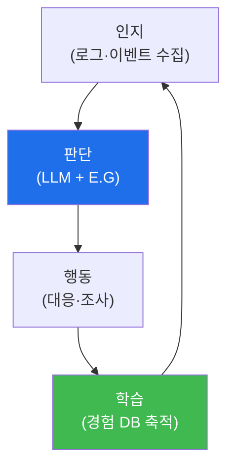

# autonomous-security W01 — 자율보안시스템 개론: 자율 보안 에이전트와 bastion 아키텍처

> **본 주차의 한 줄 요약**
>
> autonomous-security는 **AI 에이전트가 스스로 보안을 수행**하는 시스템을 다룬다 — 사람이 일일이 지시하지 않아도
> **인지→판단→행동→학습** 루프를 돌며 방어(Blue)·공격(Red) 임무를 자율 수행한다. 이는 el34/tubewar의 핵심
> 인프라인 **bastion(배스천) 아키텍처**의 기반이다. 자율 보안 시스템의 핵심 구조는 넷이다: ① **Manager Agent(관리
> 에이전트)** — 임무를 받아 **하니스 엔지니어링**(도구·컨텍스트·워크플로 구성)을 하고, **E.G(지식 그래프 + 경험 DB)**를
> 로드해 무엇을·어떻게 할지 계획, ② **SubAgent(하위 에이전트)** — Manager가 구성한 하니스로 실제 작업을
> **A2A(Agent-to-Agent)** 통신으로 실행, ③ **지식·경험 축적** — 수행 결과를 지식 그래프·경험 DB에 쌓아 다음에 더
> 잘함(학습), ④ **자율성 수준** — 사람이 루프 안(in)·위(on)·밖(out)에 있는 정도. 왜 자율 보안인가? 사이버 공격은
> **기계 속도**로 일어나고 방어 인력은 부족하다. 자율 에이전트는 24/7·기계 속도로 탐지·대응·공격 시뮬을 수행해 이
> 격차를 메운다. 하지만 자율성은 위험도 크다 — 잘못된 자율 행동(정상 시스템 차단·과잉 대응)은 피해를 키운다.
> 그래서 **가드레일(안전 경계)**과 적절한 **자율성 수준**이 필수다. 실습에서는 자율 보안 루프를 매핑하고(마커
> `LOOP_MAPPED`), 자율성 수준을 평가하며(마커 `AUTONOMY_ASSESSED`), 가드레일을 설정한다(마커 `GUARDRAILS_SET`).
> 이 과목은 자율 보안 에이전트를 **설계·구축·운영**하는 법을 다룬다.

---

## 학습 목표

본 주차 종료 시 학생은 다음 5가지를 **본인 손으로** 할 수 있어야 한다.

1. 자율 보안 시스템의 개념·필요성과 "자동화 vs 자율"의 차이를 설명한다.
2. 자율 보안 **루프**(인지·판단·행동·학습)를 매핑한다(마커 `LOOP_MAPPED`).
3. 행동의 위험도에 따라 **자율성 수준**(human in/on/out of loop)을 평가한다(마커 `AUTONOMY_ASSESSED`).
4. 자율 행동에 **가드레일**을 설정한다(마커 `GUARDRAILS_SET`).
5. bastion 아키텍처(Manager·SubAgent·E.G·A2A)를 개관하고 소견으로 종합한다(마커 `Assessment`).

> **이 주차의 시선** — 아직 에이전트를 만들지 않는다. 자율 에이전트의 **구조·자율성·안전 경계**라는 뼈대를 세워,
> 이후 12주의 구축이 딛고 설 토대를 만든다.

---

## 0. 용어 해설 (자율 보안)

| 용어 | 영문 | 뜻 | 비유 |
|------|------|----|------|
| **자율 에이전트** | Autonomous Agent | 스스로 판단·행동하는 AI 주체 | 스스로 판단하는 요원 |
| **자동화 vs 자율** | Automation vs Autonomy | 정해진 절차 반복 vs 스스로 판단·적응 | 컨베이어 벨트 vs 현장 판단 요원 |
| **Manager / SubAgent** | — | 계획하는 관리 에이전트 / 실행하는 하위 에이전트 | 지휘관 / 현장 요원 |
| **하니스 엔지니어링** | Harness Engineering | 임무에 맞는 도구·컨텍스트·워크플로 구성 | 임무 장비 꾸리기 |
| **E.G** | Knowledge Graph + Experience DB | 지식 그래프(구조화 지식) + 경험 DB(과거 결과) | 지식 + 기억 |
| **A2A** | Agent-to-Agent | 에이전트 간 통신 프로토콜 | 요원 간 무전 |
| **자율성 수준** | Level of Autonomy | 사람이 루프에 개입하는 정도(in/on/out) | 재량 위임 수준 |
| **가드레일** | Guardrail | 자율 행동의 허용 범위·안전 경계 | 도로 난간 |

> **헷갈리기 쉬운 한 쌍 — 자동화 vs 자율.** *자동화*는 "정해진 절차를 그대로 반복"한다(스크립트·플레이북). *자율*은
> "상황을 인지해 스스로 판단·적응"한다(LLM 에이전트). 자율은 유연해 미지의 상황에 대응하지만, 예측이 어려워
> 위험도 크다 — 그래서 가드레일이 필요하다.

---

## 0.5 신입생 친화 핵심 개념

### 0.5.1 자율 보안 루프

인지→판단→행동→학습이 순환한다. 매 순환마다 경험이 쌓여 다음에 더 잘한다 — 이 "학습" 고리가 단순 자동화와
자율 에이전트를 가르는 핵심이다.

### 0.5.2 bastion 아키텍처 — Manager와 SubAgent

- **Manager Agent**: 임무를 받아 하니스 엔지니어링(어떤 도구·컨텍스트·워크플로가 필요한지 구성)을 하고, E.G(지식
  그래프+경험 DB)를 로드해 계획을 세운다. "무엇을 어떻게"의 두뇌.
- **SubAgent**: Manager가 구성한 하니스로 실제 작업을 실행한다. Manager와 A2A로 통신.
- **분리 이유**: 계획(Manager)과 실행(SubAgent)을 분리하면, Manager는 큰 그림·지식을, SubAgent는 집중된 실행을
  맡아 효율·안전이 오른다.

### 0.5.3 E.G — 지식 그래프와 경험 DB

- **지식 그래프(Knowledge Graph)**: 자산·취약점·공격 기법·관계를 구조화한 지식(무엇이 무엇과 연결되나).
- **경험 DB(Experience DB)**: 과거 수행 결과·성공/실패 패턴(어떻게 하면 잘 됐나).

Manager가 이 둘을 로드해 **아는 것(지식)**과 **해본 것(경험)**을 결합해 더 나은 계획을 세운다 — 학습의 저장소다.

### 0.5.4 자율성 수준 (human in/on/out of loop)

- **Human-in-the-loop**: 사람이 각 행동을 **승인**(가장 안전, 느림).
- **Human-on-the-loop**: 사람이 **감독**하며 필요 시 개입(균형).
- **Human-out-of-the-loop**: 완전 자율(빠름, 위험 큼).

보안 행동의 **위험도**에 따라 수준을 정한다 — 위험한 행동(차단·격리)은 사람 승인, 안전한 행동(조사·수집)은 자율.
위험과 속도의 균형이 핵심이다.

### 0.5.5 가드레일 — 자율의 안전 경계

자율 에이전트는 강력하지만 잘못된 자율 행동은 피해를 키운다(정상 시스템 차단·과잉 대응). 가드레일은 다음을 한다:
허용 행동 범위 제한, 위험 행동은 승인 필요, 되돌릴 수 없는 행동 금지·확인, 이상 시 정지. 자율성과 안전의 균형이
이 과목을 관통하는 주제다.

### 0.5.6 el34 맥락

el34/tubewar는 이 자율 보안 에이전트(bastion) 위에서 돌아간다. 본 과목의 많은 실습은 el34 GPU·bastion을 실제로
사용한다. 이번 주는 자율 보안 루프·자율성 수준·가드레일을 개념·시뮬로 익히고, 이후 주차에서 실제 에이전트를 구축한다.

---

## 1. 자율 보안 상세 — 루프·자율성·가드레일

### 1.1 자율 보안 루프 매핑 (LOOP_MAPPED)

- **한 줄 정의**: 인지·판단·행동·학습 4단계에 실제 보안 활동을 대응시킨다.
- **왜 중요한가**: 에이전트를 설계하려면 각 단계에 무엇(입력·모델·도구·저장소)이 필요한지 알아야 한다.
- **el34 맥락에서 어떻게**: 인지(SIEM 로그)→판단(LLM+E.G)→행동(대응·조사)→학습(경험 DB)로 매핑하면 `LOOP_MAPPED`.
- **한계/주의**: 학습 단계가 빠지면 자율이 아니라 자동화에 그친다.

### 1.2 자율성 수준 평가 (AUTONOMY_ASSESSED)

- **한 줄 정의**: 각 보안 행동에 적절한 자율성 수준(in/on/out)을 배정한다.
- **핵심**: 위험·비가역 행동(차단·격리·삭제)은 human-in-the-loop, 조사·수집 같은 안전 행동은 out. 균형이 답.
- **판정**: 행동별 자율성 수준을 근거와 함께 배정하면 `AUTONOMY_ASSESSED`.

### 1.3 가드레일 설정 (GUARDRAILS_SET)

- **한 줄 정의**: 자율 행동의 허용 범위·승인·정지 조건을 정한다.
- **핵심**: 허용 행동 화이트리스트, 위험 행동 승인, 비가역 행동 금지·확인, 이상 시 정지.
- **판정**: 구체적 가드레일이 설정되면 `GUARDRAILS_SET`.

---

## 2. 실습 안내 (총 5 미션)

실행 위치는 el34 **호스트**(`ssh ccc@{{TARGET_IP}}`, 비밀번호 `1`), 참고 GPU는 Ollama
(`http://211.170.162.139:10934`, gemma3:4b)다. 각 미션의 마지막 줄 마커가 채점 기준이다.

### 미션 1 — GPU 헬스체크 → `GEN_OK`

> **왜 하는가?** 자율 에이전트의 "판단" 두뇌인 LLM이 응답하는지 확인한다.
> **무엇을 아는가?** Ollama 응답 형식·도달성.
> **결과 해석** — 정상 `GEN_OK` / 비정상 `GEN_EMPTY`·연결 오류.
> **실전 활용** — 에이전트 구축 전 LLM 백엔드 확인.

### 미션 2 — 자율 보안 루프 매핑 → `LOOP_MAPPED`

> **왜 하는가?** 에이전트 설계의 뼈대인 4단계 루프에 실제 활동을 대응시킨다.
> **무엇을 아는가?** 인지(로그)→판단(LLM+E.G)→행동(대응)→학습(경험 DB)의 매핑.
> **결과 해석** — 정상: 루프 매핑 + `LOOP_MAPPED`.
> **실전 활용** — 자율 보안 파이프라인 설계의 기초.

### 미션 3 — 자율성 수준 평가 → `AUTONOMY_ASSESSED`

> **왜 하는가?** 어떤 행동을 자율로, 어떤 행동을 사람 승인으로 할지 정한다.
> **무엇을 아는가?** 위험도별 human in/on/out 배정.
> **결과 해석** — 정상: 수준 배정 + `AUTONOMY_ASSESSED`.
> **실전 활용** — 자율 대응 정책 설계(위험 행동 승인 게이트).

### 미션 4 — 가드레일 설정 → `GUARDRAILS_SET`

> **왜 하는가?** 잘못된 자율 행동의 피해를 막을 안전 경계를 정한다.
> **무엇을 아는가?** 허용 범위·승인·비가역 금지·정지 조건.
> **결과 해석** — 정상: 가드레일 + `GUARDRAILS_SET`.
> **실전 활용** — 자율 에이전트 운영의 안전 기준.

### 미션 5 — 종합 소견 → `Assessment`

> **왜 하는가?** 루프·자율성·가드레일과 bastion 구조를 하나의 소견으로 묶는다.
> **무엇을 아는가?** GPU에 요약시키되 첫 줄을 `Assessment`로 강제.
> **결과 해석** — 정상: `Assessment` 포함. 없으면 `[형식 미준수 — 재실행]`.
> **실전 활용** — 자율 보안 설계 개요서.

---

## 3. 흔한 오해·관제자 노트

- **"자율은 곧 자동화다."** — 자율은 스스로 판단·적응하고 학습한다. 유연하지만 예측이 어려워 위험도 크다.
- **"완전 자율(out-of-loop)이 최선이다."** — 위험·비가역 행동은 사람 승인이 필요하다. 위험도에 맞춰 수준을 정한다.
- **"에이전트는 지식만 있으면 된다."** — 지식(그래프) + 경험(DB)의 결합이 핵심이다. 학습이 자율의 조건.
- **"가드레일은 성능을 떨어뜨린다."** — 가드레일 없는 자율은 사고를 키운다. 안전이 곧 지속 가능성.
- **관제(Blue) 관점** — 자율 에이전트가 (1) 적절한 자율성 수준, (2) 위험 행동 승인 게이트, (3) 비가역 행동 금지·정지
  조건, (4) 경험 축적·활용을 갖췄는지 점검한다. 자율성과 안전의 균형이 핵심이다.

---

## 4. 다음 주차 (W02) 예고 — LLM 에이전트 기초

W01이 "자율 보안 개론(구조·자율성·가드레일)"이었다면, W02는 **LLM 에이전트 기초**를 다룬다. LLM이 도구를 쓰고
추론하며 임무를 수행하는 에이전트의 기본(ReAct·도구 호출·컨텍스트 관리)을 익힌다 — bastion의 실행 단위인
SubAgent가 어떻게 동작하는지의 토대다.
