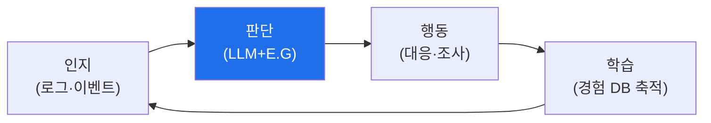

# autonomous-security W01 — 자율보안시스템 개론: 자율 보안 에이전트와 bastion 아키텍처

> **본 주차의 한 줄 요약**
>
> autonomous-security는 **AI 에이전트가 스스로 보안을 수행**하는 시스템을 다룬다 — 사람이 일일이 지시하지 않아도
> **인지→판단→행동→학습** 루프를 돌며 방어(Blue)·공격(Red) 임무를 자율 수행한다. 이는 el34/tubewar의 핵심
> 인프라인 **bastion(배스천) 아키텍처**의 기반이다. 자율 보안 시스템의 핵심 구조: ① **Manager Agent(관리 에이전트)** —
> 임무를 받아 **하니스 엔지니어링**(도구·컨텍스트·워크플로 구성)을 하고, **E.G(지식 그래프 Knowledge Graph +
> 경험 DB Experience DB)** 를 로드해 무엇을·어떻게 할지 계획, ② **SubAgent(하위 에이전트)** — Manager가 구성한
> 하니스로 실제 작업을 **A2A(Agent-to-Agent)** 통신을 통해 실행, ③ **지식·경험 축적** — 수행 결과를 지식 그래프·
> 경험 DB에 쌓아 다음에 더 잘함(학습), ④ **자율성 수준** — 사람이 루프 안(in)·위(on)·밖(out)에 있는 정도.
> 왜 자율 보안인가? 사이버 공격은 **기계 속도**로 일어나고(agent-ir), 방어자 인력은 부족하다. 자율 에이전트는
> 24/7·기계 속도로 탐지·대응·공격 시뮬을 수행해 이 격차를 메운다. 하지만 자율성은 **위험**도 크다 — 잘못된
> 자율 행동은 피해를 키운다. 그래서 **가드레일(안전 경계)** 과 적절한 **자율성 수준**이 필수다. 이 과목은 자율
> 보안 에이전트를 **설계·구축·운영**하는 법을 다룬다.
>
> **한 줄 결론**: 자율 보안 시스템 = AI 에이전트가 **인지→판단→행동→학습** 루프로 보안을 자율 수행. bastion
> 구조(Manager+E.G, SubAgent+A2A)가 기반이며, **가드레일·자율성 수준**이 안전의 핵심이다.

---

## 학습 목표

본 주차 종료 시 학생은 다음 5가지를 **본인 손으로** 할 수 있어야 한다.

1. **자율 보안 시스템**과 필요성을 설명한다.
2. 자율 보안 **루프**(인지·판단·행동·학습)를 매핑한다(LOOP_MAPPED).
3. **자율성 수준**(human in/on/out of loop)을 평가한다(AUTONOMY_ASSESSED).
4. 자율 행동의 **가드레일**을 설정한다(GUARDRAILS_SET).
5. bastion 아키텍처(Manager·SubAgent·E.G·A2A)를 개관한다.

> **이 주차의 시선** — 자율 보안 에이전트의 구조·자율성·안전 경계를 이해해 이후 구축의 토대를 세운다.

---

## 0. 용어 해설 (자율 보안)

| 용어 | 영문 | 뜻 | 비유 |
|------|------|----|------|
| **자율 에이전트** | Autonomous Agent | 스스로 판단·행동 | 자율 요원 |
| **Manager/SubAgent** | — | 관리/실행 에이전트 | 지휘관/요원 |
| **E.G** | Knowledge Graph + Experience DB | 지식 그래프·경험 DB | 지식·기억 |
| **A2A** | Agent-to-Agent | 에이전트 간 통신 | 요원 간 통신 |
| **가드레일** | Guardrail | 안전 경계 | 안전 난간 |

> **헷갈리기 쉬운 한 쌍** — *자동화(automation)* 는 "정해진 절차 반복", *자율(autonomy)* 은 "스스로 판단·적응"
> 이다. 자율은 유연하지만 위험도 크다.

---

## 0.5 신입생 친화 핵심 개념

### 0.5.1 자율 보안 루프

인지→판단→행동→학습이 순환한다. 매 순환마다 경험이 쌓여 다음에 더 잘한다. 이것이 자율 에이전트의 기본 동작.

### 0.5.2 bastion 아키텍처 — Manager와 SubAgent

- **Manager Agent**: 임무를 받아 **하니스 엔지니어링**(어떤 도구·컨텍스트·워크플로가 필요한지 구성)을 하고,
  **E.G(지식 그래프+경험 DB)** 를 로드해 계획을 세운다. "무엇을 어떻게"의 두뇌.
- **SubAgent**: Manager가 구성한 하니스로 실제 작업을 실행한다. Manager와 **A2A(Agent-to-Agent)** 로 통신.
- **분리 이유**: 계획(Manager)과 실행(SubAgent)을 분리하면, Manager는 큰 그림·지식을, SubAgent는 집중된 실행을
  맡아 효율·안전이 오른다.

### 0.5.3 E.G — 지식 그래프와 경험 DB

- **지식 그래프(Knowledge Graph)**: 자산·취약점·공격 기법·관계를 구조화한 지식(무엇이 무엇과 연결되나).
- **경험 DB(Experience DB)**: 과거 수행 결과·성공/실패 패턴(어떻게 하면 잘 됐나).
Manager가 이 둘을 로드해 **아는 것(지식)** 과 **해본 것(경험)** 을 결합해 더 나은 계획을 세운다. 학습의 저장소.

### 0.5.4 자율성 수준

- **Human-in-the-loop**: 사람이 각 행동을 **승인**(가장 안전, 느림).
- **Human-on-the-loop**: 사람이 **감독**하며 필요 시 개입(균형).
- **Human-out-of-the-loop**: 완전 자율(빠름, 위험 큼).
보안 행동의 **위험도**에 따라 수준을 정한다 — 위험한 행동(차단·격리)은 사람 승인, 안전한 행동(조사·수집)은
자율. 위험과 속도의 균형.

### 0.5.5 가드레일 — 자율의 안전 경계

자율 에이전트는 강력하지만 **잘못된 자율 행동**은 피해를 키운다(정상 시스템 차단·과잉 대응). **가드레일**:
허용 행동 범위 제한, 위험 행동은 승인 필요, 되돌릴 수 없는 행동 금지·확인, 이상 시 정지. 자율성과 안전의 균형이
이 과목의 핵심 주제다.

### 0.5.6 el34 맥락

el34/tubewar는 이 자율 보안 에이전트(bastion) 위에서 돌아간다. 본 과목의 많은 실습은 **el34 GPU·bastion을
실제로** 사용한다. 이번 주는 자율 보안 루프·자율성 수준·가드레일을 개념·시뮬로 익히고, 이후 주차에서 실제
에이전트를 구축한다.

---

## 1. 실습 안내 (5 미션)

실행 위치 el34 **호스트**(`ssh ccc@{{TARGET_IP}}`), GPU `http://211.170.162.139:10934`.

### STEP 1 — GPU 헬스체크 → GEN_OK
### STEP 2 — 자율 보안 루프 매핑 → LOOP_MAPPED
### STEP 3 — 자율성 수준 평가 → AUTONOMY_ASSESSED
### STEP 4 — 가드레일 설정 → GUARDRAILS_SET
### STEP 5 — 종합 → Assessment

---

## 2. 흔한 오해·관제자 노트

- **"자율=자동화"** — 자율은 스스로 판단·적응. 유연하지만 위험.
- **"완전 자율이 최선"** — 위험 행동은 사람 승인. 자율성 수준을 위험도에 맞춰.
- **"에이전트는 지식만 있으면"** — 지식(그래프)+경험(DB) 결합이 핵심. 학습.
- **관제 관점** — 자율 에이전트가 적절한 자율성 수준·가드레일을 갖췄는지, 위험 행동에 승인이 걸렸는지, 경험이
  축적·활용되는지 점검한다. 자율성과 안전의 균형이 핵심.

---

## 3. 다음 주차 (W02) 예고 — LLM 에이전트 기초

W01이 "자율 보안 개론"이었다면, W02는 **LLM 에이전트 기초** — LLM이 도구를 쓰고 추론하며 임무를 수행하는
에이전트의 기본(ReAct·도구 호출·컨텍스트)을 다룬다. bastion의 실행 단위다.
