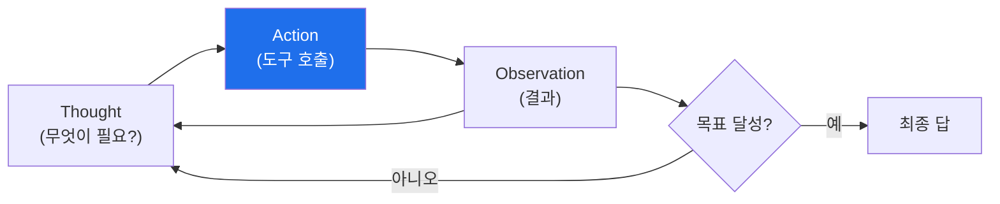

# autonomous-security W02 — LLM 에이전트 기초: ReAct·도구 호출·컨텍스트

> **본 주차의 한 줄 요약**
>
> 자율 보안 시스템의 실행 단위는 **LLM 에이전트** — 대규모 언어 모델(LLM)이 **추론하고 도구를 써서** 임무를
> 수행하는 프로그램이다. 단순히 LLM에 질문하는 것과 다르다: 에이전트는 **스스로 무엇을 할지 판단**하고, **도구
> (tool)** 를 호출해 실제 세계와 상호작용하며(명령 실행·API 호출·파일 읽기), 결과를 보고 다음을 결정한다. 핵심
> 패턴 **ReAct(Reason + Act)**: LLM이 **① Thought(생각)** — 무엇이 필요한지 추론, **② Action(행동)** — 도구를
> 선택·호출, **③ Observation(관찰)** — 도구 결과를 받음, 이 세 단계를 **반복**하며 목표에 다가간다. 예:
> "이 알림을 조사하라"→(생각: 로그를 봐야겠다)→(행동: read_log 호출)→(관찰: 로그 내용)→(생각: IP가 의심스럽다)→
> (행동: check_ip 호출)→... 결론. 에이전트의 세 요소: **① 도구(tools)** — 에이전트가 쓸 수 있는 능력(각 도구는
> 이름·설명·입력 스키마로 정의), **② 컨텍스트(context)** — LLM이 보는 정보(임무·이전 관찰·지식). 컨텍스트 창은
> 유한하므로 **관련 정보만** 유지하는 관리가 중요, **③ 루프 제어** — 언제 멈출지·최대 단계·오류 처리. 잘 설계된
> 에이전트는 적절한 도구·명확한 컨텍스트·안전한 루프로 임무를 안정적으로 수행한다. 이것이 bastion SubAgent의
> 기본 동작이며, el34 GPU의 LLM으로 실제로 돌려볼 수 있다.
>
> **한 줄 결론**: LLM 에이전트는 **ReAct(생각→행동→관찰) 루프**로 도구를 써서 임무를 수행한다. 핵심 = **도구
> (능력)·컨텍스트(정보)·루프 제어(안전)**. bastion SubAgent의 기본이다.

---

## 학습 목표

본 주차 종료 시 학생은 다음 5가지를 **본인 손으로** 할 수 있어야 한다.

1. **LLM 에이전트**와 단순 LLM 호출의 차이를 설명한다.
2. **ReAct 루프**(생각·행동·관찰)를 이해한다(AGENT_LOOP).
3. **도구 스키마**로 도구를 정의·선택한다(TOOL_SELECTED).
4. **컨텍스트 관리**(관련 정보 유지)를 수행한다(CONTEXT_MANAGED).
5. 에이전트 루프 제어(정지·안전)의 필요를 설명한다.

> **이 주차의 시선** — LLM이 도구를 써서 자율 수행하는 에이전트의 기본을 익힌다.

---

## 0. 용어 해설 (LLM 에이전트)

| 용어 | 영문 | 뜻 | 비유 |
|------|------|----|------|
| **ReAct** | Reason+Act | 생각-행동 반복 | 생각하며 행동 |
| **도구** | Tool | 에이전트 능력 | 연장 |
| **도구 스키마** | Tool Schema | 도구 정의 | 사용 설명서 |
| **컨텍스트** | Context | LLM이 보는 정보 | 시야 |
| **관찰** | Observation | 도구 결과 | 피드백 |

> **헷갈리기 쉬운 한 쌍** — *LLM 호출* 은 "한 번 묻고 답", *에이전트* 는 "여러 번 도구를 쓰며 임무 수행"이다.
> 에이전트는 루프.

---

## 0.5 신입생 친화 핵심 개념

### 0.5.1 ReAct 루프

생각→행동→관찰을 반복하며 목표에 다가간다. 매 순환에서 LLM이 관찰을 보고 다음 행동을 결정한다.

### 0.5.2 도구 — 에이전트의 능력

각 도구는 **이름·설명·입력 스키마**로 정의된다. 예: `read_log(path)` — "로그 파일을 읽는다". LLM은 도구 목록을
보고 **상황에 맞는 도구**를 선택해 호출한다. 보안 에이전트 도구 예: 로그 조회·IP 평판·프로세스 목록·파일 해시·
방화벽 규칙. 도구가 에이전트의 손발.

### 0.5.3 컨텍스트 관리

LLM은 **컨텍스트 창(유한)** 안의 정보만 본다: 임무·도구 목록·이전 관찰·관련 지식. 순환이 길어지면 관찰이
쌓여 컨텍스트가 넘친다. **관리**: 관련 정보만 유지(요약·선별), 오래된·무관한 것 제거. 컨텍스트가 명확할수록
에이전트 판단이 정확하다(agent-ir·aisec 연결).

### 0.5.4 루프 제어 — 안전

에이전트 루프는 **제어**가 필요하다: **최대 단계**(무한 루프 방지), **정지 조건**(목표 달성·불가능 판단),
**오류 처리**(도구 실패 시 대응), **가드레일**(W01, 위험 도구는 승인). 제어 없는 에이전트는 폭주하거나 자원을
낭비한다.

### 0.5.5 el34 맥락

el34 GPU의 LLM(gemma3 등)으로 **실제 에이전트 루프**를 돌릴 수 있다. 본 실습은 도구 선택·ReAct 루프·컨텍스트
관리 로직을 결정론 시뮬로 익히고, GPU로 추론을 확인한다. 이후 주차에서 실제 bastion SubAgent를 다룬다.

---

## 1. 실습 안내 (5 미션)

실행 위치 el34 **호스트**(`ssh ccc@{{TARGET_IP}}`), GPU `http://211.170.162.139:10934`.

### STEP 1 — GPU 헬스체크 → GEN_OK
### STEP 2 — 도구 선택 → TOOL_SELECTED
### STEP 3 — ReAct 루프 → AGENT_LOOP
### STEP 4 — 컨텍스트 관리 → CONTEXT_MANAGED
### STEP 5 — 종합 → Assessment

---

## 2. 흔한 오해·관제자 노트

- **"LLM에 물으면 에이전트"** — 에이전트는 도구를 쓰는 루프. 단순 호출과 다름.
- **"컨텍스트는 많을수록 좋다"** — 넘치면 판단 흐려짐. 관련 정보만.
- **"루프는 알아서 멈춤"** — 제어 없으면 폭주. 최대 단계·정지 조건.
- **관제 관점** — 에이전트가 적절한 도구·명확한 컨텍스트·루프 제어(최대 단계·가드레일)를 갖췄는지 점검한다.
  도구·컨텍스트·제어가 에이전트 안정성의 3요소.

---

## 3. 다음 주차 (W03) 예고 — Bastion 프로젝트 생명주기

W02가 "LLM 에이전트 기초"였다면, W03은 **Bastion 프로젝트 생명주기** — 자율 보안 임무가 접수·계획·실행·평가·
학습되는 전체 흐름을 다룬다. Manager 에이전트의 관점이다.
