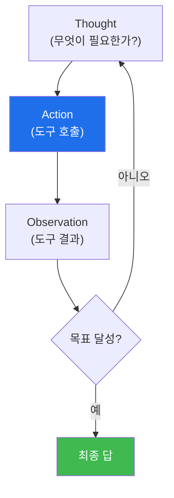

# autonomous-security W02 — LLM 에이전트 기초: ReAct·도구 호출·컨텍스트

> **본 주차의 한 줄 요약**
>
> 자율 보안 시스템의 실행 단위는 **LLM 에이전트** — 대규모 언어 모델(LLM)이 **추론하고 도구를 써서** 임무를 수행하는
> 프로그램이다. 단순히 LLM에 질문하는 것과 다르다: 에이전트는 스스로 무엇을 할지 판단하고, **도구(tool)**를 호출해
> 실제 세계와 상호작용하며(명령 실행·API 호출·파일 읽기), 결과를 보고 다음을 결정한다. 핵심 패턴은 **ReAct(Reason +
> Act)**다: LLM이 ① **Thought(생각)** — 무엇이 필요한지 추론, ② **Action(행동)** — 도구를 선택·호출, ③
> **Observation(관찰)** — 도구 결과를 받음, 이 세 단계를 **반복**하며 목표에 다가간다. 예: "이 알림을 조사하라" →
> (생각: 로그를 봐야겠다) → (행동: read_log 호출) → (관찰: 로그 내용) → (생각: IP가 의심스럽다) → (행동: check_ip) →
> … 결론. 에이전트의 세 요소는 ① **도구(tools)**(에이전트가 쓸 수 있는 능력 — 각 도구는 이름·설명·입력 스키마로
> 정의), ② **컨텍스트(context)**(LLM이 보는 정보 — 임무·이전 관찰·지식. 컨텍스트 창은 유한하므로 관련 정보만
> 유지하는 관리가 중요), ③ **루프 제어**(언제 멈출지·최대 단계·오류 처리)다. 실습에서는 도구를 정의·선택하고(마커
> `TOOL_SELECTED`), ReAct 루프를 돌리며(마커 `AGENT_LOOP`), 컨텍스트를 관리한다(마커 `CONTEXT_MANAGED`). 잘 설계된
> 에이전트는 적절한 도구·명확한 컨텍스트·안전한 루프로 임무를 안정적으로 수행한다 — 이것이 bastion SubAgent의 기본
> 동작이며, el34 GPU의 LLM으로 실제로 돌려볼 수 있다.

---

## 학습 목표

본 주차 종료 시 학생은 다음 5가지를 **본인 손으로** 할 수 있어야 한다.

1. LLM 에이전트와 단순 LLM 호출의 차이(도구·루프·자율 판단)를 설명한다.
2. 상황에 맞는 **도구를 스키마로 정의·선택**한다(마커 `TOOL_SELECTED`).
3. **ReAct 루프**(생각→행동→관찰)를 돌려 임무를 수행한다(마커 `AGENT_LOOP`).
4. 유한한 창 안에서 **컨텍스트를 관리**한다(마커 `CONTEXT_MANAGED`).
5. 루프 제어(최대 단계·정지·오류·가드레일)의 필요를 종합한다(마커 `Assessment`).

> **이 주차의 시선** — W01의 "자율 루프"를 실제로 구동하는 엔진(ReAct)을 본다. 에이전트가 어떻게 스스로 도구를
> 골라 세계와 상호작용하는지가 핵심이다.

---

## 0. 용어 해설 (LLM 에이전트)

| 용어 | 영문 | 뜻 | 비유 |
|------|------|----|------|
| **ReAct** | Reason + Act | 생각→행동→관찰을 반복하는 에이전트 패턴 | 생각하며 움직이는 요원 |
| **도구** | Tool | 에이전트가 호출하는 능력(로그 조회·IP 평판 등) | 연장 |
| **도구 스키마** | Tool Schema | 도구의 이름·설명·입력 형식 정의 | 사용 설명서 |
| **컨텍스트** | Context | LLM이 한 번에 보는 정보(임무·관찰·지식) | 시야·작업대 |
| **컨텍스트 창** | Context Window | LLM이 처리할 수 있는 최대 토큰 범위 | 책상 크기(유한) |
| **관찰** | Observation | 도구 실행 결과(다음 판단의 근거) | 계기판 피드백 |
| **루프 제어** | Loop Control | 최대 단계·정지·오류 처리 | 안전 스위치 |
| **환각** | Hallucination | LLM이 없는 도구·결과를 지어냄 | 착각 |

> **헷갈리기 쉬운 한 쌍 — LLM 호출 vs 에이전트.** *LLM 호출*은 한 번 묻고 한 번 답한다(1회). *에이전트*는 도구를
> 여러 번 쓰며 관찰을 보고 다음을 결정하는 **루프**다. 에이전트의 힘은 "한 번의 답"이 아니라 "여러 단계로 목표에
> 다가가는 과정"에서 나온다.

---

## 0.5 신입생 친화 핵심 개념

### 0.5.1 ReAct 루프

생각→행동→관찰을 반복하며 목표에 다가간다. 매 순환에서 LLM이 관찰을 보고 다음 행동을 결정한다 — 이 되먹임이
에이전트를 "한 번의 답"이 아닌 "문제 해결 과정"으로 만든다.

### 0.5.2 도구 — 에이전트의 능력

각 도구는 **이름·설명·입력 스키마**로 정의된다. 예: `read_log(path)` — "로그 파일을 읽는다". LLM은 도구 목록을 보고
상황에 맞는 도구를 선택해 호출한다. 보안 에이전트 도구 예: 로그 조회·IP 평판·프로세스 목록·파일 해시·방화벽 규칙.
도구가 에이전트의 손발이다.

### 0.5.3 컨텍스트 관리

LLM은 **컨텍스트 창(유한)** 안의 정보만 본다: 임무·도구 목록·이전 관찰·관련 지식. 순환이 길어지면 관찰이 쌓여
컨텍스트가 넘친다. 관리 방법은 관련 정보만 유지(요약·선별)하고 오래된·무관한 것을 제거하는 것이다. 컨텍스트가
명확할수록 에이전트 판단이 정확하다(agent-ir·aisec와 연결).

### 0.5.4 루프 제어 — 안전

에이전트 루프는 제어가 필요하다: **최대 단계**(무한 루프 방지), **정지 조건**(목표 달성·불가능 판단), **오류 처리**
(도구 실패 시 대응), **가드레일**(W01, 위험 도구는 승인). 제어 없는 에이전트는 폭주하거나 자원을 낭비한다.

### 0.5.5 el34 맥락

el34 GPU의 LLM(gemma3 등)으로 실제 에이전트 루프를 돌릴 수 있다. 이번 실습은 도구 선택·ReAct 루프·컨텍스트 관리
로직을 결정론 시뮬로 익히고, GPU로 추론을 확인한다. 이후 주차에서 실제 bastion SubAgent를 다룬다.

---

## 1. LLM 에이전트 상세 — 도구·루프·컨텍스트

### 1.1 도구 선택 (TOOL_SELECTED)

- **한 줄 정의**: 임무 상황에 맞는 도구를 도구 목록에서 고른다.
- **왜 중요한가**: 잘못된 도구 선택은 임무 실패·자원 낭비다. 도구 설명·스키마가 명확해야 LLM이 옳게 고른다.
- **el34 맥락에서 어떻게**: "알림 조사" 임무에 read_log·check_ip 같은 도구를 스키마로 정의하고 적절히 선택하면
  `TOOL_SELECTED`.
- **한계/주의**: 도구가 과하게 많으면 오히려 선택이 흐려진다(에이전시 위험, ai-service-pentest W07과 연결).

### 1.2 ReAct 루프 (AGENT_LOOP)

- **한 줄 정의**: 생각→행동→관찰을 반복해 목표에 도달한다.
- **핵심**: 각 순환에서 관찰을 근거로 다음 행동을 결정하고, 정지 조건에서 멈춘다.
- **판정**: ReAct 루프가 관찰 기반으로 진행되면 `AGENT_LOOP`.
- **주의**: 최대 단계·정지 조건이 없으면 무한 루프. 루프 제어가 필수(§0.5.4).

### 1.3 컨텍스트 관리 (CONTEXT_MANAGED)

- **한 줄 정의**: 유한한 창 안에 관련 정보만 유지한다.
- **핵심**: 관찰이 쌓이면 요약·선별로 관련 정보만 남기고 무관·오래된 것을 제거.
- **판정**: 컨텍스트가 관련 정보 중심으로 관리되면 `CONTEXT_MANAGED`.

---

## 2. 실습 안내 (총 5 미션)

실행 위치는 el34 **호스트**(`ssh ccc@{{TARGET_IP}}`, 비밀번호 `1`), 참고 GPU는 Ollama
(`http://211.170.162.139:10934`, gemma3:4b)다. 각 미션의 마지막 줄 마커가 채점 기준이다.

### 미션 1 — GPU 헬스체크 → `GEN_OK`

> **왜 하는가?** 에이전트의 추론 엔진(LLM)이 응답하는지 확인한다.
> **무엇을 아는가?** Ollama 응답 형식·도달성.
> **결과 해석** — 정상 `GEN_OK` / 비정상 `GEN_EMPTY`·연결 오류.
> **실전 활용** — 에이전트 구동 전 LLM 백엔드 확인.

### 미션 2 — 도구 선택 → `TOOL_SELECTED`

> **왜 하는가?** 에이전트의 손발인 도구를 정의하고 상황에 맞게 고르는 법을 익힌다.
> **무엇을 아는가?** 도구 스키마(이름·설명·입력)와 임무 기반 선택.
> **결과 해석** — 정상: 적절 도구 선택 + `TOOL_SELECTED`.
> **실전 활용** — 보안 에이전트 도구 세트 설계.

### 미션 3 — ReAct 루프 → `AGENT_LOOP`

> **왜 하는가?** 생각→행동→관찰 반복으로 임무를 수행하는 에이전트의 핵심을 구동한다.
> **무엇을 아는가?** 관찰 기반 다음 행동 결정·정지 조건.
> **결과 해석** — 정상: 루프 진행 + `AGENT_LOOP`.
> **실전 활용** — SubAgent 실행 루프 설계.

### 미션 4 — 컨텍스트 관리 → `CONTEXT_MANAGED`

> **왜 하는가?** 유한한 창을 넘기지 않도록 관련 정보만 유지한다.
> **무엇을 아는가?** 요약·선별로 컨텍스트를 관리하는 과정.
> **결과 해석** — 정상: 컨텍스트 관리 + `CONTEXT_MANAGED`.
> **실전 활용** — 장기 임무 에이전트의 안정성 확보.

### 미션 5 — 종합 소견 → `Assessment`

> **왜 하는가?** 도구·루프·컨텍스트·제어를 하나의 소견으로 묶는다.
> **무엇을 아는가?** GPU에 요약시키되 첫 줄을 `Assessment`로 강제.
> **결과 해석** — 정상: `Assessment` 포함. 없으면 `[형식 미준수 — 재실행]`.
> **실전 활용** — 에이전트 설계 개요.

---

## 2.5 과제 (제출물)

- **A. 도구 선택 실증 (필수, 40점)** — `TOOL_SELECTED` 단계를 직접 수행해 실제 명령·출력(또는 아티팩트 분석 결과)을 캡처하고, 무엇을 근거로 판정했는지 서술한다.
- **B. ReAct 루프 분석 (필수, 30점)** — `AGENT_LOOP` 단계를 직접 수행해 실제 명령·출력(또는 아티팩트 분석 결과)을 캡처하고, 무엇을 근거로 판정했는지 서술한다.
- **C. 컨텍스트 관리 방어 설계 (필수, 30점)** — `CONTEXT_MANAGED` 단계를 직접 수행해 실제 명령·출력(또는 아티팩트 분석 결과)을 캡처하고, 무엇을 근거로 판정했는지 서술한다.

## 2.6 평가 기준

| 항목 | 미흡(0) | 보통 | 우수 |
|------|---------|------|------|
| 탐지/실증(TOOL_SELECTED) | 미수행 | 마커 도출 | 근거·해석·재현까지 |
| 분석(AGENT_LOOP) | 미수행 | 마커 도출 | 근거·해석·재현까지 |
| 방어(CONTEXT_MANAGED) | 미수행 | 마커 도출 | 근거·해석·재현까지 |

## 2.7 핵심 정리 (1줄씩)

- 이번 주 주제: **LLM 에이전트 기초: ReAct·도구 호출·컨텍스트**.
- **도구 선택**(`TOOL_SELECTED`): 임무 상황에 맞는 도구를 도구 목록에서 고른다.
- **ReAct 루프**(`AGENT_LOOP`): 생각→행동→관찰을 반복해 목표에 도달한다.
- **컨텍스트 관리**(`CONTEXT_MANAGED`): 유한한 창 안에 관련 정보만 유지한다.
- 공격을 이해한 만큼 **방어의 우선순위**가 분명해진다 — 탐지 근거와 완화를 함께 익힌다.

---

## 3. 흔한 오해·블루팀 노트

- **"LLM에 물으면 그게 에이전트다."** — 에이전트는 도구를 쓰는 루프다. 단순 호출과 다르다.
- **"컨텍스트는 많이 넣을수록 좋다."** — 넘치면 판단이 흐려진다. 관련 정보만 유지한다.
- **"루프는 알아서 멈춘다."** — 제어가 없으면 폭주한다. 최대 단계·정지 조건이 필요하다.
- **"도구는 많이 줄수록 유능하다."** — 과하면 선택이 흐려지고 위험(에이전시)도 커진다. 임무에 맞는 최소 세트.
- **관제(Blue) 관점** — 에이전트가 (1) 적절한 도구, (2) 명확한 컨텍스트 관리, (3) 루프 제어(최대 단계·정지·오류
  처리), (4) 위험 도구 가드레일을 갖췄는지 점검한다.

---

## 4. 다음 주차 (W03) 예고 — Bastion 프로젝트 생명주기

W02가 "LLM 에이전트 기초(실행 단위)"였다면, W03은 **Bastion 프로젝트 생명주기**를 다룬다. 자율 보안 임무가
접수·계획·실행·평가·학습되는 전체 흐름을 Manager 에이전트 관점에서 보고, SubAgent(W02)가 그 안에서 어떻게
호출되는지 정리한다.
