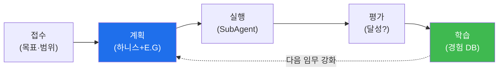

# autonomous-security W03 — Bastion 프로젝트 생명주기: 접수·계획·실행·평가·학습

> **본 주차의 한 줄 요약**
>
> 자율 보안 임무는 즉흥이 아니라 **생명주기(lifecycle)** 를 따라 진행된다. bastion의 **Manager Agent** 관점에서
> 한 임무(project)는 다섯 단계를 거친다: ① **접수(intake)** — 임무를 받아 목표·범위·제약을 명확히(무엇을·어디까지),
> ② **계획(planning)** — Manager가 **하니스 엔지니어링**을 한다: 임무에 필요한 **도구·컨텍스트·워크플로**를 구성하고,
> **E.G(지식 그래프+경험 DB)** 를 로드해 "무엇을 어떻게"를 설계. 지식 그래프에서 관련 자산·취약점을, 경험 DB에서
> 과거 유사 임무의 성공 패턴을 가져와 계획에 반영, ③ **실행(execution)** — 구성된 하니스로 **SubAgent가** 실제
> 작업을 수행(A2A로 위임, W04), ④ **평가(evaluation)** — 결과가 목표를 달성했는지, 무엇이 잘/못 됐는지 판정,
> ⑤ **학습(learning)** — 평가 결과를 **경험 DB에 축적**해 다음 임무에 활용(W09). 이 생명주기의 핵심은 **계획과
> 학습이 지식·경험에 의해 강화**된다는 것 — 처음부터 다시 하지 않고, 아는 것(지식)과 해본 것(경험)을 매번 활용해
> 점점 잘한다. Manager는 이 전체 흐름을 관장하며, 각 단계의 산출물(계획·결과·교훈)을 관리한다. 이것이 자동화된
> 스크립트와 다른 **자율 프로젝트 운영**이다 — 목표를 받아 스스로 계획·실행·학습하는 사이클.
>
> **한 줄 결론**: bastion 임무는 **접수→계획(하니스+E.G)→실행(SubAgent)→평가→학습(경험 DB)** 생명주기를 돈다.
> Manager가 관장하며, 지식·경험이 계획과 학습을 매번 강화한다.

---

## 학습 목표

본 주차 종료 시 학생은 다음 5가지를 **본인 손으로** 할 수 있어야 한다.

1. bastion 임무 **생명주기 5단계**를 매핑한다(LIFECYCLE_MAPPED).
2. Manager의 **하니스 엔지니어링**을 수행한다(HARNESS_BUILT).
3. 평가·학습으로 **경험을 축적**한다(LEARNING_CAPTURED).
4. E.G(지식·경험)가 계획을 강화하는 원리를 설명한다.
5. 자율 프로젝트 운영과 단순 자동화의 차이를 설명한다.

> **이 주차의 시선** — Manager가 임무를 생명주기로 관장하며 지식·경험으로 강화하는 흐름을 익힌다.

---

## 0. 용어 해설 (생명주기)

| 용어 | 영문 | 뜻 | 비유 |
|------|------|----|------|
| **생명주기** | Lifecycle | 임무 진행 단계 | 프로젝트 흐름 |
| **하니스 엔지니어링** | Harness Engineering | 도구·컨텍스트 구성 | 작업 세팅 |
| **E.G** | Knowledge Graph + Experience DB | 지식·경험 | 지식·기억 |
| **접수** | Intake | 임무 수령·정의 | 접수 |
| **평가** | Evaluation | 결과 판정 | 채점 |

> **헷갈리기 쉬운 한 쌍** — *자동화 스크립트* 는 "정해진 절차만", *자율 프로젝트* 는 "목표 받아 스스로 계획·학습"
> 이다. 후자는 매번 개선.

---

## 0.5 신입생 친화 핵심 개념

### 0.5.1 임무 생명주기

접수→계획→실행→평가→학습. 학습이 다음 계획을 강화하는 **되먹임**이 핵심.

### 0.5.2 계획 — 하니스 엔지니어링 + E.G

Manager의 계획 단계가 자율성의 핵심이다:
- **하니스 엔지니어링**: 이 임무에 **어떤 도구·어떤 컨텍스트·어떤 워크플로**가 필요한지 구성(W02 에이전트 설계).
- **지식 그래프 로드**: 관련 **자산·취약점·기법·관계**를 가져와 "무엇을" 정한다.
- **경험 DB 로드**: 과거 유사 임무의 **성공/실패 패턴**을 가져와 "어떻게"를 정한다.
아는 것(지식)+해본 것(경험)으로 처음부터가 아니라 **강화된 계획**을 세운다.

### 0.5.3 실행과 평가

- **실행**: 구성된 하니스로 SubAgent가 작업(A2A 위임, W04). Manager는 감독.
- **평가**: 결과가 목표를 달성했나? 무엇이 잘/못 됐나? 성공 지표·실패 원인을 판정. 이 평가가 학습의 재료.

### 0.5.4 학습 — 경험 축적

평가 결과를 **경험 DB에 축적**한다(W09): "이 상황에 이 방법이 통했다/안 통했다". 다음 임무의 계획에서 이 경험을
활용해 점점 잘한다. 학습이 없으면 매번 같은 실수를 반복 — 학습이 자율 시스템을 **성장**시킨다.

### 0.5.5 el34 맥락

bastion은 el34에서 이 생명주기로 임무를 수행한다. 본 실습은 **생명주기 매핑·하니스 구성·학습 축적 로직**을
결정론 시뮬로 익힌다. 이후 주차에서 실제 실행(W04)·경험(W09)을 다룬다.

---

## 1. 실습 안내 (5 미션)

실행 위치 el34 **호스트**(`ssh ccc@{{TARGET_IP}}`), GPU `http://211.170.162.139:10934`.

### STEP 1 — GPU 헬스체크 → GEN_OK
### STEP 2 — 생명주기 매핑 → LIFECYCLE_MAPPED
### STEP 3 — 하니스 엔지니어링 → HARNESS_BUILT
### STEP 4 — 평가·학습 축적 → LEARNING_CAPTURED
### STEP 5 — 종합 → Assessment

---

## 2. 흔한 오해·관제자 노트

- **"임무는 바로 실행"** — 접수·계획(하니스+E.G)이 먼저. 계획이 자율성의 핵심.
- **"계획은 매번 처음부터"** — 지식·경험으로 강화. 반복 실수 방지.
- **"실행만 하면 끝"** — 평가·학습으로 축적. 학습이 성장.
- **관제 관점** — 임무가 생명주기(접수·계획·실행·평가·학습)를 따르는지, 하니스가 E.G로 강화되는지, 경험이
  축적·활용되는지 점검한다. Manager의 생명주기 관장이 자율 운영의 핵심.

---

## 3. 다음 주차 (W04) 예고 — SubAgent와 원격 실행

W03이 "생명주기"였다면, W04는 **SubAgent와 원격 실행** — Manager가 구성한 임무를 SubAgent가 A2A로 위임받아
원격(el34 bastion)에서 실행하는 구조를 다룬다.
