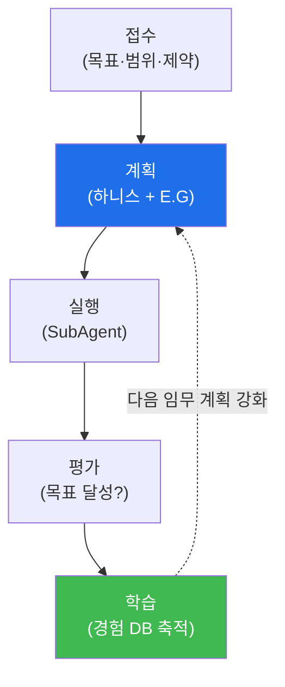

# autonomous-security W03 — Bastion 프로젝트 생명주기: 접수·계획·실행·평가·학습

> **본 주차의 한 줄 요약**
>
> 자율 보안 임무는 즉흥이 아니라 **생명주기(lifecycle)**를 따라 진행된다. bastion의 **Manager Agent** 관점에서 한
> 임무(project)는 다섯 단계를 거친다: ① **접수(intake)** — 임무를 받아 목표·범위·제약을 명확히(무엇을·어디까지),
> ② **계획(planning)** — Manager가 **하니스 엔지니어링**을 한다: 임무에 필요한 도구·컨텍스트·워크플로를 구성하고,
> **E.G(지식 그래프+경험 DB)**를 로드해 "무엇을 어떻게"를 설계(지식 그래프에서 관련 자산·취약점을, 경험 DB에서 과거
> 유사 임무의 성공 패턴을 가져와 반영), ③ **실행(execution)** — 구성된 하니스로 **SubAgent가** 실제 작업을 수행
> (A2A로 위임, W04), ④ **평가(evaluation)** — 결과가 목표를 달성했는지·무엇이 잘/못 됐는지 판정, ⑤ **학습(learning)** —
> 평가 결과를 **경험 DB에 축적**해 다음 임무에 활용(W09). 이 생명주기의 핵심은 **계획과 학습이 지식·경험에 의해
> 강화**된다는 것이다 — 처음부터 다시 하지 않고, 아는 것(지식)과 해본 것(경험)을 매번 활용해 점점 잘한다. 실습에서는
> 생명주기 5단계를 매핑하고(마커 `LIFECYCLE_MAPPED`), 하니스를 구성하며(마커 `HARNESS_BUILT`), 평가·학습으로 경험을
> 축적한다(마커 `LEARNING_CAPTURED`). 이것이 자동화된 스크립트와 다른 **자율 프로젝트 운영**이다 — 목표를 받아
> 스스로 계획·실행·학습하는 사이클이다.

---

## 학습 목표

본 주차 종료 시 학생은 다음 5가지를 **본인 손으로** 할 수 있어야 한다.

1. bastion 임무 **생명주기 5단계**(접수·계획·실행·평가·학습)를 매핑한다(마커 `LIFECYCLE_MAPPED`).
2. Manager의 **하니스 엔지니어링**(도구·컨텍스트·워크플로 + E.G 로드)을 수행한다(마커 `HARNESS_BUILT`).
3. 평가·학습으로 **경험을 축적**한다(마커 `LEARNING_CAPTURED`).
4. E.G(지식·경험)가 계획을 강화하는 되먹임 원리를 설명한다.
5. 자율 프로젝트 운영과 단순 자동화의 차이를 종합한다(마커 `Assessment`).

> **이 주차의 시선** — W01의 자율 루프, W02의 에이전트를 "하나의 임무 흐름"으로 조립한다. Manager가 어떻게 지식·
> 경험으로 계획을 강화하고 학습으로 성장시키는지가 핵심이다.

---

## 0. 용어 해설 (생명주기)

| 용어 | 영문 | 뜻 | 비유 |
|------|------|----|------|
| **생명주기** | Lifecycle | 임무가 접수부터 학습까지 거치는 단계 | 프로젝트 흐름 |
| **접수** | Intake | 임무를 받아 목표·범위·제약을 정의 | 의뢰 접수 |
| **하니스 엔지니어링** | Harness Engineering | 임무에 맞는 도구·컨텍스트·워크플로 구성 | 작업 세팅 |
| **E.G** | Knowledge Graph + Experience DB | 구조화 지식 + 과거 결과 저장소 | 지식 + 기억 |
| **평가** | Evaluation | 결과의 목표 달성·성패를 판정 | 채점 |
| **학습** | Learning | 평가 결과를 경험 DB에 축적 | 복기·기록 |
| **되먹임** | Feedback Loop | 학습이 다음 계획을 강화 | 경험이 실력이 됨 |

> **헷갈리기 쉬운 한 쌍 — 자동화 스크립트 vs 자율 프로젝트.** *자동화 스크립트*는 정해진 절차만 반복한다. *자율
> 프로젝트*는 목표를 받아 스스로 계획하고, 실행·평가 후 **학습**해 다음에 개선한다. 후자는 매번 나아진다는 점이
> 결정적 차이다.

---

## 0.5 신입생 친화 핵심 개념

### 0.5.1 임무 생명주기

접수→계획→실행→평가→학습이 흐르고, 학습이 다음 계획을 강화하는 **되먹임**이 핵심이다. 이 고리가 있어야 시스템이
반복 임무에서 점점 나아진다.

### 0.5.2 계획 — 하니스 엔지니어링 + E.G

Manager의 계획 단계가 자율성의 핵심이다.

- **하니스 엔지니어링**: 이 임무에 어떤 도구·어떤 컨텍스트·어떤 워크플로가 필요한지 구성한다(W02 에이전트 설계).
- **지식 그래프 로드**: 관련 자산·취약점·기법·관계를 가져와 "무엇을" 정한다.
- **경험 DB 로드**: 과거 유사 임무의 성공/실패 패턴을 가져와 "어떻게"를 정한다.

아는 것(지식) + 해본 것(경험)으로 처음부터가 아니라 **강화된 계획**을 세운다.

### 0.5.3 실행과 평가

- **실행**: 구성된 하니스로 SubAgent가 작업한다(A2A 위임, W04). Manager는 감독한다.
- **평가**: 결과가 목표를 달성했나? 무엇이 잘/못 됐나? 성공 지표·실패 원인을 판정한다 — 이 평가가 학습의 재료다.

### 0.5.4 학습 — 경험 축적

평가 결과를 경험 DB에 축적한다(W09): "이 상황에 이 방법이 통했다/안 통했다". 다음 임무의 계획에서 이 경험을 활용해
점점 잘한다. 학습이 없으면 매번 같은 실수를 반복한다 — 학습이 자율 시스템을 **성장**시킨다.

### 0.5.5 el34 맥락

bastion은 el34에서 이 생명주기로 임무를 수행한다. 이번 실습은 **생명주기 매핑·하니스 구성·학습 축적 로직**을 결정론
시뮬로 익힌다. 이후 주차에서 실제 실행(W04)·경험(W09)을 다룬다.

---

## 1. 생명주기 상세 — 매핑·하니스·학습

### 1.1 생명주기 매핑 (LIFECYCLE_MAPPED)

- **한 줄 정의**: 한 임무를 접수·계획·실행·평가·학습 5단계로 나눠 각 산출물을 정한다.
- **왜 중요한가**: 단계와 산출물이 명확해야 Manager가 임무를 관장·추적할 수 있다.
- **el34 맥락에서 어떻게**: 보안 임무(예: 알림 조사)를 5단계로 매핑하고 각 단계 산출물을 정하면 `LIFECYCLE_MAPPED`.
- **한계/주의**: 학습 단계가 빠지면 되먹임이 없어 자율이 아니라 자동화에 그친다.

### 1.2 하니스 엔지니어링 (HARNESS_BUILT)

- **한 줄 정의**: 임무에 맞는 도구·컨텍스트·워크플로를 구성하고 E.G를 로드한다.
- **핵심**: 필요한 도구 세트 + 컨텍스트(지식 그래프 관련 항목) + 경험(유사 임무 패턴)을 결합해 계획을 강화.
- **판정**: 하니스가 E.G로 강화돼 구성되면 `HARNESS_BUILT`.

### 1.3 평가·학습 축적 (LEARNING_CAPTURED)

- **한 줄 정의**: 실행 결과를 평가하고 교훈을 경험 DB에 남긴다.
- **핵심**: 성공/실패 원인을 "상황 → 방법 → 결과" 형태로 기록해 다음 계획이 참조할 수 있게.
- **판정**: 평가 결과가 경험으로 축적되면 `LEARNING_CAPTURED`.

---

## 2. 실습 안내 (총 5 미션)

실행 위치는 el34 **호스트**(`ssh ccc@{{TARGET_IP}}`, 비밀번호 `1`), 참고 GPU는 Ollama
(`http://211.170.162.139:10934`, gemma3:4b)다. 각 미션의 마지막 줄 마커가 채점 기준이다.

### 미션 1 — GPU 헬스체크 → `GEN_OK`

> **왜 하는가?** Manager/SubAgent의 추론 엔진(LLM)이 응답하는지 확인한다.
> **무엇을 아는가?** Ollama 응답 형식·도달성.
> **결과 해석** — 정상 `GEN_OK` / 비정상 `GEN_EMPTY`·연결 오류.
> **실전 활용** — 에이전트 구동 전 LLM 백엔드 확인.

### 미션 2 — 생명주기 매핑 → `LIFECYCLE_MAPPED`

> **왜 하는가?** 임무를 5단계로 구조화해 Manager가 관장·추적할 수 있게 한다.
> **무엇을 아는가?** 접수·계획·실행·평가·학습의 산출물.
> **결과 해석** — 정상: 5단계 매핑 + `LIFECYCLE_MAPPED`.
> **실전 활용** — 자율 임무 운영 프로세스 설계.

### 미션 3 — 하니스 엔지니어링 → `HARNESS_BUILT`

> **왜 하는가?** 계획 단계에서 도구·컨텍스트·경험을 결합해 강화된 계획을 만든다.
> **무엇을 아는가?** 도구 세트 + 지식 그래프 + 경험 DB의 결합.
> **결과 해석** — 정상: 하니스 구성 + `HARNESS_BUILT`.
> **실전 활용** — Manager의 임무 계획 자동화.

### 미션 4 — 평가·학습 축적 → `LEARNING_CAPTURED`

> **왜 하는가?** 실행 결과를 복기해 다음 임무가 나아지게 한다.
> **무엇을 아는가?** 성공/실패 교훈을 경험으로 기록하는 형식.
> **결과 해석** — 정상: 경험 축적 + `LEARNING_CAPTURED`.
> **실전 활용** — 자율 시스템의 지속적 개선 루프.

### 미션 5 — 종합 소견 → `Assessment`

> **왜 하는가?** 생명주기·하니스·학습을 하나의 소견으로 묶는다.
> **무엇을 아는가?** GPU에 요약시키되 첫 줄을 `Assessment`로 강제.
> **결과 해석** — 정상: `Assessment` 포함. 없으면 `[형식 미준수 — 재실행]`.
> **실전 활용** — 자율 프로젝트 운영 개요.

---

## 3. 흔한 오해·관제자 노트

- **"임무는 받으면 바로 실행한다."** — 접수·계획(하니스+E.G)이 먼저다. 계획이 자율성의 핵심.
- **"계획은 매번 처음부터 세운다."** — 지식·경험으로 강화한다. 반복 실수를 막는다.
- **"실행하면 임무는 끝이다."** — 평가·학습으로 축적해야 다음에 나아진다.
- **"학습은 부가 기능이다."** — 학습이 자율(성장)의 조건이다. 없으면 자동화와 같다.
- **관제(Blue) 관점** — 임무가 (1) 생명주기 5단계를 따르는가, (2) 하니스가 E.G로 강화되는가, (3) 경험이 축적·활용
  되는가, (4) 각 단계 산출물이 추적되는가를 점검한다.

---

## 4. 다음 주차 (W04) 예고 — SubAgent와 원격 실행

W03이 "임무 생명주기(Manager 관점)"였다면, W04는 **SubAgent와 원격 실행**을 다룬다. Manager가 구성한 임무를
SubAgent가 A2A로 위임받아 원격(el34 bastion)에서 실행하는 구조와, 그 위임·격리·결과 회수의 안전을 정리한다.
