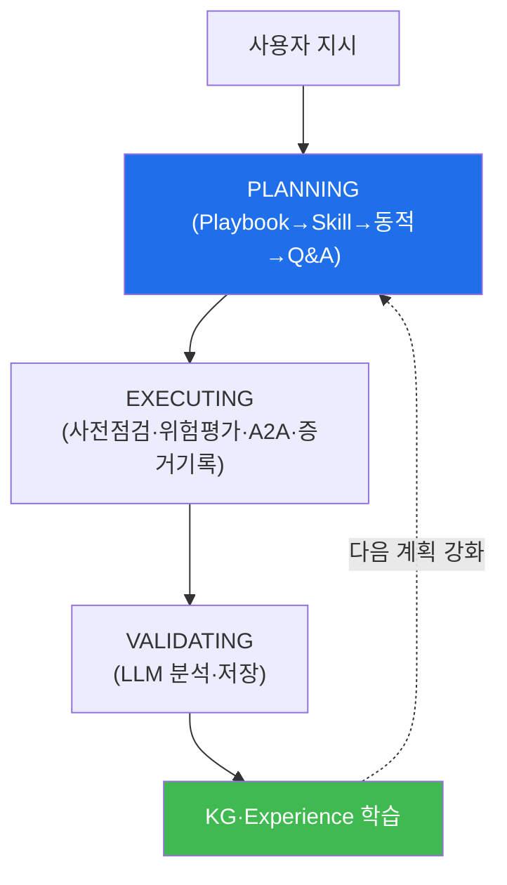

# autonomous-security W03 — Bastion 처리 흐름과 하니스 엔지니어링

> **본 주차의 한 줄 요약**
>
> bastion이 한 요청을 처리하는 방식은 즉흥이 아니라 정해진 흐름을 따른다. 단일 요청은 **3단계**(PLANNING→EXECUTING→
> VALIDATING)를 거치고, 복잡한 임무는 **하니스(harness)**로 **다중 페르소나 팀**을 구성해 6단계 오케스트레이션으로
> 수행한다. ① **PLANNING** — 4단계 fallback으로 무엇을 할지 정한다(정적 Playbook 매칭 → 멀티 Skill 선택 → 동적
> Playbook 생성 → Q&A). ② **EXECUTING** — 파라미터 자동완성 → 사전점검(health_check) → 위험평가(`_assess_risk`,
> high면 승인) → SubAgent A2A 실행 → **EvidenceDB**에 증거 기록(evidence-first). ③ **VALIDATING** — 결과를 LLM으로
> 분석하고 저장한다. 복잡한 임무를 위한 **하니스 엔지니어링**은 "미리 정의된 작업환경"이다 — 전문 **페르소나 팀**
> (soc-lead 리더·triage·threat-hunter·siem-analyst 등) + 단계 워크플로(트리아지→조사→봉쇄·탐지→(퍼플)→보고) + 도구
> 경계 + 의존 순서(depends_on) + **생성-검증 루프** + **무발화 리더**(soc-lead가 검증만). orchestrator는 이를 **6단계
> (P0 입력수집→P1 팀생성→P2 위상정렬→P3 fan-out ReAct→P4 생성-검증 루프→P5 통합·영속화)**로 실행한다. 하니스는
> 수동(md 정의)으로도, 자동(discovery + Experience Graph → HarnessSpec 합성)으로도 만들어진다. 그리고 이 모든
> 실행은 **Knowledge Graph·Experience**로 학습돼 다음을 강화한다. 실습에서는 이 처리 흐름을 매핑하고(마커
> `LIFECYCLE_MAPPED`), 하니스를 구성하며(마커 `HARNESS_BUILT`), 경험을 축적한다(마커 `LEARNING_CAPTURED`).

---

## 학습 목표

본 주차 종료 시 학생은 다음 5가지를 **본인 손으로** 할 수 있어야 한다.

1. bastion 단일 요청 3단계(PLANNING 4-fallback→EXECUTING→VALIDATING)를 매핑한다(마커 `LIFECYCLE_MAPPED`).
2. **하니스**(다중 페르소나 팀·단계 워크플로·생성-검증)를 구성한다(마커 `HARNESS_BUILT`).
3. 실행 결과를 **Experience로 학습**해 축적한다(마커 `LEARNING_CAPTURED`).
4. Knowledge Graph·Experience가 다음 계획을 강화하는 원리를 설명한다.
5. 자율 처리 흐름과 단순 자동화의 차이를 종합한다(마커 `Assessment`).

> **이 주차의 시선** — W01의 3단계 루프를 자세히 열고, 복잡한 임무를 위한 하니스(팀 편성)를 이해한다. "Playbook이
> 법, Experience는 보조 노트"라는 재현성 원칙이 핵심이다.

---

## 0. 용어 해설 (처리 흐름·하니스)

| 용어 | 영문 | 뜻 | 비유 |
|------|------|----|------|
| **PLANNING/EXECUTING/VALIDATING** | — | bastion 단일 요청 3단계 | 계획·실행·검토 |
| **4단계 fallback** | — | Playbook→Skill→동적→Q&A 우선순위 | 우선순위 시도 |
| **하니스** | Harness | 페르소나 팀+단계 워크플로 작업환경 | 편성된 팀 |
| **페르소나** | Persona | 논리적 서브에이전트(soc-lead·triage 등) | 역할별 요원 |
| **무발화 리더** | Silent Leader | soc-lead — 본문은 안 쓰고 검증만 | 감독관 |
| **생성-검증 루프** | Generate-Verify Loop | 결과를 검증자가 통과시킬 때까지 | 작성-감수 |
| **Knowledge Graph** | KG | Playbook·Experience·Skill·Asset 연결망 | 지식망 |
| **Experience** | Experience | 오버피팅 방지 경험 학습 | 요령 축적 |

> **헷갈리기 쉬운 한 쌍 — Playbook vs Experience.** bastion 원칙은 "**동일 작업 = 동일 방법: Playbook이 법,
> Experience는 보조 노트**"다. *Playbook*은 재현 가능한 정식 절차(우선 적용), *Experience*는 실행에서 배운 주의·패턴
> (보조). 재현성을 위해 정적 Playbook을 먼저 쓰고, Experience로 다듬는다.

---

## 0.5 신입생 친화 핵심 개념

### 0.5.1 단일 요청 3단계

PLANNING→EXECUTING→VALIDATING이 흐르고, 실행 결과가 KG·Experience로 학습돼 다음 PLANNING을 강화한다.

### 0.5.2 PLANNING의 4단계 fallback

- **정적 Playbook 매칭**: 등록 YAML Playbook이 맞으면 그대로 실행(가장 일관).
- **멀티 Skill 선택**: Playbook 없으면 Skill들을 골라 순차 실행.
- **동적 Playbook 생성**: 그마저 없으면 LLM이 즉석 스텝 생성.
- **Q&A 직접 답변**: 실행이 아니라 설명 요청이면 LLM이 직접 답.

우선순위가 곧 재현성 순서다 — 정적 Playbook이 최우선.

### 0.5.3 하니스 엔지니어링 — 팀을 편성한다

복잡한 임무(예: 침해 대응)는 단일 에이전트가 아니라 **페르소나 팀**으로 푼다.

- **페르소나 = 논리적 서브에이전트**(매니저 측): soc-lead(무발화 리더/검증자)·soc-triage-analyst·threat-hunter·
  siem-log-analyst·network-firewall-analyst·vuln-asset-manager·ai-security-analyst·red-team-operator 등. 각자
  `model_tier`(reasoning/execution/attack)와 필요 자산을 가진다.
- **단계 워크플로**: SOC 라이프사이클(트리아지→조사→봉쇄·탐지→(퍼플)→보고)을 `depends_on` DAG로 배치.
- **생성-검증 루프 + 무발화 리더**: 상태 변경(can_write) 태스크는 soc-lead 검증 게이트를 통과해야 확정.

### 0.5.4 하니스의 두 생성 경로

- **수동**: `.bastion/agents/*.md` + `SKILL.md` + `BASTION.md` 정의 → HarnessSpec 파싱.
- **자동(harness_gen)**: **discovery(인프라 발견) + Experience Graph** → HarnessSpec 합성. 존재하는 자산이 있는
  페르소나만 포함(예: ai-security-analyst는 모델 자산이 있을 때만).

양쪽이 같은 spec을 만들고 orchestrator.run_harness()가 6단계(P0~P5)로 실행한다.

### 0.5.5 학습 — KG와 Experience

- **Knowledge Graph(graph.py)**: Playbook·Experience·Skill·Error·Recovery·Asset·Concept 노드를 연결. 그래프
  traversal로 관련 지식을 찾아 계획에 주입.
- **Experience(experience.py)**: 오버피팅 방지로 학습 — 카테고리 일반화, 3회+ 성공해야 승격, 70%+ 성공률, 부정
  경험 경고, 시간 감쇠. "해본 것"을 다음에 반영하되 과적합하지 않게.

### 0.5.6 el34 맥락

bastion은 el34에서 이 흐름으로 임무를 수행한다. 이번 실습은 **처리 흐름 매핑·하니스 구성·경험 학습 로직**을 결정론
시뮬로 익힌다(실제 하니스 실행은 이후 통합 실습).

---

## 1. 처리 흐름·하니스 상세

### 1.1 처리 흐름 매핑 (LIFECYCLE_MAPPED)

- **한 줄 정의**: 한 요청을 PLANNING·EXECUTING·VALIDATING 3단계로 나눠 산출물을 정한다.
- **왜 중요한가**: 단계와 산출물(계획·증거·분석)을 알아야 bastion을 이해·추적할 수 있다.
- **bastion에서 어떻게**: PLANNING(Playbook/Skill 선택)→EXECUTING(A2A+증거)→VALIDATING(분석+저장)으로 매핑하면
  `LIFECYCLE_MAPPED`.
- **한계/주의**: VALIDATING의 경험 학습이 빠지면 자동화에 그친다.

### 1.2 하니스 구성 (HARNESS_BUILT)

- **한 줄 정의**: 임무에 맞는 페르소나 팀·단계 워크플로·검증 게이트를 구성한다.
- **핵심**: 필요한 페르소나 선택(자산 요건 충족) + depends_on DAG + soc-lead 검증 게이트.
- **판정**: 페르소나 팀 하니스가 구성되면 `HARNESS_BUILT`.

### 1.3 경험 학습 (LEARNING_CAPTURED)

- **한 줄 정의**: 실행 결과를 Experience로 (과적합 없이) 축적한다.
- **핵심**: 카테고리 일반화·3회+ 승격·70%+ 성공률·부정 경험 기록. KG에 반영.
- **판정**: 경험이 오버피팅 방지 규칙대로 축적되면 `LEARNING_CAPTURED`.

---

## 2. 실습 안내 (총 5 미션)

실행 위치는 el34 **호스트**(`ssh ccc@{{TARGET_IP}}`, 비밀번호 `1`), 참고 GPU는 Ollama
(`http://211.170.162.139:10934`, gemma3:4b)다. 각 미션의 마지막 줄 마커가 채점 기준이다.

### 미션 1 — GPU 헬스체크 → `GEN_OK`

> **왜 하는가?** bastion LLM 도달·응답 확인.
> **무엇을 아는가?** Ollama 응답 형식·도달성.
> **결과 해석** — 정상 `GEN_OK` / 비정상 `GEN_EMPTY`·연결 오류.
> **실전 활용** — 종합 소견 작성에 사용.

### 미션 2 — 처리 흐름 매핑 → `LIFECYCLE_MAPPED`

> **왜 하는가?** 요청을 3단계로 구조화해 bastion 처리를 이해한다.
> **무엇을 아는가?** PLANNING·EXECUTING·VALIDATING 산출물.
> **결과 해석** — 정상: 3단계 매핑 + `LIFECYCLE_MAPPED`.
> **실전 활용** — 자율 처리 흐름 이해.

### 미션 3 — 하니스 구성 → `HARNESS_BUILT`

> **왜 하는가?** 복잡한 임무를 페르소나 팀으로 푸는 하니스를 구성한다.
> **무엇을 아는가?** 페르소나 선택·단계 워크플로·검증 게이트.
> **결과 해석** — 정상: 하니스 구성 + `HARNESS_BUILT`.
> **실전 활용** — 다중 에이전트 팀 편성.

### 미션 4 — 경험 학습 → `LEARNING_CAPTURED`

> **왜 하는가?** 실행에서 배워 다음을 강화하되 과적합을 막는다.
> **무엇을 아는가?** 카테고리 일반화·승격 임계·성공률·시간 감쇠.
> **결과 해석** — 정상: 경험 축적 + `LEARNING_CAPTURED`.
> **실전 활용** — KG·Experience 기반 개선.

### 미션 5 — 종합 소견 → `Assessment`

> **왜 하는가?** 처리 흐름·하니스·학습을 하나의 소견으로 묶는다.
> **무엇을 아는가?** GPU에 요약시키되 첫 줄을 `Assessment`로 강제.
> **결과 해석** — 정상: `Assessment` 포함. 없으면 `[형식 미준수 — 재실행]`.
> **실전 활용** — bastion 처리·하니스 개요.

---

## 2.5 과제 (제출물)

- **A. 처리 흐름 매핑 실증 (필수, 40점)** — `LIFECYCLE_MAPPED` 단계를 직접 수행해 실제 명령·출력(또는 아티팩트 분석 결과)을 캡처하고, 무엇을 근거로 판정했는지 서술한다.
- **B. 하니스 구성 분석 (필수, 30점)** — `HARNESS_BUILT` 단계를 직접 수행해 실제 명령·출력(또는 아티팩트 분석 결과)을 캡처하고, 무엇을 근거로 판정했는지 서술한다.
- **C. 경험 학습 방어 설계 (필수, 30점)** — `LEARNING_CAPTURED` 단계를 직접 수행해 실제 명령·출력(또는 아티팩트 분석 결과)을 캡처하고, 무엇을 근거로 판정했는지 서술한다.

## 2.6 평가 기준

| 항목 | 미흡(0) | 보통 | 우수 |
|------|---------|------|------|
| 탐지/실증(LIFECYCLE_MAPPED) | 미수행 | 마커 도출 | 근거·해석·재현까지 |
| 분석(HARNESS_BUILT) | 미수행 | 마커 도출 | 근거·해석·재현까지 |
| 방어(LEARNING_CAPTURED) | 미수행 | 마커 도출 | 근거·해석·재현까지 |

## 2.7 핵심 정리 (1줄씩)

- 이번 주 주제: **Bastion 처리 흐름과 하니스 엔지니어링**.
- **처리 흐름 매핑**(`LIFECYCLE_MAPPED`): 한 요청을 PLANNING·EXECUTING·VALIDATING 3단계로 나눠 산출물을 정한다.
- **하니스 구성**(`HARNESS_BUILT`): 임무에 맞는 페르소나 팀·단계 워크플로·검증 게이트를 구성한다.
- **경험 학습**(`LEARNING_CAPTURED`): 실행 결과를 Experience로 (과적합 없이) 축적한다.
- 공격을 이해한 만큼 **방어의 우선순위**가 분명해진다 — 탐지 근거와 완화를 함께 익힌다.

---

## 3. 흔한 오해·관제자 노트

- **"요청은 받으면 바로 실행한다."** — PLANNING(Playbook/Skill 선택)이 먼저다. 정적 Playbook이 최우선(재현성).
- **"복잡한 임무도 에이전트 하나로 한다."** — 하니스로 페르소나 팀을 편성한다(단계·의존·검증).
- **"경험은 많이 쌓을수록 좋다."** — 오버피팅 방지(카테고리 일반화·승격 임계·시간 감쇠)가 핵심이다.
- **"Playbook과 Experience는 같다."** — Playbook이 법(우선), Experience는 보조 노트다.
- **관제(Blue) 관점** — bastion이 (1) 정적 Playbook 우선(재현성), (2) 하니스 검증 게이트(soc-lead), (3) evidence-first
  기록, (4) 오버피팅 방지 경험 학습을 갖췄는지 점검한다.

---

## 4. 다음 주차 (W04) 예고 — SubAgent와 A2A 원격 실행

W03이 "처리 흐름과 하니스"였다면, W04는 **SubAgent와 A2A 원격 실행**을 다룬다. Manager가 구성한 명령을 각 VM의
SubAgent(:8002)가 A2A로 위임받아 실행하는 구조(`/health`·`/a2a/run_script`)와 그 격리·검증을 정리한다.
