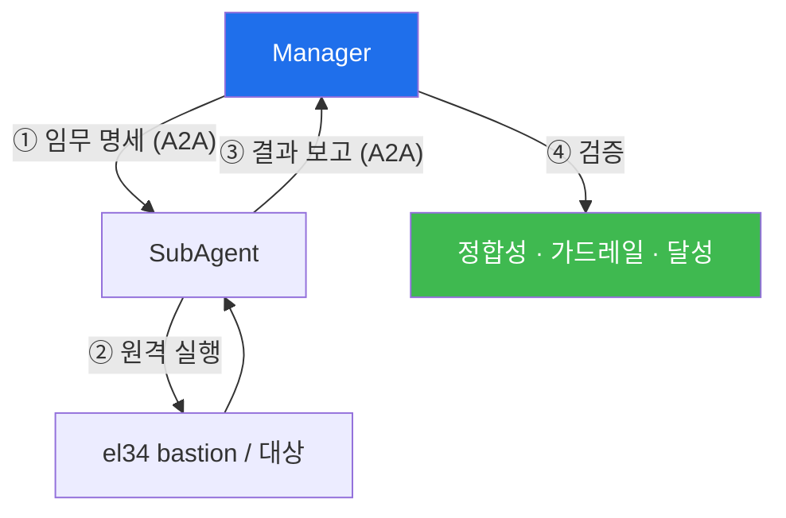

# autonomous-security W04 — SubAgent와 원격 실행: A2A 위임·원격 수행·결과 검증

> **본 주차의 한 줄 요약**
>
> Manager가 계획(W03)을 세우면, 실제 작업은 **SubAgent**가 수행한다. 이 위임과 원격 실행 구조가 이번 주 주제다.
> 핵심은 **A2A(Agent-to-Agent) 통신** — Manager와 SubAgent가 에이전트끼리 **구조화된 메시지**로 임무를 주고받는다:
> Manager가 ① **임무 명세**(목표·도구·컨텍스트·제약·가드레일)를 SubAgent에 위임(delegate)하고, SubAgent가 ② **원격
> 실행**(el34 bastion 등에서 실제 작업 수행) 후 ③ **결과 보고**(수행 내역·산출물·상태)를 Manager에 반환한다. 왜
> SubAgent로 분리하나? ① **관심사 분리**(Manager는 큰 그림·조율, SubAgent는 집중된 실행), ② **격리·안전**(SubAgent는
> 제한된 권한·범위로 실행돼 폭주해도 Manager가 통제 — 가드레일 W01), ③ **병렬·확장**(여러 SubAgent를 병렬로 여러
> 임무에), ④ **원격 실행**(SubAgent가 대상 환경 가까이에서 실행해 효율적). 중요한 안전 원칙은 Manager가 SubAgent의
> **결과를 검증**해야 한다는 것이다 — SubAgent가 실수하거나(환각·오류) 예상 밖 행동을 할 수 있으므로, 결과를 그대로
> 믿지 말고 **정합성·가드레일 위반·목표 달성**을 확인한다. 실습에서는 A2A 위임을 구성하고(마커 `A2A_DELEGATED`),
> 원격 실행 모델을 이해하며(마커 `REMOTE_EXECUTED`), 결과를 검증한다(마커 `RESULT_VALIDATED`). A2A는 이 위임-실행-
> 보고-검증 사이클을 구조화한다 — bastion에서 Manager-SubAgent 협업이 자율 임무 수행의 실행 엔진이다.

---

## 학습 목표

본 주차 종료 시 학생은 다음 5가지를 **본인 손으로** 할 수 있어야 한다.

1. Manager-SubAgent 분리의 이유(관심사·안전·병렬·효율)를 설명한다.
2. **A2A 위임**(임무 명세)을 명확한 계약으로 구성한다(마커 `A2A_DELEGATED`).
3. SubAgent의 **원격 실행** 모델을 이해한다(마커 `REMOTE_EXECUTED`).
4. SubAgent **결과를 검증**한다(마커 `RESULT_VALIDATED`).
5. "신뢰하되 검증"이 왜 자율 안전의 핵심인지 종합한다(마커 `Assessment`).

> **이 주차의 시선** — 계획(Manager)과 실행(SubAgent)이 어떻게 대화하고, Manager가 왜 결과를 검증해야 하는지가
> 핵심이다. 위임만 하고 검증하지 않으면 SubAgent의 오류가 그대로 통과된다.

---

## 0. 용어 해설 (SubAgent·원격 실행)

| 용어 | 영문 | 뜻 | 비유 |
|------|------|----|------|
| **A2A** | Agent-to-Agent | 에이전트끼리 구조화 메시지로 통신 | 요원 간 무전 |
| **위임** | Delegation | Manager가 SubAgent에 임무를 넘김 | 작전 하달 |
| **임무 명세** | Task Spec | 목표·도구·컨텍스트·제약·성공기준 정의 | 작전 명령서 |
| **원격 실행** | Remote Execution | 대상 환경(el34 bastion) 가까이에서 실행 | 현장 파견 수행 |
| **격리** | Isolation | 제한 권한·범위로 실행해 피해를 가둠 | 방화구획 |
| **결과 검증** | Result Validation | 산출물의 정합성·가드레일·달성 확인 | 검수 |
| **신뢰하되 검증** | Trust but Verify | 결과를 그대로 믿지 않고 확인 | 이중 확인 |

> **헷갈리기 쉬운 한 쌍 — 위임 vs 검증.** *위임*은 임무를 넘기는 것, *검증*은 돌아온 결과를 확인하는 것이다. 위임만
> 하고 검증하지 않으면 SubAgent의 환각·오류가 그대로 반영된다. 자율 시스템의 안전은 이 검증 고리에서 나온다.

---

## 0.5 신입생 친화 핵심 개념

### 0.5.1 A2A 위임-실행-보고-검증

Manager가 임무를 위임 → SubAgent가 원격 실행 → 결과 보고 → Manager 검증. A2A가 이 흐름을 구조화한다. 마지막
검증 단계가 없으면 SubAgent의 오류가 그대로 통과한다.

### 0.5.2 임무 명세 — 위임의 계약

Manager가 SubAgent에 넘기는 명세는 명확해야 한다: **목표**(무엇을)·**도구**(무엇으로)·**컨텍스트**(배경)·**제약·
가드레일**(하지 말 것·범위)·**성공 기준**(언제 완료). 명세가 모호하면 SubAgent가 엉뚱한 일을 한다 — 좋은 위임은
명확한 계약이다.

### 0.5.3 왜 분리하나

- **관심사 분리**: Manager=조율·계획, SubAgent=집중 실행.
- **격리·안전**: SubAgent는 제한 권한·범위로 실행 → 폭주해도 통제(가드레일).
- **병렬·확장**: 여러 SubAgent로 여러 임무 동시 수행.
- **원격 효율**: 대상 환경 가까이(el34 bastion)에서 실행.

### 0.5.4 결과 검증 — 신뢰하되 검증

SubAgent도 틀릴 수 있다(LLM 환각·도구 오류·예상 밖 행동). Manager는 결과를 그대로 믿지 말고 검증한다: **정합성**
(결과가 말이 되나)·**가드레일 위반**(범위·금지 어겼나)·**목표 달성**(요구를 채웠나). 검증 실패면 재위임·수정한다.
"신뢰하되 검증(trust but verify)"이 자율 시스템 안전의 핵심이다(agent-ir·ai-security와 연결).

### 0.5.5 el34 맥락

el34 bastion은 SubAgent가 원격 실행하는 환경이다. 이번 실습은 **A2A 위임·원격 실행·결과 검증 로직**을 결정론
시뮬로 익힌다. 실제 bastion 원격 실행은 이후 통합 실습에서 다룬다.

---

## 1. 위임·실행·검증 상세

### 1.1 A2A 위임 (A2A_DELEGATED)

- **한 줄 정의**: 목표·도구·제약·성공기준을 담은 임무 명세를 SubAgent에 전달한다.
- **왜 중요한가**: 명세가 위임의 계약이다. 모호하면 SubAgent가 엉뚱하게 실행한다.
- **el34 맥락에서 어떻게**: 임무 명세(목표·도구·가드레일·성공기준)를 구조화해 위임하면 `A2A_DELEGATED`.
- **한계/주의**: 제약·가드레일을 명세에 포함해야 SubAgent 격리가 성립한다.

### 1.2 원격 실행 (REMOTE_EXECUTED)

- **한 줄 정의**: SubAgent가 대상 환경(bastion)에서 제한 권한으로 작업을 수행한다.
- **핵심**: 격리된 범위 내 실행 + 결과 산출물 회수. 폭주해도 Manager가 통제.
- **판정**: 원격 실행이 범위 내에서 이뤄지고 결과가 반환되면 `REMOTE_EXECUTED`.

### 1.3 결과 검증 (RESULT_VALIDATED)

- **한 줄 정의**: 돌아온 결과의 정합성·가드레일·목표 달성을 확인한다.
- **핵심**: 정합성(말이 되나)·가드레일 위반 여부·목표 충족을 점검. 실패면 재위임.
- **판정**: 결과가 세 기준으로 검증되면 `RESULT_VALIDATED`.

---

## 2. 실습 안내 (총 5 미션)

실행 위치는 el34 **호스트**(`ssh ccc@{{TARGET_IP}}`, 비밀번호 `1`), 참고 GPU는 Ollama
(`http://211.170.162.139:10934`, gemma3:4b)다. 각 미션의 마지막 줄 마커가 채점 기준이다.

### 미션 1 — GPU 헬스체크 → `GEN_OK`

> **왜 하는가?** Manager/SubAgent의 추론 엔진(LLM)이 응답하는지 확인한다.
> **무엇을 아는가?** Ollama 응답 형식·도달성.
> **결과 해석** — 정상 `GEN_OK` / 비정상 `GEN_EMPTY`·연결 오류.
> **실전 활용** — 에이전트 구동 전 LLM 백엔드 확인.

### 미션 2 — A2A 위임 → `A2A_DELEGATED`

> **왜 하는가?** 위임의 계약인 임무 명세를 명확히 구성한다.
> **무엇을 아는가?** 목표·도구·제약·가드레일·성공기준을 담은 명세.
> **결과 해석** — 정상: 명세 위임 + `A2A_DELEGATED`.
> **실전 활용** — Manager의 임무 위임 프로토콜 설계.

### 미션 3 — 원격 실행 → `REMOTE_EXECUTED`

> **왜 하는가?** SubAgent가 격리된 범위에서 원격 실행하는 모델을 이해한다.
> **무엇을 아는가?** 제한 권한 실행·결과 회수.
> **결과 해석** — 정상: 범위 내 실행 + `REMOTE_EXECUTED`.
> **실전 활용** — bastion 원격 실행·격리 설계.

### 미션 4 — 결과 검증 → `RESULT_VALIDATED`

> **왜 하는가?** SubAgent 오류를 잡기 위해 결과를 검증한다.
> **무엇을 아는가?** 정합성·가드레일·목표 달성 확인.
> **결과 해석** — 정상: 검증 통과 + `RESULT_VALIDATED`.
> **실전 활용** — 자율 실행의 안전 게이트("신뢰하되 검증").

### 미션 5 — 종합 소견 → `Assessment`

> **왜 하는가?** 위임·실행·검증 사이클을 하나의 소견으로 묶는다.
> **무엇을 아는가?** GPU에 요약시키되 첫 줄을 `Assessment`로 강제.
> **결과 해석** — 정상: `Assessment` 포함. 없으면 `[형식 미준수 — 재실행]`.
> **실전 활용** — Manager-SubAgent 실행 구조 개요.

---

## 3. 흔한 오해·관제자 노트

- **"위임하면 끝이다."** — 결과 검증이 필수다. SubAgent도 틀린다.
- **"명세는 대충 넘겨도 된다."** — 모호하면 엉뚱한 실행. 명확한 계약이 필요하다.
- **"SubAgent에 전권을 준다."** — 제한 권한·범위·가드레일로 격리한다.
- **"검증은 속도를 늦춘다."** — 검증 없는 자율은 오류를 증폭한다. 안전이 지속 가능성이다.
- **관제(Blue) 관점** — Manager가 (1) 명확한 임무 명세로 위임하는가, (2) SubAgent가 범위 내에서 실행하는가, (3)
  결과가 정합성·가드레일·달성으로 검증되는가, (4) 검증 실패 시 재위임·정지 경로가 있는가를 점검한다.

---

## 4. 다음 주차 (W05) 예고 — Playbook 자동화

W04가 "SubAgent 실행 구조"였다면, W05는 **Playbook 자동화**를 다룬다. 반복되는 보안 임무를 재사용 가능한
플레이북(정형 워크플로)으로 구조화해, 자율 에이전트가 일관되게 실행하도록 만드는 법을 익힌다.
