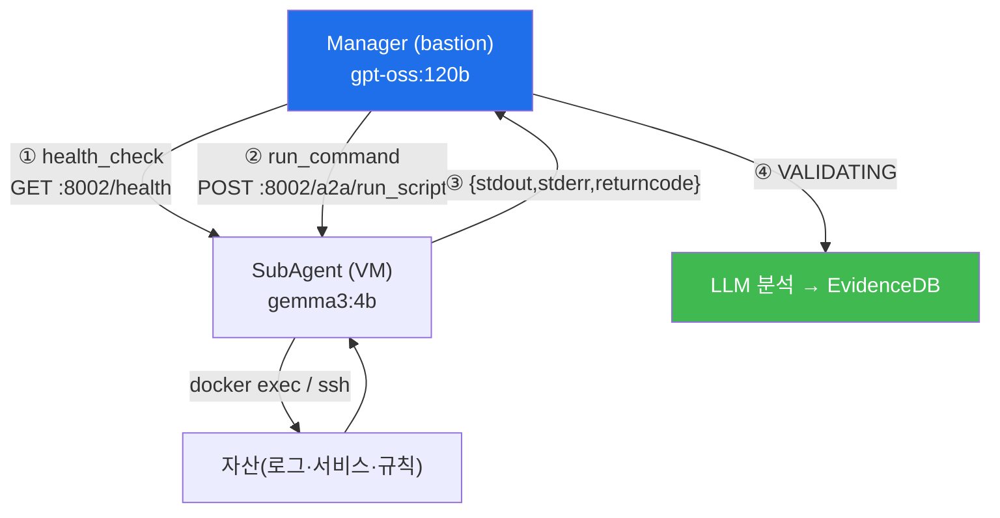

# autonomous-security W04 — SubAgent와 원격 실행: A2A 위임·원격 수행·결과 검증

> **본 주차의 한 줄 요약**
>
> Manager(bastion)가 계획(W03)을 세우면, 실제 명령은 각 VM의 **SubAgent**가 실행한다. 이 위임과 원격 실행 구조가
> 이번 주 주제다. 핵심은 **A2A(Agent-to-Agent) 프로토콜** — Manager와 SubAgent가 HTTP로 통신한다. 각 VM
> (attacker·secu·web·siem·manager)에는 SubAgent가 상주하며(**SSH 온보딩**으로 설치, 포트 **8002**), Manager는
> ① 사전점검 `GET http://{vm_ip}:8002/health`로 SubAgent 생존을 확인하고, ② `POST http://{vm_ip}:8002/a2a/run_script`에
> `{"script": "...bash..."}`를 보내 원격 실행하며, ③ `{"stdout":..., "stderr":..., "returncode":0}`를 받는다
> (`run_command`). 왜 SubAgent로 분리하나? ① **관심사 분리**(Manager는 계획·분석 gpt-oss:120b, SubAgent는 경량 실행
> gemma3:4b), ② **격리·안전**(SubAgent는 대상 VM 범위로 실행 → 위험 작업은 Manager가 `_assess_risk`→승인으로 통제),
> ③ **원격·자산 근접**(각 VM 위에서 docker exec/ssh로 자산에 작용), ④ **확장**(여러 VM에 병렬). 중요한 안전 원칙은
> Manager가 결과를 **분석·검증(VALIDATING)**하고 **EvidenceDB**에 기록한다는 것 — 실행이 성공했는지, 목표를 채웠는지를
> 그대로 믿지 않고 확인한다. 실습에서는 A2A 위임을 구성하고(마커 `A2A_DELEGATED`), 원격 실행 모델을 이해하며(마커
> `REMOTE_EXECUTED`), 결과를 검증한다(마커 `RESULT_VALIDATED`).

---

## 학습 목표

본 주차 종료 시 학생은 다음 5가지를 **본인 손으로** 할 수 있어야 한다.

1. Manager-SubAgent 분리의 이유(관심사·안전·원격·확장)를 설명한다.
2. **A2A 위임**(대상 VM·명령 명세)을 구성한다(마커 `A2A_DELEGATED`).
3. SubAgent의 **원격 실행** 모델(`/health`·`/a2a/run_script`)을 이해한다(마커 `REMOTE_EXECUTED`).
4. 실행 **결과를 검증**한다(마커 `RESULT_VALIDATED`).
5. "신뢰하되 검증(VALIDATING·EvidenceDB)"이 왜 자율 안전의 핵심인지 종합한다(마커 `Assessment`).

> **이 주차의 시선** — 계획(Manager)과 실행(SubAgent)이 A2A로 어떻게 대화하는지, Manager가 왜 결과를 검증·기록하는지가
> 핵심이다. 위임만 하고 검증하지 않으면 실행 오류가 그대로 통과한다.

---

## 0. 용어 해설 (SubAgent·A2A)

| 용어 | 영문 | 뜻 | 비유 |
|------|------|----|------|
| **SubAgent** | SubAgent | 각 VM에 상주하는 원격 실행기(포트 8002) | 현장 파견 요원 |
| **A2A** | Agent-to-Agent | Manager↔SubAgent HTTP 프로토콜 | 무전 |
| **온보딩** | Onboarding | SSH로 SubAgent 설치·역할 SW 배포 | 요원 배치 |
| **health_check** | — | `GET /health`로 SubAgent 생존 확인 | 생존 신호 |
| **run_command** | — | `POST /a2a/run_script`로 원격 실행 | 명령 전달 |
| **격리** | Isolation | 대상 VM 범위로 제한 실행 | 방화구획 |
| **VALIDATING** | — | 결과를 분석·검증하고 EvidenceDB 기록 | 검수·기록 |

> **헷갈리기 쉬운 한 쌍 — 위임 vs 검증.** *위임*은 SubAgent에 명령을 넘기는 것, *검증(VALIDATING)*은 돌아온
> `{stdout,stderr,returncode}`를 LLM으로 분석하고 EvidenceDB에 기록하는 것이다. 위임만 하고 검증하지 않으면 실패·
> 오판이 통과된다.

---

## 0.5 신입생 친화 핵심 개념

### 0.5.1 A2A 위임-실행-검증

Manager가 생존 확인 후 스크립트를 위임 → SubAgent가 VM에서 실행 → 결과 반환 → Manager가 분석·기록. 위임과 실행이
분리돼 안전·확장이 오른다.

### 0.5.2 온보딩과 A2A 프로토콜

- **온보딩**: Manager가 각 VM에 **SSH로 접속해 SubAgent를 설치**하고 역할별 소프트웨어를 배포한다(포트 8002 개방).
- **health_check**: `GET :8002/health`로 실행 전 생존 확인(죽은 VM에 명령 낭비 방지).
- **run_command**: `POST :8002/a2a/run_script {"script":...}` → `{"stdout","stderr","returncode"}`.

명세가 명확해야(대상 VM·명령) 옳은 VM에서 옳은 작업이 실행된다.

### 0.5.3 왜 분리하나

- **관심사 분리**: Manager=계획·분석(gpt-oss:120b), SubAgent=경량 실행(gemma3:4b).
- **격리·안전**: SubAgent는 대상 VM 범위로 실행, 위험 작업은 Manager `_assess_risk`→승인.
- **원격·자산 근접**: 각 VM 위에서 docker exec/ssh로 자산에 직접 작용.
- **확장**: 여러 VM에 병렬 위임.

### 0.5.4 결과 검증 — VALIDATING

SubAgent 실행도 실패·오판이 가능하다(returncode≠0·부분 성공·환각). Manager는 결과를 그대로 믿지 않고 **VALIDATING**
단계에서 LLM으로 분석하고 **EvidenceDB(evidence-first)**에 기록한다: 성공했나(returncode·출력), 목표를 채웠나. 실패면
재시도·수정. "신뢰하되 검증"이 자율 시스템 안전의 핵심이다.

### 0.5.5 el34 맥락

el34의 각 VM에 SubAgent가 상주해 A2A로 명령을 실행한다. 이번 실습은 **A2A 위임·원격 실행·결과 검증 로직**을 결정론
시뮬로 익힌다(실제 A2A 실행은 이후 통합 실습).

---

## 1. 위임·실행·검증 상세

### 1.1 A2A 위임 (A2A_DELEGATED)

- **한 줄 정의**: 대상 VM과 실행 스크립트를 명세로 SubAgent에 전달한다.
- **왜 중요한가**: 대상 VM이 불명확하면 잘못된 VM으로 라우팅된다(bastion 프롬프트 원칙 "대상 VM을 명시하라").
- **bastion에서 어떻게**: `POST {vm}:8002/a2a/run_script`에 명확한 스크립트를 위임하면 `A2A_DELEGATED`.
- **한계/주의**: 위험 스크립트는 위임 전 `_assess_risk`→승인을 거친다.

### 1.2 원격 실행 (REMOTE_EXECUTED)

- **한 줄 정의**: SubAgent가 대상 VM에서 스크립트를 실행하고 결과를 반환한다.
- **핵심**: health_check 후 실행, docker exec/ssh로 자산 작용, `{stdout,stderr,returncode}` 회수.
- **판정**: 격리된 범위에서 실행·회수되면 `REMOTE_EXECUTED`.

### 1.3 결과 검증 (RESULT_VALIDATED)

- **한 줄 정의**: 반환 결과를 분석해 성공·목표 달성을 확인하고 기록한다.
- **핵심**: returncode·출력을 LLM으로 분석(VALIDATING), EvidenceDB에 저장. 실패면 재시도.
- **판정**: 결과가 검증·기록되면 `RESULT_VALIDATED`.

---

## 2. 실습 안내 (총 5 미션)

실행 위치는 el34 **호스트**(`ssh ccc@{{TARGET_IP}}`, 비밀번호 `1`), 참고 GPU는 Ollama
(`http://211.170.162.139:10934`, gemma3:4b)다. 각 미션의 마지막 줄 마커가 채점 기준이다.

### 미션 1 — GPU 헬스체크 → `GEN_OK`

> **왜 하는가?** SubAgent LLM(gemma3:4b) 도달·응답 확인.
> **무엇을 아는가?** Ollama 응답 형식·도달성.
> **결과 해석** — 정상 `GEN_OK` / 비정상 `GEN_EMPTY`·연결 오류.
> **실전 활용** — 종합 소견 작성에 사용.

### 미션 2 — A2A 위임 → `A2A_DELEGATED`

> **왜 하는가?** 대상 VM·명령을 명확히 위임하는 법을 익힌다.
> **무엇을 아는가?** run_script 명세(대상 VM·스크립트).
> **결과 해석** — 정상: 명세 위임 + `A2A_DELEGATED`.
> **실전 활용** — Manager의 원격 명령 프로토콜.

### 미션 3 — 원격 실행 → `REMOTE_EXECUTED`

> **왜 하는가?** SubAgent 원격 실행 모델(`/health`·`/a2a/run_script`)을 이해한다.
> **무엇을 아는가?** 사전점검·실행·결과 회수.
> **결과 해석** — 정상: 범위 내 실행 + `REMOTE_EXECUTED`.
> **실전 활용** — A2A 원격 실행·격리 설계.

### 미션 4 — 결과 검증 → `RESULT_VALIDATED`

> **왜 하는가?** 실행 오류를 잡기 위해 결과를 검증·기록한다.
> **무엇을 아는가?** returncode·출력 분석, EvidenceDB 기록.
> **결과 해석** — 정상: 검증·기록 + `RESULT_VALIDATED`.
> **실전 활용** — 자율 실행의 안전 게이트(VALIDATING).

### 미션 5 — 종합 소견 → `Assessment`

> **왜 하는가?** 위임·실행·검증 사이클을 하나의 소견으로 묶는다.
> **무엇을 아는가?** GPU에 요약시키되 첫 줄을 `Assessment`로 강제.
> **결과 해석** — 정상: `Assessment` 포함. 없으면 `[형식 미준수 — 재실행]`.
> **실전 활용** — Manager-SubAgent 실행 구조 개요.

---

## 2.5 과제 (제출물)

- **A. A2A 위임 실증 (필수, 40점)** — `A2A_DELEGATED` 단계를 직접 수행해 실제 명령·출력(또는 아티팩트 분석 결과)을 캡처하고, 무엇을 근거로 판정했는지 서술한다.
- **B. 원격 실행 분석 (필수, 30점)** — `REMOTE_EXECUTED` 단계를 직접 수행해 실제 명령·출력(또는 아티팩트 분석 결과)을 캡처하고, 무엇을 근거로 판정했는지 서술한다.
- **C. 결과 검증 방어 설계 (필수, 30점)** — `RESULT_VALIDATED` 단계를 직접 수행해 실제 명령·출력(또는 아티팩트 분석 결과)을 캡처하고, 무엇을 근거로 판정했는지 서술한다.

## 2.6 평가 기준

| 항목 | 미흡(0) | 보통 | 우수 |
|------|---------|------|------|
| 탐지/실증(A2A_DELEGATED) | 미수행 | 마커 도출 | 근거·해석·재현까지 |
| 분석(REMOTE_EXECUTED) | 미수행 | 마커 도출 | 근거·해석·재현까지 |
| 방어(RESULT_VALIDATED) | 미수행 | 마커 도출 | 근거·해석·재현까지 |

## 2.7 핵심 정리 (1줄씩)

- 이번 주 주제: **SubAgent와 원격 실행: A2A 위임·원격 수행·결과 검증**.
- **A2A 위임**(`A2A_DELEGATED`): 대상 VM과 실행 스크립트를 명세로 SubAgent에 전달한다.
- **원격 실행**(`REMOTE_EXECUTED`): SubAgent가 대상 VM에서 스크립트를 실행하고 결과를 반환한다.
- **결과 검증**(`RESULT_VALIDATED`): 반환 결과를 분석해 성공·목표 달성을 확인하고 기록한다.
- 공격을 이해한 만큼 **방어의 우선순위**가 분명해진다 — 탐지 근거와 완화를 함께 익힌다.

---

## 3. 흔한 오해·블루팀 노트

- **"위임하면 끝이다."** — VALIDATING으로 결과를 검증·기록한다. SubAgent도 실패한다.
- **"대상 VM은 알아서 정해진다."** — 대상 VM을 명시해야 옳은 곳에서 실행된다(라우팅 오류 방지).
- **"SubAgent에 전권을 준다."** — 대상 VM 범위로 격리하고 위험 작업은 Manager 승인.
- **"검증은 속도를 늦춘다."** — 검증 없는 자율은 오류를 증폭한다. EvidenceDB 기록이 사후 추적의 기반.
- **관제(Blue) 관점** — (1) health_check로 생존 확인 후 실행하는가, (2) 위험 스크립트에 승인이 걸리는가, (3) 결과가
  VALIDATING·EvidenceDB로 검증·기록되는가, (4) 대상 VM 격리가 지켜지는가를 점검한다.

---

## 4. 다음 주차 (W05) 예고 — Playbook 자동화

W04가 "SubAgent A2A 실행 구조"였다면, W05는 **Playbook 자동화**를 다룬다. bastion의 정적 Playbook(YAML)과 동적
Playbook 생성으로 반복 보안 임무를 재사용 가능하게 구조화하는 법을 익힌다.
