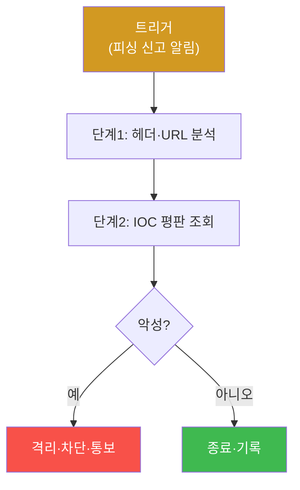

# autonomous-security W05 — Playbook 자동화: 재사용 가능한 보안 임무 구조화

> **본 주차의 한 줄 요약**
>
> 자율 보안에서 많은 임무는 **반복**된다 — 피싱 대응·의심 IP 조사·랜섬웨어 격리·취약점 스캔. 매번 처음부터
> 계획하면 비효율·비일관적이다. **Playbook(플레이북)**은 이런 반복 임무를 **재사용 가능한 절차**로 구조화한
> 것이다(SOAR·IR 플레이북의 자율 에이전트판). 플레이북의 구성은 넷이다: ① **트리거(trigger)** — 언제 발동하나
> (특정 알림·이벤트·스케줄), ② **단계(steps)** — 순차/조건부 행동(조사→판단→대응), 각 단계는 도구 호출·판단,
> ③ **분기(branching)** — 조건에 따라 다른 경로(악성이면 격리, 아니면 종료), ④ **성공 기준·에스컬레이션** — 완료
> 판정·실패 시 사람에게. 자율 에이전트는 플레이북을 **실행 엔진**으로 삼되, LLM의 유연함으로 **정형 절차 + 상황
> 적응**을 결합한다 — 고정 스크립트처럼 뻣뻣하지 않게, 그러나 무작정 즉흥적이지 않게. 실습에서는 플레이북을
> 정의하고(마커 `PLAYBOOK_DEFINED`), 조건 분기로 실행하며(마커 `PLAYBOOK_EXECUTED`), 파라미터화해 재사용한다(마커
> `PLAYBOOK_REUSED`). 플레이북의 가치는 **일관성**(매번 같은 품질)·**속도**(계획 재사용)·**감사 가능성**(무엇을 왜
> 했는지 기록)·**개선**(경험으로 플레이북 갱신, W03·W09)이다. 좋은 플레이북은 파라미터화돼(대상·임계값을 변수로)
> 여러 상황에 재사용된다 — bastion은 플레이북 라이브러리를 갖고, Manager가 임무에 맞는 것을 선택·적응해 SubAgent에
> 실행시킨다.

---

## 학습 목표

본 주차 종료 시 학생은 다음 5가지를 **본인 손으로** 할 수 있어야 한다.

1. Playbook의 구조(트리거·단계·분기·성공기준)와 가치(일관성·속도·감사·개선)를 설명한다.
2. 플레이북을 **정의**한다(마커 `PLAYBOOK_DEFINED`).
3. 조건 분기로 플레이북을 **실행**한다(마커 `PLAYBOOK_EXECUTED`).
4. 플레이북을 **파라미터화·재사용**한다(마커 `PLAYBOOK_REUSED`).
5. 정형 절차와 LLM 적응의 결합을 종합한다(마커 `Assessment`).

> **이 주차의 시선** — 반복 임무를 매번 즉흥이 아닌 재사용 절차로 만든다. "정형의 일관성 + LLM의 적응"이라는 균형이
> 핵심이다.

---

## 0. 용어 해설 (Playbook)

| 용어 | 영문 | 뜻 | 비유 |
|------|------|----|------|
| **Playbook** | Playbook | 반복 임무를 정형화한 재사용 절차 | 작전 매뉴얼 |
| **SOAR** | Security Orchestration, Automation & Response | 보안 대응을 자동화·조율하는 체계 | 관제 자동화 시스템 |
| **트리거** | Trigger | 플레이북 발동 조건(알림·이벤트·스케줄) | 발동 스위치 |
| **단계** | Step | 순차/조건부 행동(도구 호출·판단) | 절차 항목 |
| **분기** | Branching | 조건에 따라 다른 경로 선택 | 갈림길 |
| **에스컬레이션** | Escalation | 자동 처리 불가 시 사람에게 이관 | 상부 보고 |
| **파라미터화** | Parameterization | 대상·임계값을 변수로 빼 재사용 | 빈칸 있는 양식 |
| **감사 가능성** | Auditability | 무엇을 왜 했는지 추적 가능 | 결재 이력 |

> **헷갈리기 쉬운 한 쌍 — 고정 스크립트 vs 플레이북+LLM.** *고정 스크립트*는 정해진 대로만 실행해 예상 밖 상황에
> 뻣뻣하다. *플레이북+LLM*은 정형 절차를 뼈대로 삼되 각 단계를 상황에 맞게 적응한다. 정형(일관성)과 적응(유연)의
> 결합이 자율 대응의 강점이다.

---

## 0.5 신입생 친화 핵심 개념

### 0.5.1 플레이북 구조

트리거로 발동 → 단계 실행 → 조건 분기 → 대응/종료. 정형화된 흐름이 매번 같은 품질과 누락 없는 처리를 준다.

### 0.5.2 정형 절차 + LLM 적응

고정 스크립트는 예상 밖 상황에 뻣뻣하다. LLM 에이전트는 플레이북을 **뼈대**로 삼되, 각 단계에서 상황에 맞게
적응한다(비정형 로그 해석·예외 처리). "절차의 일관성 + LLM의 유연함" — 무작정 즉흥도, 뻣뻣한 스크립트도 아닌
중간이다.

### 0.5.3 플레이북의 가치

- **일관성**: 매번 같은 품질·누락 없음.
- **속도**: 계획을 재사용해 빠르게.
- **감사 가능성**: 무엇을 왜 했는지 기록(규정·사후 분석).
- **개선**: 경험으로 플레이북을 갱신(W03·W09) — 실패에서 배워 절차를 보강.

### 0.5.4 파라미터화·재사용

좋은 플레이북은 파라미터화된다: 대상 IP·임계값·격리 대상을 **변수**로 둔다. "의심 IP 조사" 플레이북 하나로 여러
IP를 처리한다. 파라미터화가 재사용성을 높인다. bastion은 플레이북 라이브러리를 두고, Manager가 임무에 맞는
플레이북을 선택·파라미터를 채워 실행한다.

### 0.5.5 bastion의 Playbook — 정적·동적, "Playbook이 법"

bastion은 실제 YAML Playbook 라이브러리를 갖는다(`contents/playbooks/`): `incident_response`·`hardening`·
`vuln_scan`·`security_audit`·`log_investigation`·`wazuh_health`·`attack_simulation`·`probe_all`. PLANNING 단계
(W03)에서 **정적 Playbook 매칭이 최우선**이고(재현성), 맞는 것이 없으면 Skill 선택 → **동적 Playbook 생성**(LLM이
즉석 스텝)으로 내려간다. KG 원칙 "**동일 작업=동일 방법: Playbook이 법, Experience는 보조 노트**"가 여기 적용된다.
이번 실습은 **플레이북 정의·실행·재사용 로직**을 결정론 시뮬로 익힌다.

---

## 1. 플레이북 상세 — 정의·실행·재사용

### 1.1 플레이북 정의 (PLAYBOOK_DEFINED)

- **한 줄 정의**: 트리거·단계·분기·성공기준으로 반복 임무를 구조화한다.
- **왜 중요한가**: 구조가 있어야 일관·감사·재사용이 가능하다.
- **el34 맥락에서 어떻게**: 예로 "피싱 대응" 플레이북(트리거→분석→평판→분기→격리/종료)을 정의하면 `PLAYBOOK_DEFINED`.
- **한계/주의**: 성공기준·에스컬레이션이 빠지면 완료 판정·실패 처리가 모호해진다.

### 1.2 플레이북 실행 (PLAYBOOK_EXECUTED)

- **한 줄 정의**: 트리거 발동 후 단계를 진행하고 조건에 따라 분기한다.
- **핵심**: 각 단계에서 LLM이 상황에 적응하되 절차의 뼈대를 유지. 악성/정상 분기로 다른 경로.
- **판정**: 분기를 포함한 실행이 완결되면 `PLAYBOOK_EXECUTED`.

### 1.3 파라미터화 재사용 (PLAYBOOK_REUSED)

- **한 줄 정의**: 대상·임계값을 변수로 빼 같은 플레이북을 다른 입력에 재사용한다.
- **핵심**: 하드코딩 대신 파라미터로 여러 상황 처리.
- **판정**: 파라미터를 바꿔 재사용이 성립하면 `PLAYBOOK_REUSED`.

---

## 2. 실습 안내 (총 5 미션)

실행 위치는 el34 **호스트**(`ssh ccc@{{TARGET_IP}}`, 비밀번호 `1`), 참고 GPU는 Ollama
(`http://211.170.162.139:10934`, gemma3:4b)다. 각 미션의 마지막 줄 마커가 채점 기준이다.

### 미션 1 — GPU 헬스체크 → `GEN_OK`

> **왜 하는가?** 플레이북 각 단계에서 판단할 LLM이 응답하는지 확인한다.
> **무엇을 아는가?** Ollama 응답 형식·도달성.
> **결과 해석** — 정상 `GEN_OK` / 비정상 `GEN_EMPTY`·연결 오류.
> **실전 활용** — 자율 대응 엔진 구동 전 확인.

### 미션 2 — 플레이북 정의 → `PLAYBOOK_DEFINED`

> **왜 하는가?** 반복 임무를 재사용 절차로 구조화한다.
> **무엇을 아는가?** 트리거·단계·분기·성공기준·에스컬레이션.
> **결과 해석** — 정상: 플레이북 정의 + `PLAYBOOK_DEFINED`.
> **실전 활용** — IR/SOAR 플레이북 설계.

### 미션 3 — 플레이북 실행 → `PLAYBOOK_EXECUTED`

> **왜 하는가?** 정의한 플레이북을 조건 분기로 실행한다.
> **무엇을 아는가?** 단계 진행·악성/정상 분기·상황 적응.
> **결과 해석** — 정상: 분기 실행 + `PLAYBOOK_EXECUTED`.
> **실전 활용** — 자율 대응 실행.

### 미션 4 — 파라미터화 재사용 → `PLAYBOOK_REUSED`

> **왜 하는가?** 같은 플레이북을 여러 입력에 재사용하게 한다.
> **무엇을 아는가?** 대상·임계값을 변수화해 재사용.
> **결과 해석** — 정상: 재사용 + `PLAYBOOK_REUSED`.
> **실전 활용** — 플레이북 라이브러리 운영.

### 미션 5 — 종합 소견 → `Assessment`

> **왜 하는가?** 정의·실행·재사용과 "정형+적응"을 하나의 소견으로 묶는다.
> **무엇을 아는가?** GPU에 요약시키되 첫 줄을 `Assessment`로 강제.
> **결과 해석** — 정상: `Assessment` 포함. 없으면 `[형식 미준수 — 재실행]`.
> **실전 활용** — 자율 대응 절차 개요.

---

## 3. 흔한 오해·관제자 노트

- **"플레이북은 뻣뻣한 스크립트다."** — LLM과 결합해 상황에 적응한다. 절차+유연.
- **"한 번 만들면 끝이다."** — 경험으로 갱신한다. 개선 순환(W03·W09).
- **"파라미터 없이 하드코딩한다."** — 재사용이 불가하다. 변수화가 핵심.
- **"자동 처리하면 사람은 필요 없다."** — 자동 처리 불가 상황은 에스컬레이션으로 사람에게 넘긴다.
- **관제(Blue) 관점** — 반복 임무가 (1) 플레이북으로 구조화됐는가, (2) 파라미터화·재사용되는가, (3) 감사 기록이
  남는가, (4) 경험으로 개선되는가, (5) 에스컬레이션 경로가 있는가를 점검한다.

---

## 4. 다음 주차 (W06) 예고 — PoW 작업증명과 검증 가능한 감사

W05가 "재사용 플레이북"이었다면, W06은 **작업증명(PoW)과 검증 가능한 감사**를 다룬다. 자율 에이전트의 행동을
변조 불가하게 기록·검증하는 신뢰 메커니즘으로, 자율 시스템이 "무엇을 왜 했는지"를 증명 가능하게 만드는 원리를 익힌다.
