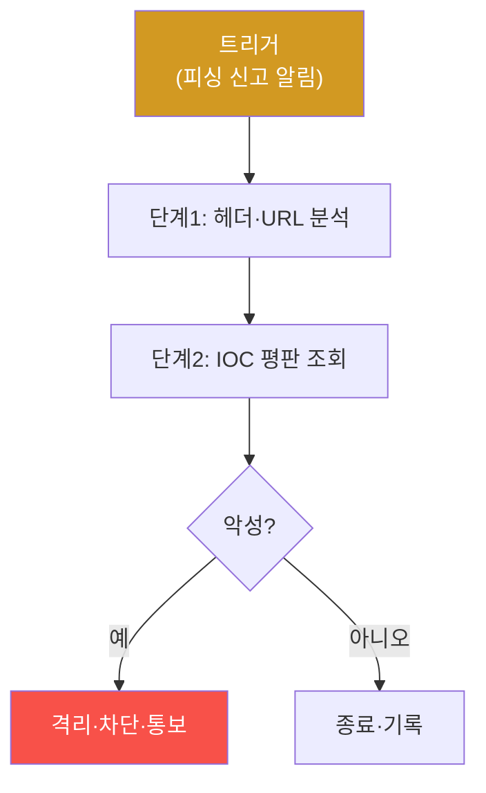

# autonomous-security W05 — Playbook 자동화: 재사용 가능한 보안 임무 구조화

> **본 주차의 한 줄 요약**
>
> 자율 보안에서 많은 임무는 **반복**된다 — 피싱 대응·의심 IP 조사·랜섬웨어 격리·취약점 스캔. 매번 처음부터
> 계획하면 비효율·비일관적이다. **Playbook(플레이북)** 은 이런 반복 임무를 **재사용 가능한 절차**로 구조화한
> 것이다(SOAR·IR 플레이북의 자율 에이전트판). 플레이북의 구성: ① **트리거(trigger)** — 언제 발동하나(특정 알림·
> 이벤트·스케줄), ② **단계(steps)** — 순차/조건부 행동들(조사→판단→대응), 각 단계는 도구 호출·판단, ③ **분기
> (branching)** — 조건에 따라 다른 경로(악성이면 격리, 아니면 종료), ④ **성공 기준·에스컬레이션** — 완료 판정·
> 실패 시 사람에게. 자율 에이전트는 플레이북을 **실행 엔진**으로 삼되, LLM의 유연함으로 **정형 절차 + 상황 적응**을
> 결합한다 — 고정 스크립트처럼 뻣뻣하지 않게, 그러나 무작정 즉흥적이지 않게. 플레이북의 가치: **일관성**(매번
> 같은 품질)·**속도**(계획 재사용)·**감사 가능성**(무엇을 왜 했는지 기록)·**개선**(경험으로 플레이북 갱신, W03·W09).
> 좋은 플레이북은 **파라미터화**돼(대상·임계값을 변수로) 여러 상황에 재사용된다. bastion은 플레이북 라이브러리를
> 갖고, Manager가 임무에 맞는 플레이북을 선택·적응해 SubAgent에 실행시킨다.
>
> **한 줄 결론**: Playbook은 반복 보안 임무를 **트리거·단계·분기·성공 기준**으로 구조화한 재사용 절차다. 일관성·
> 속도·감사·개선을 주며, LLM 에이전트가 정형 절차와 상황 적응을 결합해 실행한다.

---

## 학습 목표

본 주차 종료 시 학생은 다음 5가지를 **본인 손으로** 할 수 있어야 한다.

1. **Playbook**의 구조와 가치를 설명한다.
2. 플레이북(트리거·단계·분기)을 **정의**한다(PLAYBOOK_DEFINED).
3. 플레이북을 **실행**(조건 분기)한다(PLAYBOOK_EXECUTED).
4. 플레이북을 **파라미터화·재사용**한다(PLAYBOOK_REUSED).
5. 정형 절차와 LLM 적응의 결합을 설명한다.

> **이 주차의 시선** — 반복 임무를 재사용 플레이북으로 구조화해 일관되고 빠른 자율 대응을 만든다.

---

## 0. 용어 해설 (Playbook)

| 용어 | 영문 | 뜻 | 비유 |
|------|------|----|------|
| **Playbook** | — | 임무 절차 | 작전 매뉴얼 |
| **트리거** | Trigger | 발동 조건 | 발동 스위치 |
| **분기** | Branching | 조건 경로 | 갈림길 |
| **에스컬레이션** | Escalation | 상위 이관 | 상부 보고 |
| **파라미터화** | Parameterization | 변수화 | 빈칸 채우기 |

> **헷갈리기 쉬운 한 쌍** — *고정 스크립트* 는 "정해진 대로만(뻣뻣)", *플레이북+LLM* 은 "절차 + 상황 적응(유연)"
> 이다. 정형과 적응의 결합.

---

## 0.5 신입생 친화 핵심 개념

### 0.5.1 플레이북 구조

트리거로 발동→단계 실행→조건 분기→대응/종료. 정형화된 흐름이 일관성을 준다.

### 0.5.2 정형 절차 + LLM 적응

고정 스크립트는 예상 밖 상황에 뻣뻣하다. LLM 에이전트는 플레이북을 **뼈대**로 삼되, 각 단계에서 **상황에 맞게
적응**한다(비정형 로그 해석·예외 처리). "절차의 일관성 + LLM의 유연함". 무작정 즉흥도, 뻣뻣한 스크립트도 아닌
중간.

### 0.5.3 플레이북의 가치

- **일관성**: 매번 같은 품질·누락 없음.
- **속도**: 계획을 재사용해 빠르게.
- **감사 가능성**: 무엇을 왜 했는지 기록(규정·사후 분석).
- **개선**: 경험으로 플레이북을 갱신(W03·W09) — 실패에서 배워 절차 보강.

### 0.5.4 파라미터화·재사용

좋은 플레이북은 **파라미터화**된다: 대상 IP·임계값·격리 대상을 **변수**로. "의심 IP 조사" 플레이북 하나로 여러
IP를 처리한다. 파라미터화가 재사용성을 높인다. bastion은 플레이북 라이브러리를 두고, Manager가 임무에 맞는
플레이북을 선택·파라미터를 채워 실행.

### 0.5.5 el34 맥락

el34에서 플레이북으로 자율 대응(웹 공격·의심 IP)을 구조화할 수 있다. 본 실습은 **플레이북 정의·실행·재사용
로직**을 결정론 시뮬로 익힌다.

---

## 1. 실습 안내 (5 미션)

실행 위치 el34 **호스트**(`ssh ccc@{{TARGET_IP}}`), GPU `http://211.170.162.139:10934`.

### STEP 1 — GPU 헬스체크 → GEN_OK
### STEP 2 — 플레이북 정의 → PLAYBOOK_DEFINED
### STEP 3 — 플레이북 실행 → PLAYBOOK_EXECUTED
### STEP 4 — 파라미터화 재사용 → PLAYBOOK_REUSED
### STEP 5 — 종합 → Assessment

---

## 2. 흔한 오해·관제자 노트

- **"플레이북은 뻣뻣한 스크립트"** — LLM과 결합해 적응. 절차+유연.
- **"한 번 만들면 끝"** — 경험으로 갱신. 개선 순환.
- **"파라미터 없이 하드코딩"** — 재사용 불가. 파라미터화.
- **관제 관점** — 반복 임무가 플레이북으로 구조화됐는지, 파라미터화·감사 기록·개선되는지 점검한다. 플레이북이
  일관되고 빠른 자율 대응의 기반.

---

## 3. 다음 주차 (W06) 예고 — PoW 작업증명과 블록체인

W05가 "플레이북"이었다면, W06은 **PoW(작업증명)와 블록체인** — 자율 에이전트의 행동을 검증·기록하는 신뢰
메커니즘(변조 불가 감사 로그·작업 증명)을 다룬다.
