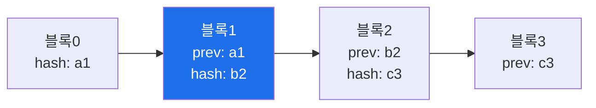

# autonomous-security W06 — PoW 작업증명과 블록체인: 변조 불가 감사 로그

> **본 주차의 한 줄 요약**
>
> 자율 에이전트가 스스로 보안 행동을 하면, **"무엇을 왜 했는지"를 신뢰할 수 있게 기록**하는 것이 중요하다 —
> 사후 감사·책임 추적·규정 준수를 위해. 하지만 로그는 **변조**될 수 있다(공격자가 자기 흔적을 지우거나, 에이전트
> 오작동을 숨기려). W06은 **블록체인(blockchain)** 원리로 **변조 불가(tamper-evident) 감사 로그**를 만든다. 핵심
> 개념: ① **해시 체인(hash chain)** — 각 로그 블록이 **이전 블록의 해시**를 포함한다. 블록1→블록2→블록3... 각
> 블록이 앞 블록의 지문을 담아 사슬처럼 연결. 중간 블록을 변조하면 그 해시가 바뀌고, 그걸 참조하는 다음 블록들이
> 전부 깨져 **변조가 즉시 드러난다**, ② **작업증명(PoW, Proof of Work)** — 블록을 추가하려면 **계산 비용이 드는
> 퍼즐**(특정 조건을 만족하는 nonce 찾기, 예: 해시가 0으로 시작)을 풀어야 한다. 변조하려면 그 블록 **이후 모든
> 블록의 PoW를 다시** 계산해야 해서 **엄청나게 비싸다** → 변조 억제, ③ **무결성 검증** — 체인을 처음부터 재계산해
> 일관성을 확인하면 변조 여부를 안다. 자율 보안에서의 의미: 에이전트의 모든 행동(조사·차단·격리)을 이 변조 불가
> 로그에 기록하면, 사후에 **누가 무엇을 했는지 신뢰**할 수 있고 공격자가 흔적을 조작하기 어렵다. 완전한 분산
> 블록체인이 아니어도, **해시 체인 감사 로그**만으로 무결성이 크게 오른다.
>
> **한 줄 결론**: 블록체인 원리(**해시 체인 + 작업증명**)로 자율 에이전트 행동의 **변조 불가 감사 로그**를 만든다.
> 각 블록이 앞 블록 해시를 담아 변조가 드러나고, PoW가 변조를 비싸게 만든다.

---

## 학습 목표

본 주차 종료 시 학생은 다음 5가지를 **본인 손으로** 할 수 있어야 한다.

1. **변조 불가 감사 로그**의 필요를 설명한다.
2. **해시 체인**으로 감사 로그를 구축한다(CHAIN_BUILT).
3. **작업증명(PoW)** 을 계산한다(POW_SOLVED).
4. **변조를 탐지**한다(TAMPER_DETECTED).
5. 자율 보안에서 감사 무결성의 의미를 설명한다.

> **이 주차의 시선** — 에이전트 행동을 신뢰할 수 있게 기록하는 변조 불가 로그를 익힌다.

---

## 0. 용어 해설 (블록체인)

| 용어 | 영문 | 뜻 | 비유 |
|------|------|----|------|
| **해시 체인** | Hash Chain | 해시로 연결된 블록 | 봉인 사슬 |
| **작업증명** | Proof of Work | 계산 퍼즐 | 노력 증명 |
| **nonce** | — | PoW 정답 값 | 자물쇠 조합 |
| **난이도** | Difficulty | 퍼즐 어려움 | 자물쇠 강도 |
| **변조 불가** | Tamper-evident | 변조가 드러남 | 봉인 |

> **헷갈리기 쉬운 한 쌍** — *변조 불가(tamper-evident)* 는 "변조가 드러남", *변조 방지(tamper-proof)* 는 "변조가
> 불가능"이다. 해시 체인은 전자 — 변조하면 즉시 드러난다.

---

## 0.5 신입생 친화 핵심 개념

### 0.5.1 해시 체인

각 블록이 **앞 블록의 해시**를 담는다. 블록1을 변조하면 hash b2가 바뀌고, 블록2의 prev(b2)가 안 맞아 사슬이
깨진다 → 변조가 그 지점부터 전부 드러난다.

### 0.5.2 작업증명 (PoW)

블록을 추가하려면 **해시가 특정 조건**(예: 앞자리가 "00")을 만족하는 **nonce**를 찾아야 한다. 이건 시행착오로만
풀려 **계산 비용**이 든다(난이도로 조절). 정직한 추가는 한 번만 계산하면 되지만, **변조**하려면 그 블록부터 끝
까지 **모든 PoW를 다시** 풀어야 해 사실상 불가능. 노력이 무결성을 지킨다.

### 0.5.3 변조 탐지

체인을 **처음부터 재계산·검증**한다: 각 블록의 해시가 조건을 만족하나? 각 블록의 prev가 앞 블록 해시와 맞나?
하나라도 안 맞으면 **그 지점이 변조**됐다. 감사 시 이 검증으로 로그 무결성을 확인한다.

### 0.5.4 자율 보안에서의 의미

에이전트의 모든 행동(조사·차단·격리·공격 시뮬)을 이 변조 불가 로그에 기록하면:
- **책임 추적**: 누가(어느 에이전트) 무엇을 왜 했는지 신뢰할 수 있게.
- **변조 저항**: 공격자가 침입 후 흔적을 지우기 어려움(로그 변조가 드러남).
- **규정·감사**: 무결한 기록으로 규정 준수·사후 분석.
자율 시스템은 강력한 만큼 **행동의 투명성·무결성**이 신뢰의 기반이다.

### 0.5.5 el34 맥락

해시 체인·PoW는 표준 라이브러리로 el34에서 실제 계산할 수 있다. 본 실습은 **해시 체인 구축·PoW 계산·변조 탐지**를
실제 python 해시로 수행한다(결정론).

---

## 1. 실습 안내 (5 미션)

실행 위치 el34 **호스트**(`ssh ccc@{{TARGET_IP}}`), GPU `http://211.170.162.139:10934`.

### STEP 1 — GPU 헬스체크 → GEN_OK
### STEP 2 — 해시 체인 감사 로그 → CHAIN_BUILT
### STEP 3 — 작업증명 계산 → POW_SOLVED
### STEP 4 — 변조 탐지 → TAMPER_DETECTED
### STEP 5 — 종합 → Assessment

---

## 2. 흔한 오해·관제자 노트

- **"로그는 그냥 파일"** — 변조 가능. 해시 체인으로 무결성.
- **"PoW는 암호화폐만"** — 변조 비용을 높이는 범용 원리. 감사 로그에도.
- **"블록체인=분산만"** — 해시 체인 감사 로그만으로도 무결성 크게 향상.
- **관제 관점** — 자율 에이전트 행동이 변조 불가 로그에 기록되는지, 무결성이 주기 검증되는지 점검한다. 감사
  무결성이 자율 시스템 신뢰의 기반.

---

## 3. 다음 주차 (W07) 예고 — 강화학습(RL)과 보상

W06이 "감사 무결성"이었다면, W07은 **강화학습(RL)과 보상** — 자율 에이전트가 보상 신호로 스스로 정책을 개선하는
학습 메커니즘을 다룬다.
