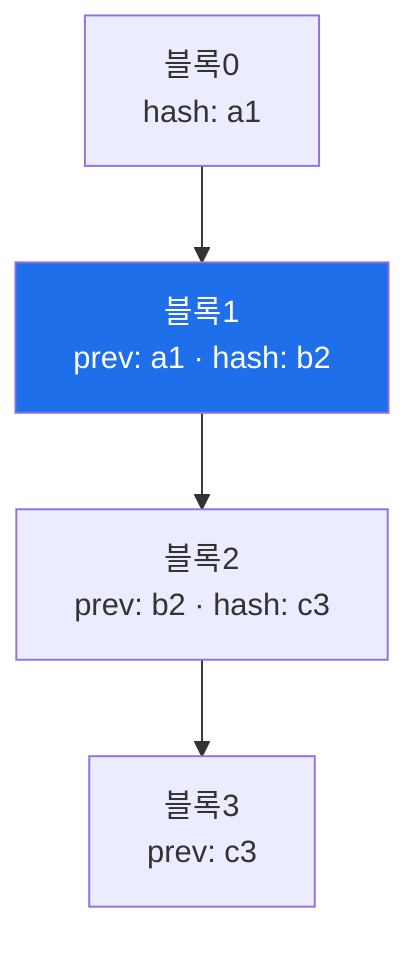

# autonomous-security W06 — PoW 작업증명과 블록체인: 변조 불가 감사 로그

> **본 주차의 한 줄 요약**
>
> 자율 에이전트가 스스로 보안 행동을 하면, **"무엇을 왜 했는지"를 신뢰할 수 있게 기록**하는 것이 중요하다 — 사후
> 감사·책임 추적·규정 준수를 위해. 하지만 로그는 **변조**될 수 있다(공격자가 자기 흔적을 지우거나, 에이전트 오작동을
> 숨기려). 이번 주 W06은 **블록체인(blockchain)** 원리로 **변조 불가(tamper-evident) 감사 로그**를 만든다. 핵심
> 개념은 셋이다: ① **해시 체인(hash chain)** — 각 로그 블록이 이전 블록의 해시를 포함해 사슬처럼 연결된다. 중간
> 블록을 변조하면 그 해시가 바뀌고, 그걸 참조하는 다음 블록들이 전부 깨져 **변조가 즉시 드러난다**. ② **작업증명
> (PoW, Proof of Work)** — 블록을 추가하려면 계산 비용이 드는 퍼즐(특정 조건을 만족하는 nonce 찾기, 예: 해시가
> 0으로 시작)을 풀어야 한다. 변조하려면 그 블록 이후 모든 블록의 PoW를 다시 계산해야 해 엄청나게 비싸다 → 변조
> 억제. ③ **무결성 검증** — 체인을 처음부터 재계산해 일관성을 확인하면 변조 여부를 안다. 실습에서는 해시 체인을
> 구축하고(마커 `CHAIN_BUILT`), PoW를 계산하며(마커 `POW_SOLVED`), 변조를 탐지한다(마커 `TAMPER_DETECTED`). 자율
> 보안에서의 의미는, 에이전트의 모든 행동을 이 변조 불가 로그에 기록하면 사후에 **누가 무엇을 했는지 신뢰**할 수
> 있고 공격자가 흔적을 조작하기 어렵다는 것이다. 완전한 분산 블록체인이 아니어도, **해시 체인 감사 로그**만으로
> 무결성이 크게 오른다.

---

## 학습 목표

본 주차 종료 시 학생은 다음 5가지를 **본인 손으로** 할 수 있어야 한다.

1. 변조 불가 감사 로그의 필요와 "tamper-evident vs tamper-proof"의 차이를 설명한다.
2. **해시 체인**으로 감사 로그를 구축한다(마커 `CHAIN_BUILT`).
3. **작업증명(PoW)** nonce를 계산한다(마커 `POW_SOLVED`).
4. 체인 재검증으로 **변조를 탐지**한다(마커 `TAMPER_DETECTED`).
5. 자율 보안에서 감사 무결성의 의미를 종합한다(마커 `Assessment`).

> **이 주차의 시선** — 자율 에이전트는 강력한 만큼 "행동의 투명성·무결성"이 신뢰의 기반이다. 그 무결성을 암호학
> 원리로 어떻게 보장하는지가 핵심이다.

---

## 0. 용어 해설 (블록체인·무결성)

| 용어 | 영문 | 뜻 | 비유 |
|------|------|----|------|
| **해시** | Hash | 데이터를 고정 길이 지문으로 변환(한 글자만 바뀌어도 완전히 달라짐) | 봉인 지문 |
| **해시 체인** | Hash Chain | 각 블록이 앞 블록 해시를 담아 연결 | 봉인 사슬 |
| **작업증명** | Proof of Work | 블록 추가에 계산 비용이 드는 퍼즐 | 노력 증명 |
| **nonce** | — | PoW 조건을 만족시키는 정답 값 | 자물쇠 조합 |
| **난이도** | Difficulty | 퍼즐의 어려움(앞자리 0 개수 등) | 자물쇠 강도 |
| **변조 불가** | Tamper-evident | 변조하면 즉시 드러남 | 봉인 스티커 |
| **변조 방지** | Tamper-proof | 변조 자체가 불가능 | 강철 금고 |
| **무결성 검증** | Integrity Verification | 체인을 재계산해 일관성 확인 | 봉인 검사 |

> **헷갈리기 쉬운 한 쌍 — tamper-evident vs tamper-proof.** *변조 불가(tamper-evident)*는 변조가 **드러난다**는
> 뜻이고, *변조 방지(tamper-proof)*는 변조가 **불가능**하다는 뜻이다. 해시 체인은 전자다 — 누군가 로그를 고치면
> 사슬이 깨져 즉시 탐지된다(고치는 것 자체를 막지는 못하지만, 숨기지 못하게 한다).

---

## 0.5 신입생 친화 핵심 개념

### 0.5.1 해시 체인

각 블록이 앞 블록의 해시를 담는다. 블록1을 변조하면 hash b2가 바뀌고, 블록2의 prev(b2)가 안 맞아 사슬이 깨진다 →
변조가 그 지점부터 전부 드러난다.

### 0.5.2 작업증명 (PoW)

블록을 추가하려면 **해시가 특정 조건**(예: 앞자리가 "00")을 만족하는 **nonce**를 찾아야 한다. 이건 시행착오로만
풀려 계산 비용이 든다(난이도로 조절). 정직한 추가는 한 번만 계산하면 되지만, 변조하려면 그 블록부터 끝까지 모든
PoW를 다시 풀어야 해 사실상 불가능하다 — 노력이 무결성을 지킨다.

### 0.5.3 변조 탐지

체인을 처음부터 재계산·검증한다: 각 블록의 해시가 조건을 만족하나? 각 블록의 prev가 앞 블록 해시와 맞나? 하나라도
안 맞으면 그 지점이 변조된 것이다. 감사 시 이 검증으로 로그 무결성을 확인한다.

### 0.5.4 자율 보안에서의 의미

에이전트의 모든 행동(조사·차단·격리·공격 시뮬)을 이 변조 불가 로그에 기록하면 다음을 얻는다.

- **책임 추적**: 누가(어느 에이전트) 무엇을 왜 했는지 신뢰할 수 있게.
- **변조 저항**: 공격자가 침입 후 흔적을 지우기 어려움(로그 변조가 드러남).
- **규정·감사**: 무결한 기록으로 규정 준수·사후 분석.

자율 시스템은 강력한 만큼 행동의 투명성·무결성이 신뢰의 기반이다.

### 0.5.5 bastion의 감사 — audit.py (append-only 해시체인)

bastion은 이 원리를 **실제로** 쓴다 — `audit.py`는 **append-only + 해시체인** 감사 로그다(별도 파일 `bastion_audit.db`).
UPDATE/DELETE 금지, 각 row가 직전 row의 해시를 포함해 한 줄만 변조돼도 이후가 전부 깨진다. 기록 단위는 **1 chat =
1 row**: request_id·사용자 지시 전문·최종 답변·approval_mode·lookup 결정·turns(ReAct 전체 trace). 외부 SIEM 포워딩도
가능하다. (PoW는 변조 비용을 높이는 일반 원리로 이번 실습에서 개념·시뮬로 익히되, bastion 감사의 핵심은 **해시체인
tamper-evident**다.) 이번 실습은 **해시 체인 구축·PoW 계산·변조 탐지**를 실제 python 해시(SHA-256 등)로 수행한다.

---

## 1. 무결성 감사 로그 상세 — 체인·PoW·탐지

### 1.1 해시 체인 구축 (CHAIN_BUILT)

- **한 줄 정의**: 각 블록에 앞 블록의 해시를 담아 감사 로그를 사슬로 연결한다.
- **왜 중요한가**: 사슬 구조가 변조를 드러내는 기반이다.
- **el34 맥락에서 어떻게**: 에이전트 행동 블록들을 prev-hash로 연결해 체인을 만들면 `CHAIN_BUILT`.
- **한계/주의**: 해시 함수는 충돌 저항이 있는 것(SHA-256)을 쓴다.

### 1.2 작업증명 계산 (POW_SOLVED)

- **한 줄 정의**: 블록 해시가 난이도 조건(앞자리 0)을 만족하는 nonce를 찾는다.
- **핵심**: 시행착오로 nonce를 증가시키며 조건을 만족할 때까지 해시. 변조 비용을 높인다.
- **판정**: 조건을 만족하는 nonce를 찾으면 `POW_SOLVED`.

### 1.3 변조 탐지 (TAMPER_DETECTED)

- **한 줄 정의**: 체인을 재검증해 변조 지점을 찾는다.
- **핵심**: 임의 블록을 고친 뒤 재검증하면 그 지점부터 prev/hash 불일치가 나타남을 확인.
- **판정**: 변조가 재검증으로 드러나면 `TAMPER_DETECTED`.

---

## 2. 실습 안내 (총 5 미션)

실행 위치는 el34 **호스트**(`ssh ccc@{{TARGET_IP}}`, 비밀번호 `1`), 참고 GPU는 Ollama
(`http://211.170.162.139:10934`, gemma3:4b)다. 각 미션의 마지막 줄 마커가 채점 기준이다.

### 미션 1 — GPU 헬스체크 → `GEN_OK`

> **왜 하는가?** 대상 LLM 도달·응답 확인(반복 절차).
> **무엇을 아는가?** Ollama 응답 형식·도달성.
> **결과 해석** — 정상 `GEN_OK` / 비정상 `GEN_EMPTY`·연결 오류.
> **실전 활용** — 종합(STEP 5) 소견 작성에 사용.

### 미션 2 — 해시 체인 감사 로그 → `CHAIN_BUILT`

> **왜 하는가?** 변조를 드러내는 사슬 구조를 직접 만든다.
> **무엇을 아는가?** prev-hash로 블록을 연결하는 방법.
> **결과 해석** — 정상: 체인 구축 + `CHAIN_BUILT`.
> **실전 활용** — 에이전트 행동 감사 로그 설계.

### 미션 3 — 작업증명 계산 → `POW_SOLVED`

> **왜 하는가?** 변조 비용을 높이는 PoW의 원리를 손으로 계산한다.
> **무엇을 아는가?** 난이도 조건을 만족하는 nonce 탐색.
> **결과 해석** — 정상: nonce 발견 + `POW_SOLVED`.
> **실전 활용** — 변조 억제 강도(난이도) 설계.

### 미션 4 — 변조 탐지 → `TAMPER_DETECTED`

> **왜 하는가?** 변조가 실제로 드러나는지 재검증으로 확인한다.
> **무엇을 아는가?** 블록을 고친 뒤 체인 재검증으로 불일치 탐지.
> **결과 해석** — 정상: 변조 탐지 + `TAMPER_DETECTED`.
> **실전 활용** — 감사 로그 무결성 주기 검증.

### 미션 5 — 종합 소견 → `Assessment`

> **왜 하는가?** 체인·PoW·탐지와 감사 무결성의 의미를 소견으로 묶는다.
> **무엇을 아는가?** GPU에 요약시키되 첫 줄을 `Assessment`로 강제.
> **결과 해석** — 정상: `Assessment` 포함. 없으면 `[형식 미준수 — 재실행]`.
> **실전 활용** — 자율 시스템 감사 정책 개요.

---

## 2.5 과제 (제출물)

- **A. 해시 체인 구축 실증 (필수, 40점)** — `CHAIN_BUILT` 단계를 직접 수행해 실제 명령·출력(또는 아티팩트 분석 결과)을 캡처하고, 무엇을 근거로 판정했는지 서술한다.
- **B. 작업증명 계산 분석 (필수, 30점)** — `POW_SOLVED` 단계를 직접 수행해 실제 명령·출력(또는 아티팩트 분석 결과)을 캡처하고, 무엇을 근거로 판정했는지 서술한다.
- **C. 변조 탐지 방어 설계 (필수, 30점)** — `TAMPER_DETECTED` 단계를 직접 수행해 실제 명령·출력(또는 아티팩트 분석 결과)을 캡처하고, 무엇을 근거로 판정했는지 서술한다.

## 2.6 평가 기준

| 항목 | 미흡(0) | 보통 | 우수 |
|------|---------|------|------|
| 탐지/실증(CHAIN_BUILT) | 미수행 | 마커 도출 | 근거·해석·재현까지 |
| 분석(POW_SOLVED) | 미수행 | 마커 도출 | 근거·해석·재현까지 |
| 방어(TAMPER_DETECTED) | 미수행 | 마커 도출 | 근거·해석·재현까지 |

## 2.7 핵심 정리 (1줄씩)

- 이번 주 주제: **PoW 작업증명과 블록체인: 변조 불가 감사 로그**.
- **해시 체인 구축**(`CHAIN_BUILT`): 각 블록에 앞 블록의 해시를 담아 감사 로그를 사슬로 연결한다.
- **작업증명 계산**(`POW_SOLVED`): 블록 해시가 난이도 조건(앞자리 0)을 만족하는 nonce를 찾는다.
- **변조 탐지**(`TAMPER_DETECTED`): 체인을 재검증해 변조 지점을 찾는다.
- 공격을 이해한 만큼 **방어의 우선순위**가 분명해진다 — 탐지 근거와 완화를 함께 익힌다.

---

## 3. 흔한 오해·블루팀 노트

- **"로그는 그냥 파일이다."** — 파일은 변조된다. 해시 체인으로 변조를 드러낸다.
- **"PoW는 암호화폐에만 쓴다."** — 변조 비용을 높이는 범용 원리다. 감사 로그에도 적용된다.
- **"블록체인은 분산이 핵심이다."** — 분산이 아니어도 해시 체인 감사 로그만으로 무결성이 크게 오른다.
- **"tamper-evident면 변조를 막는다."** — 변조를 막는 게 아니라 **드러낸다.** 숨기지 못하게 하는 것이 목적.
- **관제(Blue) 관점** — 자율 에이전트 행동이 (1) 변조 불가 로그에 기록되는가, (2) 무결성이 주기 검증되는가, (3)
  변조 탐지 시 경보·대응이 있는가를 점검한다. 감사 무결성이 자율 시스템 신뢰의 기반이다.

---

## 4. 다음 주차 (W07) 예고 — 강화학습(RL)과 보상

W06이 "행동의 무결한 기록"이었다면, W07은 **강화학습(RL)과 보상**을 다룬다. 자율 에이전트가 보상 신호로 스스로
정책을 개선하는 학습 메커니즘과, 보상 설계가 잘못되면 생기는 위험(보상 해킹)을 익힌다.
