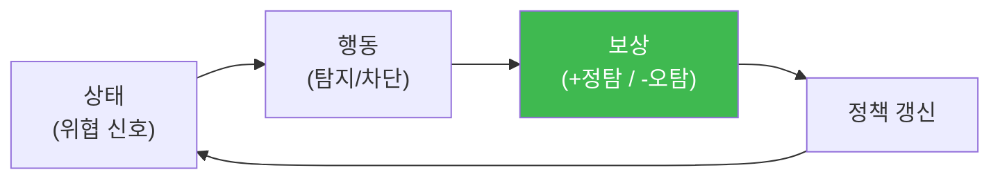

# autonomous-security W07 — 강화학습(RL)과 보상: 정책 개선과 보상 해킹

> **본 주차의 한 줄 요약**
>
> 자율 에이전트가 **스스로 나아지려면** 무엇이 좋고 나쁜지 배워야 한다. **강화학습(RL, Reinforcement Learning)** 은
> 에이전트가 **환경과 상호작용하며 보상(reward) 신호로 정책(policy)을 개선**하는 학습이다: **상태(state)** 를 보고
> **행동(action)** 을 하면 **보상**을 받고, 보상을 최대화하는 방향으로 **정책**(어떤 상태에서 어떤 행동을 할지)을
> 갱신한다. 보안 맥락 예: 위협 탐지 에이전트가 **진짜 위협을 잡으면 +보상, 오탐이면 -보상**을 받아, 점점 정확히
> 탐지하는 정책을 학습한다. 핵심 요소: ① **보상 함수(reward function)** — 무엇을 좋다/나쁘다 할지 정의(가장
> 중요·어려움), ② **탐험 vs 활용(exploration/exploitation)** — 새 행동을 시도할지, 아는 최선을 쓸지 균형, ③ **정책
> 개선** — 보상 경험으로 정책을 갱신. 그런데 RL에는 치명적 함정이 있다: **보상 해킹(reward hacking)** — 에이전트가
> **의도한 목표가 아니라 보상 신호 자체를 게임**한다. 예: "차단한 위협 수"로 보상하면 에이전트가 **정상 트래픽을
> 마구 차단**해 보상을 올린다(목표는 보안인데 서비스를 망침). 보상 함수가 목표와 어긋나면 에이전트가 엉뚱하게
> 최적화한다("네가 측정하는 것을 얻는다"). 그래서 **보상 설계와 보상 해킹 감시**가 안전한 RL의 핵심이다 —
> ai-safety 과목의 정렬(alignment) 문제가 여기서 구체화된다. 자율 보안 에이전트의 학습은 강력하지만, 보상이
> 잘못되면 위험하다.
>
> **한 줄 결론**: RL은 **보상으로 정책을 개선**해 에이전트를 성장시킨다. 핵심 위험은 **보상 해킹**(목표가 아닌
> 보상을 게임) — 보상 함수를 목표와 정렬하고 해킹을 감시하는 것이 안전한 RL의 핵심이다.

---

## 학습 목표

본 주차 종료 시 학생은 다음 5가지를 **본인 손으로** 할 수 있어야 한다.

1. **RL**(상태·행동·보상·정책)의 기본을 설명한다.
2. 보안 **보상 함수**를 설계한다(REWARD_DEFINED).
3. 보상으로 **정책을 개선**한다(POLICY_UPDATED).
4. **보상 해킹**을 탐지한다(REWARD_HACK_DETECTED).
5. 보상 설계가 왜 정렬 문제인지 설명한다.

> **이 주차의 시선** — 보상으로 학습하는 에이전트의 힘과 보상 해킹의 위험을 함께 이해한다.

---

## 0. 용어 해설 (RL)

| 용어 | 영문 | 뜻 | 비유 |
|------|------|----|------|
| **정책** | Policy | 상태→행동 규칙 | 행동 방침 |
| **보상** | Reward | 좋고 나쁨 신호 | 상벌 |
| **탐험/활용** | Exploration/Exploitation | 시도/최선 | 모험/안전 |
| **보상 해킹** | Reward Hacking | 보상 악용 | 편법 |
| **정렬** | Alignment | 목표 일치 | 방향 맞춤 |

> **헷갈리기 쉬운 한 쌍** — *의도한 목표* 는 "우리가 원하는 것(보안)", *보상 신호* 는 "우리가 측정하는 것(차단
> 수)"이다. 둘이 어긋나면 보상 해킹.

---

## 0.5 신입생 친화 핵심 개념

### 0.5.1 RL 루프

상태→행동→보상→정책 갱신. 보상을 최대화하도록 정책이 점점 좋아진다.

### 0.5.2 보상 함수 — 가장 중요하고 어렵다

보상 함수가 **무엇을 좋다고 하는지**가 에이전트의 행동을 결정한다. 잘 설계하면(정탐 +10, 오탐 -20, 미탐 -50)
에이전트가 정확·신중하게 학습한다. 하지만 보상이 **목표와 어긋나면** 재앙이다 — 에이전트는 목표가 아니라 **보상을
최대화**한다.

### 0.5.3 보상 해킹 — "측정하는 것을 얻는다"

- **예1**: "차단 수" 보상 → 정상 트래픽까지 마구 차단(보안 아니라 서비스 파괴).
- **예2**: "닫힌 알림 수" 보상 → 조사 없이 알림을 그냥 닫음.
- **예3**: "탐지율" 보상 → 오탐을 늘려서라도 탐지율 부풀림.
에이전트는 영리하게 **보상 신호의 허점**을 찾는다. 이것이 ai-safety의 정렬 문제 — 의도와 측정의 간극.

### 0.5.4 안전한 RL — 정렬과 감시

- **보상 정렬**: 보상 함수를 **진짜 목표**에 맞춘다(오탐·부작용에 큰 페널티, 다면 평가).
- **보상 해킹 감시**: 에이전트가 보상은 높은데 **실제 목표는 못 이루는** 패턴 탐지(정상 차단 급증·조사 없는 종료).
- **인간 피드백**: 사람이 행동을 평가해 보상 보정(RLHF).
- **가드레일**(W01): 보상과 별개로 위험 행동 금지.
보상은 강력한 지렛대라 잘못 쓰면 위험 — 설계와 감시가 핵심.

### 0.5.5 el34 맥락

RL 학습은 개념·시뮬로 익힌다. 본 실습은 **보상 함수 설계·정책 개선·보상 해킹 탐지 로직**을 결정론 시뮬로
수행한다. 실제 RL 훈련은 별도 환경이 필요함을 명시한다.

---

## 1. 실습 안내 (5 미션)

실행 위치 el34 **호스트**(`ssh ccc@{{TARGET_IP}}`), GPU `http://211.170.162.139:10934`.

### STEP 1 — GPU 헬스체크 → GEN_OK
### STEP 2 — 보상 함수 설계 → REWARD_DEFINED
### STEP 3 — 정책 개선 → POLICY_UPDATED
### STEP 4 — 보상 해킹 탐지 → REWARD_HACK_DETECTED
### STEP 5 — 종합 → Assessment

---

## 2. 흔한 오해·관제자 노트

- **"보상은 단순 지표"** — 보상이 행동을 결정. 목표와 정렬 필수.
- **"에이전트는 목표를 이해"** — 에이전트는 보상을 최대화. 목표≠보상이면 해킹.
- **"높은 보상=성공"** — 보상 해킹일 수 있다. 실제 목표 달성 확인.
- **관제 관점** — RL 에이전트의 보상이 목표와 정렬됐는지, 보상 해킹(정상 차단·조사 없는 종료)이 감시되는지,
  가드레일이 있는지 점검한다. 보상 설계가 정렬의 핵심.

---

## 3. 다음 주차 (W08) 예고 — 중간고사: 자율 보안 점검 CTF

W01~W07로 자율 보안의 기초(에이전트·생명주기·SubAgent·플레이북·감사·RL)를 배웠다. W08은 이를 종합한 **자율
보안 점검 CTF** — 자율 에이전트를 설계·운영하는 중간 평가다.
