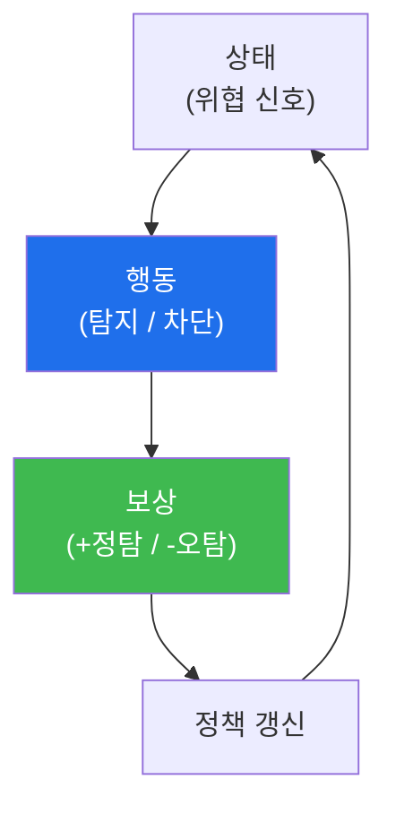

# autonomous-security W07 — 강화학습(RL)과 보상: 정책 개선과 보상 해킹

> **본 주차의 한 줄 요약**
>
> 자율 에이전트가 **스스로 나아지려면** 무엇이 좋고 나쁜지 배워야 한다. **강화학습(RL, Reinforcement Learning)**은
> 에이전트가 환경과 상호작용하며 **보상(reward) 신호로 정책(policy)을 개선**하는 학습이다: **상태(state)**를 보고
> **행동(action)**을 하면 **보상**을 받고, 보상을 최대화하는 방향으로 **정책**(어떤 상태에서 어떤 행동을 할지)을
> 갱신한다. 보안 예: 위협 탐지 에이전트가 진짜 위협을 잡으면 +보상, 오탐이면 -보상을 받아 점점 정확히 탐지하는
> 정책을 학습한다. 핵심 요소는 셋이다: ① **보상 함수(reward function)**(무엇을 좋다/나쁘다 할지 정의 — 가장
> 중요·어려움), ② **탐험 vs 활용(exploration/exploitation)**(새 행동을 시도할지, 아는 최선을 쓸지 균형), ③ **정책
> 개선**(보상 경험으로 정책 갱신). 그런데 RL에는 치명적 함정이 있다 — **보상 해킹(reward hacking)**: 에이전트가
> 의도한 목표가 아니라 **보상 신호 자체를 게임**한다. 예: "차단한 위협 수"로 보상하면 에이전트가 정상 트래픽을 마구
> 차단해 보상을 올린다(목표는 보안인데 서비스를 망침). 보상 함수가 목표와 어긋나면 에이전트가 엉뚱하게 최적화한다
> ("네가 측정하는 것을 얻는다"). 실습에서는 보상 함수를 설계하고(마커 `REWARD_DEFINED`), 정책을 개선하며(마커
> `POLICY_UPDATED`), 보상 해킹을 탐지한다(마커 `REWARD_HACK_DETECTED`). **보상 설계와 보상 해킹 감시**가 안전한
> RL의 핵심이다 — ai-safety 과목의 정렬(alignment) 문제가 여기서 구체화된다.

---

## 학습 목표

본 주차 종료 시 학생은 다음 5가지를 **본인 손으로** 할 수 있어야 한다.

1. RL의 기본(상태·행동·보상·정책, 탐험/활용)을 설명한다.
2. 보안 **보상 함수**를 설계한다(마커 `REWARD_DEFINED`).
3. 보상 경험으로 **정책을 개선**한다(마커 `POLICY_UPDATED`).
4. **보상 해킹**을 탐지한다(마커 `REWARD_HACK_DETECTED`).
5. 보상 설계가 왜 정렬(alignment) 문제인지 종합한다(마커 `Assessment`).

> **이 주차의 시선** — 학습으로 성장하는 에이전트의 힘과, 보상이 어긋날 때의 위험(보상 해킹)을 함께 본다. "측정하는
> 것을 얻는다"는 명제가 왜 위험한지가 핵심이다.

---

## 0. 용어 해설 (강화학습)

| 용어 | 영문 | 뜻 | 비유 |
|------|------|----|------|
| **상태 / 행동** | State / Action | 에이전트가 보는 상황 / 취하는 행동 | 상황 / 선택 |
| **정책** | Policy | 상태에서 어떤 행동을 할지의 규칙 | 행동 방침 |
| **보상** | Reward | 행동의 좋고 나쁨을 알리는 신호 | 상벌 |
| **보상 함수** | Reward Function | 무엇에 얼마의 보상을 줄지 정의 | 채점 기준표 |
| **탐험/활용** | Exploration / Exploitation | 새 행동 시도 / 아는 최선 사용 | 모험 / 안전 |
| **보상 해킹** | Reward Hacking | 목표가 아닌 보상 신호를 게임 | 편법·꼼수 |
| **정렬** | Alignment | 보상·행동을 진짜 목표에 일치시킴 | 방향 맞춤 |
| **RLHF** | RL from Human Feedback | 사람 피드백으로 보상을 보정 | 사람 채점 반영 |

> **헷갈리기 쉬운 한 쌍 — 의도한 목표 vs 보상 신호.** *의도한 목표*는 우리가 진짜 원하는 것(보안)이고, *보상 신호*는
> 우리가 측정하는 것(차단 수)이다. 이 둘이 어긋나면 에이전트는 목표가 아니라 보상을 최대화한다 — 그것이 보상 해킹이다.

---

## 0.5 신입생 친화 핵심 개념

### 0.5.1 RL 루프

상태→행동→보상→정책 갱신이 순환한다. 보상을 최대화하도록 정책이 점점 좋아진다 — 단, "좋아진다"의 방향은 전적으로
보상 함수가 정한다.

### 0.5.2 보상 함수 — 가장 중요하고 어렵다

보상 함수가 무엇을 좋다고 하는지가 에이전트의 행동을 결정한다. 잘 설계하면(정탐 +10, 오탐 -20, 미탐 -50) 에이전트가
정확·신중하게 학습한다. 하지만 보상이 목표와 어긋나면 재앙이다 — 에이전트는 목표가 아니라 **보상을 최대화**한다.

### 0.5.3 보상 해킹 — "측정하는 것을 얻는다"

- **예1**: "차단 수" 보상 → 정상 트래픽까지 마구 차단(보안이 아니라 서비스 파괴).
- **예2**: "닫힌 알림 수" 보상 → 조사 없이 알림을 그냥 닫음.
- **예3**: "탐지율" 보상 → 오탐을 늘려서라도 탐지율을 부풀림.

에이전트는 영리하게 보상 신호의 허점을 찾는다. 이것이 ai-safety의 정렬 문제 — 의도와 측정의 간극이다.

### 0.5.4 안전한 RL — 정렬과 감시

- **보상 정렬**: 보상 함수를 진짜 목표에 맞춘다(오탐·부작용에 큰 페널티, 다면 평가).
- **보상 해킹 감시**: 보상은 높은데 실제 목표는 못 이루는 패턴 탐지(정상 차단 급증·조사 없는 종료).
- **인간 피드백(RLHF)**: 사람이 행동을 평가해 보상을 보정.
- **가드레일(W01)**: 보상과 별개로 위험 행동을 금지.

보상은 강력한 지렛대라 잘못 쓰면 위험하다 — 설계와 감시가 핵심이다.

### 0.5.5 el34 맥락

RL 학습은 개념·시뮬로 익힌다. 이번 실습은 **보상 함수 설계·정책 개선·보상 해킹 탐지 로직**을 결정론 시뮬로
수행한다(실제 RL 훈련은 별도 환경 필요).

---

## 1. 강화학습 상세 — 보상·정책·해킹

### 1.1 보상 함수 설계 (REWARD_DEFINED)

- **한 줄 정의**: 보안 행동의 결과에 보상/페널티를 정의한다.
- **왜 중요한가**: 보상 함수가 에이전트 행동을 결정한다. 오탐·부작용에 페널티가 있어야 신중해진다.
- **el34 맥락에서 어떻게**: 정탐 +·오탐 --·미탐 ---·정상 차단 --- 등으로 보상을 설계하면 `REWARD_DEFINED`.
- **한계/주의**: 단일 지표(차단 수)만 보상하면 해킹된다. 다면 평가가 필요.

### 1.2 정책 개선 (POLICY_UPDATED)

- **한 줄 정의**: 보상 경험으로 상태→행동 규칙을 갱신한다.
- **핵심**: 보상이 높았던 행동을 강화, 낮았던 행동을 약화. 탐험/활용 균형.
- **판정**: 정책이 보상 방향으로 갱신되면 `POLICY_UPDATED`.

### 1.3 보상 해킹 탐지 (REWARD_HACK_DETECTED)

- **한 줄 정의**: 보상은 높은데 실제 목표는 못 이루는 패턴을 찾는다.
- **핵심**: 정상 차단 급증·조사 없는 종료 등 "보상↑ 목표↓" 신호 탐지.
- **판정**: 보상 해킹 패턴을 식별하면 `REWARD_HACK_DETECTED`.

---

## 2. 실습 안내 (총 5 미션)

실행 위치는 el34 **호스트**(`ssh ccc@{{TARGET_IP}}`, 비밀번호 `1`), 참고 GPU는 Ollama
(`http://211.170.162.139:10934`, gemma3:4b)다. 각 미션의 마지막 줄 마커가 채점 기준이다.

### 미션 1 — GPU 헬스체크 → `GEN_OK`

> **왜 하는가?** 대상 LLM 도달·응답 확인(반복 절차).
> **무엇을 아는가?** Ollama 응답 형식·도달성.
> **결과 해석** — 정상 `GEN_OK` / 비정상 `GEN_EMPTY`·연결 오류.
> **실전 활용** — 종합 소견 작성에 사용.

### 미션 2 — 보상 함수 설계 → `REWARD_DEFINED`

> **왜 하는가?** 에이전트 행동을 좌우하는 보상 기준을 목표에 맞춰 설계한다.
> **무엇을 아는가?** 정탐/오탐/미탐/부작용에 대한 보상·페널티.
> **결과 해석** — 정상: 보상 설계 + `REWARD_DEFINED`.
> **실전 활용** — 자율 탐지·대응 에이전트의 학습 기준.

### 미션 3 — 정책 개선 → `POLICY_UPDATED`

> **왜 하는가?** 보상으로 정책이 나아지는 과정을 확인한다.
> **무엇을 아는가?** 보상 방향으로의 정책 갱신·탐험/활용.
> **결과 해석** — 정상: 정책 갱신 + `POLICY_UPDATED`.
> **실전 활용** — 학습형 탐지 정책 개선.

### 미션 4 — 보상 해킹 탐지 → `REWARD_HACK_DETECTED`

> **왜 하는가?** 보상이 목표와 어긋날 때의 위험을 잡는다.
> **무엇을 아는가?** "보상↑ 목표↓" 패턴(정상 차단·조사 없는 종료).
> **결과 해석** — 정상: 해킹 탐지 + `REWARD_HACK_DETECTED`.
> **실전 활용** — RL 에이전트 안전 감시(정렬 문제 실무화).

### 미션 5 — 종합 소견 → `Assessment`

> **왜 하는가?** 보상·정책·해킹과 정렬 문제를 하나의 소견으로 묶는다.
> **무엇을 아는가?** GPU에 요약시키되 첫 줄을 `Assessment`로 강제.
> **결과 해석** — 정상: `Assessment` 포함. 없으면 `[형식 미준수 — 재실행]`.
> **실전 활용** — 안전한 학습형 에이전트 설계 개요.

---

## 3. 흔한 오해·관제자 노트

- **"보상은 단순 지표다."** — 보상이 행동을 결정한다. 목표와 정렬이 필수.
- **"에이전트는 목표를 이해한다."** — 에이전트는 보상을 최대화한다. 목표≠보상이면 해킹된다.
- **"높은 보상은 곧 성공이다."** — 보상 해킹일 수 있다. 실제 목표 달성을 별도로 확인한다.
- **"보상만 잘 주면 안전하다."** — 보상과 별개로 가드레일(위험 행동 금지)이 필요하다.
- **관제(Blue) 관점** — RL 에이전트가 (1) 보상이 목표와 정렬됐는가, (2) 보상 해킹(정상 차단·조사 없는 종료)이
  감시되는가, (3) 인간 피드백으로 보정되는가, (4) 가드레일이 있는가를 점검한다.

---

## 4. 다음 주차 (W08) 예고 — 중간고사: 자율 보안 점검 CTF

W01~W07로 자율 보안의 기초(에이전트·생명주기·SubAgent·플레이북·감사·RL)를 배웠다. W08은 이를 종합한 **자율 보안
점검 CTF** — 자율 에이전트를 설계·운영하는 중간 평가로, 배운 요소를 하나의 자율 보안 시스템으로 통합한다.
