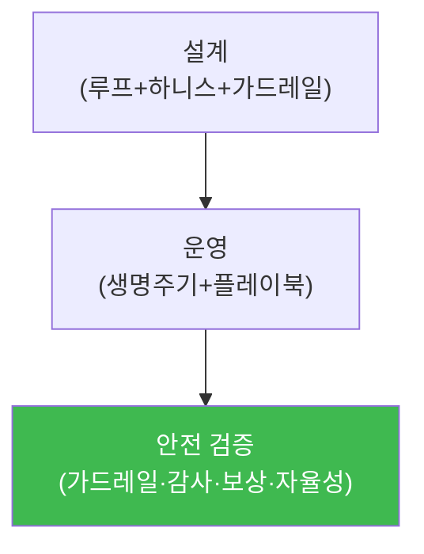

# autonomous-security W08 — 중간고사: 자율 보안 점검 CTF

> **본 주차의 한 줄 요약**
>
> W01~W07로 자율 보안의 기초를 배웠다 — 자율 루프·가드레일(W01), LLM 에이전트(W02), 생명주기(W03), SubAgent·A2A
> (W04), 플레이북(W05), 감사 무결성(W06), RL·보상(W07). W08은 이를 **하나의 자율 보안 에이전트를 설계·운영·검증**
> 하는 종합 평가(CTF 형식)로 통합한다. 실제 자율 보안 시스템을 만든다는 것은 부분 기술의 합이 아니라 **일관된
> 하나의 에이전트**로 통합하는 능력이다: ① **설계** — 인지→판단→행동→학습 루프에, Manager의 하니스 엔지니어링·
> E.G, SubAgent 실행, 적절한 가드레일·자율성 수준을 결합, ② **운영** — 생명주기(접수→계획→실행→평가→학습)를 따라
> 플레이북으로 임무를 수행하고 SubAgent 결과를 검증, ③ **검증(가장 중요)** — 이 자율 에이전트가 **안전한가**를
> 점검한다: 가드레일이 위험 행동을 막나? 행동이 변조 불가 로그에 기록되나(W06)? 보상이 목표와 정렬돼 보상 해킹이
> 없나(W07)? 자율성 수준이 위험도에 맞나(W01)? 이 CTF의 핵심 교훈은 **자율 시스템은 능력만이 아니라 안전이
> 함께 검증돼야** 한다는 것 — 강력한 자율 에이전트가 잘못된 가드레일·보상·검증으로 폭주하면 방어가 아니라 피해가
> 된다. 자율 보안의 절반은 만드는 것, 절반은 **안전하게 만드는 것**이다.
>
> **한 줄 결론**: 자율 보안 CTF = **에이전트 설계(루프·하니스·가드레일) + 운영(생명주기·플레이북·검증) + 안전
> 검증(가드레일·감사·보상 정렬·자율성 수준)**. 능력과 안전을 함께 통합한다.

---

## 학습 목표

본 주차 종료 시 학생은 다음 5가지를 **본인 손으로** 할 수 있어야 한다.

1. 자율 보안 에이전트를 **설계**한다(AGENT_DESIGNED).
2. 임무를 생명주기·플레이북으로 **수행**한다(MISSION_COMPLETED).
3. 에이전트의 **안전을 검증**한다(SAFETY_VERIFIED).
4. 능력과 안전의 통합을 설명한다.
5. W01~W07 기술을 하나로 종합한다.

> **이 주차의 시선** — 배운 기초를 하나의 안전한 자율 에이전트로 통합한다.

---

## 0. 용어 해설 (종합)

| 용어 | 관련 주차 | 종합에서 |
|------|-----------|----------|
| **자율 루프·가드레일** | W01 | 설계·안전 |
| **하니스·E.G** | W03 | 계획 |
| **SubAgent·검증** | W04 | 실행·검증 |
| **플레이북** | W05 | 절차 |
| **감사·보상** | W06·W07 | 무결성·정렬 |

---

## 0.5 종합 — 설계·운영·검증

### 0.5.1 자율 에이전트 통합

설계→운영→안전 검증. 능력(설계·운영)과 안전(검증)을 하나로.

### 0.5.2 안전 검증 체크리스트

- **가드레일**(W01): 위험 행동 차단·범위 제한·비가역 승인?
- **자율성 수준**(W01): 위험도에 맞는 human in/on/out?
- **감사 무결성**(W06): 행동이 변조 불가 로그에?
- **보상 정렬**(W07): 보상이 목표와 정렬·보상 해킹 없음?
- **결과 검증**(W04): SubAgent 결과를 검증?
이 다섯이 자율 에이전트 안전의 기둥.

### 0.5.3 능력과 안전의 균형

강력한 자율 에이전트라도 안전 검증을 통과 못 하면 **배포 불가**다. 능력만 좇으면 폭주 위험, 안전만 좇으면
쓸모없다. CTF의 목표는 **둘 다** — 임무를 잘 수행하면서 안전 검증을 통과하는 에이전트.

---

## 1. 중간고사 안내 (5 미션)

실행 위치 el34 **호스트**(`ssh ccc@{{TARGET_IP}}`), GPU `http://211.170.162.139:10934`.

### STEP 1 — GPU 헬스체크 → GEN_OK
### STEP 2 — 자율 에이전트 설계 → AGENT_DESIGNED
### STEP 3 — 임무 수행 → MISSION_COMPLETED
### STEP 4 — 안전 검증 → SAFETY_VERIFIED
### STEP 5 — 종합 → Assessment

---

## 2. 흔한 오해·관제자 노트

- **"능력만 있으면 됨"** — 안전 검증 통과해야 배포. 능력+안전.
- **"부분 기술의 합"** — 일관된 하나의 에이전트로 통합.
- **"안전은 나중"** — 설계부터 가드레일·감사·정렬.
- **관제 관점** — 자율 에이전트가 능력(설계·운영)과 안전(가드레일·감사·보상·자율성·검증)을 모두 갖췄는지 종합
  평가한다. 능력과 안전의 균형이 핵심.

---

## 3. 다음 주차 (W09) 예고 — Experience와 4-Layer Memory

중간고사 후, W09는 **Experience와 4-Layer Memory** — 자율 에이전트가 경험을 계층적 메모리로 저장·활용해 학습하는
구조를 심화한다.
