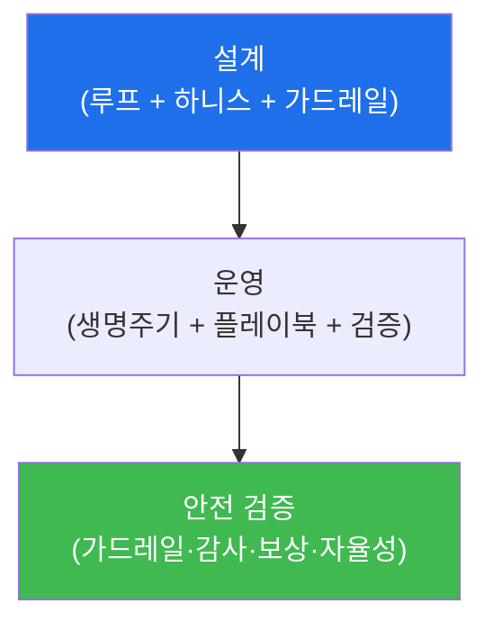

# autonomous-security W08 — 중간고사: 자율 보안 점검 CTF

> **본 주차의 한 줄 요약**
>
> W01~W07로 자율 보안의 기초를 배웠다 — 자율 루프·가드레일(W01), LLM 에이전트(W02), 생명주기(W03), SubAgent·A2A
> (W04), 플레이북(W05), 감사 무결성(W06), RL·보상(W07). 이번 주 W08은 이를 **하나의 자율 보안 에이전트를 설계·운영·
> 검증**하는 종합 평가(CTF 형식)로 통합한다. 실제 자율 보안 시스템을 만든다는 것은 부분 기술의 합이 아니라 **일관된
> 하나의 에이전트**로 통합하는 능력이다: ① **설계** — 인지→판단→행동→학습 루프에 Manager의 하니스 엔지니어링·KG·Experience,
> SubAgent 실행, 적절한 가드레일·자율성 수준을 결합, ② **운영** — 생명주기(접수→계획→실행→평가→학습)를 따라
> 플레이북으로 임무를 수행하고 SubAgent 결과를 검증, ③ **검증(가장 중요)** — 이 자율 에이전트가 **안전한가**를
> 점검한다: 가드레일이 위험 행동을 막나? 행동이 변조 불가 로그에 기록되나(W06)? 보상이 목표와 정렬돼 보상 해킹이
> 없나(W07)? 자율성 수준이 위험도에 맞나(W01)? 실습에서는 에이전트를 설계하고(마커 `AGENT_DESIGNED`), 임무를
> 수행하며(마커 `MISSION_COMPLETED`), 안전을 검증한다(마커 `SAFETY_VERIFIED`). 이 CTF의 핵심 교훈은 **자율 시스템은
> 능력만이 아니라 안전이 함께 검증돼야** 한다는 것 — 강력한 자율 에이전트가 잘못된 가드레일·보상·검증으로 폭주하면
> 방어가 아니라 피해가 된다. 자율 보안의 절반은 만드는 것, 절반은 **안전하게 만드는 것**이다.

---

## 학습 목표

본 주차 종료 시 학생은 다음 5가지를 **본인 손으로** 할 수 있어야 한다.

1. W01~W07을 결합해 자율 보안 에이전트를 **설계**한다(마커 `AGENT_DESIGNED`).
2. 임무를 생명주기·플레이북으로 **수행**한다(마커 `MISSION_COMPLETED`).
3. 에이전트의 **안전을 검증**한다(마커 `SAFETY_VERIFIED`).
4. 능력과 안전의 통합(둘 다 갖춰야 배포 가능)을 설명한다.
5. 배운 기초를 하나의 소견으로 종합한다(마커 `Assessment`).

> **이 주차의 시선** — 낱개 기술을 "하나의 안전한 에이전트"로 조립한다. 승부처는 능력(임무 수행)과 안전(검증
> 통과)을 **함께** 만족시키는 것이다.

---

## 0. 용어 해설 (종합 평가)

| 용어 | 영문 | 뜻 | 비유 |
|------|------|----|------|
| **에이전트 설계** | Agent Design | 루프·하니스·가드레일을 결합한 통합 설계 | 시스템 청사진 |
| **자율성 수준** | Level of Autonomy | 위험도별 human in/on/out(W01) | 재량 위임 수준 |
| **안전 검증** | Safety Verification | 가드레일·감사·보상 정렬 등 점검 | 안전 검사 |
| **감사 무결성** | Audit Integrity | 행동이 변조 불가 로그에 기록(W06) | 봉인된 기록 |
| **보상 정렬** | Reward Alignment | 보상이 목표와 일치(W07) | 방향 맞춤 |
| **결과 검증** | Result Validation | SubAgent 결과 확인(W04) | 검수 |
| **배포 가능성** | Deployability | 능력+안전을 모두 통과해야 배포 | 출고 승인 |

> **헷갈리기 쉬운 한 쌍 — 능력 vs 안전.** *능력*은 임무를 잘 수행하는 것, *안전*은 폭주하지 않는 것이다. 능력만
> 좇으면 폭주 위험, 안전만 좇으면 쓸모없다. 자율 에이전트는 **둘 다** 검증돼야 배포할 수 있다.

---

## 0.5 종합 — 설계·운영·검증

### 0.5.1 자율 에이전트 통합

설계→운영→안전 검증. 능력(설계·운영)과 안전(검증)을 하나로 통합한다.

### 0.5.2 안전 검증 체크리스트

- **가드레일(W01)**: 위험 행동 차단·범위 제한·비가역 승인이 있나?
- **자율성 수준(W01)**: 위험도에 맞는 human in/on/out인가?
- **감사 무결성(W06)**: 행동이 변조 불가 로그에 기록되나?
- **보상 정렬(W07)**: 보상이 목표와 정렬돼 보상 해킹이 없나?
- **결과 검증(W04)**: SubAgent 결과를 검증하나?

이 다섯이 자율 에이전트 안전의 기둥이다.

### 0.5.3 능력과 안전의 균형

강력한 자율 에이전트라도 안전 검증을 통과하지 못하면 **배포 불가**다. 능력만 좇으면 폭주 위험, 안전만 좇으면
쓸모없다. CTF의 목표는 둘 다 — 임무를 잘 수행하면서 안전 검증을 통과하는 에이전트다.

---

## 1. 통합 평가 상세 — 설계·수행·검증

### 1.1 자율 에이전트 설계 (AGENT_DESIGNED)

- **한 줄 정의**: 루프·하니스·SubAgent·가드레일·자율성 수준을 하나의 에이전트로 결합한다.
- **왜 중요한가**: 부분의 합이 아니라 일관된 시스템이어야 실제로 동작한다.
- **el34 맥락에서 어떻게**: 인지(로그)→판단(LLM+KG/Experience)→행동(플레이북/SubAgent)→학습(경험)에 가드레일을 얹으면
  `AGENT_DESIGNED`.
- **한계/주의**: 가드레일·자율성 수준을 설계 단계부터 넣어야 한다(나중이 아니라).

### 1.2 임무 수행 (MISSION_COMPLETED)

- **한 줄 정의**: 생명주기·플레이북으로 실제 임무를 수행하고 결과를 검증한다.
- **핵심**: 접수→계획→실행(SubAgent)→평가→학습, 플레이북 분기, 결과 검증.
- **판정**: 임무가 완결되고 결과가 검증되면 `MISSION_COMPLETED`.

### 1.3 안전 검증 (SAFETY_VERIFIED)

- **한 줄 정의**: 5대 기둥(가드레일·자율성·감사·보상·결과 검증)을 점검한다.
- **핵심**: 각 항목을 체크리스트로 확인. 하나라도 미흡하면 배포 불가.
- **판정**: 안전 체크리스트를 통과하면 `SAFETY_VERIFIED`.

---

## 2. 중간고사 안내 (총 5 미션)

실행 위치는 el34 **호스트**(`ssh ccc@{{TARGET_IP}}`, 비밀번호 `1`), 참고 GPU는 Ollama
(`http://211.170.162.139:10934`, gemma3:4b)다. 각 미션의 마지막 줄 마커가 채점 기준이다.

### 미션 1 — GPU 헬스체크 → `GEN_OK`

> **왜 하는가?** 에이전트 추론 엔진(LLM) 도달·응답 확인.
> **무엇을 아는가?** Ollama 응답 형식·도달성.
> **결과 해석** — 정상 `GEN_OK` / 비정상 `GEN_EMPTY`·연결 오류.
> **실전 활용** — 종합 소견 작성에 사용.

### 미션 2 — 자율 에이전트 설계 → `AGENT_DESIGNED`

> **왜 하는가?** 배운 요소를 하나의 일관된 에이전트로 결합한다.
> **무엇을 아는가?** 루프·하니스·SubAgent·가드레일·자율성 수준의 통합.
> **결과 해석** — 정상: 설계 완성 + `AGENT_DESIGNED`.
> **실전 활용** — 자율 보안 시스템 아키텍처.

### 미션 3 — 임무 수행 → `MISSION_COMPLETED`

> **왜 하는가?** 설계한 에이전트로 실제 임무를 수행한다.
> **무엇을 아는가?** 생명주기·플레이북·결과 검증의 실행.
> **결과 해석** — 정상: 임무 완결 + `MISSION_COMPLETED`.
> **실전 활용** — 자율 대응 운영.

### 미션 4 — 안전 검증 → `SAFETY_VERIFIED`

> **왜 하는가?** 능력만이 아니라 안전을 검증해야 배포 가능함을 확인한다.
> **무엇을 아는가?** 5대 안전 기둥 체크리스트.
> **결과 해석** — 정상: 안전 통과 + `SAFETY_VERIFIED`.
> **실전 활용** — 자율 에이전트 배포 심사.

### 미션 5 — 종합 소견 → `Assessment`

> **왜 하는가?** 설계·운영·검증과 "능력+안전" 원칙을 소견으로 묶는다.
> **무엇을 아는가?** GPU에 요약시키되 첫 줄을 `Assessment`로 강제.
> **결과 해석** — 정상: `Assessment` 포함. 없으면 `[형식 미준수 — 재실행]`.
> **실전 활용** — 자율 보안 시스템 설계·심사 개요.

---

## 3. 흔한 오해·관제자 노트

- **"능력만 있으면 된다."** — 안전 검증을 통과해야 배포한다. 능력+안전.
- **"부분 기술을 다 배우면 끝이다."** — 일관된 하나의 에이전트로 통합해야 동작한다.
- **"안전은 나중에 붙인다."** — 설계 단계부터 가드레일·감사·정렬을 넣는다.
- **"검증은 형식이다."** — 검증이 폭주를 막는다. 자율의 절반은 안전하게 만드는 것.
- **관제(Blue) 관점** — 자율 에이전트가 능력(설계·운영)과 안전(가드레일·감사·보상·자율성·결과 검증)을 모두 갖췄는지
  종합 평가한다. 능력과 안전의 균형이 핵심이다.

---

## 4. 다음 주차 (W09) 예고 — Experience와 4-Layer Memory

중간고사 후 W09는 **Experience와 4-Layer Memory**를 다룬다. 자율 에이전트가 경험을 계층적 메모리로 저장·활용해
학습하는 구조를 심화하고, Experience·KG(W03)가 어떻게 조직되는지 익힌다.
