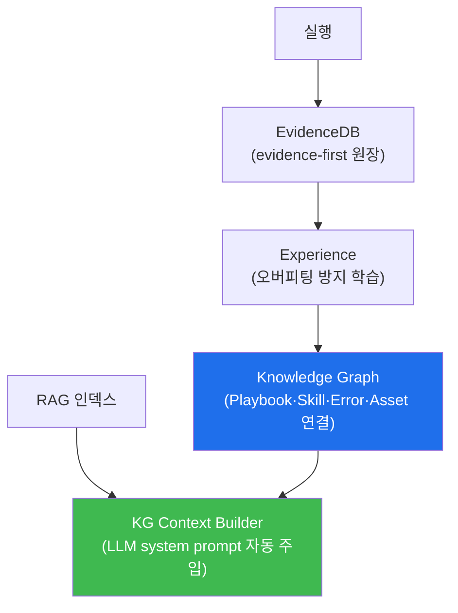

# autonomous-security W09 — Bastion 지식·경험 아키텍처: KG·Experience·EvidenceDB

> **본 주차의 한 줄 요약**
>
> 자율 에이전트가 **성장**하려면 경험을 잘 저장·검색·학습하는 지식 구조가 필요하다. bastion은 이를 여러 계층으로
> 나눈다(사람의 단일 "기억"이 아니라 서로 다른 저장소의 조합이다): ① **EvidenceDB(evidence-first)** — 모든 실행을
> SQLite에 기록(skill·params·output·success·analysis·stage). "무엇을 실제로 했나"의 원장. ② **Knowledge Graph
> (graph.py)** — Playbook·Experience·Skill·Error·Recovery·Asset·Concept를 **연결한 지식망**. 정적 lookup이 아니라
> **그래프 traversal**로 관련 지식을 찾는다. 원칙 "동일 작업=동일 방법: **Playbook이 법, Experience는 보조 노트**".
> ③ **Experience(experience.py)** — 실행에서 배운 패턴을 **오버피팅 방지**로 학습(카테고리 일반화·3회+ 성공 승격·
> 70%+ 성공률·부정 경험·LRU 100·시간 감쇠). 정확한 암기가 아니라 카테고리 수준 일반화. ④ **RAG·history** — RAG
> 지식 인덱스 검색 + 최근 12턴 유지(초과 시 오래된 6턴 LLM 요약 압축). ⑤ **KG Context Builder(kg_context.py)** —
> 위 지식을 **모든 LLM 호출의 system prompt에 자동 주입**(tier-aware: Concept/Policy/Playbook/Asset, 모델별 token
> budget). 학습의 흐름은 실행→EvidenceDB 기록→Experience 학습(과적합 없이)→KG 반영→다음 계획에서 KG-context로
> 검색·주입이다. 실습에서는 이 지식 계층을 매핑하고(마커 `MEMORY_MAPPED`), 경험을 저장하며(마커 `EXPERIENCE_STORED`),
> 검색한 지식으로 판단을 개선한다(마커 `MEMORY_APPLIED`). 핵심은 **evidence-first 기록 + 오버피팅 방지 학습 + 그래프
> 검색 주입**이다.

---

## 학습 목표

본 주차 종료 시 학생은 다음 5가지를 **본인 손으로** 할 수 있어야 한다.

1. bastion 지식 계층(EvidenceDB·KG·Experience·RAG·history·KG-context)을 설명한다.
2. 실행 경험을 알맞은 저장소에 **매핑**한다(마커 `MEMORY_MAPPED`).
3. 경험을 **오버피팅 방지로 저장**한다(마커 `EXPERIENCE_STORED`).
4. 검색한 지식(KG-context)으로 **판단을 개선**한다(마커 `MEMORY_APPLIED`).
5. evidence-first·과적합 방지가 왜 학습의 핵심인지 종합한다(마커 `Assessment`).

> **이 주차의 시선** — W03의 "학습"을 실제로 가능하게 하는 bastion의 지식·경험 구조를 본다. 단일 "기억"이 아니라
> **원장(EvidenceDB)·지식망(KG)·요령(Experience)·인덱스(RAG)**의 조합임이 핵심이다.

---

## 0. 용어 해설 (지식·경험)

| 용어 | 영문 | 뜻 | 비유 |
|------|------|----|------|
| **EvidenceDB** | Evidence DB | 모든 실행을 기록하는 SQLite 원장(evidence-first) | 작업 일지 |
| **Knowledge Graph** | KG | Playbook·Skill·Error·Asset 등을 연결한 지식망 | 지식 지도 |
| **그래프 traversal** | Graph Traversal | 정적 lookup 대신 연결을 따라 관련 지식 탐색 | 연결 따라가기 |
| **Experience** | Experience | 오버피팅 방지 경험 학습 | 몸에 밴 요령 |
| **카테고리 일반화** | Generalization | 유사 작업을 한 카테고리로 묶어 학습 | 큰 틀로 익힘 |
| **RAG** | Retrieval-Augmented Generation | 지식 인덱스 검색 후 프롬프트에 붙임 | 참고서 검색 |
| **history 압축** | Compaction | 최근 12턴 유지·오래된 6턴 요약 | 회의록 요약 |
| **KG Context** | KG Context Builder | 검색 지식을 LLM system prompt에 자동 주입 | 브리핑 자료 |

> **헷갈리기 쉬운 한 쌍 — Playbook vs Experience(KG 안에서).** *Playbook*은 재현 가능한 정식 절차(법, 우선 적용),
> *Experience*는 실행에서 얻은 보조 노트(주의·패턴)다. bastion은 정확한 암기(오버피팅) 대신 **카테고리 일반화**로
> 경험을 축적해, 비슷한 상황에 일반화된 요령을 적용한다.

---

## 0.5 핵심 개념

### 0.5.1 bastion 지식 계층

실행→EvidenceDB 기록→Experience 학습→KG 반영. 다음 계획에서 KG·RAG를 KG-Context로 검색해 LLM에 주입한다. 단일
기억이 아니라 여러 저장소의 협업이다.

### 0.5.2 EvidenceDB — evidence-first

모든 실행(성공·실패)을 SQLite에 기록한다: skill·params·output·success·analysis·stage·exit_code·course·lab_id.
"에이전트가 무엇을 실제로 했나"의 원장이며, 사후 추적·분석·학습의 원천이다. bastion은 말보다 **증거를 먼저** 남긴다.

### 0.5.3 Knowledge Graph — 연결로 찾는다

KG는 Playbook·Experience·Skill·Error·Recovery·Asset·Concept를 노드로 연결한다. 정적 lookup 대신 **그래프
traversal**로 "이 자산의 취약점은?", "이 에러의 회피책은?"을 연결을 따라 찾는다. 원칙은 "Playbook이 법, Experience는
보조 노트" — 재현성을 위해 정식 절차를 우선한다.

### 0.5.4 Experience — 오버피팅 방지 학습

경험을 정확히 암기하면 과적합돼 새 상황에 못 쓴다. bastion은 오버피팅 방지 전략으로 학습한다.

- **카테고리 일반화**: "패스워드 확인"+"패스워드 설정"→같은 카테고리.
- **최소 증거**: 3회 이상 성공해야 경험으로 승격.
- **성공률**: 70%+ 성공률만 유효.
- **부정 경험**: 실패 패턴도 경고로 활용.
- **용량·감쇠**: LRU 100개, 시간 감쇠(오래된 경험은 영향력↓).

### 0.5.5 검색·주입 — KG Context Builder

새 요청이 오면 KG Context Builder가 KG·RAG를 검색해 관련 Concept·Policy·Playbook·Asset을 **LLM system prompt에
자동 주입**한다(tier-aware, 모델별 token budget: gemma 1500 / gpt-oss 4000, 5분 캐시). 검색 실패 시 silent fallback.
계획·분석·QA 모든 LLM 호출이 이 사전 참조를 받는다.

### 0.5.6 el34 맥락

이 지식 구조는 데이터 저장·검색이라 el34에서 시뮬·개념으로 익힌다. 이번 실습은 **지식 계층 매핑·경험 저장(과적합
방지)·지식 기반 판단 로직**을 결정론 시뮬로 수행한다.

---

## 1. 지식·경험 상세 — 매핑·저장·적용

### 1.1 지식 계층 매핑 (MEMORY_MAPPED)

- **한 줄 정의**: 실행 산출물을 EvidenceDB·KG·Experience·RAG 중 맞는 저장소에 배치한다.
- **왜 중요한가**: 저장소가 맞아야 검색이 정확하고 컨텍스트가 안 넘친다.
- **bastion에서 어떻게**: 실행 기록→EvidenceDB, 절차→Playbook(KG), 요령→Experience, 문서지식→RAG로 매핑하면
  `MEMORY_MAPPED`.
- **한계/주의**: Playbook과 Experience를 혼동하면 재현성이 흔들린다.

### 1.2 경험 저장 (EXPERIENCE_STORED)

- **한 줄 정의**: 경험을 오버피팅 방지 규칙대로 저장한다.
- **핵심**: 카테고리 일반화·3회+ 승격·70%+ 성공률·부정 경험·시간 감쇠.
- **판정**: 경험이 과적합 방지 규칙대로 축적되면 `EXPERIENCE_STORED`.

### 1.3 지식 기반 판단 (MEMORY_APPLIED)

- **한 줄 정의**: KG·RAG를 검색해 관련 지식을 계획·판단에 주입한다.
- **핵심**: KG Context로 관련 Playbook·Asset·Concept를 찾아 LLM에 주입, 처음부터가 아니라 강화된 판단.
- **판정**: 검색 지식이 판단을 개선하면 `MEMORY_APPLIED`.

---

## 2. 실습 안내 (총 5 미션)

실행 위치는 el34 **호스트**(`ssh ccc@{{TARGET_IP}}`, 비밀번호 `1`), 참고 GPU는 Ollama
(`http://211.170.162.139:10934`, gemma3:4b)다. 각 미션의 마지막 줄 마커가 채점 기준이다.

### 미션 1 — GPU 헬스체크 → `GEN_OK`

> **왜 하는가?** bastion LLM 도달·응답 확인.
> **무엇을 아는가?** Ollama 응답 형식·도달성.
> **결과 해석** — 정상 `GEN_OK` / 비정상 `GEN_EMPTY`·연결 오류.
> **실전 활용** — 종합 소견 작성에 사용.

### 미션 2 — 지식 계층 매핑 → `MEMORY_MAPPED`

> **왜 하는가?** 산출물을 맞는 저장소에 배치해 검색이 정확하게 한다.
> **무엇을 아는가?** EvidenceDB·KG(Playbook)·Experience·RAG 구분.
> **결과 해석** — 정상: 매핑 + `MEMORY_MAPPED`.
> **실전 활용** — bastion 지식 구조 설계.

### 미션 3 — 경험 저장 → `EXPERIENCE_STORED`

> **왜 하는가?** 과적합 없이 재사용 가능한 경험을 남긴다.
> **무엇을 아는가?** 카테고리 일반화·승격 임계·성공률·감쇠.
> **결과 해석** — 정상: 저장 + `EXPERIENCE_STORED`.
> **실전 활용** — Experience 학습 운영.

### 미션 4 — 지식 기반 판단 → `MEMORY_APPLIED`

> **왜 하는가?** 검색한 지식이 실제 판단을 개선함을 확인한다.
> **무엇을 아는가?** KG-Context 검색·주입으로 강화된 판단.
> **결과 해석** — 정상: 판단 개선 + `MEMORY_APPLIED`.
> **실전 활용** — 지식 기반 계획 강화(W03 연결).

### 미션 5 — 종합 소견 → `Assessment`

> **왜 하는가?** 매핑·저장·적용과 "evidence-first·과적합 방지"를 소견으로 묶는다.
> **무엇을 아는가?** GPU에 요약시키되 첫 줄을 `Assessment`로 강제.
> **결과 해석** — 정상: `Assessment` 포함. 없으면 `[형식 미준수 — 재실행]`.
> **실전 활용** — bastion 지식·경험 개요.

---

## 2.5 과제 (제출물)

- **A. 지식 계층 매핑 실증 (필수, 40점)** — `MEMORY_MAPPED` 단계를 직접 수행해 실제 명령·출력(또는 아티팩트 분석 결과)을 캡처하고, 무엇을 근거로 판정했는지 서술한다.
- **B. 경험 저장 분석 (필수, 30점)** — `EXPERIENCE_STORED` 단계를 직접 수행해 실제 명령·출력(또는 아티팩트 분석 결과)을 캡처하고, 무엇을 근거로 판정했는지 서술한다.
- **C. 지식 기반 판단 방어 설계 (필수, 30점)** — `MEMORY_APPLIED` 단계를 직접 수행해 실제 명령·출력(또는 아티팩트 분석 결과)을 캡처하고, 무엇을 근거로 판정했는지 서술한다.

## 2.6 평가 기준

| 항목 | 미흡(0) | 보통 | 우수 |
|------|---------|------|------|
| 탐지/실증(MEMORY_MAPPED) | 미수행 | 마커 도출 | 근거·해석·재현까지 |
| 분석(EXPERIENCE_STORED) | 미수행 | 마커 도출 | 근거·해석·재현까지 |
| 방어(MEMORY_APPLIED) | 미수행 | 마커 도출 | 근거·해석·재현까지 |

## 2.7 핵심 정리 (1줄씩)

- 이번 주 주제: **Bastion 지식·경험 아키텍처: KG·Experience·EvidenceDB**.
- **지식 계층 매핑**(`MEMORY_MAPPED`): 실행 산출물을 EvidenceDB·KG·Experience·RAG 중 맞는 저장소에 배치한다.
- **경험 저장**(`EXPERIENCE_STORED`): 경험을 오버피팅 방지 규칙대로 저장한다.
- **지식 기반 판단**(`MEMORY_APPLIED`): KG·RAG를 검색해 관련 지식을 계획·판단에 주입한다.
- 공격을 이해한 만큼 **방어의 우선순위**가 분명해진다 — 탐지 근거와 완화를 함께 익힌다.

---

## 3. 흔한 오해·블루팀 노트

- **"기억은 한 종류다."** — EvidenceDB(원장)·KG(지식망)·Experience(요령)·RAG(인덱스)의 조합이다.
- **"경험은 정확히 암기할수록 좋다."** — 과적합된다. 카테고리 일반화로 배운다.
- **"한 번 성공하면 경험이다."** — 3회+ 성공·70%+ 성공률에서만 승격한다.
- **"저장만 하면 학습이다."** — KG-Context로 검색·주입해야 학습이다.
- **관제(Blue) 관점** — bastion이 (1) 실행을 evidence-first로 기록하는가, (2) 경험이 과적합 방지로 학습되는가, (3)
  KG-Context가 관련 지식을 주입하는가, (4) Playbook 우선 원칙이 지켜지는가를 점검한다.

---

## 4. 다음 주차 (W10) 예고 — Schedule과 Watcher

W09가 "지식·경험 구조"였다면, W10은 **Schedule과 Watcher**를 다룬다. bastion이 요청을 기다리지 않고 스케줄·감시자로
**능동적으로** 트리거하는 구조와, cron 대신 스마트 트리거로 잡음 없이 발동하는 원칙(gwanje)을 익힌다.
