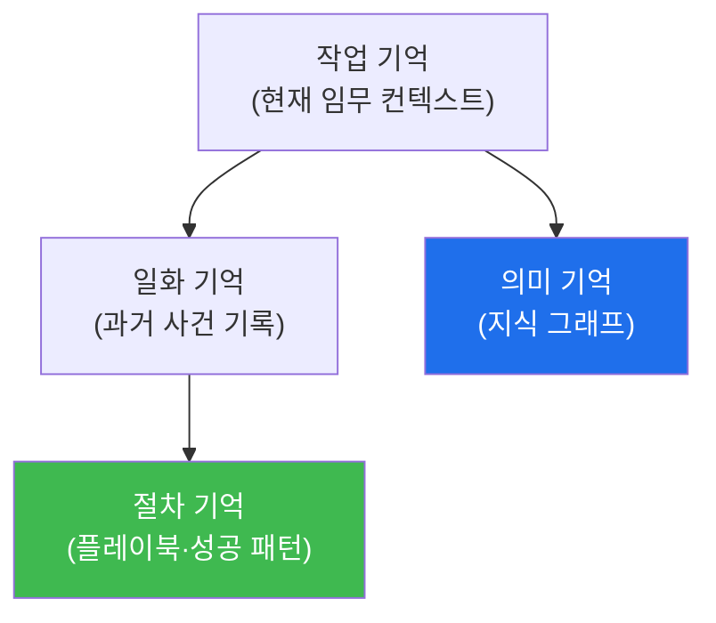

# autonomous-security W09 — Experience와 4-Layer Memory: 계층적 기억과 학습

> **본 주차의 한 줄 요약**
>
> 자율 에이전트가 **성장**하려면 경험을 잘 저장·활용하는 **기억(memory)** 구조가 필요하다. W03에서 본 경험 DB를
> W09에서 **4계층 메모리(4-Layer Memory)** 로 심화한다. 사람의 기억처럼 에이전트도 용도가 다른 기억을 계층으로
> 나눈다: ① **작업 기억(Working Memory)** — 지금 임무의 즉시 컨텍스트(현재 상태·최근 관찰). 컨텍스트 창(W02)에
> 해당, 작고 휘발성, ② **일화 기억(Episodic Memory)** — 과거 **구체적 사건**의 기록("2026-03 이 IP를 이렇게
> 조사해 이런 결과"). 유사 상황 재현·회고에 쓰임, ③ **의미 기억(Semantic Memory)** — 일반화된 **지식**(지식
> 그래프): 자산·취약점·공격 기법·관계. "무엇이 무엇인가", ④ **절차 기억(Procedural Memory)** — **방법·기술**
> (플레이북·성공 패턴): "이런 상황엔 이렇게 한다". W05 플레이북에 해당. 이 네 계층이 **E.G(지식 그래프+경험 DB)**
> 를 구성한다: 의미 기억=지식 그래프, 일화·절차 기억=경험 DB. 학습의 흐름: 임무 수행(작업 기억)→결과를 일화
> 기억에 저장→패턴을 절차 기억(플레이북)으로 일반화→지식 그래프(의미 기억) 갱신. 다음 임무에서 **관련 기억을
> 검색(retrieval)** 해 계획을 강화한다. 핵심은 **저장(무엇을 남길지)** 과 **검색(무엇을 꺼낼지)** — 관련 없는
> 기억을 다 넣으면 컨텍스트가 넘치고, 관련 있는 걸 못 찾으면 학습이 무의미하다. 좋은 메모리 구조가 에이전트를
> 진짜 **경험에서 배우는** 시스템으로 만든다.
>
> **한 줄 결론**: 4계층 메모리(**작업·일화·의미·절차**)가 에이전트의 학습을 구조화한다. 경험을 계층에 저장하고
> 관련 기억을 검색해 계획을 강화 — 저장과 검색이 핵심이다.

---

## 학습 목표

본 주차 종료 시 학생은 다음 5가지를 **본인 손으로** 할 수 있어야 한다.

1. **4계층 메모리**(작업·일화·의미·절차)를 설명한다.
2. 경험을 계층에 **매핑**한다(MEMORY_MAPPED).
3. 경험을 **저장·검색**한다(EXPERIENCE_STORED).
4. 검색한 기억으로 **판단을 개선**한다(MEMORY_APPLIED).
5. 저장·검색이 왜 학습의 핵심인지 설명한다.

> **이 주차의 시선** — 경험을 계층적 기억으로 저장·검색해 진짜 배우는 에이전트를 만든다.

---

## 0. 용어 해설 (메모리)

| 용어 | 영문 | 뜻 | 비유 |
|------|------|----|------|
| **작업 기억** | Working Memory | 즉시 컨텍스트 | 책상 위 |
| **일화 기억** | Episodic Memory | 구체 사건 | 일기 |
| **의미 기억** | Semantic Memory | 일반 지식 | 백과사전 |
| **절차 기억** | Procedural Memory | 방법·기술 | 매뉴얼 |
| **검색** | Retrieval | 관련 기억 꺼냄 | 찾아보기 |

> **헷갈리기 쉬운 한 쌍** — *일화 기억* 은 "무슨 일이 있었나(사건)", *의미 기억* 은 "무엇이 무엇인가(지식)"다.
> 사건과 지식은 다른 계층.

---

## 0.5 신입생 친화 핵심 개념

### 0.5.1 4계층 메모리

작업(지금)·일화(사건)·의미(지식)·절차(방법). 각 계층이 다른 용도로 학습을 지원한다.

### 0.5.2 E.G와의 관계

- **의미 기억 = 지식 그래프**: 자산·취약점·기법·관계.
- **일화·절차 기억 = 경험 DB**: 과거 사건, 성공 패턴(플레이북).
W03의 E.G(지식+경험)가 4계층으로 구체화된다. Manager가 계획 시 이 계층들을 검색해 활용.

### 0.5.3 학습 흐름 — 저장

임무 수행 후: **일화 기억**에 사건 저장("이 상황에 이렇게 해서 이 결과")→반복되는 성공을 **절차 기억(플레이북)**
으로 일반화→새 지식을 **의미 기억(그래프)** 에 갱신. 무엇을 저장할지 선별(중요·재사용 가능한 것)이 중요 — 다
저장하면 잡음.

### 0.5.4 검색 — 관련 기억 꺼내기

새 임무에서 **관련 기억을 검색**한다: 유사 일화(과거 비슷한 사건은?)·해당 절차(이 상황의 플레이북은?)·관련 지식
(이 자산의 취약점은?). 검색을 작업 기억에 로드해 계획을 강화. **검색 품질**이 학습 효과를 좌우 — 관련 있는 걸
정확히 꺼내야 한다(관련 없으면 컨텍스트 낭비).

### 0.5.5 el34 맥락

메모리 구조는 데이터 저장·검색이라 el34에서 시뮬·개념으로 익힌다. 본 실습은 **4계층 매핑·경험 저장/검색·기억
기반 판단 로직**을 결정론 시뮬로 수행한다.

---

## 1. 실습 안내 (5 미션)

실행 위치 el34 **호스트**(`ssh ccc@{{TARGET_IP}}`), GPU `http://211.170.162.139:10934`.

### STEP 1 — GPU 헬스체크 → GEN_OK
### STEP 2 — 4계층 메모리 매핑 → MEMORY_MAPPED
### STEP 3 — 경험 저장·검색 → EXPERIENCE_STORED
### STEP 4 — 기억 기반 판단 → MEMORY_APPLIED
### STEP 5 — 종합 → Assessment

---

## 2. 흔한 오해·관제자 노트

- **"기억은 한 종류"** — 작업·일화·의미·절차 4계층. 용도별.
- **"다 저장하면 좋다"** — 잡음. 선별 저장.
- **"저장만 하면 학습"** — 검색해 써야 학습. 검색 품질이 핵심.
- **관제 관점** — 에이전트가 경험을 계층적으로 저장하고 관련 기억을 검색·활용하는지 점검한다. 저장·검색이 진짜
  학습의 조건.

---

## 3. 다음 주차 (W10) 예고 — Schedule과 Watcher

W09가 "메모리·학습"이었다면, W10은 **Schedule과 Watcher** — 자율 에이전트가 언제·무엇을 트리거해 능동적으로
동작하는지(스케줄·감시자) 다룬다.
