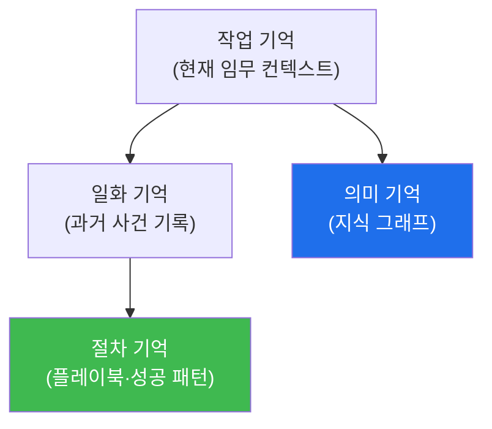

# autonomous-security W09 — Experience와 4-Layer Memory: 계층적 기억과 학습

> **본 주차의 한 줄 요약**
>
> 자율 에이전트가 **성장**하려면 경험을 잘 저장·활용하는 **기억(memory)** 구조가 필요하다. W03에서 본 경험 DB를
> 이번 주 W09에서 **4계층 메모리(4-Layer Memory)**로 심화한다. 사람의 기억처럼 에이전트도 용도가 다른 기억을
> 계층으로 나눈다: ① **작업 기억(Working Memory)** — 지금 임무의 즉시 컨텍스트(현재 상태·최근 관찰). 컨텍스트
> 창(W02)에 해당, 작고 휘발성. ② **일화 기억(Episodic Memory)** — 과거 **구체적 사건**의 기록("2026-03 이 IP를
> 이렇게 조사해 이런 결과"). 유사 상황 재현·회고에 쓰임. ③ **의미 기억(Semantic Memory)** — 일반화된 **지식**(지식
> 그래프): 자산·취약점·공격 기법·관계. "무엇이 무엇인가". ④ **절차 기억(Procedural Memory)** — **방법·기술**
> (플레이북·성공 패턴): "이런 상황엔 이렇게 한다". W05 플레이북에 해당. 이 네 계층이 **E.G(지식 그래프+경험 DB)**를
> 구성한다(의미 기억=지식 그래프, 일화·절차 기억=경험 DB). 학습의 흐름은 임무 수행(작업 기억)→결과를 일화 기억에
> 저장→패턴을 절차 기억(플레이북)으로 일반화→지식 그래프(의미 기억) 갱신이다. 다음 임무에서 **관련 기억을 검색
> (retrieval)**해 계획을 강화한다. 실습에서는 4계층에 경험을 매핑하고(마커 `MEMORY_MAPPED`), 경험을 저장·검색하며
> (마커 `EXPERIENCE_STORED`), 검색한 기억으로 판단을 개선한다(마커 `MEMORY_APPLIED`). 핵심은 **저장(무엇을 남길지)**과
> **검색(무엇을 꺼낼지)**이다 — 관련 없는 기억을 다 넣으면 컨텍스트가 넘치고, 관련 있는 걸 못 찾으면 학습이
> 무의미하다.

---

## 학습 목표

본 주차 종료 시 학생은 다음 5가지를 **본인 손으로** 할 수 있어야 한다.

1. 4계층 메모리(작업·일화·의미·절차)와 E.G와의 관계를 설명한다.
2. 경험을 4계층에 **매핑**한다(마커 `MEMORY_MAPPED`).
3. 경험을 **저장·검색**한다(마커 `EXPERIENCE_STORED`).
4. 검색한 기억으로 **판단을 개선**한다(마커 `MEMORY_APPLIED`).
5. 저장·검색이 왜 학습의 핵심인지 종합한다(마커 `Assessment`).

> **이 주차의 시선** — W03의 "학습"을 실제로 가능하게 하는 기억 구조를 본다. "저장"과 "검색"이 잘돼야 에이전트가
> 경험에서 진짜로 배운다.

---

## 0. 용어 해설 (메모리)

| 용어 | 영문 | 뜻 | 비유 |
|------|------|----|------|
| **작업 기억** | Working Memory | 지금 임무의 즉시 컨텍스트(휘발성) | 책상 위 작업물 |
| **일화 기억** | Episodic Memory | 과거의 구체적 사건 기록 | 일기 |
| **의미 기억** | Semantic Memory | 일반화된 지식(지식 그래프) | 백과사전 |
| **절차 기억** | Procedural Memory | 방법·기술(플레이북·성공 패턴) | 매뉴얼 |
| **저장** | Storage / Write | 무엇을 기억에 남길지 선별 | 기록·보관 |
| **검색** | Retrieval | 관련 기억을 꺼내 활용 | 찾아보기 |
| **일반화** | Generalization | 반복 사건을 절차로 추상화 | 경험이 요령이 됨 |

> **헷갈리기 쉬운 한 쌍 — 일화 기억 vs 의미 기억.** *일화 기억*은 "무슨 일이 있었나(구체 사건)", *의미 기억*은
> "무엇이 무엇인가(일반 지식)"다. 같은 경험이라도 사건 자체는 일화로, 그로부터 얻은 일반 지식은 의미로 저장된다 —
> 계층이 다르다.

---

## 0.5 신입생 친화 핵심 개념

### 0.5.1 4계층 메모리

작업(지금)·일화(사건)·의미(지식)·절차(방법). 각 계층이 다른 용도로 학습을 지원한다 — 지금 일에는 작업 기억,
회고에는 일화, 판단에는 의미, 실행에는 절차 기억을 쓴다.

### 0.5.2 E.G와의 관계

- **의미 기억 = 지식 그래프**: 자산·취약점·기법·관계.
- **일화·절차 기억 = 경험 DB**: 과거 사건, 성공 패턴(플레이북).

W03의 E.G(지식+경험)가 4계층으로 구체화된다. Manager가 계획 시 이 계층들을 검색해 활용한다.

### 0.5.3 학습 흐름 — 저장

임무 수행 후: **일화 기억**에 사건 저장("이 상황에 이렇게 해서 이 결과") → 반복되는 성공을 **절차 기억(플레이북)**으로
일반화 → 새 지식을 **의미 기억(그래프)**에 갱신. 무엇을 저장할지 선별(중요·재사용 가능한 것)이 중요하다 — 다
저장하면 잡음이 된다.

### 0.5.4 검색 — 관련 기억 꺼내기

새 임무에서 관련 기억을 검색한다: 유사 일화(과거 비슷한 사건은?)·해당 절차(이 상황의 플레이북은?)·관련 지식(이
자산의 취약점은?). 검색 결과를 작업 기억에 로드해 계획을 강화한다. **검색 품질**이 학습 효과를 좌우한다 — 관련
있는 것을 정확히 꺼내야 한다(관련 없으면 컨텍스트 낭비).

### 0.5.5 el34 맥락

메모리 구조는 데이터 저장·검색이라 el34에서 시뮬·개념으로 익힌다. 이번 실습은 **4계층 매핑·경험 저장/검색·기억
기반 판단 로직**을 결정론 시뮬로 수행한다.

---

## 1. 계층적 기억 상세 — 매핑·저장/검색·적용

### 1.1 4계층 매핑 (MEMORY_MAPPED)

- **한 줄 정의**: 경험 조각을 작업·일화·의미·절차 중 맞는 계층에 배치한다.
- **왜 중요한가**: 계층이 맞아야 검색이 정확하고 컨텍스트가 안 넘친다.
- **el34 맥락에서 어떻게**: 현재 상태→작업, 사건→일화, 지식→의미, 방법→절차로 매핑하면 `MEMORY_MAPPED`.
- **한계/주의**: 계층 혼동(사건을 지식에 저장 등)은 검색을 흐린다.

### 1.2 경험 저장·검색 (EXPERIENCE_STORED)

- **한 줄 정의**: 중요·재사용 가능한 경험을 저장하고, 새 임무에서 관련 경험을 검색한다.
- **핵심**: 선별 저장(잡음 방지) + 관련성 기반 검색(정확히 꺼내기).
- **판정**: 저장 후 관련 경험이 검색되면 `EXPERIENCE_STORED`.

### 1.3 기억 기반 판단 (MEMORY_APPLIED)

- **한 줄 정의**: 검색한 기억을 작업 기억에 로드해 계획·판단을 강화한다.
- **핵심**: 과거 일화·절차·지식을 반영해 처음부터가 아니라 강화된 판단.
- **판정**: 검색 기억이 판단을 개선하면 `MEMORY_APPLIED`.

---

## 2. 실습 안내 (총 5 미션)

실행 위치는 el34 **호스트**(`ssh ccc@{{TARGET_IP}}`, 비밀번호 `1`), 참고 GPU는 Ollama
(`http://211.170.162.139:10934`, gemma3:4b)다. 각 미션의 마지막 줄 마커가 채점 기준이다.

### 미션 1 — GPU 헬스체크 → `GEN_OK`

> **왜 하는가?** 대상 LLM 도달·응답 확인(반복 절차).
> **무엇을 아는가?** Ollama 응답 형식·도달성.
> **결과 해석** — 정상 `GEN_OK` / 비정상 `GEN_EMPTY`·연결 오류.
> **실전 활용** — 종합 소견 작성에 사용.

### 미션 2 — 4계층 메모리 매핑 → `MEMORY_MAPPED`

> **왜 하는가?** 경험을 맞는 계층에 배치해 검색이 정확하게 한다.
> **무엇을 아는가?** 작업·일화·의미·절차 계층 구분.
> **결과 해석** — 정상: 매핑 + `MEMORY_MAPPED`.
> **실전 활용** — 에이전트 메모리 구조 설계.

### 미션 3 — 경험 저장·검색 → `EXPERIENCE_STORED`

> **왜 하는가?** 중요 경험을 남기고 관련 경험을 꺼내는 법을 익힌다.
> **무엇을 아는가?** 선별 저장·관련성 검색.
> **결과 해석** — 정상: 저장·검색 + `EXPERIENCE_STORED`.
> **실전 활용** — 경험 DB 운영.

### 미션 4 — 기억 기반 판단 → `MEMORY_APPLIED`

> **왜 하는가?** 검색한 기억이 실제 판단을 개선함을 확인한다.
> **무엇을 아는가?** 과거 경험을 반영한 강화된 판단.
> **결과 해석** — 정상: 판단 개선 + `MEMORY_APPLIED`.
> **실전 활용** — 경험 기반 계획 강화(W03 연결).

### 미션 5 — 종합 소견 → `Assessment`

> **왜 하는가?** 매핑·저장/검색·적용과 "저장·검색이 학습의 핵심"을 소견으로 묶는다.
> **무엇을 아는가?** GPU에 요약시키되 첫 줄을 `Assessment`로 강제.
> **결과 해석** — 정상: `Assessment` 포함. 없으면 `[형식 미준수 — 재실행]`.
> **실전 활용** — 학습형 에이전트 메모리 개요.

---

## 3. 흔한 오해·관제자 노트

- **"기억은 한 종류다."** — 작업·일화·의미·절차 4계층이며 용도가 다르다.
- **"많이 저장할수록 좋다."** — 잡음이 된다. 중요·재사용 가능한 것을 선별한다.
- **"저장만 하면 학습이다."** — 검색해서 써야 학습이다. 검색 품질이 핵심.
- **"검색은 그냥 다 꺼내면 된다."** — 관련 없는 기억은 컨텍스트를 낭비한다. 관련성 기반 검색이 필요하다.
- **관제(Blue) 관점** — 에이전트가 (1) 경험을 계층적으로 저장하는가, (2) 관련 기억을 정확히 검색하는가, (3) 검색을
  판단에 반영하는가, (4) 저장이 잡음 없이 선별되는가를 점검한다.

---

## 4. 다음 주차 (W10) 예고 — Schedule과 Watcher

W09가 "기억과 학습"이었다면, W10은 **Schedule과 Watcher**를 다룬다. 자율 에이전트가 요청을 기다리지 않고 스케줄·
감시자(watcher)로 **능동적으로** 언제·무엇을 트리거해 동작하는지, 그 능동성의 안전(폭주 방지)을 익힌다.
