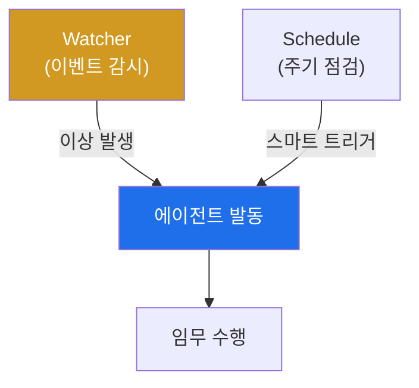

# autonomous-security W10 — Schedule과 Watcher: 능동적 트리거와 스마트 감시

> **본 주차의 한 줄 요약**
>
> 지금까지 에이전트는 임무를 **받아서** 수행했다(수동적). 진짜 자율 시스템은 **스스로 언제 무엇을 할지 결정**한다
> (능동적) — 이것이 **Schedule(스케줄)**과 **Watcher(감시자)**다. ① **Watcher** — 특정 이벤트·조건을 감시하다가
> 발동한다(이벤트 기반). 예: SIEM 알림 급증·이상 로그·특정 IOC 출현 시 자동으로 조사 에이전트 발동. Watcher가 자율
> 시스템의 "감각"이다. ② **Schedule** — 주기적으로 작업을 실행한다(시간 기반). 예: 매일 취약점 스캔·매시간 로그
> 점검. 그런데 순진한 스케줄(cron으로 무조건 실행)은 문제다 — **잡음·비용·경보 피로**(중요하지 않아도 매번 실행·
> 보고). 그래서 **스마트 트리거(smart trigger)**가 핵심이다: 무조건이 아니라 **의미 있을 때만** 발동한다. tubewar의
> gwanje(관제) 원칙이 좋은 예다 — ① 중요도(salience)가 임계 이상(예: salience≥5, 실제 이상징후) ② 또는 하트비트
> 주기(예: 25분간 조용했으면 한 번 점검) ③ 또는 즉시 이상일 때만 보고·발동한다. 이렇게 하면 중요한 것은 즉시,
> 조용할 땐 최소한으로 — 잡음 없이 능동적이다. 실습에서는 Watcher를 설계하고(마커 `WATCHER_SET`), 스마트 스케줄을
> 만들며(마커 `SCHEDULE_SET`), 트리거 발동 로직을 구현한다(마커 `TRIGGER_FIRED`). **cron 금지, 스마트 트리거**가
> 원칙이며, Watcher·Schedule에도 가드레일(W01)이 필요하다 — 능동 발동이 폭주하지 않게.

---

## 학습 목표

본 주차 종료 시 학생은 다음 5가지를 **본인 손으로** 할 수 있어야 한다.

1. Watcher(이벤트)와 Schedule(주기)의 능동성과 차이를 설명한다.
2. **Watcher(이벤트 트리거)**를 설계한다(마커 `WATCHER_SET`).
3. **스마트 스케줄**(cron 대신 스마트 트리거)을 설계한다(마커 `SCHEDULE_SET`).
4. 트리거 발동 로직을 구현한다(마커 `TRIGGER_FIRED`).
5. 왜 무조건 cron이 나쁜지, 능동성에 왜 가드레일이 필요한지 종합한다(마커 `Assessment`).

> **이 주차의 시선** — 에이전트가 "부르면 오는" 수동에서 "스스로 도는" 능동으로 바뀐다. 능동성의 함정(잡음·폭주)을
> 스마트 트리거·가드레일로 다스리는 것이 핵심이다.

---

## 0. 용어 해설 (Schedule·Watcher)

| 용어 | 영문 | 뜻 | 비유 |
|------|------|----|------|
| **Watcher** | Watcher | 이벤트·조건을 감시하다 발동하는 감시자 | 파수꾼 |
| **Schedule** | Schedule | 주기적으로 작업을 실행 | 정기 순찰 |
| **cron** | cron | 시간마다 무조건 실행하는 전통 스케줄러 | 알람 시계 |
| **스마트 트리거** | Smart Trigger | 의미 있을 때만 발동 | 선별 발동 |
| **중요도** | Salience | 사안이 얼마나 주목할 만한가 | 눈에 띄는 정도 |
| **하트비트** | Heartbeat | 오래 조용하면 한 번 점검하는 주기 | 정기 확인 |
| **경보 피로** | Alert Fatigue | 잦은 무의미 경보로 둔감해짐 | 양치기 소년 |

> **헷갈리기 쉬운 한 쌍 — cron vs 스마트 트리거.** *cron*은 시간마다 항상 실행해 잡음·비용·경보 피로를 만든다.
> *스마트 트리거*는 중요도·하트비트·이상 시에만 발동해 잡음을 없앤다. "항상"이 아니라 "의미 있을 때만"이 능동성의
> 정답이다.

---

## 0.5 신입생 친화 핵심 개념

### 0.5.1 능동적 자율성

Watcher가 이벤트를, Schedule이 주기를 감시하다 **스마트 트리거**로 에이전트를 발동한다. 스스로 도는 능동
시스템이지만, 발동 조건이 스마트해야 잡음이 없다.

### 0.5.2 Watcher — 이벤트 기반

특정 조건을 감시하다 발동한다: SIEM 알림 급증·이상 로그 패턴·IOC 출현·시스템 상태 변화. Watcher가 감지하면 관련
에이전트·플레이북(W05)을 자동 발동한다. 이벤트에 즉각 반응하는 "감각"이다.

### 0.5.3 스마트 트리거 — cron 금지

순진한 cron(매분/매시 무조건 실행)은 잡음·비용·경보 피로를 만든다. 스마트 트리거는 **의미 있을 때만** 발동한다
(gwanje 원칙):

- **중요도(salience)≥임계**: 실제 이상징후가 있을 때.
- **하트비트 주기**: 오래(예: 25분) 조용했으면 한 번 점검(놓침 방지).
- **즉시 이상**: 심각한 이상은 즉시.

셋 중 하나라도 만족하면 발동, 아니면 침묵. 중요한 것은 즉시, 조용할 땐 최소한이다.

### 0.5.4 능동성의 가드레일

능동 발동도 가드레일(W01)이 필요하다: 발동 빈도 제한(폭주 방지)·위험 행동은 승인·범위 제한. Watcher가 과민하면
경보 폭풍, 둔감하면 놓침 — 임계값 튜닝이 중요하다. 능동성과 절제의 균형이 핵심이다.

### 0.5.5 el34 맥락

tubewar의 gwanje(관제) 스킬이 바로 이 스마트 트리거 원칙(salience≥5·heartbeat≥25분·이상 즉시, cron 금지)으로
동작한다. 이번 실습은 **Watcher·스마트 스케줄·트리거 로직**을 결정론 시뮬로 익힌다.

---

## 1. 능동적 트리거 상세 — Watcher·스케줄·발동

### 1.1 Watcher 설계 (WATCHER_SET)

- **한 줄 정의**: 감시할 이벤트·조건과 발동 대상(에이전트/플레이북)을 정의한다.
- **왜 중요한가**: Watcher가 자율 시스템의 감각이다. 무엇을 감시할지가 반응성을 결정한다.
- **el34 맥락에서 어떻게**: "SIEM 알림 급증 시 조사 에이전트 발동" 같은 Watcher를 정의하면 `WATCHER_SET`.
- **한계/주의**: 과민 Watcher는 경보 폭풍을 만든다. 조건을 신중히.

### 1.2 스마트 스케줄 (SCHEDULE_SET)

- **한 줄 정의**: cron 대신 중요도·하트비트·이상 기반으로 발동하는 스케줄을 만든다.
- **핵심**: salience≥임계 · heartbeat 주기 · 즉시 이상 — 셋 중 하나일 때만 발동.
- **판정**: 스마트 트리거 조건이 정의되면 `SCHEDULE_SET`.

### 1.3 트리거 발동 (TRIGGER_FIRED)

- **한 줄 정의**: 조건 충족 시 실제로 에이전트를 발동하고, 미충족 시 침묵함을 확인한다.
- **핵심**: 의미 있는 이벤트에만 발동, 조용할 땐 하트비트로만.
- **판정**: 스마트 조건에 따라 발동/침묵이 옳게 작동하면 `TRIGGER_FIRED`.

---

## 2. 실습 안내 (총 5 미션)

실행 위치는 el34 **호스트**(`ssh ccc@{{TARGET_IP}}`, 비밀번호 `1`), 참고 GPU는 Ollama
(`http://211.170.162.139:10934`, gemma3:4b)다. 각 미션의 마지막 줄 마커가 채점 기준이다.

### 미션 1 — GPU 헬스체크 → `GEN_OK`

> **왜 하는가?** 대상 LLM 도달·응답 확인(반복 절차).
> **무엇을 아는가?** Ollama 응답 형식·도달성.
> **결과 해석** — 정상 `GEN_OK` / 비정상 `GEN_EMPTY`·연결 오류.
> **실전 활용** — 종합 소견 작성에 사용.

### 미션 2 — Watcher 설계 → `WATCHER_SET`

> **왜 하는가?** 이벤트에 반응하는 자율 감각을 정의한다.
> **무엇을 아는가?** 감시 조건·발동 대상.
> **결과 해석** — 정상: Watcher 정의 + `WATCHER_SET`.
> **실전 활용** — 이벤트 기반 자율 대응 설계.

### 미션 3 — 스마트 스케줄 → `SCHEDULE_SET`

> **왜 하는가?** cron의 잡음을 피하는 스마트 트리거를 설계한다.
> **무엇을 아는가?** 중요도·하트비트·이상 기반 발동.
> **결과 해석** — 정상: 스마트 스케줄 + `SCHEDULE_SET`.
> **실전 활용** — 관제 자동화(gwanje 원칙).

### 미션 4 — 트리거 발동 → `TRIGGER_FIRED`

> **왜 하는가?** 조건에 따라 발동/침묵이 옳게 되는지 확인한다.
> **무엇을 아는가?** 의미 있을 때만 발동, 조용할 땐 하트비트.
> **결과 해석** — 정상: 발동 로직 + `TRIGGER_FIRED`.
> **실전 활용** — 잡음 없는 능동 발동.

### 미션 5 — 종합 소견 → `Assessment`

> **왜 하는가?** Watcher·스케줄·발동과 "cron 금지·스마트 트리거"를 소견으로 묶는다.
> **무엇을 아는가?** GPU에 요약시키되 첫 줄을 `Assessment`로 강제.
> **결과 해석** — 정상: `Assessment` 포함. 없으면 `[형식 미준수 — 재실행]`.
> **실전 활용** — 능동 자율 시스템 설계 개요.

---

## 2.5 과제 (제출물)

- **A. Watcher 설계 실증 (필수, 40점)** — `WATCHER_SET` 단계를 직접 수행해 실제 명령·출력(또는 아티팩트 분석 결과)을 캡처하고, 무엇을 근거로 판정했는지 서술한다.
- **B. 스마트 스케줄 분석 (필수, 30점)** — `SCHEDULE_SET` 단계를 직접 수행해 실제 명령·출력(또는 아티팩트 분석 결과)을 캡처하고, 무엇을 근거로 판정했는지 서술한다.
- **C. 트리거 발동 방어 설계 (필수, 30점)** — `TRIGGER_FIRED` 단계를 직접 수행해 실제 명령·출력(또는 아티팩트 분석 결과)을 캡처하고, 무엇을 근거로 판정했는지 서술한다.

## 2.6 평가 기준

| 항목 | 미흡(0) | 보통 | 우수 |
|------|---------|------|------|
| 탐지/실증(WATCHER_SET) | 미수행 | 마커 도출 | 근거·해석·재현까지 |
| 분석(SCHEDULE_SET) | 미수행 | 마커 도출 | 근거·해석·재현까지 |
| 방어(TRIGGER_FIRED) | 미수행 | 마커 도출 | 근거·해석·재현까지 |

## 2.7 핵심 정리 (1줄씩)

- 이번 주 주제: **Schedule과 Watcher: 능동적 트리거와 스마트 감시**.
- **Watcher 설계**(`WATCHER_SET`): 감시할 이벤트·조건과 발동 대상(에이전트/플레이북)을 정의한다.
- **스마트 스케줄**(`SCHEDULE_SET`): cron 대신 중요도·하트비트·이상 기반으로 발동하는 스케줄을 만든다.
- **트리거 발동**(`TRIGGER_FIRED`): 조건 충족 시 실제로 에이전트를 발동하고, 미충족 시 침묵함을 확인한다.
- 공격을 이해한 만큼 **방어의 우선순위**가 분명해진다 — 탐지 근거와 완화를 함께 익힌다.

---

## 3. 흔한 오해·블루팀 노트

- **"cron으로 매분 돌리면 된다."** — 잡음·비용·경보 피로를 만든다. 스마트 트리거가 답이다.
- **"Watcher는 민감할수록 좋다."** — 과민하면 경보 폭풍이다. 임계값 튜닝이 필요하다.
- **"능동 발동은 무제한이어도 된다."** — 가드레일(빈도 제한·승인)이 필요하다.
- **"조용하면 아무것도 안 해도 된다."** — 하트비트로 주기 점검해 놓침을 막는다.
- **관제(Blue) 관점** — 자율 시스템이 (1) 스마트 트리거(중요도·하트비트·이상)로 발동하는가, (2) cron 남발·경보
  피로가 없는가, (3) 능동 발동에 가드레일이 있는가, (4) Watcher 임계값이 튜닝됐는가를 점검한다.

---

## 4. 다음 주차 (W11) 예고 — 자율 Blue Agent

W10이 "능동적 트리거"였다면, W11은 **자율 Blue Agent**를 다룬다. 지금까지의 기술(에이전트·플레이북·메모리·트리거)을
방어(Blue) 자율 에이전트로 통합해, 탐지→조사→대응을 스스로 수행하는 구축을 익힌다.
