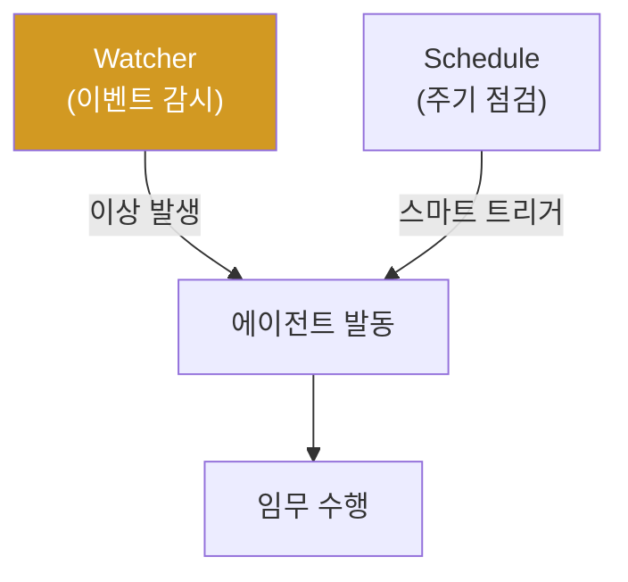

# autonomous-security W10 — Schedule과 Watcher: 능동적 트리거와 스마트 감시

> **본 주차의 한 줄 요약**
>
> 지금까지 에이전트는 임무를 **받아서** 수행했다(수동적). 진짜 자율 시스템은 **스스로 언제 무엇을 할지 결정**한다
> (능동적) — 이것이 **Schedule(스케줄)** 과 **Watcher(감시자)** 다. ① **Watcher** — 특정 **이벤트·조건**을
> 감시하다가 발동한다(이벤트 기반). 예: SIEM 알림 급증·이상 로그·특정 IOC 출현 시 자동으로 조사 에이전트 발동.
> Watcher가 자율 시스템의 "감각"이다, ② **Schedule** — **주기적**으로 작업을 실행한다(시간 기반). 예: 매일 취약점
> 스캔·매시간 로그 점검. 그런데 순진한 스케줄(cron으로 무조건 실행)은 문제다: **잡음·비용·경보 피로**(중요하지
> 않아도 매번 실행·보고). 그래서 **스마트 트리거(smart trigger)** 가 핵심 — 무조건이 아니라 **의미 있을 때만**
> 발동한다. tubewar의 gwanje(관제) 원칙이 좋은 예: **① 중요도(salience)가 임계 이상**(예: salience≥5, 실제
> 이상징후) **② 또는 하트비트 주기**(예: 25분간 조용했으면 한 번 점검) **③ 또는 즉시 이상**일 때만 보고·발동한다.
> 이렇게 하면 중요한 것은 즉시, 조용할 땐 최소한으로 — 잡음 없이 능동적. **cron 금지, 스마트 트리거**가 원칙이다.
> Watcher·Schedule에도 **가드레일**(W01)이 필요하다 — 능동 발동이 폭주하지 않게. 능동성이 자율 시스템을 진짜
> "스스로 도는" 시스템으로 만들되, 스마트하게 발동해 자원·주의를 아낀다.
>
> **한 줄 결론**: Watcher(이벤트 감시)와 Schedule(주기 실행)이 자율 시스템을 **능동적**으로 만든다. 핵심은 무조건
> cron이 아니라 **스마트 트리거**(중요도·하트비트·이상 시에만) — 잡음 없이 능동적.

---

## 학습 목표

본 주차 종료 시 학생은 다음 5가지를 **본인 손으로** 할 수 있어야 한다.

1. **Watcher와 Schedule**의 능동성을 설명한다.
2. **Watcher(이벤트 트리거)** 를 설계한다(WATCHER_SET).
3. **스마트 스케줄**(cron 대신 스마트 트리거)을 설계한다(SCHEDULE_SET).
4. 트리거 발동 로직을 구현한다(TRIGGER_FIRED).
5. 왜 무조건 cron이 나쁜지 설명한다.

> **이 주차의 시선** — 스스로 언제 도는지 정하는 능동적 자율성을, 스마트 트리거로 잡음 없이 만든다.

---

## 0. 용어 해설 (Schedule/Watcher)

| 용어 | 영문 | 뜻 | 비유 |
|------|------|----|------|
| **Watcher** | — | 이벤트 감시자 | 파수꾼 |
| **Schedule** | — | 주기 실행 | 정기 순찰 |
| **스마트 트리거** | Smart Trigger | 의미 있을 때만 | 선별 발동 |
| **중요도** | Salience | 사안의 중요성 | 눈에 띔 |
| **하트비트** | Heartbeat | 주기 점검 | 정기 확인 |

> **헷갈리기 쉬운 한 쌍** — *cron(무조건)* 은 "시간마다 항상(잡음)", *스마트 트리거* 는 "의미 있을 때만(선별)"
> 이다. 후자가 잡음을 없앤다.

---

## 0.5 신입생 친화 핵심 개념

### 0.5.1 능동적 자율성

Watcher가 이벤트를, Schedule이 주기를 감시하다 **스마트 트리거**로 에이전트를 발동. 스스로 도는 능동 시스템.

### 0.5.2 Watcher — 이벤트 기반

특정 조건을 감시하다 발동: SIEM 알림 급증·이상 로그 패턴·IOC 출현·시스템 상태 변화. Watcher가 감지하면 관련
에이전트·플레이북(W05)을 자동 발동. 이벤트에 **즉각 반응**하는 감각.

### 0.5.3 스마트 트리거 — cron 금지

순진한 cron(매분/매시 무조건 실행)은 **잡음·비용·경보 피로**를 만든다. 스마트 트리거는 **의미 있을 때만** 발동
(gwanje 원칙):
- **중요도(salience)≥임계**: 실제 이상징후가 있을 때.
- **하트비트 주기**: 오래(예: 25분) 조용했으면 한 번 점검(놓침 방지).
- **즉시 이상**: 심각한 이상은 즉시.
셋 중 하나라도면 발동, 아니면 침묵. 중요한 건 즉시, 조용할 땐 최소.

### 0.5.4 능동성의 가드레일

능동 발동도 **가드레일**(W01)이 필요하다: 발동 빈도 제한(폭주 방지)·위험 행동은 승인·범위 제한. Watcher가
과민하면 경보 폭풍, 둔감하면 놓침 — 임계값 튜닝이 중요. 능동성과 절제의 균형.

### 0.5.5 el34 맥락

tubewar의 gwanje(관제) 스킬이 바로 이 스마트 트리거 원칙(salience≥5·heartbeat≥25분·이상 즉시, cron 금지)으로
동작한다. 본 실습은 **Watcher·스마트 스케줄·트리거 로직**을 결정론 시뮬로 익힌다.

---

## 1. 실습 안내 (5 미션)

실행 위치 el34 **호스트**(`ssh ccc@{{TARGET_IP}}`), GPU `http://211.170.162.139:10934`.

### STEP 1 — GPU 헬스체크 → GEN_OK
### STEP 2 — Watcher 설계 → WATCHER_SET
### STEP 3 — 스마트 스케줄 → SCHEDULE_SET
### STEP 4 — 트리거 발동 → TRIGGER_FIRED
### STEP 5 — 종합 → Assessment

---

## 2. 흔한 오해·관제자 노트

- **"cron으로 매분 돌리면 됨"** — 잡음·비용·피로. 스마트 트리거.
- **"Watcher는 민감할수록 좋다"** — 경보 폭풍. 임계값 튜닝.
- **"능동 발동은 무제한"** — 가드레일 필요. 빈도 제한·승인.
- **관제 관점** — 자율 시스템이 스마트 트리거(중요도·하트비트·이상)로 발동하는지, cron 남발·경보 피로가 없는지,
  능동 발동에 가드레일이 있는지 점검한다. 능동성과 절제의 균형.

---

## 3. 다음 주차 (W11) 예고 — 자율 Blue Agent

W10이 "능동적 트리거"였다면, W11은 **자율 Blue Agent** — 지금까지의 기술을 방어(Blue) 자율 에이전트로 통합해
탐지·조사·대응을 자율 수행하는 구축을 다룬다.
