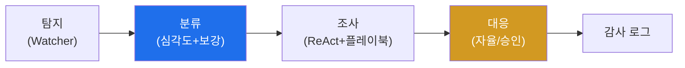

# autonomous-security W11 — 자율 Blue Agent: 자율 방어 에이전트 구축

> **본 주차의 한 줄 요약**
>
> W01~W10의 기술을 **하나의 자율 방어(Blue) 에이전트**로 통합한다. 자율 Blue Agent는 사람 개입을 최소화하며
> **탐지→분류(triage)→조사(investigate)→대응(respond)** 을 자율 수행하는 방어자다(agent-ir 과목의 자율판).
> 파이프라인: ① **탐지** — Watcher(W10)가 SIEM 알림·이상을 포착해 발동, ② **분류(triage)** — 알림의 심각도·
> 신뢰도를 평가하고 관련 정보를 **보강(enrichment)**(IP 평판·자산 중요도·과거 일화 검색 W09). 오탐·저위험은 자동
> 종료, 진짜 위협만 진행, ③ **조사** — ReAct 루프(W02)로 도구를 써서 근본 원인·범위를 파악(어느 호스트·무슨
> 공격·측면이동?). 플레이북(W05)으로 일관되게, ④ **대응** — 위협을 봉쇄·근절(차단·격리). 단 **자율성 수준**(W01)
> 에 따라: 저위험 대응(조사·수집)은 자율, 고위험 대응(격리·종료)은 사람 승인. 모든 행동은 변조 불가 로그(W06)에
> 기록. 자율 Blue Agent의 가치: **기계 속도** 대응(사람보다 빠름)·**24/7**·**일관성**·**인력 확장**(사람은 고
> 위험 결정과 감독에 집중). 하지만 위험: 오탐에 자율 대응하면 **정상 서비스 차단**(보상 해킹 W07의 실전판), 잘못된
> 조사로 오판. 그래서 **가드레일·결과 검증·자율성 수준**이 필수다. 좋은 자율 Blue Agent는 빠르고 일관되되,
> 위험한 결정엔 사람을 두고, 실수를 로그·검증으로 잡는다.
>
> **한 줄 결론**: 자율 Blue Agent는 **탐지→분류→조사→대응**을 자율 수행한다(기계 속도·24/7·일관성). 저위험은
> 자율, 고위험은 사람 승인, 모든 행동은 감사 로그에 — 가드레일·검증이 안전을 지킨다.

---

## 학습 목표

본 주차 종료 시 학생은 다음 5가지를 **본인 손으로** 할 수 있어야 한다.

1. 자율 Blue Agent **파이프라인**을 설명한다(BLUE_PIPELINE).
2. 자율 **분류(triage)** 를 수행한다(TRIAGE_DONE).
3. 자율 **대응**을 가드레일과 함께 수행한다(RESPONSE_EXECUTED).
4. 자율 방어의 가치와 위험을 설명한다.
5. W01~W10 기술을 방어로 통합한다.

> **이 주차의 시선** — 배운 기술을 하나의 자율 방어자로 통합하되, 안전을 함께 설계한다.

---

## 0. 용어 해설 (Blue Agent)

| 용어 | 영문 | 뜻 | 비유 |
|------|------|----|------|
| **Blue Agent** | — | 자율 방어자 | 자율 경비 |
| **Triage** | — | 분류·우선순위 | 응급 분류 |
| **Enrichment** | — | 정보 보강 | 배경 조사 |
| **봉쇄** | Containment | 확산 차단 | 격리 |
| **자율성 수준** | Autonomy Level | 사람 개입 정도 | 재량 범위 |

> **헷갈리기 쉬운 한 쌍** — *저위험 자율 행동* 은 "조사·수집(자율 OK)", *고위험 행동* 은 "격리·종료(사람 승인)"
> 다. 위험도로 자율성을 나눈다.

---

## 0.5 신입생 친화 핵심 개념

### 0.5.1 Blue Agent 파이프라인

탐지→분류→조사→대응→기록. W02~W10 기술이 각 단계를 채운다.

### 0.5.2 자율 분류 — 잡음 거르기

분류가 자율 방어의 관문이다. 알림의 **심각도·신뢰도**를 평가하고 **보강**(IP 평판·자산 중요도·과거 일화 W09)해,
**오탐·저위험은 자동 종료**(잡음 제거), **진짜 위협만** 조사로 넘긴다. 분류가 부실하면 조사·대응 자원을 낭비하거나
진짜를 놓친다.

### 0.5.3 자율 대응과 자율성 수준

대응은 **위험도로 자율성을 나눈다**(W01):
- **저위험**(조사·증거 수집·평판 조회): **자율** 실행.
- **중위험**(IP 차단): **감독**(사람 확인).
- **고위험**(호스트 격리·시스템 종료): **사람 승인**.
자율 속도와 안전을 균형. 모든 행동은 감사 로그(W06)에.

### 0.5.4 가치와 위험

- **가치**: 기계 속도(사람보다 빠른 대응)·24/7·일관성·인력 확장.
- **위험**: 오탐 자율 대응→정상 차단(서비스 파괴)·오판. 그래서 **가드레일·결과 검증(W04)·자율성 수준·보상 정렬
  (W07)** 이 필수.
빠르되 안전하게 — 위험한 결정엔 사람을, 실수엔 로그·검증을.

### 0.5.5 el34 맥락

el34에서 자율 Blue Agent가 SIEM·bastion과 연동해 방어한다. 본 실습은 **Blue 파이프라인·자율 분류·가드레일 대응
로직**을 결정론 시뮬로 익힌다.

---

## 1. 실습 안내 (5 미션)

실행 위치 el34 **호스트**(`ssh ccc@{{TARGET_IP}}`), GPU `http://211.170.162.139:10934`.

### STEP 1 — GPU 헬스체크 → GEN_OK
### STEP 2 — Blue 파이프라인 → BLUE_PIPELINE
### STEP 3 — 자율 분류 → TRIAGE_DONE
### STEP 4 — 가드레일 대응 → RESPONSE_EXECUTED
### STEP 5 — 종합 → Assessment

---

## 2. 흔한 오해·관제자 노트

- **"자율이면 다 자동"** — 고위험은 사람 승인. 자율성 수준.
- **"탐지하면 바로 차단"** — 분류·조사 먼저. 오탐 자율 대응은 서비스 파괴.
- **"빠르면 됨"** — 가드레일·검증 필수. 빠르되 안전하게.
- **관제 관점** — 자율 Blue Agent가 분류로 잡음을 거르고, 위험도별 자율성 수준·가드레일·감사 로그를 갖췄는지
  점검한다. 속도와 안전의 균형.

---

## 3. 다음 주차 (W12) 예고 — 자율 Red Agent

W11이 "자율 방어"였다면, W12는 **자율 Red Agent** — 자율 공격 에이전트로 정찰·침투·측면이동을 자율 수행해
방어를 시험하는(단 인가된 범위에서) 구축을 다룬다.
