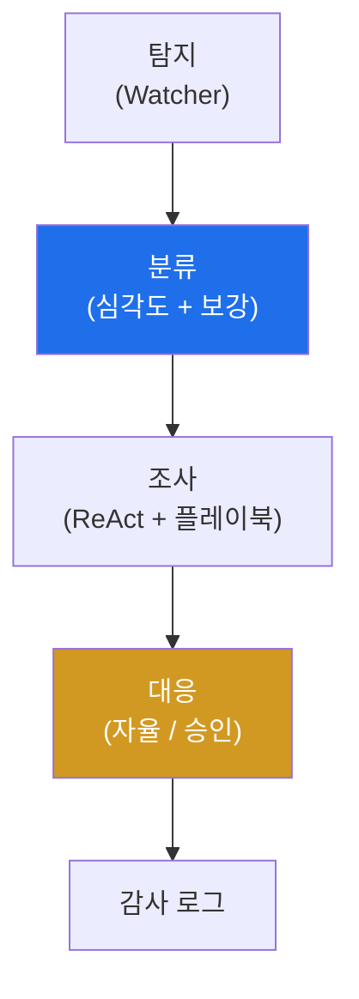

# autonomous-security W11 — 자율 Blue Agent: 자율 방어 에이전트 구축

> **본 주차의 한 줄 요약**
>
> W01~W10의 기술을 **하나의 자율 방어(Blue) 에이전트**로 통합한다. 자율 Blue Agent는 사람 개입을 최소화하며
> **탐지→분류(triage)→조사(investigate)→대응(respond)**을 자율 수행하는 방어자다(agent-ir 과목의 자율판).
> 파이프라인은 넷이다: ① **탐지** — Watcher(W10)가 SIEM 알림·이상을 포착해 발동, ② **분류(triage)** — 알림의
> 심각도·신뢰도를 평가하고 관련 정보를 **보강(enrichment)**(IP 평판·자산 중요도·과거 일화 검색 W09). 오탐·저위험은
> 자동 종료, 진짜 위협만 진행, ③ **조사** — ReAct 루프(W02)로 도구를 써서 근본 원인·범위를 파악(어느 호스트·무슨
> 공격·측면이동?). 플레이북(W05)으로 일관되게, ④ **대응** — 위협을 봉쇄·근절(차단·격리). 단 **자율성 수준**(W01)에
> 따라 저위험 대응(조사·수집)은 자율, 고위험 대응(격리·종료)은 사람 승인. 모든 행동은 변조 불가 로그(W06)에 기록.
> 실습에서는 Blue 파이프라인을 구성하고(마커 `BLUE_PIPELINE`), 자율 분류를 수행하며(마커 `TRIAGE_DONE`), 가드레일과
> 함께 대응한다(마커 `RESPONSE_EXECUTED`). 가치는 **기계 속도** 대응·**24/7**·**일관성**·**인력 확장**이다. 하지만
> 위험도 있다 — 오탐에 자율 대응하면 정상 서비스 차단(보상 해킹 W07의 실전판), 잘못된 조사로 오판. 그래서 **가드레일·
> 결과 검증·자율성 수준**이 필수다. 좋은 자율 Blue Agent는 빠르고 일관되되, 위험한 결정엔 사람을 두고 실수를 로그·
> 검증으로 잡는다.

---

## 학습 목표

본 주차 종료 시 학생은 다음 5가지를 **본인 손으로** 할 수 있어야 한다.

1. 자율 Blue Agent 파이프라인(탐지·분류·조사·대응)을 설명한다(마커 `BLUE_PIPELINE`).
2. 자율 **분류(triage)**로 잡음을 거른다(마커 `TRIAGE_DONE`).
3. 자율 **대응**을 위험도별 자율성 수준·가드레일과 함께 수행한다(마커 `RESPONSE_EXECUTED`).
4. 자율 방어의 가치(속도·24/7·일관성)와 위험(오탐 대응)을 설명한다.
5. W01~W10 기술을 방어로 통합해 종합한다(마커 `Assessment`).

> **이 주차의 시선** — 배운 기술을 하나의 자율 방어자로 통합하되, "빠름"과 "안전"을 함께 설계한다. 오탐에 자율
> 대응하면 방어가 서비스 파괴가 됨을 잊지 않는다.

---

## 0. 용어 해설 (Blue Agent)

| 용어 | 영문 | 뜻 | 비유 |
|------|------|----|------|
| **Blue Agent** | Blue Agent | 탐지·조사·대응을 자율 수행하는 방어자 | 자율 경비원 |
| **분류(트리아지)** | Triage | 알림의 심각도·신뢰도로 우선순위 결정 | 응급 분류 |
| **보강** | Enrichment | 알림에 배경 정보(평판·자산·이력) 추가 | 배경 조사 |
| **조사** | Investigation | 근본 원인·범위를 파악(ReAct+플레이북) | 사건 수사 |
| **봉쇄** | Containment | 위협 확산을 차단 | 격리 |
| **근절** | Eradication | 위협을 제거 | 소탕 |
| **자율성 수준** | Autonomy Level | 위험도별 사람 개입 정도(W01) | 재량 범위 |

> **헷갈리기 쉬운 한 쌍 — 저위험 자율 행동 vs 고위험 행동.** *저위험*(조사·수집·평판 조회)은 자율로 해도 안전하다.
> *고위험*(격리·시스템 종료·정상 차단 가능 행동)은 사람 승인이 필요하다. 위험도로 자율성을 나누는 것이 자율 방어의
> 핵심 안전 장치다.

---

## 0.5 핵심 개념

### 0.5.1 Blue Agent 파이프라인

탐지→분류→조사→대응→기록. W02~W10 기술이 각 단계를 채운다(Watcher·플레이북·메모리·감사).

### 0.5.2 자율 분류 — 잡음 거르기

분류가 자율 방어의 관문이다. 알림의 심각도·신뢰도를 평가하고 보강(IP 평판·자산 중요도·과거 일화 W09)해, 오탐·저위험은
자동 종료(잡음 제거)하고 진짜 위협만 조사로 넘긴다. 분류가 부실하면 조사·대응 자원을 낭비하거나 진짜를 놓친다.

### 0.5.3 자율 대응과 자율성 수준

대응은 위험도로 자율성을 나눈다(W01).

- **저위험**(조사·증거 수집·평판 조회): 자율 실행.
- **중위험**(IP 차단): 감독(사람 확인).
- **고위험**(호스트 격리·시스템 종료): 사람 승인.

자율 속도와 안전을 균형 있게 두고, 모든 행동은 감사 로그(W06)에 남긴다.

### 0.5.4 가치와 위험

- **가치**: 기계 속도(사람보다 빠른 대응)·24/7·일관성·인력 확장.
- **위험**: 오탐 자율 대응 → 정상 차단(서비스 파괴)·오판. 그래서 가드레일·결과 검증(W04)·자율성 수준·보상 정렬(W07)이
  필수다.

빠르되 안전하게 — 위험한 결정엔 사람을, 실수엔 로그·검증을.

### 0.5.5 el34 맥락

el34에서 자율 Blue Agent가 SIEM·bastion과 연동해 방어한다. 이번 실습은 **Blue 파이프라인·자율 분류·가드레일 대응
로직**을 결정론 시뮬로 익힌다.

---

## 1. 자율 방어 상세 — 파이프라인·분류·대응

### 1.1 Blue 파이프라인 (BLUE_PIPELINE)

- **한 줄 정의**: 탐지·분류·조사·대응·기록을 하나의 자율 흐름으로 연결한다.
- **왜 중요한가**: 각 단계를 W02~W10 기술로 채워야 실제 자율 방어가 된다.
- **el34 맥락에서 어떻게**: Watcher→triage→ReAct 조사→가드레일 대응→감사 로그로 구성하면 `BLUE_PIPELINE`.
- **한계/주의**: 대응 단계에 자율성 수준·가드레일이 없으면 오탐이 서비스 파괴로 이어진다.

### 1.2 자율 분류 (TRIAGE_DONE)

- **한 줄 정의**: 알림을 심각도·신뢰도로 평가하고 보강해 진짜 위협만 골라낸다.
- **핵심**: 오탐·저위험 자동 종료, 진짜 위협만 조사. 보강(평판·자산·이력)으로 정확도를 높임.
- **판정**: 분류로 잡음을 거르고 우선순위를 정하면 `TRIAGE_DONE`.

### 1.3 가드레일 대응 (RESPONSE_EXECUTED)

- **한 줄 정의**: 위험도별 자율성 수준에 맞춰 대응하고 감사 로그에 기록한다.
- **핵심**: 저위험 자율·고위험 사람 승인. 결과 검증(W04)으로 오판을 잡음.
- **판정**: 자율성 수준·가드레일을 지킨 대응이 이뤄지면 `RESPONSE_EXECUTED`.

---

## 2. 실습 안내 (총 5 미션)

실행 위치는 el34 **호스트**(`ssh ccc@{{TARGET_IP}}`, 비밀번호 `1`), 참고 GPU는 Ollama
(`http://211.170.162.139:10934`, gemma3:4b)다. 각 미션의 마지막 줄 마커가 채점 기준이다.

### 미션 1 — GPU 헬스체크 → `GEN_OK`

> **왜 하는가?** 대상 LLM 도달·응답 확인(반복 절차).
> **무엇을 아는가?** Ollama 응답 형식·도달성.
> **결과 해석** — 정상 `GEN_OK` / 비정상 `GEN_EMPTY`·연결 오류.
> **실전 활용** — 종합 소견 작성에 사용.

### 미션 2 — Blue 파이프라인 → `BLUE_PIPELINE`

> **왜 하는가?** 배운 기술을 하나의 자율 방어 흐름으로 통합한다.
> **무엇을 아는가?** 탐지→분류→조사→대응→기록 구성.
> **결과 해석** — 정상: 파이프라인 + `BLUE_PIPELINE`.
> **실전 활용** — 자율 SOC 파이프라인 설계.

### 미션 3 — 자율 분류 → `TRIAGE_DONE`

> **왜 하는가?** 잡음을 거르고 진짜 위협에 집중한다.
> **무엇을 아는가?** 심각도·신뢰도 평가·보강.
> **결과 해석** — 정상: 분류 완료 + `TRIAGE_DONE`.
> **실전 활용** — 알림 과부하 완화(경보 피로 대응).

### 미션 4 — 가드레일 대응 → `RESPONSE_EXECUTED`

> **왜 하는가?** 위험도별 자율성 수준으로 안전하게 대응한다.
> **무엇을 아는가?** 저위험 자율·고위험 승인·감사 로그·결과 검증.
> **결과 해석** — 정상: 안전 대응 + `RESPONSE_EXECUTED`.
> **실전 활용** — 자율 대응의 안전 게이트.

### 미션 5 — 종합 소견 → `Assessment`

> **왜 하는가?** 파이프라인·분류·대응과 "빠르되 안전하게"를 소견으로 묶는다.
> **무엇을 아는가?** GPU에 요약시키되 첫 줄을 `Assessment`로 강제.
> **결과 해석** — 정상: `Assessment` 포함. 없으면 `[형식 미준수 — 재실행]`.
> **실전 활용** — 자율 방어 시스템 설계 개요.

---

## 2.5 과제 (제출물)

- **A. Blue 파이프라인 실증 (필수, 40점)** — `BLUE_PIPELINE` 단계를 직접 수행해 실제 명령·출력(또는 아티팩트 분석 결과)을 캡처하고, 무엇을 근거로 판정했는지 서술한다.
- **B. 자율 분류 분석 (필수, 30점)** — `TRIAGE_DONE` 단계를 직접 수행해 실제 명령·출력(또는 아티팩트 분석 결과)을 캡처하고, 무엇을 근거로 판정했는지 서술한다.
- **C. 가드레일 대응 방어 설계 (필수, 30점)** — `RESPONSE_EXECUTED` 단계를 직접 수행해 실제 명령·출력(또는 아티팩트 분석 결과)을 캡처하고, 무엇을 근거로 판정했는지 서술한다.

## 2.6 평가 기준

| 항목 | 미흡(0) | 보통 | 우수 |
|------|---------|------|------|
| 탐지/실증(BLUE_PIPELINE) | 미수행 | 마커 도출 | 근거·해석·재현까지 |
| 분석(TRIAGE_DONE) | 미수행 | 마커 도출 | 근거·해석·재현까지 |
| 방어(RESPONSE_EXECUTED) | 미수행 | 마커 도출 | 근거·해석·재현까지 |

## 2.7 핵심 정리 (1줄씩)

- 이번 주 주제: **자율 Blue Agent: 자율 방어 에이전트 구축**.
- **Blue 파이프라인**(`BLUE_PIPELINE`): 탐지·분류·조사·대응·기록을 하나의 자율 흐름으로 연결한다.
- **자율 분류**(`TRIAGE_DONE`): 알림을 심각도·신뢰도로 평가하고 보강해 진짜 위협만 골라낸다.
- **가드레일 대응**(`RESPONSE_EXECUTED`): 위험도별 자율성 수준에 맞춰 대응하고 감사 로그에 기록한다.
- 공격을 이해한 만큼 **방어의 우선순위**가 분명해진다 — 탐지 근거와 완화를 함께 익힌다.

---

## 3. 흔한 오해·블루팀 노트

- **"자율이면 전부 자동이다."** — 고위험은 사람 승인이다. 위험도로 자율성을 나눈다.
- **"탐지하면 바로 차단한다."** — 분류·조사가 먼저다. 오탐 자율 대응은 서비스 파괴다.
- **"빠르기만 하면 된다."** — 가드레일·결과 검증이 필수다. 빠르되 안전하게.
- **"자율 방어는 사람을 없앤다."** — 사람은 고위험 결정과 감독에 집중한다(인력 확장).
- **관제(Blue) 관점** — 자율 Blue Agent가 (1) 분류로 잡음을 거르는가, (2) 위험도별 자율성 수준·가드레일이 있는가,
  (3) 모든 행동이 감사 로그에 남는가, (4) 결과 검증으로 오판을 잡는가를 점검한다.

---

## 4. 다음 주차 (W12) 예고 — 자율 Red Agent

W11이 "자율 방어"였다면, W12는 **자율 Red Agent**를 다룬다. 자율 공격 에이전트로 정찰·침투·측면이동을 자율 수행해
방어를 시험하되, 반드시 **인가된 범위(ROE)** 안에서만 동작하도록 통제하는 구축을 익힌다.
