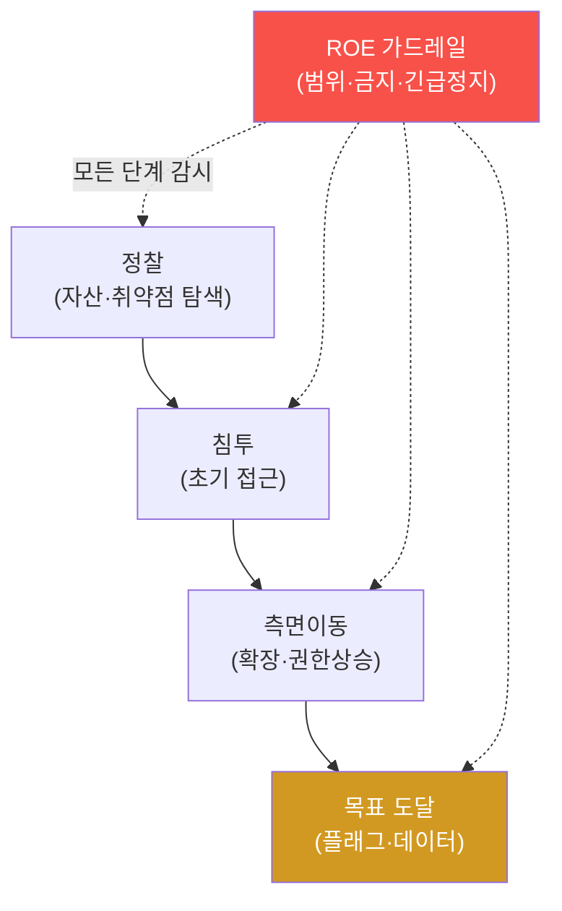

# autonomous-security W12 — 자율 Red Agent: 인가된 자율 공격 에이전트

> **본 주차의 한 줄 요약**
>
> W11의 방어(Blue)에 이어 W12는 **자율 공격(Red) 에이전트** — 정찰·침투·측면이동을 **자율 수행해 방어를 시험**하는
> 에이전트다(자동 침투 테스트·레드팀 시뮬레이션). bastion에서 이는 **`red-team-operator` 페르소나**(model_tier=attack,
> 필요 자산=attacker VM)와 **attack 계열 Skill**(`attack_simulate`·`password_attack`·`web_scan`)·**`attack_simulation`
> Playbook**으로 구체화된다. 목적은 공격이 아니라 **방어 검증** — 자율 Red가 조직의 취약점을 방어자보다 먼저 찾아,
> 뚫리기 전에 고치게 한다. 파이프라인은 킬체인을 따른다: ① **정찰(recon)** — 대상 자산·서비스·취약점을 자율 탐색,
> ② **침투(exploit)** — 발견한 취약점으로 초기 접근, ③ **측면이동(lateral)** — 내부 확장·권한 상승, ④ **목표
> (objective)** — 지정된 목표 도달(플래그·데이터). 각 단계에서 에이전트는 ReAct(W02)로 Skill을 쓰고, Playbook(W05)으로
> 기법을 적용하며, 경험(W09)으로 개선한다. **그러나 Red Agent는 방어 Agent보다 훨씬 위험하다** — 실제 시스템을
> 공격하므로. 그래서 **인가(authorization)와 교전 규칙(ROE)**이 절대적이다: 범위(scope, 인가된 자산만)·금지 행동
> (파괴·유출·서비스 중단 금지)·비가역 행동 승인·긴급 정지(kill switch). 실습에서는 Red 킬체인을 구성하고(마커
> `RED_PIPELINE`), 범위 내에서 실행하며(마커 `KILLCHAIN_EXECUTED`), ROE 가드레일을 강제한다(마커 `ROE_ENFORCED`).
> W01의 가드레일이 여기서 **가장 엄격**하게 적용된다 — 경계를 벗어나면 재앙이다.

---

## 학습 목표

본 주차 종료 시 학생은 다음 5가지를 **본인 손으로** 할 수 있어야 한다.

1. 자율 Red Agent 킬체인 파이프라인(정찰·침투·측면이동·목표)을 설명한다(마커 `RED_PIPELINE`).
2. 범위 내에서 **자율 킬체인**을 수행한다(마커 `KILLCHAIN_EXECUTED`).
3. **인가·ROE 가드레일**을 강제한다(마커 `ROE_ENFORCED`).
4. Red Agent가 왜 Blue보다 더 위험한지 설명한다.
5. 인가된 자율 공격의 방어 검증 가치를 종합한다(마커 `Assessment`).

> **이 주차의 시선** — 자율 공격으로 방어를 시험하되, 인가·범위·ROE로 절대 경계를 지킨다. bastion에서 Red는
> `red-team-operator` 페르소나로, attacker VM 범위에서만 동작한다.

---

## 0. 용어 해설 (Red Agent)

| 용어 | 영문 | 뜻 | 비유 |
|------|------|----|------|
| **Red Agent** | Red Agent | 자율 공격으로 방어를 시험하는 에이전트 | 모의 침입자 |
| **킬체인** | Kill Chain | 정찰→침투→측면이동→목표의 공격 단계 | 침투 경로 |
| **ROE** | Rules of Engagement | 교전 규칙(범위·금지·승인·정지) | 작전 규칙 |
| **범위** | Scope | 인가된 공격 대상 목록 | 허가 구역 |
| **PoC** | Proof of Concept | 악용 없이 취약점만 증명 | 증거 사진 |
| **긴급 정지** | Kill Switch | 즉시 전면 중단 | 비상 정지 버튼 |
| **red-team-operator** | — | bastion의 공격 페르소나(model_tier=attack) | 공격 요원 |

> **헷갈리기 쉬운 한 쌍 — 인가된 범위 내 vs 범위 밖.** *범위 내*는 합법적 방어 검증이고, *범위 밖*은 무단 공격=범죄다.
> 경계가 모든 것을 가른다. bastion의 red-team-operator는 attacker VM(인가 자산)이 있을 때만 팀에 포함되고, 그
> 범위로만 작용한다.

---

## 0.5 신입생 친화 핵심 개념

### 0.5.1 Red 킬체인 파이프라인

정찰→침투→측면이동→목표의 모든 단계를 **ROE 가드레일이 감시**한다 — 범위 밖이면 즉시 중단(하드 스톱).

### 0.5.2 자율 공격의 방어 검증 가치

자율 Red는 방어자보다 **먼저·빠르게·지속적으로** 취약점을 찾는다. 사람 레드팀은 가끔·비싸지만, 자율 Red는 24/7·저비용
으로 방어를 시험한다. 찾은 취약점을 뚫리기 전에 고쳐(Purple, W15) 방어를 강하게 한다 — **공격을 통한 방어 강화**가
목적이다.

### 0.5.3 왜 Red가 더 위험한가

Blue는 자기 시스템을 방어(실수해도 자기 손해)하지만, Red는 실제 시스템을 공격한다.

- **범위 이탈**: 인가 안 된 시스템 공격 = 범죄.
- **부작용**: 익스플로잇이 시스템을 손상·중단.
- **통제 상실**: 자율 공격이 폭주하면 피해 확산.

그래서 Red Agent의 가드레일은 Blue보다 훨씬 엄격해야 한다.

### 0.5.4 인가·ROE — 절대 경계

- **범위(scope)**: 인가된 자산 목록만. 범위 밖은 어떤 경우에도 금지(하드 스톱).
- **금지 행동**: 데이터 파괴·유출·서비스 중단(DoS) 금지. 증명만(PoC), 악용 금지.
- **비가역 승인**: 되돌릴 수 없는 행동은 사람 승인(bastion `_assess_risk`→approval).
- **긴급 정지(kill switch)**: 언제든 즉시 전면 중단.
- **감사 로그(W06)**: 모든 공격 행동을 append-only 해시체인에 기록.

이 경계가 자율 Red를 합법적 방어 도구로 만든다. 경계 없는 자율 공격은 무기다.

### 0.5.5 el34/bastion 맥락

el34는 인가된 훈련 인프라라 자율 Red 실습에 적합하다. bastion에서 Red는 `red-team-operator` 페르소나로 attacker VM
범위에서 attack 계열 Skill·`attack_simulation` Playbook을 쓴다. 이번 실습은 **Red 킬체인·범위 내 실행·ROE 강제
로직**을 결정론 시뮬로 익힌다. 실제 공격은 인가된 범위에서만.

---

## 1. 자율 공격 상세 — 킬체인·범위 실행·ROE

### 1.1 Red 킬체인 파이프라인 (RED_PIPELINE)

- **한 줄 정의**: 정찰·침투·측면이동·목표를 하나의 자율 공격 흐름으로 구성한다.
- **왜 중요한가**: 킬체인 단계가 명확해야 어디까지 진행했고 어디서 막혔는지 추적된다.
- **bastion에서 어떻게**: red-team-operator가 recon Skill→attack_simulate→lateral→objective로 구성하면 `RED_PIPELINE`.
- **한계/주의**: 모든 단계에 ROE 가드레일이 걸려 있어야 한다.

### 1.2 범위 내 킬체인 실행 (KILLCHAIN_EXECUTED)

- **한 줄 정의**: 인가된 범위(attacker VM·지정 대상)에서만 킬체인을 실행한다.
- **핵심**: 범위 내 자산만 대상, PoC 수준, 비가역 행동 승인.
- **판정**: 범위를 지킨 킬체인 실행이 이뤄지면 `KILLCHAIN_EXECUTED`.

### 1.3 ROE 가드레일 강제 (ROE_ENFORCED)

- **한 줄 정의**: 범위·금지 행동·긴급 정지·감사를 강제한다.
- **핵심**: 범위 밖 하드 스톱, 파괴·유출 금지, kill switch, 해시체인 감사.
- **판정**: ROE가 강제되면(범위 이탈 차단 등) `ROE_ENFORCED`.

---

## 2. 실습 안내 (총 5 미션)

실행 위치는 el34 **호스트**(`ssh ccc@{{TARGET_IP}}`, 비밀번호 `1`), 참고 GPU는 Ollama
(`http://211.170.162.139:10934`, gemma3:4b)다. 각 미션의 마지막 줄 마커가 채점 기준이다. 실제 공격은 인가된 범위에서만.

### 미션 1 — GPU 헬스체크 → `GEN_OK`

> **왜 하는가?** Red 에이전트 LLM 도달·응답 확인.
> **무엇을 아는가?** Ollama 응답 형식·도달성.
> **결과 해석** — 정상 `GEN_OK` / 비정상 `GEN_EMPTY`·연결 오류.
> **실전 활용** — 종합 소견 작성에 사용.

### 미션 2 — Red 킬체인 파이프라인 → `RED_PIPELINE`

> **왜 하는가?** 자율 공격을 킬체인으로 구조화한다.
> **무엇을 아는가?** 정찰→침투→측면이동→목표 단계.
> **결과 해석** — 정상: 파이프라인 + `RED_PIPELINE`.
> **실전 활용** — 자동 침투 테스트 설계.

### 미션 3 — 범위 내 킬체인 실행 → `KILLCHAIN_EXECUTED`

> **왜 하는가?** 인가된 범위에서만 공격을 실행한다.
> **무엇을 아는가?** 범위 내 자산·PoC·비가역 승인.
> **결과 해석** — 정상: 범위 내 실행 + `KILLCHAIN_EXECUTED`.
> **실전 활용** — 방어 검증(뚫기 전에 고치기).

### 미션 4 — ROE 가드레일 강제 → `ROE_ENFORCED`

> **왜 하는가?** 경계 이탈·통제 상실을 막는다.
> **무엇을 아는가?** 범위 하드 스톱·금지 행동·긴급 정지·감사.
> **결과 해석** — 정상: ROE 강제 + `ROE_ENFORCED`.
> **실전 활용** — 자율 Red의 합법성·안전 경계.

### 미션 5 — 종합 소견 → `Assessment`

> **왜 하는가?** 킬체인·범위 실행·ROE와 "경계가 합법성을 가른다"를 소견으로 묶는다.
> **무엇을 아는가?** GPU에 요약시키되 첫 줄을 `Assessment`로 강제.
> **결과 해석** — 정상: `Assessment` 포함. 없으면 `[형식 미준수 — 재실행]`.
> **실전 활용** — 자율 Red 운영 개요.

---

## 2.5 과제 (제출물)

- **A. Red 킬체인 파이프라인 실증 (필수, 40점)** — `RED_PIPELINE` 단계를 직접 수행해 실제 명령·출력(또는 아티팩트 분석 결과)을 캡처하고, 무엇을 근거로 판정했는지 서술한다.
- **B. 범위 내 킬체인 실행 분석 (필수, 30점)** — `KILLCHAIN_EXECUTED` 단계를 직접 수행해 실제 명령·출력(또는 아티팩트 분석 결과)을 캡처하고, 무엇을 근거로 판정했는지 서술한다.
- **C. ROE 가드레일 강제 방어 설계 (필수, 30점)** — `ROE_ENFORCED` 단계를 직접 수행해 실제 명령·출력(또는 아티팩트 분석 결과)을 캡처하고, 무엇을 근거로 판정했는지 서술한다.

## 2.6 평가 기준

| 항목 | 미흡(0) | 보통 | 우수 |
|------|---------|------|------|
| 탐지/실증(RED_PIPELINE) | 미수행 | 마커 도출 | 근거·해석·재현까지 |
| 분석(KILLCHAIN_EXECUTED) | 미수행 | 마커 도출 | 근거·해석·재현까지 |
| 방어(ROE_ENFORCED) | 미수행 | 마커 도출 | 근거·해석·재현까지 |

## 2.7 핵심 정리 (1줄씩)

- 이번 주 주제: **자율 Red Agent: 인가된 자율 공격 에이전트**.
- **Red 킬체인 파이프라인**(`RED_PIPELINE`): 정찰·침투·측면이동·목표를 하나의 자율 공격 흐름으로 구성한다.
- **범위 내 킬체인 실행**(`KILLCHAIN_EXECUTED`): 인가된 범위(attacker VM·지정 대상)에서만 킬체인을 실행한다.
- **ROE 가드레일 강제**(`ROE_ENFORCED`): 범위·금지 행동·긴급 정지·감사를 강제한다.
- 공격을 이해한 만큼 **방어의 우선순위**가 분명해진다 — 탐지 근거와 완화를 함께 익힌다.

---

## 3. 흔한 오해·블루팀 노트

- **"Red도 Blue처럼 자율이면 된다."** — Red는 훨씬 위험하다. 가드레일이 최엄격해야 한다.
- **"범위는 유연하게 잡는다."** — 범위 밖은 절대 금지(범죄)다. 하드 스톱.
- **"증명하려면 악용도 필요하다."** — PoC만, 파괴·유출은 금지다. ROE.
- **"긴급 정지는 형식이다."** — 통제 상실 시 kill switch가 유일한 안전망이다.
- **관제(Blue) 관점** — 자율 Red가 (1) 인가된 범위 내에서만, (2) ROE(금지·비가역 승인·긴급 정지)를 지키며, (3) 모든
  행동을 해시체인 감사에 남기는지 점검한다. Red의 경계가 합법성을 가른다.

---

## 4. 다음 주차 (W13) 예고 — 분산 지식 아키텍처

W12가 "자율 공격"이었다면, W13은 **분산 지식 아키텍처**를 다룬다. 여러 에이전트·팀이 Knowledge Graph·Experience를
공유·동기화하는 분산 구조와, 오염 없이 집단 학습하는 방법을 익힌다.
