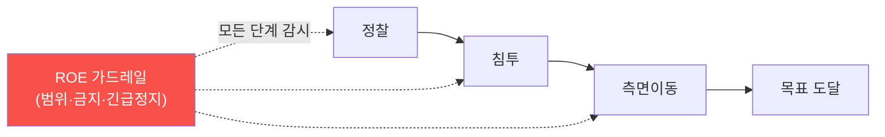

# autonomous-security W12 — 자율 Red Agent: 인가된 자율 공격 에이전트

> **본 주차의 한 줄 요약**
>
> W11의 방어(Blue)에 이어 W12는 **자율 공격(Red) 에이전트** — 정찰·침투·측면이동을 **자율 수행해 방어를 시험**하는
> 에이전트다(자동 침투 테스트·레드팀 시뮬레이션). 목적은 공격이 아니라 **방어 검증** — 자율 Red가 조직의 취약점을
> 방어자보다 먼저 찾아, 뚫리기 전에 고치게 한다. 파이프라인은 킬체인을 따른다: ① **정찰(recon)** — 대상 자산·
> 서비스·취약점을 자율 탐색, ② **침투(exploit)** — 발견한 취약점으로 초기 접근, ③ **측면이동(lateral)** — 내부
> 확장·권한 상승, ④ **목표(objective)** — 지정된 목표 도달(플래그·데이터). 각 단계에서 에이전트는 ReAct(W02)로
> 도구를 쓰고, 플레이북(W05)으로 공격 기법을 적용하며, 경험(W09)으로 개선한다. **그러나 Red Agent는 방어 Agent
> 보다 훨씬 위험하다** — 실제 시스템을 공격하므로. 그래서 **인가(authorization)와 교전 규칙(ROE, Rules of
> Engagement)** 이 절대적이다: **범위(scope)** — 인가된 자산만(범위 밖은 절대 금지), **금지 행동** — 파괴·데이터
> 유출·서비스 중단 금지, **비가역 행동 승인**, **긴급 정지(kill switch)**. 자율 Red의 가장 위험한 실패는 **범위를
> 벗어나거나**(무단 시스템 공격=범죄) **통제를 잃는** 것이다. 그래서 W01의 가드레일이 여기서 **가장 엄격**하게
> 적용된다. 인가된 범위 안에서 자율 Red는 방어를 강하게 하지만, 경계를 벗어나면 재앙이다.
>
> **한 줄 결론**: 자율 Red Agent는 **정찰→침투→측면이동→목표** 킬체인을 자율 수행해 방어를 시험한다. Blue보다
> 훨씬 위험하므로 **인가·범위·ROE·긴급 정지**가 절대적 — 경계를 벗어나면 재앙이다.

---

## 학습 목표

본 주차 종료 시 학생은 다음 5가지를 **본인 손으로** 할 수 있어야 한다.

1. 자율 Red Agent **킬체인 파이프라인**을 설명한다(RED_PIPELINE).
2. 범위 내 **자율 킬체인**을 수행한다(KILLCHAIN_EXECUTED).
3. **인가·ROE 가드레일**을 강제한다(ROE_ENFORCED).
4. Red Agent가 왜 더 위험한지 설명한다.
5. 인가된 자율 공격의 방어 검증 가치를 설명한다.

> **이 주차의 시선** — 자율 공격으로 방어를 시험하되, 인가·범위·ROE로 절대 경계를 지킨다.

---

## 0. 용어 해설 (Red Agent)

| 용어 | 영문 | 뜻 | 비유 |
|------|------|----|------|
| **Red Agent** | — | 자율 공격자 | 모의 침입자 |
| **킬체인** | Kill Chain | 공격 단계 | 침투 경로 |
| **ROE** | Rules of Engagement | 교전 규칙 | 작전 규칙 |
| **범위** | Scope | 인가 대상 | 허가 구역 |
| **긴급 정지** | Kill Switch | 즉시 중단 | 비상 정지 |

> **헷갈리기 쉬운 한 쌍** — *인가된 범위 내* 는 "합법적 방어 검증", *범위 밖* 은 "무단 공격=범죄"다. 경계가
> 모든 것을 가른다.

---

## 0.5 신입생 친화 핵심 개념

### 0.5.1 Red 킬체인 파이프라인

정찰→침투→측면이동→목표. **모든 단계를 ROE 가드레일이 감시**한다 — 범위 밖이면 즉시 중단.

### 0.5.2 자율 공격의 방어 검증 가치

자율 Red는 **방어자보다 먼저·빠르게·지속적으로** 취약점을 찾는다. 사람 레드팀은 가끔·비싸지만, 자율 Red는 24/7·
저비용으로 방어를 시험한다. 찾은 취약점을 뚫리기 전에 고쳐(Purple, W15) 방어를 강하게. **공격을 통한 방어 강화**가
목적이다.

### 0.5.3 왜 Red가 더 위험한가

Blue는 자기 시스템을 방어(실수해도 자기 손해)하지만, Red는 **실제 시스템을 공격**한다:
- **범위 이탈**: 인가 안 된 시스템 공격 = **범죄**.
- **부작용**: 익스플로잇이 시스템을 **손상·중단**.
- **통제 상실**: 자율 공격이 폭주하면 피해 확산.
그래서 Red Agent의 가드레일은 Blue보다 **훨씬 엄격**해야 한다.

### 0.5.4 인가·ROE — 절대 경계

- **범위(scope)**: 인가된 자산 목록만. 범위 밖은 **어떤 경우에도 금지**(하드 스톱).
- **금지 행동**: 데이터 파괴·유출·서비스 중단(DoS) 금지. 증명만(PoC), 악용 금지.
- **비가역 승인**: 되돌릴 수 없는 행동은 사람 승인.
- **긴급 정지(kill switch)**: 언제든 즉시 전면 중단.
- **감사 로그**(W06): 모든 공격 행동 기록.
이 경계가 자율 Red를 **합법적 방어 도구**로 만든다. 경계 없는 자율 공격은 무기다.

### 0.5.5 el34 맥락

el34는 인가된 훈련 인프라라 자율 Red 실습에 적합하다. 본 실습은 **Red 킬체인·범위 내 실행·ROE 강제 로직**을
결정론 시뮬로 익힌다. 실제 공격은 인가된 범위에서만.

---

## 1. 실습 안내 (5 미션)

실행 위치 el34 **호스트**(`ssh ccc@{{TARGET_IP}}`), GPU `http://211.170.162.139:10934`.

### STEP 1 — GPU 헬스체크 → GEN_OK
### STEP 2 — Red 킬체인 파이프라인 → RED_PIPELINE
### STEP 3 — 범위 내 킬체인 실행 → KILLCHAIN_EXECUTED
### STEP 4 — ROE 가드레일 강제 → ROE_ENFORCED
### STEP 5 — 종합 → Assessment

---

## 2. 흔한 오해·관제자 노트

- **"Red는 Blue처럼 자율"** — Red가 훨씬 위험. 가드레일 최엄격.
- **"범위는 유연하게"** — 범위 밖은 절대 금지(범죄). 하드 스톱.
- **"증명하려면 악용도"** — PoC만, 파괴·유출 금지. ROE.
- **관제 관점** — 자율 Red가 인가된 범위 내에서만, ROE(금지 행동·비가역 승인·긴급 정지)를 지키며, 모든 행동을
  로그에 남기는지 점검한다. Red의 경계가 합법성을 가른다.

---

## 3. 다음 주차 (W13) 예고 — 분산 지식 아키텍처

W12가 "자율 공격"이었다면, W13은 **분산 지식 아키텍처** — 여러 에이전트가 지식·경험을 공유·동기화하는 분산
구조(여러 bastion·팀 간 지식 공유)를 다룬다.
