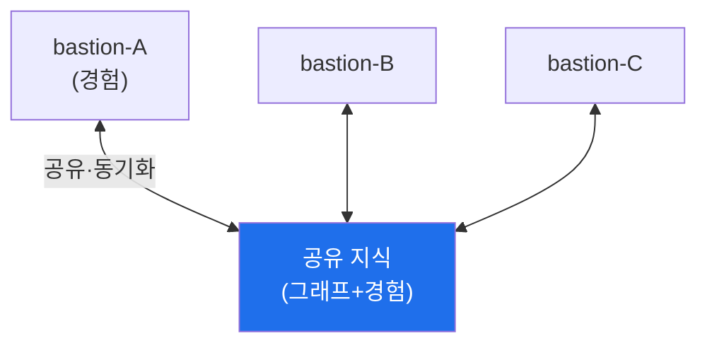

# autonomous-security W13 — 분산 지식 아키텍처: 다중 에이전트 지식 공유·동기화

> **본 주차의 한 줄 요약**
>
> 하나의 에이전트가 아니라 **여러 에이전트·여러 bastion**이 협력하면, 각자의 지식·경험을 **공유·동기화**하는
> 구조가 필요하다 — 이것이 **분산 지식 아키텍처**다. 한 조직에 여러 자율 에이전트(방어·공격·다른 부서)가, 여러
> 사이트에 여러 bastion이 있을 때, 각자 배운 것을 **공유**하면 **집단 학습(collective learning)** 이 일어난다:
> 한 에이전트가 새 공격 기법을 발견하면(경험 DB) 전체가 즉시 방어하고, 한 사이트의 위협 인텔이 모든 사이트를
> 보호한다. 핵심 요소: ① **지식 공유(sharing)** — 지식 그래프(자산·기법)와 경험 DB(플레이북·교훈)를 노드 간
> 공유, ② **동기화·병합(sync/merge)** — 여러 노드가 지식을 갱신하면 **충돌**이 생긴다(같은 것에 다른 정보).
> 병합 규칙(최신 우선·신뢰도 우선·합의)으로 일관성 유지, ③ **집단 학습** — 한 노드의 교훈이 전체 지식을 높여,
> 개별 학습보다 훨씬 빠르게 성장. 하지만 분산엔 **위험**도 있다: **오염된 지식 전파**(한 노드가 잘못/악의적 지식을
> 퍼뜨리면 전체 오염 — ai-security의 데이터 중독과 연결), **신뢰**(어느 노드의 지식을 믿나), **일관성**(동기화
> 지연). 그래서 지식 공유엔 **출처 검증·신뢰도·무결성(W06 감사)** 이 필요하다. 분산 지식은 집단 지능을 주지만,
> 오염 방지와 신뢰 관리가 함께 가야 한다. 대규모 자율 보안(여러 팀·사이트)의 기반 아키텍처다.
>
> **한 줄 결론**: 분산 지식 아키텍처는 여러 에이전트·bastion이 지식·경험을 **공유·동기화**해 **집단 학습**한다.
> 병합 규칙으로 일관성을, 출처 검증·신뢰도로 오염을 막는다.

---

## 학습 목표

본 주차 종료 시 학생은 다음 5가지를 **본인 손으로** 할 수 있어야 한다.

1. **분산 지식 아키텍처**와 집단 학습을 설명한다.
2. 노드 간 지식 공유를 **매핑**한다(DISTRIBUTED_MAPPED).
3. 지식 **동기화·병합**(충돌 해결)을 수행한다(KNOWLEDGE_SYNCED).
4. **집단 학습**의 이득을 보인다(COLLECTIVE_LEARNING).
5. 오염된 지식 전파의 위험과 방어를 설명한다.

> **이 주차의 시선** — 여러 에이전트가 지식을 공유해 집단으로 성장하되, 오염을 막는다.

---

## 0. 용어 해설 (분산 지식)

| 용어 | 영문 | 뜻 | 비유 |
|------|------|----|------|
| **분산 지식** | Distributed Knowledge | 노드 간 공유 지식 | 공동 지식 |
| **동기화** | Sync | 지식 일치시킴 | 맞추기 |
| **병합** | Merge | 충돌 해결 | 통합 |
| **집단 학습** | Collective Learning | 함께 성장 | 집단 지능 |
| **지식 오염** | Knowledge Poisoning | 잘못된 지식 전파 | 오염 |

> **헷갈리기 쉬운 한 쌍** — *개별 학습* 은 "각자 배움(느림)", *집단 학습* 은 "공유로 함께 배움(빠름)"이다. 단
> 오염도 함께 퍼진다.

---

## 0.5 신입생 친화 핵심 개념

### 0.5.1 분산 지식 노드

여러 bastion이 공유 지식을 통해 서로의 지식·경험을 주고받는다. 한 곳의 발견이 모두에게.

### 0.5.2 집단 학습 — 함께 빠르게

한 에이전트가 새 공격 기법·성공 플레이북을 배우면, **공유를 통해 전체가 즉시** 그 지식을 얻는다. 100개 에이전트가
각자 배우는 것보다, 하나가 배워 100개가 공유하는 게 훨씬 빠르다. 위협 인텔·플레이북·지식 그래프를 공유해 **집단
지능**을 만든다.

### 0.5.3 동기화·병합 — 충돌 해결

여러 노드가 같은 지식을 다르게 갱신하면 **충돌**이 난다(노드A: IP 악성, 노드B: 정상). 병합 규칙:
- **최신 우선**: 더 최근 정보.
- **신뢰도 우선**: 더 믿을 만한 출처.
- **합의**: 다수 노드 일치(W01 관제의 2/3 합의처럼).
일관된 공유 지식을 유지한다.

### 0.5.4 지식 오염 — 분산의 위험

분산의 어두운 면: 한 노드가 **잘못되거나 악의적인 지식**을 퍼뜨리면 **전체가 오염**된다(ai-security 데이터 중독의
분산판). 예: 공격자가 한 노드를 장악해 "이 악성 IP는 정상"이라는 거짓 지식을 주입→전체가 그 IP를 신뢰. 방어:
- **출처 검증**: 지식의 출처·신뢰도 확인.
- **무결성**(W06): 지식 변경을 변조 불가 로그에.
- **이상 탐지**: 갑작스런 지식 변화·모순 탐지.
집단 학습의 힘엔 오염 방지가 따라야 한다.

### 0.5.5 el34 맥락

여러 bastion·에이전트의 분산 지식은 대규모 배포에서 중요하다. 본 실습은 **지식 공유·동기화 병합·집단 학습·오염
방어 로직**을 결정론 시뮬로 익힌다.

---

## 1. 실습 안내 (5 미션)

실행 위치 el34 **호스트**(`ssh ccc@{{TARGET_IP}}`), GPU `http://211.170.162.139:10934`.

### STEP 1 — GPU 헬스체크 → GEN_OK
### STEP 2 — 분산 지식 노드 매핑 → DISTRIBUTED_MAPPED
### STEP 3 — 지식 동기화·병합 → KNOWLEDGE_SYNCED
### STEP 4 — 집단 학습 → COLLECTIVE_LEARNING
### STEP 5 — 종합 → Assessment

---

## 2. 흔한 오해·관제자 노트

- **"에이전트는 독립"** — 공유로 집단 학습. 함께 빠르게.
- **"공유하면 다 좋다"** — 오염도 퍼진다. 출처 검증·무결성.
- **"충돌은 무시"** — 병합 규칙 필요. 일관성.
- **관제 관점** — 분산 지식이 병합 규칙으로 일관되고, 출처 검증·무결성으로 오염을 막고, 집단 학습으로 성장하는지
  점검한다. 집단 지능과 오염 방지의 균형.

---

## 3. 다음 주차 (W14) 예고 — RL Steering과 정책 최적화

W13이 "분산 지식"이었다면, W14는 **RL Steering과 정책 최적화** — 강화학습으로 에이전트 정책을 더 정교하게
조종·최적화하는(W07 심화) 기법을 다룬다.
