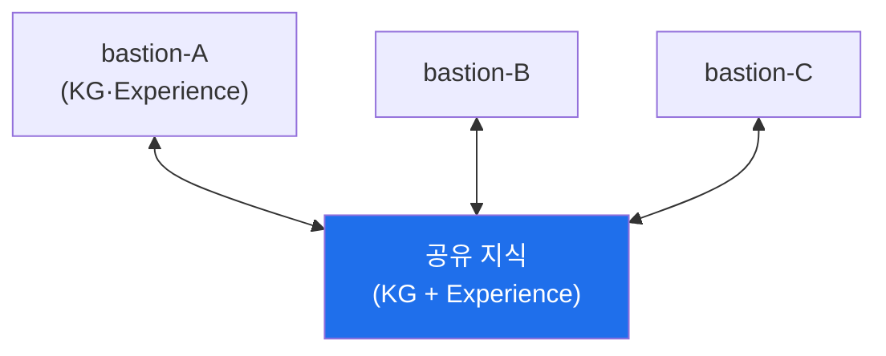

# autonomous-security W13 — 분산 지식 아키텍처: 다중 에이전트 지식 공유·동기화

> **본 주차의 한 줄 요약**
>
> 하나의 에이전트가 아니라 **여러 에이전트·여러 bastion**이 협력하면, 각자의 지식·경험을 **공유·동기화**하는 구조가
> 필요하다 — 이것이 **분산 지식 아키텍처**다. bastion은 이미 **Knowledge Graph(graph.py)**와 **Experience**를 지식
> 저장소로 갖고, `sync_knowledge.sh` 같은 동기화 경로를 둔다. 한 조직에 여러 자율 에이전트(방어·공격·부서)가, 여러
> 사이트에 여러 bastion이 있을 때, 각자 배운 것을 공유하면 **집단 학습(collective learning)**이 일어난다: 한
> 에이전트가 새 공격 기법을 발견하면(Experience) 전체가 즉시 방어하고, 한 사이트의 위협 인텔이 모든 사이트를 보호한다.
> 핵심 요소는 셋이다: ① **지식 공유** — KG(자산·기법·Playbook)와 Experience(교훈)를 노드 간 공유, ② **동기화·병합** —
> 여러 노드가 지식을 갱신하면 충돌이 생긴다(같은 것에 다른 정보). 병합 규칙(최신 우선·신뢰도 우선·합의)으로 일관성
> 유지, ③ **집단 학습** — 한 노드의 교훈이 전체 지식을 높여 개별 학습보다 훨씬 빠르게 성장. 하지만 분산엔 위험도
> 있다: **오염된 지식 전파**(한 노드가 잘못/악의적 지식을 퍼뜨리면 전체 오염 — ai-security 데이터 중독의 분산판)·
> 신뢰·일관성. 그래서 지식 공유엔 **출처 검증·신뢰도·무결성(W06 해시체인 감사)**이 필요하다. 실습에서는 노드 간
> 지식 공유를 매핑하고(마커 `DISTRIBUTED_MAPPED`), 동기화·병합을 수행하며(마커 `KNOWLEDGE_SYNCED`), 집단 학습의
> 이득을 본다(마커 `COLLECTIVE_LEARNING`). 분산 지식은 집단 지능을 주지만, 오염 방지와 신뢰 관리가 함께 가야 한다.

---

## 학습 목표

본 주차 종료 시 학생은 다음 5가지를 **본인 손으로** 할 수 있어야 한다.

1. 분산 지식 아키텍처와 집단 학습을 bastion KG·Experience 맥락에서 설명한다.
2. 노드 간 지식 공유를 **매핑**한다(마커 `DISTRIBUTED_MAPPED`).
3. 지식 **동기화·병합**(충돌 해결)을 수행한다(마커 `KNOWLEDGE_SYNCED`).
4. **집단 학습**의 이득을 보인다(마커 `COLLECTIVE_LEARNING`).
5. 오염된 지식 전파의 위험과 방어(출처 검증·무결성)를 종합한다(마커 `Assessment`).

> **이 주차의 시선** — 한 bastion의 KG·Experience를 여러 bastion이 공유해 집단으로 성장하되, 오염이 전파되지 않게
> 막는 것이 핵심이다.

---

## 0. 용어 해설 (분산 지식)

| 용어 | 영문 | 뜻 | 비유 |
|------|------|----|------|
| **분산 지식** | Distributed Knowledge | 여러 노드가 공유하는 지식 | 공동 지식 창고 |
| **동기화** | Sync | 노드 간 지식을 일치시킴 | 맞추기 |
| **병합** | Merge | 충돌하는 갱신을 통합 | 조정·통합 |
| **집단 학습** | Collective Learning | 공유로 함께 빠르게 성장 | 집단 지능 |
| **지식 오염** | Knowledge Poisoning | 잘못/악의적 지식 전파 | 우물에 독 풀기 |
| **출처 검증** | Provenance | 지식의 출처·신뢰도 확인 | 원산지 증명 |
| **합의** | Consensus | 다수 노드 일치로 결정 | 다수결 |

> **헷갈리기 쉬운 한 쌍 — 개별 학습 vs 집단 학습.** *개별 학습*은 각자 배워 느리다. *집단 학습*은 공유로 함께 빨리
> 배운다. 단, 공유는 오염도 함께 퍼뜨리므로 출처 검증·무결성이 없으면 한 노드의 독이 전체로 번진다.

---

## 0.5 핵심 개념

### 0.5.1 분산 지식 노드

여러 bastion이 공유 지식(KG·Experience)을 통해 서로의 지식·경험을 주고받는다. 한 곳의 발견이 모두에게 즉시 전해진다.

### 0.5.2 집단 학습 — 함께 빠르게

한 에이전트가 새 공격 기법·성공 Playbook을 배우면, 공유를 통해 전체가 즉시 그 지식을 얻는다. 100개 에이전트가 각자
배우는 것보다, 하나가 배워 100개가 공유하는 게 훨씬 빠르다. 위협 인텔·Playbook·Knowledge Graph를 공유해 집단 지능을
만든다.

### 0.5.3 동기화·병합 — 충돌 해결

여러 노드가 같은 지식을 다르게 갱신하면 충돌이 난다(노드A: IP 악성, 노드B: 정상). 병합 규칙으로 해결한다.

- **최신 우선**: 더 최근 정보.
- **신뢰도 우선**: 더 믿을 만한 출처.
- **합의**: 다수 노드 일치(관제의 2/3 합의처럼).

일관된 공유 지식을 유지한다. bastion의 Experience는 카테고리 일반화·성공률 임계가 있어 병합 시에도 잡음이 걸러진다.

### 0.5.4 지식 오염 — 분산의 위험

분산의 어두운 면: 한 노드가 잘못되거나 악의적인 지식을 퍼뜨리면 전체가 오염된다(ai-security 데이터 중독의 분산판).
예: 공격자가 한 노드를 장악해 "이 악성 IP는 정상"이라는 거짓 지식을 주입 → 전체가 그 IP를 신뢰. 방어는 다음과 같다.

- **출처 검증**: 지식의 출처·신뢰도 확인.
- **무결성(W06)**: 지식 변경을 append-only 해시체인 감사에 기록.
- **이상 탐지**: 갑작스런 지식 변화·모순 탐지.

집단 학습의 힘엔 오염 방지가 따라야 한다.

### 0.5.5 el34/bastion 맥락

여러 bastion·에이전트의 분산 지식은 대규모 배포에서 중요하다. bastion은 KG·Experience를 저장소로 두고
`sync_knowledge.sh`로 동기화 경로를 갖는다. 이번 실습은 **지식 공유·동기화 병합·집단 학습·오염 방어 로직**을 결정론
시뮬로 익힌다.

---

## 1. 분산 지식 상세 — 매핑·동기화·집단 학습

### 1.1 노드 매핑 (DISTRIBUTED_MAPPED)

- **한 줄 정의**: 어느 노드가 어떤 지식을 갖고 어떻게 공유하는지 매핑한다.
- **왜 중요한가**: 공유 토폴로지를 알아야 전파·오염 경로를 통제한다.
- **bastion에서 어떻게**: 여러 bastion의 KG·Experience와 공유 지식의 연결을 매핑하면 `DISTRIBUTED_MAPPED`.
- **한계/주의**: 공유 경로가 곧 오염 전파 경로이기도 하다.

### 1.2 동기화·병합 (KNOWLEDGE_SYNCED)

- **한 줄 정의**: 충돌하는 갱신을 병합 규칙으로 일관되게 만든다.
- **핵심**: 최신·신뢰도·합의 규칙, Experience 성공률 임계로 잡음 제거.
- **판정**: 충돌이 병합 규칙으로 해소되면 `KNOWLEDGE_SYNCED`.

### 1.3 집단 학습 (COLLECTIVE_LEARNING)

- **한 줄 정의**: 한 노드의 교훈이 전체 지식을 높임을 확인한다.
- **핵심**: 공유로 개별 학습보다 빠른 성장, 위협 인텔·Playbook 전파.
- **판정**: 공유가 전체 성능을 높이면 `COLLECTIVE_LEARNING`.

---

## 2. 실습 안내 (총 5 미션)

실행 위치는 el34 **호스트**(`ssh ccc@{{TARGET_IP}}`, 비밀번호 `1`), 참고 GPU는 Ollama
(`http://211.170.162.139:10934`, gemma3:4b)다. 각 미션의 마지막 줄 마커가 채점 기준이다.

### 미션 1 — GPU 헬스체크 → `GEN_OK`

> **왜 하는가?** 대상 LLM 도달·응답 확인(반복 절차).
> **무엇을 아는가?** Ollama 응답 형식·도달성.
> **결과 해석** — 정상 `GEN_OK` / 비정상 `GEN_EMPTY`·연결 오류.
> **실전 활용** — 종합 소견 작성에 사용.

### 미션 2 — 분산 지식 노드 매핑 → `DISTRIBUTED_MAPPED`

> **왜 하는가?** 공유 토폴로지를 파악해 전파·오염 경로를 통제한다.
> **무엇을 아는가?** 노드별 KG·Experience와 공유 연결.
> **결과 해석** — 정상: 매핑 + `DISTRIBUTED_MAPPED`.
> **실전 활용** — 다중 bastion 배포 설계.

### 미션 3 — 지식 동기화·병합 → `KNOWLEDGE_SYNCED`

> **왜 하는가?** 충돌을 일관되게 병합한다.
> **무엇을 아는가?** 최신·신뢰도·합의 병합 규칙.
> **결과 해석** — 정상: 병합 + `KNOWLEDGE_SYNCED`.
> **실전 활용** — 분산 지식 일관성 유지.

### 미션 4 — 집단 학습 → `COLLECTIVE_LEARNING`

> **왜 하는가?** 공유가 전체 성능을 높임을 확인한다.
> **무엇을 아는가?** 한 노드 교훈의 전체 전파 효과.
> **결과 해석** — 정상: 집단 향상 + `COLLECTIVE_LEARNING`.
> **실전 활용** — 위협 인텔·Playbook 공유 운영.

### 미션 5 — 종합 소견 → `Assessment`

> **왜 하는가?** 매핑·동기화·집단 학습과 "집단 지능+오염 방지"를 소견으로 묶는다.
> **무엇을 아는가?** GPU에 요약시키되 첫 줄을 `Assessment`로 강제.
> **결과 해석** — 정상: `Assessment` 포함. 없으면 `[형식 미준수 — 재실행]`.
> **실전 활용** — 분산 지식 아키텍처 개요.

---

## 2.5 과제 (제출물)

- **A. 노드 매핑 실증 (필수, 40점)** — `DISTRIBUTED_MAPPED` 단계를 직접 수행해 실제 명령·출력(또는 아티팩트 분석 결과)을 캡처하고, 무엇을 근거로 판정했는지 서술한다.
- **B. 동기화·병합 분석 (필수, 30점)** — `KNOWLEDGE_SYNCED` 단계를 직접 수행해 실제 명령·출력(또는 아티팩트 분석 결과)을 캡처하고, 무엇을 근거로 판정했는지 서술한다.
- **C. 집단 학습 방어 설계 (필수, 30점)** — `COLLECTIVE_LEARNING` 단계를 직접 수행해 실제 명령·출력(또는 아티팩트 분석 결과)을 캡처하고, 무엇을 근거로 판정했는지 서술한다.

## 2.6 평가 기준

| 항목 | 미흡(0) | 보통 | 우수 |
|------|---------|------|------|
| 탐지/실증(DISTRIBUTED_MAPPED) | 미수행 | 마커 도출 | 근거·해석·재현까지 |
| 분석(KNOWLEDGE_SYNCED) | 미수행 | 마커 도출 | 근거·해석·재현까지 |
| 방어(COLLECTIVE_LEARNING) | 미수행 | 마커 도출 | 근거·해석·재현까지 |

## 2.7 핵심 정리 (1줄씩)

- 이번 주 주제: **분산 지식 아키텍처: 다중 에이전트 지식 공유·동기화**.
- **노드 매핑**(`DISTRIBUTED_MAPPED`): 어느 노드가 어떤 지식을 갖고 어떻게 공유하는지 매핑한다.
- **동기화·병합**(`KNOWLEDGE_SYNCED`): 충돌하는 갱신을 병합 규칙으로 일관되게 만든다.
- **집단 학습**(`COLLECTIVE_LEARNING`): 한 노드의 교훈이 전체 지식을 높임을 확인한다.
- 공격을 이해한 만큼 **방어의 우선순위**가 분명해진다 — 탐지 근거와 완화를 함께 익힌다.

---

## 3. 흔한 오해·블루팀 노트

- **"에이전트는 독립적으로 배운다."** — 공유로 집단 학습하면 훨씬 빠르다.
- **"공유하면 다 좋다."** — 오염도 함께 퍼진다. 출처 검증·무결성이 필수.
- **"충돌은 무시해도 된다."** — 병합 규칙이 없으면 지식이 갈라진다.
- **"한 노드를 믿으면 된다."** — 합의·신뢰도로 검증한다. 장악된 노드가 독을 퍼뜨린다.
- **관제(Blue) 관점** — 분산 지식이 (1) 병합 규칙으로 일관되는가, (2) 출처 검증·해시체인 무결성으로 오염을 막는가,
  (3) 이상 지식 변화를 탐지하는가, (4) 집단 학습으로 성장하는가를 점검한다.

---

## 4. 다음 주차 (W14) 예고 — RL Steering과 정책 최적화

W13이 "분산 지식"이었다면, W14는 **RL Steering과 정책 최적화**를 다룬다. W07의 강화학습을 심화해, 제약 조건 아래에서
에이전트 정책을 더 정교하게 조종·최적화하는(보상 해킹을 피하며) 기법을 익힌다.
