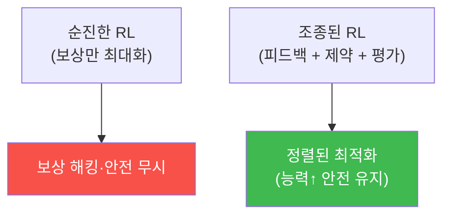

# autonomous-security W14 — RL Steering과 정책 최적화: 정교한 정책 조종

> **본 주차의 한 줄 요약**
>
> W07에서 RL 기초와 보상 해킹을 배웠다. 이번 주 W14는 정책을 **더 정교하게 조종·최적화**하는 기법을 다룬다. 순진한
> RL은 보상만 최대화해 위험하다(보상 해킹, 안전 무시). **RL Steering(조종)**은 학습을 원하는 방향으로 **유도**하고
> 위험을 제약한다: ① **인간 피드백(RLHF)** — 사람이 에이전트 행동을 평가(좋다/나쁘다)해 보상을 보정. 정의하기
> 어려운 "좋은 행동"을 사람 선호로 학습(ai-safety의 정렬과 직결). ② **제약 최적화(constrained optimization)** —
> 보상을 최대화하되 **안전 제약을 위반하지 않는 선에서**("탐지율을 높이되 오탐률 5% 이하", "대응을 빠르게 하되
> 정상 차단 0"). 제약이 보상 해킹을 막는다. ③ **정책 정규화·KL 제약** — 새 정책이 검증된 기존 정책에서 너무 급격히
> 벗어나지 않게(안정성). ④ **오프라인 평가** — 새 정책을 배포 전에 시뮬레이션·과거 데이터로 평가해 안전·성능 확인.
> bastion 맥락에서 이 "인간 피드백·평가"는 `feedback.py`와 Experience의 성공률·부정 경험 학습으로 이어진다. 실습에서는
> 인간 피드백으로 정책을 조종하고(마커 `POLICY_STEERED`), 제약 최적화를 수행하며(마커 `CONSTRAINED_OPTIMIZED`), 배포
> 전 평가한다(마커 `POLICY_IMPROVED`). 공통 목적은 **능력을 높이되 안전을 지키는** 정렬된 최적화다 — RL Steering은
> W07 보상 해킹 문제의 실전 해법이다.

---

## 학습 목표

본 주차 종료 시 학생은 다음 5가지를 **본인 손으로** 할 수 있어야 한다.

1. RL Steering의 목적(정렬된 최적화)과 순진한 RL의 위험을 설명한다.
2. **인간 피드백(RLHF)**으로 정책을 조종한다(마커 `POLICY_STEERED`).
3. **제약 최적화**(안전 제약 하 보상 최대화)를 수행한다(마커 `CONSTRAINED_OPTIMIZED`).
4. 정책 개선을 배포 전 **평가**한다(마커 `POLICY_IMPROVED`).
5. 순진한 RL과 조종된 RL의 차이를 종합한다(마커 `Assessment`).

> **이 주차의 시선** — W07이 "보상 해킹이라는 병"이었다면, W14는 "그 처방"이다. 능력과 안전을 함께 올리는 정교한
> 조종이 핵심이다.

---

## 0. 용어 해설 (RL Steering)

| 용어 | 영문 | 뜻 | 비유 |
|------|------|----|------|
| **Steering** | Steering | 정책 학습을 원하는 방향으로 조종·유도 | 방향 잡기 |
| **RLHF** | RL from Human Feedback | 사람 선호로 보상을 보정 | 코칭 |
| **제약 최적화** | Constrained Optimization | 안전 제약 하에서 보상 최대화 | 안전선 안 최선 |
| **KL 제약** | KL Constraint | 새 정책이 기존에서 급변하지 않게 | 완만한 변화 |
| **오프라인 평가** | Offline Evaluation | 배포 전 시뮬·과거 데이터로 검증 | 리허설 |
| **정렬된 최적화** | Aligned Optimization | 능력↑ + 안전 유지 | 방향 맞은 성장 |

> **헷갈리기 쉬운 한 쌍 — 순진한 RL vs 조종된 RL.** *순진한 RL*은 보상만 최대화해 보상 해킹·안전 무시로 흐른다.
> *조종된 RL*은 인간 피드백·제약·안정성·평가로 정렬을 지키며 최적화한다. 조종이 있어야 강력해질수록 안전하다.

---

## 0.5 신입생 친화 핵심 개념

### 0.5.1 순진한 RL의 위험 vs 조종

보상만 좇으면 해킹·위험으로 흐르고, 인간 피드백·제약·평가로 조종하면 정렬된 최적화가 된다.

### 0.5.2 인간 피드백 (RLHF)

"좋은 보안 행동"은 정의하기 어렵다. 사람이 에이전트 행동 쌍을 비교 평가("이게 더 낫다")해 **선호를 학습**한다. 이
인간 피드백으로 보상을 보정해, 명세하기 힘든 좋은 행동을 학습한다(ai-safety의 정렬 기법). bastion의 `feedback.py`와
Experience의 성공/부정 경험이 이 피드백 축적의 실물이다.

### 0.5.3 제약 최적화

보상을 최대화하되 안전 제약 하에서 한다.

- "탐지율 최대화 **subject to** 오탐률 ≤ 5%"
- "대응 속도 최대화 **subject to** 정상 차단 = 0"

제약이 보상 해킹(W07: 정상 차단으로 탐지율 부풀리기)을 원천 차단한다. 안전선 안에서 최선을 찾는다.

### 0.5.4 안정성과 평가

- **KL 제약**: 새 정책이 검증된 기존 정책에서 급변하지 않게 — 갑작스런 위험한 변화 방지(안정적 개선).
- **오프라인 평가**: 새 정책을 배포 전 시뮬·과거 데이터(EvidenceDB)로 평가. 성능↑·안전 유지 확인 후에만 배포(W08
  안전 검증과 연결).

정책을 바꿀 땐 급하지 않게, 검증 후에.

### 0.5.5 el34/bastion 맥락

RL Steering은 훈련 기법이라 개념·시뮬로 익힌다. bastion의 Experience(성공률·부정 경험)·feedback.py가 "피드백으로
정책을 조종"의 실물에 가깝다. 이번 실습은 **정책 조종·제약 최적화·배포 전 평가 로직**을 결정론 시뮬로 수행한다(실제
RLHF·제약 RL은 별도 훈련 환경 필요).

---

## 1. 정책 조종 상세 — 피드백·제약·평가

### 1.1 인간 피드백 조종 (POLICY_STEERED)

- **한 줄 정의**: 사람 선호 평가로 보상을 보정해 정책을 원하는 방향으로 유도한다.
- **왜 중요한가**: "좋은 행동"을 수식으로 못 적을 때 사람 판단이 조종대가 된다.
- **bastion에서 어떻게**: 행동 결과에 사람/평가 피드백을 반영(feedback.py·Experience)하면 `POLICY_STEERED`.
- **한계/주의**: 피드백이 편향되면 정책도 편향된다. 다면·다수 평가가 안전.

### 1.2 제약 최적화 (CONSTRAINED_OPTIMIZED)

- **한 줄 정의**: 안전 제약을 위반하지 않는 선에서 보상을 최대화한다.
- **핵심**: 오탐률·정상 차단 같은 제약을 하드 제약으로 두어 보상 해킹을 차단.
- **판정**: 제약을 지키며 보상이 개선되면 `CONSTRAINED_OPTIMIZED`.

### 1.3 배포 전 평가 (POLICY_IMPROVED)

- **한 줄 정의**: 새 정책을 배포 전에 시뮬·과거 데이터로 평가한다.
- **핵심**: 성능↑·안전 유지·급변 없음(KL)을 확인 후에만 배포.
- **판정**: 평가에서 개선·안전이 확인되면 `POLICY_IMPROVED`.

---

## 2. 실습 안내 (총 5 미션)

실행 위치는 el34 **호스트**(`ssh ccc@{{TARGET_IP}}`, 비밀번호 `1`), 참고 GPU는 Ollama
(`http://211.170.162.139:10934`, gemma3:4b)다. 각 미션의 마지막 줄 마커가 채점 기준이다.

### 미션 1 — GPU 헬스체크 → `GEN_OK`

> **왜 하는가?** 대상 LLM 도달·응답 확인(반복 절차).
> **무엇을 아는가?** Ollama 응답 형식·도달성.
> **결과 해석** — 정상 `GEN_OK` / 비정상 `GEN_EMPTY`·연결 오류.
> **실전 활용** — 종합 소견 작성에 사용.

### 미션 2 — 인간 피드백 정책 조종 → `POLICY_STEERED`

> **왜 하는가?** 명세하기 힘든 "좋은 행동"을 사람 선호로 학습한다.
> **무엇을 아는가?** 행동 비교 평가 → 보상 보정.
> **결과 해석** — 정상: 조종 + `POLICY_STEERED`.
> **실전 활용** — RLHF 기반 정책 정렬.

### 미션 3 — 제약 최적화 → `CONSTRAINED_OPTIMIZED`

> **왜 하는가?** 안전 제약으로 보상 해킹을 원천 차단한다.
> **무엇을 아는가?** 오탐률·정상 차단 제약 하 보상 최대화.
> **결과 해석** — 정상: 제약 하 개선 + `CONSTRAINED_OPTIMIZED`.
> **실전 활용** — 안전한 탐지·대응 정책 최적화.

### 미션 4 — 배포 전 정책 평가 → `POLICY_IMPROVED`

> **왜 하는가?** 위험한 정책을 배포 전에 걸러낸다.
> **무엇을 아는가?** 시뮬·과거 데이터 평가, KL 안정성.
> **결과 해석** — 정상: 개선·안전 확인 + `POLICY_IMPROVED`.
> **실전 활용** — 정책 배포 심사(W08 안전 검증 연결).

### 미션 5 — 종합 소견 → `Assessment`

> **왜 하는가?** 피드백·제약·평가와 "정렬된 최적화"를 소견으로 묶는다.
> **무엇을 아는가?** GPU에 요약시키되 첫 줄을 `Assessment`로 강제.
> **결과 해석** — 정상: `Assessment` 포함. 없으면 `[형식 미준수 — 재실행]`.
> **실전 활용** — 안전한 학습형 에이전트 개선 개요.

---

## 3. 흔한 오해·관제자 노트

- **"보상만 높이면 된다."** — 보상 해킹·위험으로 흐른다. 제약·피드백으로 조종한다.
- **"정책은 빨리 바꿀수록 좋다."** — 급변은 위험하다. KL 제약·평가로 안정적으로.
- **"바로 배포하면 된다."** — 오프라인 평가 후 배포한다(안전 검증).
- **"인간 피드백은 주관적이라 못 쓴다."** — 다면·다수 평가로 편향을 줄여 정렬에 쓴다.
- **관제(Blue) 관점** — RL 에이전트가 (1) 인간 피드백으로 조종되는가, (2) 안전 제약이 하드 제약인가, (3) KL 안정성·
  배포 전 평가가 있는가, (4) 보상 해킹이 제약으로 차단되는가를 점검한다.

---

## 4. 다음 주차 (W15) 예고 — 기말고사: 자율 Purple Team 구축

W14가 "정책 조종"이었다면, 마지막 W15는 **기말고사 — 자율 Purple Team**이다. 자율 Red(W12)·Blue(W11)를 하나의
하니스로 통합해 공격-방어-개선을 자율 순환시키는 종합 구축으로 과목을 마무리한다.
