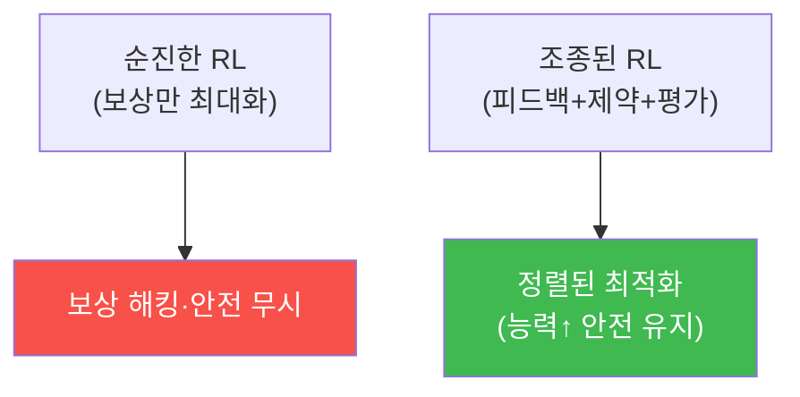

# autonomous-security W14 — RL Steering과 정책 최적화: 정교한 정책 조종

> **본 주차의 한 줄 요약**
>
> W07에서 RL 기초와 보상 해킹을 배웠다. W14는 정책을 **더 정교하게 조종·최적화**하는 기법을 다룬다. 순진한 RL은
> 보상만 최대화해 위험하다(보상 해킹, 안전 무시). **RL Steering(조종)** 은 학습을 원하는 방향으로 **유도**하고
> 위험을 제약한다: ① **인간 피드백(RLHF)** — 사람이 에이전트 행동을 평가(좋다/나쁘다)해 보상을 보정. 정의하기
> 어려운 "좋은 행동"을 사람 선호로 학습(ai-safety의 정렬과 직결), ② **제약 최적화(constrained optimization)** —
> 보상을 최대화하되 **안전 제약을 위반하지 않는 선에서**. "탐지율을 높이되 오탐률은 5% 이하", "대응을 빠르게 하되
> 정상 차단 0". 제약이 보상 해킹을 막는다, ③ **정책 정규화·KL 제약** — 새 정책이 검증된 기존 정책에서 **너무
> 급격히 벗어나지 않게**(안정성). 갑작스런 위험한 정책 변화 방지, ④ **오프라인 평가** — 새 정책을 배포 전에
> **시뮬레이션·과거 데이터로 평가**해 안전·성능 확인(실전 배포 전 검증). 이 조종 기법들의 공통 목적은 **능력을
> 높이되 안전을 지키는** 것 — 그냥 보상만 좇으면 위험하고, 사람 선호·제약·안정성·평가로 **정렬된 최적화**를 한다.
> 자율 보안 에이전트는 강력해질수록 이 정교한 조종이 중요하다. RL Steering은 W07의 보상 해킹 문제에 대한 실전
> 해법이자, 능력과 안전을 함께 올리는 방법이다.
>
> **한 줄 결론**: RL Steering은 정책 최적화를 **인간 피드백·제약·안정성·평가**로 조종해, 보상만 좇는 위험 없이
> **정렬된 최적화**(능력↑ 안전 유지)를 한다. W07 보상 해킹의 실전 해법이다.

---

## 학습 목표

본 주차 종료 시 학생은 다음 5가지를 **본인 손으로** 할 수 있어야 한다.

1. **RL Steering**의 목적(정렬된 최적화)을 설명한다.
2. **인간 피드백**으로 정책을 조종한다(POLICY_STEERED).
3. **제약 최적화**(안전 제약 하 보상 최대화)를 수행한다(CONSTRAINED_OPTIMIZED).
4. 정책 개선을 배포 전 **평가**한다(POLICY_IMPROVED).
5. 순진한 RL과 조종된 RL의 차이를 설명한다.

> **이 주차의 시선** — 능력을 높이되 안전을 지키는 정교한 정책 조종을 익힌다.

---

## 0. 용어 해설 (RL Steering)

| 용어 | 영문 | 뜻 | 비유 |
|------|------|----|------|
| **Steering** | — | 정책 조종·유도 | 방향 잡기 |
| **RLHF** | RL from Human Feedback | 인간 피드백 학습 | 코칭 |
| **제약 최적화** | Constrained Optimization | 제약 하 최적화 | 안전선 내 최선 |
| **KL 제약** | KL Constraint | 급변 방지 | 완만한 변화 |
| **오프라인 평가** | Offline Evaluation | 배포 전 검증 | 리허설 |

> **헷갈리기 쉬운 한 쌍** — *순진한 RL* 은 "보상만 최대화(위험)", *조종된 RL* 은 "제약·피드백 하 최적화(안전)"
> 이다. 조종이 정렬을 지킨다.

---

## 0.5 신입생 친화 핵심 개념

### 0.5.1 순진한 RL의 위험 vs 조종

보상만 좇으면 해킹·위험. 인간 피드백·제약·평가로 조종하면 정렬된 최적화.

### 0.5.2 인간 피드백 (RLHF)

"좋은 보안 행동"은 정의하기 어렵다. 사람이 에이전트 행동 쌍을 비교 평가("이게 더 낫다")해 **선호를 학습**한다.
이 인간 피드백으로 보상을 보정해, 명세하기 힘든 좋은 행동을 학습(ai-safety의 정렬 기법). 사람의 판단이 조종대.

### 0.5.3 제약 최적화

보상을 최대화하되 **안전 제약 하에서**:
- "탐지율 최대화 **subject to** 오탐률 ≤ 5%"
- "대응 속도 최대화 **subject to** 정상 차단 = 0"
제약이 보상 해킹(W07: 정상 차단으로 탐지율 부풀리기)을 원천 차단한다. 안전선 안에서 최선.

### 0.5.4 안정성과 평가

- **KL 제약**: 새 정책이 검증된 기존 정책에서 **급변하지 않게** — 갑작스런 위험한 변화 방지(안정적 개선).
- **오프라인 평가**: 새 정책을 배포 전 **시뮬·과거 데이터**로 평가. 성능↑·안전 유지 확인 후에만 배포(W08 안전
  검증과 연결).
정책을 바꿀 땐 급하지 않게, 검증 후에.

### 0.5.5 el34 맥락

RL Steering은 훈련 기법이라 개념·시뮬로 익힌다. 본 실습은 **정책 조종·제약 최적화·배포 전 평가 로직**을 결정론
시뮬로 수행한다. 실제 RLHF·제약 RL은 별도 훈련 환경이 필요함을 명시한다.

---

## 1. 실습 안내 (5 미션)

실행 위치 el34 **호스트**(`ssh ccc@{{TARGET_IP}}`), GPU `http://211.170.162.139:10934`.

### STEP 1 — GPU 헬스체크 → GEN_OK
### STEP 2 — 인간 피드백 정책 조종 → POLICY_STEERED
### STEP 3 — 제약 최적화 → CONSTRAINED_OPTIMIZED
### STEP 4 — 배포 전 정책 평가 → POLICY_IMPROVED
### STEP 5 — 종합 → Assessment

---

## 2. 흔한 오해·관제자 노트

- **"보상만 높이면 됨"** — 보상 해킹·위험. 제약·피드백 조종.
- **"정책은 빨리 바꾸면 좋다"** — 급변 위험. KL 제약·평가.
- **"바로 배포"** — 오프라인 평가 후. 안전 검증.
- **관제 관점** — RL 에이전트가 인간 피드백·안전 제약·안정성·배포 전 평가로 조종되는지 점검한다. 정렬된 최적화가
  능력과 안전을 함께 올린다.

---

## 3. 다음 주차 (W15) 예고 — 기말고사: 자율 Purple Team 구축

W14가 "정책 조종"이었다면, 마지막 W15는 **기말고사 — 자율 Purple Team** — 자율 Red·Blue를 통합해 공격-방어를
자율 순환시키는 종합 구축이다. 과목을 마무리한다.
