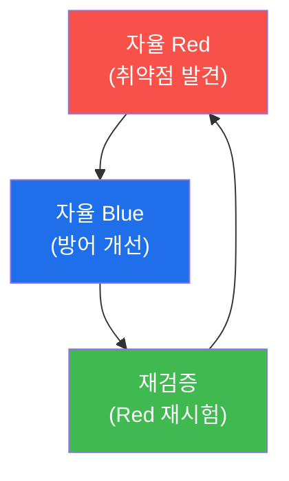

# autonomous-security W15 — 기말고사: 자율 Purple Team 구축

> **본 주차의 한 줄 요약**
>
> 마지막 주는 W01~W14를 하나의 **자율 Purple Team**으로 통합하는 기말 종합이다. **Purple Team**은 Red(공격)와
> Blue(방어)를 **협력 순환**시켜 방어를 지속적으로 강화하는 접근이다. 자율 Purple은 이를 자동화한다: ① **자율
> Red**(W12, `red-team-operator` 페르소나)가 인가된 범위에서 취약점·공격 경로를 찾고, ② 그 결과를 **자율 Blue**(W11,
> triage/hunter/analyst 페르소나)가 받아 탐지·대응을 개선(탐지 룰·Playbook 보강)하고, ③ 다시 Red가 개선된 방어를
> 재시험하는 **닫힌 순환(Red→Blue→재검증)**을 돈다. bastion에서 이는 하나의 **하니스**(다중 페르소나 팀 + 생성-검증
> 루프 + soc-lead 검증)로 조립되며, 순환이 반복될수록 KG·Experience에 학습이 쌓여 방어가 강해진다. 자율 Purple의
> 힘은 **기계 속도·24/7·지속적** 방어 강화다. 그리고 이 과목의 결론을 확인하며 마친다: **자율 보안은 능력과 안전을
> 함께 구축해야 한다.** 자율 Red·Blue·Purple 모두 강력하지만, 가드레일(W01)·감사 무결성(W06 해시체인)·정책 정렬
> (W07·W14)·결과 검증(W04)·인가/ROE(W12)·오염 방어(W13)가 없으면 방어가 아니라 위험이 된다. 실습에서는 Purple
> 순환을 설계하고(마커 `PURPLE_LOOP`), Red→Blue→재검증을 실행하며(마커 `CYCLE_EXECUTED`), 핵심 원칙을 종합한다(마커
> `SYNTHESIS`).

---

## 학습 목표

본 주차 종료 시 학생은 다음 5가지를 **본인 손으로** 할 수 있어야 한다.

1. 자율 Red·Blue를 하나의 하니스로 묶는 **Purple 순환**을 설계한다(마커 `PURPLE_LOOP`).
2. Red→Blue→재검증 **닫힌 순환을 실행**한다(마커 `CYCLE_EXECUTED`).
3. 자율 보안의 **핵심 원칙**(능력+안전)을 종합한다(마커 `SYNTHESIS`).
4. 능력과 안전의 통합이 왜 신뢰의 조건인지 설명한다.
5. W01~W14를 하나의 소견으로 통합한다(마커 `Assessment`).

> **이 주차의 시선** — 배운 모든 것을 자율 Purple로 통합하고, "능력과 안전의 균형"으로 과목을 마무리한다.

---

## 0. 용어 해설 (Purple 종합)

| 용어 | 영문 | 뜻 | 비유 |
|------|------|----|------|
| **Purple Team** | Purple Team | Red·Blue를 협력 순환시켜 방어 강화 | 공수 합동 훈련 |
| **자율 Red** | — | red-team-operator 페르소나(공격·취약점 발견) | 모의 침입자 |
| **자율 Blue** | — | triage/hunter/analyst 페르소나(방어 개선) | 방어팀 |
| **닫힌 순환** | Closed Loop | 공격→방어 개선→재검증 반복 | 순환 훈련 |
| **하니스** | Harness | Red·Blue 페르소나를 묶는 팀 워크플로 | 합동 편성 |
| **안전 기둥** | Safety Pillars | 가드레일·감사·정렬·검증·ROE·오염 방어 | 안전 골조 |

> **헷갈리기 쉬운 한 쌍 — Red·Blue 별개 vs Purple 순환.** *별개*면 공격과 방어가 따로 논다. *Purple 순환*은 공격
> 결과가 곧 방어 개선의 입력이 되고, 개선된 방어를 다시 공격이 시험한다 — 공격에서 방어를 배운다.

---

## 0.5 종합 — 순환·원칙·균형

### 0.5.1 자율 Purple 순환

Red가 찾고 → Blue가 고치고 → Red가 재시험하는 닫힌 순환. 반복될수록 KG·Experience에 학습이 쌓여 방어가 강해진다.

### 0.5.2 자율 보안의 핵심 원칙 (bastion 기준)

- **처리 루프**: PLANNING(Playbook→Skill→동적→Q&A) → EXECUTING → VALIDATING (W01·W03).
- **실행 구조**: Skill/Playbook 선택 → SubAgent A2A(:8002/a2a/run_script) 실행 (W02·W04). Manager gpt-oss:120b /
  SubAgent gemma3:4b.
- **하니스**: 다중 페르소나 팀 + orchestrator 6단계 + 생성-검증 루프 + 무발화 리더(soc-lead) (W03·W11·W12).
- **지식·학습**: KG(graph traversal) + Experience(오버피팅 방지) + EvidenceDB(evidence-first) + RAG + KG-Context (W09).
- **능동성**: Watcher·스마트 트리거(cron 금지) (W10).
- **협력**: 분산 지식 공유·Purple 순환 (W13·W15).
- **안전(관통 원칙)**: 가드레일·해시체인 감사(W06)·정책 정렬(W07·W14)·결과 검증(W04)·ROE(W12)·오염 방어(W13).

### 0.5.3 능력과 안전의 균형 — 이 과목의 결론

자율 보안 에이전트는 사이버 방어의 미래다 — 기계 속도 공격엔 기계 속도 방어가 필요하다. 하지만 그 힘은 **안전과
균형**을 이룰 때만 신뢰할 수 있다. 능력만 좇으면 폭주 위험, 안전만 좇으면 무력하다. 이 과목이 가르친 것은 둘 다 —
강력하면서 안전한 자율 보안이다.

---

## 1. Purple 종합 상세 — 순환·실행·원칙

### 1.1 Purple 순환 설계 (PURPLE_LOOP)

- **한 줄 정의**: Red·Blue 페르소나를 하나의 하니스로 묶어 공격→방어→재검증 순환을 설계한다.
- **왜 중요한가**: 공격 결과가 방어 개선의 입력이 되는 닫힌 루프가 지속 강화의 핵심이다.
- **bastion에서 어떻게**: red-team-operator + Blue 페르소나를 하니스에 배치하고 순환 워크플로를 정의하면 `PURPLE_LOOP`.
- **한계/주의**: Red 단계는 ROE·범위, Blue 단계는 자율성 수준 가드레일이 걸려야 한다.

### 1.2 순환 실행 (CYCLE_EXECUTED)

- **한 줄 정의**: Red 발견 → Blue 개선 → Red 재시험을 실제로 돌린다.
- **핵심**: 재검증에서 방어가 강해졌는지(재시험 실패=방어 성공) 확인. 생성-검증 루프로 품질 보장.
- **판정**: 닫힌 순환이 완결되고 방어 개선이 확인되면 `CYCLE_EXECUTED`.

### 1.3 핵심 원칙 종합 (SYNTHESIS)

- **한 줄 정의**: 능력(루프·실행·하니스·학습·능동·협력)과 안전(가드레일·감사·정렬·검증·ROE·오염 방어)을 정리한다.
- **핵심**: "강력하면서 안전한 자율 보안"이라는 결론을 명시.
- **판정**: 핵심 원칙이 능력+안전으로 종합되면 `SYNTHESIS`.

---

## 2. 기말고사 안내 (총 5 미션)

실행 위치는 el34 **호스트**(`ssh ccc@{{TARGET_IP}}`, 비밀번호 `1`), 참고 GPU는 Ollama
(`http://211.170.162.139:10934`, gemma3:4b)다. 각 미션의 마지막 줄 마커가 채점 기준이다.

### 미션 1 — GPU 헬스체크 → `GEN_OK`

> **왜 하는가?** 자율 Purple 에이전트 LLM 도달·응답 확인.
> **무엇을 아는가?** Ollama 응답 형식·도달성.
> **결과 해석** — 정상 `GEN_OK` / 비정상 `GEN_EMPTY`·연결 오류.
> **실전 활용** — 종합 소견 작성에 사용.

### 미션 2 — 자율 Purple 순환 설계 → `PURPLE_LOOP`

> **왜 하는가?** Red·Blue를 하나의 하니스 순환으로 묶는다.
> **무엇을 아는가?** 공격→방어 개선→재검증 워크플로.
> **결과 해석** — 정상: 순환 설계 + `PURPLE_LOOP`.
> **실전 활용** — 자율 Purple Team 아키텍처.

### 미션 3 — Red→Blue→재검증 실행 → `CYCLE_EXECUTED`

> **왜 하는가?** 순환을 돌려 방어가 강해짐을 확인한다.
> **무엇을 아는가?** 재검증에서 방어 개선 확인·생성-검증 루프.
> **결과 해석** — 정상: 순환 완결 + `CYCLE_EXECUTED`.
> **실전 활용** — 지속적 방어 강화 운영.

### 미션 4 — 핵심 원칙 종합 → `SYNTHESIS`

> **왜 하는가?** 능력과 안전의 원칙을 하나로 정리한다.
> **무엇을 아는가?** bastion 능력 요소 + 안전 기둥.
> **결과 해석** — 정상: 원칙 종합 + `SYNTHESIS`.
> **실전 활용** — 자율 보안 성숙도 평가 기준.

### 미션 5 — 최종 종합 소견 → `Assessment`

> **왜 하는가?** 순환·원칙·균형을 최종 소견으로 묶는다.
> **무엇을 아는가?** GPU에 요약시키되 첫 줄을 `Assessment`로 강제.
> **결과 해석** — 정상: `Assessment` 포함. 없으면 `[형식 미준수 — 재실행]`.
> **실전 활용** — 자율 보안 종합 소견.

---

## 2.5 과제 (제출물)

- **A. Purple 순환 설계 실증 (필수, 40점)** — `PURPLE_LOOP` 단계를 직접 수행해 실제 명령·출력(또는 아티팩트 분석 결과)을 캡처하고, 무엇을 근거로 판정했는지 서술한다.
- **B. 순환 실행 분석 (필수, 30점)** — `CYCLE_EXECUTED` 단계를 직접 수행해 실제 명령·출력(또는 아티팩트 분석 결과)을 캡처하고, 무엇을 근거로 판정했는지 서술한다.
- **C. 핵심 원칙 종합 방어 설계 (필수, 30점)** — `SYNTHESIS` 단계를 직접 수행해 실제 명령·출력(또는 아티팩트 분석 결과)을 캡처하고, 무엇을 근거로 판정했는지 서술한다.

## 2.6 평가 기준

| 항목 | 미흡(0) | 보통 | 우수 |
|------|---------|------|------|
| 탐지/실증(PURPLE_LOOP) | 미수행 | 마커 도출 | 근거·해석·재현까지 |
| 분석(CYCLE_EXECUTED) | 미수행 | 마커 도출 | 근거·해석·재현까지 |
| 방어(SYNTHESIS) | 미수행 | 마커 도출 | 근거·해석·재현까지 |

## 2.7 핵심 정리 (1줄씩)

- 이번 주 주제: **기말고사: 자율 Purple Team 구축**.
- **Purple 순환 설계**(`PURPLE_LOOP`): Red·Blue 페르소나를 하나의 하니스로 묶어 공격→방어→재검증 순환을 설계한다.
- **순환 실행**(`CYCLE_EXECUTED`): Red 발견 → Blue 개선 → Red 재시험을 실제로 돌린다.
- **핵심 원칙 종합**(`SYNTHESIS`): 능력(루프·실행·하니스·학습·능동·협력)과 안전(가드레일·감사·정렬·검증·ROE·오염 방어)을 정리한다.
- 공격을 이해한 만큼 **방어의 우선순위**가 분명해진다 — 탐지 근거와 완화를 함께 익힌다.

---

## 3. 흔한 오해·블루팀 노트

- **"Red와 Blue는 별개다."** — Purple 순환으로 협력한다. 공격에서 방어를 배운다.
- **"한 번 시험하면 끝이다."** — 닫힌 순환을 반복한다. 지속적 강화.
- **"능력만 있으면 된다."** — 안전과 균형이 신뢰의 조건이다(이 과목의 결론).
- **"자율이면 사람은 필요 없다."** — 위험 결정 승인·감독·정책 평가에 사람이 남는다.
- **관제(Blue) 관점** — 자율 Purple이 (1) Red·Blue를 하니스로 순환시키는가, (2) 모든 안전 기둥(가드레일·해시체인 감사·
  정렬·검증·ROE·오염 방어)을 갖췄는가, (3) 순환마다 KG·Experience로 학습하는가를 종합 평가한다.

---

## 4. 과목을 마치며

자율 보안은 사이버 방어의 **미래**다 — AI 속도의 공격에 맞서려면 AI 속도의 자율 방어가 필요하다. 여러분은 이제
자율 보안 에이전트를 **설계·구축·운영**하고, 무엇보다 **안전하게** 만드는 법을 안다: bastion의 처리 루프(PLANNING→
EXECUTING→VALIDATING)·Skill/Playbook·SubAgent A2A·하니스(페르소나 팀)·KG/Experience 학습·Watcher 능동성을 능력으로,
가드레일·해시체인 감사·정책 정렬·결과 검증·ROE·오염 방어를 안전으로. el34/tubewar가 바로 이 bastion 자율 보안 위에서
돈다. 강력하면서 신뢰할 수 있는 자율 보안 — 그것이 이 과목이 남기는 것이자, 여러분이 만들어갈 미래다. 수고했다.
