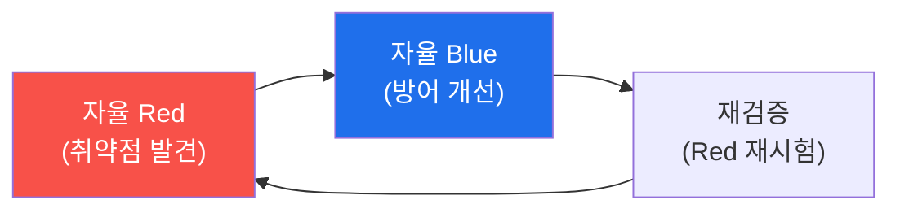

# autonomous-security W15 — 기말고사: 자율 Purple Team 구축

> **본 주차의 한 줄 요약**
>
> 마지막 주는 W01~W14를 하나의 **자율 Purple Team**으로 통합하는 기말 종합이다. **Purple Team**은 Red(공격)와
> Blue(방어)를 **협력 순환**시켜 방어를 지속적으로 강화하는 접근이다. 자율 Purple은 이를 자동화한다: ① **자율
> Red**(W12)가 인가된 범위에서 취약점·공격 경로를 찾고, ② 그 결과를 **자율 Blue**(W11)가 받아 탐지·대응을 개선
> (탐지 룰·플레이북 보강)하고, ③ 다시 Red가 **개선된 방어를 재시험**하는 **닫힌 순환(Red→Blue→재검증)** 을 돈다.
> 이 순환이 반복될수록 방어가 강해진다(공격에서 배우는 방어). 자율 Purple의 힘: **기계 속도·24/7·지속적** 방어
> 강화 — 사람 Purple 훈련은 가끔이지만, 자율 Purple은 끊임없이 시험·개선한다. 그리고 이 과목의 결론을 확인하며
> 마친다: **자율 보안은 능력과 안전을 함께 구축해야 한다.** 자율 Red·Blue·Purple 모두 강력하지만, 가드레일(W01)·
> 감사 무결성(W06)·보상 정렬(W07)·결과 검증(W04)·인가/ROE(W12)·오염 방어(W13)가 없으면 방어가 아니라 위험이
> 된다. 이 과목이 가르친 것은 자율 에이전트를 **만드는 법**만이 아니라 **안전하게 만드는 법**이다. 자율 보안은
> 사이버 방어의 미래이며(기계 속도 공격엔 기계 속도 방어), 그 미래는 능력과 안전이 균형을 이룰 때만 신뢰할 수 있다.
>
> **한 줄 결론**: 자율 Purple Team은 자율 Red·Blue를 **닫힌 순환(공격→방어 개선→재검증)** 시켜 지속적으로 방어를
> 강화한다. 결론 — 자율 보안은 **능력과 안전을 함께** 구축해야 신뢰할 수 있다.

---

## 학습 목표

본 주차 종료 시 학생은 다음 5가지를 **본인 손으로** 할 수 있어야 한다.

1. **자율 Purple** 순환을 설계한다(PURPLE_LOOP).
2. Red→Blue→재검증 **순환을 실행**한다(CYCLE_EXECUTED).
3. 자율 보안의 **핵심 원칙**을 종합한다(SYNTHESIS).
4. 능력과 안전의 통합을 설명한다.
5. W01~W14를 하나로 통합한다.

> **이 주차의 시선** — 배운 모든 것을 자율 Purple로 통합하고, 능력과 안전의 균형으로 마무리한다.

---

## 0. 용어 해설 (Purple)

| 용어 | 관련 주차 | 종합에서 |
|------|-----------|----------|
| **자율 Red** | W12 | 공격·취약점 발견 |
| **자율 Blue** | W11 | 방어 개선 |
| **Purple 순환** | — | 공격→방어→재검증 |
| **안전 기둥** | W01·W04·W06·W07·W12·W13 | 통합 안전 |

---

## 0.5 종합 — 순환·원칙·균형

### 0.5.1 자율 Purple 순환

Red가 찾고→Blue가 고치고→Red가 재시험하는 닫힌 순환. 반복될수록 방어가 강해진다.

### 0.5.2 자율 보안의 핵심 원칙

- **에이전트 루프**: 인지·판단·행동·학습(W01·W02).
- **bastion 구조**: Manager+E.G, SubAgent+A2A(W03·W04).
- **학습**: 4계층 메모리·경험(W09), RL·정책 조종(W07·W14).
- **능동성**: Watcher·스마트 트리거(W10).
- **협력**: 분산 지식·Purple 순환(W13·W15).
- **안전(관통 원칙)**: 가드레일·감사·보상 정렬·검증·ROE·오염 방어.

### 0.5.3 능력과 안전의 균형 — 이 과목의 결론

자율 보안 에이전트는 사이버 방어의 미래다 — 기계 속도 공격엔 기계 속도 방어가 필요하다. 하지만 그 힘은
**안전과 균형**을 이룰 때만 신뢰할 수 있다. 능력만 좇으면 폭주 위험, 안전만 좇으면 무력. 이 과목이 가르친 것은
**둘 다** — 강력하면서 안전한 자율 보안이다.

---

## 1. 기말고사 안내 (5 미션)

실행 위치 el34 **호스트**(`ssh ccc@{{TARGET_IP}}`), GPU `http://211.170.162.139:10934`.

### STEP 1 — GPU 헬스체크 → GEN_OK
### STEP 2 — 자율 Purple 순환 설계 → PURPLE_LOOP
### STEP 3 — Red→Blue→재검증 실행 → CYCLE_EXECUTED
### STEP 4 — 핵심 원칙 종합 → SYNTHESIS
### STEP 5 — 최종 종합 → Assessment

---

## 2. 흔한 오해·관제자 노트

- **"Red와 Blue는 별개"** — Purple 순환으로 협력. 공격에서 방어를 배운다.
- **"한 번 시험하면 끝"** — 닫힌 순환 반복. 지속적 강화.
- **"능력만 있으면 됨"** — 안전과 균형. 이 과목의 결론.
- **관제 관점** — 자율 Purple이 Red·Blue를 순환시키고, 모든 안전 기둥(가드레일·감사·정렬·검증·ROE·오염 방어)을
  갖췄는지 종합 평가한다. 능력과 안전의 균형이 자율 보안 성숙도.

---

## 3. 과목을 마치며

자율 보안은 사이버 방어의 **미래**다 — AI 속도의 공격에 맞서려면 AI 속도의 자율 방어가 필요하다. 여러분은 이제
자율 보안 에이전트를 **설계·구축·운영**하고, 무엇보다 **안전하게** 만드는 법을 안다: 에이전트 루프·bastion 구조·
학습·능동성·협력을 능력으로, 가드레일·감사·정렬·검증·ROE를 안전으로. el34/tubewar가 바로 이 자율 보안 위에서
돈다. 강력하면서 신뢰할 수 있는 자율 보안 — 그것이 이 과목이 남기는 것이자, 여러분이 만들어갈 미래다. 수고했다.
