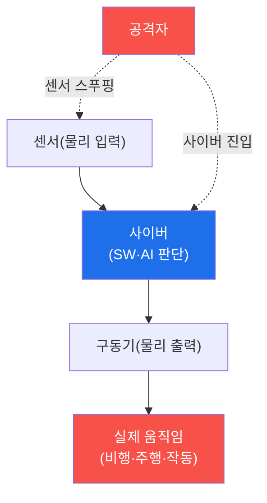

# autonomous-systems W01 — CPS 보안 개론: 사이버물리시스템과 위협 모델

> **본 주차의 한 줄 요약**
>
> autonomous-systems는 **자율 시스템**(드론·자율주행차·로봇·산업 제어)의 보안을 다룬다. 이들의 공통 본질은
> **CPS(Cyber-Physical System, 사이버물리시스템)** — 사이버(소프트웨어·네트워크·AI)와 물리(센서·구동기·실제
> 움직임)가 결합된 시스템이다. IoT가 "연결된 장치"라면, CPS는 한 걸음 더 나아가 **스스로 판단해 물리 세계를
> 움직인다**(드론이 날고, 차가 달리고, 로봇이 작동). CPS 보안의 핵심 특수성은 **사이버 공격이 곧 물리 결과**가
> 된다는 것이다 — 소프트웨어 취약점 하나가 데이터 유출이 아니라 드론 추락·차량 사고·로봇 오작동 같은 물리 재앙·
> 인명 피해로 이어진다. 그래서 CPS 위협 모델은 세 계층을 본다: ① **사이버 계층**(SW·통신·AI 모델 공격), ② **물리
> 계층**(센서 스푸핑·구동기 조작), ③ **브리지**(사이버→물리 변환 지점, 가장 위험). 공격자는 사이버로 진입해 물리
> 결과를 노리거나(드론 하이재킹) 물리 계층을 직접 속인다(GPS 스푸핑·센서 교란). 방어의 최우선은 **안전(Safety)**이다 —
> 보안이 뚫려도 물리적으로 안전해야 한다(독립 안전 장치·페일세이프). 실습에서는 CPS를 3계층으로 매핑하고(마커
> `CPS_MAPPED`), 사이버→물리 공격 경로를 구성하며(마커 `PHYSICAL_IMPACT`), 안전 필수 위험을 평가한다(마커
> `SAFETY_RISK`). CPS는 자율성이 커질수록 위험도 커지는, 사이버 보안의 최전선이다.

---

## 학습 목표

본 주차 종료 시 학생은 다음 5가지를 **본인 손으로** 할 수 있어야 한다.

1. CPS와 IoT의 차이(자율 판단·물리 결과)를 설명한다.
2. CPS를 **사이버·물리·브리지** 3계층으로 매핑한다(마커 `CPS_MAPPED`).
3. **사이버→물리 공격 경로**를 구성한다(마커 `PHYSICAL_IMPACT`).
4. **안전 필수(safety-critical) 위험**을 평가한다(마커 `SAFETY_RISK`).
5. 왜 CPS는 보안≠안전이며 안전이 최우선인지 종합한다(마커 `Assessment`).

> **이 주차의 시선** — 사이버와 물리가 만나는 CPS의 특수 위험을 이해하고, "보안이 뚫려도 안전"하게 만드는 안전
> 최우선 방어를 세운다.

---

## 0. 용어 해설 (CPS)

| 용어 | 영문 | 뜻 | 비유 |
|------|------|----|------|
| **CPS** | Cyber-Physical System | 사이버+물리가 결합돼 스스로 물리를 움직이는 시스템 | 생각하고 움직이는 기계 |
| **사이버 계층** | Cyber Layer | SW·통신·AI 판단 | 두뇌·신경 |
| **물리 계층** | Physical Layer | 센서(입력)·구동기(출력) | 눈·손발 |
| **브리지** | Bridge | 사이버 명령↔물리 행동 변환 지점 | 감각-운동 접점 |
| **센서 스푸핑** | Sensor Spoofing | 가짜 센서 입력으로 판단을 속임 | 눈을 속이기 |
| **구동기** | Actuator | 물리 행동을 실행하는 부품(모터·조향) | 손발 |
| **안전(Safety)** | Safety | 물리적으로 해를 끼치지 않음(보안과 구별) | 사고 예방 |
| **페일세이프** | Fail-safe | 이상 시 안전 상태로(정지·귀환) | 비상 정지 |

> **헷갈리기 쉬운 한 쌍 — 보안(Security) vs 안전(Safety).** *보안*은 공격으로부터 시스템을 지키는 것, *안전*은
> 시스템이 물리적으로 해를 끼치지 않는 것이다. IT에선 보안이 곧 목표지만, CPS에선 **보안이 뚫려도 안전**해야 한다 —
> 그래서 독립 안전 장치·페일세이프가 최후의 방어선이다.

---

## 0.5 핵심 개념

### 0.5.1 CPS — 사이버와 물리의 결합

센서로 세계를 인식 → 사이버가 판단 → 구동기로 물리 행동. 이 고리(sense-think-act) 어디를 공격해도 **물리 결과**가
나온다.

### 0.5.2 사이버 공격 = 물리 결과

CPS의 근본 특수성은 소프트웨어 취약점이 **물리 재앙**이 된다는 것이다. 드론 제어 하이재킹→추락, 자율주행 모델
속이기→사고, 로봇 명령 주입→오작동, PLC 조작→폭발(Stuxnet). 데이터 손실이 아니라 **생명·안전**이 걸린다. 이것이
CPS 보안을 특별하게 만든다.

### 0.5.3 3계층 위협 모델

- **사이버 계층**: SW 취약점·통신 감청/주입·AI 모델 공격(적대적 입력, W07·W13).
- **물리 계층**: 센서 스푸핑(GPS·라이다·카메라)·구동기 직접 조작·RF 교란.
- **브리지**: 사이버 명령이 물리 행동이 되는 지점 — 여기가 뚫리면 사이버가 물리를 지배한다. 가장 위험.

### 0.5.4 안전 최우선 — 페일세이프

CPS 방어의 최우선은 **안전(Safety)**이다. 보안이 뚫려도 물리적으로 안전해야 한다: 독립 안전 장치(SW와 분리),
페일세이프(이상 시 안전 정지·귀환), 물리적 한계(지오펜싱·속도 제한). 보안(사이버)과 안전(물리)은 다르지만 CPS에선
함께 간다 — 보안 실패가 안전 실패가 되지 않게 한다.

### 0.5.5 el34 맥락과 한계

CPS(드론·차량·로봇)는 실물 하드웨어가 필요하다. 본 과목은 **위협 모델·공격 경로·방어 로직**을 결정론 시뮬과 GPU
분석으로 익히고, 물리 실행(RF·센서·구동)은 실물 하드웨어가 필요함을 명시한다. 개념·분석·방어 설계 능력에 집중한다.

---

## 1. CPS 보안 상세 — 계층·공격 경로·안전

### 1.1 CPS 계층 매핑 (CPS_MAPPED)

- **한 줄 정의**: 대상 CPS(예: 드론)를 사이버·물리·브리지 3계층으로 분해한다.
- **왜 중요한가**: 계층을 알아야 각 계층의 공격 표면·방어 지점을 정한다.
- **el34 맥락에서 어떻게**: 센서(물리)·비행 제어 SW(사이버)·모터 명령(브리지)으로 매핑하면 `CPS_MAPPED`.
- **한계/주의**: 브리지(사이버→물리)가 가장 위험한 표면임을 놓치지 않는다.

### 1.2 사이버→물리 공격 경로 (PHYSICAL_IMPACT)

- **한 줄 정의**: 사이버 진입이 물리 결과로 이어지는 경로를 구성한다.
- **핵심**: 예 — 제어 통신 주입(사이버)→모터 명령 조작(브리지)→추락(물리). 물리 영향이 결과.
- **판정**: 사이버 시작→물리 결과 경로가 성립하면 `PHYSICAL_IMPACT`.

### 1.3 안전 필수 위험 평가 (SAFETY_RISK)

- **한 줄 정의**: 각 공격의 물리 피해(인명·재산)를 평가하고 페일세이프 유무를 본다.
- **핵심**: 심각도(추락·사고)×가능성, 독립 안전 장치가 피해를 막는지.
- **판정**: 안전 필수 위험이 평가되면 `SAFETY_RISK`.

---

## 2. 실습 안내 (총 5 미션)

실행 위치는 el34 **호스트**(`ssh ccc@{{TARGET_IP}}`, 비밀번호 `1`), 참고 GPU는 Ollama
(`http://211.170.162.139:10934`, gemma3:4b)다. ⚠️ CPS는 실물 하드웨어가 필요해 위협 모델·경로·안전 평가 로직을
결정론 시뮬로 익힌다. 각 미션의 마지막 줄 마커가 채점 기준이다.

### 미션 1 — GPU 헬스체크 → `GEN_OK`

> **왜 하는가?** 분석·종합에 쓸 LLM 도달·응답 확인.
> **무엇을 아는가?** Ollama 응답 형식·도달성.
> **결과 해석** — 정상 `GEN_OK` / 비정상 `GEN_EMPTY`·연결 오류.
> **실전 활용** — 종합 소견 작성에 사용.

### 미션 2 — CPS 계층 매핑 → `CPS_MAPPED`

> **왜 하는가?** CPS를 3계층으로 분해해 공격 표면을 파악한다.
> **무엇을 아는가?** 사이버·물리·브리지 계층과 각 표면.
> **결과 해석** — 정상: 3계층 매핑 + `CPS_MAPPED`.
> **실전 활용** — CPS 위협 모델링의 기초.

### 미션 3 — 사이버→물리 공격 경로 → `PHYSICAL_IMPACT`

> **왜 하는가?** 사이버 취약점이 물리 재앙이 되는 사슬을 구성한다.
> **무엇을 아는가?** 사이버 진입→브리지→물리 결과 경로.
> **결과 해석** — 정상: 경로 구성 + `PHYSICAL_IMPACT`.
> **실전 활용** — 물리 영향 기반 위험 실증.

### 미션 4 — 안전 필수 위험 평가 → `SAFETY_RISK`

> **왜 하는가?** 물리 피해(인명·재산)와 페일세이프를 평가한다.
> **무엇을 아는가?** 심각도×가능성, 독립 안전 장치.
> **결과 해석** — 정상: 위험 평가 + `SAFETY_RISK`.
> **실전 활용** — 안전 필수 시스템 위험 평가.

### 미션 5 — 종합 소견 → `Assessment`

> **왜 하는가?** 계층·경로·안전과 "보안≠안전, 안전 최우선"을 소견으로 묶는다.
> **무엇을 아는가?** GPU에 요약시키되 첫 줄을 `Assessment`로 강제.
> **결과 해석** — 정상: `Assessment` 포함. 없으면 `[형식 미준수 — 재실행]`.
> **실전 활용** — CPS 보안 설계 개요.

---

## 2.5 과제 (제출물)

- **A. CPS 계층 매핑 실증 (필수, 40점)** — `CPS_MAPPED` 단계를 직접 수행해 실제 명령·출력(또는 아티팩트 분석 결과)을 캡처하고, 무엇을 근거로 판정했는지 서술한다.
- **B. 사이버→물리 공격 경로 분석 (필수, 30점)** — `PHYSICAL_IMPACT` 단계를 직접 수행해 실제 명령·출력(또는 아티팩트 분석 결과)을 캡처하고, 무엇을 근거로 판정했는지 서술한다.
- **C. 안전 필수 위험 평가 방어 설계 (필수, 30점)** — `SAFETY_RISK` 단계를 직접 수행해 실제 명령·출력(또는 아티팩트 분석 결과)을 캡처하고, 무엇을 근거로 판정했는지 서술한다.

## 2.6 평가 기준

| 항목 | 미흡(0) | 보통 | 우수 |
|------|---------|------|------|
| 탐지/실증(CPS_MAPPED) | 미수행 | 마커 도출 | 근거·해석·재현까지 |
| 분석(PHYSICAL_IMPACT) | 미수행 | 마커 도출 | 근거·해석·재현까지 |
| 방어(SAFETY_RISK) | 미수행 | 마커 도출 | 근거·해석·재현까지 |

## 2.7 핵심 정리 (1줄씩)

- 이번 주 주제: **CPS 보안 개론: 사이버물리시스템과 위협 모델**.
- **CPS 계층 매핑**(`CPS_MAPPED`): 대상 CPS(예: 드론)를 사이버·물리·브리지 3계층으로 분해한다.
- **사이버→물리 공격 경로**(`PHYSICAL_IMPACT`): 사이버 진입이 물리 결과로 이어지는 경로를 구성한다.
- **안전 필수 위험 평가**(`SAFETY_RISK`): 각 공격의 물리 피해(인명·재산)를 평가하고 페일세이프 유무를 본다.
- 공격을 이해한 만큼 **방어의 우선순위**가 분명해진다 — 탐지 근거와 완화를 함께 익힌다.

---

## 3. 흔한 오해·블루팀 노트

- **"CPS는 IoT와 같다."** — CPS는 자율 판단 + 물리 행동이다. 뚫리면 물리 재앙(인명).
- **"보안만 하면 안전하다."** — 보안≠안전. 보안이 뚫려도 안전하게(페일세이프·독립 안전 장치).
- **"SW 버그는 데이터 문제다."** — CPS에선 물리 사고·인명이다. 안전 최우선.
- **"물리 계층은 원격 공격 대상이 아니다."** — GPS·RF·센서 스푸핑으로 물리 계층도 원격 공격된다.
- **관제(Blue) 관점** — CPS가 (1) 사이버·물리·브리지 3계층에서 평가됐는가, (2) 페일세이프·독립 안전 장치가 있는가,
  (3) 브리지(사이버→물리)가 보호되는가, (4) 사이버 침해가 물리 안전으로 번지지 않는가를 점검한다.

---

## 4. 다음 주차 (W02) 예고 — 드론 기초

W01이 "CPS 개론"이었다면, W02는 대표 CPS인 **드론**의 아키텍처·WiFi 제어·통신 구조(MAVLink 등)를 다뤄, 이후 드론
공격(W03)·방어(W04)의 토대를 세운다.
