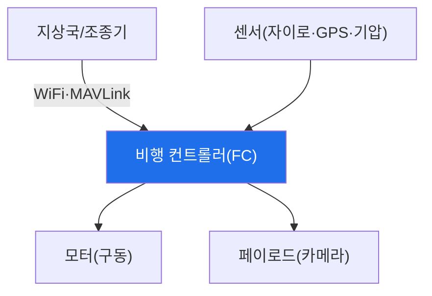

# autonomous-systems W02 — 드론 기초: 아키텍처·WiFi 제어·통신 구조

> **본 주차의 한 줄 요약**
>
> 드론(UAV)은 대표적 CPS다. 보안을 이해하려면 먼저 **아키텍처와 통신**을 알아야 한다. 드론 구성: ① **비행
> 컨트롤러(FC)** — 센서(자이로·가속도·GPS·기압계)를 읽어 자세·위치를 계산하고 모터를 제어하는 두뇌
> (ArduPilot·PX4 등 펌웨어), ② **통신 링크** — 조종기·지상국(GCS)과의 연결. 소비자 드론은 흔히 **WiFi**(2.4/5GHz)로
> 제어·영상 전송을, 상용/자작은 **MAVLink**(드론 표준 프로토콜)를 RF·텔레메트리로 쓴다, ③ **페이로드** — 카메라·
> 센서. 보안 관점 핵심: **통신 링크가 가장 큰 공격 표면**이다. 많은 드론이 ① **개방/약한 WiFi**(WEP·기본 비밀번호·
> 무암호)로 제어돼 누구나 접속·감청·명령할 수 있고, ② **MAVLink는 원래 인증·암호화가 없어**(경량·개방 설계)
> 명령을 감청·주입할 수 있다(W03). 즉 드론 제어 통신이 무방비면 하이재킹·추락으로 이어진다. 이번 주는 공격
> 전에 **드론이 어떻게 구성·통신하는지**를 익힌다 — WiFi/MAVLink 링크, GCS-드론 명령 흐름, GPS 의존성. 이 토대
> 위에서 W03(공격)·W04(방어)를 다룬다. 드론은 실물이 필요하므로 아키텍처·통신 보안은 개념·시뮬로 학습한다.
>
> **한 줄 결론**: 드론은 비행 컨트롤러+통신 링크(WiFi·MAVLink)+페이로드로 구성되며, **통신 링크가 최대 공격
> 표면**이다(약한 WiFi·무인증 MAVLink). 아키텍처·통신 이해가 공격·방어의 토대다.

---

## 학습 목표

본 주차 종료 시 학생은 다음 5가지를 **본인 손으로** 할 수 있어야 한다.

1. 드론 **아키텍처**(FC·통신·페이로드)를 설명한다.
2. **통신 링크**(WiFi·MAVLink)의 보안 상태를 평가한다(COMMS_INSECURE).
3. 드론 **공격 표면**을 매핑한다(SURFACE_MAPPED).
4. **WiFi·MAVLink 기본 강화**를 적용한다(COMMS_HARDENED).
5. 통신 링크가 왜 최대 표면인지 설명한다.

> **이 주차의 시선** — 드론의 구성과 통신을 이해해 공격·방어의 토대를 세운다.

---

## 0. 용어 해설 (드론)

| 용어 | 영문 | 뜻 | 비유 |
|------|------|----|------|
| **FC** | Flight Controller | 비행 두뇌 | 조종 컴퓨터 |
| **GCS** | Ground Control Station | 지상 제어국 | 관제소 |
| **MAVLink** | — | 드론 통신 프로토콜 | 드론 언어 |
| **텔레메트리** | Telemetry | 상태 전송 | 계기 신호 |
| **페일세이프** | Failsafe | 이상 시 안전 동작 | 자동 귀환 |

> **헷갈리기 쉬운 한 쌍** — *제어 링크* 는 "조종 명령(하이재킹 표적)", *텔레메트리* 는 "상태 보고(감청 표적)"
> 다. 둘 다 통신 링크에 실린다.

---

## 0.5 신입생 친화 핵심 개념

### 0.5.1 드론 아키텍처

지상국이 통신 링크로 명령→FC가 센서를 읽고 모터 제어→비행. 센서(물리)·FC(사이버)·모터(물리)가 W01의 CPS
3계층이다.

### 0.5.2 통신 링크 — 최대 공격 표면

- **WiFi 제어**: 소비자 드론(예: 일부 완구·촬영 드론)은 WiFi로 제어·영상. 개방/약한 WiFi면 누구나 접속·감청·
  명령. deauth로 조종 끊기(W03)도 가능.
- **MAVLink**: 드론 표준 프로토콜. **원래 인증·암호화 없음**(경량·개방). 링크에 접근하면 명령 감청·주입 가능.
- **RF 텔레메트리**: 915MHz/433MHz 등. 무암호면 감청·재전송.
통신이 무방비면 드론 제어를 뺏긴다 — 이것이 W03 공격의 핵심.

### 0.5.3 GPS 의존성

드론은 위치·귀환·자동비행에 **GPS**에 크게 의존한다. GPS는 신호가 약하고 인증이 없어 **스푸핑에 취약**(W05).
GPS를 속이면 드론이 잘못된 위치로 이동한다. 통신과 함께 GPS가 드론의 큰 약점.

### 0.5.4 기본 강화 — 통신부터

- **WiFi 강화**: WPA2/3·강한 고유 비밀번호(기본·WEP·개방 금지), 필요 시 링크 격리.
- **MAVLink 서명/암호화**: MAVLink2의 **메시지 서명**(인증)·링크 암호화로 감청·주입 방어.
- **RF 암호화**: 텔레메트리 암호화.
- **페일세이프**: 링크 끊김·이상 시 **자동 귀환/착륙**(하이재킹 완화).
통신 링크 강화가 드론 방어의 첫걸음(W04에서 심화).

### 0.5.5 el34 맥락

드론은 실물 하드웨어가 필요하다. 본 실습은 **통신 보안 평가·공격 표면 매핑·기본 강화 로직**을 결정론 시뮬로
익힌다. 실제 WiFi/MAVLink 공격은 실물 드론·RF 장비가 필요함을 명시한다.

---

## 1. 실습 안내 (5 미션)

실행 위치 el34 **호스트**(`ssh ccc@{{TARGET_IP}}`), GPU `http://211.170.162.139:10934`.
⚠️ 드론은 실물 하드웨어 필요 → 본 실습은 통신·표면·강화 로직 결정론 시뮬.

### STEP 1 — GPU 헬스체크 → GEN_OK
### STEP 2 — 통신 링크 보안 평가 → COMMS_INSECURE
### STEP 3 — 공격 표면 매핑 → SURFACE_MAPPED
### STEP 4 — 통신 기본 강화 → COMMS_HARDENED
### STEP 5 — 종합 → Assessment

---

## 2. 흔한 오해·관제자 노트

- **"드론 통신은 안전"** — 약한 WiFi·무인증 MAVLink는 무방비. 최대 표면.
- **"MAVLink는 표준이라 안전"** — 원래 인증·암호 없음. MAVLink2 서명 필요.
- **"GPS는 믿을 수 있다"** — 스푸핑에 취약(W05). 대체 항법 필요.
- **관제 관점** — 드론 WiFi가 강한 암호인지, MAVLink 서명·암호화가 켜졌는지, 페일세이프가 있는지 점검한다.
  통신 링크가 드론 보안의 핵심.

---

## 3. 다음 주차 (W03) 예고 — 드론 해킹

W02가 "드론 기초"였다면, W03은 **드론 해킹** — deauth로 조종 끊기, MAVLink 명령 인젝션, 하이재킹 등 통신 링크
공격을 다룬다. (실물 드론·RF 필요 → 공격 로직 시뮬.)
