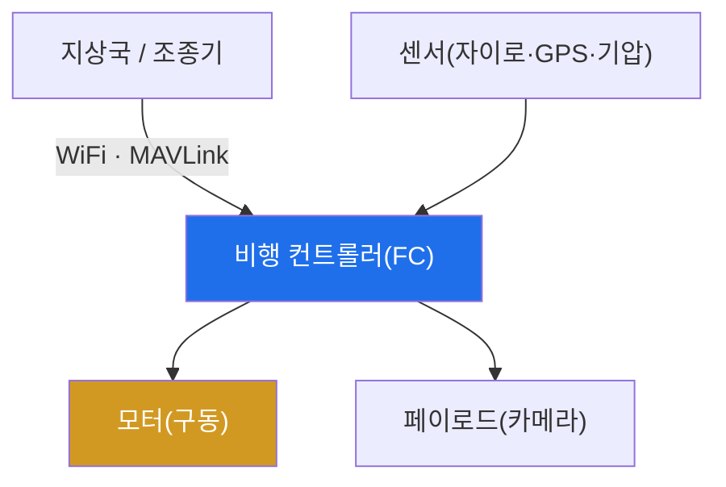

# autonomous-systems W02 — 드론 기초: 아키텍처·WiFi 제어·통신 구조

> **본 주차의 한 줄 요약**
>
> 드론(UAV)은 대표적 CPS다. 보안을 이해하려면 먼저 **아키텍처와 통신**을 알아야 한다. 드론 구성은 셋이다: ① **비행
> 컨트롤러(FC)** — 센서(자이로·가속도·GPS·기압계)를 읽어 자세·위치를 계산하고 모터를 제어하는 두뇌(ArduPilot·PX4
> 등 펌웨어), ② **통신 링크** — 조종기·지상국(GCS)과의 연결. 소비자 드론은 흔히 WiFi(2.4/5GHz)로 제어·영상 전송을,
> 상용/자작은 **MAVLink**(드론 표준 프로토콜)를 RF·텔레메트리로 쓴다, ③ **페이로드** — 카메라·센서. 보안 관점의
> 핵심은 **통신 링크가 가장 큰 공격 표면**이라는 것이다. 많은 드론이 ① 개방/약한 WiFi(WEP·기본 비밀번호·무암호)로
> 제어돼 누구나 접속·감청·명령할 수 있고, ② **MAVLink는 원래 인증·암호화가 없어**(경량·개방 설계) 명령을 감청·주입할
> 수 있다(W03). 즉 드론 제어 통신이 무방비면 하이재킹·추락으로 이어진다. 실습에서는 통신 링크 보안을 평가하고(마커
> `COMMS_INSECURE`), 공격 표면을 매핑하며(마커 `SURFACE_MAPPED`), 기본 강화를 적용한다(마커 `COMMS_HARDENED`).
> 이번 주는 공격 전에 **드론이 어떻게 구성·통신하는지**를 익힌다 — WiFi/MAVLink 링크, GCS-드론 명령 흐름, GPS
> 의존성. 이 토대 위에서 W03(공격)·W04(방어)를 다룬다.

---

## 학습 목표

본 주차 종료 시 학생은 다음 5가지를 **본인 손으로** 할 수 있어야 한다.

1. 드론 아키텍처(FC·통신·페이로드)와 CPS 3계층 대응을 설명한다.
2. **통신 링크**(WiFi·MAVLink)의 보안 상태를 평가한다(마커 `COMMS_INSECURE`).
3. 드론 **공격 표면**을 매핑한다(마커 `SURFACE_MAPPED`).
4. **WiFi·MAVLink 기본 강화**를 적용한다(마커 `COMMS_HARDENED`).
5. 통신 링크가 왜 최대 표면인지, GPS 의존성이 왜 약점인지 종합한다(마커 `Assessment`).

> **이 주차의 시선** — 공격에 앞서 드론의 구성과 통신을 정확히 이해한다. "어디로 명령이 오가는가"를 알아야 어디를
> 공격·방어할지 정할 수 있다.

---

## 0. 용어 해설 (드론)

| 용어 | 영문 | 뜻 | 비유 |
|------|------|----|------|
| **FC** | Flight Controller | 센서를 읽어 모터를 제어하는 비행 두뇌 | 조종 컴퓨터 |
| **GCS** | Ground Control Station | 지상에서 드론을 제어·감시하는 소프트웨어 | 관제소 |
| **MAVLink** | — | 드론-GCS 표준 통신 프로토콜(경량·개방) | 드론 공용어 |
| **제어 링크** | Control Link | 조종 명령을 싣는 통신(하이재킹 표적) | 조종 채널 |
| **텔레메트리** | Telemetry | 드론 상태를 지상으로 보고(감청 표적) | 계기 신호 |
| **페이로드** | Payload | 카메라·센서 등 탑재물 | 화물 |
| **페일세이프** | Failsafe | 링크 끊김·이상 시 자동 귀환/착륙 | 자동 귀소 |

> **헷갈리기 쉬운 한 쌍 — 제어 링크 vs 텔레메트리.** *제어 링크*는 지상→드론 조종 명령(탈취되면 하이재킹), *텔레
> 메트리*는 드론→지상 상태 보고(감청되면 위치·상태 노출)다. 둘 다 같은 통신 링크에 실리므로 링크 보안이 핵심이다.

---

## 0.5 신입생 친화 핵심 개념

### 0.5.1 드론 아키텍처

지상국이 통신 링크로 명령 → FC가 센서를 읽고 모터를 제어 → 비행. 센서(물리)·FC(사이버)·모터(물리)가 W01의 CPS
3계층 그대로다.

### 0.5.2 통신 링크 — 최대 공격 표면

- **WiFi 제어**: 소비자 드론은 WiFi로 제어·영상. 개방/약한 WiFi면 누구나 접속·감청·명령. deauth로 조종 끊기(W03)도
  가능.
- **MAVLink**: 드론 표준 프로토콜. **원래 인증·암호화 없음**(경량·개방). 링크에 접근하면 명령 감청·주입 가능.
- **RF 텔레메트리**: 915MHz/433MHz 등. 무암호면 감청·재전송.

통신이 무방비면 드론 제어를 뺏긴다 — 이것이 W03 공격의 핵심이다.

### 0.5.3 GPS 의존성

드론은 위치·귀환·자동비행에 GPS에 크게 의존한다. GPS는 신호가 약하고 인증이 없어 **스푸핑에 취약**하다(W05). GPS를
속이면 드론이 잘못된 위치로 이동한다. 통신과 함께 GPS가 드론의 큰 약점이다.

### 0.5.4 기본 강화 — 통신부터

- **WiFi 강화**: WPA2/3·강한 고유 비밀번호(기본·WEP·개방 금지), 필요 시 링크 격리.
- **MAVLink 서명/암호화**: MAVLink2의 메시지 서명(인증)·링크 암호화로 감청·주입 방어.
- **RF 암호화**: 텔레메트리 암호화.
- **페일세이프**: 링크 끊김·이상 시 자동 귀환/착륙(하이재킹 완화).

통신 링크 강화가 드론 방어의 첫걸음이다(W04에서 심화).

### 0.5.5 el34 맥락

드론은 실물 하드웨어가 필요하다. 이번 실습은 **통신 보안 평가·공격 표면 매핑·기본 강화 로직**을 결정론 시뮬로
익힌다(실제 WiFi/MAVLink 공격은 실물 드론·RF 장비 필요).

---

## 1. 드론 통신 상세 — 평가·표면·강화

### 1.1 통신 링크 보안 평가 (COMMS_INSECURE)

- **한 줄 정의**: WiFi·MAVLink·RF 링크의 인증·암호화 상태를 평가한다.
- **왜 중요한가**: 무방비 링크가 하이재킹의 입구다.
- **el34 맥락에서 어떻게**: 개방 WiFi·무서명 MAVLink 여부를 점검해 취약을 판정하면 `COMMS_INSECURE`.
- **한계/주의**: 소비자 드론은 편의를 위해 약한 기본 설정이 많다.

### 1.2 공격 표면 매핑 (SURFACE_MAPPED)

- **한 줄 정의**: 제어 링크·텔레메트리·GPS·페이로드를 표면으로 목록화한다.
- **핵심**: 각 표면의 공격(감청·주입·deauth·스푸핑)과 위험을 정리.
- **판정**: 표면이 매핑되면 `SURFACE_MAPPED`.

### 1.3 통신 기본 강화 (COMMS_HARDENED)

- **한 줄 정의**: WiFi 암호·MAVLink 서명·RF 암호·페일세이프를 적용한다.
- **핵심**: 무방비 링크를 인증·암호화로 닫고, 링크 끊김에 자동 귀환.
- **판정**: 기본 강화가 적용되면 `COMMS_HARDENED`.

---

## 2. 실습 안내 (총 5 미션)

실행 위치는 el34 **호스트**(`ssh ccc@{{TARGET_IP}}`, 비밀번호 `1`), 참고 GPU는 Ollama
(`http://211.170.162.139:10934`, gemma3:4b)다. ⚠️ 드론은 실물 하드웨어가 필요해 통신·표면·강화 로직을 결정론 시뮬로
익힌다. 각 미션의 마지막 줄 마커가 채점 기준이다.

### 미션 1 — GPU 헬스체크 → `GEN_OK`

> **왜 하는가?** 분석·종합에 쓸 LLM 도달·응답 확인.
> **무엇을 아는가?** Ollama 응답 형식·도달성.
> **결과 해석** — 정상 `GEN_OK` / 비정상 `GEN_EMPTY`·연결 오류.
> **실전 활용** — 종합 소견 작성에 사용.

### 미션 2 — 통신 링크 보안 평가 → `COMMS_INSECURE`

> **왜 하는가?** 하이재킹의 입구인 통신 링크 상태를 평가한다.
> **무엇을 아는가?** WiFi 암호·MAVLink 서명·RF 암호 여부.
> **결과 해석** — 정상: 취약 판정 + `COMMS_INSECURE`.
> **실전 활용** — 드론 통신 보안 진단.

### 미션 3 — 공격 표면 매핑 → `SURFACE_MAPPED`

> **왜 하는가?** 어디를 공격·방어할지 표면을 목록화한다.
> **무엇을 아는가?** 제어 링크·텔레메트리·GPS·페이로드 표면.
> **결과 해석** — 정상: 표면 매핑 + `SURFACE_MAPPED`.
> **실전 활용** — 드론 위협 모델링.

### 미션 4 — 통신 기본 강화 → `COMMS_HARDENED`

> **왜 하는가?** 무방비 링크를 닫는 방어의 첫걸음을 적용한다.
> **무엇을 아는가?** WiFi 암호·MAVLink 서명·페일세이프.
> **결과 해석** — 정상: 강화 적용 + `COMMS_HARDENED`.
> **실전 활용** — 드론 통신 강화 권고.

### 미션 5 — 종합 소견 → `Assessment`

> **왜 하는가?** 평가·표면·강화와 "통신이 최대 표면, GPS가 약점"을 소견으로 묶는다.
> **무엇을 아는가?** GPU에 요약시키되 첫 줄을 `Assessment`로 강제.
> **결과 해석** — 정상: `Assessment` 포함. 없으면 `[형식 미준수 — 재실행]`.
> **실전 활용** — 드론 보안 개요.

---

## 2.5 과제 (제출물)

- **A. 통신 링크 보안 평가 실증 (필수, 40점)** — `COMMS_INSECURE` 단계를 직접 수행해 실제 명령·출력(또는 아티팩트 분석 결과)을 캡처하고, 무엇을 근거로 판정했는지 서술한다.
- **B. 공격 표면 매핑 분석 (필수, 30점)** — `SURFACE_MAPPED` 단계를 직접 수행해 실제 명령·출력(또는 아티팩트 분석 결과)을 캡처하고, 무엇을 근거로 판정했는지 서술한다.
- **C. 통신 기본 강화 방어 설계 (필수, 30점)** — `COMMS_HARDENED` 단계를 직접 수행해 실제 명령·출력(또는 아티팩트 분석 결과)을 캡처하고, 무엇을 근거로 판정했는지 서술한다.

## 2.6 평가 기준

| 항목 | 미흡(0) | 보통 | 우수 |
|------|---------|------|------|
| 탐지/실증(COMMS_INSECURE) | 미수행 | 마커 도출 | 근거·해석·재현까지 |
| 분석(SURFACE_MAPPED) | 미수행 | 마커 도출 | 근거·해석·재현까지 |
| 방어(COMMS_HARDENED) | 미수행 | 마커 도출 | 근거·해석·재현까지 |

## 2.7 핵심 정리 (1줄씩)

- 이번 주 주제: **드론 기초: 아키텍처·WiFi 제어·통신 구조**.
- **통신 링크 보안 평가**(`COMMS_INSECURE`): WiFi·MAVLink·RF 링크의 인증·암호화 상태를 평가한다.
- **공격 표면 매핑**(`SURFACE_MAPPED`): 제어 링크·텔레메트리·GPS·페이로드를 표면으로 목록화한다.
- **통신 기본 강화**(`COMMS_HARDENED`): WiFi 암호·MAVLink 서명·RF 암호·페일세이프를 적용한다.
- 공격을 이해한 만큼 **방어의 우선순위**가 분명해진다 — 탐지 근거와 완화를 함께 익힌다.

---

## 3. 흔한 오해·관제자 노트

- **"드론 통신은 안전하다."** — 약한 WiFi·무인증 MAVLink는 무방비다. 최대 표면.
- **"MAVLink는 표준이라 안전하다."** — 원래 인증·암호가 없다. MAVLink2 서명이 필요하다.
- **"GPS는 믿을 수 있다."** — 스푸핑에 취약하다(W05). 대체 항법·이상 탐지가 필요하다.
- **"드론은 근처에 있어야 공격한다."** — RF·WiFi는 원거리 안테나로도 도달한다.
- **관제(Blue) 관점** — 드론이 (1) 강한 WiFi 암호를 쓰는가, (2) MAVLink 서명·암호화가 켜졌는가, (3) 페일세이프가
  있는가, (4) GPS 이상 탐지가 있는가를 점검한다.

---

## 4. 다음 주차 (W03) 예고 — 드론 해킹

W02가 "드론 기초"였다면, W03은 **드론 해킹**을 다룬다. deauth로 조종 끊기, MAVLink 명령 인젝션, 하이재킹 등 통신
링크 공격을 익힌다(실물 드론·RF 필요 → 공격 로직 시뮬).
