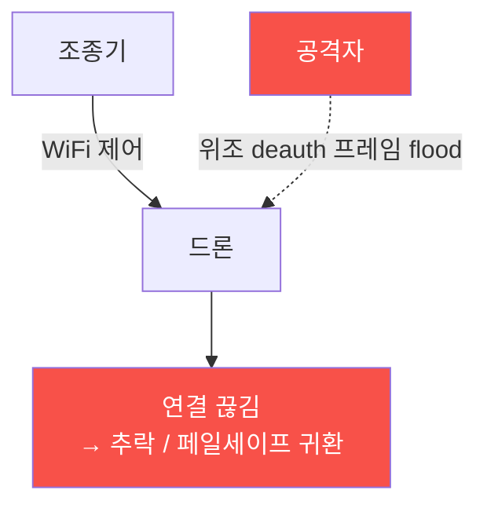

# autonomous-systems W03 — 드론 해킹: Deauth·MAVLink 명령 인젝션·하이재킹

> **본 주차의 한 줄 요약**
>
> W02에서 본 통신 링크 취약성을 이번 주 W03에서 **실제 공격**으로 연결한다(방어는 W04). 드론 공격의 3대 유형은
> 이렇다: ① **Deauth(인증 해제) 공격** — 드론이 WiFi로 제어될 때, 공격자가 위조 **deauth 프레임**을 뿌려 조종기-드론
> 연결을 강제로 끊는다(WiFi 관리 프레임은 인증이 없어 위조 가능). 조종 불능이 되면 드론이 추락하거나 페일세이프로
> 귀환/착륙한다. ② **MAVLink 명령 인젝션** — MAVLink가 서명·암호화 없이 쓰이면(W02), 공격자가 링크에 접근해 위조
> 명령(모드 변경·이륙·착륙·경로 변경)을 주입한다. 드론은 발신자를 확인 못 해 따른다. ③ **하이재킹** — deauth로 정당한
> 조종기를 끊고, 공격자가 자신의 조종기/GCS로 드론을 인수한다(연결 인증이 약할 때). 이 공격들은 통신 링크의 무방비
> (약한 WiFi·무인증 MAVLink)를 악용하며, 결과는 **물리적**이다 — 추락·납치·경로 이탈. 실습에서는 Deauth를 탐지하고
> (마커 `DEAUTH_DETECTED`), MAVLink 명령 인젝션을 탐지하며(마커 `COMMAND_INJECTED`), 하이재킹 방어를 평가한다(마커
> `HIJACK_PREVENTED`). 이번 주는 공격의 원리와 **탐지 신호**를 이해한다(실제 실행은 실물 드론·RF·안전한 환경·법적
> 인가 필요). 목적은 방어를 위한 이해다.

---

## 학습 목표

본 주차 종료 시 학생은 다음 5가지를 **본인 손으로** 할 수 있어야 한다.

1. 드론 3대 공격(deauth·MAVLink 인젝션·하이재킹)의 원리를 설명한다.
2. **Deauth 공격**을 탐지 신호로 식별한다(마커 `DEAUTH_DETECTED`).
3. **MAVLink 명령 인젝션**을 탐지한다(마커 `COMMAND_INJECTED`).
4. **하이재킹 방어**(MAVLink 서명·페일세이프·연결 인증)를 평가한다(마커 `HIJACK_PREVENTED`).
5. 왜 무인증 링크가 물리 재앙으로 이어지는지 종합한다(마커 `Assessment`).

> **이 주차의 시선** — 통신 취약성이 실제 물리 공격이 되는 과정을 이해한다. 공격 자체보다 **탐지 신호와 방어 지점**을
> 잡는 것이 목표다(인가된 환경에서만).

---

## 0. 용어 해설 (드론 공격)

| 용어 | 영문 | 뜻 | 비유 |
|------|------|----|------|
| **Deauth** | Deauthentication | 위조 관리 프레임으로 WiFi 연결을 강제 해제 | 통신선 자르기 |
| **관리 프레임** | Management Frame | 인증이 없는 WiFi 제어 프레임(위조 가능) | 무인증 신호 |
| **명령 인젝션** | Command Injection | 링크에 위조 MAVLink 명령을 주입 | 가짜 지시서 |
| **MAVLink 서명** | Message Signing | 명령에 서명을 붙여 발신자 인증(MAVLink2) | 도장·인감 |
| **하이재킹** | Hijacking | 제어권을 탈취해 공격자가 조종 | 납치 |
| **바인딩** | Binding | 조종기-드론 연결 인증 절차 | 짝짓기 |
| **페일세이프** | Failsafe | 연결 끊김·이상 시 자동 귀환/착륙 | 자동 귀소 |

> **헷갈리기 쉬운 한 쌍 — Deauth vs 하이재킹.** *Deauth*는 연결을 끊어 조종 불능으로 만든다(방해·추락 유발).
> *하이재킹*은 제어를 뺏어 공격자가 조종한다(납치). 하이재킹은 종종 deauth로 정당 조종기를 끊는 것으로 시작한다.

---

## 0.5 신입생 친화 핵심 개념

### 0.5.1 Deauth — 연결을 끊는다

WiFi **관리 프레임(deauth)은 인증이 없어** 누구나 위조할 수 있다. 공격자가 드론에 deauth를 flood하면 조종기 연결이
끊긴다. 페일세이프가 없으면 추락, 있으면 귀환/착륙(조종 방해).

### 0.5.2 MAVLink 명령 인젝션

MAVLink가 서명 없이 쓰이면(W02), 공격자가 링크에 접근해 위조 명령을 보낸다: `MAV_CMD_NAV_LAND`(강제 착륙)·
`SET_MODE`(모드 변경)·`MISSION_ITEM`(경로 변경). 드론은 발신자 인증이 없어 명령을 수용한다. 무서명 = 누구나 명령.

### 0.5.3 하이재킹

Deauth로 정당한 조종기를 끊은 뒤, 공격자가 자신의 GCS로 드론에 연결·인수한다. 연결 인증이 약하거나(기본 비밀번호·
무인증 바인딩) MAVLink 무서명이면 성공한다. 드론을 완전히 뺏어 원하는 곳으로 조종 — 납치·무단 침입·무기화.

### 0.5.4 탐지 신호

- **Deauth**: 짧은 시간에 비정상적으로 많은 deauth 프레임, 조종기 MAC 사칭.
- **명령 인젝션**: 서명 없는/잘못된 서명 MAVLink 명령, 예상치 못한 발신 시스템 ID, 비정상 명령 시퀀스.
- **하이재킹**: 갑작스런 연결 끊김 + 새 GCS 연결, 조종 입력 급변.

이 신호들이 W04 방어(탐지·차단)의 기초다.

### 0.5.5 el34 맥락·윤리

드론 공격 실행은 실물 드론·RF 장비·안전한 격리 환경·법적 인가가 필요하다(무단 드론 공격은 불법·위험). 이번 실습은
**공격 탐지 신호·방어 평가 로직**을 el34에서 실제 아티팩트(설정·캡처·로그)를 만들어 strings·grep·awk 로 분석한다. 목적은 방어를 위한 이해다.

---

## 1. 드론 공격 상세 — 탐지·방어

### 1.1 Deauth 탐지 (DEAUTH_DETECTED)

- **한 줄 정의**: 위조 deauth 프레임 폭주를 탐지 신호로 식별한다.
- **왜 중요한가**: deauth는 하이재킹의 시작이자 조종 방해의 수단이다.
- **el34 맥락에서 어떻게**: 단시간 deauth 프레임 급증·MAC 사칭 패턴을 탐지하면 `DEAUTH_DETECTED`.
- **한계/주의**: 관리 프레임은 인증이 없어 완전 차단이 어렵다 → 탐지+페일세이프로 완화.

### 1.2 명령 인젝션 탐지 (COMMAND_INJECTED)

- **한 줄 정의**: 무서명/위조 서명 MAVLink 명령을 탐지한다.
- **핵심**: 서명 검증 실패·예상 밖 시스템 ID·비정상 명령 시퀀스.
- **판정**: 위조 명령을 탐지하면 `COMMAND_INJECTED`.

### 1.3 하이재킹 방어 평가 (HIJACK_PREVENTED)

- **한 줄 정의**: MAVLink 서명·강한 바인딩·페일세이프로 인수를 막는지 평가한다.
- **핵심**: 서명 인증(위조 명령 거부) + 연결 인증(무단 GCS 차단) + 페일세이프(끊김 시 귀환).
- **판정**: 방어로 하이재킹이 차단되면 `HIJACK_PREVENTED`.

---

## 2. 실습 안내 (총 5 미션)

실행 위치는 el34 **호스트**(`ssh ccc@{{TARGET_IP}}`, 비밀번호 `1`), 참고 GPU는 Ollama
(`http://211.170.162.139:10934`, gemma3:4b)다. ⚠️ 드론 공격은 실물·RF·인가가 필요해 탐지·방어 로직을 실제 아티팩트 분석으로
익힌다. 각 미션의 마지막 줄 마커가 채점 기준이다.

### 미션 1 — GPU 헬스체크 → `GEN_OK`

> **왜 하는가?** 분석·종합에 쓸 LLM 도달·응답 확인.
> **무엇을 아는가?** Ollama 응답 형식·도달성.
> **결과 해석** — 정상 `GEN_OK` / 비정상 `GEN_EMPTY`·연결 오류.
> **실전 활용** — 종합 소견 작성에 사용.

### 미션 2 — Deauth 탐지 → `DEAUTH_DETECTED`

> **왜 하는가?** 하이재킹의 시작 신호를 잡는다.
> **무엇을 아는가?** deauth 프레임 급증·MAC 사칭 패턴.
> **결과 해석** — 정상: 탐지 + `DEAUTH_DETECTED`.
> **실전 활용** — 무선 IDS의 deauth 탐지.

### 미션 3 — MAVLink 명령 인젝션 탐지 → `COMMAND_INJECTED`

> **왜 하는가?** 위조 명령을 걸러 하이재킹을 막는다.
> **무엇을 아는가?** 서명 실패·비정상 시스템 ID·명령 시퀀스.
> **결과 해석** — 정상: 탐지 + `COMMAND_INJECTED`.
> **실전 활용** — MAVLink 이상 탐지.

### 미션 4 — 하이재킹 방어 평가 → `HIJACK_PREVENTED`

> **왜 하는가?** 서명·바인딩·페일세이프가 인수를 막는지 확인한다.
> **무엇을 아는가?** 서명 인증·연결 인증·페일세이프 조합.
> **결과 해석** — 정상: 방어 확인 + `HIJACK_PREVENTED`.
> **실전 활용** — 드론 하이재킹 방어 설계.

### 미션 5 — 종합 소견 → `Assessment`

> **왜 하는가?** 3대 공격·탐지·방어와 "무인증 링크→물리 재앙"을 소견으로 묶는다.
> **무엇을 아는가?** GPU에 요약시키되 첫 줄을 `Assessment`로 강제.
> **결과 해석** — 정상: `Assessment` 포함. 없으면 `[형식 미준수 — 재실행]`.
> **실전 활용** — 드론 공격·방어 개요.

---

## 2.5 과제 (제출물)

- **A. Deauth 탐지 실증 (필수, 40점)** — `DEAUTH_DETECTED` 단계를 직접 수행해 실제 명령·출력(또는 아티팩트 분석 결과)을 캡처하고, 무엇을 근거로 판정했는지 서술한다.
- **B. 명령 인젝션 탐지 분석 (필수, 30점)** — `COMMAND_INJECTED` 단계를 직접 수행해 실제 명령·출력(또는 아티팩트 분석 결과)을 캡처하고, 무엇을 근거로 판정했는지 서술한다.
- **C. 하이재킹 방어 평가 방어 설계 (필수, 30점)** — `HIJACK_PREVENTED` 단계를 직접 수행해 실제 명령·출력(또는 아티팩트 분석 결과)을 캡처하고, 무엇을 근거로 판정했는지 서술한다.

## 2.6 평가 기준

| 항목 | 미흡(0) | 보통 | 우수 |
|------|---------|------|------|
| 탐지/실증(DEAUTH_DETECTED) | 미수행 | 마커 도출 | 근거·해석·재현까지 |
| 분석(COMMAND_INJECTED) | 미수행 | 마커 도출 | 근거·해석·재현까지 |
| 방어(HIJACK_PREVENTED) | 미수행 | 마커 도출 | 근거·해석·재현까지 |

## 2.7 핵심 정리 (1줄씩)

- 이번 주 주제: **드론 해킹: Deauth·MAVLink 명령 인젝션·하이재킹**.
- **Deauth 탐지**(`DEAUTH_DETECTED`): 위조 deauth 프레임 폭주를 탐지 신호로 식별한다.
- **명령 인젝션 탐지**(`COMMAND_INJECTED`): 무서명/위조 서명 MAVLink 명령을 탐지한다.
- **하이재킹 방어 평가**(`HIJACK_PREVENTED`): MAVLink 서명·강한 바인딩·페일세이프로 인수를 막는지 평가한다.
- 공격을 이해한 만큼 **방어의 우선순위**가 분명해진다 — 탐지 근거와 완화를 함께 익힌다.

---

## 3. 흔한 오해·관제자 노트

- **"deauth는 완전히 막을 수 있다."** — 관리 프레임은 인증이 없어 완전 차단이 어렵다. 탐지+페일세이프로 완화한다.
- **"MAVLink 명령은 드론만 보낸다."** — 무서명이면 누구나 위조 명령을 보낸다. 서명(MAVLink2)이 필수.
- **"하이재킹은 근처에서만 된다."** — RF·WiFi는 고이득 안테나로 원거리 가능하다.
- **"공격은 데이터 손실이다."** — 드론은 추락·납치 같은 물리 결과다. 안전 최우선.
- **관제(Blue) 관점** — (1) deauth 급증 탐지, (2) MAVLink 서명 검증·무서명 명령 거부, (3) 강한 바인딩·연결 인증,
  (4) 링크 끊김 시 페일세이프가 있는지 점검한다.

---

## 4. 다음 주차 (W04) 예고 — 드론 방어

W03이 "드론 공격"이었다면, W04는 **드론 방어**를 다룬다. deauth 탐지·MAVLink 서명·GPS 이상 탐지·페일세이프·지오펜싱을
묶어 통신·항법·안전 계층의 방어를 설계한다.
