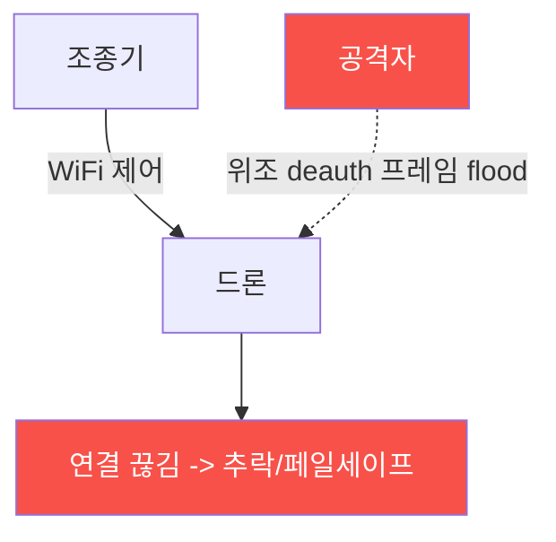

# autonomous-systems W03 — 드론 해킹: Deauth·MAVLink 명령 인젝션·하이재킹

> **본 주차의 한 줄 요약**
>
> W02에서 본 통신 링크 취약성을 W03에서 **실제 공격**으로 연결한다(방어는 W04). 드론 공격의 3대 유형: ①
> **Deauth(인증 해제) 공격** — 드론이 WiFi로 제어될 때, 공격자가 위조 **deauth 프레임**을 뿌려 조종기-드론
> 연결을 강제로 끊는다(WiFi 관리 프레임은 인증이 없어 위조 가능). 조종 불능이 되면 드론이 추락하거나 페일세이프로
> 귀환/착륙, ② **MAVLink 명령 인젝션** — MAVLink가 **서명·암호화 없이**(W02) 쓰이면, 공격자가 링크에 접근해
> **위조 명령**(모드 변경·이륙·착륙·경로 변경)을 주입한다. 드론은 발신자를 확인 못 해 따른다, ③ **하이재킹** —
> deauth로 정당한 조종기를 끊고, 공격자가 자신의 조종기/GCS로 드론을 **인수**한다(연결 인증이 약할 때). 이 공격들은
> 통신 링크의 무방비(약한 WiFi·무인증 MAVLink)를 악용하며, 결과는 **물리적**이다 — 추락·납치·경로 이탈. Deauth·
> MAVLink 취약성은 실제 소비자/상용 드론에서 반복 시연됐다. 방어(W04)는 이 공격들을 탐지·차단한다. 이번 주는
> 공격의 원리와 탐지 신호를 이해한다(실제 실행은 실물 드론·RF·안전한 환경·법적 인가 필요).
>
> **한 줄 결론**: 드론 해킹 3대 유형 — **Deauth(연결 끊기)·MAVLink 명령 인젝션(위조 명령)·하이재킹(인수)** 은
> 무방비 통신 링크를 악용해 추락·납치 같은 물리 결과를 낸다. W04에서 방어한다.

---

## 학습 목표

본 주차 종료 시 학생은 다음 5가지를 **본인 손으로** 할 수 있어야 한다.

1. 드론 **3대 공격**(deauth·인젝션·하이재킹)을 설명한다.
2. **Deauth 공격**을 탐지한다(DEAUTH_DETECTED).
3. **MAVLink 명령 인젝션**을 탐지한다(COMMAND_INJECTED).
4. **하이재킹 방어**(서명·페일세이프)를 평가한다(HIJACK_PREVENTED).
5. 왜 무인증 링크가 물리 재앙으로 이어지는지 설명한다.

> **이 주차의 시선** — 통신 취약성이 실제 물리 공격이 되는 과정을 이해한다. (인가된 환경에서만.)

---

## 0. 용어 해설 (드론 공격)

| 용어 | 영문 | 뜻 | 비유 |
|------|------|----|------|
| **Deauth** | Deauthentication | 강제 연결 해제 | 통신 끊기 |
| **명령 인젝션** | Command Injection | 위조 명령 주입 | 가짜 지시 |
| **하이재킹** | Hijacking | 제어권 탈취 | 납치 |
| **페일세이프** | Failsafe | 이상 시 안전 동작 | 자동 귀환 |
| **관리 프레임** | Management Frame | WiFi 제어 프레임 | 무인증 신호 |

> **헷갈리기 쉬운 한 쌍** — *Deauth* 는 "연결을 끊음(조종 불능)", *하이재킹* 은 "제어를 뺏음(공격자 조종)"이다.
> 하이재킹은 종종 deauth로 시작.

---

## 0.5 신입생 친화 핵심 개념

### 0.5.1 Deauth — 연결을 끊는다

WiFi **관리 프레임(deauth)은 인증이 없어** 누구나 위조할 수 있다. 공격자가 드론에 deauth를 flood하면 조종기
연결이 끊긴다. 페일세이프가 없으면 추락, 있으면 귀환/착륙(조종 방해).

### 0.5.2 MAVLink 명령 인젝션

MAVLink가 서명 없이 쓰이면(W02), 공격자가 링크에 접근해 **위조 명령**을 보낸다: `MAV_CMD_NAV_LAND`(강제 착륙)·
`SET_MODE`(모드 변경)·`MISSION_ITEM`(경로 변경). 드론은 발신자 인증이 없어 명령을 수용한다. 무서명 = 누구나
명령.

### 0.5.3 하이재킹

Deauth로 정당한 조종기를 끊은 뒤, 공격자가 **자신의 GCS로 드론에 연결·인수**한다. 연결 인증이 약하거나(기본
비밀번호·무인증 바인딩) MAVLink 무서명이면 성공. 드론을 완전히 뺏어 원하는 곳으로 조종 — 납치·무단 침입·무기화.

### 0.5.4 탐지 신호

- **Deauth**: 짧은 시간에 **비정상적으로 많은 deauth 프레임**, 조종기 MAC 사칭.
- **명령 인젝션**: **서명 없는/잘못된 서명** MAVLink 명령, 예상치 못한 발신 시스템 ID, 비정상 명령 시퀀스.
- **하이재킹**: 갑작스런 연결 끊김+새 GCS 연결, 조종 입력 급변.
이 신호들이 W04 방어(탐지·차단)의 기초다.

### 0.5.5 el34 맥락·윤리

드론 공격 실행은 **실물 드론·RF 장비·안전한 격리 환경·법적 인가**가 필요하다(무단 드론 공격은 불법·위험). 본
실습은 **공격 탐지 신호·방어 평가 로직**을 결정론 시뮬로 익힌다. 목적은 방어를 위한 이해다.

---

## 1. 실습 안내 (5 미션)

실행 위치 el34 **호스트**(`ssh ccc@{{TARGET_IP}}`), GPU `http://211.170.162.139:10934`.
⚠️ 드론 공격은 실물·RF·인가 필요 → 본 실습은 탐지·방어 로직 결정론 시뮬.

### STEP 1 — GPU 헬스체크 → GEN_OK
### STEP 2 — Deauth 공격 탐지 → DEAUTH_DETECTED
### STEP 3 — MAVLink 명령 인젝션 탐지 → COMMAND_INJECTED
### STEP 4 — 하이재킹 방어 → HIJACK_PREVENTED
### STEP 5 — 종합 → Assessment

---

## 2. 흔한 오해·관제자 노트

- **"WiFi 드론은 안전하게 연결"** — deauth 프레임은 무인증. 강제 끊김 가능.
- **"MAVLink 명령은 조종기만"** — 무서명이면 누구나 주입. 서명 필수.
- **"하이재킹은 영화 얘기"** — 실제 시연 다수. 무인증 바인딩이 원인.
- **관제 관점** — 드론이 deauth·무서명 명령·비정상 연결을 탐지하는지, 페일세이프·MAVLink 서명이 있는지 점검한다.
  통신 공격이 물리 재앙으로.

---

## 3. 다음 주차 (W04) 예고 — 드론 방어

W03이 "드론 공격"이었다면, W04는 **드론 방어** — 드론 탐지(RF·레이더·음향), RF 분석, 지오펜싱 등 무단 드론과
공격을 막는 방어 기술을 다룬다.
